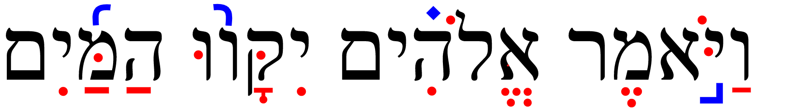

# Copyright {.unnumbered}

Placeholder


<!--chapter:end:index.Rmd-->


# Getting Started / Getting Help {- #intro-a}

Placeholder


## Navigating this book {- #navigating}
## Quick Start Instructions {.unnumbered #get_started}
## A Typical Lesson {- #typical-lesson}
## Report an Issue {- #report_issue}
## Ask a question {- #get_help}

<!--chapter:end:001A-getting-help.Rmd-->


<!--chapter:end:001L-introduction-header.Rmd-->


# About This Course {-}

Placeholder


## Why a Hebrew Grammar course {- #motivation}
## Reasons our Course is Distinct {- #our_course}
## Relationship to _Hebrew Quest_ {- #hgq_and_hq}
###  FAQ about the two courses {-}

<!--chapter:end:001N-introduction.Rmd-->


# (PART) Hebrew Grammar Foundations {-}
# The Hebrew Aleph-bet {#alephbet}

Placeholder


## First Thought {-}
### שֵׁם יְהוָה אֶקְרָא {-}
## The Hebrew Aleph-Bet {#consonants}
## Hebrew is written and read from RIGHT-to-LEFT {#right_to_left}
## Five "KiMNePaTZ" letters have different final forms {#sofit_letters}
## Six" BeGaD KePHaT" letters take a Daghesh Lene {#daghesh_lene}
## We classify four consonants as **Gutturals** (and one is a sometimes-guttural) {#gutturals}
## We classify ten consonants as "SQiN eM LeVY"
## Look out for look-alike Letters {#look-alike-letters}
## Sephardic and "Seminary" Pronunciation {#pronunciation}
## Lesson Conclusion and Activities {-}
### Anki {- #anki-1}
### Worksheets: Letter Writing {- #worksheets-1}
## Ruth Pursuit {-}
## Ruth Pursuit Translation Worksheet {-}
## Quest Quiz {-}

<!--chapter:end:01-Alephbet.Rmd-->

# Hebrew Vowels {.vowels}


> To comprehend Biblical Hebrew, we must understand how words are formed and pronounced

Even though our goal may not necessarily be to converse in Biblical Hebrew, hearing the sound of the language aids our learning.  Vowels are what give a language its distinctive sound.  In Hebrew, the same three consonants can change meaning depending on the vowel combination.


```r
library(knitr)

```


As Izzy says in Hebrew Quest, “Vowels are important.”  On your screen, you see Genesis 1:9.  The black font shows the text with no vowels. Over time, a group known as the Masorites developed the vowel notation we use today. These are the symbols in red.  These are usually under, but sometimes in the middle of or over the affected consonant. This vowel system intends to preserve the pronunciation passed down for centuries via the oral tradition. The Hebrew name for these diacritical dots and dashes is _nikudot_. The blue font shows additional cantillation marks, which synagogues use for chanting the verses.  These marks also show where the word's accent is.<small>^[<small>Image Source: Originally uploaded as en:File:Example of biblical Hebrew trope.svg on 04:27, 19 November 2006 (UTC) by en:User:SyntaxError55. </small>]</small>

::: {.infobox .map}
**LESSON ITINERARY**

1. Memorize vowels that are not vowel letters
1. Learn vocal Sheva and silent Sheva
1. Memorize the vowel letters
1. Meet "defective" and "plene" spelling 
1. Meet Dagesh Lene's twin, Dagesh Forte
1. Know the rule for a Dagesh Forte
1. Know that the Gutturals and Resh reject Dagesh Forte
::: 

::: {.infobox .stop}
**EQUIPMENT CHECK**

Before continuing, can you recite the following groups of letters from memory?

* All twenty-two consonants of the Hebrew Aleph-Bet 
* The six BeGaD KePHaT letters
* The five KiMNePaTZ letters
* The four guttural letters and the one sometimes-guttural letter
:::

## First Thought {-}

###  הֵמָּה רָאוּ מַעֲשֵׂי יְהוָה {-}

*They have seen the works of Adonai (Psalms 107:24)*

Reflect on the works of HaShem that you have seen.

<figure>
    <figcaption>Listen to this verse in Hebrew, then say it out loud:</figcaption>
    <audio
        controls controlsList="nodownload"
        src="./images/02.ps107024.mp3">
            Your browser does not support the
            <code>audio</code> element.
    </audio>
</figure>

*****


```r
knitr::include_graphics("images/02-Plain of Bethsaida with green grass, tb110206630.jpg")
```

<div class="figure" style="text-align: center">

<p class="caption">(\#fig:unnamed-chunk-2)Plain of Bethsaida - suggested location where 5000 saw the works of Yeshua (Mark 6). Courtesy of the [Pictorial Library of Bible Lands](https://www.bibleplaces.com)</p>
</div>


## Vowels that are not vowel letters {#vowels}

### Vowels come in three types: Long, Short, Reduced | Vowels come in five classes: A, E, I, O, U {-}

* Like we memorized the Aleph-bet, we will commit the vowels in the table below to memory
* Study the table below before doing the drills in `Anki` 
  * Knowing the vowel types (Long, Short, Reduced) and classes will make your grammatical life much more comfortable in the future
  * The letter בּ is provided as a placeholder for the long/short vowels; ע represents any Guttural for the reduced vowels, since only Gutturals take the Reduced vowels
* Say the vowel _after_ saying the associated consonant<small>^[<small>We will learn that Hebrew loves to break the rules.  In the next lesson, we will learn about an exception to the "vowel comes after" rule, called the *furtive patach*.</small>]</small> So the first vowel example is "qaw" not "awq".
*  Future lessons will explain the difference between Qamets and Qamets Hatuf

Type | Class | Hebrew | Name | Pronunciation
| :-: | :-: | :-: | :-: | :-: 
Long | A | <span class="he">בָּ</span> | Qamets | father
Long | E | <span class="he">בֵּ</span> | Tsere | they
Long | O | <span class="he">בֹּ</span> | Holem | role
Short | A | <span class="he">בַּ</span> | Patach | father
Short | E | <span class="he">בֶּ</span> | Seghol | better
Short | I | <span class="he">בִּ</span> | Hireq | bitter
Short | O | <span class="he">בָּ</span> | Qamets Hatuf | role
Short | U | <span class="he">בֻּ</span> | Qibbuts | ruler
Reduced | A | <span class="he">ֲע</span> | Hateph Patach | amuse
Reduced | E | <span class="he">ֱע</span> | Hateph Seghol | metallic
Reduced | O | <span class="he">ֳע</span> | Hateph Qamets Hatuf | commit

::: {.infobox .info}
Only **gutturals** take the "Hateph" vowels - to make it easier, we can pronounce all three Hateph vowels like the A in <u>A</u>muse

Hateph vowels are used because Gutturals reject vocal Sheva 
:::


## Vocal and Silent Sheva {#Sheva}

* The Sheva can be tricky to grasp at first, since vocal and silent Sheva are written the same, but have two very different uses
* Both are written as קְ
  * Both mark the END of a syllable
* VOCAL Sheva<small>^[<small>Many academic textbooks will use the term "Shewa" instead of "Sheva". Both words mean the same thing.</small>]</small> is a REDUCED vowel, but does NOT have a vowel Class
  *  Only non-gutturals can take a Vocal Sheva
      * Gutturals **reject** the Vocal Sheva and take the Hateph vowels instead
    * Pronounced like the A in <u>A</u>muse (same as Hateph Patach)
* SILENT Sheva is not a reduced vowel, in fact, it is NOT A VOWEL AT ALL
    * <u>Any</u> letter, including Gutturals can take a Silent Sheva
    * Silent/ No sound
* We will learn how to distinguish between the two kinds of Sheva in the next lesson

Type | Class | Hebrew | Name | Pronunciation
| :-: | :-: | :-: | :-: | :-: 
Reduced | No Class | <span class="he">ְבּ</span> | Vocal Sheva | amuse
Not a Vowel | | <span class="he">ְבּ</span> | Silent Sheva | No pronunciation

::: {.box .info}
The Sof Pasuq

* It is worth pointing out that in Hebrew Bibles, we may come across a mark that looks like a super-sized Sheva
* In English, we might say it looks like a giant colon mark (:)
* In Hebrew, this mark is called a Sof Pasuq, and it is used to mark the end of the verse
* Other than this, the mark has no meaning for us whatsoever.  You may ignore it when you encounter it.
:::

## Vowel letters {#vowel_letters}

### Vowel letters use a consonant plus a nikkud to form a vowel {-}

Another table to memorize:


```r
include_graphics("images/02.vowels_letters.png")
```


* Shureq is pronounced like Qibbuts (r<u>u</u>ler)
* Hireq Yod is pronounced like the i in mach<u>i</u>ne
* All others are pronounced like their non-vowel-letter counterparts
* Yod and Vav vowels - י,ו 
    * These are Long Vowels that do not reduce
    * Therefore they are called, "Unchangeable long vowels"<small>^[<small>We'll explain what this means in the next lesson</small>]</small>
    * These occur in the middle or at the end of a word

::: {.infobox .info}
If the Yod or Vav has a vowel of it's own, then the Yod/Vav is acting as a _consonant_, not an irreducible long vowel.
:::

* Hei Vowels - ה
    * Seghol Hei is a short vowel - the other Hei vowels are long
    * Hei vowels **ONLY** occur at the end of a word (often called "word-final hei")
    * Hei vowels are extremely common in Hebrew

## Transliteration Shorthand

* Most Hebrew grammar books include transliteration values
* While learning the transliteration scheme can help in some instances, our general position is that it can be an unnecessary distraction
* Where it can be useful is as shorthand
  * It would get wordy to write "holem vav" repeatedly
  * It's much less clutter to write the shorthand version based on transliteration: $\hat O$
* As we move forward in the course, particularly in unit three, we will be making use of the vowel shorthand listed below

::: {.map. info}
* Short Vowels (no marking): $A$ for Patach, $E$ for Seghol, and so forth for the remaining short vowels
* Long Vowels (bar): $\bar A$ for Qamets, $\bar E$ for Tsere, and $\bar O$ for Holem
* Reduced Vowels (breve): $\breve A$ for Hateph Patach, $\breve E$ for Hateph Seghol, $\breve O$ = Hateph Qamets Hatuf
* Unchangeable Long Vowels (hat): $\hat E$ = Tsere+Yod, $\hat I$ = Hireq_+Yod; $\hat O$ = Holem+Vav; $\hat U$ = Shureq
* Additionally, the ending Qamets+He = $\hat A$ and Sheva = $ə$
:::

You do NOT need to memorize this.  We will review the values as we get into Unit 3.

## "Defective" and "plene" spelling {#defective_spelling}

In "defective" spelling, letter vowels can sometimes drop their letter and take on the corresponding non-letter vowel. The meaning of the word doesn’t change.

This is the word for "laws" showing both "plene" spelling (left) and "defective" spelling (right):


```r
knitr::include_graphics("images/defective.gif")
```


* Three vowel letters commonly take "defective" forms<small>^[<small>"Defective", in this sense, does not have a negative connotation.</small>]</small>
    * Holem-vav can drop the Vav and contract to Holem, as in the example above
    * Hireq-Yod can drop the Yod and contract to Hireq
    * Shuruq can drop the Vav and it's associated nikkud and contract to Qibbuts
    
The qamets-hei <span class="he">ה ָ  </span>sometimes drops the final ה, leaving just the qamets under the now-final letter.

::: {.infobox .info}    
As you progress, you’ll start to develop a mental checklist when you encounter something that does not seem to follow the normal/regular rules. Asking yourself “Could this be a defective spelling?” will be one of those checklist items.
:::

::: {.box .caution}
An unchangeable long vowel written defectively is still an unchangeable long vowel


* A Qibbuts that is _not_ defective is a short vowel
* A Qibbuts that is a defective Shureq is an unchangeable long vowel

For now, do not be concerned about the difference.  As we progress in the course, you will see this in action.
:::

## The Dagesh Forte Doubles the Consonant {#dagesh_forte}

Notice the שּׁ in <span class="he">הַשָּׁמַיִם:</span>


```r
knitr::include_graphics("images/02.daghesh_forte.gif")
```


 
* Since שׁ is not a בגד כפת letter, we know this *cannot* be a Dagesh Lene, but it is a Dagesh **Forte**
* The letter with the Dagesh Forte both ends one syllable and begins the next syllable
* If we were to syllabify <span class="he"> הַשָּׁמַיִם</span>, it would look something like the bottom line in the picture above (pronounce: `hash-sha-mayim`)<small>^[<small> `Mayim` is one syllable as we will learn in Lesson 3.  <span class="he">הַשָּׁמַיִם</span> means "the heavens."  From now on, we won't always provide a translation for every new word you encounter.  It's more important that you focus on the concepts.  You will have PLENTY of vocabulary work in Anki!</small>]</small>
* A similar word in English might be better = bet | ter
    * If we were to transliterate better into Hebrew hypothetically,  it might look like: בּטֶּר*<small>^[<small>The * means this is not a real Hebrew word, but we show it in this form for illustration.</small>]</small>
* Notice the syllable breaks in these words that have a Dagesh Forte:

```r
include_graphics("images/02.forte.png")
```


* Any consonant (except for Gutturals and Resh) can take a Dagesh Forte, including a בגד כפת letter, which can take either a Dagesh Lene or a Dagesh Forte
    * The "Buck-up" letters will take the **hard** pronunciation regardless of a Dagesh Lene or Dagesh Forte - See the final word אַתָּה in the image above
    * "Any consonant" includes the Vav ו.  When a Vav has a Dagesh Forte it looks like this וּ. Does that remind you of anything?  Maybe something we just discussed on the previous page?
        * That's right. A Vav with a Dagesh Forte וּ is identical to a Shurek וּ.
        * It's surprisingly easy to tell the difference: if there is an additional vowel either under or over the same letter, or if the preceding consonant has a vowel, the letter is a Vav with Dagesh.  A Shurek will _never_ have a separate vowel following or preceding.

_Advanced tip:_ When you see a Dagesh Forte, it often means that another letter has disappeared<small>^[<small>Not entirely unlike the English apostrophe in words like _can't_.</small>]</small>.  We will talk more about this later in the course.

::: {.infobox .info}
It's good to think of the Dagesh Forte as the "Doubling Dagesh" since it doubles the consonant and often changes a word's meaning.  

Conversely, we can think of the Dagesh Lene as the "Meaningless Dagesh", since it does not ever change a word's meaning
:::


## Dagesh Forte Rule {#dagesh_forte_in_bgdkpt}

::: {.infobox .light} 
A Dagesh is a Forte if, and only if, it's preceded by a vowel that is not a Sheva<small>^[<small>Remember we said in the introduction that content in "light" information boxes should usually be memorized.  You will want to memorize the Dagesh Forte rule.</small>]</small>
:::

That's it.  That's the rule<small>^[<small>Strictly speaking, there are exceptions.  We only have one in this course and we won't see it until Unit 4.</small>]</small>.  

Quiz yourself with these examples (answers below):

* <span class="he">אַתָּה</span> = Is the Dagesh preceded by a vowel that is not a Sheva?<small>^[<small>Yes, a patach. Dagesh Forte</small>]</small>
* <span class="he">בְּרֵאשִׁית</span> = Is the Dagesh preceded by a vowel that is not a Sheva?<small>^[<small>No. Dagesh Lene</small>]</small>
* <span class="he">עַל־פְּנֵי</span> = Is the Dagesh preceded by a vowel that is not a Sheva?<small>^[<small>No. Dagesh Lene.  The "hyphen" looking mark is called a Maqquef.  It has the same function as the Hyphen does in English.</small>]</small>
* <span class="he">מַבְדִּיל</span> = Is the Dagesh preceded by a vowel that is not a Sheva?<small>^[<small>No, it is preceded by a Sheva. Dagesh Lene.</small>]</small>
* <span class="he">מִתַּחַת</span>  = Is the Dagesh preceded by a vowel that is not a Sheva?<small>^[<small>Yes, a Hiriq. Dagesh Forte</small>]</small>


## Gutturals and Resh reject Dagesh Forte {#gutturals_reject_dagesh_forte}

* We said in Lesson One that the Gutturals don’t play nice with the other Hebrew Rules, and this rejection of the Dagesh Forte is one of those ways
* A Hebrew collision like this means something has to give. . . and the gutturals tend to get their way.
* It's like they have a force-field shielding them from other Hebrew grammar rules!


```r
knitr::include_graphics("images/02.reject.gif")
```

<div class="figure" style="text-align: center">

<p class="caption">(\#fig:unnamed-chunk-7)That's no moon.  That's a Guttural!</p>
</div>

* A large chunk of any Hebrew grammar course involves learning to resolve these guttural entanglements

::: {.box .caution}
MAPPIQ

* You may see הּ. This dot is not a Dagesh, because we just learned that gutturals never take a Dagesh but what is called a Mappiq. 
* A word final ה is typically a vowel
* A Mappiq signifies that a word-final ה is a consonant, not a vowel
* We'll talk more about the mappiq in Lesson 6
:::

## Lesson Conclusion and Activities {-}

Congratulations on completing the vowels lesson.  Make sure you memorize the vowel classes, the Dagesh Forte rule, and the guttural behavior.  

We're about halfway through the first stage of the course on Hebrew Grammar Foundations.  Keep going! You're doing great!  After you finish all of the activities for this lesson, you can claim the first of our `Twelve Tribes Badges`. 

Take a moment to review the section headings on the left side of the screen before heading on to tackle the activities.


### Anki {-}

* `Lesson 02 A. Vocab`
* `Lesson 02 B. Grammar` 
* `Lesson 02 D. Study Verses`
  * Bible verses will arrive next Lesson
  * In this module, we will be learning common Hebrew names.
  * Sound out the words using your knowledge of Hebrew consonants and vowels.
  * As a general hint, with a couple of exceptions, the English names are pretty close to how they sound in Hebrew.
  
Access Anki using your mobile app, desktop version, or [the web-based version (login may be required)](https://ankiweb.net/decks/)


### Vowel worksheet {-}

* Practice writing the vowels using the [Vowel Writing worksheet/drill](https://drive.google.com/file/d/1ETPKE3u-XGfpNdKmlIr3P_DRbkOOlcI_/copy){target="_blank"}. See note<small>^[<small>An answer key is on page two.  Repeat this worksheet until you can complete it correctly entirely from memory. The translation column is optional.</small>]</small>


## Ruth Pursuit {-}

::: {.box .map}
YOUR QUEST

1. Identify the four UNCHANGEABLE LONG vowels that use YOD in Verse 1 (blue)<small>^[<small>In most word processors, you won't be able to isolate the vowel to highlight. Get as close as you can.</small>]</small>|
2. Identify the two UNCHANGEABLE LONG vowels that use VAV in Verse 1 (Green)
3. Identify QAMETS HEI in Verse 1.  There is a TSERE Hei between Verses 5-10.  Can you find it?<small>^[<small>The other vowels that use hei are less common, but we will see them when we discuss verbs.</small>]</small> (Purple)
4. Identify the three LONG vowels in Verse 1 (that are not part of a vowel letter) (pink)|
5. Identify three of the five SHORT vowels in Verse 1 (that are not part of a vowel letter)<small>^[<small>We haven't learned to spot Qamets Hatuf yet, and Qibbuts does not appear in this passage</small>]</small> (red)
6. Five the three REDUCED/HATEPHH vowels, including Hateph Qamets Hatuf<small>^[<small>You should be able to make out the word that has the Hateph Qamets Hatuph</small>]</small>.  They are in verses 2-4. (grey)
7. One of the more common verbs in the Tanach is <span class="he">וַיֹּאמֶר</span>, which means "(and) he said.     * Vav-Patach-**Yod**-Dagesh Forte --וַיּ to start a verb means "And he (did or was something)  
    * If we change the second consonant from a Yod to a **Tav**, we get --וָתּ, "and **S**he (did or was something).  
    * Thus, <span class="he">וַתֹּאמֶר</span> means "and she said."  
    * Challenge: Find the five instances of <span class="he">וַתֹּאמֶר</span> in Ruth Chapter 1<small>^[<small>In at least three of the cases, you should be able to figure out who is speaking.</small>]</small>  (yellow)  
:::

* [Blank copy of Ruth Chapter 1](https://docs.google.com/document/d/1bcT1J-fcVmD1Zn5Jk2nj0560tEddcgtbYZLkwaVVuyE/copy){target="_blank"}
* [Ruth Pursuit Answer Key #2](./images/02_Ruth_Pursuit_KEY.pdf){target="_blank"}
* Update your Ruth Translation worksheet with <span class="he">וַתֹּאמֶר</span> = "and she said"        

## Quest Quiz {-}

[Open Quest Quiz #2 in a new window](https://docs.google.com/forms/d/e/1FAIpQLSeq_9Cy5IlAKDFy8nx9GNC3dfs5l5bJ_iX2FJ0Az7rPKXq5Jw/viewform){target="_blank"}


<div class="containerLet">
<iframe class="responsive-iframe" src="https://docs.google.com/forms/d/e/1FAIpQLSeq_9Cy5IlAKDFy8nx9GNC3dfs5l5bJ_iX2FJ0Az7rPKXq5Jw/viewform?embedded=true" frameborder="0"></iframe>
</div>

## Claim your `Twelve Tribes Badge`! {- #twelve-tribes-badge-1}

If you have completed **all activities** in Lessons 1 and 2, you may claim the first of our "Twelve Tribes" badges<small>^[<small>Once published, the full thirty-five lesson course will have a badge to be claimed after every two to three lessons.  There is only one badge available in the preview version of the course.</small>]</small>.

<div class="containerLet">
<iframe class ="responsive-iframe" src="https://docs.google.com/forms/d/e/1FAIpQLSeFujHNSMAZ5ZjJbNsr7pFJnma5RGwG-7StAR1uvevGe_5zvg/viewform?embedded=true" frameborder="0"></iframe>
</div>

<!--chapter:end:02-Vowels.Rmd-->


# Syllabification and Pronunciation {#Syllabification}

Placeholder


## First Thought {-}
###  אַשְׁרֵי אָדָם לֹא יַחְשֹׁב יְהוָה לוֹ  {-}
## Hebrew Syllables {#syllables}
## Hebrew Word Accents {#accents}
## Tonic, Pretonic, and Propretonic Syllables
## Ultima, Penultima, and Antepenultima syllables
## Rules for Silent Sheva {#s_sheva}
### A Sheva is SILENT when the previous vowel is short: {-}
### A Sheva is SILENT when the first of two consecutive Shevas _within a word_: {-}
### A Sheva is SILENT when at the end of a word: {-}
## Rules for Vocal Sheva {#v_sheva}
### A Sheva is VOCAL when the initial Sheva in a word: {-}
### A Sheva is VOCAL when the second of two consecutive Shevas _within a word_<small>^[<small>A Sheva at the **end** of a word is **always silent**, even when it is the second of two consecutive Shevas.</small>]</small>:  {-}
### A Sheva is VOCAL when under a Dagesh Forte: {-}
### A Sheva is VOCAL after an unaccented long vowel: {-}
## Hebrew Diphthong = Accented Patach-Yod-Hireq {#diphthong}
## Vowels and Syllable Preference {#vowel_pref}
## Qamets Hatuf, Furtive Patach, Quiescent Aleph {#misc_vowels}
## Qamets Hatuf
## Furtive Patach 
## Quiescent Aleph
## Lesson Conclusion and Activities {-}
### Introduction to Video Warm-ups {-}
## Word Warm-up {-}
## Verses Warm-up {-}
## Ruth Pursuit {-}        
## Quest Quiz {-}

<!--chapter:end:03-Syllabification.Rmd-->


# (PART) Nouns, Prepositions, Pronouns {-}
# Hebrew Nouns {.Nouns}

Placeholder


## First Thought {-}
### רְאֵה לִמַּדְתִּי אֶתְכֶם חֻקִּים וּמִשְׁפָּטִים {-}
## Gender and Number {#gender_number}
## Parsing vs. Inflecting
## Singular Noun Endings {#sing_noun_endings}
## Plural Noun Endings {#noun_pluralization}
## Dual Noun Endings
## Special dual forms {#dual_forms}
## Irregular Pluralization  {#irregular_pluralization}
### Segholate Nouns follow a standard vowel pattern when pluralizing {-}
### Geminate Words take a Daghesh Forte {-}
## Rule of Sheva {#rules_sheva}
## Lexical Form {#lexical_form}
## Word Warm-up {-}
## Verses Warm-up {-}
## Anki {-}
## Ruth Pursuit {-}        
## Quest Quiz {-}

<!--chapter:end:04-NounsPlural.Rmd-->


# Definite Article and Conjunction Vav {.Article}

Placeholder


## First Thought {-}
### <span class="he">מִי־מָדַד בְּשָׁעֳלוֹ מַיִם וְשָׁמַיִם</span> {-}
## Translate the Vav Conjunction {#vav_translate}
## Identify the Vav Conjunction {#vav_identify}
## Loss of Dagesh Forte {#loss_Dagesh_forte}
## Compensatory Lengthening
## Translate the Article {#article_translate}
## Identify the Article {#article_identify}
## Hebrew Indefiniteness {#indefiniteness}
## Other Hebrew Definiteness {#definiteness}
## Lesson Conclusion and Activities {-}
## Word Warm-up {-}
## Verses Warm-up {-}
## Anki {-}
## Ruth Pursuit {-}        
## Quest Quiz {-}
## Claim your next `Twelve Tribes Badge`! {-}

<!--chapter:end:05-DefArt_Conjunction.Rmd-->


# Hebrew Prepositions

Placeholder


## First Thought {-}
### <span class="he">  בְּיוֹם צָרָתִי אֲדֹנָי דָּרָשְׁתִּי </span> {-}
## Nun with Silent Sheva Becomes Dagesh Forte
## Independent and Maqqef prepositions 
## Inseparable prepositions
## The Article and Inseparable Prepositions
## The flexible <span class="he">מִן</span>: construction
## The Article and מִן
## The flexible <span class="he">מִן</span>: meanings 
## The Definite Direct Object marker 
## Review and Activities {-}
### Anki {-}
## Word Warm-up {-}
## Verses Warm-up {-}
## Ruth Pursuit {-}        
## Quest Quiz {-}

<!--chapter:end:06-Prepositions.Rmd-->


# Hebrew Adjectives

Placeholder


## First Thought {-}
### <span class="he">אֶת־הַכֹּל עָשָׂה יָפֶה בְעִתּוֹ</span> {-}
## Inflecting Adjectives
## Substantival Use
## Attributive Use
## Predicative Use
## Adjective Use Summary
## The Mappiq 
## The Directional Ending 
## Word Warm-up {-}
## Verses Warm-up {-}
## Anki {-}
## Ruth Pursuit {-}        
## Quest Quiz {-}
## Claim your next `Twelve Tribes Badge`! {-}

<!--chapter:end:07-Adjectives.Rmd-->


# Hebrew Pronouns

Placeholder


## First Thought {-}
### <span class="he">זֶה הַדֶּרֶךְ לְכוּ בוֹ</span> {-}
## Independent Personal Pronoun
## Relative Pronoun <span class="he">אֲשֶׁר</span>
## Interrogative Pronoun
## Interrogative Particle <span class="he">הֲ</span>
### Interrogative Particle vs Definite Article {-}
## Near and Far Demonstratives
## Demonstrative Adjective 
## Demonstrative Pronoun
## Conclusion and Intro to Activities {-}
## Word Warm-up {-}
## Verses Warm-up {-}
## Anki {-}
## Worksheets: Pronouns {-}
## Ruth Pursuit {-}        
## `Quest Quiz` {-}

<!--chapter:end:08-Pronouns.Rmd-->


# Hebrew Pronominal Suffixes

Placeholder


## First Thought {-}
### <span class="he">וַיֹּאמְרוּ שָׁאוֹל שָׁאַל־הָאִישׁ לָנוּ וּלְמוֹלַדְתֵּנוּ </span> {-}
## Meaning
## Type 1 vs Type 2 Suffixes
## Singular Suffixes
## Plural Suffixes
## Distinguish Type 1 from Type 2
## Lexical Form with Type 1
## Lexical Form with Type 2
## Unexpected changes
## Look-alike words: <span class="he">אֵת</span> as "with" or as Definite Direct Object (DDO) marker
## Look-alike words:   <span class="he">עִם</span>, "with", or <span class="he">עַם</span>, "people" 
## Look-alike words: <span class="he">אֵל</span>, "God", or <span class="he">אֶל</span>, "to"
## Word Warm-up {-}
## Word Warm-up: pronominal suffixes {-}
## Verses Warm-up {-}
## Anki {-}
## Worksheets: Pronominal Suffixes {-}
## Ruth Pursuit {-}        
## `Quest Quiz` {-}

<!--chapter:end:09-Pronominal_Suffixes.Rmd-->


# Hebrew Construct Chain {.ConstructChain}

Placeholder


## First Thought {-}
### <span class="he">בְּצֶדֶק כָּל־אִמְרֵי־פִי</span> {-}
## What is a Construct Chain?
## What makes a construct chain
## Review: what makes a word definite 
## The Absolute noun establishes the definiteness of a chain
## How to Recognize a Construct Chain
## Identifying Construct state by Noun Endings
## Construct Chain Summary
## Word Warm-up {-}
## Verses Warm-up {-}
## Anki {-}
## Worksheets: Construct Identification {-}
## Ruth Pursuit {-}        
## Quest Quiz #10 {-}
## Claim your next `Twelve Tribes Badge`! {-}

<!--chapter:end:10-ConstructChain.Rmd-->


# Hebrew Numerals

Placeholder


## First Thought {-}
## The Biblical text always spells out numbers
## Notes and footnotes use symbols for numbers
## Hebrew Ordinal Numbers
### Hebrew Quest Ordinal Numbers Video {-}
## Cardinal Numbers 1-10
### Digits 1 and 2 match the gender of the noun {-}
### Digits 3-10 take the opposite gender of the noun {-}
## Cardinal Numbers Above 10
## Conclusion
### Anki {-}
## Word Warm-up {-}
## x Verses Warm-up` {-}
## Ruth Pursuit {-}        

<!--chapter:end:11-Numerals.Rmd-->


# (PART) Qal Binyanim {-}
# Introduction to Unit 3 {-}

Placeholder


## Vowel Transliteration/Shorthand
## Word Initial Combinations
## Changes for Unit 3: No more quizzes!
## Changes for Unit 3: Cantillation Marks added to Study Verses {-}
## Changes for Unit 3: OPTIONAL Hebrew Quest Study Passage Translation{-}
## Keep going! {-}

<!--chapter:end:11b-Unit3_Intro.Rmd-->


# Introduction to Hebrew Verbs

Placeholder


## First Thought {-}
### <span class="he">וְהֽוּא־הָלַ֤ךְ בַּמִּדְבָּר֙ דֶּ֣רֶךְ י֔וֹם </span> {-}
## The Verbal Root
## Person, Gender, Number
## Verb nomenclature
## Preformatives, Sufformatives, Prefixes, and Suffixes
## Verbal Vowels
## The Seven Hebrew Verb Stems
## The Seven Stems: Summary Table
## The Eight Basic Conjugations
## Finite vs Non-Finite Conjugations
## Parsing
## Parsing Codes
## Strong and Weak Verbs
## Weak Verb Classes
## Hebrew GRAMMAR Quest is a Quest for RECOGNITION NOT RECALL
## A note on the paradigm strong verb <span class="he">קטל</span>
## Word Warm-up {-}
## Verses Warm-up {-}
## Anki {-}
## Ruth Pursuit {-}        
## OPTIONAL: _Hebrew Quest_ Study Passage Track: Proverbs Study #1-4 {-}

<!--chapter:end:12-Verbs_Intro.Rmd-->


# Qal Perfect - Strong Verbs {.QP-s}

Placeholder


## First Thought {-}
### <span class="he">לֹא־שָׁמְר֤וּ אֲבוֹתֵ֙ינוּ֙ אֶת־דְּבַ֣ר יְהוָ֔ה </span> {-}
##  Qal is Simple action, Active voice
## Perfect is completed action or a state as a whole
## Components of the Qal Perfect Strong Paradigm
## The Perfect Sufformatives
## Qal Perfect Vowels: $V_1$ is almost always Qamets
## Qal Perfect Vowels: $V_2$ prefers patach
## $V_S$ is accented in Finite verbs
## A Sheva precedes a Finite Sufformative
## Building the Qal Perfect Strong Paradigm
## Hearing the Qal Perfect Strong Paradigm
## Worksheet: Qal Perfect Strong Paradigm {-}
## Qal Perfect Strong Examples
## Deviations from the Paradigm
## 3נ and 3ת Verbs
## Stative Verbs MAY have a different $V_S$
## Word Warm-up {-}
## Verses Warm-up {-}
## Anki {-}
## Ruth Pursuit {-}        
## X Claim your next `Twelve Tribes Badge`! {-}
## OPTIONAL: _Hebrew Quest_ Study Passage: Proverbs #5-7 {-}

<!--chapter:end:13-Qal_Perfect_Strong.Rmd-->


# Qal Perfect - Weak Verbs {.QP-w}

Placeholder


##  First Thought {-}
### <span class="he">בָ֤אָה נַחֲלָתֵ֙נוּ֙ אֵלֵ֔ינוּ מֵעֵ֥בֶר הַיַּרְדֵּ֖ן מִזְרָֽחָה׃</span> {-}
## Review
## 3נ and 3ת with Silent Sheva Assimilate to Dagesh
## Review of Guttural Principles
## 1G, 2G
## 3-ע/ח
## א3 
## <span class="he">יָרֵא</span> is 3א AND Tsere Stative
## 3ה  
## Doubly Weak
## <span class="he">הָיָה</span>
## Geminate
## Biconsonantal
## <span class="he">םוּת</span> is Biconsonantal and Stative
## Qal Perfect Quest Clues
## Clues for Qal Perfect Special Situations
## Word Warm-up {-}
## Verses Warm-up {-}
## Anki {-}
## Ruth Pursuit {-}    
## X Quest Quiz {-}
## OPTIONAL: _Hebrew Quest_ Study Passage: Proverbs #8-10 {-}

<!--chapter:end:14-Qal_Perfect_Weak.Rmd-->


# Qal Imperfect - Strong Verbs {.QI-s}

Placeholder


## First Thought {-}
### <span class="he">יִ֝שְׁמֹ֗ר כָּל־אָרְחֹתָֽי׃ </span> {-}
## Translating the Imperfect
## The Imperfect Always has a Preformative
## Qal Imperfect Vowels
## Imperfect Sufformatives
## Building the Qal Imperfect Strong Paradigm
## Hearing the Qal Imperfect Strong Paradigm
## Worksheets: Qal Imperfect Strong Paradigm {-}
## Qal Imperfect Strong Examples
## Deviations from the Paradigm
## Translating Negative Commands
## Word Warm-up {-}
## Verses Warm-up {-}
## Worksheets: Qal Imperfect Strong Paradigm {-}
## Ruth Pursuit {-}   
## X Quest Quiz {-}
## OPTIONAL: _Hebrew Quest_ Study Passage: Proverbs #11-14 {-}

<!--chapter:end:15-Qal_Imperfect_strong.Rmd-->


# Qal Imperfect Weak {.QI-w}

Placeholder


## First Thought {-}
### <span class="he">וְעֵינֵיכֶ֖ם תִּרְאֶ֑ינָה</span> {-}
## Our Quest
## 2G 
## 3חע
## 3א  
## 3ה 
## 1G
## 1א "Angry Baker"
## Geminate
## Biconsonantal
## 1-Yod 
## הלך 
## <span class="he">יכל</span> takes $V_P = \bar U$
## 1נ Assimilates with Silent Sheva
## לקח
## Doubly Weak
## נתן is 1נ and 3נ
## ראה vs. ירא
## Qal Imperfect Weak Summary
## Word Warm-up {-}
## Verses Warm-up {-}
## Ruth Pursuit {-}   
## X Quest Quiz {-}
## X Claim your next `Twelve Tribes Badge`! {-}
## OPTIONAL:  _Hebrew Quest_ Study Passage: Proverbs #15-17 {-}

<!--chapter:end:16-Qal_Imperfect_Weak.Rmd-->


# Vav Consecutive {.wc}

Placeholder


## First Thought {-}
### <span class="he">וַיַּשְׁכִּ֣מוּ בַבֹּ֔קֶר וַיַּֽעֲל֥וּ אֶל־רֹאשׁ־הָהָ֖ר </span> {-}
## Review of the Conjunction Vav
## Perfect + וְ: Spelling
## Perfect + וְ: Translating
## Imperfect + וְ: Spelling
## Imperfect with Vav often indicates purpose
## Imperfect Waw Consecutive: Spelling (Strong)
## Imperfect Waw Consecutive: Spelling (Weak)
## Imperfect Waw Consecutive: Translation
### Usually translate Iwc as PAST TENSE {-}
## Summary
## Word Warm-up {-}
## Verses Warm-up {-}
## Worksheets: Qal Vav-Consecutive Paradigms {-}
## Ruth Pursuit {-}   
## Hebrew Quest Study Passage: Genesis 1:1-5 {-}
## X Quest Quiz {-}
## X Claim your next `Twelve Tribes Badge`! {-}

<!--chapter:end:17-Vav_Consecutive.Rmd-->


# Qal Imperative {.QM}

Placeholder


## First Thought {-}
### <span class="he">וְעַתָּ֣ה יִשְׂרָאֵ֗ל שְׁמַ֤ע אֶל־הַֽחֻקִּים֙ וְאֶל־הַמִּשְׁפָּטִ֔ים אֲשֶׁ֧ר אָֽנֹכִ֛י מְלַמֵּ֥ד אֶתְכֶ֖ם לַעֲשׂ֑וֹת</span> {-}
## Volitional Forms Introduction
## Negative Commands use the Jussive or the Imperfect
## The Imperative is the Imperfect withoug the Imperfect Preformative
## Identifying QM
## <span class="he">נָה</span> can follow volitional verbs
## Distinguishing QM2ms, QI3ms, and QP3ms
## Paragogic ה 
## 3ה Verbs
## 1נ and 1י
## Biconsonantal and Geminate
## QP3ms and QP2ms
## QP3mp and QP2mp
## Cohortative and Jussive
## Some weak verbs often shorten the Jussive singular
## Word Warm-up {-}
## Verses Warm-up {-}
## Worksheets: Qal Volitional Forms {-}
## Ruth Pursuit {-}   
## Hebrew Quest Study Passage: The Shema {-}
## X Quest Quiz {-}
## X Claim your next `Twelve Tribes Badge`! {-}

<!--chapter:end:18-Qal_Imperative_strong.Rmd-->


# Pronominal Suffixes on Verbs {.VerbSuffix}

Placeholder


## X First Thought {-}
### X <span class="he">אֲנִֽי־קְרָאתִ֣יךָ כִֽי־תַעֲנֵ֣נִי אֵ֑ל הַֽט־אָזְנְךָ֥ לִ֝֗י שְׁמַ֣ע אִמְרָתִֽי׃</span> {-}
## Hebrew Direct Object Pronouns
## Verbs use Type 1 Suffixes
## QP Vowel Changes
## QI Vowel Changes 
## QM Vowel Changes
## Imperative/Perfect Ambiguity when normal Imperative $V_S = A$
## X <stem> Verb Stem Table 
## X <stem> Meanings
## X <stem> Strong Word-initial Combinations 
## X <stem> Strong Stem Vowels 
## X <stem>: what to memorize
## X <stem> Perfect Strong
## X <stem> Imperfect Strong
## X <stem> Imperative Strong
## X <stem> Infinitives Strong
## X <stem> Participle Strong
## X <stem> Parsing Examples
## Word Warm-up {-}
## Verses Warm-up {-}
## Ruth Pursuit {-}        
## Hebrew Quest Study Passage: Matthew 6 {-}
## X Quest Quiz {-}
## X Claim your next `Twelve Tribes Badge`! {-}

<!--chapter:end:19-Pronominal_Suffix_Verbs.Rmd-->


# Qal Infinitive Construct {.Qinfinitive}

Placeholder


## First Thought {-}
###  <span class="he">וְשָׁ֣מַרְתָּ֔ אֶת־מִצְוֺ֖ת יְהוָ֣ה אֱלֹהֶ֑יךָ לָלֶ֥כֶת בִּדְרָכָ֖יו וּלְיִרְאָ֥ה אֹתֽוֹ׃</span> {-}
## Two types of Infinitives
## Q∞ Spelling
## 3ה Endings
## 1י and 1נ Spelling
## Biconsonantal
## Q∞ often is identical to QM2ms
## ∞ take Type 1 Pronominal Suffixes
## Most ∞ have a prefixed preposition
## Meaning of ∞
## Negating the Infinitive
## Word Warm-up {-}
## Verses Warm-up {-}
## Ruth Pursuit {-}   
## Hebrew Quest Study Passage: Genesis 22:1-19 {-}
## X Quest Quiz {-}
## X Claim your next `Twelve Tribes Badge`! {-}

<!--chapter:end:20-Qal_Infinitive_Construct.Rmd-->


# Qal Infinitive Absolute {.QA}

Placeholder


## First Thought {-}
### <span class="he">אָנֹכִ֗י אֵרֵ֤ד עִמְּךָ֙ מִצְרַ֔יְמָה וְאָנֹכִ֖י אַֽעַלְךָ֣ גַם־עָלֹ֑ה</span> {-}
## QA
## 3ה endings
## Meaning of Infinitive Absolute
## Infinitive Construct vs Infinitive Absolute
## **יֵשׁ *** and **אֵין *** 
## Word Warm-up {-}
## Verses Warm-up {-}
## Ruth Pursuit {-}   
## Hebrew Quest Study Passage: Numbers 6: Priestly Blessing {-}
## X Quest Quiz {-}
## X Claim your next `Twelve Tribes Badge`! {-}

<!--chapter:end:21-Qal_Infinitive_Absolute.Rmd-->


# Qal Participle {.QPt}

Placeholder


##  First Thought {-}
###  <span class="he">וְיִבְטְח֣וּ בְ֭ךָ יוֹדְעֵ֣י שְׁמֶ֑ךָ כִּ֤י לֹֽא־עָזַ֖בְתָּ דֹרְשֶׁ֣יךָ יְהוָֽה׃ </span> {-}
## Participles are Verbal Adjectives
## Qal Participle
## Prefixes and Suffixes
## Biconsonantal 
## 3ה were originally 3י
### We can now complete our 3ה $V_2$ table {-}
## Stem Comparison Table
## Word Warm-up {-}
## Verses Warm-up {-}
## Worksheets: All Qal Paradigms {-}
## Ruth Pursuit {-}        
## Hebrew Quest Study Passage: Matthew 13 {-}
## X Quest Quiz {-}
## X Claim your next `Twelve Tribes Badge`! {-}

<!--chapter:end:22-Qal_Participle.Rmd-->


# Hebrew Syntax {.Syntax}

Placeholder


## First Thought {-}
### <span class="he">עַתָּה יָדַעְתִּי כִּי־גָדוֹל יְהוָה מִכָּל־הָאֱלֹהִים</span> {-}
## Clause versus Sentence
## Word order
## Perfect Syntax
## Imperfect Syntax
## Volitional Syntax
## Conditional Phrases
## Disjunctive Vav
## Adverbs
## Word Warm-up {-}
## Verses Warm-up {-}
## Ruth Pursuit {-}        
## Hebrew Quest Study Passage: Psalm 19 {-}

<!--chapter:end:23-Hebrew_Syntax.Rmd-->


# (PART) Derived Binyanim {-}
# Introduction to Unit 4 {-}

Placeholder


## Lessons 24-35 {-}
## Ruth Pursuits {-}
## Review: Vowel and Consonant Shorthand
## Review: Stem Vowel is the Vowel with the 2nd Root Consonant
## Stem Vowel Pattern Nomenclature
## Review: Sheva before Finite Verb Endings

<!--chapter:end:23b-Unit4_Intro.Rmd-->


# The Niphal Stem - Strong Verbs

Placeholder


## First Thought {-}
### <span class="he"> וּמִן־הַגָּדִ֡י נִבְדְּל֣וּ אֶל־דָּוִיד֩ לַמְצַ֨ד מִדְבָּ֜רָה</span> {-}
## Niphal Verb Stem Table
## Niphal Meanings
## Parsing Clues - _Pre_:  the נ prefix is added to EVERY conjugation
## Parsing Clues - $V_S = A \sim \bar E(A)$
## What to memorize for all Derived Stems {-}
## What to memorize for Niphal 
## Paradigm: Niphal Perfect Strong
## Paradigm: Niphal Imperfect Strong
## Paradigm: Niphal Imperative Strong
## Paradigm: Niphal Infinitives Strong
### Derived Stem Infinitive Absolute $V_S = \bar E$ (usually) {-}
## Paradigm: Niphal Participle Strong
### Derived Stem Participle $V_S =$ the P3ms Vowel, lengthened if possible (usually) {-}
## Participle Prefixes in the Derived Stems
## Forms with Identical Spelling
## Easily Confused Forms
## Niphal Parsing Examples
## Stem Comparison Table
## Word Warm-up {-}
## Verses Warm-up {-}
## Worksheets: Niphal Strong Paradigm {-}
## Hebrew Quest Study Passage: Numbers 15 {-}

<!--chapter:end:24-Niphal_Strong.Rmd-->


# The Niphal Stem - Weak Verbs {.N-w}

Placeholder


## First Thought {-}
###  <span class="he">וְקָרְא֥וּ לָהֶ֛ם עַם־הַקֹּ֖דֶשׁ גְּאוּלֵ֣י יְהוָ֑ה וְלָךְ֙ יִקָּרֵ֣א דְרוּשָׁ֔ה עִ֖יר לֹ֥א נֶעֱזָֽבָה׃</span> {-}
## A weak consonant affects the vowels that touch it
## 1-Guttural 
## 1-Yod
## 1-Nun with Silent Sheva Assimilates
## 3-Aleph Changes $V_S$
## 3-Hei Verbs Follow the same general principles
## What to Memorize for Niphal Weak
## Top 10 Niphal Verbs 
## Word Warm-up {-}
## Verses Warm-up {-}
## Ruth Pursuit {-}        
## Hebrew Quest Study Passage: John 1 {-}
## X Quest Quiz {-}
## X Claim your next `Twelve Tribes Badge`! {-}

<!--chapter:end:25-Niphal_Weak.Rmd-->


# The Piel Stem - Strong Verbs {.D-s}

Placeholder


## First Thought {-}
### <span class="he">בִּשְׂפָתַ֥י סִפַּ֑רְתִּי כֹּ֝֗ל מִשְׁפְּטֵי־פִֽיךָ׃</span> {-}
## Piel Verb Stem Table 
## Piel Meanings
## Piel is the D stem because $R_2$ takes a Doubling Dagesh Forte
## Memorize piēl - paēl
## Pay attention when $R_2$ is a SQiN eM LeVY consonant
## Piel: what to memorize
## Piel Perfect Strong
## Piel Imperative Strong
## Piel Infinitives Strong
## Piel Participle Strong
### Participle Prefixes in the Derived Stems {-}
## Piel Parsing Examples
## Stem Comparison Table
## Word Warm-up {-}
## Verses Warm-up {-}
## Worksheets: Piel Strong Paradigms {-}
## Ruth Pursuit Analysis
## Hebrew Quest Study Passage: Exodus 31 {-}
## X Quest Quiz {-}
## X Claim your next `Twelve Tribes Badge`! {-}

<!--chapter:end:26-Piel_Strong.Rmd-->


# The Piel Stem - Weak Verbs {.D-w}

Placeholder


## First Thought {-}
### <span class="he">בֹּ֤אוּ שְׁעָרָ֨יו ׀ בְּתוֹדָ֗ה חֲצֵרֹתָ֥יו בִּתְהִלָּ֑ה הֽוֹדוּ־ל֝֗וֹ בָּרֲכ֥וּ שְׁמֽוֹ׃</span> {-}
## 3-Guttural
## 2-Aleph/Resh often cause DP $V_1 = \bar E$ and $V_1 = \bar A$ in all other forms
## 1-Nun
## Biconsonantal: the Polel minor stem
## Geminate
## Other weak $R_1$ forms
## What to Memorize for Piel Weak
## Piel Weak Parsing Examples
## Top 10 Piel Verbs
## Word Warm-up {-}
## Verses Warm-up {-}
## Ruth Pursuit {-}        
## Hebrew Quest Study Passages: Psalms 1 and 27 {-}
## X Quest Quiz {-}
## X Claim your next `Twelve Tribes Badge`! {-}

<!--chapter:end:27-Piel_Weak.Rmd-->


# The Pual Stem - Strong Verbs {.Dp-s}

Placeholder


## First Thought {-}
### <span class="he">בְּחֶ֣סֶד וֶ֭אֱמֶת יְכֻפַּ֣ר עָוֺ֑ן וּבְיִרְאַ֥ת יְ֝הוָ֗ה ס֣וּר מֵרָֽע׃</span> {-}
## Pual Verb Stem Table and Meaning
## Parsing Clues - _Pre_: $V_1 = U$ - ALWAYS for strong verbs
## Parsing Clues - $V_S = A$ and Dagesh Forte in $R_2$
## Pual: what to memorize
## X Perfect  
## X Imperfect  
## X Participle
### Participle Prefixes in the Derived Stems {-}
## Pual Parsing Examples
## Stem Comparison Table
## Word Warm-up {-}
## Verses Warm-up {-}
## Ruth Pursuit Analysis {-}
## X Claim your next `Twelve Tribes Badge`! {-}
## OPTIONAL Worksheets: Pual Paradigm {-}
## OPTIONAL Hebrew Quest Study Passage: Revelation 1 {-}

<!--chapter:end:28-Pual_Strong.Rmd-->


# The Pual Stem - Weak Verbs {.Dp-w}

Placeholder


## X First Thought {-}
### <span class="he">גִּבּ֣וֹר בָּ֭אָרֶץ יִהְיֶ֣ה זַרְע֑וֹ דּ֭וֹר יְשָׁרִ֣ים יְבֹרָֽךְ׃</span> {-}
## The Pual diagnostic $V_1 = U$ is maintained in almost all weak verbs
## 2-Gutturals Reject Dagesh Forte
## Biconsonantal: the Polal minor stem
## Word Warm-up {-}
## Verses Warm-up {-}
## Ruth Pursuit 
## Hebrew Quest Study Passage: Psalms 145 {-}
## X Quest Quiz {-}
## X Claim your next `Twelve Tribes Badge`! {-}

<!--chapter:end:29-Pual_Weak.Rmd-->


# The Hiphil Stem - Strong Verbs {.H-s}

Placeholder


## First Thought {-}
### <span class="he">לְכוּ־נָ֛א וְנִוָּֽכְחָ֖ה יֹאמַ֣ר יְהוָ֑ה אִם־יִֽהְי֨וּ חֲטָאֵיכֶ֤ם כַּשָּׁנִים֙ כַּשֶּׁ֣לֶג יַלְבִּ֔ינוּ אִם־יַאְדִּ֥ימוּ כַתּוֹלָ֖ע כַּצֶּ֥מֶר יִהְיֽוּ׃</span> {-}
## Meaning of the Hiphil
## Hiphil Strong Word Initial Combinations - Think "HIphil-HAphil"
## Hiphil $V_S = Î[A] \sim Î(Ē)$
### Exception to $V_S$ pattern {-}
## Don’t confuse <span class="he">ְ הִ</span> with Niphal Preformative <span class="he">ָּּ הִ</span>
## Don't confususe Hiphil Imperfect <span class="he">ְ יַ</span> with Qal Imperfect <span class="he">ְ יִ</span>
## Hiphil Perfect Strong Paradigm
## Hiphil Imperfect Strong Paradigm
## Hiphil Imperative Strong Paradigm
## Hiphil Infinitives Strong
## Participle Strong
### Participle Prefixes in the Derived Stems {-}
## Strong Summary
## Stem Comparison Table
## Hiphil Strong Paradigm Worksheet {-}
## Word Warm-up {-}
## Verses Warm-up {-}
## Ruth Pursuit Analysis {-}
## Hebrew Quest Study Passage: Exodus 19 {-}
## X Quest Quiz {-}
## X Claim your next `Twelve Tribes Badge`! {-}

<!--chapter:end:30-Hiphil-Strong.Rmd-->


# The Hiphil Stem - Weak Verbs {.H-w}

Placeholder


## First Thought {-}
### <span class="he">תּ֘וֹרַ֤ת יְהוָ֣ה תְּ֭מִימָה מְשִׁ֣יבַת נָ֑פֶשׁ עֵד֥וּת יְהוָ֥ה נֶ֝אֱמָנָ֗ה מַחְכִּ֥ימַת פֶּֽתִי׃</span> {-}
## Weak Verbs Review: 
## 1-Guttural
## 3-Hei
## X <stem>: what to memorize
## Top 10 Hiphil Verbs
## Word Warm-up {-}
## Verses Warm-up {-}
## Ruth Pursuit {-}        
## Hebrew Quest Study Passage: Exodus 20 {-}
## X Quest Quiz {-}
## X Claim your next `Twelve Tribes Badge`! {-}

<!--chapter:end:31-Hiphil-Weak.Rmd-->


# The Hophal Stem - Strong Verbs {.Hp-s}

Placeholder


## First Thought {-}
### <span class="he">וְהָ֣אֲנָשִׁ֔ים טֹבִ֥ים לָ֖נוּ מְאֹ֑ד וְלֹ֤א הָכְלַ֙מְנוּ֙ וְלֹֽא־פָקַ֣דְנוּ מְא֔וּמָה כָּל־יְמֵי֙ הִתְהַלַּ֣כְנוּ אִתָּ֔ם בִּֽהְיוֹתֵ֖נוּ בַּשָּׂדֶֽה׃</span> {-}
## Meaning of the Hophal
## Hophal Strong Parsing Clues - _Pre_: Think "Houûphal"
## Hophal Strong Parsing Clues - $V_S$ = A
## Hophal Perfect Strong
## Hophal Imperfect Strong
## Hiphal Participle Strong
### Participle Prefixes in the Derived Stems {-}
## Hophal Strong Summary
## Stem Comparison Table
## Word Warm-up {-}
## Verses Warm-up {-}
## OPTIONAL: Hophal Parsing Worksheet {-}
## Ruth Pursuit Analysis {-}
## X Claim your next `Twelve Tribes Badge`! {-}
## OPTIONAL Hebrew Quest Study Passage: 1 Samuel 17 {-}

<!--chapter:end:32-Hophal_Strong.Rmd-->


# The Hophal Stem - Weak Verbs {.Hp-w}

Placeholder


## First Thought {-}
### <span class="he">נִשְׁאַ֥ר בָּעִ֖יר שַׁמָּ֑ה וּשְׁאִיָּ֖ה יֻכַּת־שָֽׁעַר׃ </span> {-}
## 1G and 3ה Verbs prefer Qamets Hatuf as $V_P$
## 1נ assimilates as expected
## Geminate/Biconsonant prefer Shureq as $V_P$
## Top 10 Hophal Verbs
## Word Warm-up {-}
## Verses Warm-up {-}
## Ruth Pursuit {-}   
## OPTIONAL _Hebrew Quest_ Study Passage: Psalms 45 {-}

<!--chapter:end:33-Hophal_weak.Rmd-->


# The Hithpael Stem - Strong Verbs {.HT-s}

Placeholder


##  First Thought {-}
###  <span class="he"> וַיַּסֵּ֧ב חִזְקִיָּ֛הוּ פָּנָ֖יו אֶל־הַקִּ֑יר וַיִּתְפַּלֵּ֖ל אֶל־יְהוָֽה׃ </span> {-}
## Meaning
## Parsing Clues - _Pre_: a distinctive "_h_IT" prefix
## Parsing Clues - $V_S = /bar E[A] /sim /bar E$
## Perfect Strong
## Imperfect Strong
## Imperative Strong
## Infinitives Strong
## Participle Strong
### Participle Prefixes in the Derived Stems {-}
## Stem Comparison Table
## Word Warm-up {-}
## Verses Warm-up {-}
## Hitpael Parsing Worksheet {-}
## Ruth Pursuit Analysis
## OPTIONAL _Hebrew Quest_ Study Passage: Leviticus 23 {-}

<!--chapter:end:34-Hitpael_Strong.Rmd-->


# The Hithpael Stem - Weak Verbs {.Ht-w}

Placeholder


## First Thought {-}
###  <span class="he">וְנָמַ֤סּוּ הֶֽהָרִים֙ תַּחְתָּ֔יו וְהָעֲמָקִ֖ים יִתְבַּקָּ֑עוּ כַּדּוֹנַג֙ מִפְּנֵ֣י הָאֵ֔שׁ כְּמַ֖יִם מֻגָּרִ֥ים בְּמוֹרָֽד׃ </span> {-}
## $R_2$ can lose Daghesh Forte
## Transposition of ת and $R_1$ when $R_1$ is sibilant
## Preformative תְ assimilates when $R_1$ is ז ד ט ת,
## Hitpolel is tD of some Biconsonantal and Geminate Verbs
## <span class="he">חָוָה </span> - Hishtapel Stem
## Top 10 Hitpael Verbs
## Word Warm-up {-}
## Verses Warm-up {-}
## Ruth Pursuit {-}        
## X Claim your next `Twelve Tribes Badge`! {-}
## OPTIONAL_Hebrew Quest_ Study Passage: 1 Kings 18 {-}

<!--chapter:end:35-Hitpael_Weak.Rmd-->

# X Conclusion {-}

We would like to take a moment and recap all that you have accomplished in His strength.  Each section will also have tips and references on where you can go next.


## Hebrew Quest Study Passages {-}

You have studied 20 distinct passages, most of which were full chapters of the Hebrew Bible or passages from the Delitsch Hebrew New Testament.  You have also completed the 17-lesson "Premium Proverbs" study.

**Next steps**: If you haven't yet finished _Hebrew Quest_ this is where you should head next.  

## Ruth Pursuit - Intermediate Hebrew {-}   

* You have skimmed, if not read entirely through, Ruth Chapter one at least 35 times!

**Next steps**: Continue with Intermediate Hebrew!

* You can review [Dr. Beckman's Notes on Ruth](./images/00_Ruth_notes.pdf){target="_blank"}
* We can recommend two Intermediate Hebrew books:
    * [A Workbook for Intermediate Hebrew](https://www.amazon.com/gp/product/0825423902/&tag=holylanginst-20){target="_blank"}, by Robert B. Chisholm, Jr., which contains a verse by verse expositional grammar study through the books of Ruth and Jonah
    * The same author has [From Exegesis to Exposition: A practical Guide to Using Biblical Hebrew](https://www.amazon.com/gp/product/B009UOG4N4/&tag=holylanginst-20){target="_blank"}


<!--chapter:end:36-Conclusion.Rmd-->

# (APPENDIX) Appendices {-} 

<!--chapter:end:40-Appendices.Rmd-->


# Anki info and FAQ {#anki_faq}

Placeholder


## Installation {- #installation_anki}
## Customize Anki Settings {- #anki_settings}
### Below is the main set you will want to change.  Enter these numbers carefully: {-}
## How do I access Anki on my mobile device? {-}
## How do I navigate within Anki? {-}
## How do I know when to hit the `Good` button on a **Vocabulary** or **Grammar** card? {-}
## How do I know when to hit the `Good` button on a **Verse Translation** card? {-}
## What are Anki Add-ons? {-}
## How often should I expect to work in Anki? {-}
## How do I know when I'm done with a deck? {-}
## Anki Completion Requirements for the`Course Checklist` {-}
## Anki Completion Requirements for the `Certificate` {-}
## What do the different card stages mean? {-}
## Can I add an image or a hint? {-}
## Can I modify the layout of a card? {-}
### Proceed with caution: {-}
## What does `There are more new cards available, but the daily limit has been reached` mean? {-}
## How do I submit screenshots for the `Certificate`? {-}

<!--chapter:end:45-Anki.Rmd-->


# More Hebrew Quest and Hebrew GRAMMAR Quest FAQ {#hq_hgq_faq}

Placeholder


## What is the difference between Hebrew Quest and Hebrew GRAMMAR Quest? {- #difference}
## Do I need to complete Hebrew Quest before I start Hebrew GRAMMAR Quest? {- #complete_hq_first}
## When I complete this course, should I go back and finish Hebrew Quest? {- #need_to_finish_hq}
## I haven't started either course.  Which should I do first? {- #which_first}

<!--chapter:end:50-HQ_HGQ_FAQ.Rmd-->


# Other FAQ {#other_faq}

Placeholder


## There are many books out there to learn Hebrew.  What makes Hebrew GRAMMAR Quest different? {- #hgq_difference}
## Will I be required to buy anything? {- #buy_materials} 
## Who will (and who might not) benefit from Hebrew GRAMMAR Quest? {- #who_benefits}
## What if I am a Bible teacher? Should I take this course? {- #bible_teacher}

<!--chapter:end:55-faq.RMD-->

# Lexicon 


```r
library(knitr)
include_graphics("images/lexicon.jpg")
```


The authors of <u>Basics of Biblical Hebrew</u> have created an abridged Lexicon to accompany this course.  This document is nice as vocabulary words are indexed to the Lesson #, and irregular plural forms and selected construct forms are also included.

[Open/download BBH Lexicon](./images/BBH_Lexicon.pdf){target="_blank"}

You are also encouraged to check out the Lexicon resources in the [Holy Language Heritage Library](https://holylanguage.com/resources-dictionaries.php){target="_blank"}.  They are much more exhaustive.  

<!--chapter:end:57-Lexicon.Rmd-->


# (PART\*) About us and this book {-}
# About Holy Language Institute {-}

Placeholder


## Following Yeshua {-}
## In a Hebrew Way {-}
## Together {-}

<!--chapter:end:60-About_HLI.Rmd-->

# Acknowledgments {-}

All honor and glory to Yeshua, our Lord.  שֵׁם יְהוָה אֶקְרָא


Our thanks to Dr. Gary Pratico and Dr. Myles Van Pelt for <u>Basics of Biblical Hebrew</u>, the seminary textbook that inspired the format of **Hebrew GRAMMAR Quest**.  We encourage any of our students who wish to go further with Hebrew grammar to purchase the textbook or any related materials.

Additionally, our thanks to Dr. John Beckman for making his extensive library of materials to accompany <u>Basics of Biblical Hebrew</u> freely available for reuse under CC-BY-SA.

Yihui Xie is the genius who developed the [Bookdown](https://bookdown.org/) tool, which is the engine behind publishing this interactive book.  Without Bookdown, we would not have been able to achieve those bullet points listed on the [What we wanted in our course](#our_course) page related to the ease of lifting the project and making it available to our subscribers for free, while maintaining a professional look.

Finally, we thank YOU for your interest in this course! 

<!--chapter:end:60-Acknowledgments.Rmd-->

# About the designer of this book {-}

* Chris Flanagan has been a member of HLI since 2013 and joined as a ministry volunteer in 2015.
* He has completed Hebrew Quest as a student, which planted a desire to dig deeper into the original languages. He has completed both Hebrew and Greek courses at the seminary level.
* He has worked on a number of projects for HLI from an instructional design standpoint, including leading of "Hebrew Quest Memrise" and now "Hebrew Grammar Quest"
    * This work is simply a compilation of many various first-year Hebrew resources, which he has knitted together to present in an original and engaging format
    * For this reason, he likes to refer to himself as the "designer" or "compiler" of this dynamic Hebrew learning tool, and not the "author" of a static book
* Professionally, Chris has worked in the healthcare compliance field for over 30 years
* Personally, Chris is married and has two men in college.  He and his wife, Sarah, love to travel, especially to Israel; (which, as you can tell, has inspired the format of each lesson in this book)


```r
knitr::include_graphics("images/cf.jpg")
```

<div class="figure" style="text-align: center">

<p class="caption">(\#fig:unnamed-chunk-9)Chris Flanagan</p>
</div>


<!--chapter:end:65-abouttheauthor.Rmd-->


<!--chapter:end:70-License.Rmd-->


# References {-}


<!--chapter:end:99-References.Rmd-->


# X LessonTitle {#lessontitle}

Placeholder


## X First Thought {-}
### X <span class="he"> </span> {-}
## X Point1 
## X Point2 
## X Point3 
## X <stem> Verb Stem Table 
## X <stem> Meanings
## X <stem> Strong Word-initial Combinations 
## X <stem> Strong Stem Vowels 
## X <stem>: what to memorize
## X <stem> Perfect Strong
## X <stem> Imperfect Strong
## X <stem> Imperative Strong
## X <stem> Infinitives Strong
## X <stem> Participle Strong
## X <stem> Parsing Examples
## X Word Warm-up {-}
## X Verses Warm-up {-}
## X Anki {-}
## X Worksheets: NameOfWorksheet {-}
## X Ruth Pursuit {-}        
## X Hebrew Quest Study Passage: Book ## {-}
## X Quest Quiz {-}
## X Claim your next `Twelve Tribes Badge`! {-}

<!--chapter:end:99-zChapter_Template.Rmd-->

