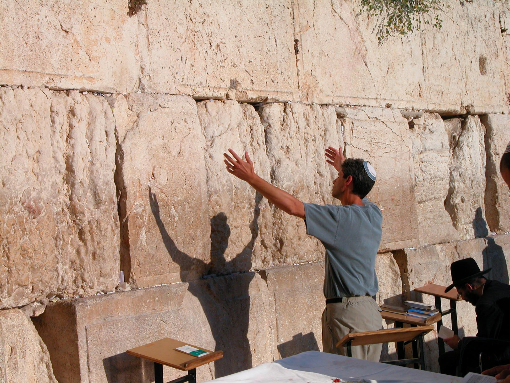

# Cover {.unnumbered}

Placeholder


<!--chapter:end:index.Rmd-->


# About This Course {-}

Placeholder


## Why an HLI Hebrew Grammar Course {- #motivation}
## How our course Is distinct {- #our_course}
## Relationship to _Hebrew Quest_ {- #hgq_and_hq}
## Completion of _Hebrew Quest_ is NOT a prerequisite! {- #finish_hq}

<!--chapter:end:00b-introduction.Rmd-->


# Getting Started / Getting Help {-}

Placeholder


## Navigating this book {- #navigating}
## A Typical Lesson {- #typical-lesson}
## Information Boxes {-}
## Quick Start Instructions {.unnumbered #get_started}
## Help with Anki {- #anki_help}
### Customize Anki Settings {- #anki_settings}
### How do I navigate within Anki? {-}
### How do I know when to hit the Good button on an Anki card? {-}
### How do I get help with Anki? {-}
## Course Resources {- #optional_resources}
## Report an Issue {- #report_issue}
## Ask a question {- #get_help}

<!--chapter:end:00d-help.Rmd-->

# (PART) Hebrew Grammar Foundations {-}

<!--chapter:end:01a-Part_I_header.Rmd-->


# The Hebrew Aleph-bet {#alephbet}

Placeholder


## First Thought {-}
### שֵׁם יְהוָה אֶקְרָא {-}
## The Hebrew Aleph-Bet {#consonants}
## Hebrew is written and read from RIGHT-to-LEFT {#right_to_left}
## Five "KiMNePaTZ" letters have different final forms {#sofit_letters}
## Six" BeGaD KePHaT" letters take a Daghesh Lene {#daghesh_lene}
## We classify four consonants as **Gutturals** (and one is a sometimes-guttural) {#gutturals}
## We classify ten consonants as "SQiN eM LeVY"
## Look out for look-alike Letters {#look-alike-letters}
## Sephardic and "Seminary" Pronunciation {#pronunciation}
## Lesson Conclusion and Activities {-}
### Anki {- #anki-1}
### Worksheets: Letter Writing {- #worksheets-1}
## Ruth Pursuit {-}
## Ruth Pursuit Translation Worksheet {-}
## Quest Quiz {-}

<!--chapter:end:01b-Alephbet.Rmd-->


# Hebrew Vowels {.vowels}

Placeholder


## First Thought {-}
###  הֵמָּה רָאוּ מַעֲשֵׂי יְהוָה {-}
## Vowels that are not vowel letters {#vowels}
### Vowels come in three types: Long, Short, Reduced | Vowels come in five classes: A, E, I, O, U {-}
## Vocal and Silent Sheva {#Sheva}
## Vowel letters {#vowel_letters}
### Vowel letters use a consonant plus a nikkud to form a vowel {-}
## Transliteration Shorthand
## "Defective" and "plene" spelling {#defective_spelling}
## The Dagesh Forte Doubles the Consonant {#dagesh_forte}
## Dagesh Forte Rule {#dagesh_forte_in_bgdkpt}
## Gutturals and Resh reject Dagesh Forte {#gutturals_reject_dagesh_forte}
## Lesson Conclusion and Activities {-}
### Anki {-}
### Vowel worksheet {-}
## Ruth Pursuit {-}
## Quest Quiz {-}
## Claim your `Twelve Tribes Badge`! {- #twelve-tribes-badge-1}

<!--chapter:end:02-Vowels.Rmd-->


# Syllabification and Pronunciation {#Syllabification}

Placeholder


## First Thought {-}
###  אַשְׁרֵי אָדָם לֹא יַחְשֹׁב יְהוָה לוֹ  {-}
## Hebrew Syllables {#syllables}
## Hebrew Word Accents {#accents}
## Tonic, Pretonic, and Propretonic Syllables
## Ultima, Penultima, and Antepenultima syllables
## Rules for Silent Sheva {#s_sheva}
### A Sheva is SILENT when the previous vowel is short: {-}
### A Sheva is SILENT when the first of two consecutive Shevas _within a word_: {-}
### A Sheva is SILENT when at the end of a word: {-}
## Rules for Vocal Sheva {#v_sheva}
### A Sheva is VOCAL when the initial Sheva in a word: {-}
### A Sheva is VOCAL when the second of two consecutive Shevas _within a word_<small>^[<small>A Sheva at the **end** of a word is **always silent**, even when it is the second of two consecutive Shevas.</small>]</small>:  {-}
### A Sheva is VOCAL when under a Dagesh Forte: {-}
### A Sheva is VOCAL after an unaccented long vowel: {-}
## Hebrew Diphthong = Accented Patach-Yod-Hireq {#diphthong}
## Vowels and Syllable Preference {#vowel_pref}
## Qamets Hatuf, Furtive Patach, Quiescent Aleph {#misc_vowels}
## Qamets Hatuf
## Furtive Patach 
## Quiescent Aleph
## Lesson Conclusion and Activities {-}
### Introduction to Video Warm-ups {-}
## Word Warm-up {-}
## Verses Warm-up {-}
## Ruth Pursuit {-}        
## Quest Quiz {-}
## Claim your `Unit 1 Completion Certificate`! {-}

<!--chapter:end:03-Syllabification.Rmd-->


# (PART) Nouns, Prepositions, Pronouns {-}
# Hebrew Nouns {.Nouns}

Placeholder


## First Thought {-}
### רְאֵה לִמַּדְתִּי אֶתְכֶם חֻקִּים וּמִשְׁפָּטִים {-}
## _Hebrew Quest_ Grammatical Gender Lecture
## Gender and Number {#gender_number}
## Parsing vs. Inflecting
## Singular Noun Endings {#sing_noun_endings}
## Plural Noun Endings {#noun_pluralization}
## Dual Noun Endings
## Special dual forms {#dual_forms}
## Irregular Pluralization  {#irregular_pluralization}
### Segholate Nouns follow a standard vowel pattern when pluralizing {-}
### Geminate Words take a Daghesh Forte {-}
## Rule of Sheva {#rules_sheva}
## Lexical Form {#lexical_form}
## Word Warm-up {-}
## Verses Warm-up {-}
## Anki {-}
## Ruth Pursuit {-}        
## Quest Quiz {-}

<!--chapter:end:04-NounsPlural.Rmd-->


# Definite Article and Conjunction Vav {.Article}

Placeholder


## First Thought {-}
### <span class="he">מִי־מָדַד בְּשָׁעֳלוֹ מַיִם וְשָׁמַיִם</span> {-}
## _Hebrew Quest_ Conjunction Lecture
## Translate the Vav Conjunction {#vav_translate}
## Identify the Vav Conjunction {#vav_identify}
## Loss of Dagesh Forte {#loss_Dagesh_forte}
## Compensatory Lengthening
## _Hebrew Quest_ Article Lecture
## Translate the Article {#article_translate}
## Identify the Article {#article_identify}
## Hebrew Indefiniteness {#indefiniteness}
## Other Hebrew Definiteness {#definiteness}
## Lesson Conclusion and Activities {-}
## Word Warm-up {-}
## Verses Warm-up {-}
## Anki {-}
## Ruth Pursuit {-}        
## Quest Quiz {-}
## Claim your next `Twelve Tribes Badge`! {-}

<!--chapter:end:05-DefArt_Conjunction.Rmd-->


# Hebrew Prepositions

Placeholder


## First Thought {-}
### <span class="he">  בְּיוֹם צָרָתִי אֲדֹנָי דָּרָשְׁתִּי </span> {-}
## _Hebrew Quest_ Prepositions Lecture
## Nun with Silent Sheva Becomes Dagesh Forte
## Independent and Maqqef prepositions 
## Inseparable prepositions
## The Article and Inseparable Prepositions
## The flexible <span class="he">מִן</span>: construction
## The Article and <span class="he">מִן</span>
## The flexible <span class="he">מִן</span>: meanings 
## The Definite Direct Object marker 
## _Hebrew Quest_ discussion of Genesis 1:1 
## Conclusion {-}
### Anki {-}
## Word Warm-up {-}
## Verses Warm-up {-}
## Ruth Pursuit {-}        
## Quest Quiz {-}

<!--chapter:end:06-Prepositions.Rmd-->


# Hebrew Adjectives {#adjectives}

Placeholder


## First Thought {-}
### <span class="he">אֶת־הַכֹּל עָשָׂה יָפֶה בְעִתּוֹ</span> {-}
## _Hebrew Quest_ Adjectives Lecture
## Inflecting Adjectives
## Substantival Use
## Attributive Use
## Predicative Use
## Attributive, Predicative, and Substantival Comparison
## The Mappiq 
## The Directional Ending 
## Word Warm-up {-}
## Verses Warm-up {-}
## Anki {-}
## Ruth Pursuit {-}        
## Quest Quiz {-}
## Claim your next `Twelve Tribes Badge`! {-}

<!--chapter:end:07-Adjectives.Rmd-->


# Hebrew Pronouns

Placeholder


## First Thought {-}
### <span class="he">זֶה הַדֶּרֶךְ לְכוּ בוֹ</span> {-}
## _Hebrew Quest_ Independent Pronouns Lecture
## Independent Personal Pronoun Table
## Independent Personal Pronouns Discussion
## Relative Pronoun <span class="he">אֲשֶׁר</span>
## Interrogative Pronoun
## Interrogative Particle <span class="he">הֲ</span>
## Interrogative Particle vs Definite Article 
## _Hebrew Quest_ Demonstratives Lecture
## Near and Far Demonstratives
## Demonstrative Pronoun
## Demonstrative Adjective 
## Lesson 8 Conclusion {-}
## Word Warm-up {-}
## Verses Warm-up {-}
## Anki {-}
## Worksheets: Pronouns {-}
## Ruth Pursuit {-}        
## Quest Quiz {-}

<!--chapter:end:08-Pronouns.Rmd-->


# Hebrew Pronominal Suffixes

Placeholder


## First Thought {-}
### <span class="he">וַיֹּאמְרוּ שָׁאוֹל שָׁאַל־הָאִישׁ לָנוּ וּלְמוֹלַדְתֵּנוּ </span> {-}
## _Hebrew Quest_ Possessive Pronominal Suffixes Lecture
## _Hebrew Quest_ Pronominal Suffixes
## Possessive Pronominal Suffix Meaning
## Type 1 and Type 2 Suffixes
## Singular Suffixes
## Plural Suffixes
## Distinguish Type 1 from Type 2
## Identifying the Lexical Form with Type 1
## Identifying the Lexical Form with Type 2
## Unexpected changes
## Look-alike words: <span class="he">אֵת</span> as "with" or as Definite Direct Object (DDO) marker
## Look-alike words:   <span class="he">עִם</span>, "with", or <span class="he">עַם</span>, "people" 
## Look-alike words: <span class="he">אֵל</span>, "God", or <span class="he">אֶל</span>, "to"
## Word Warm-up {-}
## Word Warm-up: pronominal suffixes {-}
## Verses Warm-up {-}
## Anki {-}
## Worksheets: Pronominal Suffixes {-}
## Ruth Pursuit {-}        
## `Quest Quiz` {-}

<!--chapter:end:09-Pronominal_Suffixes.Rmd-->


# Hebrew Construct Chain {.ConstructChain}

Placeholder


## First Thought {-}
### <span class="he">בְּצֶדֶק כָּל־אִמְרֵי־פִי</span> {-}
## What is a Construct Chain?
## What makes a construct chain
## Review: what makes a word definite 
## The Absolute noun establishes the definiteness of a chain
## How to Recognize a Construct Chain
## Identifying Construct state by Noun Endings
## Construct Chain Summary
## Word Warm-up {-}
## Verses Warm-up {-}
## Anki {-}
## Worksheets: Construct Identification {-}
## Ruth Pursuit {-}        
## Quest Quiz #10 {-}
## Claim your next `Twelve Tribes Badge`! {-}

<!--chapter:end:10-ConstructChain.Rmd-->


# Hebrew Numerals

Placeholder


## First Thought {-}
## _Hebrew Quest_ Numerals Lecture
## The Biblical text always spells out numbers
## Notes and footnotes use symbols for numbers
## Hebrew Ordinal Numbers
### _Hebrew Quest_ Ordinal Numbers Video {-}
## Cardinal Numbers 1-10
### Digits 1 and 2 match the gender of the noun {-}
### Digits 3-10 take the opposite gender of the noun {-}
## Cardinal Numbers Above 10
## Conclusion
### Anki {-}
## Word Warm-up {-}
## Verses Warm-up` {-}
## Ruth Pursuit {-}        
## Claim your Unit 2 Completion Certificate! {-}

<!--chapter:end:11-Numerals.Rmd-->


# (PART) Qal Stem {-}
# Introduction to Unit 3 {-}

Placeholder


## Vowel Transliteration/Shorthand {-}
## $Pre$ = Diagnostic Word-initial Combinations {-}
## Changes for Unit 3: No more quizzes! {-}
## Changes for Unit 3: Cantillation Marks added to Study Verses {-}
## Changes for Unit 3: OPTIONAL _Hebrew_ Quest Study Passage Translation {-}
## Lessons 13-16 are critical! {-}
## _Hebrew Quest_ Verb Summary Lecture {-}

<!--chapter:end:11b-Unit3_Intro.Rmd-->


# Introduction to Hebrew Verbs

Placeholder


## First Thought {-}
### <span class="he">וְהֽוּא־הָלַ֤ךְ בַּמִּדְבָּר֙ דֶּ֣רֶךְ י֔וֹם </span> {-}
## _Hebrew Quest_ Verb Introduction Lecture
## A note on the paradigm strong verb <span class="he">קטל</span>
## The Verbal Root
## Inflecting and Parsing Review
## Person, Gender, Number
## Verb nomenclature
## Lexical form for Verbs
## Preformatives, Sufformatives, Prefixes, and Suffixes
## Verbal Vowels
## _Hebrew Quest_ Verb Stems Lecture
## The Seven Hebrew Verb Stems
## The Seven Stems: Summary Table
## Conjugation
## The Eight Basic Conjugations
## Finite vs. Non-Finite Conjugations
## Parsing
## Parsing Codes
## Strong and Weak Verbs
## Weak Verbs
## Weak Verb Classes {#weak-class}
## Weak Verbs Are Predictable
## Hebrew GRAMMAR Quest is a Quest for RECOGNITION, NOT RECALL
## Stem Comparison Table
## Word Warm-up {-}
## Verses Warm-up {-}
## Anki {-}
## Ruth Pursuit {-}        
## OPTIONAL _Hebrew Quest_ Study Passage Track: Proverbs Study #1-4 {-}

<!--chapter:end:12-Verbs_Intro.Rmd-->


# Qal Perfect - Strong Verbs {.QP-s}

Placeholder


## First Thought {-}
### <span class="he">לֹא־שָׁמְר֤וּ אֲבוֹתֵ֙ינוּ֙ אֶת־דְּבַ֣ר יְהוָ֔ה </span> {-}
## _Hebrew Quest_ Qal Perfect Lecture
##  Qal is Simple action, Active voice
## Perfect is completed action or a state as a whole
## Components of the Qal Perfect Strong Paradigm
## The Perfect Sufformatives
## Qal Perfect Vowels: $V_1$ is almost always Qamets
## Qal Perfect Strong $Pre =$ <span class="he">קָ</span>
## Qal Perfect Strong $V_S = A$
## Each Stem will have a $V_S$ FORMULA
## $V_S$ is accented in Finite verbs
## A Sheva precedes a Finite Sufformative
## Building the Qal Perfect Strong Paradigm
## Qal Perfect Strong Paradigm
## Worksheet: Qal Perfect Strong Paradigm {-}
## Qal Perfect Strong Examples
## Deviations from the Paradigm
## 3נ and 3ת Verbs
## Stative Verbs MAY have a different $V_S$
## Word Warm-up {-}
## Verses Warm-up {-}
## Anki {-}
## Ruth Pursuit {-}        
## Claim your next `Twelve Tribes Badge`! {-}
## OPTIONAL _Hebrew Quest_ Study Passage: Proverbs #5-7 {-}

<!--chapter:end:13-Qal_Perfect_Strong.Rmd-->


# Qal Perfect - Weak Verbs {.QP-w}

Placeholder


##  First Thought {-}
### <span class="he">בָ֤אָה נַחֲלָתֵ֙נוּ֙ אֵלֵ֔ינוּ מֵעֵ֥בֶר הַיַּרְדֵּ֖ן מִזְרָֽחָה׃</span> {-}
## Introduction and Review
## 3נ and 3ת with Silent Sheva Assimilate to Dagesh
## Review of Guttural Principles
## 1G, 2G
## 3-ע/ח
## א3 
## יָרֵא is 3א AND Tsere Stative
## 3ה  
## Doubly Weak
## הָיָה
## Geminate Paradigm
## Geminate Vocabulary
## Biconsonantal
## מוּת is Biconsonantal and Stative
## Qal Perfect Quest Clues
## Clues for Qal Perfect Special Situations
## Word Warm-up {-}
## Verses Warm-up {-}
## Anki {-}
## Ruth Pursuit {-}    
## OPTIONAL _Hebrew Quest_ Study Passage: Proverbs #8-10 {-}

<!--chapter:end:14-Qal_Perfect_Weak.Rmd-->


# Qal Imperfect - Strong Verbs {.QI-s}

Placeholder


## First Thought {-}
### <span class="he">יִ֝שְׁמֹ֗ר כָּל־אָרְחֹתָֽי </span> {-}
## _Hebrew Quest_ Qal Imperfect Lecture
## Translating the Imperfect
## The Imperfect Always has a Preformative
## Qal Imperfect Vowels
## Imperfect Sufformatives
## Building the Qal Imperfect Strong Paradigm
## Qal Imperfect Strong Paradigm
## Worksheet: Qal Imperfect Strong Paradigm {-}
## Qal Imperfect Strong Examples
## Deviations from the Paradigm
## Translating Negative Commands
## Word Warm-up {-}
## Verses Warm-up {-}
## Ruth Pursuit {-}   
## OPTIONAL _Hebrew Quest_ Study Passage: Proverbs #11-14 {-}

<!--chapter:end:15-Qal_Imperfect_strong.Rmd-->


# Qal Imperfect Weak {.QI-w}

Placeholder


## First Thought {-}
### <span class="he">וְעֵינֵיכֶ֖ם תִּרְאֶ֑ינָה</span> {-}
## Our Quest
## 2G 
## 3חע
## 3א  
## 3ה 
## 3ה ending comparison table
## 1G
## 1א "Angry Baker"
## Geminate
## Biconsonantal
## 1-Yod 
## הלך 
## <span class="he">יכל</span> takes $V_P = \hat U$
## 1נ Assimilates with Silent Sheva
## לקח
## Doubly Weak
## נתן is 1נ and 3נ
## ראה vs. ירא
## Qal Imperfect Weak Summary
## Word Warm-up {-}
## Verses Warm-up {-}
## Ruth Pursuit {-}   
## Claim your next `Twelve Tribes Badge`! {-}
## OPTIONAL _Hebrew Quest_ Study Passage: Proverbs #15-17 {-}

<!--chapter:end:16-Qal_Imperfect_Weak.Rmd-->


# Vav Consecutive {.wc}

Placeholder


## First Thought {-}
### <span class="he">וַיַּשְׁכִּ֣מוּ בַבֹּ֔קֶר וַיַּֽעֲל֥וּ אֶל־רֹאשׁ־הָהָ֖ר </span> {-}
## _Hebrew Quest_ Qal Vav Consecutive Lecture (
## _Hebrew Quest_  Vav Consecutive Lecture (from Lesson 5)
## Review of the Conjunction Vav
## Perfect + וְ: Spelling
## Perfect + וְ: Translating
## Imperfect + וְ: Spelling
## Imperfect with Vav often indicates purpose
## Imperfect Waw Consecutive: Spelling (Strong)
## Imperfect Waw Consecutive: Spelling (Weak)
## Imperfect Waw Consecutive: Translation
### Usually, translate Iwc as PAST TENSE {-}
## Summary
## Word Warm-up {-}
## Verses Warm-up {-}
## Worksheets: Qal Vav-Consecutive Paradigms {-}
## Ruth Pursuit {-}   
## OPTIONAL _Hebrew Quest_ Study Passage: Genesis 1:1-5 {-}

<!--chapter:end:17-Vav_Consecutive.Rmd-->


# Qal Imperative {.QM}

Placeholder


## First Thought {-}
### <span class="he">וְעַתָּ֣ה יִשְׂרָאֵ֗ל שְׁמַ֤ע אֶל־הַֽחֻקִּים֙ וְאֶל־הַמִּשְׁפָּטִ֔ים אֲשֶׁ֧ר אָֽנֹכִ֛י מְלַמֵּ֥ד אֶתְכֶ֖ם לַעֲשׂ֑וֹת</span> {-}
## _Hebrew Quest_ Qal Imperative Lecture
## Volitional Forms Introduction
## Negative Commands use the Jussive or the Imperfect
## The Imperative is the Imperfect without the Imperfect Preformative
## Identifying QM
## <span class="he">נָה</span> can follow volitional verbs
## Distinguishing QM2ms, QI3ms, and QP3ms
## Paragogic ה 
## 3ה Verbs
## 3ה Comparison Table
## 1נ and 1י
## Biconsonantal and Geminate
## Masculine Third Person QP and 2nd Person QM are potential look-alikes
## Cohortative and Jussive Introduction
## Some weak verbs often shorten the Jussive singular
## Word Warm-up {-}
## Verses Warm-up {-}
## Worksheets: Qal Volitional Forms {-}
## Ruth Pursuit {-}   
## OPTIONAL _Hebrew Quest_ Study Passage: The Shema {-}

<!--chapter:end:18-Qal_Imperative_strong.Rmd-->


# Pronominal Suffixes on Verbs {.VerbSuffix}

Placeholder


##  First Thought {-}
### <span class="he">אֲנִֽי־קְרָאתִ֣יךָ כִֽי־תַעֲנֵ֣נִי אֵ֑ל הַֽט־אָזְנְךָ֥ לִ֝֗י שְׁמַ֣ע אִמְרָתִֽי׃</span> {-}
## _Hebrew Quest_ Pronominal Suffixes
## Hebrew Direct Object Pronouns
## Verbs use Type 1 Suffixes
## Qal Perfect Vowel and Accent Changes When a Pronominal Suffix is added
## QI Vowel Changes 
## QM Vowel Changes
## Imperative/Perfect Ambiguity when normal Imperative $V_S = A$
## Word Warm-up {-}
## Verses Warm-up {-}
## Ruth Pursuit {-}        
## Claim your next Twelve Tribes Badge! {-}
## OPTIONAL _Hebrew Quest_ Study Passage: Matthew 6 {-}

<!--chapter:end:19-Pronominal_Suffix_Verbs.Rmd-->


# Qal Infinitive Construct {.Qinfinitive}

Placeholder


## First Thought {-}
###  <span class="he">וְשָׁ֣מַרְתָּ֔ אֶת־מִצְוֺ֖ת יְהוָ֣ה אֱלֹהֶ֑יךָ לָלֶ֥כֶת בִּדְרָכָ֖יו וּלְיִרְאָ֥ה אֹתֽוֹ׃</span> {-}
## _Hebrew Quest_ Qal Infinitves Lecture
## Two types of Infinitives
## Q∞ Spelling
## 3ה Endings
## 1י and 1נ Spelling
## Biconsonantal
## Q∞ often is identical to QM2ms
## ∞ take Type 1 Pronominal Suffixes
## Most ∞ have a prefixed preposition
## Meaning of ∞
## Negating the Infinitive
## Word Warm-up {-}
## Verses Warm-up {-}
## Ruth Pursuit {-}   
## OPTIONAL _Hebrew Quest_ Study Passage: Genesis 22:1-19 {-}

<!--chapter:end:20-Qal_Infinitive_Construct.Rmd-->


# Qal Infinitive Absolute {.QA}

Placeholder


## First Thought {-}
### <span class="he">אָנֹכִ֗י אֵרֵ֤ד עִמְּךָ֙ מִצְרַ֔יְמָה וְאָנֹכִ֖י אַֽעַלְךָ֣ גַם־עָלֹ֑ה</span> {-}
## _Hebrew Quest_ Qal Infinitves Lecture
## QA Spelling
## 3ה Comparison Table
## Meaning of Infinitive Absolute
## Infinitive Construct vs Infinitive Absolute Comparison
## יֵשׁ and אֵין 
## Word Warm-up {-}
## Verses Warm-up {-}
## Ruth Pursuit {-}   
## OPTIONAL _Hebrew Quest_ Study Passage: Aaronic/Priestly Blessing {-}

<!--chapter:end:21-Qal_Infinitive_Absolute.Rmd-->


# Qal Participle {.QPt}

Placeholder


##  First Thought {-}
###  <span class="he">וְיִבְטְח֣וּ בְ֭ךָ יוֹדְעֵ֣י שְׁמֶ֑ךָ כִּ֤י לֹֽא־עָזַ֖בְתָּ דֹרְשֶׁ֣יךָ יְהוָֽה׃ </span> {-}
## _Hebrew Quest_ Qal Participles Lecture
## Participles are Verbal Adjectives
## Qal Active and Passive Participles
## Qal Participle Spelling
## Prefixes and Suffixes
## Biconsonantal 
## 3ה 
### We can now complete our 3ה $V_2$ table {-}
## Stem Comparison Table
## _Hebrew Quest_ Qal Summary Lecture
## Word Warm-up {-}
## Verses Warm-up {-}
## Worksheets: All Qal Paradigms {-}
## Ruth Pursuit {-}        
## Claim your next `Twelve Tribes Badge`! {-}
## OPTIONAL _Hebrew Quest_ Study Passage: Matthew 13 {-}

<!--chapter:end:22-Qal_Participle.Rmd-->


# Hebrew Syntax {.Syntax}

Placeholder


## First Thought {-}
### <span class="he">עַתָּה יָדַעְתִּי כִּי־גָדוֹל יְהוָה מִכָּל־הָאֱלֹהִים</span> {-}
## Clause versus Sentence
## Word Order
## Perfect Syntax
## Imperfect Syntax
## Volitional Syntax
## Conditional Phrases
## Disjunctive Vav
## Adverbs
## Word Warm-up {-}
## Verses Warm-up {-}
## Ruth Pursuit {-}        
## Claim your Unit 3 Completion Certificate! {-}
## OPTIONAL _Hebrew Quest_ Study Passage: Psalm 19 {-}

<!--chapter:end:23-Hebrew_Syntax.Rmd-->


# (PART) Derived Binyanim {-}
# Introduction to Unit 4 {-}

Placeholder


## Structure of Lessons 24-35 {-}
## Ruth Pursuits {-}
## Stem Vowel Pattern Nomenclature
## What to memorize for all Derived Stems {-}
## Review: Sheva before Finite Verb Endings

<!--chapter:end:23b-Unit4_Intro.Rmd-->


# The Niphal Stem - Strong Verbs

Placeholder


## First Thought {-}
### <span class="he"> וּמִן־הַגָּדִ֡י נִבְדְּל֣וּ אֶל־דָּוִיד֩ לַמְצַ֨ד מִדְבָּ֜רָה</span> {-}
## Niphal Verb Stem Table
## Niphal Meanings
## Parsing Clues - _Pre_:  the נ prefix is added to EVERY conjugation
## Parsing Clues - $V_S = A \sim \bar E(A)$
## What to memorize for Niphal 
## Paradigm: Niphal Perfect Strong
## Paradigm: Niphal Imperfect Strong
## Paradigm: Niphal Imperative Strong
## Paradigm: Niphal Infinitives Strong
### Derived Stem Infinitive Absolute $V_S = \bar E$ (usually) {-}
## Paradigm: Niphal Participle Strong
### Derived Stem Participle $V_S =$ the P3ms Vowel, lengthened if possible (usually) {-}
## Participle Prefixes in the Derived Stems
## Forms with Identical Spelling
## Easily Confused Forms
## Niphal Parsing Examples
## Stem Comparison Table
## Word Warm-up {-}
## Verses Warm-up {-}
## Worksheets: Niphal Strong Paradigm {-}
## Optional _Hebrew Quest_ Study Passage: Numbers 15 {-}

<!--chapter:end:24-Niphal_Strong.Rmd-->


# The Niphal Stem - Weak Verbs {.N-w}

Placeholder


## First Thought {-}
###  <span class="he">וְקָרְא֥וּ לָהֶ֛ם עַם־הַקֹּ֖דֶשׁ גְּאוּלֵ֣י יְהוָ֑ה וְלָךְ֙ יִקָּרֵ֣א דְרוּשָׁ֔ה עִ֖יר לֹ֥א נֶעֱזָֽבָה׃</span> {-}
## A weak consonant affects the vowels that touch it
## 1-Guttural 
## 1-Yod
## 1-Nun with Silent Sheva Assimilates
## 3-Aleph Changes $V_S$
## 3-Hei Verbs Follow the same general principles
## What to Memorize for Niphal Weak
## Top 10 Niphal Verbs 
## Word Warm-up {-}
## Verses Warm-up {-}
## Ruth Pursuit {-}        
## Claim your next `Twelve Tribes Badge`! {-}
## OPTIONAL _Hebrew Quest_ Study Passage: John 1 {-}

<!--chapter:end:25-Niphal_Weak.Rmd-->

# The Piel Stem - Strong Verbs {.D-s}

The Piel stem occurs 6,473 times in the Hebrew Bible. It appears in the Perfect 2,120 times, Imperfect 2,446 times, Imperative 436 times, Infinitive Construct 708 times, Infinitive Absolute 84 times, and Participle 679 times

Many students find the Piel is one of the easier stems to identify.  It is one of only three Verb stems (along with the Pual and Hitpael) that has a Dagesh Forte in $R_2$. The Piel is easily distinguished from the Pual, which has a steady U-class vowel, and is distinguished from the Hitpael, which has a unique prefix.

In addition to the Dagesh Forte, the Piel has a $Pre$ combination that (in the strong form) is relatively free from confusion with any other Hebrew Verb Stem.

::: {.box .map}
__LESSON ITINERARY__

1. Understand the meaning of the Piel Stem
1. Identify the distinctive diagnostics of the Piel Strong conjugations
:::


## First Thought {-}

### <span class="he">בִּשְׂפָתַ֥י סִפַּ֑רְתִּי כֹּ֝֗ל מִשְׁפְּטֵי־פִֽיךָ׃</span> {-}

*With my lips I have told of All the ordinances of Your mouth (Psalms 119:13)*

With our study of Hebrew, we are able to get closer to original intent of God's ordinances.  However, if we are not already keeping His words in our native language, there is nothing about learning Hebrew that will transform our lives.  We must practice the disciplines of worship and study (and teaching if that is our calling) so that they become hard-wired habits.  If that is already in place, than we can use Hebrew to reach new depths in our worship.

<figure>
    <figcaption>Listen to the verse in Hebrew:</figcaption>
    <audio
        controls controlsList="nodownload"
        src="./images/26-18.Psalms119.13.mp3">
            Your browser does not support the
            <code>audio</code> element.
    </audio>
</figure>


```r

```

<div class="figure" style="text-align: center">

<p class="caption">(\#fig:unnamed-chunk-1)Man with arms upraised at Western Wall. Courtesy of the [Pictorial Library of Bible Lands](https://www.bibleplaces.com)</p>
</div>


<!-- FOR STRONG VERB CHAPTERS -->

## Piel Verb Stem Table 

| |Active Voice| Passive Voice | Reflexive Voice
|:- |:- |:- |:-
Simple Action	| Qal | Niphal | Niphal
Cause a State	| _PIEL_ | Pual | Hitpael
Cause an Action	| Hiphil | Hophal

* Reminders:
    * The table gives broad generalization; many verbs do not fit neatly into the table's definitions
    * Use a lexicon/dictionary to check the meanings in different stems
    * Many references like this one will label the 2nd row as "Intensive Action," but this is a controversial topic in the academic community


## Piel Meanings

* Cause a state ('factitive')
    * <span class="he">מִלֵּא </span>
        * Q - He filled
        * D (Piel) - He caused (something) to be full
    <span class="he">אָנַשף </span>
        * Q - He was angry
        * D - He made (someone) angry
* Do something repeatedly ('iterative')
    * <span class="he">הָלַךְ</span>
        * Q - He walked
        * D - He walked around
* Declarative - he declared (someone) innocent
* Denominative (a verb made from a noun) - He acted as a priest (<span class="he">כִּהֵן</span> from <span class="he">כֹּהֵן</span> "priest")
* Intensive?
    * <span class="he">שִׁבֵּר </span>
        * Q - He broke
        * D - He smashed
            * This is hotly debated
            * Perhaps he caused it to be in a state of brokenness?
            * Perhaps he broke it repeatedly?

## Piel is the "D" stem because $R_2$ takes a Doubling Dagesh Forte

* In fact, when you see a Dagesh in $R_2$, it's more than likely either a Piel form or a 1-נ verb that has assimilated.  If you see three root letters, it's probably a Piel
    * Two other Stems take a Dagesh in $R_2$ - Pual (Lesson 28) and Hitpael (Lesson 34).  As we will learn in those lessons, both forms are easily distinguished from Piel.
* Gutturals, Resh, SQiN eM LeVY letters reject the Daghesh Forte
    * SQiN eM LeVY will be discussed later in this lesson
    * Gutturals/Resh will be discussed in Lesson 27

## Memorize Piēl - Paēl

::: {.box .info}
The Piel is remarkably consistent.  
While there are distinctive $Pre$ and $V_S$ combinations, it's easiest to remember the stem by the mnemonic "Piēl - Paēl"
:::

* Piēl in PERFECT
    * $V_1 = I$
    * $V_S = \bar E$ in the 3rd person
        * <span class="he">קִטֵּל</span> - DP3ms
    * $V_S = A in the 2nd/1st person
        * <span class="he">קִטַּ֫לְתָּ</span> - DP2ms
* Paēl in ALL OTHER CONJUGATIONS
    * $V_1 = A$
    * $V_P = :$ (or Hateph Patach in DI1cs), where applicable
    * $V_S = \bar E$
    * <span class="he">יְקַטֵּל</span> - DI3ms
    * <span class="he">קַטֵּל</span> - DM2ms/D∞/DA
    * <span class="he">מְקַטֵּל</span> - DPtMS

* For completeness, the Piel $V_S$ formula is below
    * This is the first time seeing $\bar E[A] \sim$
    * This means that while the 3rd person takes $\bar E$, the 1st and 2nd perfect forms take $V_S = A$
    * Do not confuse a vowel in brackets to the left of the $\sim$ with a vowel in parenthesis to the RIGHT
        * A vowel in brackets to the left means the 1st and 2nd person forms in the PERFECT take that vowel
        * A vowel in parenthesis to the right means the Feminine plural forms in the NON-PERFECT take that vowel

$$V_{S} = \bar E[A] \sim \bar E$$


## Pay attention when $R_2$ is a SQiN eM LeVY consonant

* As we have mentioned previously, SQiN eM LeVY is a mnemonic for a group of letters that can reject a Dagesh Forte when the letter has a Sheva
    * S - סצשׁסֹ
    * Q - ק
    * N - נ
    * M - מ
    * L - ל
    * V - ו
    * Y - י

* If you see a SQiN eM LeVY consonant with a Sheva, it might have a "hidden" Daghesh Forte

## DIwc

* The Iwc has a Dagesh in the Imperfect Preformative
* the DI preformative has a Sheva
* Therefore, DIwc3ms and DIwc3mp lose Dagesh
* DIwc3ms - Not *<span class="he">וַיְּקַטֵּל</span>, but <span class="he">וַיְקַטֵּל</span>
* DIwc3mp - Not *<span class="he">וַיְּקַטְּלוּ</span>, but <span class="he">וַיְקַטְּלוּ</span>
* Forms with reduced $V_2$
    * Example DP3cp - Not *<span class="he">שִׁמְּרוּ</span>, but <span class="he">שִׁמְרוּ</span>
    
## Piel: what to memorize

* Parsing code D - Dagesh Forte in $R_2$
* "Piēl - Paēl"
    * This is easier than remembering the $Pre$ and $V_S$ combinations separately
    * Piēl - Perfect $V_1 = I$
    * Paēl - everywhere else: $V_1 = A$
    * $V_S = E$ everywhere except Perfect 1st/2nd person (where $V_S = A$)
* $V_P = :$ in all Strong Conjugations with preformatives
    * This compares to $V_P = I$ in the Qal
* Participle preformative <span class="he">מ</span> (all stems except Qal and Niphal)
* The SQiN eM LeVY exceptions
    * $R_2$ and $DIwc$

## Piel Perfect Strong Paradigm

| Sing | Paradigm | Plural | Paradigm
| :-  | :- | :-  | :-
| 3ms | <span class="he">קִטֵּל</span>  | 3cp | <span class="he">קִטְּלוּ</span> 
| 3fs | <span class="he">קִטְּלָה</span> | 
| 2ms | <span class="he">קִטַּ֫לְתָּ</span> | 2mp | <span class="he">קִטַּלְתֶּם</span>
| 2fs | <span class="he">קִטַּלְתְּ</span> | 2fp | <span class="he">קִטַּלְתֶּן</span>
| 1cs | <span class="he">קִטַּ֫לְתִּי</span> | 1cp | <span class="he">קִטַּ֫לְנוּ</span>

* 3rd person $Pre$ is distinctive Hireq+Dagesh+Tsere
* 1st/2nd person $Pre$ is Hireq+Dagesh+Patach

<figure>
    <figcaption>Piel Perfect Strong from _Hebrew Quest_ Chapter 15</figcaption>
    <audio
        controls controlsList="nodownload"
        src="./images/26_Piel_Perfect_Izzy.mp3">
            Your browser does not support the
            <code>audio</code> element.
    </audio>
</figure>

## Piel Imperfect Strong Paradigm

| Sing | Paradigm | Plural | Paradigm
| :-  | :- | :-  | :-
| 3ms | <span class="he">יְקַטֵּל</span>  | 3mp | <span class="he">יְקַטְּלוּ</span> 
| 3fs | <span class="he">תְּקַטֵּל</span> | 3fp | <span class="he">תְּקַטֵּ֫לְנָה</span>
| 2ms | <span class="he">תְּקַטֵּל</span> | 2mp | <span class="he">תְּקַטְּלוּ</span>
| 2fs | <span class="he">תְּקַטְּלִי</span> | 2fp | <span class="he">תְּקַטֵּ֫לְנָה</span>
| 1cs | <span class="he">אֲקַטֵּל</span> | 1cp | <span class="he">נְקַטֵּל</span>

* Piel Imperfect is consistent: <span class="he">יְקַטֵּל</span> 
    * Remember $V_1 = A$ in all non-Perfect forms
    * $V_P = ə$ (Vocal Sheva) - DI1cs will take $V_P = \breve A$ (Hateph Patach)
    * Compare to Qal Imperfect $Pre$ of Hireq+Sheva+Holem
    
<figure>
    <figcaption>Piel Imperfect Strong from _Hebrew Quest_ Chapter 15</figcaption>
    <audio
        controls controlsList="nodownload"
        src="./images/26_Piel_Imperfect.mp3">
            Your browser does not support the
            <code>audio</code> element.
    </audio>
</figure>

## Piel Imperative Strong Paradigm

| Sing | Paradigm | Plural | Paradigm
| :-  | :- | :-  | :-
| 2ms | <span class="he">קַטֵּל</span> | 2mp | <span class="he">קַטְּלוּ</span>
| 2fs | <span class="he">קַטְּלִי</span> | 2fp | <span class="he">קַטֵּ֫לְנָה</span>

<figure>
    <figcaption>Piel Imperative Strong from _Hebrew Quest_ Chapter 15</figcaption>
    <audio
        controls controlsList="nodownload"
        src="./images/26_Piel_Imperative.mp3">
            Your browser does not support the
            <code>audio</code> element.
    </audio>
</figure>


## Piel Infinitives Strong Paradigm


| Type | Paradigm 
| :-  | :- 
| ∞ | <span class="he">קַטֵּל</span>  
| A | <span class="he">קַטֵּל</span>

* Same as DM2ms

<figure>
    <figcaption>Piel Infinitives Strong from _Hebrew Quest_ Chapter 15</figcaption>
    <audio
        controls controlsList="nodownload"
        src="./images/26_Piel_infinitive.mp3">
            Your browser does not support the
            <code>audio</code> element.
    </audio>
</figure>


## Piel Participle Strong Paradigm

| Sing | Paradigm | Plural | Paradigm
| :-  | :- | :-  | :-
| ms | <span class="he">מְקַטֵּל</span> | mp | <span class="he">מְקַטְּלִים</span>
| fs | <span class="he">מְקַטֶּ֫לֶת</span> | fp | <span class="he">מְקַטְּלוֹת</span>

* Distinctive <span class="he">מְ</span> prefix

### Participle Prefixes in the Derived Stems {-}

Again we present this table for review:

Stem | Prefix 
:- | :-: 
Niphal | נִ |
PIEL | <span class="he">מְ</span>
Pual | מְ
Hiphil | ַמ
Hophal (u-class) | מֻ
Hophal (o-class) | ָמ
Hithpael | תִמְ

## Piel Parsing Examples

* Word: <span class="he">גדַּ֫לְנוּ </span>
    * The Dagesh in the Gimmel is a Lene (not preceded by a vowel), but the Dagesh in the Dalet is preceded by a vowel that is not a sheva, so this must be a forte.
        * A Forte in what appears to be $R_2$ Should get your attention 
        * The two questions you should start asking when you see a Forte in $R_2$:
            * "Is this Piel?"
            * "Is this an assimilated נ1" - if you clearly see $R_1$ you can rule out this option
    * $Pre =$ גִּדַּ, distinctly Piel Perfect
    * $Sufformative =$ נוּ, Perfect 1cp
    * $Root =$ <span class="he">גדל</span>
    * $V_S = A$ - We might expect Tsere in the Piel but then we remember that Piel Perfect takes Patach in 1st/2nd person
    * Result: Piel Perfect 1cp, we made great

* Word: <span class="he">אֲדַבֶּר</span>
    * Immediately, note the Daghesh in $R_2$ - your mind should be asking "is this Piel?"
        * This could be an assimilated 1-nun verb, but we already have what appear to be three-root letters visible
    * Then remember "Piel-Pael" and note this rhymes with Pael.  So without doing much analysis, we're already pretty sure this is a Piel, non Perfect.
    * $Pre =$ אֲדַבּ, 
        * We expect $V_P = ə$ in the Piel; but, as we know, the Aleph takes the Hateph vowel instead of Sheva
        * The Patach+Dagesh+Tsere combination is consistent with Piel non-Perfect
    * $Sufformative =$ None. With the Aleph preformative, this is I1cs
    * $Root =$ <span class="he">דבר</span>
    * $V_S = \bar E$, consistent with Piel (except DP1/2 person)
    * Result: Piel Imperfect 1cs I will speak

* Word: <span class="he">לַמֵּד</span>
    * The Dagesh Forte in $R_2$ suggests Piel or assimilated 1-Nun
        * Of the verb examples on this page, this is the only one where a 1-nun might be plausible
            * We have the ל which is a common prefix to an infinitive construct
            * If there was a verb נמד, we might want to probe this further as a possible ∞, but we don't know a verb נמד
            * Even if this were a 1נ verb,, the vowels don't match up
        * We DO know a verb למד though
            * Like in other areas of life, when we have a set of multiple possibilities, the most direct path is often the correct one
        * You also note that the word rhymes with "Pael", suggesting a "working hypothesis" of Piel, non-perfect
    * $Pre =$ לַמּ,
    * $Sufformative =$ none.  No preformative, no sufformative could be QP, but the vowels don't match Qal at all. The vowels do match Piel.
        * This can't be DP because $V_1 \not = I$
        * This can't be DI because all Imperfects have a preformative
        * This can't be DPt because DPt begins with <span class="he">מְ</span>
        * DM2ms, D∞, and DA each work
    * $Root =$ <span class="he">למד</span>
    * $V_S = \bar E$, consistent with Piel (except Piel Perfect 1/2 person)
    * Result: D(M2ms/∞/A) - Teach! or to teach

## Stem Comparison Table

* Here is the Stem Comparison Table showing Qal, Niphal, and now Piel


```r
library(knitr)
include_graphics("images/26_stemcomp.png")
```


## Word Warm-up {-}

<div class="container">
<iframe class="responsive-iframe" src="https://youtube.com/embed/6A3f3WemMmE" frameborder="0"></iframe>
</div>


[Click to open `Word Warm-up` video in a new tab](https://youtu.be/6A3f3WemMmE){target="_blank"}


## Verses Warm-up {-}

<div class="container">
<iframe class="responsive-iframe" src="https://youtube.com/embed/NGT8fiuGGp0" frameborder="0"></iframe>
</div>


[Click to open `Verses Warm-up` video in a new tab](https://youtu.be/NGT8fiuGGp0){target="_blank"}


## Worksheets: Piel Strong Paradigms {-}

Use your knowledge of the diagnostics Piel stem to complete the Piel worksheet.

Strive for pattern recognition over rote memorization.

[Piel Strong Worksheet](26_piel_strong_paradigms.pdf){target="_blank"}

## Ruth Pursuit Analysis

We are now at the exciting stage where we can begin to stitch together an analysis of Ruth 1.  This will be much the same as you have done with the `Hebrew Quest Study Passages`.  The main difference is you will not have Izzy's video explanation.  In that sense, you will now be wading a little deeper into the Hebrew pool! 

We're going to do this in small chunks over the next several lessons.  

If Ruth 1 is "Act 1" of the drama, we'll start with what is "scene 1": Ruth 1:1-6.

::: {.box .map}
YOUR QUEST

1. Read Ruth 1:1-6 in the Hebrew text and underline any words or forms do you not recognize
    * For the first time, try doing this without any study aids, including your `Ruth Pursuit Translation Worksheet`
    * Then as needed, look up the words you don't recognize
2. Using what you have learned about syntax/phrase constructions and context, compose your own interpretative translation (this time, using whatever resources you'd like!)
    * You may wish to compose a structural outline of "mini-scenes" identified by conjunctive or disjunctive clauses, quotations, or other constructions
3. Compare your version with translations of your choice.  These may include JPS, KJV, ESV, NASB, NIV, or NLT.  
    * At what points do you agree and disagree with translation decisions made by these publications? 

This exercise is for you.  You do not have to turn this in, and it will not be graded as a part of this course.  We would encourage you to share your passage with the Holy Language Institute Tribe for their feedback and edification.

:::

## OPTIONAL _Hebrew Quest_ Study Passage: Exodus 31 {-}


::: {.box .map}
YOUR HEBREW QUEST

1. Read the passage - [Blank copy of Exodus 31](https://docs.google.com/document/d/1uRkk2MNy6-8CqSzXQAadDqhnHqUTI6i7Bd6OOxCbYjQ/edit?usp=sharing){target="_blank"}
2. Now re-read the passage critically, highlighting ([lexicon here](https://holylanguage.com/resources-dictionaries.php){target="_blank"} and translating (you will need to parse verbs to translate)
3.[Watch Izzy's _Hebrew Quest_ video (video opens in a new tab)](https://holylanguage.com/exodus-31.php){target="_blank"}
4. After the video, assess your translation.  How close was it?
    * You may wish to check your parsing and translation [here](https://scholarsgateway.com/search/WLC-ESV/Exodus/31){target="_blank"}
5. How did the Ruach HaKodesh speak to you through the passage?
:::

<!--chapter:end:26-Piel_Strong.Rmd-->


# The Piel Stem - Weak Verbs {.D-w}

Placeholder


## First Thought {-}
### <span class="he">בֹּ֤אוּ שְׁעָרָ֨יו ׀ בְּתוֹדָ֗ה חֲצֵרֹתָ֥יו בִּתְהִלָּ֑ה הֽוֹדוּ־ל֝֗וֹ בָּרֲכ֥וּ שְׁמֽוֹ׃</span> {-}
## Third Guttural (all variants)
## 2-Guttural and 2-Resh
## 1-Nun
## Biconsonantal: the Polel minor stem
## Geminate
## Other weak $R_1$ forms
## What to Memorize for Piel Weak
## Piel Weak Parsing Examples
## Top 10 Piel Verbs
## Word Warm-up {-}
## Verses Warm-up {-}
## Ruth Pursuit {-}        
## Hebrew Quest Study Passages: Psalms 1 and 27 {-}

<!--chapter:end:27-Piel_Weak.Rmd-->


# The Pual Stem - Strong Verbs {.Dp-s}

Placeholder


## First Thought {-}
### <span class="he">בְּחֶ֣סֶד וֶ֭אֱמֶת יְכֻפַּ֣ר עָוֺ֑ן וּבְיִרְאַ֥ת יְ֝הוָ֗ה ס֣וּר מֵרָֽע׃</span> {-}
## Pual Verb Stem Table and Meaning
## Parsing Clues - _Pre_: $V_1 = U$ - ALWAYS for strong verbs
## Parsing Clues - $V_S = A$ and Dagesh Forte in $R_2$
## Pual: what to memorize
## Perfect  
## Imperfect  
## Participle
### Participle Prefixes in the Derived Stems {-}
## Pual Parsing Examples
## Stem Comparison Table
## Worksheets: Pual Paradigm {-}
## Word Warm-up {-}
## Verses Warm-up {-}
## Ruth Pursuit Analysis {-}
## Claim your next `Twelve Tribes Badge`! {-}
## OPTIONAL Hebrew Quest Study Passage: Revelation 1 {-}

<!--chapter:end:28-Pual_Strong.Rmd-->


# The Pual Stem - Weak Verbs {.Dp-w}

Placeholder


## First Thought {-}
### <span class="he">גִּבּ֣וֹר בָּ֭אָרֶץ יִהְיֶ֣ה זַרְע֑וֹ דּ֭וֹר יְשָׁרִ֣ים יְבֹרָֽךְ׃</span> {-}
## The Pual diagnostic $V_1 = U$ is maintained in almost all weak verbs
## 2-Gutturals Reject Dagesh Forte
## Biconsonantal: the Polal minor stem
## Word Warm-up {-}
## Verses Warm-up {-}
## Ruth Pursuit 
## OPTIONAL _Hebrew Quest_ Study Passage: Psalms 145 {-}

<!--chapter:end:29-Pual_Weak.Rmd-->


# The Hiphil Stem - Strong Verbs {.H-s}

Placeholder


## First Thought {-}
### <span class="he">לְכוּ־נָ֛א וְנִוָּֽכְחָ֖ה יֹאמַ֣ר יְהוָ֑ה אִם־יִֽהְי֨וּ חֲטָאֵיכֶ֤ם כַּשָּׁנִים֙ כַּשֶּׁ֣לֶג יַלְבִּ֔ינוּ אִם־יַאְדִּ֥ימוּ כַתּוֹלָ֖ע כַּצֶּ֥מֶר יִהְיֽוּ׃</span> {-}
## Meaning of the Hiphil
## Hiphil Strong Word Initial Combinations - Think "HIphil-HAphil"
## Hiphil $V_S = Î[A] \sim Î(Ē)$
### Exception to $V_S$ pattern {-}
## Don’t confuse <span class="he">ְ הִ</span> with Niphal Preformative <span class="he">ָּּ הִ</span>
## Don't confususe Hiphil Imperfect <span class="he">ְ יַ</span> with Qal Imperfect <span class="he">ְ יִ</span>
## Hiphil Perfect Strong Paradigm
## Hiphil Imperfect Strong Paradigm
## Hiphil Imperative Strong Paradigm
## Hiphil Infinitives Strong
## Participle Strong
### Participle Prefixes in the Derived Stems {-}
## Strong Summary
## Stem Comparison Table
## Hiphil Strong Paradigm Worksheet {-}
## Word Warm-up {-}
## Verses Warm-up {-}
## Ruth Pursuit Analysis {-}
## OPTIONAL _Hebrew Quest_ Study Passage: Exodus 19 {-}

<!--chapter:end:30-Hiphil-Strong.Rmd-->


# The X Hiphil Stem - Weak Verbs {.H-w}

Placeholder


## First Thought {-}
### <span class="he">תּ֘וֹרַ֤ת יְהוָ֣ה תְּ֭מִימָה מְשִׁ֣יבַת נָ֑פֶשׁ עֵד֥וּת יְהוָ֥ה נֶ֝אֱמָנָ֗ה מַחְכִּ֥ימַת פֶּֽתִי׃</span> {-}
## Weak Verbs Review: 
## Strong Summary
## 1-Guttural
## 3-Hei
## Top 10 Hiphil Verbs
## Word Warm-up {-}
## Verses Warm-up {-}
## Ruth Pursuit {-}        
## Claim your next `Twelve Tribes Badge`! {-}
## OPTIONAL _Hebrew Quest_ Study Passage: Exodus 20 {-}

<!--chapter:end:31-Hiphil-Weak.Rmd-->


# The Hophal Stem - Strong Verbs {.Hp-s}

Placeholder


## First Thought {-}
### <span class="he">וְהָ֣אֲנָשִׁ֔ים טֹבִ֥ים לָ֖נוּ מְאֹ֑ד וְלֹ֤א הָכְלַ֙מְנוּ֙ וְלֹֽא־פָקַ֣דְנוּ מְא֔וּמָה כָּל־יְמֵי֙ הִתְהַלַּ֣כְנוּ אִתָּ֔ם בִּֽהְיוֹתֵ֖נוּ בַּשָּׂדֶֽה׃</span> {-}
## Meaning of the Hophal
## Hophal Strong Parsing Clues - _Pre_: Think "Houûphal"
## Hophal Strong Parsing Clues - $V_S$ = A
## Hophal Perfect Strong
## Hophal Imperfect Strong
## Hiphal Participle Strong
### Participle Prefixes in the Derived Stems {-}
## Hophal Strong Summary
## Stem Comparison Table
## Word Warm-up {-}
## Verses Warm-up {-}
## Hophal Strong Worksheet {-}
## Ruth Pursuit {-}
## Ruth Pursuit Analysis {-}
## OPTIONAL Hebrew Quest Study Passage: 1 Samuel 17 {-}

<!--chapter:end:32-Hophal_Strong.Rmd-->


# The Hophal Stem - Weak Verbs {.Hp-w}

Placeholder


## First Thought {-}
### <span class="he">נִשְׁאַ֥ר בָּעִ֖יר שַׁמָּ֑ה וּשְׁאִיָּ֖ה יֻכַּת־שָֽׁעַר׃ </span> {-}
## 1G and 3ה Verbs prefer Qamets Hatuf as $V_P$
## 1נ assimilates as expected
## Geminate/Biconsonant prefer Shureq as $V_P$
## Top 10 Hophal Verbs
## Word Warm-up {-}
## Verses Warm-up {-}
## OPTIONAL _Hebrew Quest_ Study Passage: Psalms 45 {-}

<!--chapter:end:33-Hophal_weak.Rmd-->


# The Hithpael Stem - Strong Verbs {.HT-s}

Placeholder


##  First Thought {-}
###  <span class="he"> וַיַּסֵּ֧ב חִזְקִיָּ֛הוּ פָּנָ֖יו אֶל־הַקִּ֑יר וַיִּתְפַּלֵּ֖ל אֶל־יְהוָֽה׃ </span> {-}
## Meaning
## Parsing Clues - _Pre_: a distinctive "_h_IT" prefix
## Parsing Clues - $V_S = /bar E[A] /sim /bar E$
## Perfect Strong
## Imperfect Strong
## Imperative Strong
## Infinitives Strong
## Participle Strong
### Participle Prefixes in the Derived Stems {-}
## Stem Comparison Table
## Word Warm-up {-}
## Verses Warm-up {-}
## Hitpael Parsing Worksheet {-}
## Ruth Pursuit Analysis
## Claim your next `Twelve Tribes Badge`! {-}
## OPTIONAL _Hebrew Quest_ Study Passage: Leviticus 23 {-}

<!--chapter:end:34-Hitpael_Strong.Rmd-->


# The Hithpael Stem - Weak Verbs {.Ht-w}

Placeholder


## First Thought {-}
###  <span class="he">וְנָמַ֤סּוּ הֶֽהָרִים֙ תַּחְתָּ֔יו וְהָעֲמָקִ֖ים יִתְבַּקָּ֑עוּ כַּדּוֹנַג֙ מִפְּנֵ֣י הָאֵ֔שׁ כְּמַ֖יִם מֻגָּרִ֥ים בְּמוֹרָֽד׃ </span> {-}
## $R_2$ can lose Daghesh Forte
## Transposition of ת and $R_1$ when $R_1$ is sibilant
## Preformative תְ assimilates when $R_1$ is ז ד ט ת,
## Hitpolel is tD of some Biconsonantal and Geminate Verbs
## <span class="he">חָוָה </span> - Hishtapel Stem
## Top 10 Hitpael Verbs
## Word Warm-up {-}
## Verses Warm-up {-}
## Ruth Pursuit {-}        
## You did it!  Claim your Diploma! {-}
## OPTIONAL _Hebrew Quest_ Study Passage: 1 Kings 18 {-}

<!--chapter:end:35-Hitpael_Weak.Rmd-->


# Conclusion {-}

Placeholder


<!--chapter:end:36-Conclusion.Rmd-->

# (APPENDIX) Appendices {-} 

<!--chapter:end:40-Appendices.Rmd-->

# Hebrew Lexicon 


```r
library(knitr)
include_graphics("images/lexicon.jpg")
```


The authors of <u>Basics of Biblical Hebrew</u> have created an abridged Lexicon to accompany this course.  This document is nice as vocabulary words are indexed to the Lesson #, and irregular plural forms and selected construct forms are also included.

[Open/download BBH Lexicon](./images/BBH_Lexicon.pdf){target="_blank"}

You are also encouraged to check out the Lexicon resources in the [Holy Language Heritage Library](https://holylanguage.com/resources-dictionaries.php){target="_blank"}.  They are much more exhaustive.  

<!--chapter:end:57-Lexicon.Rmd-->


# (PART\*) About us and this book {-}
# About Holy Language Institute {-}

Placeholder


## Following Yeshua {-}
## In a Hebrew Way {-}
## Together {-}

<!--chapter:end:60-About_HLI.Rmd-->

# About the designer of this book {-}

* Chris Flanagan has been a member of HLI since 2013 and joined as a ministry volunteer in 2015.
* He has completed Hebrew Quest as a student, which planted a desire to dig deeper into the original languages. He has completed both Hebrew and Greek courses at the seminary level.
* He has worked on a number of projects for HLI from an instructional design standpoint, including leading of "Hebrew Quest Memrise" and now "Hebrew Grammar Quest"
    * This work is simply a compilation of many various first-year Hebrew resources, which he has knitted together to present in an original and engaging format
    * For this reason, he likes to refer to himself as the "designer" or "compiler" of this dynamic Hebrew learning tool, and not the "author" of a static book
* Professionally, Chris has worked in the healthcare compliance field for over 30 years
* Personally, Chris is married and has two men in college.  He and his wife, Sarah, love to travel, especially to Israel; (which, as you can tell, has inspired the format of each lesson in this book)


```r
knitr::include_graphics("images/cf.jpg")
```

<div class="figure" style="text-align: center">

<p class="caption">(\#fig:unnamed-chunk-4)Chris Flanagan</p>
</div>


<!--chapter:end:65-abouttheauthor.Rmd-->


# References {-}


<!--chapter:end:99-References.Rmd-->

