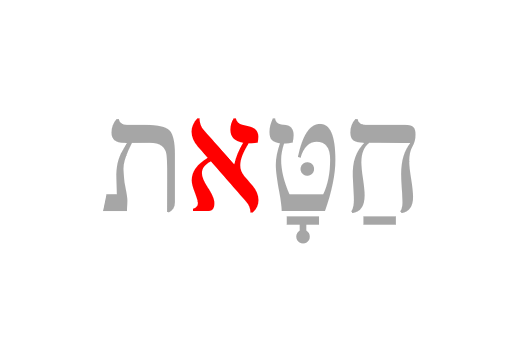

# Copyright {.unnumbered}

Placeholder


<!--chapter:end:index.Rmd-->


# Getting Started / Getting Help {- #intro-a}

Placeholder


## Navigating this book {- #navigating}
## Quick Start Instructions {.unnumbered #get_started}
## A Typical Lesson {- #typical-lesson}
## Report an Issue {- #report_issue}
## Ask a question {- #get_help}

<!--chapter:end:001A-getting-help.Rmd-->


<!--chapter:end:001L-introduction-header.Rmd-->


# About This Course {-}

Placeholder


## Why a Hebrew Grammar course {- #motivation}
## Reasons our Course is Distinct {- #our_course}
## Relationship to _Hebrew Quest_ {- #hgq_and_hq}
###  FAQ about the two courses {-}

<!--chapter:end:001N-introduction.Rmd-->


# (PART) Hebrew Grammar Foundations {-}
# The Hebrew Aleph-bet {#alephbet}

Placeholder


## First Thought {-}
### שֵׁם יְהוָה אֶקְרָא {-}
## The Hebrew Aleph-Bet {#consonants}
## Hebrew is written and read from RIGHT-to-LEFT {#right_to_left}
## Five "KiMNePaTZ" letters have different final forms {#sofit_letters}
## Six" BeGaD KePHaT" letters take a Daghesh Lene {#daghesh_lene}
## We classify four consonants as **Gutturals** (and one is a sometimes-guttural) {#gutturals}
## Look out for look-alike Letters {#look-alike-letters}
## Sephardic and "Seminary" Pronunciation {#pronunciation}
## Lesson Conclusion and Activities {-}
### Anki {- #anki-1}
### Worksheets: Letter Writing {- #worksheets-1}
## Ruth Pursuit {-}
## Ruth Pursuit Translation Worksheet {-}
## Quest Quiz {-}

<!--chapter:end:01-Alephbet.Rmd-->


# Hebrew Vowels {.vowels}

Placeholder


## First Thought {-}
###  הֵמָּה רָאוּ מַעֲשֵׂי יְהוָה {-}
## Vowels that are not vowel letters {#vowels}
### Vowels come in three types: Long, Short, Reduced | Vowels come in five classes: A, E, I, O, U {-}
## Vocal and Silent Sheva {#Sheva}
## Vowel letters {#vowel_letters}
### Vowel letters use a consonant plus a nikkud to form a vowel {-}
## Transliteration Shorthand
## "Defective" and "plene" spelling {#defective_spelling}
## The Dagesh Forte Doubles the Consonant {#dagesh_forte}
## Dagesh Forte Rule {#dagesh_forte_in_bgdkpt}
## Gutturals and Resh reject Dagesh Forte {#gutturals_reject_dagesh_forte}
## Lesson Conclusion and Activities {-}
### Anki {-}
### Vowel worksheet {-}
## Ruth Pursuit {-}
## Quest Quiz {-}
## Claim your `Twelve Tribes Badge`! {- #twelve-tribes-badge-1}

<!--chapter:end:02-Vowels.Rmd-->

# Syllabification and Pronunciation {#Syllabification}

> To comprehend Biblical Hebrew, we must know how syllables function


Originally, the Bible and other ancient documents were written without spaces.  In addition to vowels, the ancient scribes and readers organically adopted a system of syllables and accents.  They knew where one word ended and another began without needing to write it down.  

What we call "Hebrew grammar" is truly an exciting journey into the system of spoken and written Hebrew, which had its formation thousands of years ago!

::: {.infobox .map}
**LESSON ITINERARY**

1. Learn the two basic concepts of Hebrew Syllables
1. Learn the rules and terminology related to Hebrew Word Accents
1. Know the Three Rules for Recognizing Silent Sheva
1. Know the Four Rules for Recognizing Vocal Sheva: Four Rules Gutturals Reject Vocal Sheva
1. Learn the primary Hebrew Diphthong
1. Understand Vowels and Syllable Preference
1. Learn three simple miscellaneous concepts: Qamets and Qamets Hatuf, Furtive Patach Quiescent Alef
:::

::: {.infobox .stop}
**EQUIPMENT CHECK**

Before continuing, can you describe the following concepts?

* The vowels that are not letters, including their type (long, short, reduced) and class (a, e, i, o, u)
* The vowels that are letters, including which are the "irreducible long" type
* The difference between a Dagesh Forte and a Dagesh Lene
:::

Lesson 3 and Lesson 16 are the two most content-heavy lessons in this course.  For that reason, it is critical that you have your alephbet and vowels (including the vowel types) memorized.

Assuming you've checked your equipment as directed above, and everything is in tip-top shape for your Lesson 3 adventure, take your time.  Work through the written material, then do a little Anki work and see if it starts to click. 

If not, then come back here and re-read the material again. Then go back to Anki.  If you find yourself getting frustrated, take a break, and come back to it later.  Continue to work through "the fog."

You absolutely must have the concepts from this lesson hard-wired before you continue to Lesson 4.  The good news is that once you get this lesson down, the ones that follow will be relatively straightforward.

In addition to all of these new concepts, the authors have also seen fit to introduce a full set of vocabulary words AND study verses beginning with Lesson 3.  So the overall workload will increase, starting with this lesson.

We're praying for you in advance as we compile this section!  Now, climb the mountain!


## First Thought {-}

###  אַשְׁרֵי אָדָם לֹא יַחְשֹׁב יְהוָה לוֹ  {-}

*How blessed is the man to whom the LORD does not impute iniquity  (Psalms 32:2)*

Thank God for his blessings and meditate upon them.

<figure>
    <figcaption>Listen to this verse in Hebrew, then say it out loud:</figcaption>
    <audio
        controls controlsList="nodownload"
        src="./images/03.Ps3202.mp3">
            Your browser does not support the
            <code>audio</code> element.
    </audio>
</figure>

*****


```r
knitr::include_graphics("images/03-Mount of Beatitudes and Sea of Galilee, tbs75369303 (2).jpg")
```

<div class="figure" style="text-align: center">

<p class="caption">(\#fig:unnamed-chunk-1)Mount of Beatitudes and Sea of Galilee - suggested location of Yeshua's eight blessings in Matthew 5:3-12. Courtesy of the [Pictorial Library of Bible Lands](https://www.bibleplaces.com)</p>
</div>

## Hebrew Syllables {#syllables}

There are two basic concepts when it comes to Hebrew Syllables:

::: {.infobox .light}

1. Every syllable begins with one consonant and has only one vowel
2. There are only open or closed syllables 

:::


```r
knitr::include_graphics("images/03.syllable.png")
```


We see the two basic concepts at play in this simple word (pronounced "da-var" and means word, matter, thing):

* The two syllables each begin with a consonant and have one vowel
    * דָּ starts with the consonant Dalet and has one vowel, Qamets
      * This is also an example of an "open" syllable - open syllables end with a _vowel_, not a consonant
    * בָר starts with the consonant Bet and has one vowel, also a Qamets
      * This is an example of a "closed" syllable - closed syllables end with a _consonant_, not a vowel 
* If you need to know how many syllables are in a Hebrew word, count the vowels
    * Remember that vowel letters, such as the Hiriq-Yod, and Diphthongs we will see later in this lesson, count as a single vowel unit

## Hebrew Word Accents {#accents}

::: {.infobox .info}
* Most frequently, Hebrew words are accented on the last syllable  
* If not, then the accent will be on the next-to-last syllable<small>^[<small>Later in the course, we will learn about a mark called a maqqef, which is like a hyphen in English.  In Hebrew, the word to the right of the Maqqef technically does not have an accent.</small>]</small>
* Reduced vowels and Sheva never take an accent. If there is a word-final Sheva, the accent will be on the next-to-last syllable 
:::

Unlike English, Biblical Hebrew words are never stressed anywhere else<small>^[<small>Modern Hebrew has words (mostly borrowed from other languages) that don't always follow this rule</small>]</small>.


```r
knitr::include_graphics("images/03.accent_stress.png")
```


* The word on the left is stressed on the last syllable
* The word on the right (pronounced "SAY-pher" and means book, scroll, or document) is stressed on the next to last syllable
    * Some texts will place a mark over the syllable to be stressed (except when it is on the last syllable)<small>^[<small>Hebrew has a very elaborate system of [cantillation marks](https://en.wikipedia.org/wiki/Hebrew_cantillation){target="_blank"} that also serve to indicate where the accent of the word is. are used for chanting and singing.  A study of these marks is beyond the scope of this book.</small>]</small>

## Tonic, Pretonic, and Propretonic Syllables

* We will encounter specific terms for a syllable's position respective to the word's accent
* Let's use the plural of <span class="he">דָּבָר</span> to illustrate: <span class="he">דְּ ׀ בָ ׀ רִים</span>
    * The **Propretonic** syllable is two (or more) steps away from the accent = <span class="he">דְּ</span>
        * Notice how the vowel changed from the Qamets in <span class="he">דָּבָר</span> to a Vocal Shewa in <span class="he">דְּבָרִים</span>
        * This vowel shortening of the propretonic syllable is called _Propretonic Reduction_ and is extremely common in Hebrew
        * Qamets and Tsere will become Sheva (or hateph patach/hateph seghol)
    * The **Pretonic** Syllable is the syllable immediately before the accented syllable = <span class="he">בָ</span>
    * The **Tonic** syllable is the one with the accent =<span class="he"> רִים</span><small>^[<small) If there is a syllable AFTER the accented syllable, technically it is called "Posttonic," but you will not reencounter this term for the remainder of this course.  </small>]</small>
    
## Ultima, Penultima, and Antepenultima syllables

Since the accent is not always in a fixed location, we sometimes will use other words that describes a syllable's position irrespective of the accent. 

  * _ultima_ = the last syllable
  * _penultima_ = the next-to-last syllable - this is also called the "penult" syllable
  * _antepenultima_ = the syllable(s) before the _penultima/penult_
  


## Rules for Silent Sheva {#s_sheva}

Learn the three rules for differentiating a SILENT Sheva from a Vocal Sheva:

### A Sheva is SILENT when the previous vowel is short: {-}


```r
knitr::include_graphics("images/03.sheva-shortvowel.png")
```


### A Sheva is SILENT when the first of two consecutive Shevas _within a word_: {-}

```r
knitr::include_graphics("images/03.sheva-firstoftwo.png")
```


### A Sheva is SILENT when at the end of a word: {-}

```r
knitr::include_graphics("images/03.sheva-endofword.png")
```


::: {.map .light}
THREE SILENT SHEVA CLUES  

1. Previous vowel is short
2. First of two consecutive Sheva in the MIDDLE of a word
3. Word-final
:::


## Rules for Vocal Sheva {#v_sheva}

Learn the four rules for differentiating a VOCAL Sheva from a Silent Sheva

### A Sheva is VOCAL when the initial Sheva in a word: {-}


```r
knitr::include_graphics("images/03.sheva-initialvocal.png")
```


### A Sheva is VOCAL when the second of two consecutive Shevas _within a word_<small>^[<small>A Sheva at the **end** of a word is **always silent**, even when it is the second of two consecutive Shevas.</small>]</small>:  {-}


```r
knitr::include_graphics("images/03.sheva-secondoftwovocal.png")
```


### A Sheva is VOCAL when under a Dagesh Forte: {-}


```r
knitr::include_graphics("images/03.sheva-fortevocal.png")
```


### A Sheva is VOCAL after an unaccented long vowel: {-}


```r
knitr::include_graphics("images/03.sheva-unaccentedlongvocal.png")
```


This one may seem random, but it is relatively common with _long_ vowels in a propretonic position<small>^[<small>These vowels often but do not always reduce (see section 3.6). Unchangeable long vowels will never reduce.</small>]</small>  The word above is not kōṯ-vim but kō-ṯᵉ-vîm.


::: {.map .light}
FOUR VOCAL SHEVA CLUES  

1. Word-initial
2. SECOND of two within a word
3. Under a Dagesh Forte
4. After unaccented long vowel
:::


## Hebrew Diphthong = Accented Patach-Yod-Hireq {#diphthong}


```r
knitr::include_graphics("images/03.diphthong.png")
```


* The diphthong is a single vowel unit, which means it is only one syllable
* We do not pronounce the word on the right above as "BUY-it", but monosyllabic, more like "BITE"<small>^[<small>With this said, "buy" it makes a handy mnemonic for remembering this word means 'house', as there are a few look-alike words.</small>]</small>
* The word on the left is not "sh-MAY-im" but it sounds more like "sh-MIME"

::: {.box .light}
Remember "Accent+Pathach+Yod+Hireq" as the main Hebrew Diphthong:  <span class="he">יִ ַ֫</span>
:::

Qamets-Yod-Vav is another Diphthong that you'll see in Lesson 9.  It's the pronoun suffix endings for "his" or "him". 

* <span class="he">אֵלָיו</span> (to him) pronounced 'eLAV.
* <span class="he">פָּנָיו</span> (his face) pronounced paNAV

There is scholarly disagreement as to whether (vowel)+Yod are vowel letters or diphthongs.  <u>Basics of Biblical Hebrew</u> treats them as vowel letters.


## Vowels and Syllable Preference {#vowel_pref}


```r
knitr::include_graphics("images/03.vowelpreferencetable.png")
```


This table may seem like minutiae, but do yourself a favor: memorize it, noting the following:

* *In an open pretonic syllable, Hebrew REQUIRES a long vowel.
* *In a closed unaccented syllable, Hebrew REQUIRES a short vowel.
* **Open/Propretonic _must_ reduce from a long vowel to Vocal Sheva (or Hateph if guttural), _except_ when there is an unchangeable long vowel
  * Go back and look at <span class="he">דָּבָר</span> and <span class="he">דְּבָרִים</span>
    * The vowel preference table explains why the vowel under the Dalet changes from Qamets in the open pretonic to Vocal Shewa (reduced vowel) in the open propretonic when the plural suffix "im" is added
    * This is called "_propretonic reduction_" - you will encounter this topic frequently.   
  * As we saw with <span class="he">כֹּתְבִים,</span> uunchangeable long vowels written "defectively" will not reduce - at their essence, they are still unchangable.

## Qamets Hatuf, Furtive Patach, Quiescent Alef {#misc_vowels}

These are three miscellaneous but straightforward rules.

::: {.infobox .light} 
Qamets Hatuf ONLY occurs in a Closed AND Unaccented syllable


```r
knitr::include_graphics("images/03.qametshatuf.png")
```


:::

There are many instances where the vowel could be a short qamets-hatuf vowel in a closed syllable, or the long Qamets, A-class vowel in an open syllable.  When this ambiguity occurs, many printings will print a vertical line called a meteg בָּֽ.  The meteg tells you the vowel is the **long, a-class**


```r
knitr::include_graphics("images/03.meteg.png")
```


*****

::: {.infobox .light} 
Furtive Patach under final ח or ע is said BEFORE the guttural letter and is not a full vowel


```r
knitr::include_graphics("images/03.furtivepathach.png")
```


:::

The Furtive Patach is a significant exception to just about everything else we've discussed related to vowels and syllabification:
  * The vowel is pronounced *before* the guttural - so the above word is **Ruach** not "rucha"
  * The Furtive Patach is not a full vowel and is counted in syllabification - so the above word is **Ruach** not "ru-ach"

*****

::: {.infobox .light} 
Quiescent Aleph is silent, neither a consonant nor a vowel


```r

```


:::

* When you see an Aleph with no vowels, it is acting as a silent letter
    * English has all kinds of silent letters, like the 'p' in receipt - the Quiescent Aleph works the same way
    * In terms of syllabification, the Aleph is neither a vowel nor a consonant, so it doesn't count at all - it is just an extra letter
    
## Lesson Conclusion and Activities {-}

Congratulations on getting this far! We realize that there are a lot of heavy concepts you face in this Lesson.

Some of you may try to read this lesson then do the Anki work (perhaps repeated a few times), and you still aren't getting it.  The Fog isn't clearing.  If this is the case, and you want a more in-depth lecture covering this material, we recommend [Dr. John Beckman's hour-long YouTube Lecture on lesson 3](https://www.youtube.com/watch?v=AY7KAsD4fZg&feature=youtu.be){target="_blank"}

For this lesson, we are introducing two new activities that correspond with the official launch of `Vocabulary` and `Study Verses` you will see in `Anki`.

### Introduction to Video Warm-ups {-}

* On the next two pages are videos of the vocabulary words and then the study verses
* Practice speaking the word/verses aloud, following along with Izzy 
* You may not know what the words mean yet, and that's fine (that's where Anki comes in)
* Consider this some "syllabic stretching" before you do your full Anki workout!

Then after watching these, go ahead and jump into `Anki`.

* `Lesson 03 A. Vocab` - This is our first lesson with the <u>Basics of Biblical Hebrew</u> vocabulary list.
* `Lesson 03 B. Grammar` - This module will reinforce and expand on the Seven Practical Points for this lesson.
* `Lesson 03 C. Study Verses`
  * This is also the verse lesson using the <u>Basics of Biblical Hebrew</u> study verses.
  * The translation may be difficult at first. It may take you several attempts before you can select `Good` without using the `Hints`.
  * Be patient and stick with it - you'll get it!

## Word Warm-up {-}

[Click to open `Word Warm-up` video in a new tab](https://youtu.be/h0Ni1_Zya2U){target="_blank"}

<iframe width="768" height="432" src="https://www.youtube.com/embed/h0Ni1_Zya2U" frameborder="0" allow="accelerometer; autoplay; clipboard-write; encrypted-media; gyroscope; picture-in-picture" allowfullscreen></iframe>

## Verses Warm-up {-}

* Over the entire 35-lesson course, you will learn to translate almost 500 Hebrew Verses.  The greatest journey begins with a single step.  You are now about to take that step!
     
[Click to open `Verses Warm-up` video in a new tab](https://youtu.be/9IkIvWPArlA){target="_blank"}

<iframe width="768" height="432" src="https://www.youtube.com/embed/9IkIvWPArlA" frameborder="0" allow="accelerometer; autoplay; clipboard-write; encrypted-media; gyroscope; picture-in-picture" allowfullscreen></iframe>


  
## Ruth Pursuit {-}        

:::
YOUR QUEST

1. Identify all examples of the Tetragrammaton, which we pronounce "Adonai" when we encounter it in Scripture.  There are six instances of the Name. Also, <span class="he">שַׁדַּי</span> is another name for God.  It means "Almighty".  Find two examples of this name. (Blue)
2. In verse 16, highlight, <span class="he">"עַמֵּךְ עַמִּי וֵאלֹהַיִךְ אֱלֹהָי"</span> in green. This is the famous verse, "your people (will be) my people, and your God, my God."  One of your vocabulary words is <span class="he">אֱלֹהִים</span>. In the last two words of what you just highlighted, you can still see the core portion of <span class="he">אֱלֹהִים</span> present.  Begin to notice how Hebrew uses different suffixes to denote "your" and "my."
3. In verse 1, find one Sheva that begins a word and one Sheva that concludes a word. (Yellow) Which one is a silent Sheva, and which one is the vocal Sheva?
4. Find the Quiescent Aleph in verse 1 (pink)
5. Find the Hebrew words for Elimelech, Machlon, Chilion, and Judah in verses 1-7. Chilion has the prefix "וְ" which means "and". (gray)
6. For personal reflection, open an English translation side-by-side with your Hebrew version of Ruth 1.  Note how the foreigner Ruth uses both <span class="he">אֱלֹהִים</span> and the Tetragrammaton in verses 16 and 17, respectively.  Why do you think this might be? Would you say the names are used interchangeably, or do you think there is a deeper purpose?  May we always seek HIM, just as you have done in this activity!

:::

* [Blank copy of Ruth 1](https://drive.google.com/file/d/1qcfTKAlTJGChC2eYCMhSbY2w-ibzCcDV/copy){target="_blank"}
* [Ruth Pursuit Answer Key #3](./images/03_Ruth Pursuit KEY.pdf){target="_blank"}
* Be sure to update your `Ruth Pursuit Translation` worksheet from Lesson 1 with this lesson's words.  We encourage you to use "HaShem" or "Adonai" for the Tetragrammaton.


## Quest Quiz {-}

[Open Quest Quiz #3 in a new window](https://docs.google.com/forms/d/e/1FAIpQLSfCy3m3L8z1a5EjEMtEBVWjoci-JvWfYzUVEIpnQHIgGwvu1g/viewform){target="_blank"}


<div class="containerLet">
<iframe class="responsive-iframe" src="https://docs.google.com/forms/d/e/1FAIpQLSfCy3m3L8z1a5EjEMtEBVWjoci-JvWfYzUVEIpnQHIgGwvu1g/viewform?embedded=true" frameborder="0"></iframe>
</div>

<!--chapter:end:03-Syllabification.Rmd-->


# (PART) Nouns, Prepositions, Pronouns {-}
# Hebrew Nouns {.Nouns}

Placeholder


## First Thought {-}
### רְאֵה לִמַּדְתִּי אֶתְכֶם חֻקִּים וּמִשְׁפָּטִים {-}
## Gender and Number {#gender_number}
## Singular Noun Endings {#sing_noun_endings}
## Plural Noun Endings {#noun_pluralization}
## Dual Noun Endings
## Special dual forms {#dual_forms}
## Irregular Pluralization  {#irregular_pluralization}
### Segholate Nouns follow a standard vowel pattern when pluralizing {-}
### Geminate words take a Daghesh Forte {-}
## Rule of Sheva {#rules_sheva}
## Lexical Form {#lexical_form}
## Word Warm-up {-}
## Verses Warm-up {-}
## Anki {-}
## Ruth Pursuit {-}        
## Quest Quiz {-}

<!--chapter:end:04-NounsPlural.Rmd-->


# Definite Article and Conjunction Vav {.Article}

Placeholder


## First Thought {-}
### <span class="he">מִי־מָדַד בְּשָׁעֳלוֹ מַיִם וְשָׁמַיִם</span> {-}
## Translate the Vav Conjunction {#vav_translate}
## Identify the Vav Conjunction {#vav_identify}
## Loss of Daghesh Forte {#loss_daghesh_forte}
## Translate the Article {#article_translate}
## Identify the Article {#article_identify}
## Compensatory Lengthening
## Hebrew Indefiniteness {#indefiniteness}
## Hebrew Definiteness {#definiteness}
## Lesson Conclusion and Activities {-}
## Word Warm-up {-}
## Verses Warm-up {-}
## Anki {-}
## Ruth Pursuit {-}        
## Quest Quiz {-}
## Claim your next `Twelve Tribes Badge`! {-}

<!--chapter:end:05-DefArt_Conjunction.Rmd-->


# Hebrew Prepositions

Placeholder


## First Thought {-}
### <span class="he">  בְּיוֹם צָרָתִי אֲדֹנָי דָּרָשְׁתִּי </span> {-}
## Nun with Silent Sheva Becomes Daghesh Forte
## Independent and Maqqef prepositions 
## Inseparable prepositions
## The Article and Inseparable Prepositions
## The flexible <span class="he">מִן</span>: construction
## The flexible <span class="he">מִן</span>: meanings 
## The Definite Direct Object marker 
## Review and Activities {-}
### Anki {-}
## Word Warm-up {-}
## Verses Warm-up {-}
## Ruth Pursuit {-}        
## Quest Quiz {-}

<!--chapter:end:06-Prepositions.Rmd-->


# Hebrew Adjectives

Placeholder


## First Thought {-}
### <span class="he">אֶת־הַכֹּל עָשָׂה יָפֶה בְעִתּוֹ</span> {-}
## Inflecting Adjectives
## Substantival Use
## Attributive Use
## Predicative Use
## Adjective Use Summary
## The Mappiq 
## The Directional Ending 
## Word Warm-up {-}
## Verses Warm-up {-}
## Anki {-}
## Ruth Pursuit {-}        
## Quest Quiz {-}
## Claim your next `Twelve Tribes Badge`! {-}

<!--chapter:end:07-Adjectives.Rmd-->


# Hebrew Pronouns

Placeholder


## First Thought {-}
### <span class="he">זֶה הַדֶּרֶךְ לְכוּ בוֹ</span> {-}
## Independent Personal Pronoun
## Relative Pronoun <span class="he">אֲשֶׁר</span>
## Interrogative Pronoun
## Interrogative Particle <span class="he">הֲ</span>
### Interrogative Particle vs Definite Article {-}
## Near and Far Demonstratives
## Demonstrative Adjective 
## Demonstrative Pronoun
## Conclusion and Intro to Activities {-}
## Word Warm-up {-}
## Verses Warm-up {-}
## Anki {-}
## Worksheets: Pronouns {-}
## Ruth Pursuit {-}        
## `Quest Quiz` {-}

<!--chapter:end:08-Pronouns.Rmd-->


# Hebrew Pronominal Suffixes

Placeholder


## First Thought {-}
### <span class="he">וַיֹּאמְרוּ שָׁאוֹל שָׁאַל־הָאִישׁ לָנוּ וּלְמוֹלַדְתֵּנוּ </span> {-}
## Meaning
## Type 1 vs Type 2 Suffixes
## Singular Suffixes
## Plural Suffixes
## Distinguish Type 1 from Type 2
## Lexical Form with Type 1
## Lexical Form with Type 2
## Unexpected changes
## Look-alike words: <span class="he">אֵת</span> as "with" or as Definite Direct Object (DDO) marker
## Look-alike words:   <span class="he">עִם</span>, "with", or <span class="he">עַם</span>, "people" 
## Look-alike words: <span class="he">אֵל</span>, "God", or <span class="he">אֶל</span>, "to"
## Word Warm-up {-}
## Word Warm-up: pronominal suffixes {-}
## Verses Warm-up {-}
## Anki {-}
## Worksheets: Pronominal Suffixes {-}
## Ruth Pursuit {-}        
## `Quest Quiz` {-}

<!--chapter:end:09-Pronominal_Suffixes.Rmd-->


# Hebrew Construct Chain {.ConstructChain}

Placeholder


## First Thought {-}
### <span class="he">בְּצֶדֶק כָּל־אִמְרֵי־פִי</span> {-}
## What is a Construct Chain?
## What makes a construct chain
## Review: what makes a word definite 
## The Absolute noun establishes the definiteness of a chain
## How to Recognize a Construct Chain
## Identifying Construct state by Noun Endings
## Construct Chain Summary
## Word Warm-up {-}
## Verses Warm-up {-}
## Anki {-}
## Worksheets: Construct Identification {-}
## Ruth Pursuit {-}        
## Quest Quiz #10 {-}
## Claim your next `Twelve Tribes Badge`! {-}

<!--chapter:end:10-ConstructChain.Rmd-->


# Hebrew Numerals

Placeholder


## First Thought {-}
## The Biblical text always spells out numbers
## Notes and footnotes use symbols for numbers
## Hebrew Ordinal Numbers
### Hebrew Quest Ordinal Numbers Video {-}
## Cardinal Numbers 1-10
### Digits 1 and 2 match the gender of the noun {-}
### Digits 3-10 take the opposite gender of the noun {-}
## Cardinal Numbers Above 10
## Conclusion
### Anki {-}
## Word Warm-up {-}
## x Verses Warm-up` {-}
## Ruth Pursuit {-}        

<!--chapter:end:11-Numerals.Rmd-->


# (PART) Qal Binyanim {-}
# Introduction to Unit 3 {-}

Placeholder


## Vowel Transliteration/Shorthand
## Word Initial Combinations
## Changes for Unit 3: No more quizzes!
## Changes for Unit 3: Cantillation Marks added to Study Verses {-}
## Changes for Unit 3: OPTIONAL Hebrew Quest Study Passage Translation{-}
## Keep going! {-}

<!--chapter:end:11b-Unit3_Intro.Rmd-->


# Introduction to Hebrew Verbs

Placeholder


## First Thought {-}
### <span class="he">וְהֽוּא־הָלַ֤ךְ בַּמִּדְבָּר֙ דֶּ֣רֶךְ י֔וֹם </span> {-}
## The Verbal Root
## Person, Gender, Number
## Verb nomenclature
## Preformatives, Sufformatives, Prefixes, and Suffixes
## Verbal Vowels
## The Seven Hebrew Verb Stems
## The Seven Stems: Summary Table
## The Eight Basic Conjugations
## Finite vs Non-Finite Conjugations
## Parsing
## Parsing Codes
## Strong and Weak Verbs
## Weak Verb Classes
## Hebrew GRAMMAR Quest is a Quest for RECOGNITION NOT RECALL
## A note on the paradigm strong verb <span class="he">קטל</span>
## Word Warm-up {-}
## Verses Warm-up {-}
## Anki {-}
## Ruth Pursuit {-}        
## OPTIONAL: _Hebrew Quest_ Study Passage Track: Proverbs Study #1-4 {-}

<!--chapter:end:12-Verbs_Intro.Rmd-->


# Qal Perfect - Strong Verbs {.QP-s}

Placeholder


## First Thought {-}
### <span class="he">לֹא־שָׁמְר֤וּ אֲבוֹתֵ֙ינוּ֙ אֶת־דְּבַ֣ר יְהוָ֔ה </span> {-}
##  Qal is Simple action, Active voice
## Perfect is completed action or a state as a whole
## Components of the Qal Perfect Strong Paradigm
## The Perfect Sufformatives
## Qal Perfect Vowels: $V_1$ is almost always Qamets
## Qal Perfect Vowels: $V_2$ prefers patach
## $V_S$ is accented in Finite verbs
## A Sheva precedes a Finite Sufformative
## Building the Qal Perfect Strong Paradigm
## Hearing the Qal Perfect Strong Paradigm
## Worksheet: Qal Perfect Strong Paradigm {-}
## Qal Perfect Strong Examples
## Deviations from the Paradigm
## 3נ and 3ת Verbs
## Stative Verbs MAY have a different $V_S$
## Word Warm-up {-}
## Verses Warm-up {-}
## Anki {-}
## Ruth Pursuit {-}        
## X Claim your next `Twelve Tribes Badge`! {-}
## OPTIONAL: _Hebrew Quest_ Study Passage: Proverbs #5-7 {-}

<!--chapter:end:13-Qal_Perfect_Strong.Rmd-->


# Qal Perfect - Weak Verbs {.QP-w}

Placeholder


##  First Thought {-}
### <span class="he">בָ֤אָה נַחֲלָתֵ֙נוּ֙ אֵלֵ֔ינוּ מֵעֵ֥בֶר הַיַּרְדֵּ֖ן מִזְרָֽחָה׃</span> {-}
## Review
## 3נ and 3ת with Silent Sheva Assimilate to Dagesh
## Review of Guttural Principles
## 1G, 2G
## 3-ע/ח
## א3 
## <span class="he">יָרֵא</span> is 3א AND Tsere Stative
## 3ה  
## Doubly Weak
## <span class="he">הָיָה</span>
## Geminate
## Biconsonantal
## <span class="he">םוּת</span> is Biconsonantal and Stative
## Qal Perfect Quest Clues
## Clues for Qal Perfect Special Situations
## Word Warm-up {-}
## Verses Warm-up {-}
## Anki {-}
## Ruth Pursuit {-}    
## X Quest Quiz {-}
## OPTIONAL: _Hebrew Quest_ Study Passage: Proverbs #8-10 {-}

<!--chapter:end:14-Qal_Perfect_Weak.Rmd-->


# Qal Imperfect - Strong Verbs {.QI-s}

Placeholder


## First Thought {-}
### <span class="he">יִ֝שְׁמֹ֗ר כָּל־אָרְחֹתָֽי׃ </span> {-}
## Translating the Imperfect
## The Imperfect Always has a Preformative
## Qal Imperfect Vowels
## Imperfect Sufformatives
## Building the Qal Imperfect Strong Paradigm
## Hearing the Qal Imperfect Strong Paradigm
## Worksheets: Qal Imperfect Strong Paradigm {-}
## Qal Imperfect Strong Examples
## Deviations from the Paradigm
## Translating Negative Commands
## Word Warm-up {-}
## Verses Warm-up {-}
## Worksheets: Qal Imperfect Strong Paradigm {-}
## Ruth Pursuit {-}   
## X Quest Quiz {-}
## OPTIONAL: _Hebrew Quest_ Study Passage: Proverbs #11-14 {-}

<!--chapter:end:15-Qal_Imperfect_strong.Rmd-->


# Qal Imperfect Weak {.QI-w}

Placeholder


## First Thought {-}
### <span class="he">וְעֵינֵיכֶ֖ם תִּרְאֶ֑ינָה</span> {-}
## Our Quest
## 2G 
## 3חע
## 3א  
## 3ה 
## 1G
## 1א "Angry Baker"
## Geminate
## Biconsonantal
## 1-Yod 
## הלך 
## <span class="he">יכל</span> takes $V_P = \bar U$
## 1נ Assimilates with Silent Sheva
## לקח
## Doubly Weak
## נתן is 1נ and 3נ
## ראה vs. ירא
## Qal Imperfect Weak Summary
## Word Warm-up {-}
## Verses Warm-up {-}
## Ruth Pursuit {-}   
## X Quest Quiz {-}
## X Claim your next `Twelve Tribes Badge`! {-}
## OPTIONAL:  _Hebrew Quest_ Study Passage: Proverbs #15-17 {-}

<!--chapter:end:16-Qal_Imperfect_Weak.Rmd-->


# Vav Consecutive {.wc}

Placeholder


## First Thought {-}
### <span class="he">וַיַּשְׁכִּ֣מוּ בַבֹּ֔קֶר וַיַּֽעֲל֥וּ אֶל־רֹאשׁ־הָהָ֖ר </span> {-}
## Review of the Conjunction Vav
## Perfect + וְ: Spelling
## Perfect + וְ: Translating
## Imperfect + וְ: Spelling
## Imperfect with Vav often indicates purpose
## Imperfect Waw Consecutive: Spelling (Strong)
## Imperfect Waw Consecutive: Spelling (Weak)
## Imperfect Waw Consecutive: Translation
### Usually translate Iwc as PAST TENSE {-}
## Summary
## Word Warm-up {-}
## Verses Warm-up {-}
## Worksheets: Qal Vav-Consecutive Paradigms {-}
## Ruth Pursuit {-}   
## Hebrew Quest Study Passage: Genesis 1:1-5 {-}
## X Quest Quiz {-}
## X Claim your next `Twelve Tribes Badge`! {-}

<!--chapter:end:17-Vav_Consecutive.Rmd-->


# Qal Imperative {.QM}

Placeholder


## First Thought {-}
### <span class="he">וְעַתָּ֣ה יִשְׂרָאֵ֗ל שְׁמַ֤ע אֶל־הַֽחֻקִּים֙ וְאֶל־הַמִּשְׁפָּטִ֔ים אֲשֶׁ֧ר אָֽנֹכִ֛י מְלַמֵּ֥ד אֶתְכֶ֖ם לַעֲשׂ֑וֹת</span> {-}
## Volitional Forms Introduction
## Negative Commands use the Jussive or the Imperfect
## The Imperative is the Imperfect withoug the Imperfect Preformative
## Identifying QM
## <span class="he">נָה</span> can follow volitional verbs
## Distinguishing QM2ms, QI3ms, and QP3ms
## Paragogic ה 
## 3ה Verbs
## 1נ and 1י
## Biconsonantal and Geminate
## QP3ms and QP2ms
## QP3mp and QP2mp
## Cohortative and Jussive
## Some weak verbs often shorten the Jussive singular
## Word Warm-up {-}
## Verses Warm-up {-}
## Worksheets: Qal Volitional Forms {-}
## Ruth Pursuit {-}   
## Hebrew Quest Study Passage: The Shema {-}
## X Quest Quiz {-}
## X Claim your next `Twelve Tribes Badge`! {-}

<!--chapter:end:18-Qal_Imperative_strong.Rmd-->


# Pronominal Suffixes on Verbs {.VerbSuffix}

Placeholder


## X First Thought {-}
### X <span class="he">אֲנִֽי־קְרָאתִ֣יךָ כִֽי־תַעֲנֵ֣נִי אֵ֑ל הַֽט־אָזְנְךָ֥ לִ֝֗י שְׁמַ֣ע אִמְרָתִֽי׃</span> {-}
## Hebrew Direct Object Pronouns
## Verbs use Type 1 Suffixes
## QP Vowel Changes
## QI Vowel Changes 
## QM Vowel Changes
## Imperative/Perfect Ambiguity when normal Imperative $V_S = A$
## X <stem> Verb Stem Table 
## X <stem> Meanings
## X <stem> Strong Word-initial Combinations 
## X <stem> Strong Stem Vowels 
## X <stem>: what to memorize
## X <stem> Perfect Strong
## X <stem> Imperfect Strong
## X <stem> Imperative Strong
## X <stem> Infinitives Strong
## X <stem> Participle Strong
## X <stem> Parsing Examples
## Word Warm-up {-}
## Verses Warm-up {-}
## Ruth Pursuit {-}        
## Hebrew Quest Study Passage: Matthew 6 {-}
## X Quest Quiz {-}
## X Claim your next `Twelve Tribes Badge`! {-}

<!--chapter:end:19-Pronominal_Suffix_Verbs.Rmd-->


# Qal Infinitive Construct {.Qinfinitive}

Placeholder


## First Thought {-}
###  <span class="he">וְשָׁ֣מַרְתָּ֔ אֶת־מִצְוֺ֖ת יְהוָ֣ה אֱלֹהֶ֑יךָ לָלֶ֥כֶת בִּדְרָכָ֖יו וּלְיִרְאָ֥ה אֹתֽוֹ׃</span> {-}
## Two types of Infinitives
## Q∞ Spelling
## 3ה Endings
## 1י and 1נ Spelling
## Biconsonantal
## Q∞ often is identical to QM2ms
## ∞ take Type 1 Pronominal Suffixes
## Most ∞ have a prefixed preposition
## Meaning of ∞
## Negating the Infinitive
## Word Warm-up {-}
## Verses Warm-up {-}
## Ruth Pursuit {-}   
## Hebrew Quest Study Passage: Genesis 22:1-19 {-}
## X Quest Quiz {-}
## X Claim your next `Twelve Tribes Badge`! {-}

<!--chapter:end:20-Qal_Infinitive_Construct.Rmd-->


# Qal Infinitive Absolute {.QA}

Placeholder


## First Thought {-}
### <span class="he">אָנֹכִ֗י אֵרֵ֤ד עִמְּךָ֙ מִצְרַ֔יְמָה וְאָנֹכִ֖י אַֽעַלְךָ֣ גַם־עָלֹ֑ה</span> {-}
## QA
## 3ה endings
## Meaning of Infinitive Absolute
## Infinitive Construct vs Infinitive Absolute
## **יֵשׁ *** and **אֵין *** 
## Word Warm-up {-}
## Verses Warm-up {-}
## Ruth Pursuit {-}   
## Hebrew Quest Study Passage: Numbers 6: Priestly Blessing {-}
## X Quest Quiz {-}
## X Claim your next `Twelve Tribes Badge`! {-}

<!--chapter:end:21-Qal_Infinitive_Absolute.Rmd-->


# Qal Participle {.QPt}

Placeholder


##  First Thought {-}
###  <span class="he">וְיִבְטְח֣וּ בְ֭ךָ יוֹדְעֵ֣י שְׁמֶ֑ךָ כִּ֤י לֹֽא־עָזַ֖בְתָּ דֹרְשֶׁ֣יךָ יְהוָֽה׃ </span> {-}
## Participles are Verbal Adjectives
## Qal Participle
## Prefixes and Suffixes
## Biconsonantal 
## 3ה were originally 3י
### We can now complete our 3ה $V_2$ table {-}
## Stem Comparison Table
## Word Warm-up {-}
## Verses Warm-up {-}
## Worksheets: All Qal Paradigms {-}
## Ruth Pursuit {-}        
## Hebrew Quest Study Passage: Matthew 13 {-}
## X Quest Quiz {-}
## X Claim your next `Twelve Tribes Badge`! {-}

<!--chapter:end:22-Qal_Participle.Rmd-->


# Hebrew Syntax {.Syntax}

Placeholder


## First Thought {-}
### <span class="he">עַתָּה יָדַעְתִּי כִּי־גָדוֹל יְהוָה מִכָּל־הָאֱלֹהִים</span> {-}
## Clause versus Sentence
## Word order
## Perfect Syntax
## Imperfect Syntax
## Volitional Syntax
## Conditional Phrases
## Disjunctive Vav
## Adverbs
## Word Warm-up {-}
## Verses Warm-up {-}
## Ruth Pursuit {-}        
## Hebrew Quest Study Passage: Psalm 19 {-}

<!--chapter:end:23-Hebrew_Syntax.Rmd-->


# (PART) Derived Binyanim {-}
# Introduction to Unit 4 {-}

Placeholder


## Lessons 24-35 {-}
## Ruth Pursuits {-}
## Review: Vowel and Consonant Shorthand
## Review: Stem Vowel is the Vowel with the 2nd Root Consonant
## Stem Vowel Pattern Nomenclature
## Review: Sheva before Finite Verb Endings

<!--chapter:end:23b-Unit4_Intro.Rmd-->


# The Niphal Stem - Strong Verbs

Placeholder


## First Thought {-}
### <span class="he"> וּמִן־הַגָּדִ֡י נִבְדְּל֣וּ אֶל־דָּוִיד֩ לַמְצַ֨ד מִדְבָּ֜רָה</span> {-}
## Niphal Verb Stem Table
## Niphal Meanings
## Parsing Clues - _Pre_:  the נ prefix is added to EVERY conjugation
## Parsing Clues - $V_S = A \sim \bar E(A)$
## What to memorize for all Derived Stems {-}
## What to memorize for Niphal 
## Paradigm: Niphal Perfect Strong
## Paradigm: Niphal Imperfect Strong
## Paradigm: Niphal Imperative Strong
## Paradigm: Niphal Infinitives Strong
### Derived Stem Infinitive Absolute $V_S = \bar E$ (usually) {-}
## Paradigm: Niphal Participle Strong
### Derived Stem Participle $V_S =$ the P3ms Vowel, lengthened if possible (usually) {-}
## Participle Prefixes in the Derived Stems
## Forms with Identical Spelling
## Easily Confused Forms
## Niphal Parsing Examples
## Stem Comparison Table
## Word Warm-up {-}
## Verses Warm-up {-}
## Worksheets: Niphal Strong Paradigm {-}
## Hebrew Quest Study Passage: Numbers 15 {-}

<!--chapter:end:24-Niphal_Strong.Rmd-->


# The Niphal Stem - Weak Verbs {.N-w}

Placeholder


## First Thought {-}
###  <span class="he">וְקָרְא֥וּ לָהֶ֛ם עַם־הַקֹּ֖דֶשׁ גְּאוּלֵ֣י יְהוָ֑ה וְלָךְ֙ יִקָּרֵ֣א דְרוּשָׁ֔ה עִ֖יר לֹ֥א נֶעֱזָֽבָה׃</span> {-}
## A weak consonant affects the vowels that touch it
## 1-Guttural 
## 1-Yod
## 1-Nun with Silent Sheva Assimilates
## 3-Aleph Changes $V_S$
## 3-Hei Verbs Follow the same general principles
## What to Memorize for Niphal Weak
## Top 10 Niphal Verbs 
## Word Warm-up {-}
## Verses Warm-up {-}
## Ruth Pursuit {-}        
## Hebrew Quest Study Passage: John 1 {-}
## X Quest Quiz {-}
## X Claim your next `Twelve Tribes Badge`! {-}

<!--chapter:end:25-Niphal_Weak.Rmd-->


# The Piel Stem - Strong Verbs {.D-s}

Placeholder


## First Thought {-}
### <span class="he">בִּשְׂפָתַ֥י סִפַּ֑רְתִּי כֹּ֝֗ל מִשְׁפְּטֵי־פִֽיךָ׃</span> {-}
## Piel Verb Stem Table 
## Piel Meanings
## Piel is the D stem because $R_2$ takes a Doubling Dagesh Forte
## Memorize piēl - paēl
## Pay attention when $R_2$ is a SQiN eM LeVY consonant
## Piel: what to memorize
## Piel Perfect Strong
## Piel Imperative Strong
## Piel Infinitives Strong
## Piel Participle Strong
### Participle Prefixes in the Derived Stems {-}
## Piel Parsing Examples
## Stem Comparison Table
## Word Warm-up {-}
## Verses Warm-up {-}
## Worksheets: Piel Strong Paradigms {-}
## Ruth Pursuit Analysis
## Hebrew Quest Study Passage: Exodus 31 {-}
## X Quest Quiz {-}
## X Claim your next `Twelve Tribes Badge`! {-}

<!--chapter:end:26-Piel_Strong.Rmd-->


# The Piel Stem - Weak Verbs {.D-w}

Placeholder


## First Thought {-}
### <span class="he">בֹּ֤אוּ שְׁעָרָ֨יו ׀ בְּתוֹדָ֗ה חֲצֵרֹתָ֥יו בִּתְהִלָּ֑ה הֽוֹדוּ־ל֝֗וֹ בָּרֲכ֥וּ שְׁמֽוֹ׃</span> {-}
## 3-Guttural
## 2-Aleph/Resh often cause DP $V_1 = \bar E$ and $V_1 = \bar A$ in all other forms
## 1-Nun
## Biconsonantal: the Polel minor stem
## Geminate
## Other weak $R_1$ forms
## What to Memorize for Piel Weak
## Piel Weak Parsing Examples
## Top 10 Piel Verbs
## Word Warm-up {-}
## Verses Warm-up {-}
## Ruth Pursuit {-}        
## Hebrew Quest Study Passages: Psalms 1 and 27 {-}
## X Quest Quiz {-}
## X Claim your next `Twelve Tribes Badge`! {-}

<!--chapter:end:27-Piel_Weak.Rmd-->


# The Pual Stem - Strong Verbs {.Dp-s}

Placeholder


## First Thought {-}
### <span class="he">בְּחֶ֣סֶד וֶ֭אֱמֶת יְכֻפַּ֣ר עָוֺ֑ן וּבְיִרְאַ֥ת יְ֝הוָ֗ה ס֣וּר מֵרָֽע׃</span> {-}
## Pual Verb Stem Table and Meaning
## Parsing Clues - _Pre_: $V_1 = U$ - ALWAYS for strong verbs
## Parsing Clues - $V_S = A$ and Dagesh Forte in $R_2$
## Pual: what to memorize
## X Perfect  
## X Imperfect  
## X Participle
### Participle Prefixes in the Derived Stems {-}
## Pual Parsing Examples
## Stem Comparison Table
## Word Warm-up {-}
## Verses Warm-up {-}
## Ruth Pursuit Analysis {-}
## X Claim your next `Twelve Tribes Badge`! {-}
## OPTIONAL Worksheets: Pual Paradigm {-}
## OPTIONAL Hebrew Quest Study Passage: Revelation 1 {-}

<!--chapter:end:28-Pual_Strong.Rmd-->


# The Pual Stem - Weak Verbs {.Dp-w}

Placeholder


## X First Thought {-}
### <span class="he">גִּבּ֣וֹר בָּ֭אָרֶץ יִהְיֶ֣ה זַרְע֑וֹ דּ֭וֹר יְשָׁרִ֣ים יְבֹרָֽךְ׃</span> {-}
## The Pual diagnostic $V_1 = U$ is maintained in almost all weak verbs
## 2-Gutturals Reject Dagesh Forte
## Biconsonantal: the Polal minor stem
## Word Warm-up {-}
## Verses Warm-up {-}
## Ruth Pursuit 
## Hebrew Quest Study Passage: Psalms 145 {-}
## X Quest Quiz {-}
## X Claim your next `Twelve Tribes Badge`! {-}

<!--chapter:end:29-Pual_Weak.Rmd-->


# The Hiphil Stem - Strong Verbs {.H-s}

Placeholder


## First Thought {-}
### <span class="he">לְכוּ־נָ֛א וְנִוָּֽכְחָ֖ה יֹאמַ֣ר יְהוָ֑ה אִם־יִֽהְי֨וּ חֲטָאֵיכֶ֤ם כַּשָּׁנִים֙ כַּשֶּׁ֣לֶג יַלְבִּ֔ינוּ אִם־יַאְדִּ֥ימוּ כַתּוֹלָ֖ע כַּצֶּ֥מֶר יִהְיֽוּ׃</span> {-}
## Meaning of the Hiphil
## Hiphil Strong Word Initial Combinations - Think "HIphil-HAphil"
## Hiphil $V_S = Î[A] \sim Î(Ē)$
### Exception to $V_S$ pattern {-}
## Don’t confuse <span class="he">ְ הִ</span> with Niphal Preformative <span class="he">ָּּ הִ</span>
## Don't confususe Hiphil Imperfect <span class="he">ְ יַ</span> with Qal Imperfect <span class="he">ְ יִ</span>
## Hiphil Perfect Strong Paradigm
## Hiphil Imperfect Strong Paradigm
## Hiphil Imperative Strong Paradigm
## Hiphil Infinitives Strong
## Participle Strong
### Participle Prefixes in the Derived Stems {-}
## Strong Summary
## Stem Comparison Table
## Hiphil Strong Paradigm Worksheet {-}
## Word Warm-up {-}
## Verses Warm-up {-}
## Ruth Pursuit Analysis {-}
## Hebrew Quest Study Passage: Exodus 19 {-}
## X Quest Quiz {-}
## X Claim your next `Twelve Tribes Badge`! {-}

<!--chapter:end:30-Hiphil-Strong.Rmd-->


# The Hiphil Stem - Weak Verbs {.H-w}

Placeholder


## First Thought {-}
### <span class="he">תּ֘וֹרַ֤ת יְהוָ֣ה תְּ֭מִימָה מְשִׁ֣יבַת נָ֑פֶשׁ עֵד֥וּת יְהוָ֥ה נֶ֝אֱמָנָ֗ה מַחְכִּ֥ימַת פֶּֽתִי׃</span> {-}
## Weak Verbs Review: 
## 1-Guttural
## 3-Hei
## X <stem>: what to memorize
## Top 10 Hiphil Verbs
## Word Warm-up {-}
## Verses Warm-up {-}
## Ruth Pursuit {-}        
## Hebrew Quest Study Passage: Exodus 20 {-}
## X Quest Quiz {-}
## X Claim your next `Twelve Tribes Badge`! {-}

<!--chapter:end:31-Hiphil-Weak.Rmd-->


# The Hophal Stem - Strong Verbs {.Hp-s}

Placeholder


## First Thought {-}
### <span class="he">וְהָ֣אֲנָשִׁ֔ים טֹבִ֥ים לָ֖נוּ מְאֹ֑ד וְלֹ֤א הָכְלַ֙מְנוּ֙ וְלֹֽא־פָקַ֣דְנוּ מְא֔וּמָה כָּל־יְמֵי֙ הִתְהַלַּ֣כְנוּ אִתָּ֔ם בִּֽהְיוֹתֵ֖נוּ בַּשָּׂדֶֽה׃</span> {-}
## Meaning of the Hophal
## Hophal Strong Parsing Clues - _Pre_: Think "Houûphal"
## Hophal Strong Parsing Clues - $V_S$ = A
## Hophal Perfect Strong
## Hophal Imperfect Strong
## Hiphal Participle Strong
### Participle Prefixes in the Derived Stems {-}
## Hophal Strong Summary
## Stem Comparison Table
## Word Warm-up {-}
## Verses Warm-up {-}
## OPTIONAL: Hophal Parsing Worksheet {-}
## Ruth Pursuit Analysis {-}
## X Claim your next `Twelve Tribes Badge`! {-}
## OPTIONAL Hebrew Quest Study Passage: 1 Samuel 17 {-}

<!--chapter:end:32-Hophal_Strong.Rmd-->


# The Hophal Stem - Weak Verbs {.Hp-w}

Placeholder


## First Thought {-}
### <span class="he">נִשְׁאַ֥ר בָּעִ֖יר שַׁמָּ֑ה וּשְׁאִיָּ֖ה יֻכַּת־שָֽׁעַר׃ </span> {-}
## 1G and 3ה Verbs prefer Qamets Hatuf as $V_P$
## 1נ assimilates as expected
## Geminate/Biconsonant prefer Shureq as $V_P$
## Top 10 Hophal Verbs
## Word Warm-up {-}
## Verses Warm-up {-}
## Ruth Pursuit {-}   
## OPTIONAL _Hebrew Quest_ Study Passage: Psalms 45 {-}

<!--chapter:end:33-Hophal_weak.Rmd-->


# The Hithpael Stem - Strong Verbs {.HT-s}

Placeholder


##  First Thought {-}
###  <span class="he"> וַיַּסֵּ֧ב חִזְקִיָּ֛הוּ פָּנָ֖יו אֶל־הַקִּ֑יר וַיִּתְפַּלֵּ֖ל אֶל־יְהוָֽה׃ </span> {-}
## Meaning
## Parsing Clues - _Pre_: a distinctive "_h_IT" prefix
## Parsing Clues - $V_S = /bar E[A] /sim /bar E$
## Perfect Strong
## Imperfect Strong
## Imperative Strong
## Infinitives Strong
## Participle Strong
### Participle Prefixes in the Derived Stems {-}
## Stem Comparison Table
## Word Warm-up {-}
## Verses Warm-up {-}
## Hitpael Parsing Worksheet {-}
## Ruth Pursuit Analysis
## OPTIONAL _Hebrew Quest_ Study Passage: Leviticus 23 {-}

<!--chapter:end:34-Hitpael_Strong.Rmd-->


# The Hithpael Stem - Weak Verbs {.Ht-w}

Placeholder


## First Thought {-}
###  <span class="he">וְנָמַ֤סּוּ הֶֽהָרִים֙ תַּחְתָּ֔יו וְהָעֲמָקִ֖ים יִתְבַּקָּ֑עוּ כַּדּוֹנַג֙ מִפְּנֵ֣י הָאֵ֔שׁ כְּמַ֖יִם מֻגָּרִ֥ים בְּמוֹרָֽד׃ </span> {-}
## $R_2$ can lose Daghesh Forte
## Transposition of ת and $R_1$ when $R_1$ is sibilant
## Preformative תְ assimilates when $R_1$ is ז ד ט ת,
## Hitpolel is tD of some Biconsonantal and Geminate Verbs
## <span class="he">חָוָה </span> - Hishtapel Stem
## Top 10 Hitpael Verbs
## Word Warm-up {-}
## Verses Warm-up {-}
## Ruth Pursuit {-}        
## X Claim your next `Twelve Tribes Badge`! {-}
## OPTIONAL_Hebrew Quest_ Study Passage: 1 Kings 18 {-}

<!--chapter:end:35-Hitpael_Weak.Rmd-->

# X Conclusion {-}

We would like to take a moment and recap all that you have accomplished in His strength.  Each section will also have tips and references on where you can go next.


## Hebrew Quest Study Passages {-}

You have studied 20 distinct passages, most of which were full chapters of the Hebrew Bible or passages from the Delitsch Hebrew New Testament.  You have also completed the 17-lesson "Premium Proverbs" study.

**Next steps**: If you haven't yet finished _Hebrew Quest_ this is where you should head next.  

## Ruth Pursuit - Intermediate Hebrew {-}   

* You have skimmed, if not read entirely through, Ruth Chapter one at least 35 times!

**Next steps**: Continue with Intermediate Hebrew!

* You can review [Dr. Beckman's Notes on Ruth](./images/00_Ruth_notes.pdf){target="_blank"}
* We can recommend two Intermediate Hebrew books:
    * [A Workbook for Intermediate Hebrew](https://www.amazon.com/gp/product/0825423902/&tag=holylanginst-20){target="_blank"}, by Robert B. Chisholm, Jr., which contains a verse by verse expositional grammar study through the books of Ruth and Jonah
    * The same author has [From Exegesis to Exposition: A practical Guide to Using Biblical Hebrew](https://www.amazon.com/gp/product/B009UOG4N4/&tag=holylanginst-20){target="_blank"}


<!--chapter:end:36-Conclusion.Rmd-->

# (APPENDIX) Appendices {-} 

<!--chapter:end:40-Appendices.Rmd-->


# Anki info and FAQ {#anki_faq}

Placeholder


## Installation {- #installation_anki}
## Customize Anki Settings {- #anki_settings}
### Below is the main set you will want to change.  Enter these numbers carefully: {-}
## How do I access Anki on my mobile device? {-}
## How do I navigate within Anki? {-}
## How do I know when to hit the `Good` button on a **Vocabulary** or **Grammar** card? {-}
## How do I know when to hit the `Good` button on a **Verse Translation** card? {-}
## What are Anki Add-ons? {-}
## How often should I expect to work in Anki? {-}
## How do I know when I'm done with a deck? {-}
## Anki Completion Requirements for the`Course Checklist` {-}
## Anki Completion Requirements for the `Certificate` {-}
## What do the different card stages mean? {-}
## Can I add an image or a hint? {-}
## Can I modify the layout of a card? {-}
### Proceed with caution: {-}
## What does `There are more new cards available, but the daily limit has been reached` mean? {-}
## How do I submit screenshots for the `Certificate`? {-}

<!--chapter:end:45-Anki.Rmd-->


# More Hebrew Quest and Hebrew GRAMMAR Quest FAQ {#hq_hgq_faq}

Placeholder


## What is the difference between Hebrew Quest and Hebrew GRAMMAR Quest? {- #difference}
## Do I need to complete Hebrew Quest before I start Hebrew GRAMMAR Quest? {- #complete_hq_first}
## When I complete this course, should I go back and finish Hebrew Quest? {- #need_to_finish_hq}
## I haven't started either course.  Which should I do first? {- #which_first}

<!--chapter:end:50-HQ_HGQ_FAQ.Rmd-->


# Other FAQ {#other_faq}

Placeholder


## There are many books out there to learn Hebrew.  What makes Hebrew GRAMMAR Quest different? {- #hgq_difference}
## Will I be required to buy anything? {- #buy_materials} 
## Who will (and who might not) benefit from Hebrew GRAMMAR Quest? {- #who_benefits}
## What if I am a Bible teacher? Should I take this course? {- #bible_teacher}

<!--chapter:end:55-faq.RMD-->

# Lexicon 


```r
library(knitr)
include_graphics("images/lexicon.jpg")
```


The authors of <u>Basics of Biblical Hebrew</u> have created an abridged Lexicon to accompany this course.  This document is nice as vocabulary words are indexed to the Lesson #, and irregular plural forms and selected construct forms are also included.

[Open/download BBH Lexicon](./images/BBH_Lexicon.pdf){target="_blank"}

You are also encouraged to check out the Lexicon resources in the [Holy Language Heritage Library](https://holylanguage.com/resources-dictionaries.php){target="_blank"}.  They are much more exhaustive.  

<!--chapter:end:57-Lexicon.Rmd-->


# (PART\*) About us and this book {-}
# About Holy Language Institute {-}

Placeholder


## Following Yeshua {-}
## In a Hebrew Way {-}
## Together {-}

<!--chapter:end:60-About_HLI.Rmd-->

# Acknowledgments {-}

All honor and glory to Yeshua, our Lord.  שֵׁם יְהוָה אֶקְרָא


Our thanks to Dr. Gary Pratico and Dr. Myles Van Pelt for <u>Basics of Biblical Hebrew</u>, the seminary textbook that inspired the format of **Hebrew GRAMMAR Quest**.  We encourage any of our students who wish to go further with Hebrew grammar to purchase the textbook or any related materials.

Additionally, our thanks to Dr. John Beckman for making his extensive library of materials to accompany <u>Basics of Biblical Hebrew</u> freely available for reuse under CC-BY-SA.

Yihui Xie is the genius who developed the [Bookdown](https://bookdown.org/) tool, which is the engine behind publishing this interactive book.  Without Bookdown, we would not have been able to achieve those bullet points listed on the [What we wanted in our course](#our_course) page related to the ease of lifting the project and making it available to our subscribers for free, while maintaining a professional look.

Finally, we thank YOU for your interest in this course! 

<!--chapter:end:60-Acknowledgments.Rmd-->

# About the designer of this book {-}

* Chris Flanagan has been a member of HLI since 2013 and joined as a ministry volunteer in 2015.
* He has completed Hebrew Quest as a student, which planted a desire to dig deeper into the original languages. He has completed both Hebrew and Greek courses at the seminary level.
* He has worked on a number of projects for HLI from an instructional design standpoint, including leading of "Hebrew Quest Memrise" and now "Hebrew Grammar Quest"
    * This work is simply a compilation of many various first-year Hebrew resources, which he has knitted together to present in an original and engaging format
    * For this reason, he likes to refer to himself as the "designer" or "compiler" of this dynamic Hebrew learning tool, and not the "author" of a static book
* Professionally, Chris has worked in the healthcare compliance field for over 30 years
* Personally, Chris is married and has two men in college.  He and his wife, Sarah, love to travel, especially to Israel; (which, as you can tell, has inspired the format of each lesson in this book)


```r
knitr::include_graphics("images/cf.jpg")
```

<div class="figure" style="text-align: center">

<p class="caption">(\#fig:unnamed-chunk-18)Chris Flanagan</p>
</div>


<!--chapter:end:65-abouttheauthor.Rmd-->


<!--chapter:end:70-License.Rmd-->


# References {-}


<!--chapter:end:99-References.Rmd-->


# X LessonTitle {#lessontitle}

Placeholder


## X First Thought {-}
### X <span class="he"> </span> {-}
## X Point1 
## X Point2 
## X Point3 
## X <stem> Verb Stem Table 
## X <stem> Meanings
## X <stem> Strong Word-initial Combinations 
## X <stem> Strong Stem Vowels 
## X <stem>: what to memorize
## X <stem> Perfect Strong
## X <stem> Imperfect Strong
## X <stem> Imperative Strong
## X <stem> Infinitives Strong
## X <stem> Participle Strong
## X <stem> Parsing Examples
## X Word Warm-up {-}
## X Verses Warm-up {-}
## X Anki {-}
## X Worksheets: NameOfWorksheet {-}
## X Ruth Pursuit {-}        
## X Hebrew Quest Study Passage: Book ## {-}
## X Quest Quiz {-}
## X Claim your next `Twelve Tribes Badge`! {-}

<!--chapter:end:99-zChapter_Template.Rmd-->

