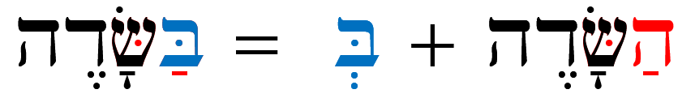

# Cover {.unnumbered}

Placeholder


<!--chapter:end:index.Rmd-->


# About This Course {-}

Placeholder


## Why an HLI Hebrew Grammar Course {- #motivation}
## How our course Is distinct {- #our_course}
## Relationship to _Hebrew Quest_ {- #hgq_and_hq}
## Completion of _Hebrew Quest_ is NOT a prerequisite! {- #finish_hq}

<!--chapter:end:00b-introduction.Rmd-->


# Getting Started / Getting Help {-}

Placeholder


## Navigating this book {- #navigating}
## A Typical Lesson {- #typical-lesson}
## Information Boxes {-}
## Quick Start Instructions {.unnumbered #get_started}
## Help with Anki {- #anki_help}
### Customize Anki Settings {- #anki_settings}
### How do I navigate within Anki? {-}
### How do I know when to hit the Good button on an Anki card? {-}
### How do I get help with Anki? {-}
## Course Resources {- #optional_resources}
## Report an Issue {- #report_issue}
## Ask a question {- #get_help}

<!--chapter:end:00d-help.Rmd-->

# (PART) Hebrew Grammar Foundations {-}

<!--chapter:end:01a-Part_I_header.Rmd-->


# The Hebrew Aleph-bet {#alephbet}

Placeholder


## First Thought {-}
### שֵׁם יְהוָה אֶקְרָא {-}
## The Hebrew Aleph-Bet {#consonants}
## Hebrew is written and read from RIGHT-to-LEFT {#right_to_left}
## Five "KiMNePaTZ" letters have different final forms {#sofit_letters}
## Six" BeGaD KePHaT" letters take a Daghesh Lene {#daghesh_lene}
## We classify four consonants as **Gutturals** (and one is a sometimes-guttural) {#gutturals}
## We classify ten consonants as "SQiN eM LeVY"
## Look out for look-alike Letters {#look-alike-letters}
## Sephardic and "Seminary" Pronunciation {#pronunciation}
## Lesson Conclusion and Activities {-}
### Anki {- #anki-1}
### Worksheets: Letter Writing {- #worksheets-1}
## Ruth Pursuit {-}
## Ruth Pursuit Translation Worksheet {-}
## Quest Quiz {-}

<!--chapter:end:01b-Alephbet.Rmd-->


# Hebrew Vowels {.vowels}

Placeholder


## First Thought {-}
###  הֵמָּה רָאוּ מַעֲשֵׂי יְהוָה {-}
## Vowels that are not vowel letters {#vowels}
### Vowels come in three types: Long, Short, Reduced | Vowels come in five classes: A, E, I, O, U {-}
## Vocal and Silent Sheva {#Sheva}
## Vowel letters {#vowel_letters}
### Vowel letters use a consonant plus a nikkud to form a vowel {-}
## Transliteration Shorthand
## "Defective" and "plene" spelling {#defective_spelling}
## The Dagesh Forte Doubles the Consonant {#dagesh_forte}
## Dagesh Forte Rule {#dagesh_forte_in_bgdkpt}
## Gutturals and Resh reject Dagesh Forte {#gutturals_reject_dagesh_forte}
## Lesson Conclusion and Activities {-}
### Anki {-}
### Vowel worksheet {-}
## Ruth Pursuit {-}
## Quest Quiz {-}
## Claim your `Twelve Tribes Badge`! {- #twelve-tribes-badge-1}

<!--chapter:end:02-Vowels.Rmd-->


# Syllabification and Pronunciation {#Syllabification}

Placeholder


## First Thought {-}
###  אַשְׁרֵי אָדָם לֹא יַחְשֹׁב יְהוָה לוֹ  {-}
## Hebrew Syllables {#syllables}
## Hebrew Word Accents {#accents}
## Tonic, Pretonic, and Propretonic Syllables
## Ultima, Penultima, and Antepenultima syllables
## Rules for Silent Sheva {#s_sheva}
### A Sheva is SILENT when the previous vowel is short: {-}
### A Sheva is SILENT when the first of two consecutive Shevas _within a word_: {-}
### A Sheva is SILENT when at the end of a word: {-}
## Rules for Vocal Sheva {#v_sheva}
### A Sheva is VOCAL when the initial Sheva in a word: {-}
### A Sheva is VOCAL when the second of two consecutive Shevas _within a word_<small>^[<small>A Sheva at the **end** of a word is **always silent**, even when it is the second of two consecutive Shevas.</small>]</small>:  {-}
### A Sheva is VOCAL when under a Dagesh Forte: {-}
### A Sheva is VOCAL after an unaccented long vowel: {-}
## Hebrew Diphthong = Accented Patach-Yod-Hireq {#diphthong}
## Vowels and Syllable Preference {#vowel_pref}
## Qamets Hatuf, Furtive Patach, Quiescent Aleph {#misc_vowels}
## Qamets Hatuf
## Furtive Patach 
## Quiescent Aleph
## Lesson Conclusion and Activities {-}
### Introduction to Video Warm-ups {-}
## Word Warm-up {-}
## Verses Warm-up {-}
## Ruth Pursuit {-}        
## Quest Quiz {-}
## Claim your `Unit 1 Completion Certificate`! {-}

<!--chapter:end:03-Syllabification.Rmd-->


# (PART) Nouns, Prepositions, Pronouns {-}
# Hebrew Nouns {.Nouns}

Placeholder


## First Thought {-}
### רְאֵה לִמַּדְתִּי אֶתְכֶם חֻקִּים וּמִשְׁפָּטִים {-}
## Gender and Number {#gender_number}
## Parsing vs. Inflecting
## Singular Noun Endings {#sing_noun_endings}
## Plural Noun Endings {#noun_pluralization}
## Dual Noun Endings
## Special dual forms {#dual_forms}
## Irregular Pluralization  {#irregular_pluralization}
### Segholate Nouns follow a standard vowel pattern when pluralizing {-}
### Geminate Words take a Daghesh Forte {-}
## Rule of Sheva {#rules_sheva}
## Lexical Form {#lexical_form}
## Word Warm-up {-}
## Verses Warm-up {-}
## Anki {-}
## Ruth Pursuit {-}        
## Quest Quiz {-}

<!--chapter:end:04-NounsPlural.Rmd-->


# Definite Article and Conjunction Vav {.Article}

Placeholder


## First Thought {-}
### <span class="he">מִי־מָדַד בְּשָׁעֳלוֹ מַיִם וְשָׁמַיִם</span> {-}
## Translate the Vav Conjunction {#vav_translate}
## Identify the Vav Conjunction {#vav_identify}
## Loss of Dagesh Forte {#loss_Dagesh_forte}
## Compensatory Lengthening
## Translate the Article {#article_translate}
## Identify the Article {#article_identify}
## Hebrew Indefiniteness {#indefiniteness}
## Other Hebrew Definiteness {#definiteness}
## Lesson Conclusion and Activities {-}
## Word Warm-up {-}
## Verses Warm-up {-}
## Anki {-}
## Ruth Pursuit {-}        
## Quest Quiz {-}
## Claim your next `Twelve Tribes Badge`! {-}

<!--chapter:end:05-DefArt_Conjunction.Rmd-->

# Hebrew Prepositions

> To comprehend Biblical Hebrew, we must be able to identify prepositions as we read the Text.

Prepositions give us space and context.  Prepositions are on almost every page as the authors seek to communicate this context to us.  Furthermore, there is one Hebrew word, <span class="he">מִן</span>, that is classified as a preposition, but, depending on the context, can convey a wide array of meanings. 

::: {.infobox .map}
**LESSON ITINERARY**

1. Recognize that a Nun with Silent Sheva becomes a Dagesh Forte
2. Describe Independent and Maqqef prepositions
3. Define Inseparable prepositions
4. Identify when a word with an inseparable preposition also has the definite article
5. Understand how <span class="he">מִן</span> is constructed
6. Define how <span class="he">מִן</span> is used
7. Identify the Definite Direct Object (DDO) marker
:::


::: {.infobox .stop}
**EQUIPMENT CHECK**

Before continuing, can you describe the following concepts?

* The construction of the definite article, including what happens when the Dagesh Forte is rejected
* The construction of the Vav conjunction
* How Hebrew handles indefinite words
:::

## First Thought {-}

### <span class="he">  בְּיוֹם צָרָתִי אֲדֹנָי דָּרָשְׁתִּי </span> {-}

_In the day of my trouble, I sought the Lord  (Psalms 77:3)_

Meditate and celebrate that the Lord is in the midst of our problems.

<figure>
    <figcaption>Listen to the verse in Hebrew:</figcaption>
    <audio
        controls controlsList="nodownload"
        src="./images/06.ps7702.mp3">
            Your browser does not support the
            <code>audio</code> element.
    </audio>
</figure>

The בּ in <span class="he">בְּיוֹם</span> is an example of an "inseparable preposition" that means "in."  We will study various types of prepositions in this lesson.

*****


```r
knitr::include_graphics("images/06-Nazareth Mount of Precipitation from west panorama, tb041003219.jpg")
```

<div class="figure" style="text-align: center">

<p class="caption">(\#fig:unnamed-chunk-1)Mt. Precipice in Nazareth - suggested location of Luke 4:29 when the townsfolk took Yeshua 'up' the mountain, wanting to throw Him 'from' the cliff, 'down upon' the rocks, 'into' the valley below.  Again, He prevailed in His day of trouble.  Courtesy of the [Pictorial Library of Bible Lands](https://www.bibleplaces.com)</p>
</div>


## _Hebrew Quest_ Prepositions Lecture

<div class="container">
<iframe class="responsive-iframe" src="https://www.youtube.com/embed/
yY3O8ByYNwI?start=1836&amp;end=2460
&amp;rel=0&amp;showinfo=0&amp;autohide=1&amp;autoplay=1" frameborder="0"></iframe>
</div>

[Click to open video in a new tab](https://youtu.be/yY3O8ByYNwI?t=1836){target="_blank"}
## Nun with Silent Sheva Becomes Dagesh Forte


```r
library(knitr)
knitr::include_graphics("images/06.nun-assimilation.gif")
```


* Nun is considered a "weak letter" 
* One aspect of weak letters is that they disappear from a word under specific scenarios
* One such scenario is when the nun appears with a SILENT Sheva <span class="he">נְ</span> (or no vowel at all)
* When then nun drops, whenever possible, it will be replaced with a Dagesh Forte
* The technical term for this is called "assimilation"
    * So grammarians say, "the נ has assimilated into a Dagesh Forte"
* To get back to the original/lexical form, we would substitute the Dagesh Forte for the Nun+Sheva

::: {.box .light}
ASSIMILATED NUN

A Dagesh Forte frequently indicates an assimilated נ
:::

* When the Dagesh Forte is rejected, we have lost our big clue that a letter like נ has gone missing
    * Occasionally, but not always, we will have Compensatory Lengthening to help us out
* Recall the three scenarios where the Dagesh Forte may be rejected:

| Scenario | Reject Dagesh | Compensatory Lengthening
| :-: | :-: | :-: 
| Gutturals/Resh | ALWAYS | Sometimes
| Word-final Dagesh without a Vowel (Lesson 4) | ALWAYS | Sometimes
| SQiN eM Levy WITH SHEVA | SOMETIMES | NEVER


## Independent and Maqqef prepositions 

* There are three different types of Hebrew prepositions: independent, Maqqef, and inseparable
* An _independent preposition_ is a separate word with a space before it and after it
    * The preposition comes first, followed by its object (just like English). E.g.,  <span class="he">תַּחַת אֹתוֹ</span> (under it)
* _Maqqef_ is a mark like the English hyphen
    * The two marks are nearly identical in meaning and appearance
        * the Hebrew Maqqef is raised: א־בּ 
        * the English hyphen is midline: a-b  
    * Like the hyphen used to join two English words, the Maqqef lets us know that two Hebrew words are closely connected grammatically
* In a _Maqqef preposition_, the Maqqef connects a preposition to its object
    * Again, the preposition comes first:  <span class="he">עַל־מֶלֶךְ</span>
        * English prepositions are NOT written this way; we would never see "on-a-king."
    * One notable aspect about the Maqqef is that the first word (to the left of the Maqqef) loses its accent
        * As a result, the vowel that loses its accent may change
    
::: {.box .info}
The same preposition may be written both with and without the Maqqef

* The meaning does not change
* <span class="he">עַל מֶלֶךְ</span> means the same as <span class="he">עַל־מֶלֶךְ</span>
:::

## Inseparable prepositions

* Like <span class="he">וְ</span> for the word "and," an inseparable preposition is a one-letter prefix affixed to its object
* Three Hebrew prepositions are **ALWAYS** inseparable
    * <span class="he">בְּ</span> - in, at, with, by, against
        * <span class="he">בְּמֶ֫לֶךְ</span>
        * With a king
    * <span class="he">כְּ</span> - as, like, according to
        * <span class="he">כְּמֶ֫לֶךְ</span>
        * Like a king
    * <span class="he">לּ</span> - to, toward, for
        * <span class="he">לְמֶ֫לֶךְ</span>
        * To/towards a king

::: {.box .info}
A mnemonic to remember these three inseparable prepositions is "BucKLe"

The first word of the Bible contains an inseparable preposition: <span class="he">בְּרֵאשִׁית</span> = "In (the) beginning"
:::

* In the lexical form of these prepositions, there is a Vocal Sheva vowel under the "buckle" consonant
* If there is a Sheva or Hateph vowel in the next letter, the Rule of Sheva come into play (see Lesson 4)
    * Before another Vocal Sheva, the preposition usually takes a Hireq
    * Before a Guttural with a Hateph vowel, the preposition takes the corresponding short vowel
    * Note the names of God again receive special treatment: <span class="he">לֵאלֹהִים</span> and <span class="he">לַיהוָה</span>

## The Article and Inseparable Prepositions

* When a word has both the Article and an inseparable preposition, a form of contraction occurs:
    * The one-letter preposition replaces the <span class="he">ה</span> of the Article
    * The vowel under the preposition and the Dagesh Forte (if it is there) are your clues that the word is definite.


```r
library(knitr)

```


* On reason we spend so much time talking about the Dagesh Forte is that it is an extremely useful clue as to what is going on within a word
* When a letter rejects the Dagesh Forte, this clue is gone
* Below is how we can tell whether there is the article with a preposition in the absence of a Dagesh

::: {.box .light}
ARTICLE WITH PREPOSITION

* NO ARTICLE if there is a Sheva under the preposition - the article never takes a Sheva
* NO ARTICLE if the short vowel under the preposition can be explained by the Rules of Sheva: 
    * <span class="he">אֲנָשִׁים + לְ = לַאֲנָשִׁים</span> - for men, (not 'for the men')
* ARTICLE if vowel under the preposition is not Sheva and can NOT be explained by the Rule of Sheva: 
    * <span class="he">לַהֵיכָל</span> = for THE temple
:::

## The flexible <span class="he">מִן</span>: construction

* <span class="he">מִן</span> is a unique preposition
    * It can be a Maqqef preposition, as in <span class="he">מִן־זָהָב</span>
    * It can also be an inseparable preposition: <span class="he">מִזָּהָב</span>
    * Both examples above literally mean "from gold" 
* Note the spelling of the inseparable preposition:


```r
library(knitr)
knitr::include_graphics("images/06.preposition_min.jpg")
```


* When we see `Mem+Hireq+Dagesh`, we know it is <span class="he">מִן</span> written as an inseparable preposition
* As we know by now, the Gutturals and Resh reject the Dagesh Forte:
    * <span class="he">א צ ה ר</span> have compensatory lengthening, so the Hireq becomes Tsere
    * <span class="he">ח</span> has virtual doubling, which as we remember means "virtually no doubling" in that the vowel under the <span class="he">מ</span> remains a Hireq
* SQiN eM LeVY with a Sheva may reject the Dagesh
    * As we know, there will never be any Compensatory Lengthening with a SQiN eM LeVY scenario
    * When we see מִקְ, מִיְ or Mem+Hireq followed by a SQiN eM LeVY letter and there is no Dagesh Forte, this may be a clue
    * We should say to ourselves, "I don't see a Dagesh Forte, but that's a `SQiN eM LeVY` letter. This may still be מִן."

## The Article and <span class="he">מִן</span>

Unlike the regular "BucKLe" inseparable prepositions, the <span class="he">ה</span> of the article is always RETAINED with <span class="he">מִן</span>

* <span class="he">מֶהָאָ֫רֶץ</span> = from the land.


## The flexible <span class="he">מִן</span>: meanings 

* <span class="he">מִן</span> occurs 7,592 times in the Bible, and can have multiple meanings
* The most direct purpose is "from" - <span class="he">מֵהָאָ֫רֶץ</span> from the land
* <span class="he">מִן</span> can also have comparative (think "bigger") and superlative (think "biggest") meanings depending on the context
    * <span class="he">טוֹבָה חָכְמָה מִזָּהָב</span> = wisdom is better *than* gold 
    * <span class="he">קָשָׁה הָעֲבֹדָה מֵהָאֲנָשִׁים</span> = the work is *too* difficult *for* the men
    * <span class="he">עָרוּם מִכֹּל חַיַּת הַשָֹּדֶה ּ</span>  = the *most* clever living thing *of all* the field
* There is also a use called "partitive" that denotes a portion or part of something else:
    * <span class="he">מֵהָאֲנָשִׁים</span> may mean "*some* *of* the men" (lit. from the men)
* Other uses: 'because', 'by', 'without', 'even', 'namely'.


::: {.box .info}
MEANING OF <span class="he">מִן</span>

* This is a word that takes practice to appreciate the various nuanced meanings
* As you are starting out in Hebrew, when you see <span class="he">מִן</span>, start your translation with "from..." * However, don't be surprised if "from" does not make sense
* For example, if our translation is something like, "good the wisdom from the gold," we know that doesn't make sense
    * We need to remember the comparative or superlative uses
    * "_Better_ is wisdom _than_ gold"
:::

## The Definite Direct Object marker 

* Hebrew has a word that is often used to mark a definite direct object (DDO)
* It has no translational value
* Spelling:
    * <span class="he">אֵת</span> (independent) 
    * <span class="he">אֶת־</span> (Maqqef)
* The challenge can be that this is the same spelling as the preposition "with" 
* As both the DDO and preposition can take pronominal suffixes, we will save a discussion of differentiating between the two words for Lesson 9 

::: {.box .info}
We see the DDO twice in the first verse of the Bible:

<span class="he">בְּרֵאשִׁית בָּרָא אֱלֹהִים *אֵת* הַשָּׁמַיִם *וְאֵת* הָאָרֶץ</span>

:::

## _Hebrew Quest_ discussion of Genesis 1:1 

* As a conclusion to this lesson, please watch the video below where Izzy discusses Genesis 1:1
* Genesis 1:1 contains examples of the Article, the conjunction, an inseparable preposition and the DDO marker (Izzy also discusses how the DDO speaks of Messiah!)
* The Genesis 1:1 segments runs from 12:45 - 46:50
* We encourage you to take notes using [a blank copy of Genesis 1:1-5](https://docs.google.com/document/d/1FIQAtWfWlrWmzX5pKR6esRLzJKFdv5Szx3mb5_zWwLg/copy){target="_blank"}<small>^[<small>In Unit 3, you will have the option of completing our "_Hebrew Quest_ Study Passage Track".  In Lesson 17, we will study Genesis 1:1-5, which is why this document has verses 1-5.]

<div class="container">
<iframe class="responsive-iframe" src="https://youtube.com/embed/sQKorif_GBk?start=732&end=2815" frameborder="0"></iframe>
</div>

[Click to open video in a new tab](https://youtu.be/sQKorif_GBk?t=732){target="_blank"}


## Conclusion {-}

How are you feeling so far?  Is any component of "the fog" refusing to dissipate? Keep sticking with `Anki,` and try to do your reviews at least once daily.

To help with this, we've gone a little bit lighter on the Grammar cards and the Ruth Pursuit for Lesson 6.  While there are some differences, prepositions are used much the same way in Hebrew as they are in English.  There is no sense in creating a lot of busy work.

We recommend using the time between now and starting Lesson 7 to get caught up and make sure the new concepts begin to take hold.  You might notice the intensity pick up with the next few lessons as we get into some ways Hebrew handles adjectives and pronouns.  Until then, enjoy learning some more of God's work with Izzy in the `Word warm-up`, `Verse warm-up`, and `Anki`.

### Anki {-}

* `Lesson 06 A. Vocab`
* `Lesson 06 B. Grammar`
* `Lesson 06 C. Workbook`
    * In this activity, we will have brief passages of scripture that illustrate prepositions.
    * Make sure you look up any words you do not know.  You can download an abridged lexicon [here](./images/BBH_Lexicon.pdf){target="_blank"}.
* `Lesson 06 D. Verses`


## Word Warm-up {-}

[Click to open `Word Warm-up` video in a new tab](https://youtu.be/P-oZ1J6ZyBc){target="_blank"}

<div class="container">
<iframe class="responsive-iframe" src="https://youtube.com/embed/P-oZ1J6ZyBc" frameborder="0"></iframe>
</div>


## Verses Warm-up {-}

[Click to open `Verses Warm-up` video in a new tab](https://youtube.com/embed/z4QY0pMdPsA){target="_blank"}


<div class="container">
<iframe class="responsive-iframe" src="https://youtube.com/embed/z4QY0pMdPsA" frameborder="0"></iframe>
</div>


## Ruth Pursuit {-}        

::: {.box .map}
YOUR QUEST

1. Highlight the following words that begin with the inseparable pronouns and provide a definition (Yellow)
    * <span class="he">בָּאָרֶץ</span>
    * <span class="he">בַדֶּרֶךְ</span>     
    * <span class="he">לְבֵית</span>
    * <span class="he">לִי</span>     
2. Find examples of מִן (there is one Maqqef and the rest are inseparable) - translate the Maqqef phrase (look up the object of the מִן preposition in a lexicon if needed) (Green)
3. Find one example of the DDO (Maqqef) (Blue)
4. Find Lesson 6 vocabulary words:
    * <span class="he">עַד</span>
    * <span class="he">אַחֲרֵי
</span> (note: In Ruth 1, one instance of this word also has a מִן prefix (inseparable form) as well as a pronominal suffix, which we will study in Lesson 9)
    * <span class="he">כָּל־</span>(Pink)
:::

* [Blank copy of Ruth 1](https://drive.google.com/file/d/1qcfTKAlTJGChC2eYCMhSbY2w-ibzCcDV/copy){target="_blank"}
* [Ruth Pursuit Answer Key #6](./images/06_Ruth_Pursuit_KEY.pdf){target="_blank"}


## Quest Quiz {-}

[Open Quest Quiz #6 in a new window](https://forms.gle/oeB8E6K4y4mTjPWGA){target="_blank"}


<div class="containerLet">
<iframe class="responsive-iframe" src="https://docs.google.com/forms/d/e/1FAIpQLScSk6Jya_wOUJ4W88s8wcvY-3NyS2FnDmle4T6yo00Fus4Nmg/viewform?embedded=true" frameborder="0"></iframe>
</div>

<!--chapter:end:06-Prepositions.Rmd-->


# Hebrew Adjectives

Placeholder


## First Thought {-}
### <span class="he">אֶת־הַכֹּל עָשָׂה יָפֶה בְעִתּוֹ</span> {-}
## Inflecting Adjectives
## Substantival Use
## Attributive Use
## Predicative Use
## Attributive, Predicative, and Substantival Comparison
## The Mappiq 
## The Directional Ending 
## Word Warm-up {-}
## Verses Warm-up {-}
## Anki {-}
## Ruth Pursuit {-}        
## Quest Quiz {-}
## Claim your next `Twelve Tribes Badge`! {-}

<!--chapter:end:07-Adjectives.Rmd-->


# Hebrew Pronouns

Placeholder


## First Thought {-}
### <span class="he">זֶה הַדֶּרֶךְ לְכוּ בוֹ</span> {-}
## Independent Personal Pronoun Table
## Independent Personal Pronouns Discussion
## Relative Pronoun <span class="he">אֲשֶׁר</span>
## Interrogative Pronoun
## Interrogative Particle <span class="he">הֲ</span>
## Interrogative Particle vs Definite Article {-}
## Near and Far Demonstratives
## Demonstrative Pronoun
## Demonstrative Adjective 
## Conclusion {-}
## _Hebrew Quest_ Pronouns
## Word Warm-up {-}
## Verses Warm-up {-}
## Anki {-}
## Worksheets: Pronouns {-}
## Ruth Pursuit {-}        
## Quest Quiz {-}

<!--chapter:end:08-Pronouns.Rmd-->


# Hebrew Pronominal Suffixes

Placeholder


## First Thought {-}
### <span class="he">וַיֹּאמְרוּ שָׁאוֹל שָׁאַל־הָאִישׁ לָנוּ וּלְמוֹלַדְתֵּנוּ </span> {-}
## Meaning
## Type 1 vs Type 2 Suffixes
## Singular Suffixes
## Plural Suffixes
## Distinguish Type 1 from Type 2
## Lexical Form with Type 1
## Lexical Form with Type 2
## Unexpected changes
## Look-alike words: <span class="he">אֵת</span> as "with" or as Definite Direct Object (DDO) marker
## Look-alike words:   <span class="he">עִם</span>, "with", or <span class="he">עַם</span>, "people" 
## Look-alike words: <span class="he">אֵל</span>, "God", or <span class="he">אֶל</span>, "to"
## Word Warm-up {-}
## Word Warm-up: pronominal suffixes {-}
## Verses Warm-up {-}
## Anki {-}
## Worksheets: Pronominal Suffixes {-}
## Ruth Pursuit {-}        
## `Quest Quiz` {-}

<!--chapter:end:09-Pronominal_Suffixes.Rmd-->


# Hebrew Construct Chain {.ConstructChain}

Placeholder


## First Thought {-}
### <span class="he">בְּצֶדֶק כָּל־אִמְרֵי־פִי</span> {-}
## What is a Construct Chain?
## What makes a construct chain
## Review: what makes a word definite 
## The Absolute noun establishes the definiteness of a chain
## How to Recognize a Construct Chain
## Identifying Construct state by Noun Endings
## Construct Chain Summary
## Word Warm-up {-}
## Verses Warm-up {-}
## Anki {-}
## Worksheets: Construct Identification {-}
## Ruth Pursuit {-}        
## Quest Quiz #10 {-}
## Claim your next `Twelve Tribes Badge`! {-}

<!--chapter:end:10-ConstructChain.Rmd-->


# Hebrew Numerals

Placeholder


## First Thought {-}
## The Biblical text always spells out numbers
## Notes and footnotes use symbols for numbers
## Hebrew Ordinal Numbers
### Hebrew Quest Ordinal Numbers Video {-}
## Cardinal Numbers 1-10
### Digits 1 and 2 match the gender of the noun {-}
### Digits 3-10 take the opposite gender of the noun {-}
## Cardinal Numbers Above 10
## Conclusion
### Anki {-}
## Word Warm-up {-}
## Verses Warm-up` {-}
## Ruth Pursuit {-}        
## Claim your Unit 2 Completion Certificate! {-}

<!--chapter:end:11-Numerals.Rmd-->


# (PART) Qal Binyanim {-}
# Introduction to Unit 3 {-}

Placeholder


## Vowel Transliteration/Shorthand
## Word Initial Combinations
## Changes for Unit 3: No more quizzes!
## Changes for Unit 3: Cantillation Marks added to Study Verses {-}
## Changes for Unit 3: OPTIONAL Hebrew Quest Study Passage Translation{-}
## Keep going! {-}

<!--chapter:end:11b-Unit3_Intro.Rmd-->


# Introduction to Hebrew Verbs

Placeholder


## First Thought {-}
### <span class="he">וְהֽוּא־הָלַ֤ךְ בַּמִּדְבָּר֙ דֶּ֣רֶךְ י֔וֹם </span> {-}
## The Verbal Root
## Person, Gender, Number
## Verb nomenclature
## Preformatives, Sufformatives, Prefixes, and Suffixes
## Verbal Vowels
## The Seven Hebrew Verb Stems
## The Seven Stems: Summary Table
## The Eight Basic Conjugations
## Finite vs Non-Finite Conjugations
## Parsing
## Parsing Codes
## Strong and Weak Verbs
## Weak Verb Classes
## Hebrew GRAMMAR Quest is a Quest for RECOGNITION NOT RECALL
## A note on the paradigm strong verb <span class="he">קטל</span>
## Word Warm-up {-}
## Verses Warm-up {-}
## Anki {-}
## Ruth Pursuit {-}        
## OPTIONAL _Hebrew Quest_ Study Passage Track: Proverbs Study #1-4 {-}

<!--chapter:end:12-Verbs_Intro.Rmd-->


# Qal Perfect - Strong Verbs {.QP-s}

Placeholder


## First Thought {-}
### <span class="he">לֹא־שָׁמְר֤וּ אֲבוֹתֵ֙ינוּ֙ אֶת־דְּבַ֣ר יְהוָ֔ה </span> {-}
##  Qal is Simple action, Active voice
## Perfect is completed action or a state as a whole
## Components of the Qal Perfect Strong Paradigm
## The Perfect Sufformatives
## Qal Perfect Vowels: $V_1$ is almost always Qamets
## Qal Perfect Vowels: $V_2$ prefers patach
## $V_S$ is accented in Finite verbs
## A Sheva precedes a Finite Sufformative
## Building the Qal Perfect Strong Paradigm
## Hearing the Qal Perfect Strong Paradigm
## Worksheet: Qal Perfect Strong Paradigm {-}
## Qal Perfect Strong Examples
## Deviations from the Paradigm
## 3נ and 3ת Verbs
## Stative Verbs MAY have a different $V_S$
## Word Warm-up {-}
## Verses Warm-up {-}
## Anki {-}
## Ruth Pursuit {-}        
## Claim your next `Twelve Tribes Badge`! {-}
## OPTIONAL _Hebrew Quest_ Study Passage: Proverbs #5-7 {-}

<!--chapter:end:13-Qal_Perfect_Strong.Rmd-->


# Qal Perfect - Weak Verbs {.QP-w}

Placeholder


##  First Thought {-}
### <span class="he">בָ֤אָה נַחֲלָתֵ֙נוּ֙ אֵלֵ֔ינוּ מֵעֵ֥בֶר הַיַּרְדֵּ֖ן מִזְרָֽחָה׃</span> {-}
## Review
## 3נ and 3ת with Silent Sheva Assimilate to Dagesh
## Review of Guttural Principles
## 1G, 2G
## 3-ע/ח
## א3 
## <span class="he">יָרֵא</span> is 3א AND Tsere Stative
## 3ה  
## Doubly Weak
## <span class="he">הָיָה</span>
## Geminate
## Biconsonantal
## <span class="he">םוּת</span> is Biconsonantal and Stative
## Qal Perfect Quest Clues
## Clues for Qal Perfect Special Situations
## Word Warm-up {-}
## Verses Warm-up {-}
## Anki {-}
## Ruth Pursuit {-}    
## OPTIONAL _Hebrew Quest_ Study Passage: Proverbs #8-10 {-}

<!--chapter:end:14-Qal_Perfect_Weak.Rmd-->


# Qal Imperfect - Strong Verbs {.QI-s}

Placeholder


## First Thought {-}
### <span class="he">יִ֝שְׁמֹ֗ר כָּל־אָרְחֹתָֽי׃ </span> {-}
## Translating the Imperfect
## The Imperfect Always has a Preformative
## Qal Imperfect Vowels
## Imperfect Sufformatives
## Building the Qal Imperfect Strong Paradigm
## Hearing the Qal Imperfect Strong Paradigm
## Worksheets: Qal Imperfect Strong Paradigm {-}
## Qal Imperfect Strong Examples
## Deviations from the Paradigm
## Translating Negative Commands
## Word Warm-up {-}
## Verses Warm-up {-}
## Worksheets: Qal Imperfect Strong Paradigm {-}
## Ruth Pursuit {-}   
## OPTIONAL _Hebrew Quest_ Study Passage: Proverbs #11-14 {-}

<!--chapter:end:15-Qal_Imperfect_strong.Rmd-->


# Qal Imperfect Weak {.QI-w}

Placeholder


## First Thought {-}
### <span class="he">וְעֵינֵיכֶ֖ם תִּרְאֶ֑ינָה</span> {-}
## Our Quest
## 2G 
## 3חע
## 3א  
## 3ה 
## 1G
## 1א "Angry Baker"
## Geminate
## Biconsonantal
## 1-Yod 
## הלך 
## <span class="he">יכל</span> takes $V_P = \bar U$
## 1נ Assimilates with Silent Sheva
## לקח
## Doubly Weak
## נתן is 1נ and 3נ
## ראה vs. ירא
## Qal Imperfect Weak Summary
## Word Warm-up {-}
## Verses Warm-up {-}
## Ruth Pursuit {-}   
## Claim your next `Twelve Tribes Badge`! {-}
## OPTIONAL _Hebrew Quest_ Study Passage: Proverbs #15-17 {-}

<!--chapter:end:16-Qal_Imperfect_Weak.Rmd-->


# Vav Consecutive {.wc}

Placeholder


## First Thought {-}
### <span class="he">וַיַּשְׁכִּ֣מוּ בַבֹּ֔קֶר וַיַּֽעֲל֥וּ אֶל־רֹאשׁ־הָהָ֖ר </span> {-}
## Review of the Conjunction Vav
## Perfect + וְ: Spelling
## Perfect + וְ: Translating
## Imperfect + וְ: Spelling
## Imperfect with Vav often indicates purpose
## Imperfect Waw Consecutive: Spelling (Strong)
## Imperfect Waw Consecutive: Spelling (Weak)
## Imperfect Waw Consecutive: Translation
### Usually translate Iwc as PAST TENSE {-}
## Summary
## Word Warm-up {-}
## Verses Warm-up {-}
## Worksheets: Qal Vav-Consecutive Paradigms {-}
## Ruth Pursuit {-}   
## OPTIONAL _Hebrew Quest_ Study Passage: Genesis 1:1-5 {-}

<!--chapter:end:17-Vav_Consecutive.Rmd-->


# Qal Imperative {.QM}

Placeholder


## First Thought {-}
### <span class="he">וְעַתָּ֣ה יִשְׂרָאֵ֗ל שְׁמַ֤ע אֶל־הַֽחֻקִּים֙ וְאֶל־הַמִּשְׁפָּטִ֔ים אֲשֶׁ֧ר אָֽנֹכִ֛י מְלַמֵּ֥ד אֶתְכֶ֖ם לַעֲשׂ֑וֹת</span> {-}
## Volitional Forms Introduction
## Negative Commands use the Jussive or the Imperfect
## The Imperative is the Imperfect withoug the Imperfect Preformative
## Identifying QM
## <span class="he">נָה</span> can follow volitional verbs
## Distinguishing QM2ms, QI3ms, and QP3ms
## Paragogic ה 
## 3ה Verbs
## 1נ and 1י
## Biconsonantal and Geminate
## QP3ms and QP2ms
## QP3mp and QP2mp
## Cohortative and Jussive
## Some weak verbs often shorten the Jussive singular
## Word Warm-up {-}
## Verses Warm-up {-}
## Worksheets: Qal Volitional Forms {-}
## Ruth Pursuit {-}   
## OPTIONAL _Hebrew Quest_ Study Passage: The Shema {-}

<!--chapter:end:18-Qal_Imperative_strong.Rmd-->


# Pronominal Suffixes on Verbs {.VerbSuffix}

Placeholder


##  First Thought {-}
### <span class="he">אֲנִֽי־קְרָאתִ֣יךָ כִֽי־תַעֲנֵ֣נִי אֵ֑ל הַֽט־אָזְנְךָ֥ לִ֝֗י שְׁמַ֣ע אִמְרָתִֽי׃</span> {-}
## Hebrew Direct Object Pronouns
## Verbs use Type 1 Suffixes
## QP Vowel Changes
## QI Vowel Changes 
## QM Vowel Changes
## Imperative/Perfect Ambiguity when normal Imperative $V_S = A$
## Word Warm-up {-}
## Verses Warm-up {-}
## Ruth Pursuit {-}        
## Claim your next `Twelve Tribes Badge`! {-}
## OPTIONAL _Hebrew Quest_ Study Passage: Matthew 6 {-}

<!--chapter:end:19-Pronominal_Suffix_Verbs.Rmd-->


# Qal Infinitive Construct {.Qinfinitive}

Placeholder


## First Thought {-}
###  <span class="he">וְשָׁ֣מַרְתָּ֔ אֶת־מִצְוֺ֖ת יְהוָ֣ה אֱלֹהֶ֑יךָ לָלֶ֥כֶת בִּדְרָכָ֖יו וּלְיִרְאָ֥ה אֹתֽוֹ׃</span> {-}
## Two types of Infinitives
## Q∞ Spelling
## 3ה Endings
## 1י and 1נ Spelling
## Biconsonantal
## Q∞ often is identical to QM2ms
## ∞ take Type 1 Pronominal Suffixes
## Most ∞ have a prefixed preposition
## Meaning of ∞
## Negating the Infinitive
## Word Warm-up {-}
## Verses Warm-up {-}
## Ruth Pursuit {-}   
## OPTIONAL _Hebrew Quest_ Study Passage: Genesis 22:1-19 {-}

<!--chapter:end:20-Qal_Infinitive_Construct.Rmd-->


# Qal Infinitive Absolute {.QA}

Placeholder


## First Thought {-}
### <span class="he">אָנֹכִ֗י אֵרֵ֤ד עִמְּךָ֙ מִצְרַ֔יְמָה וְאָנֹכִ֖י אַֽעַלְךָ֣ גַם־עָלֹ֑ה</span> {-}
## QA
## 3ה endings
## Meaning of Infinitive Absolute
## Infinitive Construct vs Infinitive Absolute
## **יֵשׁ *** and **אֵין *** 
## Word Warm-up {-}
## Verses Warm-up {-}
## Ruth Pursuit {-}   
## OPTIONAL _Hebrew Quest_ Study Passage: Aaronic/Priestly Blessing {-}

<!--chapter:end:21-Qal_Infinitive_Absolute.Rmd-->


# Qal Participle {.QPt}

Placeholder


##  First Thought {-}
###  <span class="he">וְיִבְטְח֣וּ בְ֭ךָ יוֹדְעֵ֣י שְׁמֶ֑ךָ כִּ֤י לֹֽא־עָזַ֖בְתָּ דֹרְשֶׁ֣יךָ יְהוָֽה׃ </span> {-}
## Participles are Verbal Adjectives
## Qal Participle
## Prefixes and Suffixes
## Biconsonantal 
## 3ה were originally 3י
### We can now complete our 3ה $V_2$ table {-}
## Stem Comparison Table
## Word Warm-up {-}
## Verses Warm-up {-}
## Worksheets: All Qal Paradigms {-}
## Ruth Pursuit {-}        
## Claim your next `Twelve Tribes Badge`! {-}
## OPTIONAL _Hebrew Quest_ Study Passage: Matthew 13 {-}

<!--chapter:end:22-Qal_Participle.Rmd-->


# Hebrew Syntax {.Syntax}

Placeholder


## First Thought {-}
### <span class="he">עַתָּה יָדַעְתִּי כִּי־גָדוֹל יְהוָה מִכָּל־הָאֱלֹהִים</span> {-}
## Clause versus Sentence
## Word order
## Perfect Syntax
## Imperfect Syntax
## Volitional Syntax
## Conditional Phrases
## Disjunctive Vav
## Adverbs
## Word Warm-up {-}
## Verses Warm-up {-}
## Ruth Pursuit {-}        
## Claim your Unit 3 Completion Certificate! {-}
## OPTIONAL _Hebrew Quest_ Study Passage: Psalm 19 {-}

<!--chapter:end:23-Hebrew_Syntax.Rmd-->


# (PART) Derived Binyanim {-}
# Introduction to Unit 4 {-}

Placeholder


## Lessons 24-35 {-}
## Ruth Pursuits {-}
## Review: Vowel and Consonant Shorthand
## Review: Stem Vowel is the Vowel with the 2nd Root Consonant
## Stem Vowel Pattern Nomenclature
## Review: Sheva before Finite Verb Endings

<!--chapter:end:23b-Unit4_Intro.Rmd-->


# The Niphal Stem - Strong Verbs

Placeholder


## First Thought {-}
### <span class="he"> וּמִן־הַגָּדִ֡י נִבְדְּל֣וּ אֶל־דָּוִיד֩ לַמְצַ֨ד מִדְבָּ֜רָה</span> {-}
## Niphal Verb Stem Table
## Niphal Meanings
## Parsing Clues - _Pre_:  the נ prefix is added to EVERY conjugation
## Parsing Clues - $V_S = A \sim \bar E(A)$
## What to memorize for all Derived Stems {-}
## What to memorize for Niphal 
## Paradigm: Niphal Perfect Strong
## Paradigm: Niphal Imperfect Strong
## Paradigm: Niphal Imperative Strong
## Paradigm: Niphal Infinitives Strong
### Derived Stem Infinitive Absolute $V_S = \bar E$ (usually) {-}
## Paradigm: Niphal Participle Strong
### Derived Stem Participle $V_S =$ the P3ms Vowel, lengthened if possible (usually) {-}
## Participle Prefixes in the Derived Stems
## Forms with Identical Spelling
## Easily Confused Forms
## Niphal Parsing Examples
## Stem Comparison Table
## Word Warm-up {-}
## Verses Warm-up {-}
## Worksheets: Niphal Strong Paradigm {-}
## Optional _Hebrew Quest_ Study Passage: Numbers 15 {-}

<!--chapter:end:24-Niphal_Strong.Rmd-->


# The Niphal Stem - Weak Verbs {.N-w}

Placeholder


## First Thought {-}
###  <span class="he">וְקָרְא֥וּ לָהֶ֛ם עַם־הַקֹּ֖דֶשׁ גְּאוּלֵ֣י יְהוָ֑ה וְלָךְ֙ יִקָּרֵ֣א דְרוּשָׁ֔ה עִ֖יר לֹ֥א נֶעֱזָֽבָה׃</span> {-}
## A weak consonant affects the vowels that touch it
## 1-Guttural 
## 1-Yod
## 1-Nun with Silent Sheva Assimilates
## 3-Aleph Changes $V_S$
## 3-Hei Verbs Follow the same general principles
## What to Memorize for Niphal Weak
## Top 10 Niphal Verbs 
## Word Warm-up {-}
## Verses Warm-up {-}
## Ruth Pursuit {-}        
## Claim your next `Twelve Tribes Badge`! {-}
## OPTIONAL _Hebrew Quest_ Study Passage: John 1 {-}

<!--chapter:end:25-Niphal_Weak.Rmd-->


# The Piel Stem - Strong Verbs {.D-s}

Placeholder


## First Thought {-}
### <span class="he">בִּשְׂפָתַ֥י סִפַּ֑רְתִּי כֹּ֝֗ל מִשְׁפְּטֵי־פִֽיךָ׃</span> {-}
## Piel Verb Stem Table 
## Piel Meanings
## Piel is the D stem because $R_2$ takes a Doubling Dagesh Forte
## Memorize piēl - paēl
## Pay attention when $R_2$ is a SQiN eM LeVY consonant
## Piel: what to memorize
## Piel Perfect Strong
## Piel Imperative Strong
## Piel Infinitives Strong
## Piel Participle Strong
### Participle Prefixes in the Derived Stems {-}
## Piel Parsing Examples
## Stem Comparison Table
## Word Warm-up {-}
## Verses Warm-up {-}
## Worksheets: Piel Strong Paradigms {-}
## Ruth Pursuit Analysis
## OPTIONAL _Hebrew Quest_ Study Passage: Exodus 31 {-}

<!--chapter:end:26-Piel_Strong.Rmd-->


# The Piel Stem - Weak Verbs {.D-w}

Placeholder


## First Thought {-}
### <span class="he">בֹּ֤אוּ שְׁעָרָ֨יו ׀ בְּתוֹדָ֗ה חֲצֵרֹתָ֥יו בִּתְהִלָּ֑ה הֽוֹדוּ־ל֝֗וֹ בָּרֲכ֥וּ שְׁמֽוֹ׃</span> {-}
## 3-Guttural
## 2-Aleph/Resh often cause DP $V_1 = \bar E$ and $V_1 = \bar A$ in all other forms
## 1-Nun
## Biconsonantal: the Polel minor stem
## Geminate
## Other weak $R_1$ forms
## What to Memorize for Piel Weak
## Piel Weak Parsing Examples
## Top 10 Piel Verbs
## Word Warm-up {-}
## Verses Warm-up {-}
## Ruth Pursuit {-}        
## Hebrew Quest Study Passages: Psalms 1 and 27 {-}

<!--chapter:end:27-Piel_Weak.Rmd-->


# The Pual Stem - Strong Verbs {.Dp-s}

Placeholder


## First Thought {-}
### <span class="he">בְּחֶ֣סֶד וֶ֭אֱמֶת יְכֻפַּ֣ר עָוֺ֑ן וּבְיִרְאַ֥ת יְ֝הוָ֗ה ס֣וּר מֵרָֽע׃</span> {-}
## Pual Verb Stem Table and Meaning
## Parsing Clues - _Pre_: $V_1 = U$ - ALWAYS for strong verbs
## Parsing Clues - $V_S = A$ and Dagesh Forte in $R_2$
## Pual: what to memorize
## Perfect  
## Imperfect  
## Participle
### Participle Prefixes in the Derived Stems {-}
## Pual Parsing Examples
## Stem Comparison Table
## Worksheets: Pual Paradigm {-}
## Word Warm-up {-}
## Verses Warm-up {-}
## Ruth Pursuit Analysis {-}
## Claim your next `Twelve Tribes Badge`! {-}
## OPTIONAL Hebrew Quest Study Passage: Revelation 1 {-}

<!--chapter:end:28-Pual_Strong.Rmd-->


# The Pual Stem - Weak Verbs {.Dp-w}

Placeholder


## First Thought {-}
### <span class="he">גִּבּ֣וֹר בָּ֭אָרֶץ יִהְיֶ֣ה זַרְע֑וֹ דּ֭וֹר יְשָׁרִ֣ים יְבֹרָֽךְ׃</span> {-}
## The Pual diagnostic $V_1 = U$ is maintained in almost all weak verbs
## 2-Gutturals Reject Dagesh Forte
## Biconsonantal: the Polal minor stem
## Word Warm-up {-}
## Verses Warm-up {-}
## Ruth Pursuit 
## OPTIONAL _Hebrew Quest_ Study Passage: Psalms 145 {-}

<!--chapter:end:29-Pual_Weak.Rmd-->


# The Hiphil Stem - Strong Verbs {.H-s}

Placeholder


## First Thought {-}
### <span class="he">לְכוּ־נָ֛א וְנִוָּֽכְחָ֖ה יֹאמַ֣ר יְהוָ֑ה אִם־יִֽהְי֨וּ חֲטָאֵיכֶ֤ם כַּשָּׁנִים֙ כַּשֶּׁ֣לֶג יַלְבִּ֔ינוּ אִם־יַאְדִּ֥ימוּ כַתּוֹלָ֖ע כַּצֶּ֥מֶר יִהְיֽוּ׃</span> {-}
## Meaning of the Hiphil
## Hiphil Strong Word Initial Combinations - Think "HIphil-HAphil"
## Hiphil $V_S = Î[A] \sim Î(Ē)$
### Exception to $V_S$ pattern {-}
## Don’t confuse <span class="he">ְ הִ</span> with Niphal Preformative <span class="he">ָּּ הִ</span>
## Don't confususe Hiphil Imperfect <span class="he">ְ יַ</span> with Qal Imperfect <span class="he">ְ יִ</span>
## Hiphil Perfect Strong Paradigm
## Hiphil Imperfect Strong Paradigm
## Hiphil Imperative Strong Paradigm
## Hiphil Infinitives Strong
## Participle Strong
### Participle Prefixes in the Derived Stems {-}
## Strong Summary
## Stem Comparison Table
## Hiphil Strong Paradigm Worksheet {-}
## Word Warm-up {-}
## Verses Warm-up {-}
## Ruth Pursuit Analysis {-}
## OPTIONAL _Hebrew Quest_ Study Passage: Exodus 19 {-}

<!--chapter:end:30-Hiphil-Strong.Rmd-->


# The X Hiphil Stem - Weak Verbs {.H-w}

Placeholder


## First Thought {-}
### <span class="he">תּ֘וֹרַ֤ת יְהוָ֣ה תְּ֭מִימָה מְשִׁ֣יבַת נָ֑פֶשׁ עֵד֥וּת יְהוָ֥ה נֶ֝אֱמָנָ֗ה מַחְכִּ֥ימַת פֶּֽתִי׃</span> {-}
## Weak Verbs Review: 
## Strong Summary
## 1-Guttural
## 3-Hei
## Top 10 Hiphil Verbs
## Word Warm-up {-}
## Verses Warm-up {-}
## Ruth Pursuit {-}        
## Claim your next `Twelve Tribes Badge`! {-}
## OPTIONAL _Hebrew Quest_ Study Passage: Exodus 20 {-}

<!--chapter:end:31-Hiphil-Weak.Rmd-->


# The Hophal Stem - Strong Verbs {.Hp-s}

Placeholder


## First Thought {-}
### <span class="he">וְהָ֣אֲנָשִׁ֔ים טֹבִ֥ים לָ֖נוּ מְאֹ֑ד וְלֹ֤א הָכְלַ֙מְנוּ֙ וְלֹֽא־פָקַ֣דְנוּ מְא֔וּמָה כָּל־יְמֵי֙ הִתְהַלַּ֣כְנוּ אִתָּ֔ם בִּֽהְיוֹתֵ֖נוּ בַּשָּׂדֶֽה׃</span> {-}
## Meaning of the Hophal
## Hophal Strong Parsing Clues - _Pre_: Think "Houûphal"
## Hophal Strong Parsing Clues - $V_S$ = A
## Hophal Perfect Strong
## Hophal Imperfect Strong
## Hiphal Participle Strong
### Participle Prefixes in the Derived Stems {-}
## Hophal Strong Summary
## Stem Comparison Table
## Word Warm-up {-}
## Verses Warm-up {-}
## Hophal Strong Worksheet {-}
## Ruth Pursuit {-}
## Ruth Pursuit Analysis {-}
## OPTIONAL Hebrew Quest Study Passage: 1 Samuel 17 {-}

<!--chapter:end:32-Hophal_Strong.Rmd-->


# The Hophal Stem - Weak Verbs {.Hp-w}

Placeholder


## First Thought {-}
### <span class="he">נִשְׁאַ֥ר בָּעִ֖יר שַׁמָּ֑ה וּשְׁאִיָּ֖ה יֻכַּת־שָֽׁעַר׃ </span> {-}
## 1G and 3ה Verbs prefer Qamets Hatuf as $V_P$
## 1נ assimilates as expected
## Geminate/Biconsonant prefer Shureq as $V_P$
## Top 10 Hophal Verbs
## Word Warm-up {-}
## Verses Warm-up {-}
## OPTIONAL _Hebrew Quest_ Study Passage: Psalms 45 {-}

<!--chapter:end:33-Hophal_weak.Rmd-->


# The Hithpael Stem - Strong Verbs {.HT-s}

Placeholder


##  First Thought {-}
###  <span class="he"> וַיַּסֵּ֧ב חִזְקִיָּ֛הוּ פָּנָ֖יו אֶל־הַקִּ֑יר וַיִּתְפַּלֵּ֖ל אֶל־יְהוָֽה׃ </span> {-}
## Meaning
## Parsing Clues - _Pre_: a distinctive "_h_IT" prefix
## Parsing Clues - $V_S = /bar E[A] /sim /bar E$
## Perfect Strong
## Imperfect Strong
## Imperative Strong
## Infinitives Strong
## Participle Strong
### Participle Prefixes in the Derived Stems {-}
## Stem Comparison Table
## Word Warm-up {-}
## Verses Warm-up {-}
## Hitpael Parsing Worksheet {-}
## Ruth Pursuit Analysis
## Claim your next `Twelve Tribes Badge`! {-}
## OPTIONAL _Hebrew Quest_ Study Passage: Leviticus 23 {-}

<!--chapter:end:34-Hitpael_Strong.Rmd-->


# The Hithpael Stem - Weak Verbs {.Ht-w}

Placeholder


## First Thought {-}
###  <span class="he">וְנָמַ֤סּוּ הֶֽהָרִים֙ תַּחְתָּ֔יו וְהָעֲמָקִ֖ים יִתְבַּקָּ֑עוּ כַּדּוֹנַג֙ מִפְּנֵ֣י הָאֵ֔שׁ כְּמַ֖יִם מֻגָּרִ֥ים בְּמוֹרָֽד׃ </span> {-}
## $R_2$ can lose Daghesh Forte
## Transposition of ת and $R_1$ when $R_1$ is sibilant
## Preformative תְ assimilates when $R_1$ is ז ד ט ת,
## Hitpolel is tD of some Biconsonantal and Geminate Verbs
## <span class="he">חָוָה </span> - Hishtapel Stem
## Top 10 Hitpael Verbs
## Word Warm-up {-}
## Verses Warm-up {-}
## Ruth Pursuit {-}        
## You did it!  Claim your Diploma! {-}
## OPTIONAL _Hebrew Quest_ Study Passage: 1 Kings 18 {-}

<!--chapter:end:35-Hitpael_Weak.Rmd-->


# Conclusion {-}

Placeholder


<!--chapter:end:36-Conclusion.Rmd-->

# (APPENDIX) Appendices {-} 

<!--chapter:end:40-Appendices.Rmd-->

# Hebrew Lexicon 


```r
library(knitr)
include_graphics("images/lexicon.jpg")
```


The authors of <u>Basics of Biblical Hebrew</u> have created an abridged Lexicon to accompany this course.  This document is nice as vocabulary words are indexed to the Lesson #, and irregular plural forms and selected construct forms are also included.

[Open/download BBH Lexicon](./images/BBH_Lexicon.pdf){target="_blank"}

You are also encouraged to check out the Lexicon resources in the [Holy Language Heritage Library](https://holylanguage.com/resources-dictionaries.php){target="_blank"}.  They are much more exhaustive.  

<!--chapter:end:57-Lexicon.Rmd-->


# (PART\*) About us and this book {-}
# About Holy Language Institute {-}

Placeholder


## Following Yeshua {-}
## In a Hebrew Way {-}
## Together {-}

<!--chapter:end:60-About_HLI.Rmd-->

# About the designer of this book {-}

* Chris Flanagan has been a member of HLI since 2013 and joined as a ministry volunteer in 2015.
* He has completed Hebrew Quest as a student, which planted a desire to dig deeper into the original languages. He has completed both Hebrew and Greek courses at the seminary level.
* He has worked on a number of projects for HLI from an instructional design standpoint, including leading of "Hebrew Quest Memrise" and now "Hebrew Grammar Quest"
    * This work is simply a compilation of many various first-year Hebrew resources, which he has knitted together to present in an original and engaging format
    * For this reason, he likes to refer to himself as the "designer" or "compiler" of this dynamic Hebrew learning tool, and not the "author" of a static book
* Professionally, Chris has worked in the healthcare compliance field for over 30 years
* Personally, Chris is married and has two men in college.  He and his wife, Sarah, love to travel, especially to Israel; (which, as you can tell, has inspired the format of each lesson in this book)


```r
knitr::include_graphics("images/cf.jpg")
```

<div class="figure" style="text-align: center">

<p class="caption">(\#fig:unnamed-chunk-6)Chris Flanagan</p>
</div>


<!--chapter:end:65-abouttheauthor.Rmd-->


# References {-}


<!--chapter:end:99-References.Rmd-->

