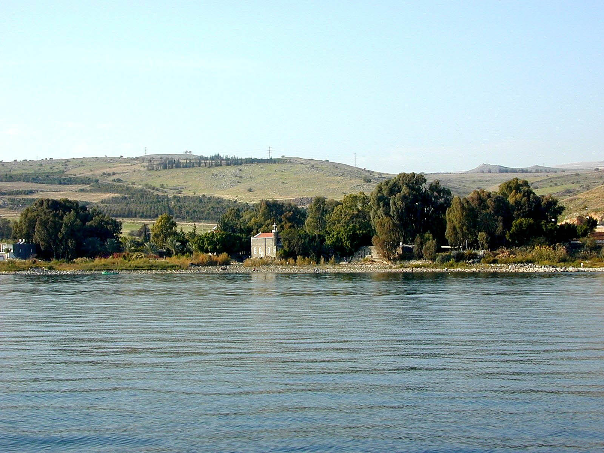
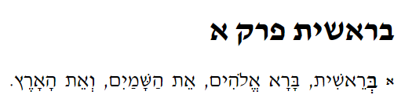
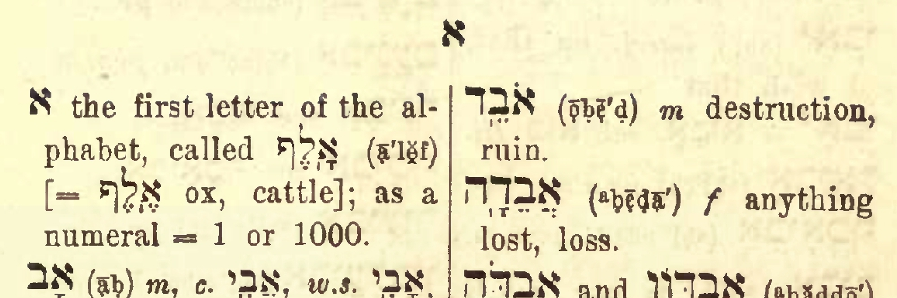

# Cover {.unnumbered}

Placeholder


<!--chapter:end:index.Rmd-->


# Navigating this book {-}

In the upper-left corner of this page you will see a series of icons.  


```r
knitr::include_graphics("images/toolbar.png")
```


These do the following tasks:

* the file drawer expands/collapses the sidebar table of contents; you can also click `s`
* the magnifying glass toggles search input; you can also click `f`
* the big `A` allows you to change the font size and theme
* the little `i` shows you available keyboard shortcuts


There are several ways to navigate from page to page within this guidebook:

* Use the left-navigation sidebar (type `s` to reveal/hide)
* Click the left or right arrow on each page to go forward or back
* Use the left or right arrow keys on your keyboard to move forward or back
* Use hyperlinks on selected pages, like this one: [Continue to Introduction section](#motivation)


<!--chapter:end:001A-introduction-header.Rmd-->


# (PART\*) Introduction {-}
# Why a Hebrew Grammar course? {- #motivation}

Placeholder


## Grammar course wishlist {- #our_course}
### Welcome to Hebrew GRAMMAR Quest - Experience Biblical Hebrew Grammar, the Holy Language Way! {-}

<!--chapter:end:001A-Motivation.Rmd-->


# "Hebrew Quest: Extended Edition" {- #hgq_and_hq}

Placeholder


<!--chapter:end:001D-hq_and_hgq.Rmd-->


# A Typical Lesson {- #typical-lesson}

Placeholder


<!--chapter:end:001E-typical_lesson.Rmd-->

# Quick Start Instructions {.unnumbered #get_started}

These instructions will get you up and running with the course.  We do encourage you to read the other introductory materials before you tackle Lesson 1.

**Anki NOTE**: Eventually, you can do all work from a mobile device.  _For the initial Anki install, you do need to do these steps from a desktop or laptop_.

<!-- <small>^[<small>If you do not have access to a desktop/laptop computer to install Anki, but do have access to a mobile device, we likely can help. Contact us for assistance at holylanguagecourses@gmail.com.</small>]</small>.  -->

1. Download and install the [free Ezra SIL font](https://software.sil.org/downloads/r/ezra/EzraSIL-2.51.zip ){target="_blank"}.
1. [Sign up for a free Ankiweb account here](https://ankiweb.net/account/register){target="_blank"}.
1. [Download and Install the Anki Program (Mac/PC/Linux)](https://apps.ankiweb.net/){target="_blank"}.
1. [Download the Hebrew GRAMMAR Quest Anki Deck](./images/Hebrew Grammar Quest.apkg){target="_blank"}
1. Change the Anki settings [as described here](#anki_settings).
1. Download the [course checklist](https://docs.google.com/spreadsheets/d/1t0C7JlygyUqgF_aQWbhq7h3s_VDn0VuvISJn5mp-LdE/edit?usp=sharing){target="_blank"} for you to keep track of your progress in this course.


> Let's get started!

<!--chapter:end:001F-quick-start.Rmd-->

# Report an Issue {- #report_issue}

Please do not hesitate to report errors, omissions, or improvement opportunities (in fact, we'd rather hear about mistakes sooner rather than later)! Feedback is anonymous.  If you have a specific question about the content, you can use the [Get Help](#get_help) page.

[Open form in new window](https://forms.gle/qhBToGubVgmjdFbx6){target="_blank"}


<div class="container">
<iframe class="responsive-iframe" src="https://docs.google.com/forms/d/e/1FAIpQLSf3obLnGzJQ6d7Rtyy2YXDln3g-kJWCY-4IlRLE_mnFuWv2AQ/viewform?embedded=true" frameborder="0"></iframe>
</div>


<!--chapter:end:001L-issue.Rmd-->

# Get Help {- #get_help}

While this is a self-paced course with no formal instructor or teaching assistant, we do want to provide a way for you to get help if you get stuck.

We request that before you submit a question, you read through the lesson's Seven Points a couple of times, then attempt to do the Anki cards for that lesson.  If you are still unclear, we are here!

Use the form below to ask a question. Please note, we are staffed by volunteers, so please allow a few days for us to research and get back to you.  If you have general feedback or wish to report an issue, please use the [Report an Issue](#report_issue) form.

[Open form in new window](https://forms.gle/tNsvwrhci3nGkvvV6){target="_blank"}

<div class="container">
<iframe class="responsive-iframe" src="https://docs.google.com/forms/d/e/1FAIpQLSdWJc7ri0andmyu70D1USeDRtbsrHLaYLNrs0rvI2qBJx-yEg/viewform?embedded=true" frameborder="0"></iframe>
</div>


<!--chapter:end:001P-question.Rmd-->


# (PART) Hebrew Grammar Foundations {-}
# The Hebrew Aleph-bet {#alephbet}

Placeholder


## First Thought {-}
### שֵׁם יְהוָה אֶקְרָא {-}
## The Hebrew Aleph-Bet {#consonants}
## Hebrew is written and read from RIGHT-to-LEFT {#right_to_left}
## Five "KiMNePaTZ" letters have different final forms {#sofit_letters}
## Six" BeGaD KePHaT" letters take a Daghesh Lene {#daghesh_lene}
## We classify four consonants as **Gutturals** (and one is a sometimes-guttural) {#gutturals}
## Look out for look-alike Letters {#look-alike-letters}
## Sephardic vs "Seminary" Pronunciation {#pronunciation}
## Lesson Conclusion and Activities {-}
### `Anki` {- #anki-1}
### `Worksheets`: Letter Writing {- #worksheets-1}
## `Ruth Pursuit` {-}
### Your Quest: {-}
## `Quest Quiz` {-}

<!--chapter:end:01-Alephbet.Rmd-->


# Hebrew Vowels {.vowels}

Placeholder


## First Thought {-}
###  הֵמָּה רָאוּ מַעֲשֵׂי יְהוָה {-}
## Vowels that are not vowel letters {#vowels}
### Vowels come in three types: Long, Short, Reduced | Vowels come in five classes: A, E, I, O, U {-}
## Vocal and Silent Sheva {#sheva}
## Vowel letters {#vowel_letters}
### Vowel letters use a consonant plus a nikkud to form a vowel {-}
## "Defective" and "plene" spelling {#defective_spelling}
## The Daghesh Forte Doubles the Consonant {#daghesh_forte}
## Daghesh Forte Rule {#daghesh_forte_in_bgdkpt}
## Gutturals and Resh reject Daghesh Forte {#gutturals_reject_daghesh_forte}
## Lesson Conclusion and Activities {-}
### `Anki` {-}
### `Vowel worksheet` {-}
## `Ruth Pursuit` {-}
### Your Quest: {-}
## `Quest Quiz` {-}
## Claim your `Twelve Tribes Badge`! {- #twelve-tribes-badge-1}

<!--chapter:end:02-Vowels.Rmd-->


# Syllabification and Pronunciation {#Syllabification}

Placeholder


## First Thought {-}
###  אַשְׁרֵי אָדָם לֹא יַחְשֹׁב יְהוָה לוֹ  {-}
## Hebrew Syllables {#syllables}
## Hebrew Word Accents {#accents}
## Tonic, Pretonic, and Propretonic Syllables {-}
## Ultima, Penultima, and Antepenultima syllables {-}
## Rules for Silent Sheva {#s_sheva}
### A Sheva is SILENT when the previous vowel is short: {-}
### A Sheva is SILENT when the first of two consecutive Shevas _within a word_: {-}
### A Sheva is SILENT when at the end of a word: {-}
## Rules for Vocal Sheva {#v_sheva}
### A Sheva is VOCAL when the initial Sheva in a word: {-}
### A Sheva is VOCAL when the second of two consecutive Shevas _within a word_<small>^[<small>A Sheva at the **end** of a word is **always silent**, even when it is the second of two consecutive Shevas.</small>]</small>:  {-}
### A Sheva is VOCAL when under a Daghesh Forte: {-}
### A Sheva is VOCAL after an unaccented long vowel: {-}
## Hebrew Diphthong = Accented Patach-Yod-Hiriq {#diphthong}
## Vowels and Syllable Preference {#vowel_pref}
## Qamets Hatuf, Furtive Patach, Quiescent Alef {#misc_vowels}
## Lesson Conclusion and Activities {-}
### Introduction to Video Warm-ups {-}
## `Word Warm-up` {-}
## `Verses Warm-up` {-}
## `Ruth Pursuit` {-}        
### Your Quest: {-}
## `Quest Quiz` {-}

<!--chapter:end:03-Syllabification.Rmd-->


# (PART) Nouns, Prepositions, Pronouns {-}
# Hebrew Nouns {.Nouns}

Placeholder


## First Thought {-}
### רְאֵה לִמַּדְתִּי אֶתְכֶם חֻקִּים וּמִשְׁפָּטִים {-}
## Gender and Number {#gender_number}
## Singular Noun Endings {#sing_noun_endings}
## Plural and Dual Noun Endings {#noun_pluralization}
## Special dual forms {#dual_forms}
## Irregular Pluralization  {#irregular_pluralization}
### Segholate Nouns follow a standard vowel pattern when pluralizing {-}
### Geminate words take a Daghesh Forte {-}
## Rule of Sheva {#rules_sheva}
## Lexical Form {#lexical_form}
## `Word Warm-up` {-}
## `Verses Warm-up` {-}
## `Anki` {-}
## `Ruth Pursuit` {-}        
### Your Quest: {-}
## `Quest Quiz` {-}

<!--chapter:end:04-NounsPlural.Rmd-->


# Definite Article and Conjunction Vav {.Article}

Placeholder


## First Thought {-}
## Equipment Check {-}
## Translate the Vav Conjunction {#vav_translate}
## Identify the Vav Conjunction {#vav_identify}
## Loss of Daghesh Forte {#loss_daghesh_forte}
## Translate the Article {#article_translate}
## Identify the Article {#article_identify}
## Hebrew Indefiniteness {#indefiniteness}
## Hebrew Definiteness {#definiteness}
## Lesson Conclusion and Activities {-}
## `Word Warm-up` {-}
## `Verses Warm-up` {-}
## `Anki` {-}
## `Ruth Pursuit` {-}        
### Your Quest: {-}
## `Quest Quiz` {-}
## Claim your next `Twelve Tribes Badge`! {-}

<!--chapter:end:05-DefArt_Conjunction.Rmd-->


# Hebrew Prepositions

Placeholder


## First Thought {-}
## Equipment Check {-}
## Nun with Silent Sheva Becomes Daghesh Forte
## Independent and Maqqef prepositions 
## Inseparable prepositions
## The Article and Inseparable Prepositions
## The flexible מִן: construction
## The flexible מִן: meanings 
## The Definite Direct Object marker 
## Review and Activities {-}
### `Anki` {-}
## `Word Warm-up` {-}
## `Verses Warm-up` {-}
## `Ruth Pursuit` {-}        
### Your Quest: {-}
## `Quest Quiz` {-}

<!--chapter:end:06-Prepositions.Rmd-->


# Hebrew Adjectives

Placeholder


## First Thought {-}
## Equipment Check {-}
## Inflecting Adjectives
## Substantival Use
## Attributive Use
## Predicative Use
## Adjective Use Summary
## The Mappiq 
## The Directional Ending 
## `Word Warm-up` {-}
## `Verses Warm-up` {-}
## `Anki` {-}
## `Worksheets`: NameOfWorksheet {-}
## `Ruth Pursuit` {-}        
### Your Quest: {-}
## `Quest Quiz` {-}
## Claim your next `Twelve Tribes Badge`! {-}

<!--chapter:end:07-Adjectives.Rmd-->


# Hebrew Pronouns

Placeholder


## First Thoughts {-}
## Equipment Check {-}
## Independent Personal Pronoun
## Relative Pronoun אֲשֶׁר
## Interrogative Pronoun
## Interrogative Particle הֲ
### Interrogative Particle vs Definite Article {-}
## Near and Far Demonstratives
## Demonstrative Adjective 
## Demonstrative Pronoun
## Conclusion and Intro to Activities {-}
## `Word Warm-up` {-}
## `Verses Warm-up` {-}
## `Anki` {-}
## `Worksheets`: Pronouns {-}
## `Ruth Pursuit` {-}        
### Your Quest: {-}
## `Quest Quiz` {-}

<!--chapter:end:08-Pronouns.Rmd-->


# Hebrew Pronominal Suffixes

Placeholder


## First Thoughts {-}
## Equipment Check {-}
## Meaning
## Type 1 vs Type 2 Suffixes
## Tell Type 1 apart from Type 2
## Lexical Form with Type 1
## Lexical Form with Type 2
## Unexpected changes
## Look-alike words
### אֵת {-}
###  עִם with or עַם people {-}
### אֵל, God, or אֶל, to {-}
## `Word Warm-up` {-}
## `Verses Warm-up` {-}
## `Anki` {-}
## `Worksheets`: NameOfWorksheet {-}
## `Ruth Pursuit` {-}        
### Your Quest: {-}
## `Hebrew Quest Study Passage`: Book Chapter# {-}
## `Quest Quiz` {-}
## Claim your next `Twelve Tribes Badge`! {-}

<!--chapter:end:09-Pronominal_Suffixes.Rmd-->


# Hebrew Construct Chain {.ConstructChain}

Placeholder


## First Thoughts {-}
## Equipment Check {-}
## What is a Construct Chain?
## What makes a construct chain
## Review: what makes a word definite 
## The Last Word sets the definiteness of a chain
## How to Recognize a Construct Chain
## Identifying Construct state by Noun Endings
## Construct Chain Summary
## `Word Warm-up` {-}
## `Verses Warm-up` {-}
## `Anki` {-}
## `Worksheets`: Construct Identification {-}
## `Ruth Pursuit` {-}        
### Your Quest: {-}
## `Quest Quiz` {-}

<!--chapter:end:10-ConstructChain.Rmd-->

# Hebrew Numerals

> In order to comprehend Biblical Hebrew, we must be able to figure out numbers, with or without a dictionary, when we encounter them in the Bible


You have worked very hard on the first 10 lessons!  Way to go!  While a discussion on numbers and counting is often interweaved in a discussion with the Aleph-Bet, the authors of <u>Basics of Biblical Hebrew</u>, wisely in our opinion, strategically placed a necessary but lighter discussion on numerals right here in Lesson 11.  We are emerging from what may be a lot of foggy concepts with all of the noun, pronoun, and adjective concepts in lessons 4-10 (particularly Lessons 8-10).  The bulk of the work in this Lesson will be in `Anki` learning numbers from _Hebrew Quest_.

For the next 25 lessons we will be exclusively focused on the Hebrew verbal system and -- the entire point of this course -- reading and understanding Scripture.

Enjoy this brief lesson on numbers!

::: {.infobox .map}
**LESSON ITINERARY** 

1. The Biblical text always spells out numbers
2. Notes and footnotes use symbols for numbers
3. Be Familiar with Hebrew Ordinal Numbers - First through Tenth
4. Hebrew Cardinal Numbers
5. Digits 1 and 2 match the gender of the noun
6. Digits 3-10 take the opposite gender of the noun
7. Learn the Cardinal Numbers Above 10
:::

::: {.box .stop}
**EQUIPMENT CHECK**

Before continuing, can you describe the following concepts?

* The difference between construct and absolute states
:::

## First Thought {-}

Give Him praise that you are among those counted as His talmidim (disciples)!

> (Joshua 4:2 NASB) Take for yourselves twelve men from the people  
> קְחוּ לָכֶם מִן־הָעָם שְׁנֵים עָשָׂר אֲנָשִׁים

<figure>
    <figcaption>Listen to the verse in Hebrew:</figcaption>
    <audio
        controls controlsList="nodownload"
        src="./images/11.jos0402.mp3">
            Your browser does not support the
            <code>audio</code> element.
    </audio>
</figure>

---


```r

```

<div class="figure" style="text-align: center">

<p class="caption">(\#fig:unnamed-chunk-2)Tabgha, traditional location of the calling of the twelve disciples (). Courtesy of the [Pictorial Library of Bible Lands](https://www.bibleplaces.com)</p>
</div>


## The Biblical text always spells out numbers

There is not a lot of elaboration needed except to note that this is the case.  You will not see "1", "200", or "969", either in modern symbols or in Rabbinic symbols (using the Aleph-bet) in the Hebrew text.  

<span class="he">כָּל־יְמֵי מְתוּשֶׁלַח **תֵּשַׁע וְשִׁשִּׁים שָׁנָה וּתְשַׁע**</span>

"all the days of Methuselah (were) **nine and sixty years (i.e 960) and nine (i.e. 969)**."

## Notes and footnotes use symbols for numbers

You may come across a system of counting that uses numerical values for each of the Hebrew letters.  This is interesting and the Rabbis have a lot of fun with comparing words that have identical numerical values.

* א ב ג ד ה ו ז ח ת represent 1-9
* י כ ל מ נ ס ע פ צ represent 10-90 by tens
    * So to say 33, would be 30 and 3 = לג or often ל״ג, with the ״ indicating that this is not a real word
* ק ר ש ת are 100, 200, 300, and 400, then we go to the sofit forms ך ם ן ף ץ for 500-900
* In some reckonings, a series of dots or diamonds above the letters, or ’ is used for numbers above 999.  For example 1000 is ’א

Below is Genesis 1:1.

* בראשית פרק א
means "Genesis Chapter 1"
* Next, note the diminished א indicating "1" for the first verse


```r

```


## Hebrew Ordinal Numbers

* Ordinal numbers denote order.  first, second, third
* In Hebrew, these are attributive adjectives, so they follow the noun and match in gender, number and definiteness (Attributive Always After, Always Agree).
    * <span class="he">יוֹם רִאשׁוֹן</span> or <span class="he">הַיּוֹם הָרִאשׁוֹן</span> = first day or the first day
* To denote the 11th position or higher, we would use cardinal numbers
    * We are dependent on the context of the passage to indicate whether the number is cardinal or ordinal
    * <span class="he">בִּשְׁנַת הָאַרְבָּעִים</span>  = in the year of the forty = in the 40th year

We encourage you to learn the "days of the week" song with Izzy in the video below.

### Hebrew Quest Ordinal Numbers Video {-}

[Open video in new window](https://www.youtube.com/embed/MlfwNNuWgto?t=2545){target="_blank"}


<div class="container">
<iframe class="responsive-iframe" src="https://www.youtube.com/embed/MlfwNNuWgto?t=2545" frameborder="0"></iframe>
</div>

## Cardinal Numbers 1-10

* One is an attributive adjective - it follows its noun and agrees in gender, number and definiteness
    * As we mentioned previously, it is sometimes used as an indefinite article
    * <span class="he">אִישׁ אֵחָד</span> = one man = a man
* Two through Ten are nouns
    * They have both masculine and feminine forms
    * They have absolute and construct forms
* Higher numbers are nouns with no specific gender


### Digits 1 and 2 match the gender of the noun {-}

For example:

* <span class="he">בֵּן אֶחָד</span> = one son
* <span class="he">בַּת אַחַת</span> = one daughter

### Digits 3-10 take the opposite gender of the noun {-}

Additionally they are "singular" even though the noun is plural.  This makes sense when you think that the plural form of 3 is actually the word for 30 (see next section).

For example:

* <span class="he">שְׁלֹשָׁה בָּנִים</span> = three sons
* <span class="he">שְׁלֹשׁ בָּנוֹת</span> = three daughters

The technical term for this is "chiastic concord" (you don't need to know this)

## Cardinal Numbers Above 10

* 11-19
    * 11-12 match gender, 13-19 swap
        * 11 <span class="he">אַחַד אָשָֹר</span>
        * 13 <span class="he">שְׁלֹשָׁה אָשָֹר</span>
* Decades 30 through 90 are spelled as masculine plural of the corresponding 3-9 number
    * 3 = <span class="he">שָׁלֹשׁ</span>  
    * 30 = <span class="he">שְׁלֹשִׁים</span>
* 20 is a bit unusual
    * The word for two is <span class="he">שְׁנַיִם</span> (male) and <span class="he">שְׁתַּיִם</span> (female)
    * Since these words already have a non-singular ending, Hebrew uses the masculine plural of ten
    * <span class="he">עֶשֶׂר<span> is 10
    * <span class="he">עֶשְׂרִים<span> is 20
* 100 is <span class="he">מֵאָה</span>
* 200 is <span class="he">מָאתַיִם</span>, the plural of 100
* 300 is <span class="he">שְׁלֹשׁ מֵאוֹת</span> ("three one hundred" and so forth up to 1000)
    
## Conclusion

This chapter omits many details about numbers and counting.  Our aim was to provide an introduction so that when you encounter numbers in the Bible, you will have some basic familiarity.

If you are interested in going a little deeper, we encourage you to view the complete [Hebrew Quest segment on numerals](https://holylanguage.com/grammar-1.php){target="_blank"}. 

For Hebrew GRAMMAR quest it is sufficient for you to learn the Ordinals (first through 10th - for 1-7 we will learn Izzy's days of the week song) and the Cardinals 1-10, then 20-100 by 10s, and 1000.

There is no quiz and no Anki Workbook for this lesson.  
You are at a very exciting point of the course.  Next week we get into Hebrew Verbs, and your understanding of Hebrew Scripture will start to move into high gear!


### Anki {-}
* `Lesson 11 A. Vocab` 
* `Lesson 11 B. Grammar` 
* `Lesson 11 C. Study Verses` - Note: there is no `Workbook` component to this lesson.

## `Word Warm-up` {-}

[Click to open `Word Warm-up` video in a new tab](https://youtu.be/3OuD2Snu-Uk){target="_blank"}

<div class="container">
<iframe class="responsive-iframe" src="https://youtube.com/embed/3OuD2Snu-Uk" frameborder="0"></iframe>
</div>


## `Verses Warm-up` {-}

[Click to open `Verses Warm-up` video in a new tab](){target="_blank"}

<div class="container">
<iframe class="responsive-iframe" src="https://youtube.com/embed/" frameborder="0"></iframe>
</div>


## `Ruth Pursuit` {-}        

### Your Quest: Locate numerals {-}

1. Find the numbers one, two (the first instance only), and ten (Yellow)

* [Blank copy of Ruth 1](https://drive.google.com/file/d/1qcfTKAlTJGChC2eYCMhSbY2w-ibzCcDV/view?usp=sharing){target="_blank"}

* [Ruth Pursuit Answer Key #11](./images/11_Ruth_Pursuit_KEY.pdf){target="_blank"}


## Claim your next `Twelve Tribes Badge`! {-}

Check to be sure you have have completed **all activities** through this lesson, then fill out the form below.

[Check to be sure you have completed all ACTIVities here](){target="_blank"}, complete the certification below, and your badge will be on its way!

<iframe src="" width="640" height="691" frameborder="0" marginheight="0" marginwidth="0"></iframe>


<!--chapter:end:11-Numerals.Rmd-->

# (PART) Qal Binyanim {-}

# Introduction to Hebrew Verbs {#Verbs}

<!--chapter:end:12-Verbs_Intro.Rmd-->

# Qal Perfect - Strong Verbs {.QP-s}

<!--chapter:end:13-Qal_Perfect_Strong.Rmd-->

# Qal Perfect - Weak Verbs {.QP-w}


<!--chapter:end:14-Qal_Perfect_Weak.Rmd-->

# Qal Imperfect - Strong Verbs {.QI-s}


<!--chapter:end:15-Qal_Imperfect_strong.Rmd-->

# Qal Imperfect Weak {.QI-w}


<!--chapter:end:16-Qal_Imperfect_Weak.Rmd-->

# Vav Consecutive {.wc}


<!--chapter:end:17-Vav_Consecutive.Rmd-->

# Qal Imperative {.QM}


<!--chapter:end:18-Qal_Imperative_strong.Rmd-->

# Pronominal Suffixes on Verbs {.VerbSuffix}


<!--chapter:end:19-Pronominal_Suffix_Verbs.Rmd-->

# Qal Infinitive Construct {.Q∞}


<!--chapter:end:20-Qal_Infinitive_Construct.Rmd-->

# Qal Infinitive Absolute {.QA}

<!--chapter:end:21-Qal_Infinitive_Absolute.Rmd-->

# Qal Participle {.QPt}


<!--chapter:end:22-Qal_Participle.Rmd-->

# Hebrew Syntax {.Syntax}


<!--chapter:end:23-Hebrew_Syntax.Rmd-->

# (PART) Derived Binyanim {-}

# The Niphal Stem - Strong Verbs {#N-s}

<!--chapter:end:24-Niphal_Strong.Rmd-->

# The Niphal Stem - Weak Verbs {.N-w}


<!--chapter:end:25-Niphal_Weak.Rmd-->

# The Piel Stem - Strong Verbs {.D-s}


<!--chapter:end:26-Piel_Strong.Rmd-->

# The Piel Stem - Weak Verbs {.D-w}


<!--chapter:end:27-Piel_Weak.Rmd-->

# The Pual Stem - Strong Verbs {.Dp-s}

<!--chapter:end:28-Pual_Strong.Rmd-->

# The Pual Stem - Weak Verbs {.Dp-w}


<!--chapter:end:29-Pual_Weak.Rmd-->

# The Hiphil Stem - Strong Verbs {.H-s}

<!--chapter:end:30-Hiphil-Strong.Rmd-->

# The Hiphil Stem - Weak Verbs {.H-w}


<!--chapter:end:31-Hiphil-Weak.Rmd-->

# The Hophal Stem - Strong Verbs {.Hp-s}


<!--chapter:end:32-Hophal_Strong.Rmd-->

# The Hophal Stem - Weak Verbs {.Hp-w}


<!--chapter:end:33-Hophal_weak.Rmd-->

# The Hithpael Stem - Strong Verbs {.HT-s}

<!--chapter:end:34-Hitpael_Strong.Rmd-->

# The Hithpael Stem - Weak Verbs {.Ht-w}

<!--chapter:end:35-Hitpael_Weak.Rmd-->

# (APPENDIX) Appendices {-} 

<!--chapter:end:40-Appendices.Rmd-->


# Anki info and FAQ {#anki_faq}

Placeholder


## Installation {- #installation_anki}
## Customize Anki Settings {- #anki_settings}
### Below is the main set you will want to change.  Enter these numbers carefully: {-}
## How do I access Anki on my mobile device? {-}
## How do I navigate within Anki? {-}
## How do I know when to hit the `Good` button on a **Vocabulary** or **Grammar** card? {-}
## How do I know when to hit the `Good` button on a **Verse Translation** card? {-}
## What are Anki Add-ons? {-}
## How often should I expect to work in Anki? {-}
## How do I know when I'm done with a deck? {-}
## Anki Completion Requirements for the`Course Checklist` {-}
## Anki Completion Requirements for the `Certificate` {-}
## What do the different card stages mean? {-}
## Can I add an image or a hint? {-}
## Can I modify the layout of a card? {-}
### Proceed with caution: {-}
## What does `There are more new cards available, but the daily limit has been reached` mean? {-}
## How do I submit screenshots for the `Certificate`? {-}

<!--chapter:end:45-Anki.Rmd-->


# More Hebrew Quest and Hebrew GRAMMAR Quest FAQ {#hq_hgq_faq}

Placeholder


## What is the difference between Hebrew Quest and Hebrew GRAMMAR Quest? {- #difference}
## Do I need to complete Hebrew Quest before I start Hebrew GRAMMAR Quest? {- #complete_hq_first}
## When I complete this course, should I go back and finish Hebrew Quest? {- #need_to_finish_hq}
## I haven't started either course.  Which should I do first? {- #which_first}

<!--chapter:end:50-HQ_HGQ_FAQ.Rmd-->


# Other FAQ {#other_faq}

Placeholder


## There are many books out there to learn Hebrew.  What makes Hebrew GRAMMAR Quest different? {- #hgq_difference}
## Will I be required to buy anything? {- #buy_materials} 
## Who will (and who might not) benefit from Hebrew GRAMMAR Quest? {- #who_benefits}
## What if I am a Bible teacher? Should I take this course? {- #bible_teacher}

<!--chapter:end:55-faq.RMD-->

# Lexicon 


```r
library(knitr)

```


The authors of <u>Basics of Biblical Hebrew</u> have created an abridged Lexicon to accompany this course.  This document is nice as vocabulary words are indexed to the Lesson #, and irregular plural forms and selected construct forms are also included.

[Open/download BBH Lexicon](./images/BBH_Lexicon.pdf){target="_blank"}

You are also encouraged to check out the Lexicon resources in the [Holy Language Heritage Library](https://holylanguage.com/resources-dictionaries.php){target="_blank"}.  They are much more exhaustive.  

<!--chapter:end:57-Lexicon.Rmd-->


# (PART\*) About us and this book {-}
# About Holy Language Institute {-}

Placeholder


## Following Yeshua {-}
## In a Hebrew Way {-}
## Together {-}

<!--chapter:end:60-About_HLI.Rmd-->

# Acknowledgments {-}

All honor and glory to Yeshua, our Lord.  שֵׁם יְהוָה אֶקְרָא

Unless, otherwise noted, English Scripture quotations taken from the NASB. Copyright by The Lockman Foundation. Used by permission.

Pictures of Israel to begin each lesson are courtesy of the [Pictorial Library of Bible Lands](www.bibleplaces.com){target="_blank"}. Used by permission.

Biblical Hebrew text is courtesy of tanach.us (version 26.0).

Our thanks to Dr. Gary Pratico and Dr. Myles Van Pelt for <u>Basics of Biblical Hebrew</u>, the seminary textbook that inspired the format of **Hebrew Grammar Quest**.  We encourage any of our students who wish to go further with Hebrew grammar to purchase the textbook or any related materials.

Additionally, our thanks to Dr. John Beckman for making his extensive library of materials to accompany <u>Basics of Biblical Hebrew</u> freely available for reuse under CC-BY-SA.

As applicable:

* Vocabulary portions of this book are derivatives of [00_vocabulary.pdf](https://hebrewsyntax.org/bbh2new/00_vocabulary.pdf) by John Beckman, used under [CC-BY-SA](https://creativecommons.org/licenses/by-nc-sa/4.0/).
* Grammar portions of this book are derivatives of [00_study_guide.pdf](https://hebrewsyntax.org/bbh2new/00_study_guide.pdf) as well as the "overhead" files for each chapter (for example [Chapter 1-The Hebrew Alephabet](https://hebrewsyntax.org/bbh2new/01_overheads_bw.pdf), and so on for each successive chapter) by John Beckman, used under [CC-BY-SA](https://creativecommons.org/licenses/by-nc-sa/4.0/).
* Study verses portions of this Anki deck are derivatives of [00_workbook_answers.pdf](https://hebrewsyntax.org/bbh2new/00_workbook_answers.pdf) by John Beckman, used under [CC-BY-SA](https://creativecommons.org/licenses/by-nc-sa/4.0/).

Yihui Xie is the genius who developed the [Bookdown](https://bookdown.org/) tool, which is the engine behind publishing this interactive book.  Without Bookdown, we would not have been able to achieve those bullet points listed on the [What we wanted in our course](#our_course) page related to the ease of lifting the project and making it available to our subscribers for free, while maintaining a professional look.

Finally, we thank YOU for your interest in this course! 

<!--chapter:end:60-Acknowledgments.Rmd-->

# About the designer of this book {-}

* Chris Flanagan has been a member of HLI since 2013 and joined as a ministry volunteer in 2015.
* He has completed Hebrew Quest as a student, which planted a desire to dig deeper into the original languages. He has completed both Hebrew and Greek courses at the seminary level.
* He has worked on a number of projects for HLI from an instructional design standpoint, including leading of "Hebrew Quest Memrise" and now "Hebrew Grammar Quest"
    * This work is simply a compilation of many various first-year Hebrew resources, which he has knitted together to present in an original and engaging format
    * For this reason, he likes to refer to himself as the "designer" or "compiler" of this dynamic Hebrew learning tool, and not the "author" of a static book
* Professionally, Chris has worked in the healthcare compliance field for over 30 years
* Personally, Chris is married and has two men in college.  He and his wife, Sarah, love to travel, especially to Israel; (which, as you can tell, has inspired the format of each lesson in this book)


```r

```

<div class="figure" style="text-align: center">

<p class="caption">(\#fig:unnamed-chunk-5)Chris Flanagan</p>
</div>


<!--chapter:end:65-abouttheauthor.Rmd-->

# License {-}


© 2020 Holy Language Institute. All rights reserved.


This work is licensed under the Creative Commons Attribution-NonCommercial-ShareAlike 4.0 International License. 

This license is for personal use only.  This publication may not be downloaded, redistributed, re-uploaded, published, or used for any other purposes without explicit permission from the copyright holder.

If you received this book and you are not a member of Holy Language Institute, [become a member](https://holylanguage.com/subscribe.html) today!  Subscribing will give you access to the full Hebrew GRAMMAR Quest course, as well as our complete library of teaching materials.


<!--chapter:end:70-License.Rmd-->


# References {-}


<!--chapter:end:99-References.Rmd-->


# LessonTitle {#lessontitle}

Placeholder


## First Thought {-}
### <span class="he"> </span> {-}
## Equipment Check {-}
## Point1 
## Point2 
## Point3 
## Point4 
## Point5 
## Point6 
## Point7 
## `Word Warm-up` {-}
## `Verses Warm-up` {-}
## `Anki` {-}
## `Worksheets`: NameOfWorksheet {-}
## `Ruth Pursuit` {-}        
### Your Quest: {-}
## `Hebrew Quest Study Passage`: Book Chapter# {-}
## `Quest Quiz` {-}
## Claim your next `Twelve Tribes Badge`! {-}

<!--chapter:end:99-zChapter_Template.Rmd-->

