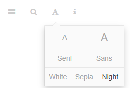

# Cover {.unnumbered}

Placeholder


<!--chapter:end:index.Rmd-->


# Navigating this book {-}

In the upper-left corner of this page you will see a series of icons.  


```r

```


These do the following tasks:

* the file drawer expands/collapses the sidebar table of contents; you can also click `s`
* the magnifying glass toggles search input; you can also click `f`
* the big `A` allows you to change the font size and theme
* the little `i` shows you available keyboard shortcuts


There are several ways to navigate from page to page within this guidebook:

* Use the left-navigation sidebar (type `s` to reveal/hide)
* Click the left or right arrow on each page to go forward or back
* Use the left or right arrow keys on your keyboard to move forward or back
* Use hyperlinks on selected pages, like this one: [Continue to Introduction section](#motivation)


<!--chapter:end:001A-introduction-header.Rmd-->


# (PART\*) Introduction {-}
# Why a Hebrew Grammar course? {- #motivation}

Placeholder


## Grammar course wishlist {- #our_course}
### Welcome to Hebrew GRAMMAR Quest - Experience Biblical Hebrew Grammar, the Holy Language Way! {-}

<!--chapter:end:001A-Motivation.Rmd-->


# "Hebrew Quest: Extended Edition" {- #hgq_and_hq}

Placeholder


<!--chapter:end:001D-hq_and_hgq.Rmd-->


# A Typical Lesson {- #typical-lesson}

Placeholder


<!--chapter:end:001E-typical_lesson.Rmd-->

# Quick Start Instructions {.unnumbered #get_started}

These instructions will get you up and running with the course.  We do encourage you to read the other introductory materials before you tackle Lesson 1.

**Anki NOTE**: Eventually, you can do all work from a mobile device.  _For the initial Anki install, you do need to do these steps from a desktop or laptop_.

<!-- <small>^[<small>If you do not have access to a desktop/laptop computer to install Anki, but do have access to a mobile device, we likely can help. Contact us for assistance at holylanguagecourses@gmail.com.</small>]</small>.  -->

1. Download and install the [free Ezra SIL font](https://software.sil.org/downloads/r/ezra/EzraSIL-2.51.zip ){target="_blank"}.
1. [Sign up for a free Ankiweb account here](https://ankiweb.net/account/register){target="_blank"}.
1. [Download and Install the Anki Program (Mac/PC/Linux)](https://apps.ankiweb.net/){target="_blank"}.
1. [Download the Hebrew GRAMMAR Quest Anki Deck](./images/Hebrew Grammar Quest.apkg){target="_blank"}
1. Change the Anki settings [as described here](#anki_settings).
1. Download the [course checklist](https://docs.google.com/spreadsheets/d/1t0C7JlygyUqgF_aQWbhq7h3s_VDn0VuvISJn5mp-LdE/edit?usp=sharing){target="_blank"} for you to keep track of your progress in this course.


> Let's get started!

<!--chapter:end:001F-quick-start.Rmd-->

# Report an Issue {- #report_issue}

Please do not hesitate to report errors, omissions, or improvement opportunities (in fact, we'd rather hear about mistakes sooner rather than later)! Feedback is anonymous.  If you have a specific question about the content, you can use the [Get Help](#get_help) page.

[Open form in new window](https://forms.gle/qhBToGubVgmjdFbx6){target="_blank"}

<iframe src="https://docs.google.com/forms/d/e/1FAIpQLSf3obLnGzJQ6d7Rtyy2YXDln3g-kJWCY-4IlRLE_mnFuWv2AQ/viewform?embedded=true" width="640" height="733" frameborder="0" marginheight="0" marginwidth="0">
</iframe>


<!--chapter:end:001L-issue.Rmd-->

# Get Help {- #get_help}

While this is a self-paced course with no formal instructor or teaching assistant, we do want to provide a way for you to get help if you get stuck.

We request that before you submit a question, you read through the lesson's Seven Points a couple of times, then attempt to do the Anki cards for that lesson.  If you are still unclear, we are here!

Use the form below to ask a question. Please note, we are staffed by volunteers, so please allow a few days for us to research and get back to you.  If you have general feedback or wish to report an issue, please use the [Report an Issue](#report_issue) form.

[Open form in new window](https://forms.gle/tNsvwrhci3nGkvvV6){target="_blank"}

<iframe src="https://docs.google.com/forms/d/e/1FAIpQLSdWJc7ri0andmyu70D1USeDRtbsrHLaYLNrs0rvI2qBJx-yEg/viewform?embedded=true" width="640" height="673" frameborder="0" marginheight="0" marginwidth="0"></iframe>


<!--chapter:end:001P-question.Rmd-->


# (PART) Hebrew Grammar Foundations {-}
# The Hebrew Aleph-bet {#alephbet}

Placeholder


## First Thought {-}
### שֵׁם יְהוָה אֶקְרָא {-}
## The Hebrew Aleph-Bet {#consonants}
## Hebrew is written and read from RIGHT-to-LEFT {#right_to_left}
## Five "KiMNePaTZ" letters have different final forms {#sofit_letters}
## Six" BeGaD KePHaT" letters take a Daghesh Lene {#daghesh_lene}
## We classify four consonants as **Gutturals** (and one is a sometimes-guttural) {#gutturals}
## Look out for look-alike Letters {#look-alike-letters}
## Sephardic vs "Seminary" Pronunciation {#pronunciation}
## Lesson Conclusion and Activities {-}
### `Anki` {- #anki-1}
### `Worksheets`: Letter Writing {- #worksheets-1}
## `Ruth Pursuit` {-}
### Your Quest: {-}
## `Quest Quiz` {-}

<!--chapter:end:01-Alephbet.Rmd-->

# Hebrew Vowels {.vowels}

<!-- Grammarly check: 10/24/2020 213 lines -->

> To comprehend Biblical Hebrew, we must understand how words are formed and pronounced

Even though our goal may not necessarily be to converse in Biblical Hebrew, hearing the sound of the language aides our learning.  Vowels are what give a language its distinctive sound.  In Hebrew, the same three consonants can change meaning depending on the vowel combination.


<br>


```r
library(knitr)
include_graphics("images/02.Gen0109.png")
```


As Izzy says in Hebrew Quest, “Vowels are important.”  On your screen, you see Genesis 1:9.  The black font shows the text with no vowels. Over time, a group known as the Masorites developed the vowel notation we use today. These are the symbols in red.  These are usually under, but sometimes in the middle of or over the affected consonant. This vowel system intends to preserve the pronunciation passed down for centuries via the oral tradition. The Hebrew name for these diacritical dots and dashes is _nikudot_. The blue font shows additional cantillation marks, which synagogues use for chanting the verses.  These marks also show where the word's accent is.<small>^[<small>Image Source: Originally uploaded as en:File:Example of biblical Hebrew trope.svg on 04:27, 19 November 2006 (UTC) by en:User:SyntaxError55. </small>]</small>

::: {.infobox .map}
**LESSON ITINERARY**

1. Memorize vowels that are not vowel letters
1. Learn vocal sheva and silent sheva
1. Memorize the vowel letters
1. Meet "defective" and "plene" spelling 
1. Meet Daghesh Lene's twin, Daghesh Forte
1. Know the rule for a Daghesh Forte
1. Know that the Gutturals and Resh reject Daghesh Forte
::: 

::: {.infobox .stop}
**EQUIPMENT CHECK**

Before continuing, can you recite the following groups of letters from memory?

* All twenty-two consonants of the Hebrew Aleph-Bet 
* The six BeGaD KePHaT letters
* The five KiMNePaTZ letters
* The four guttural letters and the one sometimes-guttural letter
:::

## First Thought {-}

###  הֵמָּה רָאוּ מַעֲשֵׂי יְהוָה {-}

*They have seen the works of Adonai (Psalms 107:24)*

Reflect on the works of HaShem that you have seen.

<figure>
    <figcaption>Listen to this verse in Hebrew, then say it out loud:</figcaption>
    <audio
        controls controlsList="nodownload"
        src="./images/02.ps107024.mp3">
            Your browser does not support the
            <code>audio</code> element.
    </audio>
</figure>

*****


```r
knitr::include_graphics("images/02-Plain of Bethsaida with green grass, tb110206630.jpg")
```

<div class="figure" style="text-align: center">

<p class="caption">(\#fig:unnamed-chunk-3)Plain of Bethsaida - suggested location where 5000 saw the works of Yeshua (Mark 6). Courtesy of the [Pictorial Library of Bible Lands](https://www.bibleplaces.com)</p>
</div>


## Vowels that are not vowel letters {#vowels}

### Vowels come in three types: Long, Short, Reduced | Vowels come in five classes: A, E, I, O, U {-}

Like the Aleph-bet, we are going to have to commit the vowels in the table below to memory. You will do this in `Anki`. Knowing the vowel types and classes will make your grammatical life much more comfortable in the future.  

* The letter בּ is provided as a placeholder
* Say the vowel _after_ saying the associated consonant<small>^[<small>We will learn that Hebrew loves to break the rules.  In the next lesson, we will learn about an exception to the "vowel comes after" rule, called the *furtive patach*.</small>]</small> So the first vowel example is "baw" not "awb".
*  Future lessons will explain the difference between Qamets and Qamets Hatuf


```r
include_graphics("images/02.vowels_not_letters.png")
```


::: {.infobox .light}
Only **gutturals** take the "Hateph" vowels - to make it easier, we can pronounce all three Hateph vowels like the A in <u>A</u>muse

Hateph vowels are used because Gutturals reject vocal sheva (2.2)
:::


## Vocal and Silent Sheva {#sheva}

* Both are written as בְּ 
  * Both mark the END of a syllable
* VOCAL Sheva<small>^[<small>Many academic textbooks will use the term "Shewa" instead of "Sheva". Both words mean the same thing.</small>]</small> is a REDUCED vowel 
  *  Only non-gutturals can take a Vocal Sheva
      * Gutturals **reject** the Vocal Sheva and take the Hateph vowels instead
    * Pronounced like the A in <u>A</u>muse (same as Hateph Patach)
* SILENT Sheva is NOT A Vowel
    * <u>Any</u> letter can take a Silent Sheva
    * Silent/ No sound
    
::: {.infobox .info}
 We will learn how to distinguish between the two kinds of Sheva in the next lesson
:::

It is worth pointing out that in Hebrew Bibles you may come across a mark that looks like a super-sized sheva.  In English, we might say it looks like a colon (:).  In Hebrew this mark is called a sof pasuq and it is used to mark the end of the verse.  It is no other effect on grammar or pronunciation.  (סוֹף=end; פָּסוּק=verse).  And while we're on this note, sometimes you may see a vertical line |.  This has no meaning for us whatsoever.  You may ignore it when you encounter it.

## Vowel letters {#vowel_letters}

### Vowel letters use a consonant plus a nikkud to form a vowel {-}

Another table to memorize:


```r
include_graphics("images/02.vowels_letters.png")
```


* Shureq is pronounced like Qibbuts (r<u>u</u>ler)
* Hireq Yod is pronounced like the i in mach<u>i</u>ne
* All others are pronounced like their non-vowel-letter counterparts
* Yod and Vav vowels - י,ו 
    * These are Long Vowels that do not reduce
    * Therefore they are called "irreducible (unchangeable) long vowels"<small>^[<small>We'll explain what this means in the next lesson</small>]</small>
    * These occur in the middle or at the end of a word

::: {.infobox .info}
If the Yod or Vav has a vowel of it's own, then the Yod/Vav is acting as a _consonant_, not an irreducible long vowel.
:::

* Hei Vowels - ה
    * Seghol Hei is a short vowel - the other Hei vowels are long
    * Hei vowels **ONLY** occur at the end of a word (often called "word-final hei")
    * Hei vowels are extremely common in Hebrew


## "Defective" and "plene" spelling {#defective_spelling}

In "defective" spelling, letter vowels can sometimes drop their letter and take on the corresponding non-letter vowel. The meaning of the word doesn’t change.

This is the word for "laws" showing both "plene" spelling (left) and "defective" spelling (right):


```r
knitr::include_graphics("images/defective.gif")
```


* Three vowel letters commonly take "defective" forms<small>^[<small>"Defective", in this sense, does not have a negative connotation.</small>]</small>
    * Holem-vav can drop the Vav and contract to Holem, as in the example above
    * Hireq-Yod can drop the Yod and contract to Hireq
    * Shuruq can drop the Vav and it's associated nikkud and contract to Qibbuts
    
The qamets-hei <span class="he">ה ָ  </span>sometimes drops the final ה, leaving just the qamets under the now-final letter.

::: {.infobox .info}    
As you progress, you’ll start to develop a mental checklist when you encounter something that does not seem to follow the normal/regular rules. Asking yourself “Could this be a defective spelling?” will be one of those checklist items.
:::

## The Daghesh Forte Doubles the Consonant {#daghesh_forte}

Notice the שּׁ in <span class="he">הַשָּׁמַיִם:</span>


```r
knitr::include_graphics("images/02.daghesh_forte.gif")
```


 
* Since שׁ is not a בגד כפת letter, we know this *cannot* be a Daghesh Lene, but it is a Daghesh **Forte**
* The letter with the Daghesh Forte both ends one syllable and begins the next syllable
* If we were to syllabify <span class="he"> הַשָּׁמַיִם</span>, it would look something like the bottom line in the picture above (pronounce: `hash-sha-mayim`)<small>^[<small> `Mayim` is one syllable as we will learn in Lesson 3.  <span class="he">הַשָּׁמַיִם</span> means "the heavens."  From now on, we won't always provide a translation for every new word you encounter.  It's more important that you focus on the concepts.  You will have PLENTY of vocabulary work in Anki!</small>]</small>
* A similar word in English might be better = bet | ter
    * If we were to transliterate better into Hebrew hypothetically,  it might look like: בּטֶּר*<small>^[<small>The * means this is not a real Hebrew word, but we show it in this form for illustration.</small>]</small>
* Notice the syllable breaks in these words that have a Daghesh Forte:

```r
include_graphics("images/02.forte.png")
```


* Any consonant (except for Gutturals and Resh) can take a Dagesh Forte, including a בגד כפת letter, which can take either a Daghesh Lene or a Daghesh Forte
    * The "Buck-up" letters will take the **hard** pronunciation regardless of a Daghesh Lene or Daghesh Forte - See the final word אַתָּה in the image above
    * "Any consonant" includes the Vav ו.  When a Vav has a Daghesh Forte it looks like this וּ. Does that remind you of anything?  Maybe something we just discussed on the previous page?
        * That's right. A Vav with a Daghesh Forte וּ is identical to a Shurek וּ.
        * It's surprisingly easy to tell the difference: if there is an additional vowel either under or over the same letter, or if the preceding consonant has a vowel, the letter is a Vav with Daghesh.  A Shurek will _never_ have an additional vowel following or preceding.

_Advanced tip:_ When you see a Daghesh Forte, it often means that another letter has disappeared<small>^[<small>Not entirely unlike the English apostrophe in words like _can't_.</small>]</small>.  We will talk more about this later in the course.

::: {.infobox .info}
It's good to think of the Daghesh Forte as the "Doubling Daghesh", since it doubles the consonant, and often changes a word's meaning.  

Conversely we can think of the Daghesh Lene as the "Meaningless Daghesh", since it does not ever change a word's meaning
:::


## Daghesh Forte Rule {#daghesh_forte_in_bgdkpt}

::: {.infobox .light} 
A Daghesh is a Forte if, and only if, it's preceded by a vowel that is not a Sheva
:::

That's it.  That's the rule<small>^[<small>Strictly speaking, there are exceptions, but you won't encounter them in a first-year Hebrew course</small>]</small>.  

Quiz yourself with these examples (answers below):

* <span class="he">אַתָּה</span> = Is the Daghesh preceded by a vowel that is not a Sheva?<small>^[<small>Yes, a patach. Daghesh Forte</small>]</small>
* <span class="he">בְּרֵאשִׁית</span> = Is the Daghesh preceded by a vowel that is not a Sheva?<small>^[<small>No. Daghesh Lene</small>]</small>
* <span class="he">עַל־פְּנֵי</span> = Is the Daghesh preceded by a vowel that is not a Sheva?<small>^[<small>No. Daghesh Lene.  The "hyphen" looking mark is called a Maqquef.  It has the same function as the Hyphen does in English.</small>]</small>
* <span class="he">מַבְדִּיל</span> = Is the Daghesh preceded by a vowel that is not a Sheva?<small>^[<small>No, it is preceded by a Sheva. Daghesh Lene.</small>]</small>
* <span class="he">מִתַּחַת</span>  = Is the Daghesh preceded by a vowel that is not a Sheva?<small>^[<small>Yes, a Hiriq. Daghesh Forte</small>]</small>


## Gutturals and Resh reject Daghesh Forte {#gutturals_reject_daghesh_forte}

* We said in Lesson One that the Gutturals don’t play nice with the other Hebrew Rules, and this rejection of the Daghesh Forte is one of those ways
* A Hebrew collision like this means something has to give. . . and the gutturals tend to get their way.
* It's like they have a force-field shielding them from other Hebrew grammar rules!


```r
knitr::include_graphics("images/02.reject.gif")
```

<div class="figure" style="text-align: center">

<p class="caption">(\#fig:unnamed-chunk-9)That's no moon.  That's a Guttural!</p>
</div>

* A large chunk of any Hebrew grammar course involves learning to resolve these guttural entanglements.
* You may see הּ. This dot is not a Daghesh but what is called a mappiq.  We'll talk more about the mappiq in Lesson 6.

## Lesson Conclusion and Activities {-}

Congratulations on completing the vowels lesson.  Make sure you know that Daghesh Forte rule and the guttural behavior  The Daghesh Forte is our Hebrew friend who can tell us a great deal about what is happening grammatically with a word.  

We're about halfway through the first stage of the course on Hebrew Grammar Foundations.  Keep going! You're doing great!  After you finish all of the activities for this lesson, you can claim the first of our `Twelve Tribes Badges`. 

Take a second to review the section headings 2.1 - 2.7 on the left side of the screen before heading on to tackle the activities.


### `Anki` {-}

* `Lesson 02 A.Vocab`
* `Lesson 02 B.Grammar`
* `Lesson 02 C.Verses`
  * Bible verses will arrive next Lesson
  * In this module, we will be learning common Hebrew names.
  * Sound out the words using your knowledge of Hebrew consonants and vowels.
  * As a general hint, with a couple of exceptions, the English names are pretty close to how they sound in Hebrew.
  
Access Anki using your mobile app, desktop version, or [the web-based version (login may be required)](https://ankiweb.net/decks/)


### `Vowel worksheet` {-}
* Practice writing the vowels using the [Vowel Writing worksheet/drill](https://drive.google.com/file/d/1ETPKE3u-XGfpNdKmlIr3P_DRbkOOlcI_/view?usp=sharing){target="_blank"} See note<small>^[<small>ignore the "transliteration" column.  An answer key is on page two.  Repeat this worksheet until you can complete it correctly entirely from memory.</small>]</small>


## `Ruth Pursuit` {-}

### Your Quest: {-}

1. Identify the four UNCHANGEABLE LONG vowels that use YOD in Verse 1 (blue)<small>^[<small>In most word processors, you won't be able to isolate the vowel to highlight. Get as close as you can.</small>]</small>|
2. Identify the two UNCHANGEABLE LONG vowels that use VAV in Verse 1 (Green)
3. Identify QAMETS HEI in Verse 1.  There is a TSERE Hei between Verses 5-10.  Can you find it?<small>^[<small>The other vowels that use hei are less common, but we will see them when we discuss verbs.</small>]</small> (Purple)
4. Identify the three LONG vowels in Verse 1 (that are not part of a vowel letter) (pink)|
5. Identify three of the five SHORT vowels in Verse 1 (that are not part of a vowel letter)<small>^[<small>We haven't learned to spot Qamets Hatuf yet, and Qibbuts does not appear in this passage</small>]</small> (red)
6. Five the three REDUCED/HATEPHH vowels, including Hateph Qamets Hatuf<small>^[<small>You should be able to make out the word that has the Hateph Qamets Hatuph</small>]</small>.  They are in verses 2-4. (grey)
7. One of the more common verbs in the Tanach is **וַיֹּאמֶר **, which means "(and) he said. 
    * Vav-Patach-**Yod**-Daghesh Forte --וַיּ to start a verb means "And he (did or was something)  
    * If we change the second consonant from a Yod to a **Tav**, we get --וָתּ, "and **S**he (did or was something).  
            * Thus, וַתֹּאמֶר means "and she said."  
            * Challenge: Find the five instances of וַתֹּאמֶר in Ruth Chapter 1<small>^[<small>In at least three of the cases, you should be able to figure out who is speaking.</small>]</small>  (yellow)  

* [Blank copy of Ruth Chapter 1](https://drive.google.com/file/d/1qcfTKAlTJGChC2eYCMhSbY2w-ibzCcDV/view?usp=sharing){target="_blank"}

* [Ruth Pursuit Answer Key #2](https://drive.google.com/file/d/1xtcXRb1PWbt-qkbVWW9yGfkC40_d8gtf/view?usp=sharing){target="_blank"}
        
## `Quest Quiz` {-}

[Open Quest Quiz #2 in a new window](https://docs.google.com/forms/d/e/1FAIpQLSeq_9Cy5IlAKDFy8nx9GNC3dfs5l5bJ_iX2FJ0Az7rPKXq5Jw/viewform){target="_blank"}

<iframe src="https://docs.google.com/forms/d/e/1FAIpQLSeq_9Cy5IlAKDFy8nx9GNC3dfs5l5bJ_iX2FJ0Az7rPKXq5Jw/viewform?embedded=true" width="800" height="600" frameborder="0" marginheight="0" marginwidth="0"></iframe>

## Claim your `Twelve Tribes Badge`! {- #twelve-tribes-badge-1}

If you have completed **all activities** in Lessons 1 and 2, you may claim the first of our "Twelve Tribes" badges<small>^[<small>Once published, the full thirty-five lesson course will have a badge to be claimed after every two to three lessons.  There is only one badge available in the preview version of the course.</small>]</small>.

[Check the requirements here](https://docs.google.com/spreadsheets/d/1t0C7JlygyUqgF_aQWbhq7h3s_VDn0VuvISJn5mp-LdE/edit?usp=sharing){target="_blank"}, then complete the certification and claim your badge below:

<iframe src="https://docs.google.com/forms/d/e/1FAIpQLSeFujHNSMAZ5ZjJbNsr7pFJnma5RGwG-7StAR1uvevGe_5zvg/viewform?embedded=true" width="640" height="691" frameborder="0" marginheight="0" marginwidth="0">Loading…</iframe>

<!--chapter:end:02-Vowels.Rmd-->


# Syllabification and Pronunciation {#Syllabification}

Placeholder


## First Thought {-}
###  אַשְׁרֵי אָדָם לֹא יַחְשֹׁב יְהוָה לוֹ  {-}
## Hebrew Syllables {#syllables}
## Hebrew Word Accents {#accents}
### Tonic, Pretonic, and Propretonic Syllables {-}
### Ultima, Penultima, and Antepenultima syllables {-}
## Rules for Silent Sheva {#s_sheva}
### A Sheva is SILENT when the previous vowel is short: {-}
### A Sheva is SILENT when the first of two consecutive Shevas _within a word_: {-}
### A Sheva is SILENT when at the end of a word: {-}
## Rules for Vocal Sheva {#v_sheva}
### A Sheva is VOCAL when the initial Sheva in a word: {-}
### A Sheva is VOCAL when the second of two consecutive Shevas _within a word_<small>^[<small>A Sheva at the **end** of a word is **always silent**, even when it is the second of two consecutive Shevas.</small>]</small>:  {-}
### A Sheva is VOCAL when under a Daghesh Forte: {-}
### A Sheva is VOCAL after an unaccented long vowel: {-}
## Hebrew Diphthong = Accented Patach-Yod-Hiriq {#diphthong}
## Vowels and Syllable Preference {#vowel_pref}
## Qamets Hatuf, Furtive Patach, Quiescent Alef {#misc_vowels}
## Lesson Conclusion and Activities {-}
### Introduction to Video Warm-ups {-}
## `Word Warm-up` {-}
## `Verses Warm-up` {-}
## `Ruth Pursuit` {-}        
### Your Quest: {-}
## `Quest Quiz` {-}

<!--chapter:end:03-Syllabification.Rmd-->


# (PART) Nouns, Prepositions, Pronouns {-}
# Hebrew Nouns {.Nouns}

Placeholder


## First Thought {-}
### רְאֵה לִמַּדְתִּי אֶתְכֶם חֻקִּים וּמִשְׁפָּטִים {-}
## Gender and Number {#gender_number}
## Singular Noun Endings {#sing_noun_endings}
## Plural and Dual Noun Endings {#noun_pluralization}
## Special dual forms {#dual_forms}
## Irregular Pluralization  {#irregular_pluralization}
### Segholate Nouns follow a standard vowel pattern when pluralizing {-}
### Geminate words take a Daghesh Forte {-}
## Rule of Sheva {#rules_sheva}
## Lexical Form {#lexical_form}
## `Word Warm-up` {-}
## `Verses Warm-up` {-}
## `Anki` {-}
## `Ruth Pursuit` {-}        
### Your Quest: {-}
## `Quest Quiz` {-}

<!--chapter:end:04-NounsPlural.Rmd-->


# Definite Article and Conjunction Vav {.Article}

Placeholder


## First Thought {-}
## Equipment Check {-}
## Translate the Vav Conjunction {#vav_translate}
## Identify the Vav Conjunction {#vav_identify}
## Loss of Daghesh Forte {#loss_daghesh_forte}
## Translate the Article {#article_translate}
## Identify the Article {#article_identify}
## Hebrew Indefiniteness {#indefiniteness}
## Hebrew Definiteness {#definiteness}
## Lesson Conclusion and Activities {-}
## `Word Warm-up` {-}
## `Verses Warm-up` {-}
## `Anki` {-}
## `Ruth Pursuit` {-}        
### Your Quest: {-}
## `Quest Quiz` {-}
## Claim your next `Twelve Tribes Badge`! {-}

<!--chapter:end:05-DefArt_Conjunction.Rmd-->


# Hebrew Prepositions

Placeholder


## First Thought {-}
## Equipment Check {-}
## Nun with Silent Sheva Becomes Daghesh Forte
## Independent and Maqqef prepositions 
## Inseparable prepositions
## The Article and Inseparable Prepositions
## The flexible מִן: construction
## The flexible מִן: meanings 
## The Definite Direct Object marker 
## Review and Activities {-}
### `Anki` {-}
## `Word Warm-up` {-}
## `Verses Warm-up` {-}
## `Ruth Pursuit` {-}        
### Your Quest: {-}
## `Quest Quiz` {-}

<!--chapter:end:06-Prepositions.Rmd-->


# Hebrew Adjectives

Placeholder


## First Thought {-}
## Equipment Check {-}
## Inflecting Adjectives
## Substantival Use
## Attributive Use
## Predicative Use
## Adjective Use Summary
## The Mappiq 
## The Directional Ending 
## `Word Warm-up` {-}
## `Verses Warm-up` {-}
## `Anki` {-}
## `Worksheets`: NameOfWorksheet {-}
## `Ruth Pursuit` {-}        
### Your Quest: {-}
## `Quest Quiz` {-}
## Claim your next `Twelve Tribes Badge`! {-}

<!--chapter:end:07-Adjectives.Rmd-->


# Hebrew Pronouns

Placeholder


## First Thoughts {-}
## Equipment Check {-}
## Independent Personal Pronoun
## Relative Pronoun אֲשֶׁר
## Interrogative Pronoun
## Interrogative Particle הֲ
### Interrogative Particle vs Definite Article {-}
## Near and Far Demonstratives
## Demonstrative Adjective 
## Demonstrative Pronoun
## Conclusion and Intro to Activities {-}
## `Word Warm-up` {-}
## `Verses Warm-up` {-}
## `Anki` {-}
## `Worksheets`: Pronouns {-}
## `Ruth Pursuit` {-}        
### Your Quest: {-}
## `Quest Quiz` {-}

<!--chapter:end:08-Pronouns.Rmd-->


# Hebrew Pronominal Suffixes

Placeholder


## First Thoughts {-}
## Equipment Check {-}
## Meaning
## Type 1 vs Type 2 Suffixes
## Tell Type 1 apart from Type 2
## Lexical Form with Type 1
## Lexical Form with Type 2
## Unexpected changes
## Look-alike words
### אֵת {-}
###  עִם with or עַם people {-}
### אֵל, God, or אֶל, to {-}
## `Word Warm-up` {-}
## `Verses Warm-up` {-}
## `Anki` {-}
## `Worksheets`: NameOfWorksheet {-}
## `Ruth Pursuit` {-}        
### Your Quest: {-}
## `Hebrew Quest Study Passage`: Book Chapter# {-}
## `Quest Quiz` {-}
## Claim your next `Twelve Tribes Badge`! {-}

<!--chapter:end:09-Pronominal_Suffixes.Rmd-->


# Hebrew Construct Chain {.ConstructChain}

Placeholder


## First Thoughts {-}
## Equipment Check {-}
## What is a Construct Chain?
## What makes a construct chain
## Review: what makes a word definite 
## The Last Word sets the definiteness of a chain
## How to Recognize a Construct Chain
## Identifying Construct state by Noun Endings
## Construct Chain Summary
## `Word Warm-up` {-}
## `Verses Warm-up` {-}
## `Anki` {-}
## `Worksheets`: Construct Identification {-}
## `Ruth Pursuit` {-}        
### Your Quest: {-}
## `Quest Quiz` {-}

<!--chapter:end:10-ConstructChain.Rmd-->


# Numerals/counting

Placeholder


## First Thought {-}
## Equipment Check {-}
## The Biblical text always spells out numbers
## Notes and footnotes use symbols for numbers
## Be Familiar with Hebrew Ordinal Numbers - First through Tenth
### Hebrew Quest Ordinal Numbers Video {-}
## Hebrew Cardinal Numbers
## Digits 1 and 2 match the gender of the noun
## Digits 3-10 take the opposite gender of the noun
## Learn the Cardinal Numbers Above 10
## Conclusion
## `Word Warm-up` {-}
## `Verses Warm-up` {-}
## `Anki` {-}
## `Ruth Pursuit` {-}        
### Your Quest: Locate numerals {-}
## Claim your next `Twelve Tribes Badge`! {-}

<!--chapter:end:11-Numerals.Rmd-->

# (PART) Qal Binyanim {-}

# Introduction to Hebrew Verbs {#Verbs}

<!--chapter:end:12-Verbs_Intro.Rmd-->

# Qal Perfect - Strong Verbs {.QP-s}

<!--chapter:end:13-Qal_Perfect_Strong.Rmd-->

# Qal Perfect - Weak Verbs {.QP-w}


<!--chapter:end:14-Qal_Perfect_Weak.Rmd-->

# Qal Imperfect - Strong Verbs {.QI-s}


<!--chapter:end:15-Qal_Imperfect_strong.Rmd-->

# Qal Imperfect Weak {.QI-w}


<!--chapter:end:16-Qal_Imperfect_Weak.Rmd-->

# Vav Consecutive {.wc}


<!--chapter:end:17-Vav_Consecutive.Rmd-->

# Qal Imperative {.QM}


<!--chapter:end:18-Qal_Imperative_strong.Rmd-->

# Pronominal Suffixes on Verbs {.VerbSuffix}


<!--chapter:end:19-Pronominal_Suffix_Verbs.Rmd-->

# Qal Infinitive Construct {.Q∞}


<!--chapter:end:20-Qal_Infinitive_Construct.Rmd-->

# Qal Infinitive Absolute {.QA}

<!--chapter:end:21-Qal_Infinitive_Absolute.Rmd-->

# Qal Participle {.QPt}


<!--chapter:end:22-Qal_Participle.Rmd-->

# Hebrew Syntax {.Syntax}


<!--chapter:end:23-Hebrew_Syntax.Rmd-->

# (PART) Derived Binyanim {-}

# The Niphal Stem - Strong Verbs {#N-s}

<!--chapter:end:24-Niphal_Strong.Rmd-->

# The Niphal Stem - Weak Verbs {.N-w}


<!--chapter:end:25-Niphal_Weak.Rmd-->

# The Piel Stem - Strong Verbs {.D-s}


<!--chapter:end:26-Piel_Strong.Rmd-->

# The Piel Stem - Weak Verbs {.D-w}


<!--chapter:end:27-Piel_Weak.Rmd-->

# The Pual Stem - Strong Verbs {.Dp-s}

<!--chapter:end:28-Pual_Strong.Rmd-->

# The Pual Stem - Weak Verbs {.Dp-w}


<!--chapter:end:29-Pual_Weak.Rmd-->

# The Hiphil Stem - Strong Verbs {.H-s}

<!--chapter:end:30-Hiphil-Strong.Rmd-->

# The Hiphil Stem - Weak Verbs {.H-w}


<!--chapter:end:31-Hiphil-Weak.Rmd-->

# The Hophal Stem - Strong Verbs {.Hp-s}


<!--chapter:end:32-Hophal_Strong.Rmd-->

# The Hophal Stem - Weak Verbs {.Hp-w}


<!--chapter:end:33-Hophal_weak.Rmd-->

# The Hithpael Stem - Strong Verbs {.HT-s}

<!--chapter:end:34-Hitpael_Strong.Rmd-->

# The Hithpael Stem - Weak Verbs {.Ht-w}

<!--chapter:end:35-Hitpael_Weak.Rmd-->

# (APPENDIX) Appendices {-} 

<!--chapter:end:40-Appendices.Rmd-->


# Anki info and FAQ {#anki_faq}

Placeholder


## Installation {- #installation_anki}
## Customize Anki Settings {- #anki_settings}
### Below is the main set you will want to change.  Enter these numbers carefully: {-}
## How do I access Anki on my mobile device? {-}
## How do I navigate within Anki? {-}
## How do I know when to hit the `Good` button on a **Vocabulary** or **Grammar** card? {-}
## How do I know when to hit the `Good` button on a **Verse Translation** card? {-}
## What are Anki Add-ons? {-}
## How often should I expect to work in Anki? {-}
## How do I know when I'm done with a deck? {-}
## Anki Completion Requirements for the`Course Checklist` {-}
## Anki Completion Requirements for the `Certificate` {-}
## What do the different card stages mean? {-}
## Can I add an image or a hint? {-}
## Can I modify the layout of a card? {-}
### Proceed with caution: {-}
## What does `There are more new cards available, but the daily limit has been reached` mean? {-}
## How do I submit screenshots for the `Certificate`? {-}

<!--chapter:end:45-Anki.Rmd-->


# More Hebrew Quest and Hebrew GRAMMAR Quest FAQ {#hq_hgq_faq}

Placeholder


## What is the difference between Hebrew Quest and Hebrew GRAMMAR Quest? {- #difference}
## Do I need to complete Hebrew Quest before I start Hebrew GRAMMAR Quest? {- #complete_hq_first}
## When I complete this course, should I go back and finish Hebrew Quest? {- #need_to_finish_hq}
## I haven't started either course.  Which should I do first? {- #which_first}

<!--chapter:end:50-HQ_HGQ_FAQ.Rmd-->


# Other FAQ {#other_faq}

Placeholder


## There are many books out there to learn Hebrew.  What makes Hebrew GRAMMAR Quest different? {- #hgq_difference}
## Will I be required to buy anything? {- #buy_materials} 
## Who will (and who might not) benefit from Hebrew GRAMMAR Quest? {- #who_benefits}
## What if I am a Bible teacher? Should I take this course? {- #bible_teacher}

<!--chapter:end:55-faq.RMD-->

# Lexicon 


```r
library(knitr)
include_graphics("images/lexicon.jpg")
```


The authors of <u>Basics of Biblical Hebrew</u> have created an abridged Lexicon to accompany this course.  This document is nice as vocabulary words are indexed to the Lesson #, and irregular plural forms and selected construct forms are also included.

[Open/download BBH Lexicon](./images/BBH_Lexicon.pdf){target="_blank"}

You are also encouraged to check out the Lexicon resources in the [Holy Language Heritage Library](https://holylanguage.com/resources-dictionaries.php){target="_blank"}.  They are much more exhaustive.  

<!--chapter:end:57-Lexicon.Rmd-->


# (PART\*) About us and this book {-}
# About Holy Language Institute {-}

Placeholder


## Following Yeshua {-}
## In a Hebrew Way {-}
## Together {-}

<!--chapter:end:60-About_HLI.Rmd-->

# Acknowledgments {-}

All honor and glory to Yeshua, our Lord.  שֵׁם יְהוָה אֶקְרָא

Unless, otherwise noted, English Scripture quotations taken from the NASB. Copyright by The Lockman Foundation. Used by permission.

Pictures of Israel to begin each lesson are courtesy of the [Pictorial Library of Bible Lands](www.bibleplaces.com){target="_blank"}. Used by permission.

Biblical Hebrew text is courtesy of tanach.us (version 26.0).

Our thanks to Dr. Gary Pratico and Dr. Myles Van Pelt for <u>Basics of Biblical Hebrew</u>, the seminary textbook that inspired the format of **Hebrew Grammar Quest**.  We encourage any of our students who wish to go further with Hebrew grammar to purchase the textbook or any related materials.

Additionally, our thanks to Dr. John Beckman for making his extensive library of materials to accompany <u>Basics of Biblical Hebrew</u> freely available for reuse under CC-BY-SA.

As applicable:

* Vocabulary portions of this book are derivatives of [00_vocabulary.pdf](https://hebrewsyntax.org/bbh2new/00_vocabulary.pdf) by John Beckman, used under [CC-BY-SA](https://creativecommons.org/licenses/by-nc-sa/4.0/).
* Grammar portions of this book are derivatives of [00_study_guide.pdf](https://hebrewsyntax.org/bbh2new/00_study_guide.pdf) as well as the "overhead" files for each chapter (for example [Chapter 1-The Hebrew Alephabet](https://hebrewsyntax.org/bbh2new/01_overheads_bw.pdf), and so on for each successive chapter) by John Beckman, used under [CC-BY-SA](https://creativecommons.org/licenses/by-nc-sa/4.0/).
* Study verses portions of this Anki deck are derivatives of [00_workbook_answers.pdf](https://hebrewsyntax.org/bbh2new/00_workbook_answers.pdf) by John Beckman, used under [CC-BY-SA](https://creativecommons.org/licenses/by-nc-sa/4.0/).

Yihui Xie is the genius who developed the [Bookdown](https://bookdown.org/) tool, which is the engine behind publishing this interactive book.  Without Bookdown, we would not have been able to achieve those bullet points listed on the [What we wanted in our course](#our_course) page related to the ease of lifting the project and making it available to our subscribers for free, while maintaining a professional look.

Finally, we thank YOU for your interest in this course! 

<!--chapter:end:60-Acknowledgments.Rmd-->

# About the designer of this book {-}

* Chris Flanagan has been a member of HLI since 2013 and joined as a ministry volunteer in 2015.
* He has completed Hebrew Quest as a student, which planted a desire to dig deeper into the original languages. He has completed both Hebrew and Greek courses at the seminary level.
* He has worked on a number of projects for HLI from an instructional design standpoint, including leading of "Hebrew Quest Memrise" and now "Hebrew Grammar Quest"
    * This work is simply a compilation of many various first-year Hebrew resources, which he has knitted together to present in an original and engaging format
    * For this reason, he likes to refer to himself as the "designer" or "compiler" of this dynamic Hebrew learning tool, and not the "author" of a static book
* Professionally, Chris has worked in the healthcare compliance field for over 30 years
* Personally, Chris is married and has two men in college.  He and his wife, Sarah, love to travel, especially to Israel; (which, as you can tell, has inspired the format of each lesson in this book)


```r
knitr::include_graphics("images/cf.jpg")
```

<div class="figure" style="text-align: center">

<p class="caption">(\#fig:unnamed-chunk-11)Chris Flanagan</p>
</div>


<!--chapter:end:65-abouttheauthor.Rmd-->

# License {-}


© 2020 Holy Language Institute. All rights reserved.


This work is licensed under the Creative Commons Attribution-NonCommercial-ShareAlike 4.0 International License. 

This license is for personal use only.  This publication may not be downloaded, redistributed, re-uploaded, published, or used for any other purposes without explicit permission from the copyright holder.

If you received this book and you are not a member of Holy Language Institute, [become a member](https://holylanguage.com/subscribe.html) today!  Subscribing will give you access to the full Hebrew GRAMMAR Quest course, as well as our complete library of teaching materials.


<!--chapter:end:70-License.Rmd-->


# References {-}


<!--chapter:end:99-References.Rmd-->


# LessonTitle {#lessontitle}

Placeholder


## `Lesson Prayer` {-}
## Equipment Check {-}
## Point1 
## Point2 
## Point3 
## Point4 
## Point5 
## Point6 
## Point7 
## `Word Warm-up` {-}
## `Verses Warm-up` {-}
## `Anki` {-}
## `Worksheets`: NameOfWorksheet {-}
## `Ruth Pursuit` {-}        
### Your Quest: {-}
## `Hebrew Quest Study Passage`: Book Chapter# {-}
## `Quest Quiz` {-}
## Claim your next `Twelve Tribes Badge`! {-}

<!--chapter:end:99-zChapter_Template.Rmd-->

