

# Cover {.unnumbered}

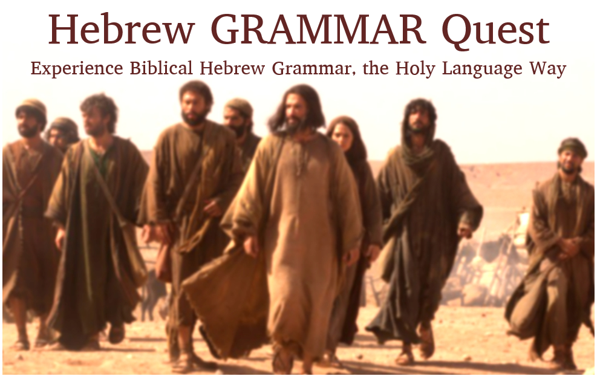

<small>*Updated*: 2020-11-14</small>

<!--chapter:end:index.Rmd-->

# Navigating this book {-}

In the upper-left corner of this page you will see a series of icons.  

These do the following tasks:

* the file drawer expands/collapses the sidebar table of contents; you can also click `s`
* the magnifying glass toggles search input; you can also click `f`
* the big `A` allows you to change the font size and theme
* the little `i` shows you available keyboard shortcuts

There are several ways to navigate from page to page within this guidebook:

* Use the left-navigation sidebar (type `s` to reveal/hide)
* Click the left or right arrow on each page to go forward or back
* Use the left or right arrow keys on your keyboard to move forward or back
* Use hyperlinks on selected pages, like this one: [Continue to Introduction section](#motivation)

<!--chapter:end:001A-introduction-header.Rmd-->

# (PART\*) Introduction {-}

# Why a Hebrew Grammar course? {- #motivation}

If you are familiar with our ministry, you know our flagship course ***Hebrew Quest***, which introduces our students to the Jewishness of our Messiah and our Bible.

***Hebrew Quest*** was designed to get students into the Hebrew text as quickly as possible, with minimal focus on learning rules. For many of our students, this approach is quite successful; but, we also noticed other students began to drop off between lessons 12 and 16. These are the grammar lessons in between the Aleph-Bet (1-11) and the study passages (17-40). For some, these lessons were too much Hebrew grammar too fast, and for others it was not enough Hebrew grammar.

As we searched for a resource to recommend to these students, we noticed that they tended to fall into one of two camps:

1. <u>A workbook or a series of videos that are entirely self-paced/self-directed</u>. 
    * There may be some exercises, but generally tend to not be rigorous from an academic standpoint.
    * Additionally, with this format, there is no way for a student to get feedback on progress.
    
2. <u>Academic/Seminary level textbooks and courses</u>. 
    * These materials are __extremely__ rigorous with copious amounts of reading, rote memorization of paradigms, and in the case of courses, lectures and exams
    * The textbooks generally are much more detailed and advanced than most of our students need (or would enjoy). For example, there is usually an emphasis on Hebrew writing, such as learning how to convert a noun from singular to plural.
    * The pace of these courses is usually fast, and the stress level is high, focusing on due dates and grades.

Additionally, with either option, our students would incur additional fees to purchase these materials. This is something we wanted to avoid.

Although many of the resources we researched are top-notch, they were not quite what we were seeking for our students.

_(continued)_

## Grammar course wishlist {- #our_course}

---

So what _were_ we seeking?

* In terms of content and rigor, the course would be academically challenging, but it would still be enjoyable with a low-stress level.
* The course would be self-paced for independent learning but provide feedback and encouragement.
* The course must align with our [Holy Language Learning Philosophy](https://holylanguage.com/learning-philosophy.php): emphasize active forms of learning over tons of reading and long lectures. It should seamlessly mesh with _Hebrew Quest_.
* From a technological standpoint, the course must be inexpensive and straightforward to deliver and maintain, while at the same time being high-quality and visually pleasant.
* The course should be easy to use (and if at all possible, free) for our students.
* Most importantly, the course must be Yeshua-centered that approaches learning Hebrew grammar as a spiritual as well as an academic endeavor (which is also a big part of our Learning Philosophy).

We couldn't find a course like this...so we BUILT it ourselves!

### Welcome to Hebrew GRAMMAR Quest - Experience Biblical Hebrew Grammar, the Holy Language Way! {-}

<!--chapter:end:001A-Motivation.Rmd-->

# "Hebrew Quest: Extended Edition" {- #hgq_and_hq}

> The reason we study Biblical Hebrew grammar is so we can better EXPERIENCE Biblical Hebrew

What do we mean by "Hebrew Quest: Extended Edition"?  

Suppose you were to take a hypothetical microscope and inspect Lessons 13-15 of _Hebrew Quest_. In that case, we believe <u>Hebrew GRAMMAR Quest</u> is what you would see. Hebrew GRAMMAR Quest will begin with a brief review of the Aleph-bet and the vowels we learned in _Hebrew Quest_ Lessons 1-12. Then we begin our deep dive into grammar topics touched upon in _Hebrew Quest_ Lessons 13-15.

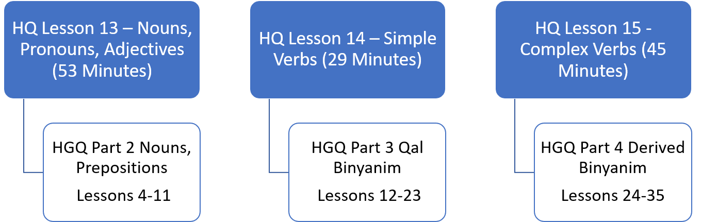

If you finished _Hebrew Quest_, Hebrew GRAMMAR Quest might be a logical next step.  

On the other hand, maybe you started _Hebrew Quest_ but hit some roadblocks.  In that case, we believe Hebrew GRAMMAR Quest can provide you with important underlying grammatical concepts so, eventually, you can return to _Hebrew Quest_ and finish up.  We're going to help you with this goal. In the second half of this grammar course, we will incorporate several of the [Study Passage](https://holylanguage.com/ot-readings.html) sections of _Hebrew Quest_.  

If you have an interest in learning some of the inner workings of Hebrew, then we'd say you're in the right place!

Here are some additional FAQ about the two courses:

* [What are the differences between _Hebrew Quest_ and Hebrew GRAMMAR Quest?](#difference)
* [Do I need to complete _Hebrew Quest_ before I start Hebrew GRAMMAR Quest?](#complete_hq_first) Quick answer: NO!
* [When I complete this course, should I go back and finish _Hebrew Quest_?](#need_to_finish_hq) Quick answer:: YES!
*  [I haven't started either course.  Which should I do first?](#which_first) Quick Answer: 
    1. Complete _Hebrew Quest_ Lessons 1-15 (don't worry about whether you fully absorb the grammar material in Lessons 13-15)
    2. Hop over to Hebrew GRAMMAR Quest and complete the full course  
    3. When you finish here, return to complete _Hebrew Quest_

<!--chapter:end:001D-hq_and_hgq.Rmd-->

# A Typical Lesson {- #typical-lesson}

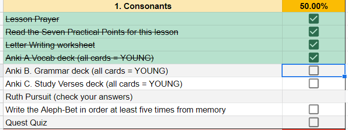

In this course, you won't just read; you will DO!  This course is going to be jam-packed with activities.  You'll recognize an activity in this book by `this unique font`.  You can read more in our [Course Structure](#what_to_expect) article. Below is what will be inside a typical lesson<small>^[<small>We are following the same chapter organization as the textbook <u>Basics of Biblical Hebrew</u>, while extensively leveraging supplemental materials created by Dr. John Beckman, which he has generously made available for free to the Hebrew learning community.  See the [Course Structure](#what_to_expect) and our [Acknowledgments](#acknowledgments) pages for additional information.</small>]</small>:

**Title**|**Description**
:-----|:-----
  READING|
  Lesson Itinerary | The lesson's key learning objectives.
 Equipment Check|Things you must have in your backpack before proceeding with the next phase of your journey.
 Lesson Itinerary |The lesson's key learning objectives.
 First Thought |A Bible verse from the lesson.
 Lesson Points | A brief discussion of the items on the Lesson Itinerary. The goal is to give you just enough information to get started in `Anki`
 ACTIVITIES|
 `Word and Verse Warm-ups`|Starting with Lesson 3, these are brief "stretching" exercises before doing the `Anki` workouts, narrated by Izzy!
 `Anki`<small>^[<small>See [appendix](#anki_faq) for more information on Anki if you are not familiar with it.</small>]</small>| This is where the majority of your learning will take place.  There will be three stages to each Lesson.
`A. Vocab`|By the end of the course, you will have around 500 words memorized
 `B. Grammar`|Here, you will work through (and at times grapple with) the main grammar concepts discussed in the Lesson.
 `C. Workbook`| Brief Hebrew word activities to reinforce the grammar concepts
 `D. Study Verses`|You will begin to translate from Hebrew to English. This component may not be easy at first but stick with it!  Keep in mind the goal is translation and comprehension, not rote memorization.
`Worksheets`|Additional activities to reinforce learning (selected lessons)
`Ruth Pursuit`|Similar to the "bag the letter" in _Hebrew Quest_. You will identify examples of grammar concepts in Ruth Chapter 1.
`Hebrew Quest Study Passages`|Beginning with Lesson 18, we will link-up with the Hebrew Quest study passages.
`Quest Quiz`|Self-assessment activity to measure your familiarity with the material.  No grades are recorded or granted in this course. 
`Twelve Tribes Badges` and `Graduation`|Fun things that mark the completion of various stages of your GRAMMAR Quest.

We have also created a Course Checklist to help keep you organized. Instructions for accessing this are on the next page.

Throughought the way you'll see some informational boxes.  Here is what they mean:

::: {.infobox .map}
The Lesson Itinerary - learning objectives
:::

::: {.infobox .stop}
Equipment Check - concepts from previous lessons you should know before starting the next lesson
:::

::: {.infobox .light}
A critical point not to be missed
:::

::: {.infobox .info}
Additional information that is good to know
:::

Minor or parenthetical points will be included as footnotes throughout each lesson.

Our belief is you learn best by doing.  Izzy discusses this is greater detail in the clip below from **Hebrew Quest** Lesson 1:

<iframe width="560" height="315" src="https://www.youtube.com/embed/
Ex9mBMAqWhI?start=2823
&rel=0&showinfo=0" frameborder="0" allow="accelerometer; autoplay; clipboard-write; encrypted-media; gyroscope; picture-in-picture" allowfullscreen></iframe>

<!--chapter:end:001E-typical_lesson.Rmd-->

# Quick Start Instructions {.unnumbered #get_started}

These instructions will get you up and running with the course.  We do encourage you to read the other introductory materials before you tackle Lesson 1.

**Anki NOTE**: Eventually, you can do all work from a mobile device.  _For the initial Anki install, you do need to do these steps from a desktop or laptop_.

<!-- <small>^[<small>If you do not have access to a desktop/laptop computer to install Anki, but do have access to a mobile device, we likely can help. Contact us for assistance at holylanguagecourses@gmail.com.</small>]</small>.  -->

1. Download and install the [free Ezra SIL font](https://software.sil.org/downloads/r/ezra/EzraSIL-2.51.zip ){target="_blank"}.
1. [Sign up for a free Ankiweb account here](https://ankiweb.net/account/register){target="_blank"}.
1. [Download and Install the Anki Program (Mac/PC/Linux)](https://apps.ankiweb.net/){target="_blank"}.
1. [Download the Hebrew GRAMMAR Quest Anki Deck](./images/Hebrew Grammar Quest.apkg){target="_blank"}
1. Change the Anki settings [as described here](#anki_settings).
1. Download the [course checklist](https://docs.google.com/spreadsheets/d/1t0C7JlygyUqgF_aQWbhq7h3s_VDn0VuvISJn5mp-LdE/edit?usp=sharing){target="_blank"} for you to keep track of your progress in this course.

> Let's get started!

<!--chapter:end:001F-quick-start.Rmd-->

# Report an Issue {- #report_issue}

Please do not hesitate to report errors, omissions, or improvement opportunities (in fact, we'd rather hear about mistakes sooner rather than later)! Feedback is anonymous.  If you have a specific question about the content, you can use the [Get Help](#get_help) page.

[Open form in new window](https://forms.gle/qhBToGubVgmjdFbx6){target="_blank"}

<iframe src="https://docs.google.com/forms/d/e/1FAIpQLSf3obLnGzJQ6d7Rtyy2YXDln3g-kJWCY-4IlRLE_mnFuWv2AQ/viewform?embedded=true" width="640" height="733" frameborder="0" marginheight="0" marginwidth="0">
</iframe>

<!--chapter:end:001L-issue.Rmd-->

# Get Help {- #get_help}

While this is a self-paced course with no formal instructor or teaching assistant, we do want to provide a way for you to get help if you get stuck.

We request that before you submit a question, you read through the lesson's Seven Points a couple of times, then attempt to do the Anki cards for that lesson.  If you are still unclear, we are here!

Use the form below to ask a question. Please note, we are staffed by volunteers, so please allow a few days for us to research and get back to you.  If you have general feedback or wish to report an issue, please use the [Report an Issue](#report_issue) form.

[Open form in new window](https://forms.gle/tNsvwrhci3nGkvvV6){target="_blank"}

<iframe src="https://docs.google.com/forms/d/e/1FAIpQLSdWJc7ri0andmyu70D1USeDRtbsrHLaYLNrs0rvI2qBJx-yEg/viewform?embedded=true" width="640" height="673" frameborder="0" marginheight="0" marginwidth="0"></iframe>

<!--chapter:end:001P-question.Rmd-->

# (PART) Hebrew Grammar Foundations {-}

# The Hebrew Aleph-bet {#alephbet}

> To comprehend Biblical Hebrew, we must have the Aleph-Bet memorized

 

This graphic shows the evolution of Hebrew. Top to bottom: proto-Canaanite (~1600 BCE), paleo-Hebrew (~900 BCE), Rashi (1500 CE), Ketav Stam (used in Torah scrolls and other formal documents), contemporary block, and modern cursive. This course will use the contemporary block style. For more history and discussion on the other script forms, see Hebrew Quest, lessons 2-11.  In this initial lesson we will meet the Hebrew Aleph-Bet.  The letters are like a family, and with any family there can be interesting dynamics (including not always playing nice with each other!).  The bulk of the lesson will take a look at some of those dynamics.

::: {.infobox .map}
**LESSON ITINERARY**

1. Meet the Hebrew Aleph-Bet
1. Understand that Hebrew is written and read from RIGHT to LEFT
1. Identify the group of five letters that have final/Sofit forms
1. Identify the group of six letters that can take a Daghesh Lene
1. Identify the group of four "guttural" letters that cause significant changes in spelling and punctuation (and the one additional letter that sometimes acts as a guttural)
1. Differentiate among "look-alike" letters
1. Note differences between "Seminary" and "Sephardic" pronunciation

:::

::: {.infobox .stop}

**EQUIPMENT CHECK**

If you are eager to jump right in with Lesson 1, we understand totally.  We are also excited for you to start!

"Equipment Check" is where we will pause before each lesson to make sure you have the right tools and supplies in your backpack before heading on the next phase of your Quest.  In future lessons, we will want to make sure you have an understanding of specific concepts before continuing<small>^[<small>See discussion on ["The Fog"](#the-fog) in the appendix</small>]</small>

Before continuing, make sure of the following:

*  You read the [Introduction](#hgq_and_hq)
*  You understand what will [a typical lesson](#typical-lesson) will include
*  You followed the steps on our [Quick Start Instructions](#get_started), are ready go to with `Anki` and have your `Course Checklist` to track your progress
 
:::

## First Thought {-}

### שֵׁם יְהוָה אֶקְרָא {-}

*For I proclaim the name of Adonai  (Deuteronomy 32:3)*  

As you undertake this study, pray for this Grammar adventure to be fruitful.  May God use your growing knowledge of Hebrew as an instrument to advance His Kingdom, and may you never cease to proclaim His Name! 

<figure>
    <figcaption>Listen to this verse in Hebrew, then say it out loud:</figcaption>
    <audio
        controls controlsList="nodownload"
        src="./images/01.Deu3203.mp3">
            Your browser does not support the
            <code>audio</code> element.
    </audio>
</figure>

*****

(\#fig:unnamed-chunk-6)Cove of the Sower - suggested location where Yeshua proclaimed the words of Adonai to the crowd in Mark 4:1. Courtesy of the [Pictorial Library of Bible Lands](https://www.bibleplaces.com)

<small>Note: acoustic tests have been performed at this location that have confirmed that a person in a boat in the middle of the cove can _easily_ be heard without amplification by people sitting on these rocks several hundred feet up the embankment (and Yeshua didn't have to deal with road noise!).  A description of the acoustics study can be found in the following article: Crisler, B. "The Acoustics and Crowd Capacity of Natural Theaters in Palestine." Biblical Archaeologist, vol. 39, no. 4 (1976):128–41.</small>

## The Hebrew Aleph-Bet {#consonants}

Almost every other grammar book would start with a lengthy description of each letter, how to write it, and how to pronounce it.  We omit this because this is (and much more!) covered in detail in [_Hebrew Quest_ Lessons 2-11](https://holylanguage.com/letters.html){target="_blank"}.  The points below and on the following pages will provide some foundations so your grammar journey gets started in the right direction.

* All letters you see in the picture of the Aleph-Bet above are classified as "consonants."

* Whereas English has the vowel letters (A, E, I, O, U) as a core part of the Aleph-Bet, Hebrew treats vowels differently

* א and ע are not vowels but silent consonants; in Sephardic pronunciation, they take on the pronunciation of their associated vowel (if there is one)

* We'll talk about vowels in Lesson 2

## Hebrew is written and read from RIGHT-to-LEFT {#right_to_left}

Note the front of a Hebrew book is in the same location as the back of an English one:

* To our western eyes, this looks "backward" (but Israelis would say _we_ are reading backward!)

* When reading Hebrew, always start at the "back" and go from RIGHT to LEFT

*****

See **Hebrew Quest** discussion on Right to Left:

<iframe width="560" height="315" src="https://www.youtube.com/embed/4xKQSvRvmN8?start=108" frameborder="0" allow="accelerometer; autoplay; clipboard-write; encrypted-media; gyroscope; picture-in-picture" allowfullscreen></iframe>

## Five "KiMNePaTZ" letters have different final forms {#sofit_letters}

* Hebrew does not have capital letters the way English does, but a somewhat similar concept is five letters take what are called “Final” or “Sofit”<small>^[<small>_Sofit_ is just the Hebrew word for final</small>]</small> forms when they appear at the END of a word
    * Those letters are in red text above
* The names of these letters is quite simple
    * Take the letter Kaf כּ, which is the first letter in the Aleph-bet with a sofit form
    * The final form is named Kaf Sofit ך. Same for Mem מ and Mem sofit ם and so on<small>^[<small>"Final Kaf," "Final Mem," etc., are also terms you may hear.</small>]</small>
* The five letters that have these forms are the letters, Kaf, Mem, Nun, Pei, and Tsaddi: ך ם ן ף ץ
* You can remember the acronym, KiMNePaTZ, which is the made-up word you get when you string the five letters in a row
* The KiMNePaTZ sofit forms can look like other letters - your `Anki` work for this Lesson will give you practice with identifying look-alike letters

## Six" BeGaD KePHaT" letters take a Daghesh Lene {#daghesh_lene}

* The next sub-group of letters you need to study are the "BeGaD Kephat" letters<small>^[<small>See also Lesson 3 of Hebrew Quest</small>]</small>
* The red dot in the above letters is called a **DAGHESH LENE**
* The Daghesh Lene is inserted into the middle of the consonant
    * The pronunciation of the letter is hard if the Daghesh Lene present or soft if not present
        * so ב has a "soft b" sound, in other words a "v" sound
        * בּ has a "hard b" sound, in other words a "b" sound
        * כ sounds like the "ch" in "bach", while כּ is "k" as in "kite"
        * פ is the "ph" in "phone", while פּ is the "p" in "pull"
    * The Daghesh Forte ONLY applies to Bet - Gimmel - Dalet - Kaf - Pei - and Tav 
* At one time, all six of these letters had different pronunciations, but today, only three do.  These are the letters in blue above: **בּ כּ פּ**
    * Since the letters without the Daghesh Lene want to be "lazy" - for example a weak 'v' instead of a strong 'b'- our mnemonic for these is "BuCK uP! You Lazy Letters!"

::: {.infobox .info}
We’ll dig deeper into the Daghesh Lene and its much more important twin, the Daghesh Forte, over the next few lessons.
:::

## We classify four consonants as **Gutturals** (and one is a sometimes-guttural) {#gutturals}

* There are four proper gutturals: Aleph, Hei, Chet, and Ayin (in red above)
 * The letter Resh ר (in orange above) is not formally a Guttural; but since it can’t decide whether to behave or not, sometimes we include Resh with the other Gutturalsl
* We like to say that the gutturals will be our trouble-makers because they tend not to play nice with the other Hebrew rules 
    * The good news is the behavior of the Gutturals and Resh is entirely predictable
    * We will learn this over the next few lessons (and indeed, the rest of the course) 
* For now, memorize the group of four guttural consonants in red and Resh, the sometimes-guttural-like letter in orange.

::: {.infobox .info}
Learning how the Gutturals behave and what spelling changes they cause is one of the most critical facets of Hebrew grammar
:::

## Look out for look-alike Letters {#look-alike-letters}

* Hebrew has many letters that can look similar, especially to someone just learning the Aleph-bet
    * The `Anki` deck will give you practice on distinguishing these.
    * Also, in Hebrew Quest, when Izzy reviewed the Aleph-Bet in lessons 2-11, he talked about each letter’s "twin" and how to spot the difference 
    * We encourage you to revisit those [letter lessons](https://holylanguage.com/letters.html). 

## Sephardic vs "Seminary" Pronunciation {#pronunciation}

* There are some notable differences between what we might call academic or "seminary<small>^[<small>"Seminary Hebrew" is a term borrowed from Dr. John Beckman. We don't say "Seminary Hebrew" to be disrespectful; we only mean to differentiate between the two pronunciation types.</small>]</small>" Hebrew and "real-world" Hebrew.  Seminary pronunciation is in red above, while Sephardic pronunciation is in blue.
    * Real-world Hebrew is based on Sephardic pronunciation
* We've already talked about how only three of the Daghesh Lene letters need to "buck up"
* With "Seminary Hebrew," the ג without the Daghesh Lene receives something like the GH in "aGHast." The ד and ת without the Daghesh Lene are closer to the English DH/TH like "this." 
* Another difference between Sephardic and Seminary pronunciation is how to pronounce ו 
    * In academia, the consonant receives the "w" sound and is called "Waw." 
    * In most non-academic circles, it receives the "v" sound and is pronounced "vav."
* There are also significant differences in pronouncing vowels, which we will talk about in Lesson 2.
* For the most part, Hebrew GRAMMAR Quest will follow the Sephardic pronunciation
* We will use "Adonai" or "the LORD" when we encounter the Covenant Name.

## Lesson Conclusion and Activities {-}

Congratulations on completing your first lesson.  If you look to the left, you should see 1.1 through 1.7 (hit the `s` key if you don't see the sidebar).  After each lesson, take a moment to review list of the Seven Practical Points. Don't hesitate to go back and re-review anything that might be a bit fuzzy.

Now we'll move into the Physical Activity<small>^[<small>If you're wondering why we call it a "physical" activity, see [this discussion](#physical) in the appendix.</small>]</small> stage of the Lesson.  This is where you take what you learned above and put it into practice using `Anki`.  For this lesson, we also have a `worksheet` and an additional writing activity.

### `Anki` {- #anki-1}

* `Lesson 01 A. Vocab` - Learn (or relearn) the Aleph-Bet with Izzy. 
* `Lesson 01 B. Grammar` - Identify look-alike Hebrew letters.
* `Lesson 01 C. Study Verses` - we won't be working on any Study Verses just yet, but we will learn some grammar shorthand that we will use when we get to Lesson 3.

Access Anki using your mobile app, desktop version, or [the web-based version (login may be required)](https://ankiweb.net/decks/){target="_blank"}

### `Worksheets`: Letter Writing {- #worksheets-1}

1. Practice writing the letters individually using the [Letter Writing worksheet](https://drive.google.com/file/d/1JcX8kc6e-fKjtzkeE96AwoZFshEpx3ug/view){target="_blank"}
    * If you would like some tips on how to write the letters, you can use [this guide](https://drive.google.com/file/d/1cmrCXcafjwvbMNj7GgX7UPMGA0FcwvWN/view?usp=sharing){target="_blank"} from Dr. Beckman.
    * As we've said before, we strongly encourage everone to watch (or re-watch) the [_Hebrew Quest_ lessons on the Aleph-Bet](https://holylanguage.com/letters.html){target="_blank"}
    
2. Practice writing the entire AlephBet until you can do it FIVE times from memory.  This will also be an instruction on the Quest Quiz.

## `Ruth Pursuit` {-}

You can do this activity online using Google Docs, or you can download/print and use physical highlighters.

* Google Docs: Click the link to open a [blank copy of Ruth Chapter 1](https://drive.google.com/file/d/1qcfTKAlTJGChC2eYCMhSbY2w-ibzCcDV/view?usp=sharing){target="_blank"}.  You may need to sign in with a Google account.  Now click "Open with Google Docs" to highlight the letters.
* Download/Print: click the same link, then you should see options on the upper right of your screen to print or download (Word format).

### Your Quest: {-}

1. Identify the four guttural letters in Ruth chapter 1(pink)<small>^[<small>The color is to let you know what color the answer key will use, but feel free to highlight in any color, underline, change the font color, or otherwise identify anyway you like.</small>]</small>
2. Identify the one half-guttural (red)
3. Identify the six BeGaD KePHaT letters, both with and without the Daghesh Lene, for a total of 12 letters (green)
4. Identify the five final/sofit forms (blue)
5. Identify the 12 remaining consonants not included in the above categories (including both forms of ש)(yellow)

* [Ruth Pursuit #1 Answer Key](https://drive.google.com/file/d/1vG8hKR50KcB0NclBnRWYPYMCEnobjgLc/view?usp=sharing){target="_blank"}

## `Quest Quiz` {-}

[Open Quest Quiz #1 in a new window](https://docs.google.com/forms/d/e/1FAIpQLSeqHcE8PvfkOYbTu51cNO8sf-ln6CEnRrcTBUxM0EaeojSSsA/viewform){target="_blank"}

<iframe src="https://docs.google.com/forms/d/e/1FAIpQLSeqHcE8PvfkOYbTu51cNO8sf-ln6CEnRrcTBUxM0EaeojSSsA/viewform?embedded=true" width="800" height="600" frameborder="0" marginheight="0" marginwidth="0"></iframe>

<!--chapter:end:01-Alephbet.Rmd-->

# Hebrew Vowels {.vowels}

<!-- Grammarly check: 10/24/2020 213 lines -->

> To comprehend Biblical Hebrew, we must understand how words are formed and pronounced

Even though our goal may not necessarily be to converse in Biblical Hebrew, hearing the sound of the language aides our learning.  Vowels are what give a language its distinctive sound.  In Hebrew, the same three consonants can change meaning depending on the vowel combination.

 

As Izzy says in Hebrew Quest, “Vowels are important.”  On your screen, you see Genesis 1:9.  The black font shows the text with no vowels. Over time, a group known as the Masorites developed the vowel notation we use today. These are the symbols in red.  These are usually under, but sometimes in the middle of or over the affected consonant. This vowel system intends to preserve the pronunciation passed down for centuries via the oral tradition. The Hebrew name for these diacritical dots and dashes is _nikudot_. The blue font shows additional cantillation marks, which synagogues use for chanting the verses.  These marks also show where the word's accent is.<small>^[<small>Image Source: Originally uploaded as en:File:Example of biblical Hebrew trope.svg on 04:27, 19 November 2006 (UTC) by en:User:SyntaxError55. </small>]</small>

::: {.infobox .map}
**LESSON ITINERARY**

1. Memorize vowels that are not vowel letters
1. Learn vocal sheva and silent sheva
1. Memorize the vowel letters
1. Meet "defective" and "plene" spelling 
1. Meet Daghesh Lene's twin, Daghesh Forte
1. Know the rule for a Daghesh Forte
1. Know that the Gutturals and Resh reject Daghesh Forte
::: 

::: {.infobox .stop}
**EQUIPMENT CHECK**

Before continuing, can you recite the following groups of letters from memory?

* All twenty-two consonants of the Hebrew Aleph-Bet 
* The six BeGaD KePHaT letters
* The five KiMNePaTZ letters
* The four guttural letters and the one sometimes-guttural letter
:::

## First Thought {-}

###  הֵמָּה רָאוּ מַעֲשֵׂי יְהוָה {-}

*They have seen the works of Adonai (Psalms 107:24)*

Reflect on the works of HaShem that you have seen.

<figure>
    <figcaption>Listen to this verse in Hebrew, then say it out loud:</figcaption>
    <audio
        controls controlsList="nodownload"
        src="./images/02.ps107024.mp3">
            Your browser does not support the
            <code>audio</code> element.
    </audio>
</figure>

*****

(\#fig:unnamed-chunk-16)Plain of Bethsaida - suggested location where 5000 saw the works of Yeshua (Mark 6). Courtesy of the [Pictorial Library of Bible Lands](https://www.bibleplaces.com)

## Vowels that are not vowel letters {#vowels}

### Vowels come in three types: Long, Short, Reduced | Vowels come in five classes: A, E, I, O, U {-}

Like the Aleph-bet, we are going to have to commit the vowels in the table below to memory. You will do this in `Anki`. Knowing the vowel types and classes will make your grammatical life much more comfortable in the future.  

* The letter בּ is provided as a placeholder
* Say the vowel _after_ saying the associated consonant<small>^[<small>We will learn that Hebrew loves to break the rules.  In the next lesson, we will learn about an exception to the "vowel comes after" rule, called the *furtive patach*.</small>]</small> So the first vowel example is "baw" not "awb".
*  Future lessons will explain the difference between Qamets and Qamets Hatuf

::: {.infobox .light}
Only **gutturals** take the "Hateph" vowels - to make it easier, we can pronounce all three Hateph vowels like the A in <u>A</u>muse

Hateph vowels are used because Gutturals reject vocal sheva (2.2)
:::

## Vocal and Silent Sheva {#sheva}

* Both are written as בְּ 
  * Both mark the END of a syllable
* VOCAL Sheva<small>^[<small>Many academic textbooks will use the term "Shewa" instead of "Sheva". Both words mean the same thing.</small>]</small> is a REDUCED vowel 
  *  Only non-gutturals can take a Vocal Sheva
      * Gutturals **reject** the Vocal Sheva and take the Hateph vowels instead
    * Pronounced like the A in <u>A</u>muse (same as Hateph Patach)
* SILENT Sheva is NOT A Vowel
    * <u>Any</u> letter can take a Silent Sheva
    * Silent/ No sound
    
::: {.infobox .info}
 We will learn how to distinguish between the two kinds of Sheva in the next lesson
:::

It is worth pointing out that in Hebrew Bibles you may come across a mark that looks like a super-sized sheva.  In English, we might say it looks like a colon (:).  In Hebrew this mark is called a sof pasuq and it is used to mark the end of the verse.  It is no other effect on grammar or pronunciation.  (סוֹף=end; פָּסוּק=verse).  And while we're on this note, sometimes you may see a vertical line |.  This has no meaning for us whatsoever.  You may ignore it when you encounter it.

## Vowel letters {#vowel_letters}

### Vowel letters use a consonant plus a nikkud to form a vowel {-}

Another table to memorize:

* Shureq is pronounced like Qibbuts (r<u>u</u>ler)
* Hireq Yod is pronounced like the i in mach<u>i</u>ne
* All others are pronounced like their non-vowel-letter counterparts
* Yod and Vav vowels - י,ו 
    * These are Long Vowels that do not reduce
    * Therefore they are called "irreducible (unchangeable) long vowels"<small>^[<small>We'll explain what this means in the next lesson</small>]</small>
    * These occur in the middle or at the end of a word

::: {.infobox .info}
If the Yod or Vav has a vowel of it's own, then the Yod/Vav is acting as a _consonant_, not an irreducible long vowel.
:::

* Hei Vowels - ה
    * Seghol Hei is a short vowel - the other Hei vowels are long
    * Hei vowels **ONLY** occur at the end of a word (often called "word-final hei")
    * Hei vowels are extremely common in Hebrew

## "Defective" and "plene" spelling {#defective_spelling}

In "defective" spelling, letter vowels can sometimes drop their letter and take on the corresponding non-letter vowel. The meaning of the word doesn’t change.

This is the word for "laws" showing both "plene" spelling (left) and "defective" spelling (right):

* Three vowel letters commonly take "defective" forms<small>^[<small>"Defective", in this sense, does not have a negative connotation.</small>]</small>
    * Holem-vav can drop the Vav and contract to Holem, as in the example above
    * Hireq-Yod can drop the Yod and contract to Hireq
    * Shuruq can drop the Vav and it's associated nikkud and contract to Qibbuts
    
The qamets-hei ה ָ  sometimes drops the final ה, leaving just the qamets under the now-final letter.

::: {.infobox .info}    
As you progress, you’ll start to develop a mental checklist when you encounter something that does not seem to follow the normal/regular rules. Asking yourself “Could this be a defective spelling?” will be one of those checklist items.
:::

## The Daghesh Forte Doubles the Consonant {#daghesh_forte}

Notice the שּׁ in הַשָּׁמַיִם:

 
* Since שׁ is not a בגד כפת letter, we know this *cannot* be a Daghesh Lene, but it is a Daghesh **Forte**
* The letter with the Daghesh Forte both ends one syllable and begins the next syllable
    * If we were to syllabify הַשָּׁמַיִם, it would look something like the bottom line in the picture above (pronounce: `hash-sha-mayim`)<small>^[<small> `Mayim` is one syllable as we will learn in Lesson 3.  הַשָּׁמַיִם means "the heavens."  From now on, we won't always provide a translation for every new word you encounter.  It's more important that you focus on the concepts.  You will have PLENTY of vocabulary work in Anki!</small>]</small>
* A similar word in English might be better = bet | ter
    * If we were to transliterate better into Hebrew hypothetically,  it might look like: בּטֶּר*<small>^[<small>The * means this is not a real Hebrew word, but we show it in this form for illustration.</small>]</small>
* Notice the syllable breaks in these words that have a Daghesh Forte:

* Any consonant (except for Gutturals and Resh) can take a Dagesh Forte, including a בגד כפת letter, which can take either a Daghesh Lene or a Daghesh Forte
    * The "Buck-up" letters will take the **hard** pronunciation regardless of a Daghesh Lene or Daghesh Forte - See the final word אַתָּה in the image above
    * "Any consonant" includes the Vav ו.  When a Vav has a Daghesh Forte it looks like this וּ. Does that remind you of anything?  Maybe something we just discussed on the previous page?
        * That's right. A Vav with a Daghesh Forte וּ is identical to a Shurek וּ.
        * It's surprisingly easy to tell the difference: if there is an additional vowel either under or over the same letter, or if the preceding consonant has a vowel, the letter is a Vav with Daghesh.  A Shurek will _never_ have an additional vowel following or preceding.

_Advanced tip:_ When you see a Daghesh Forte, it often means that another letter has disappeared<small>^[<small>Not entirely unlike the English apostrophe in words like _can't_.</small>]</small>.  We will talk more about this later in the course.

::: {.infobox .info}
It's good to think of the Daghesh Forte as the "Doubling Daghesh", since it doubles the consonant, and often changes a word's meaning.  

Conversely we can think of the Daghesh Lene as the "Meaningless Daghesh", since it does not ever change a word's meaning
:::

## Daghesh Forte Rule {#daghesh_forte_in_bgdkpt}

::: {.infobox .light} 
A Daghesh is a Forte if, and only if, it's preceded by a vowel that is not a Sheva
:::

That's it.  That's the rule<small>^[<small>Strictly speaking, there are exceptions, but you won't encounter them in a first-year Hebrew course</small>]</small>.  

Quiz yourself with these examples (answers below):

* אַתָּה = Is the Daghesh preceded by a vowel that is not a Sheva?<small>^[<small>Yes, a patach. Daghesh Forte</small>]</small>
* בְּרֵאשִׁית = Is the Daghesh preceded by a vowel that is not a Sheva?<small>^[<small>No. Daghesh Lene</small>]</small>
* עַל־פְּנֵי = Is the Daghesh preceded by a vowel that is not a Sheva?<small>^[<small>No. Daghesh Lene.  The "hyphen" looking mark is called a Maqquef.  It has the same function as the Hyphen does in English.</small>]</small>
* מַבְדִּיל = Is the Daghesh preceded by a vowel that is not a Sheva?<small>^[<small>No, it is preceded by a Sheva. Daghesh Lene.</small>]</small>
* מִתַּחַת  = Is the Daghesh preceded by a vowel that is not a Sheva?<small>^[<small>Yes, a Hiriq. Daghesh Forte</small>]</small>

## Gutturals and Resh reject Daghesh Forte {#gutturals_reject_daghesh_forte}

* We said in Lesson One that the Gutturals don’t play nice with the other Hebrew Rules, and this rejection of the Daghesh Forte is one of those ways
* A Hebrew collision like this means something has to give. . . and the gutturals tend to get their way.
* It's like they have a force-field shielding them from other Hebrew grammar rules!

(\#fig:unnamed-chunk-22)That's no moon.  That's a Guttural!

* A large chunk of any Hebrew grammar course involves learning to resolve these guttural entanglements.
* You may see הּ. This dot is not a Daghesh but what is called a mappiq.  We'll talk more about the mappiq in Lesson 6.

## Lesson Conclusion and Activities {-}

Congratulations on completing the vowels lesson.  Make sure you know that Daghesh Forte rule and the guttural behavior  The Daghesh Forte is our Hebrew friend who can tell us a great deal about what is happening grammatically with a word.  

We're about halfway through the first stage of the course on Hebrew Grammar Foundations.  Keep going! You're doing great!  After you finish all of the activities for this lesson, you can claim the first of our `Twelve Tribes Badges`.

Take a second to review the section headings 2.1 - 2.7 on the left side of the screen before heading on to tackle the activities.

### `Anki` {-}

* `Lesson 02 A.Vocab`
* `Lesson 02 B.Grammar`
* `Lesson 02 C.Verses`
  * Bible verses will arrive next Lesson
  * In this module, we will be learning common Hebrew names.
  * Sound out the words using your knowledge of Hebrew consonants and vowels.
  * As a general hint, with a couple of exceptions, the English names are pretty close to how they sound in Hebrew.
  
Access Anki using your mobile app, desktop version, or [the web-based version (login may be required)](https://ankiweb.net/decks/)

### `Vowel worksheet` {-}
* Practice writing the vowels using the [Vowel Writing worksheet/drill](https://drive.google.com/file/d/1ETPKE3u-XGfpNdKmlIr3P_DRbkOOlcI_/view?usp=sharing){target="_blank"} See note<small>^[<small>ignore the "transliteration" column.  An answer key is on page two.  Repeat this worksheet until you can complete it correctly entirely from memory.</small>]</small>

## `Ruth Pursuit` {-}

### Your Quest: {-}

1. Identify the four UNCHANGEABLE LONG vowels that use YOD in Verse 1 (blue)<small>^[<small>In most word processors, you won't be able to isolate the vowel to highlight. Get as close as you can.</small>]</small>|
2. Identify the two UNCHANGEABLE LONG vowels that use VAV in Verse 1 (Green)
3. Identify QAMETS HEI in Verse 1.  There is a TSERE Hei between Verses 5-10.  Can you find it?<small>^[<small>The other vowels that use hei are less common, but we will see them when we discuss verbs.</small>]</small> (Purple)
4. Identify the three LONG vowels in Verse 1 (that are not part of a vowel letter) (pink)|
5. Identify three of the five SHORT vowels in Verse 1 (that are not part of a vowel letter)<small>^[<small>We haven't learned to spot Qamets Hatuf yet, and Qibbuts does not appear in this passage</small>]</small> (red)
6. Five the three REDUCED/HATEPHH vowels, including Hateph Qamets Hatuf<small>^[<small>You should be able to make out the word that has the Hateph Qamets Hatuph</small>]</small>.  They are in verses 2-4. (grey)
7. One of the more common verbs in the Tanach is **וַיֹּאמֶר **, which means "(and) he said. 
    * Vav-Patach-**Yod**-Daghesh Forte --וַיּ to start a verb means "And he (did or was something)  
    * If we change the second consonant from a Yod to a **Tav**, we get --וָתּ, "and **S**he (did or was something).  
            * Thus, וַתֹּאמֶר means "and she said."  
            * Challenge: Find the five instances of וַתֹּאמֶר in Ruth Chapter 1<small>^[<small>In at least three of the cases, you should be able to figure out who is speaking.</small>]</small>  (yellow)  

* [Blank copy of Ruth Chapter 1](https://drive.google.com/file/d/1qcfTKAlTJGChC2eYCMhSbY2w-ibzCcDV/view?usp=sharing){target="_blank"}

* [Ruth Pursuit Answer Key #2](https://drive.google.com/file/d/1xtcXRb1PWbt-qkbVWW9yGfkC40_d8gtf/view?usp=sharing){target="_blank"}
        
## `Quest Quiz` {-}

[Open Quest Quiz #2 in a new window](https://docs.google.com/forms/d/e/1FAIpQLSeq_9Cy5IlAKDFy8nx9GNC3dfs5l5bJ_iX2FJ0Az7rPKXq5Jw/viewform){target="_blank"}

<iframe src="https://docs.google.com/forms/d/e/1FAIpQLSeq_9Cy5IlAKDFy8nx9GNC3dfs5l5bJ_iX2FJ0Az7rPKXq5Jw/viewform?embedded=true" width="800" height="600" frameborder="0" marginheight="0" marginwidth="0"></iframe>

## Claim your `Twelve Tribes Badge`! {- #twelve-tribes-badge-1}

If you have completed **all activities** in Lessons 1 and 2, you may claim the first of our "Twelve Tribes" badges<small>^[<small>Once published, the full thirty-five lesson course will have a badge to be claimed after every two to three lessons.  There is only one badge available in the preview version of the course.</small>]</small>.

[Check the requirements here](https://docs.google.com/spreadsheets/d/1t0C7JlygyUqgF_aQWbhq7h3s_VDn0VuvISJn5mp-LdE/edit?usp=sharing){target="_blank"}, then complete the certification and claim your badge below:

<iframe src="https://docs.google.com/forms/d/e/1FAIpQLSeFujHNSMAZ5ZjJbNsr7pFJnma5RGwG-7StAR1uvevGe_5zvg/viewform?embedded=true" width="640" height="691" frameborder="0" marginheight="0" marginwidth="0">Loading…</iframe>

<!--chapter:end:02-Vowels.Rmd-->

# Syllabification and Pronunciation {#Syllabification}

> To comprehend Biblical Hebrew, we must know how syllables function

Originally, the Bible and other ancient documents, were written without spaces.  In addition to vowels, the ancient scribes and readers organically adopted a system of syllables and accents.  They knew where one word ended, and another began without needing to write it down.  

What we call "Hebrew grammar" is truly an exciting journey into the system of spoken and written Hebrew, which had its formation thousands of years ago!

::: {.infobox .map}
**Seven Practical Points for Lesson 3**

1. Learn the two basic concepts of Hebrew Syllables
1. Learn the rules and terminology related to Hebrew Word Accents
1. Know the Three Rules for Recognizing Silent Sheva
1. Know the Four Rules for Recognizing Vocal Sheva: Four Rules Gutturals Reject Vocal Sheva
1. Learn the primary Hebrew Diphthong
1. Understand Vowels and Syllable Preference
1. Learn three simple miscellaneous concepts: Qamets and Qamets Hatuf, Furtive Patach Quiescent Alef
:::

::: {.infobox .stop}
**EQUIPMENT CHECK**

Before continuing, can you describe the following concepts?

* The vowels that are not letters, including their type (long, short, reduced) and class (a,e,i,o,u)
* The vowels that are letters, including which are the "irreducible long" type
* The difference between a Daghesh Forte and a Daghesh Lene
:::

**The authors of <u>Basics of Biblical Hebrew</u> believe Lesson 3 could be the most challenging chapter in the book.** 

Suppose you do not have the vowels and, chiefly, the vowel types memorized. In that case, this chapter will be all the more difficult.

Assuming you've checked your equipment as directed above, and everything is in tip-top shape for your Lesson 3 adventure, take your time.  Work through the written material, then do a little Anki work and see if it starts to click. 

If not, then come back here and re-read the material again. Then go back to Anki.  If you find yourself getting frustrated, take a break, and come back to it later.  Continue to work through "the fog."

You absolutely must have the concepts from this lesson hard-wired before you continue to Lesson 4.  The good news is that once you get this lesson down, the ones that follow will be relatively straightforward.

In addition to all of these new concepts, the authors have also seen fit to introduce a full set of vocabulary words AND study verses beginning with Lesson 3.  So the overall workload will increase, starting with this lesson.

We're praying for you in advance as we compile this section!  Now, climb the mountain!

## First Thought {-}

###  אַשְׁרֵי אָדָם לֹא יַחְשֹׁב יְהוָה לוֹ  {-}

*How blessed is the man to whom the LORD does not impute iniquity  (Psalms 32:2)*

Thank God for his blessings and meditate upon them.

<figure>
    <figcaption>Listen to this verse in Hebrew, then say it out loud:</figcaption>
    <audio
        controls controlsList="nodownload"
        src="./images/03.Ps3202.mp3">
            Your browser does not support the
            <code>audio</code> element.
    </audio>
</figure>

*****

(\#fig:unnamed-chunk-23)Mount of Beatitudes and Sea of Galilee - suggested location of Yeshua's eight blessings in Matthew 5:3-12. Courtesy of the [Pictorial Library of Bible Lands](https://www.bibleplaces.com)

## Hebrew Syllables {#syllables}

There are two basic concepts when it comes to Hebrew Syllables:

::: {.infobox .light}

1. Every syllable begins with one consonant and has only one vowel
2. There are only open or closed syllables 

:::

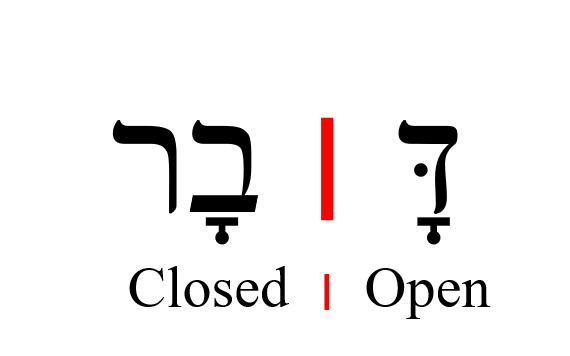

We see the two basic concepts at play in this simple word (pronounced "da-var" and means word, matter, thing):

* The two syllables each begin with a consonant and have one vowel
    * דָּ starts with the consonant Dalet and has one vowel, Qamets
      * This is also an example of an "open" syllable - open syllables end with a _vowel_, not a consonant
    * בָר starts with the consonant Bet and has one vowel, also a Qamets
      * This is an example of a "closed" syllable - closed syllables end with a _consonant_, not a vowel 
* If you need to know how many syllables are in a Hebrew word, count the vowels
    * Remember that vowel letters, such as the Hiriq-Yod, and Diphthongs we will see later in this lesson, count as a single vowel unit

## Hebrew Word Accents {#accents}

::: {.infobox .light}
* Most frequently, Hebrew words are accented on the last syllable  
* If not, then the accent will be on the next-to-last syllable<small>^[<small>Later in the course, we will learn about a mark called a maqqef, which is like a hyphen in English.  In Hebrew, the word to the right of the maqqef technically does not have an accent.</small>]</small>
* Reduced vowels and Sheva never take an accent. If there is a word-final Sheva, the accent will be on the next-to-last syllable 
:::

Unlike English, Biblical Hebrew words are never stressed anywhere else<small>^[<small>Modern Hebrew has words (mostly borrowed from other languages) that don't always follow this rule</small>]</small>.

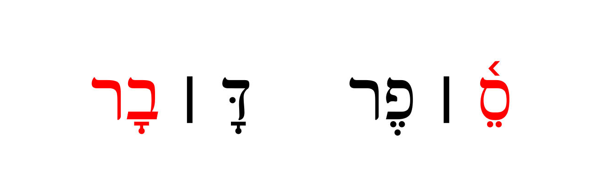

* The word on the left is stressed on the last syllable
* The word on the right (pronounced "SAY-pher" and means book, scroll, or document) is stressed on the next to last syllable
    * Some texts will place a mark over the syllable to be stressed (except when it is on the last syllable)<small>^[<small>Hebrew has a very elaborate system of [cantillation marks](https://en.wikipedia.org/wiki/Hebrew_cantillation){target="_blank"} that also serve to indicate where the accent of the word is. are used for chanting and singing.  A study of these marks is beyond the scope of this book.</small>]</small>

### Tonic, Pretonic, and Propretonic Syllables {-}

* We will encounter specific terms for a syllable's position respective to the word's accent
* Let's use the plural of דָּבָר to illustrate: דְּ ׀ בָ ׀ רִים
    * The **Propretonic** syllable is two (or more) steps away from the accent = דְּ
        * Notice how the vowel changed from the Qamets in דָּבָר to a Vocal Shewa in דְּבָרִים
        * This vowel shortening of the propretonic syllable is called _Propretonic Reduction_ and is extremely common in Hebrew
        * Qamets and Tsere will become Sheva (or hateph patach/hateph seghol)
    * The **Pretonic** Syllable is the syllable immediately before the accented syllable = בָ
    * The **Tonic** syllable is the one with the accent = רִים<small>^[<small) If there is a syllable AFTER the accented syllable, technically it is called "Posttonic," but you will not reencounter this term for the remainder of this course.  </small>]</small>
    
### Ultima, Penultima, and Antepenultima syllables {-}

Since the accent is not always in a fixed location, we sometimes will use other words that describes a syllable's position irrespective of the accent. 

  * _ultima_ = the last syllable
  * _penultima_ = the next to last syllable
  * _antepenultima_ = the syllable(s) before the _penultima_
  

## Rules for Silent Sheva {#s_sheva}

Learn the three rules for differentiating a SILENT Sheva from a Vocal Sheva:

### A Sheva is SILENT when the previous vowel is short: {-}

### A Sheva is SILENT when the first of two consecutive Shevas _within a word_: {-}

### A Sheva is SILENT when at the end of a word: {-}

## Rules for Vocal Sheva {#v_sheva}

Learn the four rules for differentiating a VOCAL Sheva from a Silent Sheva

### A Sheva is VOCAL when the initial Sheva in a word: {-}

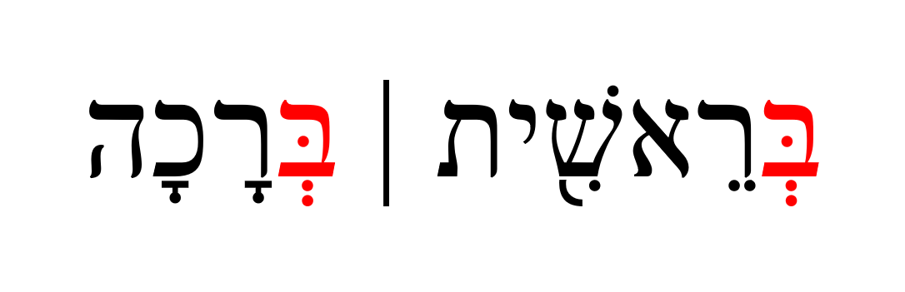

### A Sheva is VOCAL when the second of two consecutive Shevas _within a word_<small>^[<small>A Sheva at the **end** of a word is **always silent**, even when it is the second of two consecutive Shevas.</small>]</small>:  {-}

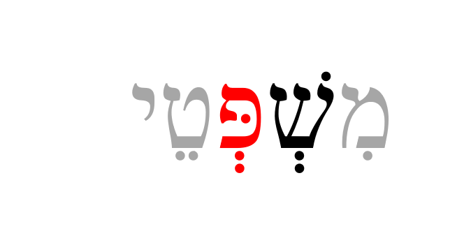

### A Sheva is VOCAL when under a Daghesh Forte: {-}

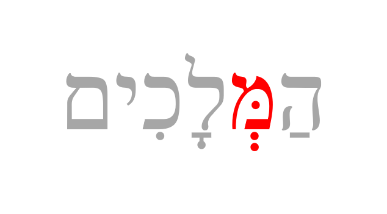

### A Sheva is VOCAL after an unaccented long vowel: {-}

This one may seem random, but it is relatively common with _long_ vowels in a propretonic position<small>^[<small>These vowels often but do not always reduce (see section 3.6). Unchangeable long vowels will never reduce.</small>]</small>  The word above is not kōṯ-vim but kō-ṯᵉ-vîm.

## Hebrew Diphthong = Accented Patach-Yod-Hiriq {#diphthong}

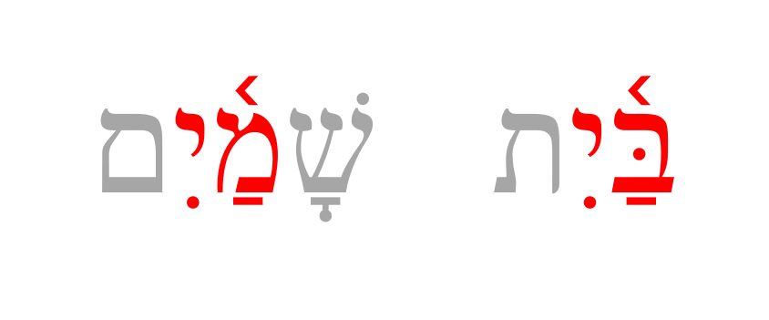

::: {.infobox .light} 
The diphthong is a single vowel unit, which means it is only one syllable
:::

We do not pronounce as "BUY-it", but monosyllabic, like "BITE"<small>^[<small>With this said, "buy" it makes a handy mnemonic for remembering this word means 'house', as there are a few look-alike words.</small>]</small>; and not "sh-MAY-im" but it sounds more like "sh-MIME"

*****

Qamets-Yod-Vav is another Diphthong that you'll see in Lesson 9.  It's the pronoun suffix endings for "his" or "him". 

* אֵלָיו (to him) pronounced 'eLAV.
* פָּנָיו (his face) pronounced paNAV

There is scholarly disagreement as to whether (vowel)+Yod are vowel letters or diphthongs.  <u>Basics of Biblical Hebrew</u> treats them as vowel letters.

## Vowels and Syllable Preference {#vowel_pref}

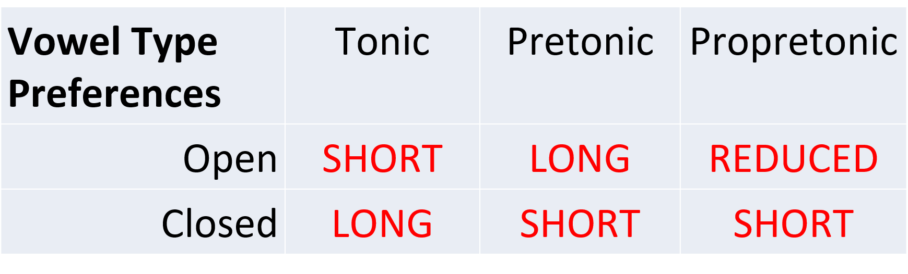

This table may seem like minutiae, but do yourself a favor: memorize it, noting the following:

* *In an open pretonic syllable, Hebrew REQUIRES a long vowel.
* *In a closed unaccented syllable, Hebrew REQUIRES a short vowel.
* **Open/Propretonic _must_ reduce from a long vowel to Vocal Sheva (or Hateph if guttural), _except_ when there is an unchangeable long vowel
  * Go back and look at דָּבָר and דְּבָרִים
    * The vowel preference table explains why the vowel under the Dalet changes from Qamets in the open pretonic to Vocal Shewa (reduced vowel) in the open propretonic when the plural suffix "im" is added
    * This is called "_propretonic reduction_" - you will encounter this topic frequently.   
  * As we saw with כֹּתְבִים, uunchangeable long vowels written "defectively" will not reduce - at their essence, they are still unchangable.

## Qamets Hatuf, Furtive Patach, Quiescent Alef {#misc_vowels}

These are three miscellaneous but straightforward rules.

::: {.infobox .light} 
Qamets Hatuf ONLY occurs in a Closed AND Unaccented syllable

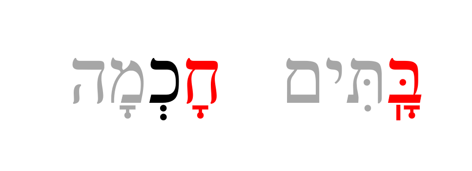
:::

There are many instances where the vowel could be a short qamets-hatuf vowel in a closed syllable, or the long Qamets, A-class vowel in an open syllable.  When this ambiguity occurs, many printings will print a vertical line called a meteg בָּֽ.  The meteg tells you the vowel is the **long, a-class**

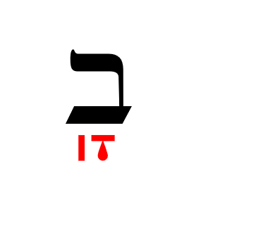

*****

::: {.infobox .light} 
Furtive Patach under final ח or ע is said BEFORE the guttural letter and is not a full vowel

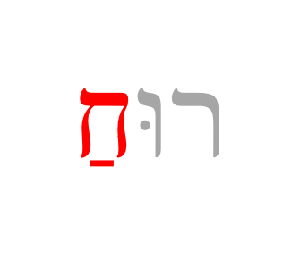
:::

The Furtive Patach is a significant exception to just about everything else we've discussed related to vowels and syllabification:
  * The vowel is pronounced *before* the guttural - so the above word is **Ruach** not "rucha"
  * The Furtive Patach is not a full vowel and is counted in syllabification - so the above word is **Ruach** not "ru-ach"

*****

::: {.infobox .light} 
Quiescent Aleph is silent, neither a consonant nor a vowel

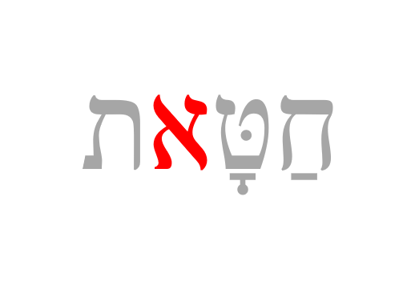
:::

* When you see an Aleph with no vowels, it is acting as a silent letter
    * English has all kinds of silent letters, like the 'p' in receipt - the Quiescent Aleph works the same way
    * In terms of syllabification, the Aleph is neither a vowel nor a consonant, so it doesn't count at all - it is just an extra letter
    
## Lesson Conclusion and Activities {-}

Congratulations on getting this far! We realize that there are a lot of heavy concepts you face in this Lesson.

Some of you may try to read this lesson then do the Anki work (perhaps repeated a few times), and you still aren't getting it.  The Fog isn't clearing.  If this is the case, and you want a more in-depth lecture covering this material, we recommend [Dr. John Beckman's hour-long YouTube Lecture on lesson 3](https://www.youtube.com/watch?v=AY7KAsD4fZg&feature=youtu.be){target="_blank"}

For this lesson, we are introducing two new activities that correspond with the official launch of `Vocabulary` and `Study Verses` you will see in `Anki`.

### Introduction to Video Warm-ups {-}

* On the next two pages are videos of the vocabulary words and then the study verses
* Practice speaking the word/verses aloud, following along with Izzy 
* You may not know what the words mean yet, and that's fine (that's where Anki comes in)
* Consider this some "syllabic stretching" before you do your full Anki workout!

Then after watching these, go ahead and jump into `Anki`.

* `Lesson 03 A.Vocab` - This is our first lesson with the <u>Basics of Biblical Hebrew</u> vocabulary list.
* `Lesson 03 B.Grammar` - This module will reinforce and expand on the Seven Practical Points for this lesson.
* `Lesson 03 C.Verses`
  * This is also the verse lesson using the <u>Basics of Biblical Hebrew</u> study verses.
  * The translation may be difficult at first. It may take you several attempts before you can select `Good` without using the `Hints`.
  * Be patient and stick with it - you'll get it!

## `Word Warm-up` {-}

[Click to open `Word Warm-up` video in a new tab](https://youtu.be/WBDxQB-ix4g){target="_blank"}

<iframe width="768" height="432" src="https://www.youtube.com/embed/WBDxQB-ix4g" frameborder="0" allow="accelerometer; autoplay; clipboard-write; encrypted-media; gyroscope; picture-in-picture" allowfullscreen></iframe>

## `Verses Warm-up` {-}

* Over the entire 35-lesson course, you will learn to translate almost 500 Hebrew Verses.  The greatest journey begins with a single step.  You are now about to take that step!
        
[Click to open `Verses Warm-up` video in a new tab](https://youtu.be/HhnKPxKvUcE){target="_blank"}

<iframe width="768" height="432" src="https://www.youtube.com/embed/HhnKPxKvUcE" frameborder="0" allow="accelerometer; autoplay; clipboard-write; encrypted-media; gyroscope; picture-in-picture" allowfullscreen></iframe>

  
## `Ruth Pursuit` {-}        

### Your Quest: {-}

1. Identify all examples of the Tetragrammaton, which we pronounce "Adonai" when we encounter it in Scripture.  There are six instances of the Name. (Blue)
2. In verse 16, highlight, "עַמֵּךְ עַמִּי וֵאלֹהַיִךְ אֱלֹהָי" in green. This is the famous verse, "your people (will be) my people, and your God, my God."  One of your vocabulary words is אֱלֹהִים. In the last two words of what you just highlighted, you can still see the core portion of אֱלֹהִים present.  Begin to notice how Hebrew uses different suffixes to denote "your" and "my."
3. In verse 1, find one Sheva that begins a word and one Sheva that concludes a word.  Which one is a silent Sheva, and which one is the vocal Sheva?
4. Find the quiescent Aleph in verse 1 (pink)
5. Find the Hebrew words for Judah, Moab, and Bethlehem in Verse 1. (gray).  Bethlehem is two separate words in Hebrew. The first word has a single-letter preposition (מ) that means "from."
6. For personal reflection, open an English translation side-by-side with your Hebrew version of Ruth 1.  Note how the foreigner Ruth uses both אֱלֹהִים and the Tetragrammaton in verses 16 and 17, respectively.  Why do you think this might be? Would you say the names are used interchangeably, or do you think there is a deeper purpose?  May we always seek HIM, just as you have done in this activity!

* [Blank copy of Ruth 1](https://drive.google.com/file/d/1qcfTKAlTJGChC2eYCMhSbY2w-ibzCcDV/view?usp=sharing){target="_blank"}
* [Ruth Pursuit Answer Key #3](https://drive.google.com/file/d/1GybopWuWjBP-WpgabhwN6B1h_Yz4uXmt/view?usp=sharing){target="_blank"}

## `Quest Quiz` {-}

[Open Quest Quiz #3 in a new window](https://docs.google.com/forms/d/e/1FAIpQLSfCy3m3L8z1a5EjEMtEBVWjoci-JvWfYzUVEIpnQHIgGwvu1g/viewform){target="_blank"}

<iframe src="https://docs.google.com/forms/d/e/1FAIpQLSfCy3m3L8z1a5EjEMtEBVWjoci-JvWfYzUVEIpnQHIgGwvu1g/viewform?embedded=true" width="800" height="600" frameborder="0" marginheight="0" marginwidth="0"></iframe>

<!--chapter:end:03-Syllabification.Rmd-->

# (PART) Nouns, Prepositions, Pronouns {-}

# Hebrew Nouns {.Nouns}

> In order to comprehend Biblical Hebrew, we must understand how nouns are formed, how they are pluralized, and how to look words up in a dictionary.

Nouns consist of a person, place, thing, or idea and can be singular or plural.  Hebrew also introduces the concept of "gender".  In this lesson we will review aspects of the Hebrew noun with specific attention focused on the rules of pluralization.

::: {.infobox .map}
**Seven Practical Points for Lesson 4**

1. Understand Noun Gender and Number
2. Examine singular noun endings and "endingless" nouns for both Masculine and Feminine nouns
3. Examine endings for plural and dual nouns
4. Identify special dual forms
6. Examine other/irregular Pluralization
7. Describe the Rule of Sheva
1. Define what is meant by "Lexical Form"
:::

::: {.infobox .stop}
Before continuing, can you describe the following concepts?

* Vowel and syllable preference
* The rules for Silent Sheva and Vocal Sheva
:::

Additionally, starting with this lesson we will invoke the shorthand we've been learning in Anki (e.g. MP = Masculine Plural, FS = Feminine singular).

**Parsing vs Inflecting:** Many Hebrew grammar books expect students to know how to pluralize nouns in writing. This is called inflecting.  Inflecting is when we take a base word and do something with it, such as change its gender or number.  When those books get to verbs, they spend a lot of effort focused on taking a base verb and inflecting it into all the different forms (person, gender, number, active, passive, reflexive, and so forth).  _Parsing_ is somewhat of the opposite concept where you take an inflected word and break it down into its base form.

Reading the Hebrew Bible does not require you to inflect a noun or a verb; however, reading the Bible **does** require you to parse a word. 

This is so that you are able identify the lexical form and understand what the word means means (or if you don't know what it means, how to look it up in a dictionary).

Our objective with Hebrew GRAMMAR Quest is only that you know how to parse words. Beginning with this lesson you will see an `Anki` chapter called `Workbook`, which will have some activities like parsing. The ability to inflect **IS** a great skill to have to master the language.  If you wish to dig deeper and get into inflecting, we encourage you to check out <u>Basics of Biblical Hebrew</u> or another suitable textbook or workbook.

## First Thought {-}

### רְאֵה לִמַּדְתִּי אֶתְכֶם חֻקִּים וּמִשְׁפָּטִים {-}

*See, I have taught you statutes and judgments (Deuteronomy 4:5)*

Give thanks to God for His Word and ask that you never depart from His commands

<figure>
    <figcaption>Listen to the verse in Hebrew:</figcaption>
    <audio
        controls controlsList="nodownload"
        src="./images/04.deu0405.mp3">
            Your browser does not support the
            <code>audio</code> element.
    </audio>
</figure>

*****

(\#fig:unnamed-chunk-39)Capernaum and Mount of Beatitudes - suggested location of Yeshua's teachings we call 'the Sermon on the Mount' (Matthew 5-7). Courtesy of the [Pictorial Library of Bible Lands](https://www.bibleplaces.com)

## Gender and Number {#gender_number}

All Hebrew nouns have Gender and Number. 

* Gender
    * The "gender" sometimes does, but usually does not, have anything to do with biologic gender.  
    * סֵ֫פֶר is masculine (M), while תּוֹרָה  is feminine (F). There is nothing inherently masculine about books nor feminine about laws or instructions
    * The gender of a noun never changes
    
* Number
    * A noun is either singular (S), plural (P), or less frequently, dual (D)
        * Dual is exactly two of something
        * Apart from the words "pair" or "both", English doesn't have too many dual forms
        * In Hebrew, typically paired body parts are in the dual form
    * The number of a noun CAN change
    * A word's ending indicates the number
    
Verbs, will introduce "person".  Collectively, when you see "PGN" in grammar, this refers to "person, gender, number"; e.g. "3MS" means "3rd person, masculine, singualr".

## Singular Noun Endings {#sing_noun_endings}

* Singular
    * Masculine singular (MS): generally are "endingless" (but all MS are endingless and not all endingless are MS); occasionally a MS noun may end in (accented) ה ֶ֫
    * The following words are examples of FS endings:
        * תּוֹרָה (Most common)
        * בַּת 
        * תִּפְאֶ֫רֶת  (glory)
        * בְּרִית (covenant)
        * מַלְכּוּת (kingdom)
        * אֶ֫רֶץ (land - endingless, but feminine - less common)<small>^[<small>Not all endingless nouns are MS.  Some common words are endingless but are classified as FS: אֶ֫רֶץ (land), עִיר (city), and אֶ֫בֶן (stone). When this occurs, most vocabulary lists will mark the word as "(F)".</small>]</small>
        
::: {.box .info}
Some students fall into a habit of thinking every word-final ה is feminine.  Remember ה ֶ֫  is masculine
:::

## Plural and Dual Noun Endings {#noun_pluralization}

For regular nouns, simply remove the singular ending if there is one, and add the plural ending.

* Plural endings:
    * MP: ים ִ e.g.  סוּסִים 
        * דָּבָר becomes דְּבָרִים
        * עָנָן becomes עֲנָנִים (clouds)
        * כּוֹכָב becomes כּוֹכָבִים

    * FP: וֹת e.g. מְלָכוֹת (queens)
        * תּוֹרָה becomes תּוֹרוֹת 

Under the MP endings above, note the propretonic reduction when the original word is more the one syllable. As we saw in Lesson 3.2, דְּבָרִים changes from דָבָר because an open propretonic syllable prefers a reduced vowel. 

*   A vowel under a non-Guttural will reduce to Vocal Shewa - דְּבָרִים
*   A vowel under a guttural will take a Hateph vowel, usually Hateph Patach - עֲנָנִים
*   An irreducible long vowel will not reduce - כּוֹכָבִים 

* Dual endings:
    * MD: יִם ַ e.g. סוּסַ֫יִם (two horses)
    * FD: יִם ַ  e.g., יָדַ֫יִם (two hands) or תַ֫יִם ָ as in תּוֹרָתַ֫יִם (two laws).

Occasionally, we will see defective spelling of the plural and dual endings: סוּסִם תּוֹרֹת

## Special dual forms {#dual_forms}

Hebrew has three common words that have the dual ending but are usually translated as singular.

* שַׁמַ֫יִם heaven, sky (sometimes "heavens")
* מִצְרַ֫יִם Egypt
* מַ֫יִם water (sometimes "waters")
* פָּנִים face

## Irregular Pluralization  {#irregular_pluralization}

* Hebrew does have a handful of irregular nouns.  For example you won't find נִשִׁים in a dictionary.  So if you need to know the singular form, אִשָּׁה
* Rather than a detailed discussion on what is going on with the plural forms (and honestly, scholars don't really know why a word like אָבוֹת looks like a feminine word), it's easier to memorize these eight most common pairs:

| S   | Def      | P     | Def.      |
|-----|----------|-------|-----------|
| אִישׁ | man      | אֲנָשִׁים | men       |
| אִשָּׁה | woman    | נָשִׁים  | women     |
| עִיר | city     | עָרִים  | cities    |
| אָב  | father   | אָבוֹת  | fathers   |
| בַּ֫יִת | house    | בָּתִּים  | houses    |
| בַּת  | daughter | בָּנוֹת  | daughters |
| בֵּן  | son      | בָּנִים  | sons      |
| יוֹם | day      | יָמִים  | day       |

An important note is that the plural forms still retain the gender of their singular noun.  אָבוֹת is still masculine,  and נָשִׁים is still feminine, despite the plural endings.

::: {.box .info}
When you see an _internal_ (not word-final) tsere+yod, as in בָּתִּים, the vowel pattern in the 'original' word was likely the accented-patach-yod-hiriq diphthong, as in בַּ֫יִת.
:::

The next two categories of irregular words are more straightforward:

### Segholate Nouns follow a standard vowel pattern when pluralizing {-}

You may have noticed something interesting about the words, דֶּ֫רֶךְ  and סֵ֫פֶר . The Two syllable nouns where the accent is on the first syllable are classified as _Segholate_ nouns.  They get this name because frequently, though not always, there are two Seghol vowels. נַ֫עַר  (boy, youth) is a segholate noun even though it doesn't have any Seghol vowels.

::: {.box .info}
If a plural word has Vocal Sheva/Hateph under the first consonant and Qamets under the second, with the normal MP or FP ending, the word is likely a Segholate noun.
:::

* מֶ֫לֶךְ to מְלָכִים
* סֵ֫פֶר to סְפָרִים
* נַ֫עַר to נְעָרִים

### Geminate words take a Daghesh Forte {-}

_Geminate_ (from the Latin for "twins") words appear to have two visible letters (which we call "biconsonantal"), but at one point the second consonant appeared twice.  Example עַם (people) was once *עמם.
The lexical form drops the extra consonant.

::: {.box .info}
When we pluralize a Geminate word, the "twin" letter "reappears" but as a Daghesh Forte instead of a consonant.  So in our example, עַם becomes עַמִּים (peoples).
:::

The reason we don't have a Daghesh Forte in עַם is that **the last consonant of a word rejects the Daghesh Forte when it has no vowel.**

## Rule of Sheva {#rules_sheva}

Sometimes, according to other rules of grammar, we end up with a scenario where we have two reduced vowels, such as two vocal sheva, back to back.  However, an overarching facet of Hebrew is that two reduced vowels in a row cannot stand.  

::: {.box .light}
The Rule of Sheva changes the first of two reduced vowels into the corresponding short vowel.
The first of two contiguous Vocal Sheva will usually change to a Hireq.  
:::

* Note the unique situation when the second consonant is a Yod:
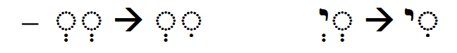

These next two could be called "Hateph copy-cat" rules.  Notice how the vowel under the first consonant in all six examples takes on the short-vowel equivalent of the hateph vowel:

* A hateph vowel under a "G"uttural that is followed by a Vocal Sheva will change to the short vowel in the same class (e.g. hateph patach to patach)
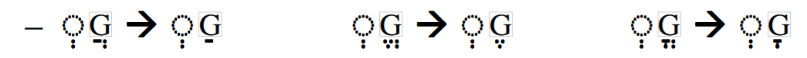
* A Vocal Sheva that is followed by a hateph vowel will change to the short-vowel in the same class as the hateph vowel.  
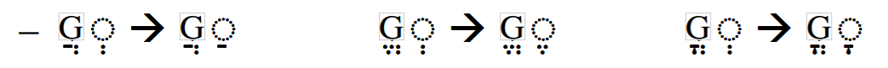
When a prefix is added to אלֹהִים. and the Tetragramaton the vowel changes are irregular:

* With אלֹהִים the aleph becomes quiescent after a prefix:
    * אלֹהִים + לְ = לֵאלֹהִים
* With the Tetragramaton, the prefixed letter with take a Patach, with nothing under the Yod:
    *  בַיהוָה

To flip around the Rule of Sheva, suppose as you are reading, you encounter a syllable that begins with a _short_ vowel followed by a reduced vowel.  In that case, you may be looking at a grammatical scenario where there were originally been two reduced vowels.

You may be wondering why you need to know this.  Understanding that a syllable may have "originally" had a reduced vowel is an important clue when it comes to translating and parsing.  If you're 'foggy' now, hang in there.  It will make sense in a bit!

## Lexical Form {#lexical_form}

The Lexical Form is the dictionary version of the word.

English examples:
* "Oxen" may not be its own entry, but you would find it under "Ox"
* You may not find "went", but you would find "go"

Hebrew dictionaries (called "Lexicons" in academia) work the same way.

For nouns, the Lexical Form is the SINGULAR version of the noun.  Below is how to go from a plural noun to the singular, Lexical form (assuming you didn't already know the singular Lexical Form):

1. Drop the plural or dual ending
2. Perhaps add a singular ending
3. For Geiminate nouns, drop the Dagesh Forte when it lacks a vowel
4. Often change vowels if no singular ending - reduced vowels often become regular vowels but vowel letters do not change

## `Word Warm-up` {-}

[Click to open `Word Warm-up` video in a new tab](https://youtu.be/n9HYIqqvA0I){target="_blank"}

<iframe width="768" height="432" src="https://www.youtube.com/embed/n9HYIqqvA0I" frameborder="0" allow="accelerometer; autoplay; clipboard-write; encrypted-media; gyroscope; picture-in-picture" allowfullscreen></iframe>

## `Verses Warm-up` {-}

[Click to open `Verses Warm-up` video in a new tab](https://youtu.be/89pLvO3wg6s){target="_blank"}

<iframe width="768" height="432" src="https://www.youtube.com/embed/89pLvO3wg6s" frameborder="0" allow="accelerometer; autoplay; clipboard-write; encrypted-media; gyroscope; picture-in-picture" allowfullscreen></iframe>

## `Anki` {-}

* `Lesson 04 A. Vocab`
* `Lesson 04 B. Grammar` 
* `Lesson 04 C. Workbook`
    * With Lesson 4, we are gradually increasing the depth of work in `Anki`
    * The `Workbook` will have short activities such as translation examples of concepts taught in the lesson and word "parsing"
    * When we parse a Hebrew word, we identify three things:
        * the Person (if applicable), Number and Gender of the word
        * the Lexical form
        * the definition of the original word
    * For example if the instruction is to parse שִׁירִים  , we would respond with: "MP שִׁיר  Songs"
    * You may not know every word -
        * **That is the point of this exercise!**  
        * As you read your Hebrew Bible, you will invariably come across words you don't know.  
        * You will need to be able to break down a word into its Lexical form so you can look it up
        * In the [appendix](#lexicon), we have links to some lexicons (dictionaries) you may use with this course.  You can download an abridged version [here](./images/BBH_Lexicon.pdf){target="_blank"} 
    * As we continue to advance, future lessons will incorporate additional aspects into our parsing activities such as verb conjugation.
* `Lesson 04 D. Verses`
    * We will continue with study verses that provide examples of the Lesson's vocabulary
    * Hints will be provided for less familiar verbs

## `Ruth Pursuit` {-}        

### Your Quest: {-}

1. find one regular singular segholate noun in V1.  In this verse there is also a segholate noun with a propositional prefix that we haven't studied yet; this world also takes on vowel changes but we'll cover that in a few lessons. (yellow)
2. find a regular masculine plural in v1 - This work has the definite article, which we will cover in the next lesson.  Also find a regular Feminine plural in vs 1-4 (pink).  What do you think the Lexical Form of this feminine word is?
3. find an irregular plural somewhere in vs 2-6 (green)
4. find an example of the "Rule of Sheva" in verses 10-13 (blue)

* [Blank copy of Ruth 1](https://drive.google.com/file/d/1qcfTKAlTJGChC2eYCMhSbY2w-ibzCcDV/view?usp=sharing){target="_blank"}
* [Ruth Pursuit Answer Key #04](./images/04_Ruth_Pursuit_KEY.pdf){target="_blank"}

## `Quest Quiz` {-}

[Open Quest Quiz #04 in a new window](https://forms.gle/2LCEgvmpHr5mqB5Z6){target="_blank"}

<iframe src="https://forms.gle/2LCEgvmpHr5mqB5Z6" width="800" height="600" frameborder="0" marginheight="0" marginwidth="0"></iframe>

<!--chapter:end:04-NounsPlural.Rmd-->

# Definite Article and Conjunction Vav {.Article}

> In order to comprehend Biblical Hebrew, we must be able to identify the definite article and the conjunction Vav whenever we see them in a word.

As we say often, our focus with Hebrew GRAMMAR Quest is not on writing Biblical Hebrew, but in _comprehending_ Biblical Hebrew.  In this lesson, the sections that deal with meaning are more important than those that deal with the specific spelling<small>^[<small>In contrast, _Basics of Biblical Hebrew_ places significant emphasizes on learning the spelling rules. This is not wrong; it is just not our approach.</small>]</small> 

It is unlikely you will ever need to write the article or the conjunction with the correct vowel. We discuss these spelling details, as well as have some Anki work in these areas, because it is important to know how to recognize them in the Bible when you encounter them.

::: {.infobox}
**Seven Practical Points for Lesson 5**

1. Translate the Vav conjunction
2. Identify the Vav conjunction
3. Understand why the Daghesh Forte is important (even when it's not there)
4. Translate The article 
5. Identify the article
6. Understand the concepts of definiteness vs indefiniteness in Hebrew
7. Discuss what makes a noun definite
:::

## First Thought {-}

Give thanks to the Creator for the beauty and precision of His creation

> (Isaiah 40:12 NASB)'Who has measured the waters in the hollow of His hand, And marked off the heavens'  
מִי־מָדַד בְּשָׁעֳלוֹ מַיִם וְשָׁמַיִם

<figure>
    <figcaption>Listen to the verse in Hebrew:</figcaption>
    <audio
        controls controlsList="nodownload"
        src="./images/05.isa0412.mp3">
            Your browser does not support the
            <code>audio</code> element.
    </audio>
</figure>

*****

(\#fig:unnamed-chunk-43)Mount of Beatitudes hillside reflecting the beauty of the Galilee region. Courtesy of the [Pictorial Library of Bible Lands](https://www.bibleplaces.com)

## Equipment Check {-}

Before continuing, can you describe the following concepts?

* Identifying the lexical form of a noun
* The "rule of Sheva", including what happens in different combinations of two contiguous reduced vowels
* How vowels can shift when the number of syllables changes
* The masculine and feminine plural endings

## Translate the Vav Conjunction {#vav_translate}

The Vav conjunction serves _many_ different purposes in Hebrew.  Some of these can be translated into English, but others are more like "stage directions" in a play.

When translating (or not) the Vav, it is very important to make sure it fits the context.  Admittedly, this is a challenge for us as we are just learning Hebrew Grammar, but it is important to keep this in mind. Most often, it simply means "and".  Other options include: then, and then, but, also, even, together with, that is.

As you advance in Hebrew, you will enjoy seeing how the authors employ the Vav at the beginning of a sentence or clause to evoke different meanings.

* For example, when added to a verb, it often indicates a advancing the narrative.  It also has a special use on a verb (depending on the vowel) of changing the verb's aspect.  We'll address that in Chapter 17.
* When added to a non-verb it is often those stage directions we mentioned: a contrast, a scene shift, or a parenthetical comment. 

Many times, it makes the most sense in English to leave the Vav untranslated.  For example, suppose you read and translate the story of David and Goliath in 1 Samuel 17.  You would discover that nearly every sentence would begin with "and".  In English, we would consider these "run-on" sentences.  What is exciting about the Hebrew, and this passage in particular, is that the reader can feel the sense of tension and action building in the narrative by the use of the Vav.

## Identify the Vav Conjunction {#vav_identify}

* The Vav conjunction is usually וְ prefixed to a word
* You will see וּ before  במפ - remember "BuMP"- this is the ONLY time a vowel will ever begin a syllable
    * The ב and פ will lose their Daghesh Lene 
        * It's בֵּן, (between), but it's וּבֵן (and between)
    * The conjunction will also be וּ before a consonant that has a Sheva
* You may see וָ before some accented syllables (remember the Vowel-Syllable preferences)
* The Rule of Sheva that we studied in Lesson 4 applies when וְ is prefixed to a word beginning with a reduced vowel (Vocal Sheva or Hateph vowel)

How to tell the difference between the conjunction and words that start with ו?

99.99% of the time **any Vav or Shureq as the first letter of a word is the conjunction Vav.**

* Only 10 words start with Vav, and only two occur more than once
    * וָו means "hook" and  וָוִים means "hooks - occurs 13 times in Exodus 26-38 in reference to the Tabernacle
    * וַשְׁתִּי - Queen Vashti - occurs only in the book of Esther

## Loss of Daghesh Forte {#loss_daghesh_forte}

We've been referencing the Daghesh Forte in almost every Lesson of this course.  Now we're about to meet it face to face as we discuss the Hebrew Article. 

We like to think of the Daghesh Forte as your friend.  When you see it, it is Hebrew's way of saying "pay attention; something's different."

As we've discussed, sometimes the Daghesh Forte gets rejected from time to time (everybody say "awwww.")  We've discussed two of those already:

1. It is ALWAYS rejected by the Gutturals and Resh (2.7)
2. It is ALWAYS rejected when it would go inside the last consonant of a word when it has no vowel (4.5)

Now we add a third.  This one is very technical, so please don't worry if you don't understand this at first.

3. There is a group of consonants that SOMETIMES rejects the Daghesh Forte, but *only* when those consonants have a Sheva
    * They are called the _SQiN eM LeVY_ letters
        * S - שׂשׁסצ the sibilants (letters that make an S sound)
        * Q - ק
        * N - נ
        * M - מ
        * L - ל
        * V - ו
        * Y - י
        

If you're expecting a Daghesh Forte and there isn't one, look to see if the next letter has a SQiN eM LeVY letter with a Sheva.  

See [this handout](./images/05_sqin_em_levy.pdf){target="_blank"} for additional discussion on SQiN eM LeVY consonants.

## Translate the Article {#article_translate}

In English, we have two "Indefinite Articles" = "a" or "an", and one "Definite" article = "the".  Hebrew just has one article for definiteness (so we just call it the "Article").

The Article has many translations: "the", "this", "o" (as in "O king"), "his", "her", "my".

הַיּוֹם is literally "the day", however a better translation is "today", or sometimes "this day".

It can make an adjective superlative: הַתּוֹב is literally "the good", but can mean "the best".

## Identify the Article {#article_identify}

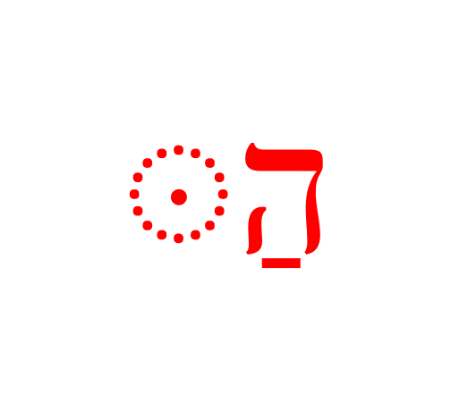

The usual form is Hei with a patach and a Daghesh Forte in the next letter.

As we've been saying, some unusual things can happen when the letter following the ה rejects the Daghesh Forte:

* ּ הַ becomes simply הַ (no Daghesh Forte):
    * Before SQiN eM LeVY with a Sheva
    * Before a ח or another ה (see הֶ note below)- this is called "Virtual doubling"<small>^[<small>Or, as Dr. Van Pelt likes to say "virtually NO DOUBLING, because nothing changes."</small>]</small>
* Becomes הָ (no daghesh forte and patach lengthens to Qamets):
    * Before א ע ר or הָ֫ - 
        * This is called "Compensatory Lengthening", and is quite common with these gutturals.  (see note below)
* Becomes הֶ (no Daghesh Forte and a Seghol instead of a Patach):
    * Before accented or unaccented חָ, or unaccented הָ or עָ

Once again, the goal is not to memorize the alternate forms as much as recognize that they exist.  ּ הַ is the one you need to memorize.

::: {.infobox}
COMPENSATORY LENGTHENING

* In Compensatory Lengthening, a short vowel _lengthens_ to become a long vowel to _compensate_ for the loss of a Dagesh Forte (or sometimes a vowel) in the following consonant
    * Patach will lengthen to Qamets
    * Hireq will lengthen to Tsere
    * Qibbuts will lengthen to Holem
* Compensatory Lengthening can occur in ANY letter that precedes a Daghesh Forte-rejecting Guttural or Resh...but it does not _always_ occur
* Compensatory Lengthening can also occur in a Quiescent Aleph that rejects a Sheva.
* When SQiN eM LeVY consonants reject the Daghesh, there is NEVER compensatory lengthening.
* Sometimes there is no change to the preceding vowel - this is called "virtual doubling" as discussed above.
::: 

## Hebrew Indefiniteness {#indefiniteness}

Hebrew (and Greek) lacks an indefinite article.  

A word without the Article is indefinite.

Occasionally you will see "one" - אַחַת אֶהַר to indicate indefiniteness

## Hebrew Definiteness {#definiteness}

The Article is not the only way Hebrew indicates definiteness

An individual's name and most proper nouns are definite by definition.  דָּוִד is definite.  You will never see: הַדָּוִד . On the other hand names of people groups and some geographic features often take the article. הַיַּרְדֵּנ = the Jordan River.

A word with a pronominal suffix is definite, since the suffix indicates possession, and possession is definite. See Lesson 9.

A word in its construct state is definite when the last word in the construct chain is definite. See Lesson 10.

## Lesson Conclusion and Activities {-}

You made it through another lesson!  Way to go!  Even though we only studied two concepts - the word for "and" and the word for "the", you can see how even with these concepts there is a lot more going on.  We were introduced to several technical aspects in this lesson, such as "SQiN eM LeVY" and "Compensatory Lengthening".

You may be noticing how each new lesson builds upon the previous ones. If something isn't fully making sense, or if you find yourself asking "why in the world do I need to know this?", just be patient and it should start to come together in a lesson or two.  Now might also be a good time to look back and see how far you have come in just five lessons.

As far as activities, we have the warm-up videos, Anki, the Ruth Pursuit and the Quest Quiz. When you finish all of that, we have our second `Twelve Tribes Badge` you can claim.

Take your time and let the simple, but not so simple, concepts in this chapter sink in.  You're about half-way through "non-verbs" portion of the course.  Lessons 6-10 will be continuing to build out sentences with prepositions, adjectives and pronouns.  Then we'll take a little bit of a break with numbers in Lesson 11, before we move on to verbs.

Keep with it; you're doing great!

## `Word Warm-up` {-}

[Click to open `Word Warm-up` video in a new tab](https://youtu.be/fYwaA5f-XGc){target="_blank"}

<iframe width="768" height="432" src="https://youtu.be/fYwaA5f-XGc" frameborder="0" allow="accelerometer; autoplay; clipboard-write; encrypted-media; gyroscope; picture-in-picture" allowfullscreen></iframe>

## `Verses Warm-up` {-}

[Click to open `Verses Warm-up` video in a new tab](){target="_blank"}

<iframe width="768" height="432" src="" frameborder="0" allow="accelerometer; autoplay; clipboard-write; encrypted-media; gyroscope; picture-in-picture" allowfullscreen></iframe>

## `Anki` {-}

* `Lesson 05 A. Vocab`
* `Lesson 05 B. Grammar` 
* `Lesson 05 C. Workbook`
    * In this activity, we will have very short passages of scripture that illustrate the definite article and the Vav conjunction.
    * Make sure you look up any words you do not know.  See the [appendix](#lexicon) for links to some lexicons (dictionaries) you may use with this course.  You can download an abridged version [here](./images/BBH_Lexicon.pdf){target="_blank"}.
* `Lesson 05 D. Verses`

## `Ruth Pursuit` {-}        

### Your Quest: {-}

1. Find five examples of the conjunction vav: וְ (note the Vocal Sheva) (Yellow)
2. find five examples of the standard definite article ּ  הַ (Green)
3. Find the first three examples of "Compensatory Lengthening" of the definite article.  There is one example of "Virtual Doubling" of the definite article in verses 10-15.  Can you find it?(Light Blue)
4. הִנֵה is a very common Biblical expression that meaans, "look!" or "behold". Find the one example of הִנֵה in Ruth 1 (Pink)

* [Blank copy of Ruth 1](https://drive.google.com/file/d/1qcfTKAlTJGChC2eYCMhSbY2w-ibzCcDV/view?usp=sharing){target="_blank"}
* [Ruth Pursuit Answer Key #05](./images/05_Ruth_Pursuit_KEY.pdf){target="_blank"}

## `Quest Quiz` {-}

[Open Quest Quiz #05 in a new window](https://forms.gle/NsrAS9XKMbtLToW1A){target="_blank"}

<iframe src="https://forms.gle/NsrAS9XKMbtLToW1A" width="800" height="600" frameborder="2" marginheight="0" marginwidth="0"></iframe>

## Claim your next `Twelve Tribes Badge`! {-}

Check to be sure you have have completed **all activities** through this lesson, then fill out the form below.

[Check to be sure you have completed all ACTIVities here](https://forms.gle/vgjsvL4QNMXzkcAE6){target="_blank"}, complete the certification below, and your badge will be on its way!

<iframe src="https://forms.gle/vgjsvL4QNMXzkcAE6" width="640" height="691" frameborder="0" marginheight="0" marginwidth="0"></iframe>

<!--chapter:end:05-DefArt_Conjunction.Rmd-->

# Hebrew Prepositions

> In order to comprehend Biblical Hebrew, we must be able to identify prepositions as we read the Text.

Prepositions give us space and context.  Given that much of the Tanach is narrative, prepositions are on almost every page that we read as the authors describe the events to us.  There is one Hebrew word, מִן, that is classified as a preposition but depending on the context can convey a wide array of meanings. 

::: {.infobox}
**Seven Practical Points for Lesson 6**

1. Recognize that a Nun with Silent Sheva becomes a Daghesh Forte
2. Describe Independent and Maqqef prepositions
3. Define Inseparable prepositions
4. Identify when a word with an inseparable preposition also has the definite article
5. Understand how מִן is constructed
6. Define how מִן is used
7. Identify the Definite Direct Object (DDO) marker
:::

## First Thought {-}

Meditate and celebrate that the Lord is in the midst of our troubles.

> (Psalms 77:3 NASB) In the day of my trouble I sought the Lord  
בְּיוֹם צָרָתִי אֲדֹנָי דָּרָשְׁתִּי

<figure>
    <figcaption>Listen to the verse in Hebrew:</figcaption>
    <audio
        controls controlsList="nodownload"
        src="./images/06.ps7702.mp3">
            Your browser does not support the
            <code>audio</code> element.
    </audio>
</figure>

*****

(\#fig:unnamed-chunk-47)Mt. Precipice in Nazareth - likely location of Luke 4:29 when the townsfolk wanted to throw Yeshua off the cliff. Courtesy of the [Pictorial Library of Bible Lands](https://www.bibleplaces.com)

## Equipment Check {-}

Before continuing, can you describe the following concepts?

* The construction of the definite article, including what happens when the Daghesh Forte is rejected
* The construction of the Vav conjunction
* How Hebrew handles indefinite words

## Nun with Silent Sheva Becomes Daghesh Forte

You may be wondering what this has to do with prepositions, but stick with us.  It will make sense by the end of the lesson!

Nun is considered a "weak letter" and it has a tendency to drop out of a word under certain scenarios. When the nun appears with a SILENT sheva נְ (or no vowel at all) is one of those times.  You remember how we said that the Daghesh Forte is your friend, because it tells you that something has changed?  When then nun drops, whenever possible it will be replaced with a Daghesh Forte.  The technical term for this is called "assimilation".   To get back to the original/lexical form we would substitute the Daghesh Forte for the nun+sheva

מִנְזָהָב* > מִזָּהָב

This is why we spend time talking about when the Daghesh Forte might get rejected.  Do you remember the three times we have studied where the Daghesh Forte may be rejected?  

* Gutturals and Resh (may be compensatory lengthening)
* At the end of a word (may be compensatory lengthening)
* With a SQiN eM LeVY with a Sheva: מִנְקְצֵה* > מִקְּצֵה* > מִקְצֵה (will never be compensatory lengthening)

## Independent and Maqqef prepositions 

Prepositions explains the relationship between its object and something else.
 There are three different types of Hebrew prepositions: independent, Maqqef, and inseparable. 

An _independent_ preposition is a separate word with a space before it and after it.

The preposition comes first, followed by its object (just like English).

* Most Hebrew prepositions are written this way. – E.g.,  תַּחַת אֹתוֹ
* English prepositions are written this way. – E.g., Under it

Maqqef is the Hebrew word for dash.  They are nearly identical in meaning and appearance except the Hebrew Maqqef is raised ־ whereas the English is middle -.  Like the dash when used to join two words, the Maqqef lets us know that two words are closely connected grammatically.

In a _Maqqef_ preposition, the Maqqef connects a preposition to its object. Again, the preposition comes first.

עָל־מֶלֶךְ

English prepositions are NOT written this way.  You would never see "on-a-king."

You may see the same preposition written both with and without the Maqqef.  The meaning does not change.  עַל מֶלֶךְ means the same as עַל־מֶלֶךְ

In addition to prepositions we sometimes see the maqqef joining a verb and it's subject. One notable aspect about the Maqqef is that the word loses its accent.  The fowel that loses its accent may change.

## Inseparable prepositions

Like וְ for the word "and", an inseparable preposition is a one-letter prefix that is affixed to its object. 

Three Hebrew prepositions are **ALWAYS** written this way, usually with a Vocal Sheva under the prepositional letter:

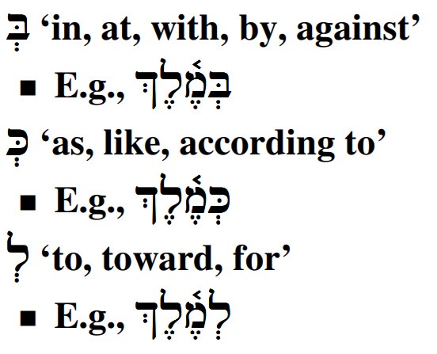

A mnemonic to remember these three inseparable prepositions is "buckle"

The first word of the Bible contains an inseparable preposition: בְּרֵאשִׁית = "In (the) beginning".

In the lexical form of these prepositions, there is a vocal sheva vowel under the "buckle" consonant.  If there is a Sheva or Hateph vowel in the next letter, the Rules of Sheva come into play.  Review Lesson 4 if you need to.

* Before another vocal Sheva, the preposition usually takes a Hireq
* Before a Guttural with a Hateph vowel, the preposition takes the corresponding short vowel
* Note the names of God again receive special treatment: לֵאלֹהִים and לַיהוָה

## The Article and Inseparable Prepositions

Words with both an inseparable preposition AND the article undergo a type of contraction.  The one-letter preposition replaces the ה of the article. The vowel under the preposition and the daghesh forte (if it is there) are your clues that the word is definite.

For example, note how we would spell "in the field":

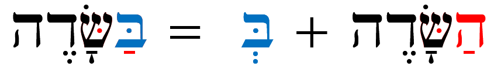

For words that keep the pathach and daghesh forte of the article, it is straightforward to determine the article.  The challenge comes when the next letter rejects the Daghesh Forte.

Here's how to tell whether there is the article or not:

* NO ARTICLE if there is a Sheva under the preposition - the article never takes a Sheva
* NO ARTICLE if the short vowel under the preposition can be explained by the Rules of Sheva: אֲנָשִׁים + לְ = לַאֲנָשִׁים - for men, (not 'for the men')
* ARTICLE if vowel under the preposition is not Sheva and can NOT be explain by the Rule of Sheva: לַהֵיכָל = for THE temple

Some situations will be ambiguous; the context will guide us.

## The flexible מִן: construction

There is one preposition that is unique: מִן

It can be a Maqqef preposition, as in: מִן־זָהָב, or it can be an inseparable preposition: מִזָּהָב.  Both mean "from gold." The reason we led of this Lesson with a discussion on "nun with a silent sheva" is because this is what is happening with מִן when it is an inseparable preposition.  The nun assimilates into the following consonant, becoming a Daghesh Forte.

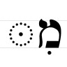

Unlike the regular inseparable prepositions, the ה of the article is retained: מֶהָאָ֫רֶץ = from the land.

As we know well by know, the Gutturals and Resh reject the Daghesh Forte:

* א צ ה ר have compensatory lengthening so the Hireq becomes Tsere.
* ח has virtual doubling, which as we remember means "virtually no doubling" in that the vowel under the מ remains a Hireq

## The flexible מִן: meanings 

The most direct meaning is "from" - מִזָּהָב from gold; but, it also can have comparative and superlative meanings depending on the context.

* טוֹבָה חָכְמָה מִזָּהָב = wisdom is better *than* gold
* קָשָׁה הָעֲבֹדָה מֵהָאֲנָשִׁים = the work is too difficult *for* the men
* עָרוּם מִכֹּל חַיַּת הַשָֹּדֶה ּ = the most clever living thing *of all* the field
* מֵהָאֲנָשִׁים may mean "*some* *of* the men" (lit. from the men)

Other uses: 'because', 'by', 'without', 'even', 'namely'.

This is a word that takes practice to appreciate the various nuanced meanings.

## The Definite Direct Object marker 

Hebrew has an untranslated word that is often used to mark a direct object that is definite.

Spelled תֵא (independent) or תֶא־ (Maqqef)- the challenge can be that this is the same spelling as the preposition "with".

We see the definite direct object marker (often abbreviated DDO) twice in the first verse of the Bible:

בְּרֵאשִׁית בָּרָא אֱלֹהִים *אֵת* הַשָּׁמַיִם *וְאֵת* הָאָרֶץ

## Review and Activities {-}

How are you feeling so far?  Is any component of "the fog" refusing to dissipate? Keep sticking with `Anki` and try to do your reviews at least once daily.

To help with this, we've gone a little bit lighter on the Grammar cards and the Ruth Pursuit for Lesson 6.  While there are some differences, prepositions are used much the same way in Hebrew as they are in English.  There is no sense in creating a lot of busy work.

We would recommend using the time between now and starting Lesson 7 to get caught up and make sure the new concepts start to take hold.  You might notice the intensity pick up starting with the next lesson as we get into some ways Hebrew handles adjectives and pronouns.  Until then, enjoy learning some more of God's work with Izzy in the `Word warm-up`, `Verse warm-up`, and `Anki`.

### `Anki` {-}

* `Lesson 06 A. Vocab`
* `Lesson 06 B. Grammar` 
* `Lesson 06 C. Workbook`
    *     * In this activity, we will have very short passages of scripture that illustrate prepositions.
    * Make sure you look up any words you do not know.  See the [appendix](#lexicon) for links to some lexicons (dictionaries) you may use with this course.  You can download an abridged version [here](./images/BBH_Lexicon.pdf){target="_blank"}.
* `Lesson 06 D. Verses`

## `Word Warm-up` {-}

[Click to open `Word Warm-up` video in a new tab](https://youtu.be/P-oZ1J6ZyBc){target="_blank"}

<iframe width="768" height="432" src="https://youtu.be/P-oZ1J6ZyBc" frameborder="0" allow="accelerometer; autoplay; clipboard-write; encrypted-media; gyroscope; picture-in-picture" allowfullscreen></iframe>

## `Verses Warm-up` {-}

[Click to open `Verses Warm-up` video in a new tab](){target="_blank"}

<iframe width="768" height="432" src="https://youtu.be/z4QY0pMdPsA" frameborder="0" allow="accelerometer; autoplay; clipboard-write; encrypted-media; gyroscope; picture-in-picture" allowfullscreen></iframe>

## `Ruth Pursuit` {-}        

### Your Quest: {-}

1. Find examples of the three inseparable prepositions (Yellow)
2. Find examples of מִן , one Maqqef and one inseparable (Green)
3. Find the DDO (Maqqef) (Blue)

* [Blank copy of Ruth 1](https://drive.google.com/file/d/1qcfTKAlTJGChC2eYCMhSbY2w-ibzCcDV/view?usp=sharing){target="_blank"}
* [Ruth Pursuit Answer Key #06](./images/06_Ruth_Pursuit_KEY.pdf){target="_blank"}

## `Quest Quiz` {-}

[Open Quest Quiz #06 in a new window](https://forms.gle/oeB8E6K4y4mTjPWGA){target="_blank"}

<iframe src="https://forms.gle/oeB8E6K4y4mTjPWGA" width="800" height="600" frameborder="2" marginheight="0" marginwidth="0"></iframe>

<!--chapter:end:06-Prepositions.Rmd-->

# Hebrew Adjectives

> To comprehend Biblical Hebrew, we must be able to identify and translate an adjective based on its usage, gender, and number

::: {.infobox}
**Seven Practical Points for Lesson 7**

1. Understand how an adjective relates to the noun it is modifying
1. Define and identify Substantival se
1. Define and identify Attributive use
1. Define and identify Predicative use
1. Determine the appropriate adjectival use in a passage
1. Define the function of the Mappiq and differentiate it from Daghesh marks
1. Recognize the Directional Ending and differentiate it from the vowel ה ָ
:::

## First Thought {-}

Offer a word of gratitude that HaShem has made you beautiful!

> (Ecclesiastes 3:11 NASB) He has made everything appropriate (beautiful) in its time.  
אֶת־הַכֹּל עָשָׂה יָפֶה בְעִתּוֹ

<figure>
    <figcaption>Listen to the verse in Hebrew:</figcaption>
    <audio
        controls controlsList="nodownload"
        src="./images/07.ecc0311.mp3">
            Your browser does not support the
            <code>audio</code> element.
    </audio>
</figure>

*****

(\#fig:unnamed-chunk-52)Tabgha - suggested location of Yeshua's restoration (making beautiful) of Shimon Kefa (Peter) on the beach in John 21, following Peter's denial of Yeshua a few days earlier. Courtesy of the [Pictorial Library of Bible Lands](https://www.bibleplaces.com)

## Equipment Check {-}

Before continuing, can you describe the following concepts?

* Inseparable prepositions with and without the definite article
* Construction and meaning of מִן, including assimilation of the נ

## Inflecting Adjectives

Adjective inflection is relatively straight-forward.

We will use the paradigm word טוֹב to illustrate

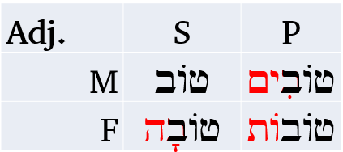

1. An adjective is either masculine or feminine
2. An adjective is either singular or plural (dual nouns take plural adjectives)
3. An adjective will match the gender and number of the noun that it modifies or for which it substitutes
    * Note that for irregular nouns, the adjective will not necessarily match the exact ending
    * נָשִׁים טוֹבוֹת - even though "נָשִׁים" has the irregular -im ending, the adjective טוֹבוֹת remains the regular feminine plural
4. An adjectives will use expected endings

Unlike nouns, adjectives can inflect across genders in order to match the respective gender of the noun.  

The Lexical Form of an adjective is the MS.  MS is usually endingless but can be seghol hei as in יָפֶה, which is MS for pleasing, beautiful.

Note that unlike טוֹב, most adjectives undergo vowel changes when the inflectional endings are added.  The good news is you already know this, because it is the same for adjectives as it is for nouns.

Perhaps a bit more foreign (unless you were an English major) are the concepts of Substantival, Attributive and Predicative uses of the adjective.  We use these forms in English all the time but you probably don't call them by these names.  Let's look at each one.

## Substantival Use

In the Substantival use, the adjective acts as a noun. We could say the "Substantiv Substitutes" for a noun. 

Perhaps an obvious example of this from pop culture is the film, "The Good, The Bad, and The Ugly."  The three words, "good", "bad" and "ugly" are adjectives being used as nouns.  In a sense the noun is implied.  It could be the "good ones" or the "bad man".

The Substantival use in Hebrew is relatively easy to identify.  You will see an adjective but there will be no related noun that matches in gender and number.

הַטּוֹבָה - "the good" (feminine singular something). So depending on the context it could be "the good woman", or a feminine object like "the good Torah."

If there were a noun that matches Gender and Number, then this would not be a Substantival use.

## Attributive Use

The Attributive use is usually what we think of with respect to adjectives. The adjective modifies and describes a noun. "The good book" is an example of the Attributive use.

Hebrew makes it much easier to identify the Attributive use.  The adjective MUST come AFTER the noun it modifies, and it MUST match in definiteness - meaning either both the noun and the adjective have the definite article or they both will not have the article.

In fact, there is an easy mnemonic we can use: **A**ttributive **A**fter noun, **A**rticle **A**grees

* הָאִשָּׁה הָטּוֹבָה - the good woman
* אִשָּׁה טוֹבָה - a good woman (or "the woman is good"-predicate use; see next section)

## Predicative Use

The Predicative use (often called the predicate use) asserts something about the noun. The noun is the subject and the adjective is the predicate of the sentence: "The book is good."

The Predicative use is more flexible than the Attributive, in that the adjective can be either before or after the noun.  One way to differentiate it from the Attributive use is the Predicative use WILL NOT have the Article.

So a similar mnemonic could be: **P**redicative de**P**rived of the article; **P**erhaps **P**rior

All of the options below can mean "the woman is good":

* טוֹבָה הָאִשָּׁה
* הָאִשָּׁה טוֹבָה
* טוֹבָה אִשָּׁה
* אִשָּׁה טוֹבָה (or "attributative")

As this illustrates, the only time there can be any ambiguity between Attributative and Predicative is when the adjective follows the noun and both are indefinite.  In these situations, we need to let context determine the use.

## Adjective Use Summary

Here is a decision tree:

* Is the adjective modifying a noun?
    * No - *Substantival*
    * Yes - does the adjective have the article?
        * Yes - *Attributive* (Predicate dePrived of Article)
        * No - is the adjective before the noun?
            * Yes - *Predicate* (Attributive Always After)
            * No - Potentially ambiguous when both noun and following adjective are indefinite: Predicate or Attributive depending on context

## The Mappiq 

The Mappiq is a mark that looks exactly like a Daghesh, but it ONLY is found in a word-final Hei (a Hei that is the final letter of a word).

It is virtually impossible to confuse a Daghesh and a Mappiq because ה can never take a Daghesh.

A word-final ה is always a vowel unless it has a mappiq (הּ).

The mappiq is a sign that the breathy sound of the consonantal hei should be accentuated slightly.

At the end of a word:

ה ָ  - "aaw"(long A sound)
הּ ָ  - "ahh"(breathy)

## The Directional Ending 

We've studied the fact that the ה ָ  is the Feminine Singular ending.  We now need to refine this definition slightly.  An ACCENTED ה ָ  is the FS ending; however, an UNACCENTED ה ָ  is known as a "directional ending".  It is used to indicate motion towards or to, whatever the noun is.

Common examples:

* אַ֫רְצָה - to/toward a land
* הָעִ֫ירָה - to/toward the city

Note that אֶל־הָאָ֫רֶץ and אַ֫רְצָה are essentially synonymous.

## `Word Warm-up` {-}

[Click to open `Word Warm-up` video in a new tab](https://youtu.be/8GIYqACoOcQ){target="_blank"}

<iframe width="768" height="432" src="https://youtu.be/8GIYqACoOcQ" frameborder="0" allow="accelerometer; autoplay; clipboard-write; encrypted-media; gyroscope; picture-in-picture" allowfullscreen></iframe>

## `Verses Warm-up` {-}

[Click to open `Verses Warm-up` video in a new tab](https://youtu.be/s0JvZ9z0jAg){target="_blank"}

<iframe width="768" height="432" src="https://youtu.be/s0JvZ9z0jAg" frameborder="0" allow="accelerometer; autoplay; clipboard-write; encrypted-media; gyroscope; picture-in-picture" allowfullscreen></iframe>

## `Anki` {-}

* `Lesson 07 A. Vocab`
* `Lesson 07 B. Grammar` 
* `Lesson 07 C. Workbook`
    * In this activity, we will have very short passages of scripture that illustrate adjectives, including examples of attributive and predicate use
    * Be sure to look up any words you do not know.  
* `Lesson 07 D. Verses`

## `Worksheets`: NameOfWorksheet {-}

<describe the worksheet>

[Name of worksheet](){target="_blank"}

## `Ruth Pursuit` {-}        

### Your Quest: {-}

1. Instruction#1 (Yellow)
2. Instruction#2 (Green)
3. Instruction3 (Light Blue)
4. Instruction4 (Pink)
5. Instruction5 (Light Grey)
6. Instruction6 (Red) <!--Try to use darker colors sparingly -->
7. instruction7 (Blue)

* [Blank copy of Ruth 1](https://drive.google.com/file/d/1qcfTKAlTJGChC2eYCMhSbY2w-ibzCcDV/view?usp=sharing){target="_blank"}
* [Ruth Pursuit Answer Key #7](){target="_blank"}

## `Quest Quiz` {-}

[Open Quest Quiz #07 in a new window](){target="_blank"}

<iframe src="" width="800" height="600" frameborder="2" marginheight="0" marginwidth="0"></iframe>

## Claim your next `Twelve Tribes Badge`! {-}

Check to be sure you have have completed **all activities** through this lesson, then fill out the form below.

[Check to be sure you have completed all ACTIVities here](){target="_blank"}, complete the certification below, and your badge will be on its way!

<iframe src="" width="640" height="691" frameborder="0" marginheight="0" marginwidth="0"></iframe>

<!--chapter:end:07-Adjectives.Rmd-->

# Hebrew Pronouns

> In order to comprehend Biblical Hebrew, we must be able to know pronouns with gender, number and person 

Pronouns are essentially a language's shorthand so we don't have to keep repeating nouns (because saying all of those nouns over and over can really wear you down).

As such, this is an important chapter.  If you want to understand what you're reading, you will need a firm grasp of pronouns to help decipher what is happening in the narrative.

::: {.infobox}
**Seven Practical Points for Lesson 8**

1. Independent Personal Pronoun
2. Relative Pronoun
3. Interrogative Pronoun
4. Interrogative Particle
5. Near and Far Demonstratives
6. Demonstrative Adjective
7. Demonstrative Pronoun
:::

## First Thoughts {-}

Pray that you continually walk in His way, not your own way

> (Isaiah 30:21 NASB) This is the way, walk in it  
זֶה הַדֶּרֶךְ לְכוּ בוֹ

<figure>
    <figcaption>Listen to the verse in Hebrew:</figcaption>
    <audio
        controls controlsList="nodownload"
        src="./images/08.is3021.mp3">
            Your browser does not support the
            <code>audio</code> element.
    </audio>
</figure>

*****

(\#fig:unnamed-chunk-55)Sea of Galilee and Plain of Gennesaret. Yeshua likely walked through the valley below on His way from Nazareth to Capernaum. Courtesy of the [Pictorial Library of Bible Lands](https://www.bibleplaces.com)

## Equipment Check {-}

Before continuing, can you describe the following concepts?

*

## Independent Personal Pronoun

Independent personal pronouns are _always_ subjects, meaning they are equivalent to I, you, she, he, it and they in English (NOT me, my, her, him, his)

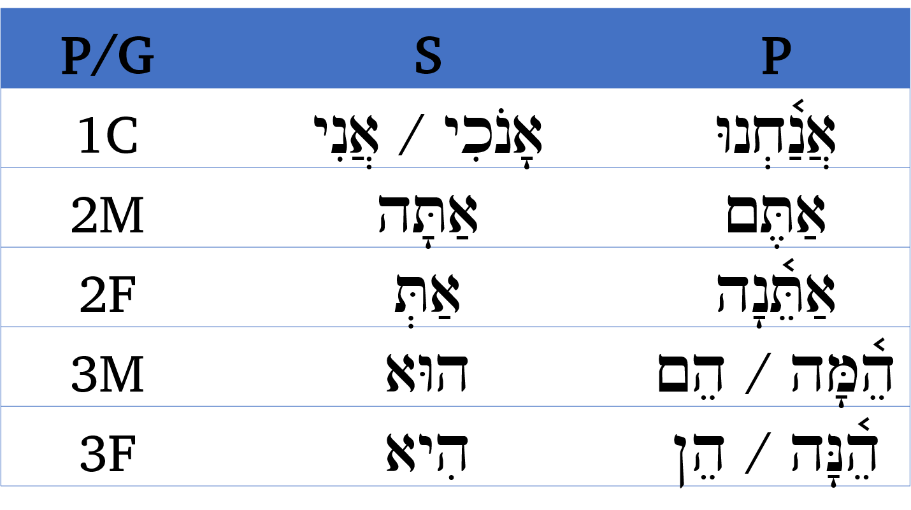

You will work to memorize these in `Anki`.

Notes:

* This is the first time we are officially using all three elements of Person, Gender and Number.  3MS is shorthand for Person = 3rd Person, Gender = Masculine, Number=Singular
* For 1st person, Hebrew, like English, does not distinguish between gender in the first person.  A woman says "I" and a man says "I"
    * אָנֹכִי is considered more formal or emphatic.  It is often translated, "I, myself"
* Note the following memory aids:
    * All 1st person pronouns begin with אנ
    * All 2 begin with accented אַתּ֫ - note the Daghesh Forte
    * All 3 begin with accented ה֫
    * All MP end with either מָה or ם. Think "monks" since men are monks
    * All FP end with either נָה or ן. Think "nuns" since women are nuns
    * Who is he? He is she.
* Do not confuse אַתָּה (you 2MS) with עַתָּה (now)
    
## Relative Pronoun אֲשֶׁר

* Hebrew has one general-purpose relative pronoun
* אֲשֶׁר is a vocabulary word for this lesson
* This word does not inflect/the spelling never changes
* It can refer to people (who) or things (that), subjectively (who) or objectively (whom)

Example Deuteronomy 1:1

> אֵלֶּה הַדְּבָרִים *אֲשֶׁר* דִּבֶּר מֹשֶׁה

These are the words *that* Moses spoke

## Interrogative Pronoun

* מִי = who ("Who, me?")
* מָה = what (think of your mom questioning you, "What, ma?")
    * Can also be written as Maqqef - note the vowel shortens מַה־
*   לָמָה = why
    * Remember the familiar verse "אֵלִ֣י אֵ֖לִי לָמָ֣ה עֲזַבְתָּ֑נִי " - My God, my God, WHY have you forsaken me?

Usually these words will appear at the beginning of a clause

## Interrogative Particle הֲ

English has a question mark at the end of a sentence. Hebrew has what is called an interrogative particle at the BEGINNING of a sentence that asks a yes/no question.

Questions that ask who? what? or why? will use the interrogative pronouns.

### Interrogative Particle vs Definite Article {-}

In most cases you will not have trouble differentiating the Article from the Interrogative Particle.  Below are potential sources of ambiguity:

* 1st word of a clause before חָ֫,חָ, הָ, עָ   = both are הֶ
* 1st word of a clause before ה, ח without Qamets or SQiN eM LeVY with Sheva = both are הַ

In these situations, you guessed it, you will need to let context determine whether a question is being asked.  With lots of reading practice, this will get easier.  Just know that the Definite Article is about **300X more common**.

## Near and Far Demonstratives

In English, the near demonstratives are this and these. The far demonstratives are that and those.  Think of "this right here" and "those, over there".

Hebrew has three words to indicate nearness.  We already learned the words to indicate distance - they are the same as the subject pronouns.

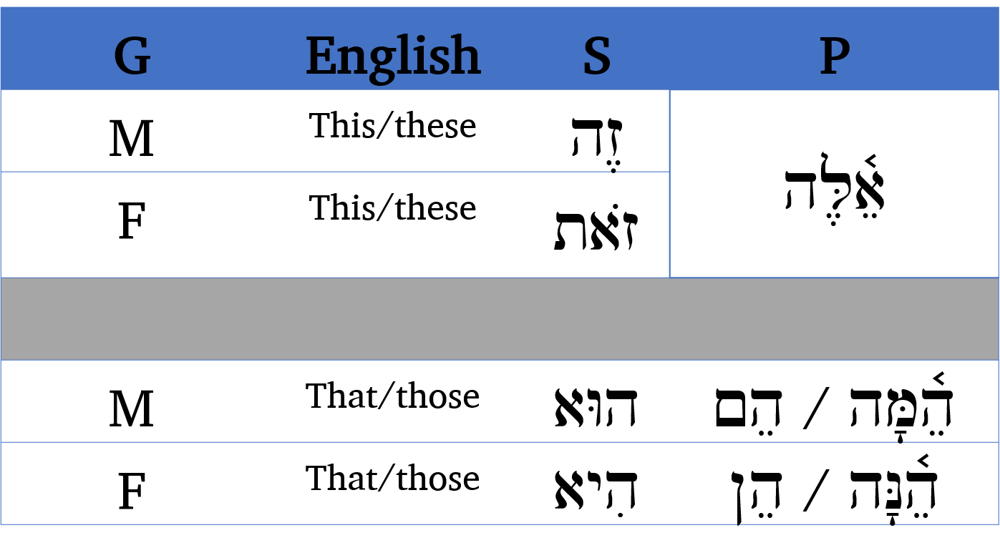

## Demonstrative Adjective 

Demonstratives act as adjectives or as pronouns.

A demonstrative adjective modifies a noun just as an attributive adjective does.  These daughters.

The behavior is a lot like the Attributive use: 

* Always comes after the noun (Dem Adjective Always After)
* Always has the article (Dem. Adjective Always Article)
* Always matches in Gender and Number
    * הָאִשָּׁה הַזֹּאת = this woman (FS)
    * הָאֲנָשִׁים הָהֵם  = those men (MP)

Mnemonic: 

> Demonstrative Adjective Always After noun, Always has Article

## Demonstrative Pronoun

A demonstrative pronoun takes the place of a noun as the subject of a clause.  This is her daughter.

The behavior is a lot like the Predicative use: 

* Always comes before the noun (Pronoun Perpetually Precedes)
* Does NOT have the article (Pronoun dePrived of article)
* Matches Gender and Number
    * זֹאת הַמַּלְכָּה  = this is the queen (FS)
    * זֶה הַמֶּ֫לֶךְ = this is the king (MS)
    
Mnemonic:

> Demonstrative Pronoun Perpetually Precedes, Perpetually dePrived of article

## Conclusion and Intro to Activities {-}

Your mission for the next two lessons is to focus on building your pronoun vocabulary.  You may notice more `Anki` words than usual to learn but most of these are short (and for next lesson, the pronouns will mostly be two letters each).  After you finish the stack in `Anki` we have two pronoun worksheets for you to test your memory.

It is important to know the gender, number, and where necessary the person of each.  Also the concept of multiple ways to say "you" can be confusing to the English speaker.  It's important to give the PGN, for example אַתֵּ֫נָה means "you (2FP)."

If you can picture yourself hiking the trails of Israel,  Lessons 8, 9, and 10 may represent some hills where you may need to push a little bit extra.  Then we'll get a bit of a breather with Lessons 11 and 12 before ramping up again with Verbs.  Keep at it!  You're doing awesome!

## `Word Warm-up` {-}

[Click to open `Word Warm-up` video in a new tab](https://youtu.be/8GIYqACoOcQ){target="_blank"}

<iframe width="768" height="432" src="https://youtu.be/8GIYqACoOcQ" frameborder="0" allow="accelerometer; autoplay; clipboard-write; encrypted-media; gyroscope; picture-in-picture" allowfullscreen></iframe>

## `Verses Warm-up` {-}

[Click to open `Verses Warm-up` video in a new tab](https://youtu.be/XXn6G8EWmn0){target="_blank"}

<iframe width="768" height="432" src="https://youtu.be/XXn6G8EWmn0" frameborder="0" allow="accelerometer; autoplay; clipboard-write; encrypted-media; gyroscope; picture-in-picture" allowfullscreen></iframe>

## `Anki` {-}

* `Lesson 08 A. Vocab`
* `Lesson 08 B. Grammar` 
* `Lesson 08 C. Workbook`
    * In this activity, we will have very short passages of scripture that illustrate pronouns
* `Lesson 08 D. Verses`

## `Worksheets`: Pronouns {-}

We have two worksheets for this lesson. Make sure you do the Anki work first, before tackling these worksheets.

While our focus is on reading Hebrew, pronouns are so prevalent that it's highly beneficial to commit them to memory.  Review the column on the right, then cover it up and try to complete the remaining columns by memory (right to left).

1. [Subject Personal Pronouns](./images/08_subject_paradigm.pdf){target="_blank"}
2. [Demonstrative Pronouns](./images/08_demonstrative_paradigm.pdf){target="_blank"}

## `Ruth Pursuit` {-}        

### Your Quest: {-}

1. Instruction#1 (Yellow)
2. Instruction#2 (Green)
3. Instruction3 (Light Blue)
4. Instruction4 (Pink)
5. Instruction5 (Light Grey)
6. Instruction6 (Red) <!--Try to use darker colors sparingly -->
7. instruction7 (Blue)

* [Blank copy of Ruth 1](https://drive.google.com/file/d/1qcfTKAlTJGChC2eYCMhSbY2w-ibzCcDV/view?usp=sharing){target="_blank"}
* [Ruth Pursuit Answer Key #8](){target="_blank"}

## `Quest Quiz` {-}

[Open Quest Quiz #8 in a new window](){target="_blank"}

<iframe src="" width="800" height="600" frameborder="2" marginheight="0" marginwidth="0"></iframe>

<!--chapter:end:08-Pronouns.Rmd-->

# Hebrew Pronominal Suffixes

> In order to comprehend Biblical Hebrew, we must be able to translate a noun or preposition with a pronominal suffix

::: {.infobox}
**Seven Practical Points for Lesson 9**

1.  Understand the meaning of pronominal suffixes
2.  Define Type 1 vs Type 2 suffixes
3.  Differentiate Type 1 from Type 2
4.  Identify the Lexical Form of a Noun with a Type 1 Suffix
5.  Identify the Lexical Form of a Noun with a Type 2 Suffix
6.  Recognize unusual changes with pronominal suffixes
7.  Identify look-alike words involving pronominal suffixes
:::

## First Thoughts {-}

In addition to offering up our petitions, let us be sure to listen for God's questions

> (Genesis 43:7) This man heavily questioned us and our kindred  
וַיֹּאמְרוּ שָׁאוֹל שָׁאַל־הָאִישׁ לָנוּ וּלְמוֹלַדְתֵּנוּ

<figure>
    <figcaption>Listen to the verse in Hebrew:</figcaption>
    <audio
        controls controlsList="nodownload"
        src="./images/09.gen4327.mp3">
            Your browser does not support the
            <code>audio</code> element.
    </audio>
</figure>

*****

(\#fig:unnamed-chunk-59)Banias waterfall. Region of Caesarea Philippi where Yeshua asked a very important question, 'who do YOU say that I am?'. Courtesy of the [Pictorial Library of Bible Lands](https://www.bibleplaces.com)

## Equipment Check {-}

Before continuing, can you describe the following concepts?

*

## Meaning

On a noun, a pronominal suffix indicates the one who owns or is related to the noun:  His books / her houses / their house / our father

On a preposition, the suffix indicates the object: to her / with them / behind him / in front of it

Verbs also take pronominal suffixes.  We will study these in Lesson 19.

Pronominal suffixes have *gender*, *number*, and *person*.

Pronominal suffixes are further divided into two types.  

* There is a set of suffixes that is used on singular nouns, which we call **Type 1** suffixes
    * Keep in mind there are both plural and singular Type 1 suffixes for use on singular nouns
    * Multiple people can have ownership of a single object
    * In English we would say "His house" and Their house"
* There is a second set for use on plural nouns called **Type 2**
    * Similar to above, there are both singular and plural type 2 suffixes for use on plural nouns
    * "his houses" as well as "their houses"
* Type on a preposition means nothing in terms of translation; each preposition will only take one class or the other

## Type 1 vs Type 2 Suffixes

Below are the Type 1 suffixes.  You will use `Anki` to commit these to memory.

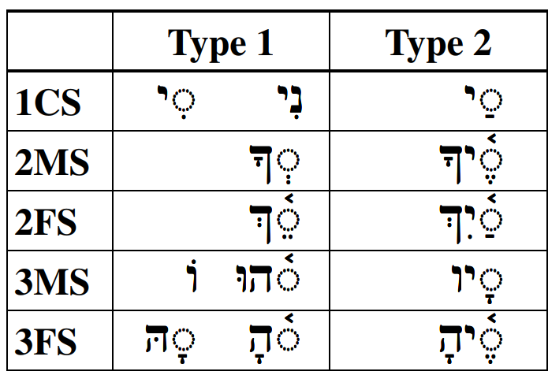

* 1CS end with י
* 2MS/2FS end with ך
* Not all 3M/3F have ה but every ה is 3M/3F

Below are the Type 2 suffixes
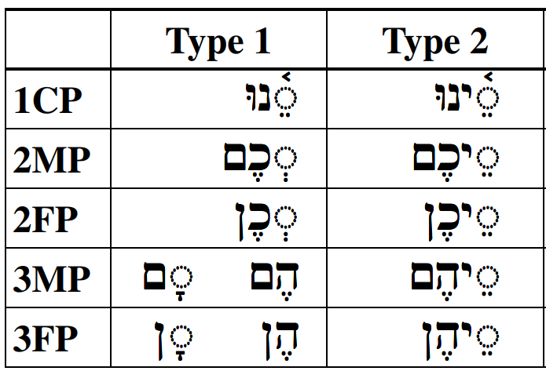

* 1CP ends with נוּ
* 2MP/2FP have כ
* Not all 3M/3F have ה but every ה is 3M/3F
* 2MP/3MP has מָה or ם ('monks')
* 2FP/3FP has נָה or ן ('nuns')

## Tell Type 1 apart from Type 2

Look at the chart below with the two types side-by-side.

> Type 2 **always** contains vowel + yod, but **not** hiriq + yod  
Type 1 **never** contains yod, **unless* it's hiriq+yod

This simple rule plus the tips on the previous page about patters in gender and number should make it easier to identify the pronominal suffix.

When you encounter a word with a suffix, always start by asking "is there a vowel + yod, that is not hiriq + yod?"

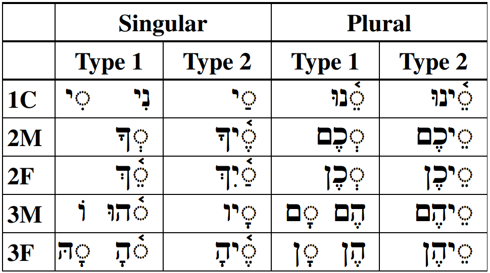

## Lexical Form with Type 1

Part of learning to read Biblical Hebrew is assembling a set of skills that make it easier to navigate when you encounter an unfamiliar word in the Text.  A noun is more likely to be unfamilar to you than a preposition so we'll focus on that.  Below is a procedure you may follow that should help with this.  Type 1 is on this page and the steps for Type 2 are on the next page.

1. Remove the pronominal suffix
2. Remembering that type one suffixes can *only* go with SINGULAR nouns, the next step is to fix the singular ending as needed
    * If the remaining word ends with a ת, it is likely Feminine. Replace ת ַ or ת ָ  with ה ָ (usually)
    *If the remaining word does not end with a ת, it is likely masculine.  Most often, masculine words are endingless but sometimes you may need to add the masculine singular ending ה ֶ
3. If there is a tsere + yod in the middle of the word, replace with the diphthong יִ ַ֫
4. Change other vowels as needed according to the vowel preference table we studied several lessons ago.

Here is Dr. Beckman's example of the four steps.  Note that words do not always need all four steps.

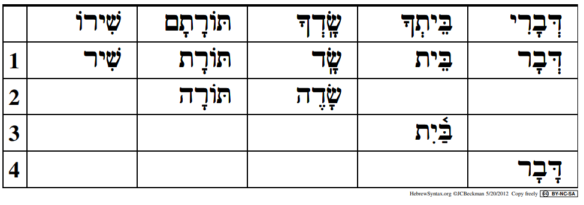

## Lexical Form with Type 2

1. Remove the pronominal suffix
2. Remembering that type 2 suffixes can *only* go with PLURAL nouns, but the Lexical Form is going to be the SINGLULAR, the next step is to fix the singular ending as needed.  Remove the וֹת ending if there is one.  Keep in mind that the word could exhibit defective spelling as with שְֹדֹת below.
3. Add the appropirate singular ending, if needed
    * If the word ended with a וֹת, it is Feminine. Replace with ה ָ (usually)
    * If the remaining word does not end with וֹת, it is likely masculine.  Most often, masculine words are endingless but sometimes you may need to add the masculine singular ending ה ֶ
4. If there is a tsere + yod in the middle of the word, replace with the diphthong יִ ַ֫
5. Change other vowels as needed according to the vowel preference table we studied several lessons ago.

Here is Dr. Beckman's example of the five steps.  Note that words do not always need all five steps.

The changes to the base words are due to the words being in **construct** form.  We will study more about this in Lesson 10.

## Unexpected changes

Two of the prepositions we studied in Lesson 6 undergo some irregular changes you will encounter as you read the Bible.

* כְּ (like, as) and מִן (from, etc.) often insert an extra מוֹ or מּ in some forms
    * Like you (2MS): כָּמ֫וֹךָ
    * From you (2MS): מִמְּךָ

* אָח adds a hireq + yod before all type 1 suffixes
    * My brother (1CS): אָחִי
    * Our Brother (1CP): אָחִינוּ
    
The rule still applies:

> Type 2 **always** begins with vowel + yod, but **not** hiriq + yod

## Look-alike words

### אֵת {-}

* As we learned previously, אֵת can mean either the DDO or the preposition "with".  They are spelled the same way and either form can take a pronominal suffix.
* אֵת with a regular Type 1 pronominal suffix is ALWAYS the DDO, with the suffix indicating the actual direct object
    * the א will be vowel-marked as אֹ or אֶ
    * 3MS: אֹתוֹ
    * 2FP: אֶתְכֶן
* When then author intends to communicate the preposition with, as in "with him", the א will take a hireq in all forms
    * With me (1CS): אִתִּי
    * With them (3FP): אִתָּן

###  עִם with or עַם people {-}

These two words frequently take pronouns.  It could be easy to get them confused.  The trick is to pay close attention to the vowel under the ע.

* עִם , with, will always have a Hireq, where as עַם, people, will always have a Patach
    * With Me (1CS): עִמִּי
    * My People (1CS): עַמִּי
    * With them (3MP):  עִמָּם
    * Their people (3MP):  עַמָּם

### אֵל, God, or אֶל, to {-}

This one is _slightly_ easier.  

* אֵלִי, my God is the only form of אֶל that appears with a pronominal suffix in the Bible
* to me (1CS) is: אֶלַי - Patach under the ל

Although אֵל may not appear with a suffix apart from this one time, אֱלֹהִ֑ים can, and in the Torah, frequently does take suffixes.   The words pairs below are close but not equivalent.

* אֱלֹהֶ֑יךָ  = your God (See Deuteronomy 6:5)
* אֵלֶ֫יךָ = to you (2MS)
* אֱלֹהִ֑ים  = God, gods
* אֲלֵיהֶם = to them (3MP)
* אֱלֹהֵֽינוּ = our God (Exodus 3:18)
* אֵלֵ֫ינוּ = to us (1CP)
* אֱלֹהָֽי = my gods (Genesis 31:30)
* אֵלֶ֫יהַ = to her/it (3FS)

## `Word Warm-up` {-}

[Click to open `Word Warm-up` video in a new tab](){target="_blank"}

<iframe width="768" height="432" src="" frameborder="0" allow="accelerometer; autoplay; clipboard-write; encrypted-media; gyroscope; picture-in-picture" allowfullscreen></iframe>

We have created a special `Word Warm-up` for the pronominal suffixes.

[Click to open `Word Warm-up` video in a new tab](https://youtu.be/zk-v6XSY6Pg){target="_blank"}

<iframe width="768" height="432" src="https://youtu.be/zk-v6XSY6Pg" frameborder="0" allow="accelerometer; autoplay; clipboard-write; encrypted-media; gyroscope; picture-in-picture" allowfullscreen></iframe>

## `Verses Warm-up` {-}

[Click to open `Verses Warm-up` video in a new tab](https://youtu.be/8Y7XdOBkWWo){target="_blank"}

<iframe width="768" height="432" src="https://youtu.be/8Y7XdOBkWWo" frameborder="0" allow="accelerometer; autoplay; clipboard-write; encrypted-media; gyroscope; picture-in-picture" allowfullscreen></iframe>

## `Anki` {-}

* `Lesson 09 A. Vocab`
* `Lesson 09 B. Grammar` 
* `Lesson 09 C. Workbook`
* `Lesson 09 D. Verses`

## `Worksheets`: NameOfWorksheet {-}

After you have done your Anki work, we have an additional worksheet to help you drill your pronominal suffixes.  As with previous worksheets, study, then cover-up the first column on the right and see if you can complete the remainder of the worksheet by memory.

[Pronominal Suffix](./images/09_pronominal_suffix_paradigm.pdf){target="_blank"}

## `Ruth Pursuit` {-}        

### Your Quest: {-}

1. Instruction#1 (Yellow)
2. Instruction#2 (Green)
3. Instruction3 (Light Blue)
4. Instruction4 (Pink)
5. Instruction5 (Light Grey)
6. Instruction6 (Red) <!--Try to use darker colors sparingly -->
7. instruction7 (Blue)

* [Blank copy of Ruth 1](https://drive.google.com/file/d/1qcfTKAlTJGChC2eYCMhSbY2w-ibzCcDV/view?usp=sharing){target="_blank"}
* [Ruth Pursuit Answer Key #09](){target="_blank"}

## `Hebrew Quest Study Passage`: Book Chapter# {-}

1. Read through the passage on your own.
2. Using a [Blank copy of the passage](){target="_blank"}:
    1. Highlight any words you do not know and look them up in a [lexicon](https://holylanguage.com/resources-dictionaries.php){target="_blank"}.    
    2. Parse as many verbs as you can.
    3. Sketch out a translation.
3. Watch Izzy's _Hebrew Quest_ video below [(Click to open video in a new tab)](https://www.youtube.com/embed/5hulHf6r7vk?end=874&rel=0&showinfo=0&autohide=1&autoplay=1){target="_blank"}
    1. How close was your translation?
    2. How did the Ruach HaQodesh speak to you?
4. Check your parsing against [this key](){target="_blank"}

<iframe width="768" height="432" src="https://www.youtube.com/embed/5hulHf6r7vk?end=874&rel=0&showinfo=0&autohide=1&autoplay=1" frameborder="0" allow="accelerometer; autoplay; clipboard-write; encrypted-media; gyroscope; picture-in-picture" allowfullscreen>
</iframe>

## `Quest Quiz` {-}

[Open Quest Quiz #09 in a new window](){target="_blank"}

<iframe src="" width="800" height="600" frameborder="2" marginheight="0" marginwidth="0"></iframe>

## Claim your next `Twelve Tribes Badge`! {-}

Check to be sure you have have completed **all activities** through this lesson, then fill out the form below.

[Check to be sure you have completed all ACTIVities here](){target="_blank"}, complete the certification below, and your badge will be on its way!

<iframe src="" width="640" height="691" frameborder="0" marginheight="0" marginwidth="0"></iframe>

<!--chapter:end:09-Pronominal_Suffixes.Rmd-->

# Hebrew Construct Chain {.ConstructChain}

> In order to comprehend Biblical Hebrew, we must be able to parse words in the construct state.

For most English speakers, this may be one of the least-familiar topics in this book.  Even with verbs, we have many of the same aspects of active, passive, or reflexive in English as in Hebrew.  But if you have never heard of a "construct chain" you're not alone.  After some introduction in this lesson, and of course the getting to know each other phase in `Anki`, it will make sense.

There are a lot of parameters that must be followed in a construct chain.  Keep in mind that we do not need to be able to write the construct state for a noun.  Our primary goal is to recognize it and translate adequately when we read our Bibles.

::: {.infobox}
**Seven Practical Points for Lesson 10**

1. Meaning of a construct chain
2. What makes a construct chain 
3. Review: what makes a word definite 
4. The Last word sets the definiteness of a chain
5. How to Recognize a Construct Chain 
6. Identifying Construct state by Noun Endings
7. Construct Chain Summary
:::

## First Thoughts {-}

Lesson prayer

> (Proverbs 8:8 NASB) All the utterances of my mouth are in righteousness  
בְּצֶדֶק כָּל־אִמְרֵי־פִי

<figure>
    <figcaption>Listen to the verse in Hebrew:</figcaption>
    <audio
        controls controlsList="nodownload"
        src="./images/10.09.pro0808.mp3">
            Your browser does not support the
            <code>audio</code> element.
    </audio>
</figure>

*****

(\#fig:unnamed-chunk-66)Capernaum synagogue. Although this structure was built after the time of Yeshua, archeologists are convinced it rests on the foundation of an earlier synagogue.  This  synagogue was the probable location where Yeshua taught in righteousness as recorded in Mark 1:21-28, Luke 4:31-37, and John 6:59. Courtesy of the [Pictorial Library of Bible Lands](https://www.bibleplaces.com)

## Equipment Check {-}

Before continuing, can you describe the following concepts?

*

## What is a Construct Chain?

You might remember Izzy referencing the construct state in _Hebrew Quest_.  A construct chain consists of at least two nouns linked together.  The very last noun is said to be in the "absolute state".  All words before the absolute noun are said to be in "construct state."

If we had a phrase like "the servant of the son of the king," "king" is the absolute noun, with "servant" and "son" in construct.  The entire phrase would be called a "construct chain."  

The point of the chain is to tell us something about the **first* _noun_ in the chain.  In the example above, we learn a little more about the servant.  This is an important point as it might be reasonable to think that the chain would be describing the noun in the absolute state, but that is not the case.  We are describing the servant, not the King.  BUT, if there were a substantival adjective as the first word, e.g. "wise of heart", the chain is describing "heart" not "wise".  So a chain describes the first NOUN in the chain, not necessarily the first word in the chain.

In English we would add the word "of" after each word in the construct state.  Similarly we could say "the King's son's servant" or "the servant of the King's son."

Just like we may add `'s`, Hebrew has different spelling for nouns in construct.  The absolute noun is the "normal" spelling and meaning.

## What makes a construct chain

What makes a Hebrew construct chain different is that noting else comes between the words of the chain.  In English we could add in an adjective like "the servant of the _wicked_ son of the king," in Hebrew, any adjectives must come after the whole chain.

We then would need to go back and figure out which word the adjective modifies by matching the gender and number.  This creates some potential ambiguity.  Literally, a Hebrew construct chain followed by an adjective could read "the servant of the son of the king the wicked."  It can be difficult to determine which of the three men is the wicked one.

It gets a little easier when the nouns in the construct chain are of mixed number and/or gender.  For example: "the wife of David the strong the smart, the beautiful", if "strong" and "beautiful" were FS and "smart" were MS, the sentence translation would be clear.

## Review: what makes a word definite 

Construct Chains have strict rules regarding definiteness, so now would be good time to refresh our list of what makes a noun definite in light of this lesson and Lesson 9.

A word is definite if it:

* Has the article - הַמֶּלֶךְ
* Has a pronominal suffix - מַלְכִּי
* Is a proper noun - דָּוִיד
* Is in a construct chain where the last, absolute, word is definite - בֶּן הַמֶּלֶךְ = THE son of the king

This brings us to a key concept about construct chains:

> Nouns in construct state NEVER take the article.

So what the last bullet point above is saying is even though a noun in construct may not have the definite article, it is considered definite when the last work is definite.  We explain more on the next page.

## The Last Word sets the definiteness of a chain

A construct chain is either entirely definite, or entirely indefinite and it is the last, absolute, word that defines whether the chain is definite or indefinite.

* בֵּנ הַמֶּלֶךְ = the son of the king
* בֶּן מֶלֶךְ = a son of a king

> A construct chain cannot mix definite and indefinite.

You will never see "a son of the king" or "the son of a king" in a construct chain.  It's only one or the other.

There are examples in the Bible of mixing definiteness and indefiniteness but these are not done using construct chains<small>^[<small>While מִ֭שְׁלֵי שְׁלֹמֹ֣ה is a construct chain that means "THE proverbs of Solomon", מִזְמ֗וֹר לְדָ֫וִ֥ד is not a construct chain.  By using an inseparable preposition, this phrase means "A Psalm to David", or we would say "A Psalm of David".</small>]</small>.

## How to Recognize a Construct Chain

The following are characteristics of nouns in the construct state:

* Never an article
* Never a pronominal suffix
* Never a long vowel that isn't a vowel letter (i.e. no Holem, Qamets, or Tsere)
    * EXCEPT an accented long vowel in the penult<small>^[<small>That is the next to last syllable position.</small>]</small> - סֵ֫פֶר
* No diphthong (will see Tsere+Yod or Holem-Vav)
* May have a reduced vowel in the penult
* Noun endings may change (next page)
* Two nouns connected by maqqef is a construct chain
    * כְּבוֹד־יְהוָה = The glory of the LORD
    
> Long vowel, not a vowel letter = absolute

## Identifying Construct state by Noun Endings

Nouns in construct often sometimes change endings.  The table below shows the Absolute ending and then the difference in the Construct form. 

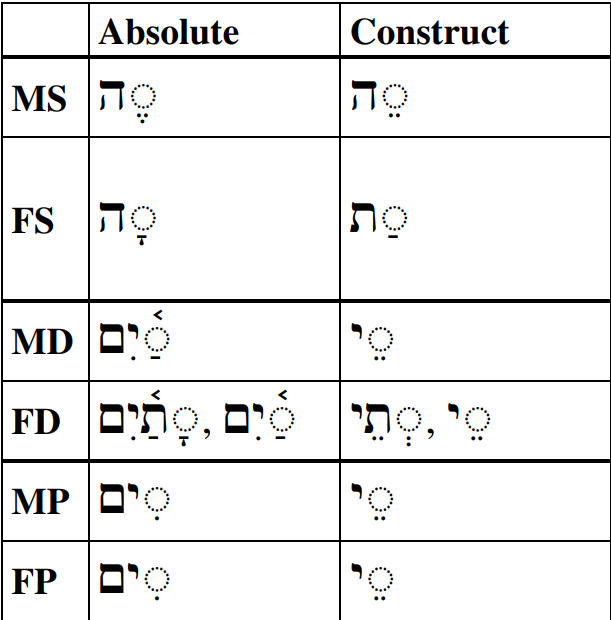
Other nouns may not change endings but will exhibit a loss of long vowels as discussed in the previous section.

Note that Tsere+Yod is diagnostic of Plural and Dual forms.

## Construct Chain Summary

* Remember the rules for what makes a noun definite.  This will help you determine whether the entire construct chain is definite or indefinite (for it can only be entirely definite or entirely indefinite)
    * "THE son of the queen" OR "A son of a queen"
* All words except for the last are in the "construct state"
    * No article or pronominal suffix
    * Long vowels are limited
        * ("Long vowel, not a vowel letter = Absolute" - Dr. Beckman)
    * No diphthong
    * Review ending changes chart
        * Tsere+yod is a very common ending for a masculine plural construct noun
    * A reduced vowel in the penult is usually construct - נְבִיא
    * Noun with Maqqef is construct - בֶּן־

There are four extremely common constructs in the Bible so we must be able to recognize them.  These will be reviewed in `Anki`.

כָּל־ - all of
אֲבִי־ = father of
אֲחִי־ = brother of
אֵ֫שֶׁת־ = wife of

## `Word Warm-up` {-}

[Click to open `Word Warm-up` video in a new tab](https://youtu.be/1bvZ74a1SYU){target="_blank"}

<iframe width="768" height="432" src="https://youtu.be/1bvZ74a1SYU" frameborder="0" allow="accelerometer; autoplay; clipboard-write; encrypted-media; gyroscope; picture-in-picture" allowfullscreen></iframe>

## `Verses Warm-up` {-}

[Click to open `Verses Warm-up` video in a new tab](https://youtu.be/1JWesFEa2_c){target="_blank"}

<iframe width="768" height="432" src="https://youtu.be/1JWesFEa2_c" frameborder="0" allow="accelerometer; autoplay; clipboard-write; encrypted-media; gyroscope; picture-in-picture" allowfullscreen></iframe>

## `Anki` {-}

* `Lesson 10 A. Vocab`
* `Lesson 10 B. Grammar` 
* `Lesson 10 C. Workbook`
* `Lesson 10 D. Verses`

## `Worksheets`: Construct Identification {-}

This attachment has a list of words, some are in absolute and some are in construct. See if you can determine the differences<small>^[<small>Odd 1-35, 39, 41, 42, 44, 45, 47 are Absolute; 37 and 38 are ambiguous; even 2-36, 40, 43, 46, and 48 are Construct. Most often it is "Long vowel, not a vowel letter" that identifies absolute.</small>]</small>.

[Construct Practice](./images/10_construct_practice.pdf){target="_blank"}

This next attachment is not really a worksheet but is a summary of common construct vocabulary that occurs in the Bible for your review.

[Construct Vocabulary](./images/10_construct_vocab.pdf){target="_blank"}

## `Ruth Pursuit` {-}        

### Your Quest: {-}

1. Instruction#1 (Yellow)
2. Instruction#2 (Green)
3. Instruction3 (Light Blue)
4. Instruction4 (Pink)
5. Instruction5 (Light Grey)
6. Instruction6 (Red) <!--Try to use darker colors sparingly -->
7. instruction7 (Blue)

* [Blank copy of Ruth 1](https://drive.google.com/file/d/1qcfTKAlTJGChC2eYCMhSbY2w-ibzCcDV/view?usp=sharing){target="_blank"}
* [Ruth Pursuit Answer Key #10](){target="_blank"}

## `Quest Quiz` {-}

[Open Quest Quiz #10 in a new window](){target="_blank"}

<iframe src="" width="800" height="600" frameborder="2" marginheight="0" marginwidth="0"></iframe>

<!--chapter:end:10-ConstructChain.Rmd-->

# Numerals/counting

> In order to comprehend Biblical Hebrew, we must be able to figure out numbers, with or without a dictionary, when we encounter them in the Bible

You have worked very hard on the first 10 lessons!  Way to go!  While a discussion on numbers and counting is often interweaved in a discussion with the Aleph-Bet, the authors of <u>Basics of Biblical Hebrew</u>, wisely in our opinion, strategically placed a necessary but lighter discussion on numerals right here in Lesson 11.  We are emerging from what may be a lot of foggy concepts with all of the noun, pronoun, and adjective concepts in lessons 4-10 (particularly Lessons 8-10).  The bulk of the work in this Lesson will be in `Anki` learning numbers from _Hebrew Quest_.

For the next 25 lessons we will be exclusively focused on the Hebrew verbal system and -- the entire point of this course -- reading and understanding Scripture.

Enjoy this brief lesson on numbers!

::: {.infobox}
**Seven Practical Points for Lesson 11**

1. The Biblical text always spells out numbers
2. Notes and footnotes use symbols for numbers
3. Be Familiar with Hebrew Ordinal Numbers - First through Tenth
4. Hebrew Cardinal Numbers
5. Digits 1 and 2 match the gender of the noun
6. Digits 3-10 take the opposite gender of the noun
7. Learn the Cardinal Numbers Above 10
:::

## First Thought {-}

Give Him praise that you are among those counted as His talmidim (disciples)!

> (Joshua 4:2 NASB) Take for yourselves twelve men from the people  
> קְחוּ לָכֶם מִן־הָעָם שְׁנֵים עָשָׂר אֲנָשִׁים

<figure>
    <figcaption>Listen to the verse in Hebrew:</figcaption>
    <audio
        controls controlsList="nodownload"
        src="./images/11.jos0402.mp3">
            Your browser does not support the
            <code>audio</code> element.
    </audio>
</figure>

---

(\#fig:unnamed-chunk-69)Tabgha, traditional location of the calling of the twelve disciples (). Courtesy of the [Pictorial Library of Bible Lands](https://www.bibleplaces.com)

## Equipment Check {-}

Before continuing, can you describe the following concepts?

*

## The Biblical text always spells out numbers

This is point number 1.  There is not a lot of elaboration needed except to note that this is the case.  You will not see "1", "200", or "969", either in modern symbols or in Rabbinic symbols (using the Aleph-bet) in the Hebrew text.

## Notes and footnotes use symbols for numbers

You may come across a system of counting that uses numerical values for each of the Hebrew letters.  This is interesting and the Rabbis have a lot of fun with comparing words that have identical numerical values.

* א ב ג ד ה ו ז ח ת represent 1-9
* י כ ל מ נ ס ע פ צ represent 10-90 by tens
    * So to say 33, would be 30 and 3 = לג or often ל״ג, with the ״ indicating that this is not a real word
* ק ר ש ת are 100, 200, 300, and 400, then we go to the sofit forms ך ם ן ף ץ for 500-900
* In some reckonings, a series of dots or diamonds above the letters, or ’ is used for numbers above 999.  For example 1000 is ’א

## Be Familiar with Hebrew Ordinal Numbers - First through Tenth

Ordinal numbers denote order.  first, second, third

In Hebrew, these are attributive adjectives, so they follow the noun and match in gender, number and definiteness (Attributive Always After, Always Agree).

* יוֹם רִאשׁוֹן or הַיּוֹם הָרִאשׁוֹן = first day or the first day

To denote the 11th position or higher, we would use cardinal numbers

* בִּשְׁנַת הָאַרְבָּעִים  = in the year of the forty = in the 40th year

We encourage you to learn the "days of the week" song with Izzy in the video below.

https://youtu.be/MlfwNNuWgto?t=2545

### Hebrew Quest Ordinal Numbers Video {-}

[Open video in new window](https://www.youtube.com/embed/MlfwNNuWgto?t=2542){target="_blank"}

<iframe width="768" height="432" src="https://www.youtube.com/embed/MlfwNNuWgto?t=2542" frameborder="0" allow="accelerometer; autoplay; clipboard-write; encrypted-media; gyroscope; picture-in-picture" allowfullscreen></iframe>

## Hebrew Cardinal Numbers

* One is an attributive adjective - it follows its noun and agrees in gender, number and definiteness
    * As we mentioned previously, it is sometimes used as an indefinite article
    * אִישׁ אֵחָד = one man = a man
* Two through Ten are nouns
    * They have both masculine and feminine forms
    * They have absolute and construct forms
* Higher numbers are nouns with no specific gender

## Digits 1 and 2 match the gender of the noun

For example:

* בֵּן אֶחָד = one son
* בַּת אַחַת = one daughter

## Digits 3-10 take the opposite gender of the noun

Additionally they are "singular" even though the noun is plural.  This makes sense when you think that the plural form of 3 is actually the word for 30 (see next section).

For example:

* שְׁלֹשָׁה בָּנִים = three sons
* שְׁלֹשׁ בָּנוֹת = three daughters

The technical term for this is "chiastic concord" (you don't need to know this)

## Learn the Cardinal Numbers Above 10

* 11-19
    * 11-12 match gender, 13-19 swap
        * 11 אַחַד אָשָֹר
        * 13 שְׁלֹשָׁה אָשָֹר
* Decades are spelled as masculine plural of the unit
    * 3 = שָׁלֹשׁ  
    * 30 = שְׁלֹשִׁים
        
## Conclusion

This chapter omits many details about numbers and counting.  Our aim was to provide an introduction so that when you encounter numbers in the Bible, you will have some basic familiarity.

If you are interested in going a little deeper, we encourage you to view the complete [Hebrew Quest segment on numerals](https://holylanguage.com/grammar-1.php){target="_blank"}. 

For Hebrew GRAMMAR quest it is sufficient for you to learn the Ordinals (first through 10th - for 1-7 we will learn Izzy's days of the week song) and the Cardinals 1-10, then 20-100 by 10s, and 1000.

## `Word Warm-up` {-}

[Click to open `Word Warm-up` video in a new tab](https://youtu.be/3OuD2Snu-Uk){target="_blank"}

<iframe width="768" height="432" src="https://youtu.be/3OuD2Snu-Uk" frameborder="0" allow="accelerometer; autoplay; clipboard-write; encrypted-media; gyroscope; picture-in-picture" allowfullscreen></iframe>

## `Verses Warm-up` {-}

[Click to open `Verses Warm-up` video in a new tab](){target="_blank"}

<iframe width="768" height="432" src="" frameborder="0" allow="accelerometer; autoplay; clipboard-write; encrypted-media; gyroscope; picture-in-picture" allowfullscreen></iframe>

## `Anki` {-}

* `Lesson 11 A.Vocab` 
* `Lesson 11 B.Grammar` 
* `Lesson 11 C.Verses` - Note: there is no `Workbook` component to this lesson.

## `Ruth Pursuit` {-}        

### Your Quest: Locate numerals {-}

1. Find the numbers one, two (the first instance only), and ten (Yellow)

* [Blank copy of Ruth 1](https://drive.google.com/file/d/1qcfTKAlTJGChC2eYCMhSbY2w-ibzCcDV/view?usp=sharing){target="_blank"}

* [Ruth Pursuit Answer Key #11](./images/11_Ruth_Pursuit_KEY.pdf){target="_blank"}

## Claim your next `Twelve Tribes Badge`! {-}

Check to be sure you have have completed **all activities** through this lesson, then fill out the form below.

[Check to be sure you have completed all ACTIVities here](){target="_blank"}, complete the certification below, and your badge will be on its way!

<iframe src="" width="640" height="691" frameborder="0" marginheight="0" marginwidth="0"></iframe>

<!--chapter:end:11-Numerals.Rmd-->

# (PART) Qal Binyanim {-}

# Introduction to Hebrew Verbs {#Verbs}

<!--chapter:end:12-Verbs_Intro.Rmd-->

# Qal Perfect - Strong Verbs {.QP-s}

<!--chapter:end:13-Qal_Perfect_Strong.Rmd-->

# Qal Perfect - Weak Verbs {.QP-w}

<!--chapter:end:14-Qal_Perfect_Weak.Rmd-->

# Qal Imperfect - Strong Verbs {.QI-s}

<!--chapter:end:15-Qal_Imperfect_strong.Rmd-->

# Qal Imperfect Weak {.QI-w}

<!--chapter:end:16-Qal_Imperfect_Weak.Rmd-->

# Vav Consecutive {.wc}

<!--chapter:end:17-Vav_Consecutive.Rmd-->

# Qal Imperative {.QM}

<!--chapter:end:18-Qal_Imperative_strong.Rmd-->

# Pronominal Suffixes on Verbs {.VerbSuffix}

<!--chapter:end:19-Pronominal_Suffix_Verbs.Rmd-->

# Qal Infinitive Construct {.Q∞}

<!--chapter:end:20-Qal_Infinitive_Construct.Rmd-->

# Qal Infinitive Absolute {.QA}

<!--chapter:end:21-Qal_Infinitive_Absolute.Rmd-->

# Qal Participle {.QPt}

<!--chapter:end:22-Qal_Participle.Rmd-->

# Hebrew Syntax {.Syntax}

<!--chapter:end:23-Hebrew_Syntax.Rmd-->

# (PART) Derived Binyanim {-}

# The Niphal Stem - Strong Verbs {#N-s}

<!--chapter:end:24-Niphal_Strong.Rmd-->

# The Niphal Stem - Weak Verbs {.N-w}

<!--chapter:end:25-Niphal_Weak.Rmd-->

# The Piel Stem - Strong Verbs {.D-s}

<!--chapter:end:26-Piel_Strong.Rmd-->

# The Piel Stem - Weak Verbs {.D-w}

<!--chapter:end:27-Piel_Weak.Rmd-->

# The Pual Stem - Strong Verbs {.Dp-s}

<!--chapter:end:28-Pual_Strong.Rmd-->

# The Pual Stem - Weak Verbs {.Dp-w}

<!--chapter:end:29-Pual_Weak.Rmd-->

# The Hiphil Stem - Strong Verbs {.H-s}

<!--chapter:end:30-Hiphil-Strong.Rmd-->

# The Hiphil Stem - Weak Verbs {.H-w}

<!--chapter:end:31-Hiphil-Weak.Rmd-->

# The Hophal Stem - Strong Verbs {.Hp-s}

<!--chapter:end:32-Hophal_Strong.Rmd-->

# The Hophal Stem - Weak Verbs {.Hp-w}

<!--chapter:end:33-Hophal_weak.Rmd-->

# The Hithpael Stem - Strong Verbs {.HT-s}

<!--chapter:end:34-Hitpael_Strong.Rmd-->

# The Hithpael Stem - Weak Verbs {.Ht-w}

<!--chapter:end:35-Hitpael_Weak.Rmd-->

# (APPENDIX) Appendices {-} 

<!--chapter:end:40-Appendices.Rmd-->

# Anki info and FAQ {#anki_faq}

<!-- Grammarly check: 10/24/2020 - 179 lines -->

> Strength and Endurance Builds Muscle

(\#fig:unnamed-chunk-71)Strength and Endurance

If one wants to build strength, she might use the weight machine.  If one wants to build endurance and overall health, she might use the treadmill.  Most people will want to use a combination of both. What does this have to do with Anki (whatever that is)? I’m glad you asked!

> Anki is Gym Equipment for your Brain 

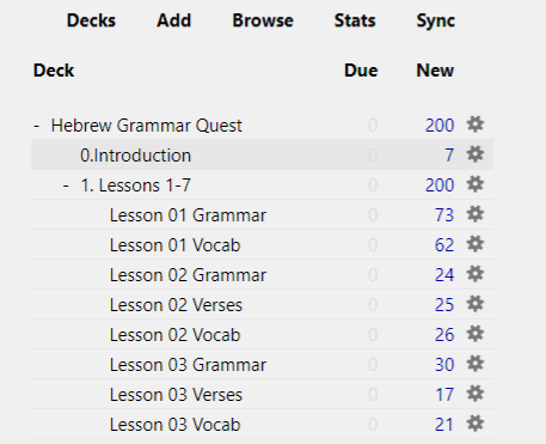

(\#fig:unnamed-chunk-72)Anki Home Screen

Anki is free<small>^[<small>all platforms are free, except for the iOS app, which costs $25. The developers use the proceeds to fund future development.  Most reviews say the cost is worth it if you have Apple devices and use Anki regularly.</small>]</small> flashcard application that contains a unique algorithm to present you with cards to review at just the right times.

Thus, it is not just a flashcard program but is a tremendous strength and endurance tool for learning, and it is where we will be spending the bulk of your time in the course.  It has become the “go-to” for many medical school students to learn all the intricate facts they have to know.

## Installation {- #installation_anki}

**Anki NOTE**: Eventually, you can do all work from a mobile device.  _For the initial Anki install, you do need to do these steps from a desktop<small>^[<small>By "desktop" we generically mean a desktop or laptop computer (as opposed to a mobile device) running a Windows, Mac, or Linux operating system.</small>]</small> computer_.

1. Download and install the [free Ezra SIL font](https://software.sil.org/downloads/r/ezra/EzraSIL-2.51.zip ){target="_blank"}.
1. [Sign up for a free Ankiweb account here](https://ankiweb.net/account/register){target="_blank"}.
1. [Download and Install the Anki Program (Mac/PC/Linux)](https://apps.ankiweb.net/){target="_blank"}.

## Customize Anki Settings {- #anki_settings}

1. Change USER1 Name 
    1. In Anki, click File, then Switch Profile  
    2. Select “User 1,” then Rename and type your name
1. Change global settings
    1. Click `Tools,` then `Preferences.`
        1. On the `Basic` tab, some people prefer `night mode` - if this is you, check the `Night Mode` box
        2. On the `Scheduling` tab:
            1. Check the box that says `Anki 2.1 Scheduler.`
            2. Note the hour the `next day` starts - 
                * You want to set this for a time where you will NOT be doing reviews.  
                * For most people, 4:00 am is a safe time, but if you're routinely awake at 4:00 am, set this field to be earlier or later.

### Below is the main set you will want to change.  Enter these numbers carefully: {-}

1. Back on the main page, click the gear wheel to the right of “Hebrew Grammar Quest” and select “Options”
    1. `New Cards`<small>^[<small> See https://docs.ankiweb.net/#/deck-options?id=new-cards for additional information</small>]</small>
        * `Steps` = 10 1440 4320
        * `New cards/day` = 200
        * `Graduating interval` = 15
        * `Easy interval` = 60
        * `Starting ease` = 250%
        * `Bury related new cards...` = Up to you but we recommend - CHECKED
    2. `Reviews`<small>^[<small> See https://docs.ankiweb.net/#/deck-options?id=reviews for additional information</small>]</small>
        * `Maximum reviews/day` = 9999
        * `Easy bonus` = 130%
        * `Interval modifier` = 100
        * `Maximum interval` = 210
        * `Bury related reviews...` = Up to you but we recommend - CHECKED    
    3. `Lapses`
        * `Steps` = 10
        * `New interval` = 1
        * `Leech threshold` = 8
        * `Leech action` = TAG ONLY

Your settings should look like this:

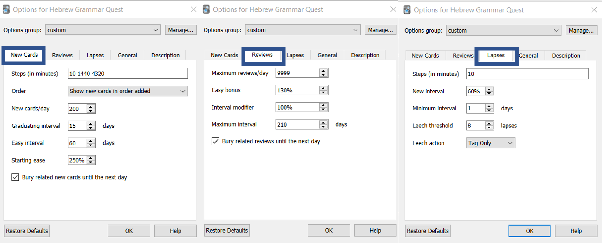

(\#fig:unnamed-chunk-73)Settings

[Return to Quick Start page](#get_started)

## How do I access Anki on my mobile device? {-}

After you have installed Anki, loaded a deck and then synched to your Ankiweb account, theoretically, you do not ever need to access the non-mobile version again.

There are versions of the mobile app in the Google or Apple store.  As we mentioned above, the apple version is a one-time cost of $25. Once you download the app, you can login with your same Ankiweb account and, if you synched from the desktop version of the software, you should see the Hebrew GRAMMAR Quest deck appear.

You can also access a [web-based version of Anki (login with your Ankiweb credentials)](https://ankiweb.net/decks/).  Functionality is a bit more limited, but it is generally sufficient for the learning aspects.  Please note you will need the not be able to meet the `Graduation Process` requirements for the `Certificate` or `Diploma` using only ankiweb.net  

One note: if you plan to go back and forth between a computer and a mobile device, make sure you sync after each session.

Here are the steps:

1. On your laptop/desktop: Sync → Log In → log in using your account information
1. If a pop-up window asks you, choose "**Upload to** AnkiWeb"
1. On your phone, download and install the Anki app.
    * The Android app is free. The iPhone app costs $25.
1. On your phone, start the Anki app and log in using your account information
1. If a pop-up window asks you, choose "**Download from** AnkiWeb"
1. Anki will now automatically keep your work on your phone and laptop/desktop in sync.

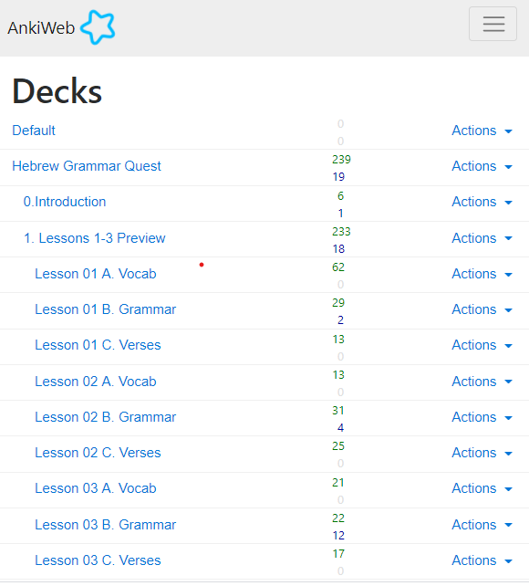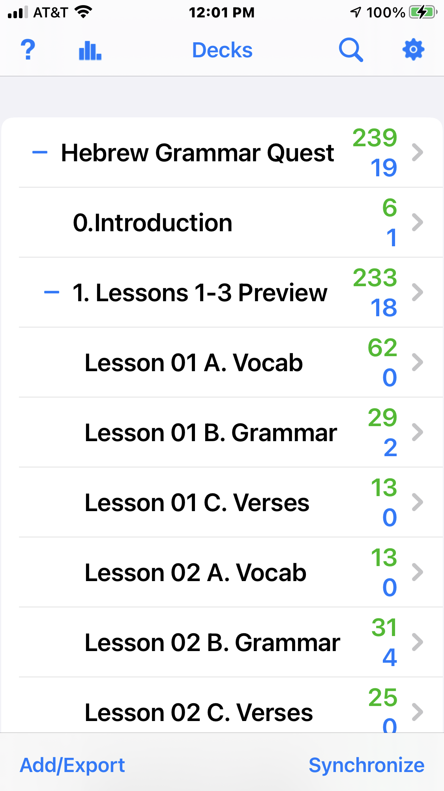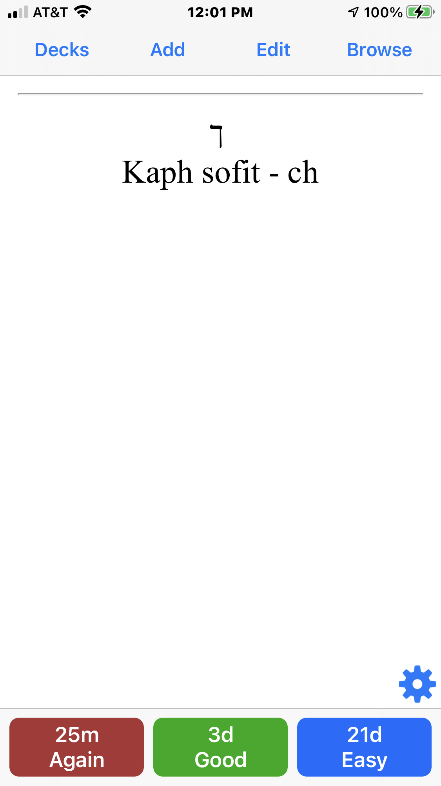

(\#fig:unnamed-chunk-74)Anki web and mobile views

## How do I navigate within Anki? {-}

* Click the +/- buttons to expand/collapse the folders within the Anki deck

(\#fig:unnamed-chunk-75)Anki - subdecks collapsed

    * To start with Lesson 01 Vocabulary, expand to reveal this deck, click on `Lesson 01 Vocabulary` and click the `STUDY NOW` button
* Many cards have "hints" - click on the `hint` button to reveal
    * If you needed a hint, be sure to select `Again` on the answer side. See discussion below.
    

    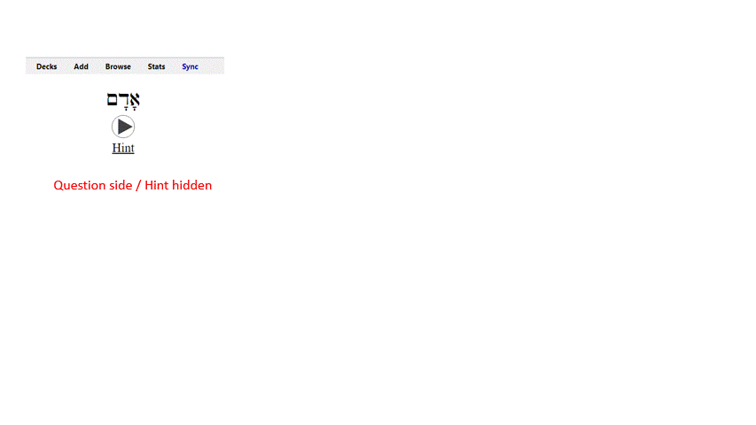
    
(\#fig:unnamed-chunk-76)Revealing a hint in Anki

    

* For cards that have audio, it should play when you are first shown the card. If you need to hear the audio again, hit the `play` button
* When you are ready to see the answer, click Spacebar, Enter, or the `Show Answer` button

## How do I know when to hit the `Good` button on a **Vocabulary** or **Grammar** card? {-}

We suggest using the following guidelines to select the most appropriate answer.

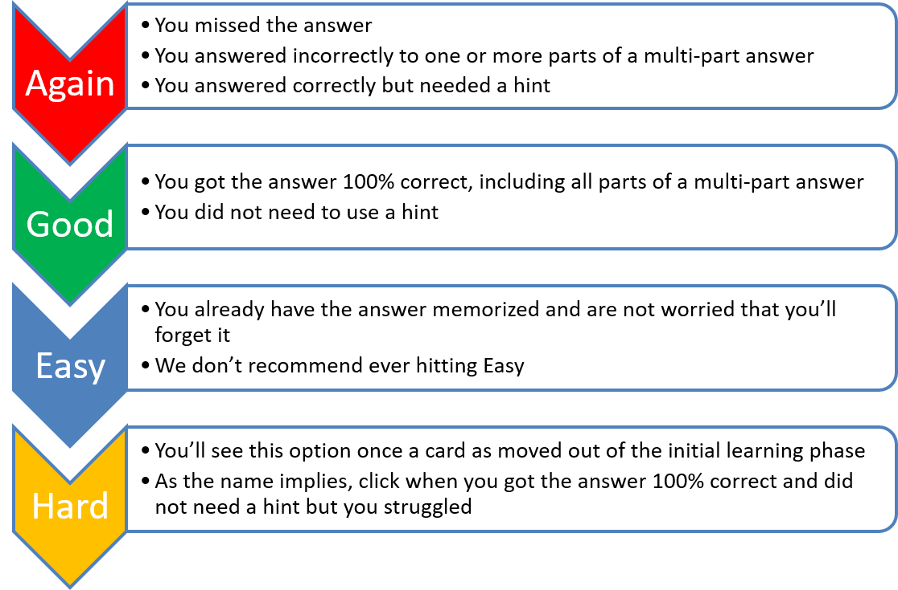

(\#fig:unnamed-chunk-77)Anki Response Definitions

* There is no “value judgment” to hitting `Again` – you will learn on your timeline
* Be honest with yourself! 
* If you doubt, between `Again` and `Good,` select `Again.`

## How do I know when to hit the `Good` button on a **Verse Translation** card? {-}

While the same general guidelines apply to all cards, one of the main goals of this course is to give you the ability to translate from Hebrew to English at a basic level.    

Below are some guidelines for answering the Verse Translation cards:
* You do not necessarily need to be able to translate the entire passage from memory.  Suppose you can comfortably read the Hebrew. Your translation is roughly similar to the English answer (it doesn't have to be exact).  In that scenario, you should hit `good.`
1. If your translation is missing one or more words (again excluding roughly equivalent meanings), you should select `again.`
1. If you need to use a `hint,` you should select `again` until you can translate without needing to refer to the hint.
1. We do not recommend selecting `easy.` An exception might be when you are confident that you already have the word, rule, or passage memorized.

Most importantly, be patient with yourself.  It may take you many tries in the early going before you can hit `good.`

Learning a new language is not easy.  We applaud you for the Hebrew learning road you are now taking!

## What are Anki Add-ons? {-}

* Add-ons are small packages that extend the base application of Anki.
* Many add-ons are geared towards the developers/editors of decks, but there are a few that enhance the end-user experience
* To access, select `Tools,` `Add-ons,` then click `Get Add-ons...`
* You will then be asked for the add-on code, which will install the add-on
* Click `Browse Add-ons` to be taken to the Anki Add-on website, where you can get the code
* For example, this add-on will change the button colors:
    * `The KING of Button Add-ons` - `374005964.`

## How often should I expect to work in Anki? {-}

The best case is DAILY.

Once you get going, you may find you look forward to it.

There is a custom add-on called `Review Heatmap.`  At the time we are writing this Guidebook, the Add-on is still in beta, so it's not available on the Anki Add-on page.  

* [Click here to download](./images/review-heatmap-v1.0.0-beta.1-anki21.ankiaddon)
* Then double-click and restart Anki
* You will now see a grid that shows you your daily reviews to keep you motivated

(\#fig:unnamed-chunk-78)Keep your daily Anki streak going!

## How do I know when I'm done with a deck? {-}

Learning and active-recall is an on-going process. In theory, Anki will keep scheduling reviews until you delete the deck.  This follows a "use it or lose it" philosophy.  If we spend a day learning some material but then don't think about it again for two weeks, we're likely to forget most of it.

So while this could be an indefinite process, we do have some guidelines as they pertain to the `Course Checklist` and the `Certificate`/`Diploma`.

* For the `Course Checklist`, all cards should be moved out of the `New` category and into the `Young` or `Mature` categories, with no cards `Suspended` or `Buried`. 
* To qualify for a `Certificate` or `Diploma`, all cards must be in the `Mature` category with no cards `New`, `Young`, `Suspended`, or `Buried`.

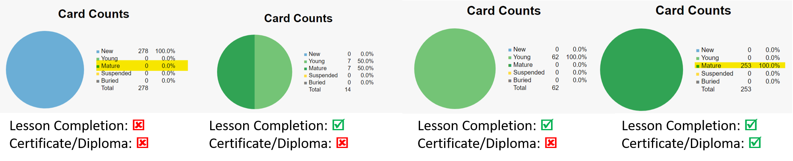

(\#fig:unnamed-chunk-79)DESKTOP Card Counts chart from Anki Stats showing all cards = Mature

See the next two pages for more information on how to locate your statistics.

## Anki Completion Requirements for the`Course Checklist` {-}

For each lesson, we are looking for all cards to be moved out of the `New` category and into the `Young` or `Mature` categories, with no cards `Suspended` or `Buried`.  Below are the steps to check.

_You must do the steps below  from a Desktop (or laptop) or the ios/Android mobile app.  Statistics are not available from the ankiweb.net site_.

1. In Anki, select the applicable deck, for example "`Lesson 01 A.Vocab`"
    1. On mobile, once you tap the deck it may take you into the deck information section.
    1. Click the left arrow in the upper left of the screen to access the bar chart icon
2. Click on `Stats` (desktop) or tap the Bar chart icon (mobile)
3. Scroll down to the `Card Counts` pie graph
4. If all cards are `Young` or `Mature` with no cards `New`, `Suspended`, or `Buried` as shown on the acceptable examples below, you can mark that deck as completed on your `Course Checklist`

(\#fig:unnamed-chunk-80)DESKTOP Card Counts chart from Anki Stats showing all cards = Mature

## Anki Completion Requirements for the `Certificate` {-}

To be eligible for the `Certificate`<small>^[<small>Certificates are not available in the Preview Version of Hebrew GRAMMAR Quest.</small>]</small> and `Diploma`, you will need to provide a screenshot from the Anki `Stats`.  The `Card Counts` pie chart should reflect ALL cards for the unit are in the `Mature` row.

_You must do the steps below  from a Desktop (or laptop) or the ios/Android mobile app.  Statistics are not available from the ankiweb.net site_.

1. In Anki, select the applicable unit, for example "`Hebrew Grammar Quest::1. Lessons 1-3`"
    1. On mobile, once you tap the deck it may take you into the deck information section.
    1. Click the left arrow in the upper left of the screen to access the bar chart icon
2. Click on `Stats` (desktop) or tap the Bar chart icon (mobile)
3. Scroll down to the `Card Counts` pie graph
4. If all cards are  `Mature` with no cards `New`, `Young`, `Suspended`, or `Buried`, and you have done everything else for that unit on the `Course Checklist`, you are ready to apply for your unit completion `Certificate` or `Diploma`.  CAPTURE A SCREENSHOT as directed below:
    * Desktop: Make sure the Statistics window is aligned on top of the main Anki widow so that the course name is visible as shown in the image below:

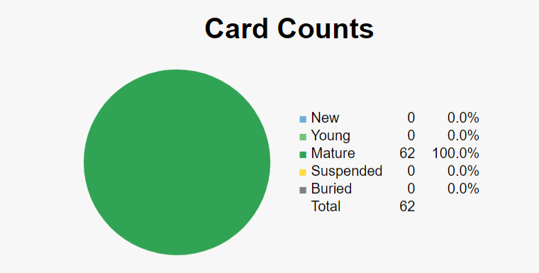

(\#fig:unnamed-chunk-81)DESKTOP Card Counts chart from Anki Stats showing all cards = Mature

    * Mobile - simply capture a screenshot showing the `Card Counts` statistics as shown below:
    

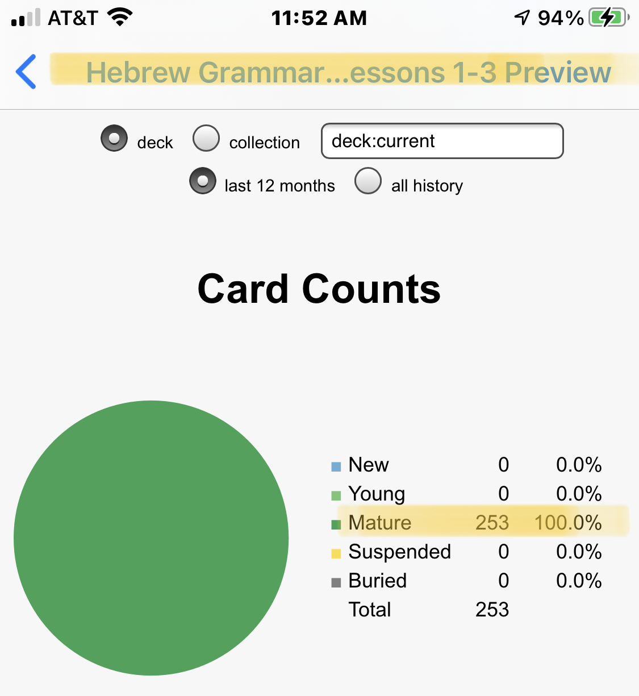

(\#fig:unnamed-chunk-82)MOBILE: Card Counts chart from Anki Stats showing all cards = Mature

<!-- Please see [`Graduation` process page]() for additional information -->

## What do the different card stages mean? {-}

There are a few different terms Anki uses for different stages of card maturity:

* `New` Cards
    * `Unseen` - A card you have not seen!
    * `Learn` - a card you have seen that is in the initial learning phase. Based on our settings above, you need to get a card correctly three consecutive times for three days in a row (4320 minutes) to move from `Learn` to `Young`.
* `Review` Cards
    * `Young` - a card that has "graduated" from the `Learn` stage, but has a calculated review interval of less than 21 days
    * `Mature` - a card that has a calculated review interval greater than 21 days
* `Lapse` - a card formerly in the `Review` category that was answered incorrectly
    * `Relearn` - the phase to describe a lapsed card that you are relearning

## Can I add an image or a hint? {-}

* If you would like to edit a card, such as to add a picture or change/add a hint - you can do this.  Just press `E.`
    * You can do this from either the "question" or the "answer" side of the card
    * We do not recommend you change the `word,` `definition` or `audio` fields
    * To add an image simply copy and paste into the image field

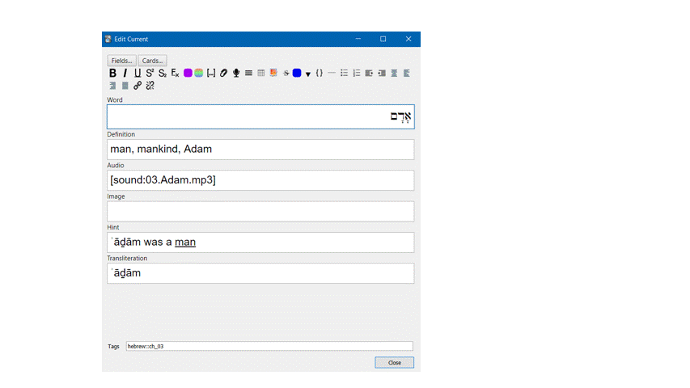

(\#fig:unnamed-chunk-83)Adding a custom image in Anki

## Can I modify the layout of a card? {-}

The short answer is `yes,` but you would need to learn more about how Anki works.  Such a discussion is beyond our scope with this book. Still, if you are interested in learning more about Anki, there are dozens of YouTube videos.

### Proceed with caution: {-}

With the above caveat, if you are comfortable with Anki, we have added some extra `Note Types.` 

1. Click `Browse.`
1. Select the card(s) you wish to change 
1. If you want to be tested on both Hebrew-to-English and reverse, English-to-Hebrew, select note type `Vocab Basic Hebrew/English.`
1. If you have added images and want Anki to test you on Hebrew-to-English, English-to-Hebrew, and Image-to-Hebrew, select note type `Vocab Basic Hebrew/English/Image.`
1. If you have added images and only want to be tested on Hebrew-to-English and Image-to-Hebrew, select note type `Vocab Basic Hebrew/Image.`
1. If you want to be tested audio to Hebrew (and reverse), select note type `Vocab Basic Hebrew/Audio` - the Aleph-bet cards use this note type
Just be aware that changing to one of these optional note types will double (or triple if you chose Hebrew/English/Image) the number of vocabulary cards.  If you decide you want to go back to Hebrew-to-English, repeat steps 1-4 and select Note Type `Vocab Basic Hebrew.`

## What does `There are more new cards available, but the daily limit has been reached` mean? {-}

Anki is doing precisely what we told it to do in the `settings`!  As much as possible, we want to let Anki tell _us_ when to work.

* We go when it tells us there are cards to learn or review
* We stop when it tells us there are no cards

1. We set new cards to `200` - it's essential not to overload yourself.
    * Generally, if you work one deck at a time, e.g. `Lesson 01 A. Vocab`, then `Lesson 01 B. Grammar` and so on, you will be less likely to hit the daily limit
    * You can keep going using the `Custom Study.` Do note the warning: `You can increase the limit in the options, but please bear in mind that the more new cards you introduce, the higher your short-term review workload will become.`
2. We checked `bury related cards.`
    * If an answer has two parts in two separate questions, we want to make sure you answer the second question from your knowledge, not because you just saw the solution on a related card
    * If you want to work on these cards anyway, click `Unbury.`

(\#fig:unnamed-chunk-84)With `Custom Study` you can temporarily increase your daily new cards

## How do I submit screenshots for the `Certificate`? {-}

<!--chapter:end:45-Anki.Rmd-->

# More Hebrew Quest and Hebrew GRAMMAR Quest FAQ {#hq_hgq_faq}

* [What is the difference between Hebrew Quest and Hebrew GRAMMAR Quest?](#difference)
* [Do I need to complete Hebrew Quest before I start Hebrew GRAMMAR Quest?](#complete_hq_first)
* [When I complete this course, should I go back and finish Hebrew Quest?](#need_to_finish_hq)
*  [I haven't started either course.  Which should I do first?](#which_first)

<!-- Grammarly check: 10/24/2020 108 lines -->

## What is the difference between Hebrew Quest and Hebrew GRAMMAR Quest? {- #difference}

* Both courses are born of the same Holy Language Learning philosophy: the optimal method to interact with the Sacred Scriptures is by *doing*
* Hebrew Quest was intentionally designed to get students into Hebrew texts with as little "grammar" as possible
* Hebrew GRAMMAR Quest is designed to fill a gap for those students who want to know more about the inner workings of Hebrew but wish to do so in a fun, low-pressure format (as opposed to taking a formal Hebrew course or trying to read an academic-level textbook on their own)
* Also, we know that everyone learns a little differently
    * Many can view the 40 lessons of Hebrew Quest, and they "get it" concerning Hebrew
    * Others may have found themselves getting stuck on the "grammar" sections of Hebrew Quest and need some more in-depth grammar preparation before returning to the study passages
    * Still others made it through some or all of Hebrew Quest and have a desire to know more
* [As we said earlier](#hgq_and_hq), wherever you find yourself, if you are interested in digging deeper, you have come to the right place!

## Do I need to complete Hebrew Quest before I start Hebrew GRAMMAR Quest? {- #complete_hq_first}

* Emphatically - **No!** 
    * This grammar course starts from the beginning (with learning the Aleph-bet) and assumes no prior knowledge of Hebrew
* With that said, the more of Hebrew Quest you have completed, the more comfortable you may find it is to work through the grammar material
* If we were to categorize as "good," "better," "best" in terms of Hebrew Quest completion, here's what we would say:
    * **Good**: 
        * You have completed some or no Hebrew Quest lessons  
        * This means that the first three lessons of Hebrew GRAMMAR Quest might take you a little longer, but once you have that foundation, you'll be up to speed
    * **Better**: 
        * You have completed through Hebrew Quest Lesson 12 (the Aleph-bet and Vowels)  
        * This means the first three lessons will go a little more quickly for you
    * **Best**: 
        * You have completed through Lesson 15 (verbs) and beyond
        * This means that more of the concepts presented in Hebrew GRAMMAR Quest will tend to be things you have heard before versus brand new

## When I complete this course, should I go back and finish Hebrew Quest? {- #need_to_finish_hq}

> Hebrew GRAMMAR Quest is an extension of Hebrew Quest, not a substitute.

* So the answer to the question is, **ABSOLUTELY!**
* In fact, the most logical next step after completing a first-year Hebrew grammar course is to dig into the Scriptures and start reading.
* Hebrew Quest, starting with Lesson 16, is all about reading Hebrew<small>^[<small>Although, with your more in-depth knowledge, you may be able to go a little faster. If the Hebrew Quest videos are too slow for you, click the "Settings" gear icon in the bottom right corner of the video, click "Speed," and then select a faster speed.</small>]</small>.
* To say it differently, Hebrew Quest and Hebrew GRAMMAR Quest complement one another in a circular (and maybe slightly paradoxical!) form:
    * The more Hebrew Quest you have completed, the more you will get out of Hebrew GRAMMAR Quest, and
    * The more Hebrew GRAMMAR Quest you have completed, the more you will get out of Hebrew Quest
    * Either way, you can't go wrong!  The most important thing is to start.

## I haven't started either course.  Which should I do first? {- #which_first}

* If the word "grammar" makes your stomach churn, then start with (and stick with) **Hebrew Quest**!
* Otherwise, we can suggest doing the first 16 lessons of **Hebrew Quest** - this will take you in-depth through the Aleph-bet and give you an overview of Grammar and give you an introduction to reading Proverbs.
    * Also plan to do Hebrew Quest Memrise or Anki so you can pick up your first two Certificates as outlined [here](https://holylanguage.com/graduate.html)
* Then hop over to this course and get a firm foundation of Hebrew grammar
* Then go back to Hebrew Quest lesson 17 and the study passages will have extra life for you
* This will likely take you a long time to complete both<small>^[<small>It probably is not entirely unreasonable to be able to do two lessons per week, but be prepared to spend a LOT of time in Anki (or Memrise, for Hebrew Quest).  One lesson per week is probably a better pace.  In any case remember you get out of it what you put into it.  It's a marathon, not a sprint!</small>]</small>, but remember the proverb about the best time to plant a tree:  "The best time was 20 years ago.  The second-best time is today."
    
Whichever direction you take, we would encourage you to ultimately complete both **Hebrew Quest** and **Hebrew GRAMMAR Quest**.

<!--chapter:end:50-HQ_HGQ_FAQ.Rmd-->

# Other FAQ {#other_faq}

* [There are many books out there to learn Hebrew.  What makes Hebrew GRAMMAR Quest different?](#hgq_difference)
* [What are the course Activities?](#activities_faq)
* [Will I be required to buy anything?](#buy_materials)
* [Who will (and who might not) benefit from Hebrew GRAMMAR Quest?](#who_benefits)
* [What if I am a Bible teacher? Should I take this course?](#bible_teacher)

## There are many books out there to learn Hebrew.  What makes Hebrew GRAMMAR Quest different? {- #hgq_difference}

* As we say above, we want students to learn by **doing**
    * While **Hebrew GRAMMAR Quest** will cover the same concepts as a typical first-year Hebrew textbook, the instructional design team at Holy Language Institute are big proponents of _active_ learning as opposed to passive learning
    * Reading a book is mostly a passive activity 
    * Therefore, our goal for this interactive, self-contained book is to provide a quick orientation to the concepts<small>^[<small>If you're looking for a stand-alone textbook, there is none better than <u>Basics of Biblical Hebrew</u>.</small>]</small>
* Textbooks have their place, but in our view, your "real" learning will take place when you complete the ACTIVities (see the root of the word "active" in there?)
    * This is the impetus behind the current "flipped classroom" philosophy in traditional education

## Will I be required to buy anything? {- #buy_materials} 

* **NO**.  Other than being a subscriber to Holy Language Institute, you will not need to purchase anything for this course (unless you want to)
* We would like to disclose that the iOS version of the Anki app requires a one-time purchase through the Apple store of $25
    * Note: Holy Language Institute has nothing to do with this policy and receives nothing should you decide to purchase the app
    * The developers of Anki provide every other platform for free and say they use the proceeds from the iOS app to fund these different platforms and program enhancements
    * While the price is steep for an app, most online reviews say the cost is justified (a few pennies a day over a year)
    * If you have an Apple device and do not wish to purchase the app, you may use a web-based version of mobile Anki at no charge (you won't be able to use it offline)

* There are lots of additional resources available that accompany Basics of Biblical Hebrew for free and to purchase - we will incorporate many of the free resources into this book package
* In other words, we have designed this book so that you should not need to purchase any additional learning materials
* With that said, if you wish to purchase _Basics of Biblical Hebrew_ or any of the accompanying resources for a more in-depth Grammar study, some options are below<small>^[<small>Before purchasing, we would like to make our students aware that the authors of these materials take an academic, as opposed to a reverential approach regarding God's Holy Name. You will see the transliteration of the Tetragrammaton printed on nearly every page.  While we believe this is unfortunate and unnecessary, Basics of Biblical Hebrew remains an excellent resource for an in-depth study of first-year Hebrew grammar.</small>]</small> 
    * [Basics of Biblical Hebrew Textbook](https://www.amazon.com/gp/product/031053349X/&tag=holylanginst-20)
    * [Basics of Biblical Hebrew Workbook](https://www.amazon.com/gp/product/0310533554/&tag=holylanginst-20)
    * [Basics of Biblical Hebrew Laminated Reference Card](https://www.amazon.com/gp/product/031026295X/&tag=holylanginst-20)
    * We would appreciate it if you would use one of the affiliate links, which allows Holy Language Institute to receive a small commission
    
## Who will (and who might not) benefit from Hebrew GRAMMAR Quest? {- #who_benefits}

* Hebrew GRAMMAR Quest is focused on reading and understanding Hebrew for the English speaker.
    * If you desire to read the Hebrew Scriptures in the original language and have a greater comprehension of what you read, this course is for you!
    * If one was looking to be a fluent writer or speaker<small>^[<small>There are speaking activities beginning with Lesson 3, but this is more to engage additional senses in the learning process and not to become a fluent reader.</small>]</small> of Hebrew, or teach Hebrew in a formal academic setting, this course probably would not fully meet that person's goals (although it would be a terrific first step).
* This course focuses on Biblical Hebrew, not Modern Hebrew.
    * If you are looking to translate "can you direct me to the railway station?", we apologize, but this course will not benefit you!
* Hebrew GRAMMAR Quest is designed to be self-directed and (mostly) stress-free.
    * By design, it does not have the accountability and rigor of a traditional academic program.
        * By saying it does not have "academic rigor," we are **NOT** saying this course will be __easy__.
        * You will likely spend _many_ hours on this course, mostly in Anki.
        * We believe it will be a tremendous investment you can make for the kingdom and the impact you can have on others.
        * When you start to see your knowledge building up in Anki, we believe you will find it rewarding and fun as well.
    * Those who are seeking more of an academic/seminary type of setting might fare better with a traditional, instructor-led, Hebrew course (but the more of THIS course you complete, the easier THAT course will be!).
    
## What if I am a Bible teacher? Should I take this course? {- #bible_teacher}

* We believe this course, in conjunction with **Hebrew Quest**, would prepare a pastor or teacher of a traditional Christian or Messianic congregation to have a basic understanding of the Hebrew text to be able to exegete and communicate beginning and intermediate level Hebrew/Hebraic concepts to a lay audience.
    * Additionally, for those who have had first-year Hebrew at seminary (perhaps many years ago) but have struggled to apply knowledge of the original language to their vocation, or for those pastors/teachers who may have never taken a grammar course in Hebrew, ***our prayer is that this course, along with Hebrew Quest, will give new life to Hebrew application in that person's teaching ministry***<small>^[<small>This book's compiler can testify to this!</small>]</small>.

<!--chapter:end:55-faq.RMD-->

# Lexicon 

The authors of <u>Basics of Biblical Hebrew</u> have created an abridged Lexicon to accompany this course.  This document is nice as vocabulary words are indexed to the Lesson #, and irregular plural forms and selected construct forms are also included.

[Open/download BBH Lexicon](./images/BBH_Lexicon.pdf){target="_blank"}

You are also encouraged to check out the Lexicon resources in the [Holy Language Heritage Library](https://holylanguage.com/resources-dictionaries.php){target="_blank"}.  They are much more exhaustive.  

<!--chapter:end:57-Lexicon.Rmd-->

# (PART\*) About us and this book {-}

# About Holy Language Institute {-}

***Jesus is Jewish.*** 

What if you could get closer to him through Hebrew?

Read on to see what "Following Yeshua, in a Hebrew way, together" means to us.

## Following Yeshua {-}

When the first disciples heard "follow me", they understood they were being invited into a relationship with this Rabbi from Nazareth. Through this journey of discipleship they would become like him and go on to change the world with him. They knew that following Yeshua was all about knowing Yeshua. That's what our learning experiences are all about.

## In a Hebrew Way {-}

The disciples of Jesus joined him in reading the Hebrew Bible and praying the Hebrew prayers. That's why this isn't just a language - it's a way of following in the footsteps of the Master, a way of encountering the King of the Jews through the language of his people. 

## Together {-}

The men and women who followed Yeshua became a safe and loving community. Same with us! As an organization we're Holy Language "Institute". As a community of disciples we're the Holy Language "Tribe". Together we're a movement, making disciples and changing the world.

***LEARN MORE:***

[Email sign-up](https://holylanguage.com/index.html)

[Become a member](https://holylanguage.com/subscribe.html) to access the full Hebrew GRAMMAR Quest course, as well as our complete library of teaching materials.

<!--chapter:end:60-About_HLI.Rmd-->

# Acknowledgments {-}

All honor and glory to Yeshua, our Lord.  שֵׁם יְהוָה אֶקְרָא

Unless, otherwise noted, English Scripture quotations taken from the NASB. Copyright by The Lockman Foundation. Used by permission.

Pictures of Israel to begin each lesson are courtesy of the [Pictorial Library of Bible Lands](www.bibleplaces.com){target="_blank"}. Used by permission.

Biblical Hebrew text is courtesy of tanach.us (version 26.0).

Our thanks to Dr. Gary Pratico and Dr. Myles Van Pelt for <u>Basics of Biblical Hebrew</u>, the seminary textbook that inspired the format of **Hebrew Grammar Quest**.  We encourage any of our students who wish to go further with Hebrew grammar to purchase the textbook or any related materials.

Additionally, our thanks to Dr. John Beckman for making his extensive library of materials to accompany <u>Basics of Biblical Hebrew</u> freely available for reuse under CC-BY-SA.

As applicable:

* Vocabulary portions of this book are derivatives of [00_vocabulary.pdf](https://hebrewsyntax.org/bbh2new/00_vocabulary.pdf) by John Beckman, used under [CC-BY-SA](https://creativecommons.org/licenses/by-nc-sa/4.0/).
* Grammar portions of this book are derivatives of [00_study_guide.pdf](https://hebrewsyntax.org/bbh2new/00_study_guide.pdf) as well as the "overhead" files for each chapter (for example [Chapter 1-The Hebrew Alephabet](https://hebrewsyntax.org/bbh2new/01_overheads_bw.pdf), and so on for each successive chapter) by John Beckman, used under [CC-BY-SA](https://creativecommons.org/licenses/by-nc-sa/4.0/).
* Study verses portions of this Anki deck are derivatives of [00_workbook_answers.pdf](https://hebrewsyntax.org/bbh2new/00_workbook_answers.pdf) by John Beckman, used under [CC-BY-SA](https://creativecommons.org/licenses/by-nc-sa/4.0/).

Yihui Xie is the genius who developed the [Bookdown](https://bookdown.org/) tool, which is the engine behind publishing this interactive book.  Without Bookdown, we would not have been able to achieve those bullet points listed on the [What we wanted in our course](#our_course) page related to the ease of lifting the project and making it available to our subscribers for free, while maintaining a professional look.

Finally, we thank YOU for your interest in this course! 

<!--chapter:end:60-Acknowledgments.Rmd-->

# About the designer of this book {-}

* Chris Flanagan has been a member of HLI since 2013 and joined as a ministry volunteer in 2015.
* He has completed Hebrew Quest as a student, which planted a desire to dig deeper into the original languages. He has completed both Hebrew and Greek courses at the seminary level.
* He has worked on a number of projects for HLI from an instructional design standpoint, including leading of "Hebrew Quest Memrise" and now "Hebrew Grammar Quest"
    * This work is simply a compilation of many various first-year Hebrew resources, which he has knitted together to present in an original and engaging format
    * For this reason, he likes to refer to himself as the "designer" or "compiler" of this dynamic Hebrew learning tool, and not the "author" of a static book
* Professionally, Chris has worked in the healthcare compliance field for over 30 years
* Personally, Chris is married and has two men in college.  He and his wife, Sarah, love to travel, especially to Israel; (which, as you can tell, has inspired the format of each lesson in this book)

(\#fig:unnamed-chunk-87)Chris Flanagan

<!--chapter:end:65-abouttheauthor.Rmd-->

# License {-}

© 2020 Holy Language Institute. All rights reserved.

This work is licensed under the Creative Commons Attribution-NonCommercial-ShareAlike 4.0 International License. 

This license is for personal use only.  This publication may not be downloaded, redistributed, re-uploaded, published, or used for any other purposes without explicit permission from the copyright holder.

If you received this book and you are not a member of Holy Language Institute, [become a member](https://holylanguage.com/subscribe.html) today!  Subscribing will give you access to the full Hebrew GRAMMAR Quest course, as well as our complete library of teaching materials.

<!--chapter:end:70-License.Rmd-->

# References {-}

<!--chapter:end:99-References.Rmd-->

# LessonTitle {#lessontitle}

> In order to comprehend Biblical Hebrew, we must be able to . . . 

Say something general bridging the desired outcome above with the learning objectives below

<u>**Seven Practical Points for Lesson xx**</u>

1. learning_objective_1
1. learning_objective_2
1. learning_objective_3
1. learning_objective_4
1. learning_objective_5
1. learning_objective_6
1. learning_objective_7

## `Lesson Prayer` {-}

Lesson prayer

> scripture quotation

---

(\#fig:unnamed-chunk-88)Tabgha (John 21). Courtesy of the [Pictorial Library of Bible Lands](https://www.bibleplaces.com)

## Equipment Check {-}

Before continuing, can you describe the following concepts?

*

## Point1 

## Point2 

## Point3 

## Point4 

## Point5 

## Point6 

## Point7 

## `Word Warm-up` {-}

[Click to open `Word Warm-up` video in a new tab](){target="_blank"}

<iframe width="768" height="432" src="" frameborder="0" allow="accelerometer; autoplay; clipboard-write; encrypted-media; gyroscope; picture-in-picture" allowfullscreen></iframe>

## `Verses Warm-up` {-}

[Click to open `Verses Warm-up` video in a new tab](){target="_blank"}

<iframe width="768" height="432" src="" frameborder="0" allow="accelerometer; autoplay; clipboard-write; encrypted-media; gyroscope; picture-in-picture" allowfullscreen></iframe>

## `Anki` {-}

* `Lesson xx A. Vocab`
* `Lesson xx B. Grammar` 
* `Lesson xx C. Verses`
* `Lesson xx D. Workbook`

## `Worksheets`: NameOfWorksheet {-}

<describe the worksheet>

[Name of worksheet](){target="_blank"}

## `Ruth Pursuit` {-}        

### Your Quest: {-}

1. Instruction#1 (Yellow)
2. Instruction#2 (Green)
3. Instruction3 (Light Blue)
4. Instruction4 (Pink)
5. Instruction5 (Light Grey)
6. Instruction6 (Red) <!--Try to use darker colors sparingly -->
7. instruction7 (Blue)

* [Blank copy of Ruth 1](https://drive.google.com/file/d/1qcfTKAlTJGChC2eYCMhSbY2w-ibzCcDV/view?usp=sharing){target="_blank"}
* [Ruth Pursuit Answer Key #xx](){target="_blank"}

## `Hebrew Quest Study Passage`: Book Chapter# {-}

1. Read through the passage on your own.
2. Using a [Blank copy of the passage](){target="_blank"}:
    1. Highlight any words you do not know and look them up in a [lexicon](https://holylanguage.com/resources-dictionaries.php){target="_blank"}.    
    2. Parse as many verbs as you can.
    3. Sketch out a translation.
3. Watch Izzy's _Hebrew Quest_ video below [(Click to open video in a new tab)](https://www.youtube.com/embed/5hulHf6r7vk?end=874&rel=0&showinfo=0&autohide=1&autoplay=1){target="_blank"}
    1. How close was your translation?
    2. How did the Ruach HaQodesh speak to you?
4. Check your parsing against [this key](){target="_blank"}

<iframe width="768" height="432" src="https://www.youtube.com/embed/5hulHf6r7vk?end=874&rel=0&showinfo=0&autohide=1&autoplay=1" frameborder="0" allow="accelerometer; autoplay; clipboard-write; encrypted-media; gyroscope; picture-in-picture" allowfullscreen>
</iframe>

## `Quest Quiz` {-}

[Open Quest Quiz #xx in a new window](){target="_blank"}

<iframe src="" width="800" height="600" frameborder="2" marginheight="0" marginwidth="0"></iframe>

## Claim your next `Twelve Tribes Badge`! {-}

Check to be sure you have have completed **all activities** through this lesson, then fill out the form below.

[Check to be sure you have completed all ACTIVities here](){target="_blank"}, complete the certification below, and your badge will be on its way!

<iframe src="" width="640" height="691" frameborder="0" marginheight="0" marginwidth="0"></iframe>

<!--chapter:end:99-zChapter_Template.Rmd-->

