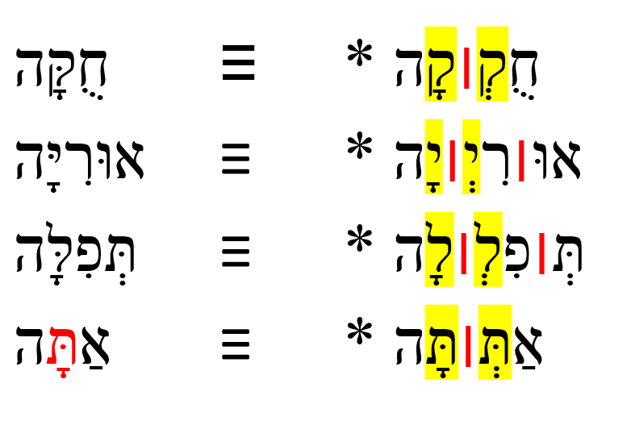
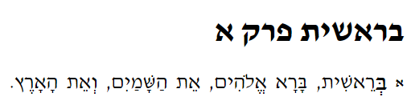
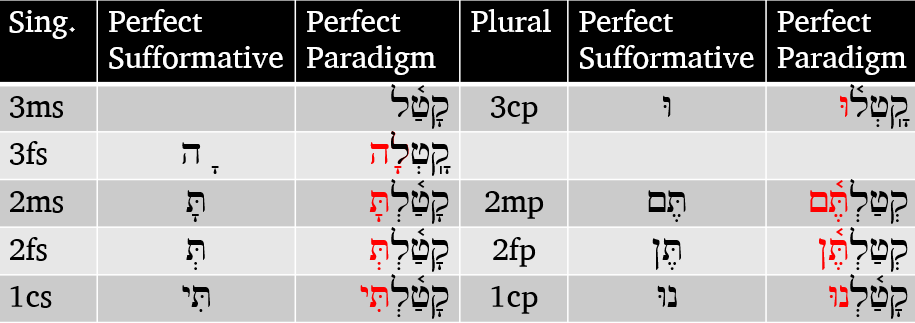
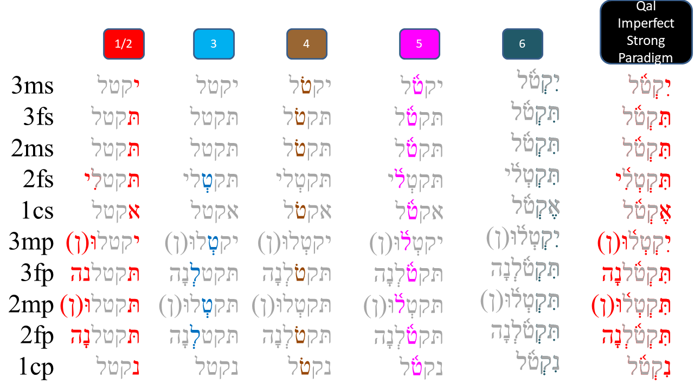

# Cover {.unnumbered}

<small>*Updated*: 2020-12-22</small>

<!--chapter:end:index.Rmd-->

# Navigating this book {-}

In the upper-left corner of this page you will see a series of icons.  

These do the following tasks:

* the file drawer expands/collapses the sidebar table of contents; you can also click `s`
* the magnifying glass toggles search input; you can also click `f`
* the big `A` allows you to change the font size and theme
* the little `i` shows you available keyboard shortcuts

There are several ways to navigate from page to page within this guidebook:

* Use the left-navigation sidebar (type `s` to reveal/hide)
* Click the left or right arrow on each page to go forward or back
* Use the left or right arrow keys on your keyboard to move forward or back
* Use hyperlinks on selected pages, like this one: [Continue to Introduction section](#motivation)

<!--chapter:end:001A-introduction-header.Rmd-->

# (PART\*) Introduction {-}

# Why a Hebrew Grammar course? {- #motivation}

If you are familiar with our ministry, you know our flagship course ***Hebrew Quest***, which introduces our students to the Jewishness of our Messiah and our Bible.

***Hebrew Quest*** was designed to get students into the Hebrew text as quickly as possible, with minimal focus on learning rules. For many of our students, this approach is quite successful; but, we also noticed other students began to drop off between lessons 12 and 16. These are the grammar lessons in between the Aleph-Bet (1-11) and the study passages (17-40). For some, these lessons were too much Hebrew grammar too fast, and for others it was not enough Hebrew grammar.

As we searched for a resource to recommend to these students, we noticed that they tended to fall into one of two camps:

1. <u>A workbook or a series of videos that are entirely self-paced/self-directed</u>. 
    * There may be some exercises, but generally tend to not be rigorous from an academic standpoint.
    * Additionally, with this format, there is no way for a student to get feedback on progress.
    
2. <u>Academic/Seminary level textbooks and courses</u>. 
    * These materials are __extremely__ rigorous with copious amounts of reading, rote memorization of paradigms, and in the case of courses, lectures and exams
    * The textbooks generally are much more detailed and advanced than most of our students need (or would enjoy). For example, there is usually an emphasis on Hebrew writing, such as learning how to convert a noun from singular to plural.
    * The pace of these courses is usually fast, and the stress level is high, focusing on due dates and grades.

Additionally, with either option, our students would incur additional fees to purchase these materials. This is something we wanted to avoid.

Although many of the resources we researched are top-notch, they were not quite what we were seeking for our students.

_(continued)_

## Grammar course wishlist {- #our_course}

---

So what _were_ we seeking?

* In terms of content and rigor, the course would be academically challenging, but it would still be enjoyable with a low-stress level.
* The course would be self-paced for independent learning but provide feedback and encouragement.
* The course must align with our [Holy Language Learning Philosophy](https://holylanguage.com/learning-philosophy.php): emphasize active forms of learning over tons of reading and long lectures. It should seamlessly mesh with _Hebrew Quest_.
* From a technological standpoint, the course must be inexpensive and straightforward to deliver and maintain, while at the same time being high-quality and visually pleasant.
* The course should be easy to use (and if at all possible, free) for our students.
* Most importantly, the course must be Yeshua-centered that approaches learning Hebrew grammar as a spiritual as well as an academic endeavor (which is also a big part of our Learning Philosophy).

We couldn't find a course like this...so we BUILT it ourselves!

### Welcome to Hebrew GRAMMAR Quest - Experience Biblical Hebrew Grammar, the Holy Language Way! {-}

<!--chapter:end:001A-Motivation.Rmd-->

# "Hebrew Quest: Extended Edition" {- #hgq_and_hq}

> The reason we study Biblical Hebrew grammar is so we can better EXPERIENCE Biblical Hebrew

What do we mean by "Hebrew Quest: Extended Edition"?  

Suppose you were to take a hypothetical microscope and inspect Lessons 13-15 of _Hebrew Quest_. In that case, we believe <u>Hebrew GRAMMAR Quest</u> is what you would see. Hebrew GRAMMAR Quest will begin with a brief review of the Aleph-bet and the vowels we learned in _Hebrew Quest_ Lessons 1-12. Then we begin our deep dive into grammar topics touched upon in _Hebrew Quest_ Lessons 13-15.

If you finished _Hebrew Quest_, Hebrew GRAMMAR Quest might be a logical next step.  

On the other hand, maybe you started _Hebrew Quest_ but hit some roadblocks.  In that case, we believe Hebrew GRAMMAR Quest can provide you with important underlying grammatical concepts so, eventually, you can return to _Hebrew Quest_ and finish up.  We're going to help you with this goal. In the second half of this grammar course, we will incorporate several of the [Study Passage](https://holylanguage.com/ot-readings.html) sections of _Hebrew Quest_.  

If you have an interest in learning some of the inner workings of Hebrew, then we'd say you're in the right place!

Here are some additional FAQ about the two courses:

* [What are the differences between _Hebrew Quest_ and Hebrew GRAMMAR Quest?](#difference)
* [Do I need to complete _Hebrew Quest_ before I start Hebrew GRAMMAR Quest?](#complete_hq_first) Quick answer: NO!
* [When I complete this course, should I go back and finish _Hebrew Quest_?](#need_to_finish_hq) Quick answer:: YES!
*  [I haven't started either course.  Which should I do first?](#which_first) Quick Answer: 
    1. Complete _Hebrew Quest_ Lessons 1-15 (don't worry about whether you fully absorb the grammar material in Lessons 13-15)
    2. Hop over to Hebrew GRAMMAR Quest and complete the full course  
    3. When you finish here, return to complete _Hebrew Quest_

<!--chapter:end:001D-hq_and_hgq.Rmd-->

# A Typical Lesson {- #typical-lesson}

In this course, you won't just read; you will DO!  This course is going to be jam-packed with activities.  You'll recognize an activity in this book by `this unique font`.  You can read more in our [Course Structure](#what_to_expect) article. Below is what will be inside a typical lesson<small>^[<small>We are following the same chapter organization as the textbook <u>Basics of Biblical Hebrew</u>, while extensively leveraging supplemental materials created by Dr. John Beckman, which he has generously made available for free to the Hebrew learning community.  See the [Course Structure](#what_to_expect) and our [Acknowledgments](#acknowledgments) pages for additional information.</small>]</small>:

**Title**|**Description**
:-----|:-----
  READING|
The "Why" | A statement that links the lesson's content back to the overarching goal of reading and understanding Biblical Hebrew.  The Why will help to keep us motivated as we deal with the intricacies of each lesson
Lesson Itinerary | The lesson's key learning objectives.
Equipment Check|Things you must have in your backpack before proceeding with the next phase of your journey.
First Thought |A Bible verse from the lesson.
Lesson Points | A brief discussion of the items on the Lesson Itinerary. The goal is to give you just enough information to get started in `Anki`  The Lesson Points will be the numbered sections in each lesson. 1.1, 1.2, etc.
 ACTIVITIES|
 `Word and Verse Warm-ups`|Starting with Lesson 3, these are brief "stretching" exercises before doing the `Anki` workouts, narrated by Izzy!
 `Anki`<small>^[<small>See [appendix](#anki_faq) for more information on Anki if you are not familiar with it.</small>]</small>| This is where the majority of your learning will take place.  There will be three stages to each Lesson.
`A. Vocab`|By the end of the course, you will have around 500 words memorized
 `B. Grammar`|Here, you will work through (and at times grapple with) the main grammar concepts discussed in the Lesson.
 `C. Workbook`| Brief Hebrew word activities to reinforce the grammar concepts
 `D. Study Verses`|You will begin to translate from Hebrew to English. This component may not be easy at first but stick with it!  Keep in mind the goal is translation and comprehension, not rote memorization.
`Worksheets`|Additional activities to reinforce learning (selected lessons)
`Ruth Pursuit`|Similar to the "bag the letter" in _Hebrew Quest_. You will identify examples of grammar concepts in Ruth Chapter 1.
`Hebrew Quest Study Passages`|Beginning with Lesson 17, we will link-up with the Hebrew Quest study passages.
`Quest Quiz`|Self-assessment activity to measure your familiarity with the material.  No grades are recorded or granted in this course. 
`Twelve Tribes Badges` and `Graduation`|Fun things that mark the completion of various stages of your GRAMMAR Quest.

We have also created a Course Checklist to help keep you organized. Instructions for accessing this are on the next page.

Throughout the way you'll see some informational boxes.  Here is what they mean:

::: {.infobox .map}
The Lesson Itinerary - learning objectives
:::

::: {.infobox .stop}
Equipment Check - concepts from previous lessons you should know before starting the next lesson
:::

::: {.infobox .light}
A critical point not to be missed
:::

::: {.infobox .info}
Additional information that is good to know
:::

Minor or parenthetical points will be included as footnotes throughout each lesson.

Our belief is you learn best by doing.  Izzy discusses this is greater detail in the clip below from **Hebrew Quest** Lesson 1:

<iframe class="responsive-iframe" src="https://www.youtube.com/embed/Ex9mBMAqWhI?start=2823" frameborder="0"></iframe>

<!--chapter:end:001E-typical_lesson.Rmd-->

# Quick Start Instructions {.unnumbered #get_started}

These instructions will get you up and running with the course.  We do encourage you to read the other introductory materials before you tackle Lesson 1.

> **Anki NOTE**: Eventually, you can do all work from a mobile device.  _For the initial Anki install, you do need to do these steps from a desktop or laptop_.  The Hebrew GRAMMAR Quest Anki deck can only be imported into the desktop Anki application. 

1. Download and install the [free Ezra SIL font](https://software.sil.org/downloads/r/ezra/EzraSIL-2.51.zip ){target="_blank"}.
1. INSTALL ANKI
    1. [Sign up for a free Ankiweb account here](https://ankiweb.net/account/register){target="_blank"}.
        * This allows you to synch your data from your desktop app to the cloud and to your phone or tablet
    1. [Download and Install the Anki Program (Mac/PC/Linux)](https://apps.ankiweb.net/){target="_blank"}.
    1. [Download the Hebrew GRAMMAR Quest (Preview Version) Anki Deck](./images/Hebrew Grammar Quest PREVIEW.apkg){target="_blank"}
    1. Change the Anki settings [as described here](#anki_settings).
    1. As desired, download the Anki app to your phone or tablet.  
        1. The [Android app](https://play.google.com/store/apps/details?id=com.ichi2.anki){target="_blank"} is free
        1. The [iOS app](https://itunes.apple.com/us/app/ankimobile-flashcards/id373493387?mt=8&ign-mpt=uo%3D4){target="_blank"} is $25 - see discussions in the Appendix for additional discussion as to whether the cost is "worth it"
        1. Synch
            1. In your desktop Anki app, click on synch (enter ankiweb credentials) - you probably want "upload to ankiweb" if asked.
            1. In your mobile app do the same, except here click "download from Ankiweb"
            1. Be sure to repeat the process if you go back and forth between mobile and desktop (be very careful when you select "upload to" or "download from" to make sure your information is flowing in the correct direction!)
1. Download the [course checklist](https://docs.google.com/spreadsheets/d/1t0C7JlygyUqgF_aQWbhq7h3s_VDn0VuvISJn5mp-LdE/edit?usp=sharing){target="_blank"} for you to keep track of your progress in this course.
    * Make a copy:
        * Click `File` then select `Make a copy` to save a copy to your personal Google Drive (recommended)
        * Click `File` then choose `Download` to save a copy to your local computer (you may lose the checkbox functionality when you do this)
        * (PLEASE <u>DO NOT</u> `Request Edit Access`)

    

> Let's get started!

<!--chapter:end:001F-quick-start.Rmd-->

# Report an Issue {- #report_issue}

Please do not hesitate to report errors, omissions, or improvement opportunities (in fact, we'd rather hear about mistakes sooner rather than later)! Feedback is anonymous.  If you have a specific question about the content, you can use the [Get Help](#get_help) page.

[Open form in new window](https://forms.gle/qhBToGubVgmjdFbx6){target="_blank"}

<iframe class="responsive-iframe" src="https://docs.google.com/forms/d/e/1FAIpQLSf3obLnGzJQ6d7Rtyy2YXDln3g-kJWCY-4IlRLE_mnFuWv2AQ/viewform?embedded=true" frameborder="0"></iframe>

<!--chapter:end:001L-issue.Rmd-->

# Get Help {- #get_help}

While this is a self-paced course with no formal instructor or teaching assistant, we do want to provide a way for you to get help if you get stuck.

We request that before you submit a question, you read through the lesson's Seven Points a couple of times, then attempt to do the Anki cards for that lesson.  If you are still unclear, we are here!

Use the form below to ask a question. Please note, we are staffed by volunteers, so please allow a few days for us to research and get back to you.  If you have general feedback or wish to report an issue, please use the [Report an Issue](#report_issue) form.

[Open form in new window](https://forms.gle/tNsvwrhci3nGkvvV6){target="_blank"}

<iframe class="responsive-iframe" src="https://docs.google.com/forms/d/e/1FAIpQLSdWJc7ri0andmyu70D1USeDRtbsrHLaYLNrs0rvI2qBJx-yEg/viewform?embedded=true" frameborder="0"></iframe>

<!--chapter:end:001P-question.Rmd-->

# (PART) Hebrew Grammar Foundations {-}

# The Hebrew Aleph-bet {#alephbet}

> To comprehend Biblical Hebrew, we must have the Aleph-Bet memorized

 

This graphic shows the evolution of Hebrew. Top to bottom: proto-Canaanite (~1600 BCE), paleo-Hebrew (~900 BCE), Rashi (1500 CE), Ketav Stam (used in Torah scrolls and other formal documents), contemporary block, and modern cursive. This course will use the contemporary block style. For more history and discussion on the other script forms, see Hebrew Quest, lessons 2-11.  In this initial lesson we will meet the Hebrew Aleph-Bet.  The letters are like a family, and with any family there can be interesting dynamics (including not always playing nice with each other!).  The bulk of the lesson will take a look at some of those dynamics.

::: {.infobox .map}
**LESSON ITINERARY**

1. Meet the Hebrew Aleph-Bet
1. Understand that Hebrew is written and read from RIGHT to LEFT
1. Identify the group of five letters that have final/Sofit forms
1. Identify the group of six letters that can take a Daghesh Lene
1. Identify the group of four "guttural" letters that cause significant changes in spelling and punctuation (and the one additional letter that sometimes acts as a guttural)
1. Differentiate among "look-alike" letters
1. Note differences between "Seminary" and "Sephardic" pronunciation

:::

::: {.infobox .stop}

**EQUIPMENT CHECK**

If you are eager to jump right in with Lesson 1, we understand totally.  We are also excited for you to start!

"Equipment Check" is where we will pause before each lesson to make sure you have the right tools and supplies in your backpack before heading on the next phase of your Quest.  In future lessons, we will want to make sure you have an understanding of specific concepts before continuing<small>^[<small>See discussion on ["The Fog"](#the-fog) in the appendix</small>]</small>

Before continuing, make sure of the following:

*  You read the [Introduction](#hgq_and_hq)
*  You understand what will [a typical lesson](#typical-lesson) will include
*  You followed the steps on our [Quick Start Instructions](#get_started), are ready go to with `Anki` and have your `Course Checklist` to track your progress
 
:::

## First Thought {-}

### שֵׁם יְהוָה אֶקְרָא {-}

*For I proclaim the name of Adonai  (Deuteronomy 32:3)*  

As you undertake this study, pray for this Grammar adventure to be fruitful.  May God use your growing knowledge of Hebrew as an instrument to advance His Kingdom, and may you never cease to proclaim His Name! 

<figure>
    <figcaption>Listen to this verse in Hebrew, then say it out loud:</figcaption>
    <audio
        controls controlsList="nodownload"
        src="./images/01.Deu3203.mp3">
            Your browser does not support the
            <code>audio</code> element.
    </audio>
</figure>

*****

(\#fig:unnamed-chunk-6)Cove of the Sower - suggested location where Yeshua proclaimed the words of Adonai to the crowd in Mark 4:1. Courtesy of the [Pictorial Library of Bible Lands](https://www.bibleplaces.com)

<small>Note: acoustic tests have been performed at this location that have confirmed that a person in a boat in the middle of the cove can _easily_ be heard without amplification by people sitting on these rocks several hundred feet up the embankment (and Yeshua didn't have to deal with road noise!).  A description of the acoustics study can be found in the following article: Crisler, B. "The Acoustics and Crowd Capacity of Natural Theaters in Palestine." Biblical Archaeologist, vol. 39, no. 4 (1976):128–41.</small>

## The Hebrew Aleph-Bet {#consonants}

Almost every other grammar book would start with a lengthy description of each letter, how to write it, and how to pronounce it.  We omit this because this is (and much more!) covered in detail in [_Hebrew Quest_ Lessons 2-11](https://holylanguage.com/letters.html){target="_blank"}.  The points below and on the following pages will provide some foundations so your grammar journey gets started in the right direction.

* All letters you see in the picture of the Aleph-Bet above are classified as "consonants."

* Whereas English has the vowel letters (A, E, I, O, U) as a core part of the Aleph-Bet, Hebrew treats vowels differently

* א and ע are not vowels but silent consonants; in Sephardic pronunciation, they take on the pronunciation of their associated vowel (if there is one)

* We'll talk about vowels in Lesson 2

## Hebrew is written and read from RIGHT-to-LEFT {#right_to_left}

Note the front of a Hebrew book is in the same location as the back of an English one:

* To our western eyes, this looks "backward" (but Israelis would say _we_ are reading backward!)

* When reading Hebrew, always start at the "back" and go from RIGHT to LEFT

*****

See **Hebrew Quest** discussion on Right to Left:

<iframe width="560" height="315" src="https://www.youtube.com/embed/4xKQSvRvmN8?start=108" frameborder="0" allow="accelerometer; autoplay; clipboard-write; encrypted-media; gyroscope; picture-in-picture" allowfullscreen></iframe>

## Five "KiMNePaTZ" letters have different final forms {#sofit_letters}

* Hebrew does not have capital letters the way English does, but a somewhat similar concept is five letters take what are called “Final” or “Sofit”<small>^[<small>_Sofit_ is just the Hebrew word for final</small>]</small> forms when they appear at the END of a word
    * Those letters are in red text above
* The names of these letters is quite simple
    * Take the letter Kaf כּ, which is the first letter in the Aleph-bet with a sofit form
    * The final form is named Kaf Sofit ך. Same for Mem מ and Mem sofit ם and so on<small>^[<small>"Final Kaf," "Final Mem," etc., are also terms you may hear.</small>]</small>
* The five letters that have these forms are the letters, Kaf, Mem, Nun, Pei, and Tsaddi: ך ם ן ף ץ
* You can remember the acronym, KiMNePaTZ, which is the made-up word you get when you string the five letters in a row
* The KiMNePaTZ sofit forms can look like other letters - your `Anki` work for this Lesson will give you practice with identifying look-alike letters

## Six" BeGaD KePHaT" letters take a Daghesh Lene {#daghesh_lene}

* The next sub-group of letters you need to study are the "BeGaD Kephat" letters<small>^[<small>See also Lesson 3 of Hebrew Quest</small>]</small>
* The red dot in the above letters is called a **DAGHESH LENE**
* The Daghesh Lene is inserted into the middle of the consonant
    * The pronunciation of the letter is hard if the Daghesh Lene present or soft if not present
        * so ב has a "soft b" sound, in other words a "v" sound
        * בּ has a "hard b" sound, in other words a "b" sound
        * כ sounds like the "ch" in "bach", while כּ is "k" as in "kite"
        * פ is the "ph" in "phone", while פּ is the "p" in "pull"
    * The Daghesh Forte ONLY applies to Bet - Gimmel - Dalet - Kaf - Pei - and Tav 
* At one time, all six of these letters had different pronunciations, but today, only three do.  These are the letters in blue above: **בּ כּ פּ**
    * Since the letters without the Daghesh Lene want to be "lazy" - for example a weak 'v' instead of a strong 'b'- our mnemonic for these is "BuCK uP! You Lazy Letters!"

::: {.infobox .info}
We’ll dig deeper into the Daghesh Lene and its much more important twin, the Daghesh Forte, over the next few lessons.
:::

## We classify four consonants as **Gutturals** (and one is a sometimes-guttural) {#gutturals}

* There are four proper gutturals: Aleph, Hei, Chet, and Ayin (in red above)
 * The letter Resh ר (in orange above) is not formally a Guttural; but since it can’t decide whether to behave or not, sometimes we include Resh with the other Gutturalsl
* We like to say that the gutturals will be our trouble-makers because they tend not to play nice with the other Hebrew rules 
    * The good news is the behavior of the Gutturals and Resh is entirely predictable
    * We will learn this over the next few lessons (and indeed, the rest of the course) 
* For now, memorize the group of four guttural consonants in red and Resh, the sometimes-guttural-like letter in orange.

::: {.infobox .info}
Learning how the Gutturals behave and what spelling changes they cause is one of the most critical facets of Hebrew grammar
:::

## Look out for look-alike Letters {#look-alike-letters}

* Hebrew has many letters that can look similar, especially to someone just learning the Aleph-bet
    * The `Anki` deck will give you practice on distinguishing these.
    * Also, in Hebrew Quest, when Izzy reviewed the Aleph-Bet in lessons 2-11, he talked about each letter’s "twin" and how to spot the difference 
    * We encourage you to revisit those [letter lessons](https://holylanguage.com/letters.html). 

## Sephardic vs "Seminary" Pronunciation {#pronunciation}

* There are some notable differences between what we might call academic or "seminary<small>^[<small>"Seminary Hebrew" is a term borrowed from Dr. John Beckman. We don't say "Seminary Hebrew" to be disrespectful; we only mean to differentiate between the two pronunciation types.</small>]</small>" Hebrew and "real-world" Hebrew.  Seminary pronunciation is in red above, while Sephardic pronunciation is in blue.
    * Real-world Hebrew is based on Sephardic pronunciation
* We've already talked about how only three of the Daghesh Lene letters need to "buck up"
* With "Seminary Hebrew," the ג without the Daghesh Lene receives something like the GH in "aGHast." The ד and ת without the Daghesh Lene are closer to the English DH/TH like "this." 
* Another difference between Sephardic and Seminary pronunciation is how to pronounce ו 
    * In academia, the consonant receives the "w" sound and is called "Waw." 
    * In most non-academic circles, it receives the "v" sound and is pronounced "vav."
* There are also significant differences in pronouncing vowels, which we will talk about in Lesson 2.
* For the most part, Hebrew GRAMMAR Quest will follow the Sephardic pronunciation
* We will use "Adonai" or "the LORD" when we encounter the Covenant Name.

## Lesson Conclusion and Activities {-}

Congratulations on completing your first lesson.  If you look to the left, you should see 1.1 through 1.7 (hit the `s` key if you don't see the sidebar).  After each lesson, take a moment to review list of the Seven Practical Points. Don't hesitate to go back and re-review anything that might be a bit fuzzy.

Now we'll move into the Physical Activity<small>^[<small>If you're wondering why we call it a "physical" activity, see [this discussion](#physical) in the appendix.</small>]</small> stage of the Lesson.  This is where you take what you learned above and put it into practice using `Anki`.  For this lesson, we also have a `worksheet` and an additional writing activity.

### `Anki` {- #anki-1}

* `Lesson 01 A. Vocab` - Learn (or relearn) the Aleph-Bet with Izzy. 
* `Lesson 01 B. Grammar` - Identify look-alike Hebrew letters.
* `Lesson 01 C. Study Verses` - we won't be working on any Study Verses just yet, but we will learn some grammar shorthand that we will use when we get to Lesson 3.

Access Anki using your mobile app, desktop version, or [the web-based version (login may be required)](https://ankiweb.net/decks/){target="_blank"}

### `Worksheets`: Letter Writing {- #worksheets-1}

1. Practice writing the letters individually using the [Letter Writing worksheet](https://drive.google.com/file/d/1JcX8kc6e-fKjtzkeE96AwoZFshEpx3ug/view){target="_blank"}
    * If you would like some tips on how to write the letters, you can use [this guide](https://drive.google.com/file/d/1cmrCXcafjwvbMNj7GgX7UPMGA0FcwvWN/view?usp=sharing){target="_blank"} from Dr. Beckman.
    * As we've said before, we strongly encourage everone to watch (or re-watch) the [_Hebrew Quest_ lessons on the Aleph-Bet](https://holylanguage.com/letters.html){target="_blank"}
    
2. Practice writing the entire AlephBet until you can do it FIVE times from memory.  This will also be an instruction on the Quest Quiz.

## `Ruth Pursuit` {-}

You can do this activity online using Google Docs, or you can download/print and use physical highlighters.

* Google Docs: Click the link to open a [blank copy of Ruth Chapter 1](https://drive.google.com/file/d/1qcfTKAlTJGChC2eYCMhSbY2w-ibzCcDV/view?usp=sharing){target="_blank"}.  You may need to sign in with a Google account.  Now click "Open with Google Docs" to highlight the letters.
* Download/Print: click the same link, then you should see options on the upper right of your screen to print or download (Word format).

### Your Quest: {-}

1. Identify the four guttural letters in Ruth chapter 1(pink)<small>^[<small>The color is to let you know what color the answer key will use, but feel free to highlight in any color, underline, change the font color, or otherwise identify anyway you like.</small>]</small>
2. Identify the one half-guttural (red)
3. Identify the six BeGaD KePHaT letters, both with and without the Daghesh Lene, for a total of 12 letters (green)
4. Identify the five final/sofit forms (blue)
5. Identify the 12 remaining consonants not included in the above categories (including both forms of ש)(yellow)

* [Ruth Pursuit #1 Answer Key](https://drive.google.com/file/d/1vG8hKR50KcB0NclBnRWYPYMCEnobjgLc/view?usp=sharing){target="_blank"}

## `Quest Quiz` {-}

[Open Quest Quiz #1 in a new window](https://docs.google.com/forms/d/e/1FAIpQLSeqHcE8PvfkOYbTu51cNO8sf-ln6CEnRrcTBUxM0EaeojSSsA/viewform){target="_blank"}

<iframe class="responsive-iframe" src="https://docs.google.com/forms/d/e/1FAIpQLSeqHcE8PvfkOYbTu51cNO8sf-ln6CEnRrcTBUxM0EaeojSSsA/viewform?embedded=true" frameborder="0"></iframe>

<!--chapter:end:01-Alephbet.Rmd-->

# Hebrew Vowels {.vowels}

<!-- Grammarly check: 10/24/2020 213 lines -->

> To comprehend Biblical Hebrew, we must understand how words are formed and pronounced

Even though our goal may not necessarily be to converse in Biblical Hebrew, hearing the sound of the language aides our learning.  Vowels are what give a language its distinctive sound.  In Hebrew, the same three consonants can change meaning depending on the vowel combination.

As Izzy says in Hebrew Quest, “Vowels are important.”  On your screen, you see Genesis 1:9.  The black font shows the text with no vowels. Over time, a group known as the Masorites developed the vowel notation we use today. These are the symbols in red.  These are usually under, but sometimes in the middle of or over the affected consonant. This vowel system intends to preserve the pronunciation passed down for centuries via the oral tradition. The Hebrew name for these diacritical dots and dashes is _nikudot_. The blue font shows additional cantillation marks, which synagogues use for chanting the verses.  These marks also show where the word's accent is.<small>^[<small>Image Source: Originally uploaded as en:File:Example of biblical Hebrew trope.svg on 04:27, 19 November 2006 (UTC) by en:User:SyntaxError55. </small>]</small>

::: {.infobox .map}
**LESSON ITINERARY**

1. Memorize vowels that are not vowel letters
1. Learn vocal sheva and silent sheva
1. Memorize the vowel letters
1. Meet "defective" and "plene" spelling 
1. Meet Daghesh Lene's twin, Daghesh Forte
1. Know the rule for a Daghesh Forte
1. Know that the Gutturals and Resh reject Daghesh Forte
::: 

::: {.infobox .stop}
**EQUIPMENT CHECK**

Before continuing, can you recite the following groups of letters from memory?

* All twenty-two consonants of the Hebrew Aleph-Bet 
* The six BeGaD KePHaT letters
* The five KiMNePaTZ letters
* The four guttural letters and the one sometimes-guttural letter
:::

## First Thought {-}

###  הֵמָּה רָאוּ מַעֲשֵׂי יְהוָה {-}

*They have seen the works of Adonai (Psalms 107:24)*

Reflect on the works of HaShem that you have seen.

<figure>
    <figcaption>Listen to this verse in Hebrew, then say it out loud:</figcaption>
    <audio
        controls controlsList="nodownload"
        src="./images/02.ps107024.mp3">
            Your browser does not support the
            <code>audio</code> element.
    </audio>
</figure>

*****

(\#fig:unnamed-chunk-16)Plain of Bethsaida - suggested location where 5000 saw the works of Yeshua (Mark 6). Courtesy of the [Pictorial Library of Bible Lands](https://www.bibleplaces.com)

## Vowels that are not vowel letters {#vowels}

### Vowels come in three types: Long, Short, Reduced | Vowels come in five classes: A, E, I, O, U {-}

Like the Aleph-bet, we are going to have to commit the vowels in the table below to memory. You will do this in `Anki`. Knowing the vowel types and classes will make your grammatical life much more comfortable in the future.  

* The letter בּ is provided as a placeholder
* Say the vowel _after_ saying the associated consonant<small>^[<small>We will learn that Hebrew loves to break the rules.  In the next lesson, we will learn about an exception to the "vowel comes after" rule, called the *furtive patach*.</small>]</small> So the first vowel example is "baw" not "awb".
*  Future lessons will explain the difference between Qamets and Qamets Hatuf

::: {.infobox .light}
Only **gutturals** take the "Hateph" vowels - to make it easier, we can pronounce all three Hateph vowels like the A in <u>A</u>muse

Hateph vowels are used because Gutturals reject vocal sheva (2.2)
:::

## Vocal and Silent Sheva {#sheva}

* Both are written as בְּ 
  * Both mark the END of a syllable
* VOCAL Sheva<small>^[<small>Many academic textbooks will use the term "Shewa" instead of "Sheva". Both words mean the same thing.</small>]</small> is a REDUCED vowel 
  *  Only non-gutturals can take a Vocal Sheva
      * Gutturals **reject** the Vocal Sheva and take the Hateph vowels instead
    * Pronounced like the A in <u>A</u>muse (same as Hateph Patach)
* SILENT Sheva is NOT A Vowel
    * <u>Any</u> letter can take a Silent Sheva
    * Silent/ No sound
    
::: {.infobox .info}
 We will learn how to distinguish between the two kinds of Sheva in the next lesson
:::

It is worth pointing out that in Hebrew Bibles you may come across a mark that looks like a super-sized sheva.  In English, we might say it looks like a colon (:).  In Hebrew this mark is called a sof pasuq and it is used to mark the end of the verse.  It is no other effect on grammar or pronunciation.  (סוֹף=end; פָּסוּק=verse).  And while we're on this note, sometimes you may see a vertical line |.  This has no meaning for us whatsoever.  You may ignore it when you encounter it.

## Vowel letters {#vowel_letters}

### Vowel letters use a consonant plus a nikkud to form a vowel {-}

Another table to memorize:

* Shureq is pronounced like Qibbuts (r<u>u</u>ler)
* Hireq Yod is pronounced like the i in mach<u>i</u>ne
* All others are pronounced like their non-vowel-letter counterparts
* Yod and Vav vowels - י,ו 
    * These are Long Vowels that do not reduce
    * Therefore they are called "irreducible (unchangeable) long vowels"<small>^[<small>We'll explain what this means in the next lesson</small>]</small>
    * These occur in the middle or at the end of a word

::: {.infobox .info}
If the Yod or Vav has a vowel of it's own, then the Yod/Vav is acting as a _consonant_, not an irreducible long vowel.
:::

* Hei Vowels - ה
    * Seghol Hei is a short vowel - the other Hei vowels are long
    * Hei vowels **ONLY** occur at the end of a word (often called "word-final hei")
    * Hei vowels are extremely common in Hebrew

## "Defective" and "plene" spelling {#defective_spelling}

In "defective" spelling, letter vowels can sometimes drop their letter and take on the corresponding non-letter vowel. The meaning of the word doesn’t change.

This is the word for "laws" showing both "plene" spelling (left) and "defective" spelling (right):

* Three vowel letters commonly take "defective" forms<small>^[<small>"Defective", in this sense, does not have a negative connotation.</small>]</small>
    * Holem-vav can drop the Vav and contract to Holem, as in the example above
    * Hireq-Yod can drop the Yod and contract to Hireq
    * Shuruq can drop the Vav and it's associated nikkud and contract to Qibbuts
    
The qamets-hei ה ָ  sometimes drops the final ה, leaving just the qamets under the now-final letter.

::: {.infobox .info}    
As you progress, you’ll start to develop a mental checklist when you encounter something that does not seem to follow the normal/regular rules. Asking yourself “Could this be a defective spelling?” will be one of those checklist items.
:::

## The Daghesh Forte Doubles the Consonant {#daghesh_forte}

Notice the שּׁ in הַשָּׁמַיִם:

 
* Since שׁ is not a בגד כפת letter, we know this *cannot* be a Daghesh Lene, but it is a Daghesh **Forte**
* The letter with the Daghesh Forte both ends one syllable and begins the next syllable
* If we were to syllabify  הַשָּׁמַיִם, it would look something like the bottom line in the picture above (pronounce: `hash-sha-mayim`)<small>^[<small> `Mayim` is one syllable as we will learn in Lesson 3.  הַשָּׁמַיִם means "the heavens."  From now on, we won't always provide a translation for every new word you encounter.  It's more important that you focus on the concepts.  You will have PLENTY of vocabulary work in Anki!</small>]</small>
* A similar word in English might be better = bet | ter
    * If we were to transliterate better into Hebrew hypothetically,  it might look like: בּטֶּר*<small>^[<small>The * means this is not a real Hebrew word, but we show it in this form for illustration.</small>]</small>
* Notice the syllable breaks in these words that have a Daghesh Forte:

* Any consonant (except for Gutturals and Resh) can take a Dagesh Forte, including a בגד כפת letter, which can take either a Daghesh Lene or a Daghesh Forte
    * The "Buck-up" letters will take the **hard** pronunciation regardless of a Daghesh Lene or Daghesh Forte - See the final word אַתָּה in the image above
    * "Any consonant" includes the Vav ו.  When a Vav has a Daghesh Forte it looks like this וּ. Does that remind you of anything?  Maybe something we just discussed on the previous page?
        * That's right. A Vav with a Daghesh Forte וּ is identical to a Shurek וּ.
        * It's surprisingly easy to tell the difference: if there is an additional vowel either under or over the same letter, or if the preceding consonant has a vowel, the letter is a Vav with Daghesh.  A Shurek will _never_ have an additional vowel following or preceding.

_Advanced tip:_ When you see a Daghesh Forte, it often means that another letter has disappeared<small>^[<small>Not entirely unlike the English apostrophe in words like _can't_.</small>]</small>.  We will talk more about this later in the course.

::: {.infobox .info}
It's good to think of the Daghesh Forte as the "Doubling Daghesh", since it doubles the consonant, and often changes a word's meaning.  

Conversely we can think of the Daghesh Lene as the "Meaningless Daghesh", since it does not ever change a word's meaning
:::

## Daghesh Forte Rule {#daghesh_forte_in_bgdkpt}

::: {.infobox .light} 
A Daghesh is a Forte if, and only if, it's preceded by a vowel that is not a Sheva
:::

That's it.  That's the rule<small>^[<small>Strictly speaking, there are exceptions, but you won't encounter them in a first-year Hebrew course</small>]</small>.  

Quiz yourself with these examples (answers below):

* אַתָּה = Is the Daghesh preceded by a vowel that is not a Sheva?<small>^[<small>Yes, a patach. Daghesh Forte</small>]</small>
* בְּרֵאשִׁית = Is the Daghesh preceded by a vowel that is not a Sheva?<small>^[<small>No. Daghesh Lene</small>]</small>
* עַל־פְּנֵי = Is the Daghesh preceded by a vowel that is not a Sheva?<small>^[<small>No. Daghesh Lene.  The "hyphen" looking mark is called a Maqquef.  It has the same function as the Hyphen does in English.</small>]</small>
* מַבְדִּיל = Is the Daghesh preceded by a vowel that is not a Sheva?<small>^[<small>No, it is preceded by a Sheva. Daghesh Lene.</small>]</small>
* מִתַּחַת  = Is the Daghesh preceded by a vowel that is not a Sheva?<small>^[<small>Yes, a Hiriq. Daghesh Forte</small>]</small>

## Gutturals and Resh reject Daghesh Forte {#gutturals_reject_daghesh_forte}

* We said in Lesson One that the Gutturals don’t play nice with the other Hebrew Rules, and this rejection of the Daghesh Forte is one of those ways
* A Hebrew collision like this means something has to give. . . and the gutturals tend to get their way.
* It's like they have a force-field shielding them from other Hebrew grammar rules!

(\#fig:unnamed-chunk-22)That's no moon.  That's a Guttural!

* A large chunk of any Hebrew grammar course involves learning to resolve these guttural entanglements.
* You may see הּ. This dot is not a Daghesh but what is called a mappiq.  We'll talk more about the mappiq in Lesson 6.

## Lesson Conclusion and Activities {-}

Congratulations on completing the vowels lesson.  Make sure you know that Daghesh Forte rule and the guttural behavior  The Daghesh Forte is our Hebrew friend who can tell us a great deal about what is happening grammatically with a word.  

We're about halfway through the first stage of the course on Hebrew Grammar Foundations.  Keep going! You're doing great!  After you finish all of the activities for this lesson, you can claim the first of our `Twelve Tribes Badges`. 

Take a second to review the section headings 2.1 - 2.7 on the left side of the screen before heading on to tackle the activities.

### `Anki` {-}

* `Lesson 02 A. Vocab`
* `Lesson 02 B. Grammar` 
* `Lesson 02 D. Study Verses`
  * Bible verses will arrive next Lesson
  * In this module, we will be learning common Hebrew names.
  * Sound out the words using your knowledge of Hebrew consonants and vowels.
  * As a general hint, with a couple of exceptions, the English names are pretty close to how they sound in Hebrew.
  
Access Anki using your mobile app, desktop version, or [the web-based version (login may be required)](https://ankiweb.net/decks/)

### `Vowel worksheet` {-}
* Practice writing the vowels using the [Vowel Writing worksheet/drill](https://drive.google.com/file/d/1ETPKE3u-XGfpNdKmlIr3P_DRbkOOlcI_/view?usp=sharing){target="_blank"} See note<small>^[<small>ignore the "transliteration" column.  An answer key is on page two.  Repeat this worksheet until you can complete it correctly entirely from memory.</small>]</small>

## `Ruth Pursuit` {-}

### Your Quest: {-}

1. Identify the four UNCHANGEABLE LONG vowels that use YOD in Verse 1 (blue)<small>^[<small>In most word processors, you won't be able to isolate the vowel to highlight. Get as close as you can.</small>]</small>|
2. Identify the two UNCHANGEABLE LONG vowels that use VAV in Verse 1 (Green)
3. Identify QAMETS HEI in Verse 1.  There is a TSERE Hei between Verses 5-10.  Can you find it?<small>^[<small>The other vowels that use hei are less common, but we will see them when we discuss verbs.</small>]</small> (Purple)
4. Identify the three LONG vowels in Verse 1 (that are not part of a vowel letter) (pink)|
5. Identify three of the five SHORT vowels in Verse 1 (that are not part of a vowel letter)<small>^[<small>We haven't learned to spot Qamets Hatuf yet, and Qibbuts does not appear in this passage</small>]</small> (red)
6. Five the three REDUCED/HATEPHH vowels, including Hateph Qamets Hatuf<small>^[<small>You should be able to make out the word that has the Hateph Qamets Hatuph</small>]</small>.  They are in verses 2-4. (grey)
7. One of the more common verbs in the Tanach is **וַיֹּאמֶר **, which means "(and) he said. 
    * Vav-Patach-**Yod**-Daghesh Forte --וַיּ to start a verb means "And he (did or was something)  
    * If we change the second consonant from a Yod to a **Tav**, we get --וָתּ, "and **S**he (did or was something).  
            * Thus, וַתֹּאמֶר means "and she said."  
            * Challenge: Find the five instances of וַתֹּאמֶר in Ruth Chapter 1<small>^[<small>In at least three of the cases, you should be able to figure out who is speaking.</small>]</small>  (yellow)  

* [Blank copy of Ruth Chapter 1](https://drive.google.com/file/d/1qcfTKAlTJGChC2eYCMhSbY2w-ibzCcDV/view?usp=sharing){target="_blank"}

* [Ruth Pursuit Answer Key #2](https://drive.google.com/file/d/1xtcXRb1PWbt-qkbVWW9yGfkC40_d8gtf/view?usp=sharing){target="_blank"}
        
## `Quest Quiz` {-}

[Open Quest Quiz #2 in a new window](https://docs.google.com/forms/d/e/1FAIpQLSeq_9Cy5IlAKDFy8nx9GNC3dfs5l5bJ_iX2FJ0Az7rPKXq5Jw/viewform){target="_blank"}

<iframe class="responsive-iframe" src="https://docs.google.com/forms/d/e/1FAIpQLSeq_9Cy5IlAKDFy8nx9GNC3dfs5l5bJ_iX2FJ0Az7rPKXq5Jw/viewform?embedded=true" frameborder="0"></iframe>

## Claim your `Twelve Tribes Badge`! {- #twelve-tribes-badge-1}

If you have completed **all activities** in Lessons 1 and 2, you may claim the first of our "Twelve Tribes" badges<small>^[<small>Once published, the full thirty-five lesson course will have a badge to be claimed after every two to three lessons.  There is only one badge available in the preview version of the course.</small>]</small>.

[Check the requirements here](https://docs.google.com/spreadsheets/d/1t0C7JlygyUqgF_aQWbhq7h3s_VDn0VuvISJn5mp-LdE/edit?usp=sharing){target="_blank"}, then complete the certification and claim your badge below:

<iframe src="https://docs.google.com/forms/d/e/1FAIpQLSeFujHNSMAZ5ZjJbNsr7pFJnma5RGwG-7StAR1uvevGe_5zvg/viewform?embedded=true" width="640" height="691" frameborder="0" marginheight="0" marginwidth="0">Loading…</iframe>

<!--chapter:end:02-Vowels.Rmd-->

# Syllabification and Pronunciation {#Syllabification}

> To comprehend Biblical Hebrew, we must know how syllables function

Originally, the Bible and other ancient documents, were written without spaces.  In addition to vowels, the ancient scribes and readers organically adopted a system of syllables and accents.  They knew where one word ended, and another began without needing to write it down.  

What we call "Hebrew grammar" is truly an exciting journey into the system of spoken and written Hebrew, which had its formation thousands of years ago!

::: {.infobox .map}
**LESSON ITINERARY**

1. Learn the two basic concepts of Hebrew Syllables
1. Learn the rules and terminology related to Hebrew Word Accents
1. Know the Three Rules for Recognizing Silent Sheva
1. Know the Four Rules for Recognizing Vocal Sheva: Four Rules Gutturals Reject Vocal Sheva
1. Learn the primary Hebrew Diphthong
1. Understand Vowels and Syllable Preference
1. Learn three simple miscellaneous concepts: Qamets and Qamets Hatuf, Furtive Patach Quiescent Alef
:::

::: {.infobox .stop}
**EQUIPMENT CHECK**

Before continuing, can you describe the following concepts?

* The vowels that are not letters, including their type (long, short, reduced) and class (a,e,i,o,u)
* The vowels that are letters, including which are the "irreducible long" type
* The difference between a Daghesh Forte and a Daghesh Lene
:::

**The authors of <u>Basics of Biblical Hebrew</u> believe Lesson 3 could be the most challenging chapter in the book.** 

Suppose you do not have the vowels and, chiefly, the vowel types memorized. In that case, this chapter will be all the more difficult.

Assuming you've checked your equipment as directed above, and everything is in tip-top shape for your Lesson 3 adventure, take your time.  Work through the written material, then do a little Anki work and see if it starts to click. 

If not, then come back here and re-read the material again. Then go back to Anki.  If you find yourself getting frustrated, take a break, and come back to it later.  Continue to work through "the fog."

You absolutely must have the concepts from this lesson hard-wired before you continue to Lesson 4.  The good news is that once you get this lesson down, the ones that follow will be relatively straightforward.

In addition to all of these new concepts, the authors have also seen fit to introduce a full set of vocabulary words AND study verses beginning with Lesson 3.  So the overall workload will increase, starting with this lesson.

We're praying for you in advance as we compile this section!  Now, climb the mountain!

## First Thought {-}

###  אַשְׁרֵי אָדָם לֹא יַחְשֹׁב יְהוָה לוֹ  {-}

*How blessed is the man to whom the LORD does not impute iniquity  (Psalms 32:2)*

Thank God for his blessings and meditate upon them.

<figure>
    <figcaption>Listen to this verse in Hebrew, then say it out loud:</figcaption>
    <audio
        controls controlsList="nodownload"
        src="./images/03.Ps3202.mp3">
            Your browser does not support the
            <code>audio</code> element.
    </audio>
</figure>

*****

(\#fig:unnamed-chunk-23)Mount of Beatitudes and Sea of Galilee - suggested location of Yeshua's eight blessings in Matthew 5:3-12. Courtesy of the [Pictorial Library of Bible Lands](https://www.bibleplaces.com)

## Hebrew Syllables {#syllables}

There are two basic concepts when it comes to Hebrew Syllables:

::: {.infobox .light}

1. Every syllable begins with one consonant and has only one vowel
2. There are only open or closed syllables 

:::

We see the two basic concepts at play in this simple word (pronounced "da-var" and means word, matter, thing):

* The two syllables each begin with a consonant and have one vowel
    * דָּ starts with the consonant Dalet and has one vowel, Qamets
      * This is also an example of an "open" syllable - open syllables end with a _vowel_, not a consonant
    * בָר starts with the consonant Bet and has one vowel, also a Qamets
      * This is an example of a "closed" syllable - closed syllables end with a _consonant_, not a vowel 
* If you need to know how many syllables are in a Hebrew word, count the vowels
    * Remember that vowel letters, such as the Hiriq-Yod, and Diphthongs we will see later in this lesson, count as a single vowel unit

## Hebrew Word Accents {#accents}

::: {.infobox .light}
* Most frequently, Hebrew words are accented on the last syllable  
* If not, then the accent will be on the next-to-last syllable<small>^[<small>Later in the course, we will learn about a mark called a maqqef, which is like a hyphen in English.  In Hebrew, the word to the right of the maqqef technically does not have an accent.</small>]</small>
* Reduced vowels and Sheva never take an accent. If there is a word-final Sheva, the accent will be on the next-to-last syllable 
:::

Unlike English, Biblical Hebrew words are never stressed anywhere else<small>^[<small>Modern Hebrew has words (mostly borrowed from other languages) that don't always follow this rule</small>]</small>.

* The word on the left is stressed on the last syllable
* The word on the right (pronounced "SAY-pher" and means book, scroll, or document) is stressed on the next to last syllable
    * Some texts will place a mark over the syllable to be stressed (except when it is on the last syllable)<small>^[<small>Hebrew has a very elaborate system of [cantillation marks](https://en.wikipedia.org/wiki/Hebrew_cantillation){target="_blank"} that also serve to indicate where the accent of the word is. are used for chanting and singing.  A study of these marks is beyond the scope of this book.</small>]</small>

## Tonic, Pretonic, and Propretonic Syllables

* We will encounter specific terms for a syllable's position respective to the word's accent
* Let's use the plural of דָּבָר to illustrate: דְּ ׀ בָ ׀ רִים
    * The **Propretonic** syllable is two (or more) steps away from the accent = דְּ
        * Notice how the vowel changed from the Qamets in דָּבָר to a Vocal Shewa in דְּבָרִים
        * This vowel shortening of the propretonic syllable is called _Propretonic Reduction_ and is extremely common in Hebrew
        * Qamets and Tsere will become Sheva (or hateph patach/hateph seghol)
    * The **Pretonic** Syllable is the syllable immediately before the accented syllable = בָ
    * The **Tonic** syllable is the one with the accent = רִים<small>^[<small) If there is a syllable AFTER the accented syllable, technically it is called "Posttonic," but you will not reencounter this term for the remainder of this course.  </small>]</small>
    
## Ultima, Penultima, and Antepenultima syllables

Since the accent is not always in a fixed location, we sometimes will use other words that describes a syllable's position irrespective of the accent. 

  * _ultima_ = the last syllable
  * _penultima_ = the next-to-last syllable - this is also called the "penult" syllable
  * _antepenultima_ = the syllable(s) before the _penultima/penult_
  

## Rules for Silent Sheva {#s_sheva}

Learn the three rules for differentiating a SILENT Sheva from a Vocal Sheva:

### A Sheva is SILENT when the previous vowel is short: {-}

### A Sheva is SILENT when the first of two consecutive Shevas _within a word_: {-}

### A Sheva is SILENT when at the end of a word: {-}

## Rules for Vocal Sheva {#v_sheva}

Learn the four rules for differentiating a VOCAL Sheva from a Silent Sheva

### A Sheva is VOCAL when the initial Sheva in a word: {-}

### A Sheva is VOCAL when the second of two consecutive Shevas _within a word_<small>^[<small>A Sheva at the **end** of a word is **always silent**, even when it is the second of two consecutive Shevas.</small>]</small>:  {-}

### A Sheva is VOCAL when under a Daghesh Forte: {-}

### A Sheva is VOCAL after an unaccented long vowel: {-}

This one may seem random, but it is relatively common with _long_ vowels in a propretonic position<small>^[<small>These vowels often but do not always reduce (see section 3.6). Unchangeable long vowels will never reduce.</small>]</small>  The word above is not kōṯ-vim but kō-ṯᵉ-vîm.

## Hebrew Diphthong = Accented Patach-Yod-Hiriq {#diphthong}

::: {.infobox .light} 
The diphthong is a single vowel unit, which means it is only one syllable
:::

We do not pronounce as "BUY-it", but monosyllabic, like "BITE"<small>^[<small>With this said, "buy" it makes a handy mnemonic for remembering this word means 'house', as there are a few look-alike words.</small>]</small>; and not "sh-MAY-im" but it sounds more like "sh-MIME"

*****

Qamets-Yod-Vav is another Diphthong that you'll see in Lesson 9.  It's the pronoun suffix endings for "his" or "him". 

* אֵלָיו (to him) pronounced 'eLAV.
* פָּנָיו (his face) pronounced paNAV

There is scholarly disagreement as to whether (vowel)+Yod are vowel letters or diphthongs.  <u>Basics of Biblical Hebrew</u> treats them as vowel letters.

## Vowels and Syllable Preference {#vowel_pref}

This table may seem like minutiae, but do yourself a favor: memorize it, noting the following:

* *In an open pretonic syllable, Hebrew REQUIRES a long vowel.
* *In a closed unaccented syllable, Hebrew REQUIRES a short vowel.
* **Open/Propretonic _must_ reduce from a long vowel to Vocal Sheva (or Hateph if guttural), _except_ when there is an unchangeable long vowel
  * Go back and look at דָּבָר and דְּבָרִים
    * The vowel preference table explains why the vowel under the Dalet changes from Qamets in the open pretonic to Vocal Shewa (reduced vowel) in the open propretonic when the plural suffix "im" is added
    * This is called "_propretonic reduction_" - you will encounter this topic frequently.   
  * As we saw with כֹּתְבִים, uunchangeable long vowels written "defectively" will not reduce - at their essence, they are still unchangable.

## Qamets Hatuf, Furtive Patach, Quiescent Alef {#misc_vowels}

These are three miscellaneous but straightforward rules.

::: {.infobox .light} 
Qamets Hatuf ONLY occurs in a Closed AND Unaccented syllable

:::

There are many instances where the vowel could be a short qamets-hatuf vowel in a closed syllable, or the long Qamets, A-class vowel in an open syllable.  When this ambiguity occurs, many printings will print a vertical line called a meteg בָּֽ.  The meteg tells you the vowel is the **long, a-class**

*****

::: {.infobox .light} 
Furtive Patach under final ח or ע is said BEFORE the guttural letter and is not a full vowel

:::

The Furtive Patach is a significant exception to just about everything else we've discussed related to vowels and syllabification:
  * The vowel is pronounced *before* the guttural - so the above word is **Ruach** not "rucha"
  * The Furtive Patach is not a full vowel and is counted in syllabification - so the above word is **Ruach** not "ru-ach"

*****

::: {.infobox .light} 
Quiescent Aleph is silent, neither a consonant nor a vowel

:::

* When you see an Aleph with no vowels, it is acting as a silent letter
    * English has all kinds of silent letters, like the 'p' in receipt - the Quiescent Aleph works the same way
    * In terms of syllabification, the Aleph is neither a vowel nor a consonant, so it doesn't count at all - it is just an extra letter
    
## Lesson Conclusion and Activities {-}

Congratulations on getting this far! We realize that there are a lot of heavy concepts you face in this Lesson.

Some of you may try to read this lesson then do the Anki work (perhaps repeated a few times), and you still aren't getting it.  The Fog isn't clearing.  If this is the case, and you want a more in-depth lecture covering this material, we recommend [Dr. John Beckman's hour-long YouTube Lecture on lesson 3](https://www.youtube.com/watch?v=AY7KAsD4fZg&feature=youtu.be){target="_blank"}

For this lesson, we are introducing two new activities that correspond with the official launch of `Vocabulary` and `Study Verses` you will see in `Anki`.

### Introduction to Video Warm-ups {-}

* On the next two pages are videos of the vocabulary words and then the study verses
* Practice speaking the word/verses aloud, following along with Izzy 
* You may not know what the words mean yet, and that's fine (that's where Anki comes in)
* Consider this some "syllabic stretching" before you do your full Anki workout!

Then after watching these, go ahead and jump into `Anki`.

* `Lesson 03 A. Vocab` - This is our first lesson with the <u>Basics of Biblical Hebrew</u> vocabulary list.
* `Lesson 03 B. Grammar` - This module will reinforce and expand on the Seven Practical Points for this lesson.
* `Lesson 03 C. Study Verses`
  * This is also the verse lesson using the <u>Basics of Biblical Hebrew</u> study verses.
  * The translation may be difficult at first. It may take you several attempts before you can select `Good` without using the `Hints`.
  * Be patient and stick with it - you'll get it!

## `Word Warm-up` {-}

[Click to open `Word Warm-up` video in a new tab](https://youtu.be/h0Ni1_Zya2U){target="_blank"}

<iframe width="768" height="432" src="https://www.youtube.com/embed/h0Ni1_Zya2U" frameborder="0" allow="accelerometer; autoplay; clipboard-write; encrypted-media; gyroscope; picture-in-picture" allowfullscreen></iframe>

## `Verses Warm-up` {-}

* Over the entire 35-lesson course, you will learn to translate almost 500 Hebrew Verses.  The greatest journey begins with a single step.  You are now about to take that step!
     
[Click to open `Verses Warm-up` video in a new tab](https://youtu.be/9IkIvWPArlA){target="_blank"}

<iframe width="768" height="432" src="https://www.youtube.com/embed/9IkIvWPArlA" frameborder="0" allow="accelerometer; autoplay; clipboard-write; encrypted-media; gyroscope; picture-in-picture" allowfullscreen></iframe>

  
## `Ruth Pursuit` {-}        

### Your Quest: {-}

1. Identify all examples of the Tetragrammaton, which we pronounce "Adonai" when we encounter it in Scripture.  There are six instances of the Name. (Blue)
2. In verse 16, highlight, "עַמֵּךְ עַמִּי וֵאלֹהַיִךְ אֱלֹהָי" in green. This is the famous verse, "your people (will be) my people, and your God, my God."  One of your vocabulary words is אֱלֹהִים. In the last two words of what you just highlighted, you can still see the core portion of אֱלֹהִים present.  Begin to notice how Hebrew uses different suffixes to denote "your" and "my."
3. In verse 1, find one Sheva that begins a word and one Sheva that concludes a word.  Which one is a silent Sheva, and which one is the vocal Sheva?
4. Find the quiescent Aleph in verse 1 (pink)
5. Find the Hebrew words for Judah, Moab, and Bethlehem in Verse 1. (gray).  Bethlehem is two separate words in Hebrew. The first word has a single-letter preposition (מ) that means "from."
6. For personal reflection, open an English translation side-by-side with your Hebrew version of Ruth 1.  Note how the foreigner Ruth uses both אֱלֹהִים and the Tetragrammaton in verses 16 and 17, respectively.  Why do you think this might be? Would you say the names are used interchangeably, or do you think there is a deeper purpose?  May we always seek HIM, just as you have done in this activity!

* [Blank copy of Ruth 1](https://drive.google.com/file/d/1qcfTKAlTJGChC2eYCMhSbY2w-ibzCcDV/view?usp=sharing){target="_blank"}
* [Ruth Pursuit Answer Key #3](https://drive.google.com/file/d/1GybopWuWjBP-WpgabhwN6B1h_Yz4uXmt/view?usp=sharing){target="_blank"}

## `Quest Quiz` {-}

[Open Quest Quiz #3 in a new window](https://docs.google.com/forms/d/e/1FAIpQLSfCy3m3L8z1a5EjEMtEBVWjoci-JvWfYzUVEIpnQHIgGwvu1g/viewform){target="_blank"}

<iframe class="responsive-iframe" src="https://docs.google.com/forms/d/e/1FAIpQLSfCy3m3L8z1a5EjEMtEBVWjoci-JvWfYzUVEIpnQHIgGwvu1g/viewform?embedded=true" frameborder="0"></iframe>

<!--chapter:end:03-Syllabification.Rmd-->

# (PART) Nouns, Prepositions, Pronouns {-}

# Hebrew Nouns {.Nouns}

> In order to comprehend Biblical Hebrew, we must understand how nouns are formed, how they are pluralized, and how to look words up in a dictionary.

Nouns consist of a person, place, thing, or idea and can be singular or plural.  Hebrew also introduces the concept of "gender".  In this lesson we will review aspects of the Hebrew noun with specific attention focused on the rules of pluralization.

::: {.infobox .map}
**LESSON ITINERARY**

1. Understand Noun Gender and Number
2. Examine singular noun endings and "endingless" nouns for both Masculine and Feminine nouns
3. Examine endings for plural and dual nouns
4. Identify special dual forms
6. Examine other/irregular Pluralization
7. Describe the Rule of Sheva
1. Define what is meant by "Lexical Form"
:::

::: {.infobox .stop}
EQUIPMENT CHECK

Before continuing, can you describe the following concepts?

* Vowel and syllable preference
* The rules for Silent Sheva and Vocal Sheva
:::

Additionally, starting with this lesson we will invoke the shorthand we've been learning in Anki (e.g. MP = Masculine Plural, FS = Feminine singular).

**Parsing vs Inflecting:** Many Hebrew grammar books expect students to know how to pluralize nouns in writing. This is called inflecting.  Inflecting is when we take a base word and do something with it, such as change its gender or number.  When those books get to verbs, they spend a lot of effort focused on taking a base verb and inflecting it into all the different forms (person, gender, number, active, passive, reflexive, and so forth).  _Parsing_ is somewhat of the opposite concept where you take an inflected word and break it down into its base form.

Reading the Hebrew Bible does not require you to inflect a noun or a verb; however, reading the Bible **does** require you to parse a word. 

This is so that you are able identify the lexical form and understand what the word means means (or if you don't know what it means, how to look it up in a dictionary).

Our objective with Hebrew GRAMMAR Quest is only that you know how to parse words. Beginning with this lesson you will see an `Anki` chapter called `Workbook`, which will have some activities like parsing. The ability to inflect **IS** a great skill to have to master the language.  If you wish to dig deeper and get into inflecting, we encourage you to check out <u>Basics of Biblical Hebrew</u> or another suitable textbook or workbook.

## First Thought {-}

### רְאֵה לִמַּדְתִּי אֶתְכֶם חֻקִּים וּמִשְׁפָּטִים {-}

*See, I have taught you statutes and judgments (Deuteronomy 4:5)*

Give thanks to God for His Word and ask that you never depart from His commands

<figure>
    <figcaption>Listen to the verse in Hebrew:</figcaption>
    <audio
        controls controlsList="nodownload"
        src="./images/04.deu0405.mp3">
            Your browser does not support the
            <code>audio</code> element.
    </audio>
</figure>

*****

(\#fig:unnamed-chunk-39)Capernaum and Mount of Beatitudes - suggested location of Yeshua's teachings we call 'the Sermon on the Mount' (Matthew 5-7). Courtesy of the [Pictorial Library of Bible Lands](https://www.bibleplaces.com)

## Gender and Number {#gender_number}

All Hebrew nouns have Gender and Number. 

* Gender
    * The "gender" sometimes does, but usually does not, have anything to do with biologic gender.  
    * סֵ֫פֶר is masculine (M), while תּוֹרָה  is feminine (F). There is nothing inherently masculine about books nor feminine about laws or instructions
    * The gender of a noun never changes
    
* Number
    * A noun is either singular (S), plural (P), or less frequently, dual (D)
        * Dual is exactly two of something
        * Apart from the words "pair" or "both", English doesn't have too many dual forms
        * In Hebrew, typically paired body parts are in the dual form
    * The number of a noun CAN change
    * A word's ending indicates the number
    
Verbs, will introduce "person".  Collectively, when you see "PGN" in grammar, this refers to "person, gender, number"; e.g. "3MS" means "3rd person, masculine, singualr".

## Singular Noun Endings {#sing_noun_endings}

* Singular
    * Masculine singular (MS): generally are "endingless" (but all MS are endingless and not all endingless are MS); occasionally a MS noun may end in (accented) ה ֶ֫
    * The following words are examples of FS endings:
        * תּוֹרָה (Most common)
        * בַּת 
        * תִּפְאֶ֫רֶת  (glory)
        * בְּרִית (covenant)
        * מַלְכּוּת (kingdom)
        * אֶ֫רֶץ (land - endingless, but feminine - less common)<small>^[<small>Not all endingless nouns are MS.  Some common words are endingless but are classified as FS: אֶ֫רֶץ (land), עִיר (city), and אֶ֫בֶן (stone). When this occurs, most vocabulary lists will mark the word as "(F)".</small>]</small>
        
::: {.box .info}
Some students fall into a habit of thinking every word-final ה is feminine.  Remember ה ֶ֫  is masculine
:::

## Plural Noun Endings {#noun_pluralization}

For regular nouns, simply remove the singular ending if there is one, and add the plural ending.

* Plural endings:
    * MP: ים ִ e.g. **סוּסִים** 
        * דָּבָר becomes **דְּבָרִים**
            * A vowel under a non-Guttural will reduce to Vocal Shewa - דְּבָרִים
            * As we saw in Lesson 3.2, דְּבָרִים changes from דָבָר because an open propretonic syllable prefers a reduced vowel. 
        * עָנָן becomes **עֲנָנִים** (clouds)
            *  A vowel under a guttural will take a Hateph vowel, usually Hateph Patach - עֲנָנִים
        * כּוֹכָב becomes **כּוֹכָבִים**
            *  An irreducible long vowel will not reduce - כּוֹכָבִים 
    * FP: וֹת e.g. **מְלָכוֹת** (queens)
        * תּוֹרָה becomes **תּוֹרוֹת** 

Under the MP endings above, note the propretonic reduction when the original word is more the one syllable. 

## Dual Noun Endings

* MD: יִם ַ e.g. סוּסַ֫יִם (two horses)
* FD: יִם ַ  e.g., יָדַ֫יִם (two hands) or תַ֫יִם ָ as in תּוֹרָתַ֫יִם (two laws).

Occasionally, we will see defective spelling of the plural and dual endings: סוּסִם תּוֹרֹת

## Special dual forms {#dual_forms}

Hebrew has three common words that have the dual ending but are usually translated as singular.

* שַׁמַ֫יִם heaven, sky (sometimes "heavens")
* מִצְרַ֫יִם Egypt
* מַ֫יִם water (sometimes "waters")
* פָּנִים face

## Irregular Pluralization  {#irregular_pluralization}

* Hebrew does have a handful of irregular nouns.  
* For example you won't find נִשִׁים in a dictionary. 
* You need to know the singular form, אִשָּׁה
* Rather than a detailed discussion on what is going on with the plural forms (and honestly, scholars don't really know why a word like אָבוֹת looks like a feminine word), it's easier to memorize these eight most common pairs:

| S   | Def      | P     | Def.      |
|:-----|:----------|:-------|:-----------|
| אִישׁ | man      | אֲנָשִׁים | men       |
| אִשָּׁה | woman    | נָשִׁים  | women     |
| עִיר | city     | עָרִים  | cities    |
| אָב  | father   | אָבוֹת  | fathers   |
| בַּ֫יִת | house    | בָּתִּים  | houses    |
| בַּת  | daughter | בָּנוֹת  | daughters |
| בֵּן  | son      | בָּנִים  | sons      |
| יוֹם | day      | יָמִים  | day       |

* The plural forms retain the gender of their singular noun
* אָבוֹת is still masculine,  and נָשִׁים is still feminine, despite the plural endings.

::: {.box .info}

When you see an _internal_ (not word-final) tsere+yod, as in בָּתִּים, the vowel pattern in the 'original' word was likely the accented-patach-yod-hiriq diphthong, as in בַּ֫יִת.
:::

The next two categories of irregular words are more straightforward:

### Segholate Nouns follow a standard vowel pattern when pluralizing {-}

* Did you notice that the words, דֶּ֫רֶךְ  and סֵ֫פֶר have the accent is on the first syllable?
* Many two syllable words accented on the penult are classified as _Segholate_ nouns.  
* They get this name because frequently, though not always, there are two Seghol vowels. נַ֫עַר  (boy, youth) is a segholate noun even though it doesn't have any Seghol vowels.

::: {.box .info}
If a plural word has Vocal Sheva/Hateph under the first consonant and Qamets under the second, with the normal MP or FP ending, the word is likely a Segholate noun.
:::

* מֶ֫לֶךְ to מְלָכִים
* סֵ֫פֶר to סְפָרִים
* נַ֫עַר to נְעָרִים

### Geminate words take a Daghesh Forte {-}

_Geminate_ (from the Latin for "twins") words appear to have two visible letters (which we call "biconsonantal"), but at one point the second consonant appeared twice.  Example עַם (people) was once *עמם.
The lexical form drops the extra consonant.

::: {.box .info}
When we pluralize a Geminate word, the "twin" letter "reappears" but as a Daghesh Forte instead of a consonant.  So in our example, עַם becomes עַמִּים (peoples).
:::

The reason we don't have a Daghesh Forte in עַם is that **the last consonant of a word rejects the Daghesh Forte when it has no vowel.**

## Rule of Sheva {#rules_sheva}

Sometimes, according to other rules of grammar, we end up with a scenario where we have two reduced vowels, such as two vocal sheva, back to back.  However, an overarching facet of Hebrew is that two reduced vowels in a row cannot stand.  

::: {.box .light}
The Rule of Sheva changes the first of two reduced vowels into the corresponding short vowel.
The first of two contiguous Vocal Sheva will usually change to a Hireq.  
:::

* Note the unique situation when the second consonant is a Yod:

These next two could be called "Hateph copy-cat" rules.  Notice how the vowel under the first consonant in all six examples takes on the short-vowel equivalent of the hateph vowel:

* A hateph vowel under a "G"uttural that is followed by a Vocal Sheva will change to the short vowel in the same class (e.g. hateph patach to patach)

* A Vocal Sheva that is followed by a hateph vowel will change to the short-vowel in the same class as the hateph vowel.  

When a prefix is added to אלֹהִים. and the Tetragramaton the vowel changes are irregular:

* With אלֹהִים the aleph becomes quiescent after a prefix:
    * אלֹהִים + לְ = לֵאלֹהִים
* With the Tetragramaton, the prefixed letter with take a Patach, with nothing under the Yod:
    *  בַיהוָה

To flip around the Rule of Sheva, suppose as you are reading, you encounter a syllable that begins with a _short_ vowel followed by a reduced vowel.  In that case, you may be looking at a grammatical scenario where there were originally been two reduced vowels.

You may be wondering why you need to know this.  Understanding that a syllable may have "originally" had a reduced vowel is an important clue when it comes to translating and parsing.  If you're 'foggy' now, hang in there.  It will make sense in a bit!

## Lexical Form {#lexical_form}

The Lexical Form is the dictionary version of the word.

English examples:
* "Oxen" may not be its own entry, but you would find it under "Ox"
* You may not find "went", but you would find "go"

Hebrew dictionaries (called "Lexicons" in academia) work the same way.

For nouns, the Lexical Form is the SINGULAR version of the noun.  Below is how to go from a plural noun to the singular, Lexical form (assuming you didn't already know the singular Lexical Form):

1. Drop the plural or dual ending
2. Perhaps add a singular ending
3. For Geiminate nouns, drop the Dagesh Forte when it lacks a vowel
4. Often change vowels if no singular ending - reduced vowels often become regular vowels but vowel letters do not change

## `Word Warm-up` {-}

[Click to open `Word Warm-up` video in a new tab](https://youtu.be/n9HYIqqvA0I){target="_blank"}

<iframe class="responsive-iframe" src="https://www.youtube.com/embed/n9HYIqqvA0I" frameborder="0" allow="accelerometer; autoplay; clipboard-write; encrypted-media; gyroscope; picture-in-picture" allowfullscreen></iframe>

## `Verses Warm-up` {-}

[Click to open `Verses Warm-up` video in a new tab](https://youtu.be/89pLvO3wg6s){target="_blank"}

<iframe class="responsive-iframe" src="https://www.youtube.com/embed/89pLvO3wg6s" frameborder="0"></iframe>

## `Anki` {-}

* `Lesson 04 A. Vocab`
* `Lesson 04 B. Grammar` 
* `Lesson 04 C. Workbook` 
    * With Lesson 4, we are gradually increasing the depth of work in `Anki`
    * The `Workbook` will have short activities such as translation examples of concepts taught in the lesson and word "parsing"
    * When we parse a Hebrew word, we identify three things:
        * the Person (if applicable), Number and Gender of the word
        * the Lexical form
        * the definition of the original word
    * For example if the instruction is to parse שִׁירִים  , we would respond with: "MP שִׁיר  Songs"
    * You may not know every word -
        * **That is the point of this exercise!**  
        * As you read your Hebrew Bible, you will invariably come across words you don't know.  
        * You will need to be able to break down a word into its Lexical form so you can look it up
        * In the [appendix](#lexicon), we have links to some lexicons (dictionaries) you may use with this course.  You can download an abridged version [here](./images/BBH_Lexicon.pdf){target="_blank"} 
    * As we continue to advance, future lessons will incorporate additional aspects into our parsing activities such as verb conjugation.
* `Lesson 04 D. Study Verses`
    * We will continue with study verses that provide examples of the Lesson's vocabulary
    * Hints will be provided for less familiar verbs

## `Ruth Pursuit` {-}        

### Your Quest: {-}

1. find one regular singular segholate noun in V1.  In this verse there is also a segholate noun with a propositional prefix that we haven't studied yet; this world also takes on vowel changes but we'll cover that in a few lessons. (yellow)
2. find a regular masculine plural in v1 - This work has the definite article, which we will cover in the next lesson.  Also find a regular Feminine plural in vs 1-4 (pink).  What do you think the Lexical Form of this feminine word is?
3. find an irregular plural somewhere in vs 2-6 (green)
4. find an example of the "Rule of Sheva" in verses 10-13 (blue)

* [Blank copy of Ruth 1](https://drive.google.com/file/d/1qcfTKAlTJGChC2eYCMhSbY2w-ibzCcDV/view?usp=sharing){target="_blank"}
* [Ruth Pursuit Answer Key #4](./images/04_Ruth_Pursuit_KEY.pdf){target="_blank"}

## `Quest Quiz` {-}

[Open Quest Quiz #4 in a new window](https://forms.gle/2LCEgvmpHr5mqB5Z6){target="_blank"}

<iframe 
    class="responsive-iframe"
    src="https://forms.gle/2LCEgvmpHr5mqB5Z6">
    </iframe>

<!--chapter:end:04-NounsPlural.Rmd-->

# Definite Article and Conjunction Vav {.Article}

> In order to comprehend Biblical Hebrew, we must be able to identify the definite article and the conjunction Vav whenever we see them in a word.

As we say often, our focus with Hebrew GRAMMAR Quest is not on writing Biblical Hebrew, but in _comprehending_ Biblical Hebrew.  In this lesson, the sections that deal with meaning are more important than those that deal with the specific spelling<small>^[<small>In contrast, _Basics of Biblical Hebrew_ places significant emphasizes on learning the spelling rules. This is not wrong; it is just not our approach.</small>]</small> 

It is unlikely you will ever need to write the article or the conjunction with the correct vowel. We discuss these spelling details, as well as have some Anki work in these areas, because it is important to know how to recognize them in the Bible when you encounter them.

::: {.infobox .map}
**LESSON ITINERARY**

1. Translate the Vav conjunction
2. Identify the Vav conjunction
3. Understand why the Daghesh Forte is important (even when it's not there)
4. Translate The article 
5. Identify the article
6. Understand the concepts of definiteness vs indefiniteness in Hebrew
7. Discuss what makes a noun definite
:::

::: {.infobox .stop}
**EQUIPMENT CHECK**

Before continuing, can you describe the following concepts?

* Identifying the lexical form of a noun
* The "rule of Sheva", including what happens in different combinations of two contiguous reduced vowels
* How vowels can shift when the number of syllables changes
* The masculine and feminine plural endings

:::

## First Thought {-}

### מִי־מָדַד בְּשָׁעֳלוֹ מַיִם וְשָׁמַיִם {-}

_Who has measured the waters in the hollow of His hand, And marked off the heavens'  (Isaiah 40:12)_

Give thanks to the Creator for the beauty and precision of His creation

<figure>
    <figcaption>Listen to the verse in Hebrew:</figcaption>
    <audio
        controls controlsList="nodownload"
        src="./images/05.isa4012.mp3">
            Your browser does not support the
            <code>audio</code> element.
    </audio>
</figure>

*****

(\#fig:unnamed-chunk-43)Mount of Beatitudes hillside reflecting the beauty of the Galilee region. Courtesy of the [Pictorial Library of Bible Lands](https://www.bibleplaces.com)

## Translate the Vav Conjunction {#vav_translate}

The Vav conjunction serves _many_ different purposes in Hebrew.  Some of these can be translated into English, but others are more like "stage directions" in a play.

When translating (or not) the Vav, it is very important to make sure it fits the context.  Admittedly, this is a challenge for us as we are just learning Hebrew Grammar, but it is important to keep this in mind. Most often, it simply means "and".  Other options include: then, and then, but, also, even, together with, that is.

As you advance in Hebrew, you will enjoy seeing how the authors employ the Vav at the beginning of a sentence or clause to evoke different meanings.

* For example, when added to a verb, it often indicates a advancing the narrative.  It also has a special use on a verb (depending on the vowel) of changing the verb's aspect.  We'll address that in Chapter 17.
* When added to a non-verb it is often those stage directions we mentioned: a contrast, a scene shift, or a parenthetical comment. 

Many times, it makes the most sense in English to leave the Vav untranslated.  For example, suppose you read and translate the story of David and Goliath in 1 Samuel 17.  You would discover that nearly every sentence would begin with "and".  In English, we would consider these "run-on" sentences.  What is exciting about the Hebrew, and this passage in particular, is that the reader can feel the sense of tension and action building in the narrative by the use of the Vav.

::: {.box .info}
* As you are starting out in Hebrew, start your translation of the Vav Conjunction with "And", but be flexible.
* Another word, such as "but" or "then" might make more sense.
* Many times for smooth English, we will leave the Vav untranslated.
:::

## Identify the Vav Conjunction {#vav_identify}

* The Vav conjunction is usually וְ prefixed to a word
* You will see וּ before  במפ - remember "BuMP"- this is the ONLY time a vowel will ever begin a syllable
    * The ב and פ will lose their Daghesh Lene 
        * It's בֵּן, (between), but it's וּבֵן (and between)
    * The conjunction will also be וּ before a consonant that has a Sheva
* You may see וָ before some accented syllables (remember the Vowel-Syllable preferences)
* The Rule of Sheva that we studied in Lesson 4 applies when וְ is prefixed to a word beginning with a reduced vowel (Vocal Sheva or Hateph vowel)

How to tell the difference between the conjunction and words that start with ו?

99.99% of the time **any Vav or Shureq as the first letter of a word is the conjunction Vav.**

* Only 10 words start with Vav, and only two occur more than once
    * וָו means "hook" and  וָוִים means "hooks - occurs 13 times in Exodus 26-38 in reference to the Tabernacle
    * וַשְׁתִּי - Queen Vashti - occurs only in the book of Esther

## Loss of Daghesh Forte {#loss_daghesh_forte}

We've been referencing the Daghesh Forte in almost every Lesson of this course.  Now we're about to meet it face to face as we discuss the Hebrew Article. 

We like to think of the Daghesh Forte as your friend.  When you see it, it is Hebrew's way of saying "pay attention; something is different."

As we've discussed, sometimes the Daghesh Forte gets rejected from time to time (everybody say "awwww.")  We've discussed two of those already:

1. It is ALWAYS rejected by the Gutturals and Resh (2.7)
2. It is ALWAYS rejected when it would go inside the last consonant of a word when it has no vowel (4.5)

Now we add a third.  This one is very technical, so please don't worry if you don't understand this at first.

3. There is a group of consonants that SOMETIMES rejects the Daghesh Forte, but *only* when those consonants have a Sheva
    * They are called the _SQiN eM LeVY_ letters
        * S - שׂשׁסצ the sibilants (letters that make an S sound)
        * Q - ק
        * N - נ
        * M - מ
        * L - ל
        * V - ו
        * Y - י
        

If you're expecting a Daghesh Forte and there isn't one, look to see if the next letter has a SQiN eM LeVY letter with a Sheva.  

See [this handout](./images/05_sqin_em_levy.pdf){target="_blank"} for additional discussion on SQiN eM LeVY consonants.

## Translate the Article {#article_translate}

In English, we have two "Indefinite Articles" = "a" or "an", and one "Definite" article = "the".  Hebrew just has one article for definiteness (so we just call it the "Article").

The Article has many translations: "the", "this", "o" (as in "O king"), "his", "her", "my".

הַיּוֹם is literally "the day", however a better translation is "today", or sometimes "this day".

It can make an adjective superlative: הַתּוֹב is literally "the good", but can mean "the best".

## Identify the Article {#article_identify}

The usual form is Hei with a patach and a Daghesh Forte in the next letter.  Hebrew will have a lot of these repetitive sequences.  To keep things as concise as possible, we will just say "Hei+Patach+Daghesh Forte", of course moving from right to left.

As we've been saying, some unusual things can happen when the letter following the ה rejects the Daghesh Forte:

* ּ הַ becomes simply הַ (no Daghesh Forte):
    * Before SQiN eM LeVY with a Sheva
    * Before a ח or another ה (see הֶ note below)- this is called "Virtual doubling"<small>^[<small>Or, as Dr. Van Pelt likes to say "virtually NO DOUBLING, because nothing changes."</small>]</small>
* Becomes הָ (no daghesh forte and patach lengthens to Qamets):
    * Before א ע ר or הָ֫ - 
        * This is called "Compensatory Lengthening", and is quite common with these gutturals.  (see note below)
* Becomes הֶ (no Daghesh Forte and a Seghol instead of a Patach):
    * Before accented or unaccented חָ, or unaccented הָ or עָ

::: {.box .info}
* The goal is not to memorize the alternate forms as much as recognize that they exist.
* Hei+Patach+Daghesh Forte is the form you need to memorize
:::

## Compensatory Lengthening

* In Compensatory Lengthening, a short vowel _lengthens_ to become a long vowel to _compensate_ for the loss of a Dagesh Forte (or sometimes a vowel) in the following consonant
    * Patach will lengthen to Qamets
    * Hireq will lengthen to Tsere
    * Qibbuts will lengthen to Holem
* Compensatory Lengthening can occur in ANY letter that precedes a Daghesh Forte-rejecting Guttural or Resh...but it does not _always_ occur
* Compensatory Lengthening can also occur in a Quiescent Aleph that rejects a Sheva.

::: {.infobox .info}
* When SQiN eM LeVY consonants reject the Daghesh, there is NEVER compensatory lengthening.
* Sometimes there is no change to the preceding vowel - this is called "virtual doubling" as discussed above.
:::

## Hebrew Indefiniteness {#indefiniteness}

Hebrew (and Greek) lacks an indefinite article.  

A word without the Article is indefinite.

Occasionally you will see "one" - אַחַת אֶהַר to indicate indefiniteness

## Hebrew Definiteness {#definiteness}

The Article is not the only way Hebrew indicates definiteness

An individual's name and most proper nouns are definite by definition.  דָּוִד is definite.  You will never see: *הַדָּוִד . On the other hand names of people groups and some geographic features often take the article. הַיַּרְדֵּן= the Jordan River.

A word with a pronominal suffix is definite, since the suffix indicates possession, and possession is definite. See Lesson 9.

A word in its construct state is definite when the last word in the construct chain is definite. See Lesson 10.

## Lesson Conclusion and Activities {-}

You made it through another lesson!  Way to go!  Even though we only studied two concepts - the word for "and" and the word for "the", you can see how even with these concepts there is a lot more going on.  We were introduced to several technical aspects in this lesson, such as "SQiN eM LeVY" and "Compensatory Lengthening".

You may be noticing how each new lesson builds upon the previous ones. If something isn't fully making sense, or if you find yourself asking "why in the world do I need to know this?", just be patient and it should start to come together in a lesson or two.  Now might also be a good time to look back and see how far you have come in just five lessons.

As far as activities, we have the warm-up videos, Anki, the Ruth Pursuit and the Quest Quiz. When you finish all of that, we have our second `Twelve Tribes Badge` you can claim.

Take your time and let the simple, but not so simple, concepts in this chapter sink in.  You're about half-way through "non-verbs" portion of the course.  Lessons 6-10 will be continuing to build out sentences with prepositions, adjectives and pronouns.  Then we'll take a little bit of a break with numbers in Lesson 11, before we move on to verbs.

Keep with it; you're doing great!

## `Word Warm-up` {-}

[Click to open `Word Warm-up` video in a new tab](https://youtu.be/fYwaA5f-XGc){target="_blank"}

<iframe class="responsive-iframe" src="https://youtube.com/embed/fYwaA5f-XGc" frameborder="0"></iframe>

## `Verses Warm-up` {-}

[Click to open `Verses Warm-up` video in a new tab](https://youtu.be/Fa0KEAh_I84){target="_blank"}

<iframe class="responsive-iframe" src="https://youtube.com/embed/Fa0KEAh_I84" frameborder="0"></iframe>

## `Anki` {-}

* `Lesson 05 A. Vocab`
* `Lesson 05 B. Grammar` 
* `Lesson 05 C. Workbook`
    * In this activity, we will have very short passages of scripture that illustrate the definite article and the Vav conjunction.
    * Make sure you look up any words you do not know.  See the [appendix](#lexicon) for links to some lexicons (dictionaries) you may use with this course.  You can download an abridged version [here](./images/BBH_Lexicon.pdf){target="_blank"}.
* `Lesson 05 D. Verses`

## `Ruth Pursuit` {-}        

### Your Quest: {-}

1. Find five examples of the conjunction vav: וְ (note the Vocal Sheva) (Yellow)
2. find five examples of the standard definite article ּ  הַ (Green)
3. Find the first three examples of "Compensatory Lengthening" of the definite article.  There is one example of "Virtual Doubling" of the definite article in verses 10-15.  Can you find it?(Light Blue)
4. הִנֵה is a very common Biblical expression that meaans, "look!" or "behold". Find the one example of הִנֵה in Ruth 1 (Pink)

* [Blank copy of Ruth 1](https://drive.google.com/file/d/1qcfTKAlTJGChC2eYCMhSbY2w-ibzCcDV/view?usp=sharing){target="_blank"}
* [Ruth Pursuit Answer Key #05](./images/05_Ruth_Pursuit_KEY.pdf){target="_blank"}

## `Quest Quiz` {-}

[Open Quest Quiz #05 in a new window](https://forms.gle/NsrAS9XKMbtLToW1A){target="_blank"}

<iframe class="responsive-iframe" src="https://docs.google.com/forms/d/e/1FAIpQLSc-PREmjGXSzCh1l2qenbHEHJlGV35voeamfxuAcc_JB_2j5A/viewform?embedded=true" frameborder="0"></iframe>

## Claim your next `Twelve Tribes Badge`! {-}

Check to be sure you have have completed **all activities** through this lesson, then fill out the form below.

[Check to be sure you have completed all ACTIVities here](https://forms.gle/vgjsvL4QNMXzkcAE6){target="_blank"}, complete the certification below, and your badge will be on its way!

<!-- Tribe Badge 2 = Benjamin -->

<iframe class="responsive-iframe" src="https://docs.google.com/forms/d/e/1FAIpQLSdUEWHBbR9iuUrUMSJ76Fucn0qyqIPxILQpfh3Ss6Hmz8bPZA/viewform?embedded=true" frameborder="0"></iframe>

<!--chapter:end:05-DefArt_Conjunction.Rmd-->

# Hebrew Prepositions

> In order to comprehend Biblical Hebrew, we must be able to identify prepositions as we read the Text.

Prepositions give us space and context.  Given that much of the Tanach is narrative, prepositions are on almost every page that we read as the authors describe the events to us.  There is one Hebrew word, מִן, that is classified as a preposition but depending on the context can convey a wide array of meanings. 

::: {.infobox .map}
**LESSON ITINERARY**

1. Recognize that a Nun with Silent Sheva becomes a Daghesh Forte
2. Describe Independent and Maqqef prepositions
3. Define Inseparable prepositions
4. Identify when a word with an inseparable preposition also has the definite article
5. Understand how מִן is constructed
6. Define how מִן is used
7. Identify the Definite Direct Object (DDO) marker
:::

::: {.infobox .stop}
**EQUIPMENT CHECK**

Before continuing, can you describe the following concepts?

* The construction of the definite article, including what happens when the Daghesh Forte is rejected
* The construction of the Vav conjunction
* How Hebrew handles indefinite words
:::

## First Thought {-}

###   בְּיוֹם צָרָתִי אֲדֹנָי דָּרָשְׁתִּי  {-}

_In the day of my trouble I sought the Lord  (Psalms 77:3)_

Meditate and celebrate that the Lord is in the midst of our troubles.

<figure>
    <figcaption>Listen to the verse in Hebrew:</figcaption>
    <audio
        controls controlsList="nodownload"
        src="./images/06.ps7702.mp3">
            Your browser does not support the
            <code>audio</code> element.
    </audio>
</figure>

The בּ in בְּיוֹם is an example of an "inseparable preposition" that means "in".  We will study various types of prepositions in this lesson.

*****

(\#fig:unnamed-chunk-46)Mt. Precipice in Nazareth - suggested location of Luke 4:29 when the townsfolk took Yeshua 'up' the mountain, wanting to throw Him 'from' the cliff, 'down upon' the rocks, 'into' the valley below.  Again, He prevailed in His day of trouble.  Courtesy of the [Pictorial Library of Bible Lands](https://www.bibleplaces.com)

## Nun with Silent Sheva Becomes Daghesh Forte

You may be wondering what this has to do with prepositions, but stick with us.  It will make sense by the end of the lesson!

Nun is considered a "weak letter" and it has a tendency to drop out of a word under certain scenarios. When the nun appears with a SILENT sheva נְ (or no vowel at all) is one of those times.  You remember how we said that the Daghesh Forte is your friend, because it tells you that something has changed?  

* When then nun drops, whenever possible it will be replaced with a Daghesh Forte.  
* The technical term for this is called "assimilation".   
* To get back to the original/lexical form we would substitute the Daghesh Forte for the nun+sheva

This is why we spend time talking about when the Daghesh Forte might get rejected.  Do you remember the three times we have studied where the Daghesh Forte may be rejected?  

* Gutturals and Resh (may be compensatory lengthening)
* At the end of a word (may be compensatory lengthening)
* With a SQiN eM LeVY with a Sheva: מִנְקְצֵה* > מִקְּצֵה* > מִקְצֵה (will never be compensatory lengthening)

## Independent and Maqqef prepositions 

Prepositions explains the relationship between its object and something else.  In Hebrew, there are three different types of Hebrew prepositions: independent, Maqqef, and inseparable. 

An _independent preposition_ is a separate word with a space before it and after it.

The preposition comes first, followed by its object (just like English). E.g.,  תַּחַת אֹתוֹ (under it)

_Maqqef_ is a mark like the English hyphen.  They are nearly identical in meaning and appearance except the Hebrew maqqef is raised ־ whereas the English is middle -.  Like the hyphen used to join two English words, the maqqef lets us know that two Hebrew words are closely connected grammatically.

In a _Maqqef preposition_, the maqqef connects a preposition to its object. Again, the preposition comes first.  עַל־מֶלֶךְ.  English prepositions are NOT written this way.  You would never see "on-a-king."

::: {.box .info}
* You may see the same preposition written both with and without the Maqqef.  
* The meaning does not change.  עַל מֶלֶךְ means the same as עַל־מֶלֶךְ
* One notable aspect about the maqqef is that the word loses its accent.  As a result, the vowel that loses its accent may change.
:::

## Inseparable prepositions

Like וְ for the word "and", an inseparable preposition is a one-letter prefix that is affixed to its object. 

Three Hebrew prepositions are **ALWAYS** written this way, usually with a Vocal Sheva under the prepositional letter:

::: {.box .info}
A mnemonic to remember these three inseparable prepositions is "buckle"
:::

The first word of the Bible contains an inseparable preposition: בְּרֵאשִׁית = "In (the) beginning".

In the lexical form of these prepositions, there is a vocal sheva vowel under the "buckle" consonant.  If there is a Sheva or Hateph vowel in the next letter, the Rules of Sheva come into play.  Review Lesson 4 if you need to.

* Before another Vocal Sheva, the preposition usually takes a Hireq
* Before a Guttural with a Hateph vowel, the preposition takes the corresponding short vowel
* Note the names of God again receive special treatment: לֵאלֹהִים and לַיהוָה

## The Article and Inseparable Prepositions

Words with both an inseparable preposition AND the article undergo a type of contraction.  

::: {.box .light}
The one-letter preposition replaces the ה of the article. The vowel under the preposition and the daghesh forte (if it is there) are your clues that the word is definite.
:::

For example, note how we would spell "in the field":

For words that keep the pathach and daghesh forte of the article, it is straightforward to determine the article.  The challenge comes when the next letter rejects the Daghesh Forte.

::: {.box .info}
Here's how to tell whether there is the article with a preposition:

* NO ARTICLE if there is a Sheva under the preposition - the article never takes a Sheva
* NO ARTICLE if the short vowel under the preposition can be explained by the Rules of Sheva: 
    * אֲנָשִׁים + לְ = לַאֲנָשִׁים - for men, (not 'for the men')
* ARTICLE if vowel under the preposition is not Sheva and can NOT be explain by the Rule of Sheva: 
    * לַהֵיכָל = for THE temple
:::

Some situations will be ambiguous.  The context will guide us.

## The flexible מִן: construction

There is one preposition that is unique: מִן

It can be a maqqef preposition, as in: מִן־זָהָב, or it can be an inseparable preposition: מִזָּהָב. Both mean "from gold." 

Now you know the reason we began this lesson with a discussion on "nun with a silent sheva." When מִן is an inseparable preposition, the nun assimilates into the following consonant, usually becoming a Daghesh Forte.  This is so frequent that it is just as easy to think of the standard מִנ inseparable preposition form as *Mem+Hireq+Daghesh Forte*:

As we know well by know, the Gutturals and Resh reject the Daghesh Forte:

* א צ ה ר have compensatory lengthening so the Hireq becomes Tsere.
* ח has virtual doubling, which as we remember means "virtually no doubling" in that the vowel under the מ remains a Hireq

One last, very important, point to make about this preposition:

::: {.box .light}
Unlike the regular "BucKLe" inseparable prepositions, the ה of the article is RETAINED with מִן: מֶהָאָ֫רֶץ = from the land.
:::

## The flexible מִן: meanings 

מִן occurs 7,592 times in the Bible, so it is important to study its uses.

* The most direct meaning is "from" - מֵהָאָ֫רֶץ from the land
* מִן can also have comparative (think "bigger") and superlative (think "biggest") meanings depending on the context
    * טוֹבָה חָכְמָה מִזָּהָב = wisdom is better *than* gold 
    * קָשָׁה הָעֲבֹדָה מֵהָאֲנָשִׁים = the work is *too* difficult *for* the men
    * עָרוּם מִכֹּל חַיַּת הַשָֹּדֶה ּ  = the *most* clever living thing *of all* the field
* There is also a use called "partive" that denotes a portion or part of something else:
    * מֵהָאֲנָשִׁים may mean "*some* *of* the men" (lit. from the men)

Other uses: 'because', 'by', 'without', 'even', 'namely'.

::: {.box .info}
* This is a word that takes practice to appreciate the various nuanced meanings
* As you are starting out in Hebrew, when you see מִן, start your translation with "from...", but don't be surprised if "from" does not make sense (such as "good the wisdom from the gold")
:::

## The Definite Direct Object marker 

Hebrew has an untranslated word that is often used to mark a direct object that is definite.  It is often abbreviated DDO (Definite Direct Object) marker.

The DDO is spelled תֵא (independent) or תֶא־ with a maqqef. the challenge can be that this is the same spelling as the preposition "with".  As both the DDO and preposition can take pronominal suffixes, we will save a discussion of differentiating between the two words for Lesson 9 (see Lesson 9.9 if you can't wait!).

::: {.box .info}
We see the DDO twice in the first verse of the Bible:

בְּרֵאשִׁית בָּרָא אֱלֹהִים *אֵת* הַשָּׁמַיִם *וְאֵת* הָאָרֶץ
:::

## Review and Activities {-}

How are you feeling so far?  Is any component of "the fog" refusing to dissipate? Keep sticking with `Anki` and try to do your reviews at least once daily.

To help with this, we've gone a little bit lighter on the Grammar cards and the Ruth Pursuit for Lesson 6.  While there are some differences, prepositions are used much the same way in Hebrew as they are in English.  There is no sense in creating a lot of busy work.

We would recommend using the time between now and starting Lesson 7 to get caught up and make sure the new concepts start to take hold.  You might notice the intensity pick up starting with the next lesson as we get into some ways Hebrew handles adjectives and pronouns.  Until then, enjoy learning some more of God's work with Izzy in the `Word warm-up`, `Verse warm-up`, and `Anki`.

### `Anki` {-}

* `Lesson 06 A. Vocab`
* `Lesson 06 B. Grammar`
* `Lesson 06 C. Workbook`
    * In this activity, we will have very short passages of scripture that illustrate prepositions.
    * Make sure you look up any words you do not know.  See the [appendix](#lexicon) for links to some lexicons (dictionaries) you may use with this course.  You can download an abridged version [here](./images/BBH_Lexicon.pdf){target="_blank"}.
* `Lesson 06 D. Verses`

## `Word Warm-up` {-}

[Click to open `Word Warm-up` video in a new tab](https://youtu.be/P-oZ1J6ZyBc){target="_blank"}

<iframe class="responsive-iframe" src="https://youtube.com/embed/P-oZ1J6ZyBc" frameborder="0"></iframe>

## `Verses Warm-up` {-}

[Click to open `Verses Warm-up` video in a new tab](https://youtube.com/embed/z4QY0pMdPsA){target="_blank"}

<iframe class="responsive-iframe" src="https://youtube.com/embed/z4QY0pMdPsA" frameborder="0"></iframe>

## `Ruth Pursuit` {-}        

### Your Quest: {-}

1. Find examples of the three inseparable prepositions (Yellow)
2. Find examples of מִן , one Maqqef and one inseparable (Green)
3. Find the DDO (Maqqef) (Blue)

* [Blank copy of Ruth 1](https://drive.google.com/file/d/1qcfTKAlTJGChC2eYCMhSbY2w-ibzCcDV/view?usp=sharing){target="_blank"}
* [Ruth Pursuit Answer Key #6](./images/06_Ruth_Pursuit_KEY.pdf){target="_blank"}

## `Quest Quiz` {-}

[Open Quest Quiz #6 in a new window](https://forms.gle/oeB8E6K4y4mTjPWGA){target="_blank"}

<iframe class="responsive-iframe" src="https://docs.google.com/forms/d/e/1FAIpQLScSk6Jya_wOUJ4W88s8wcvY-3NyS2FnDmle4T6yo00Fus4Nmg/viewform?embedded=true" frameborder="0"></iframe>

<!--chapter:end:06-Prepositions.Rmd-->

# Hebrew Adjectives

> To comprehend Biblical Hebrew, we must be able to identify and translate an adjective based on its usage, gender, and number

::: {.infobox .map}
**LESSON ITINERARY**

1. Understand how an adjective relates to the noun it is modifying
1. Define and identify Substantival se
1. Define and identify Attributive use
1. Define and identify Predicative use
1. Determine the appropriate adjectival use in a passage
1. Define the function of the Mappiq and differentiate it from Daghesh marks
1. Recognize the Directional Ending and differentiate it from the vowel ה ָ
:::

::: {.box .stop}
EQUIPMENT CHECK

Before continuing, can you describe the following concepts?

* Inseparable prepositions with and without the definite article
* Construction and meaning of מִן, including assimilation of the נ

:::

## First Thought {-}

### אֶת־הַכֹּל עָשָׂה יָפֶה בְעִתּוֹ {-}

_He has made everything appropriate (beautiful) in its time.  (Ecclesiastes 3:11)_

Offer a word of gratitude that HaShem has made you beautiful!

יָפֶה is an example of predicate adjective use, which we will study in this lesson.

<figure>
    <figcaption>Listen to the verse in Hebrew:</figcaption>
    <audio
        controls controlsList="nodownload"
        src="./images/07.ecc0311.mp3">
            Your browser does not support the
            <code>audio</code> element.
    </audio>
</figure>

*****

(\#fig:unnamed-chunk-51)Tabgha - suggested location of Yeshua's restoration (making beautiful) of Shimon Kefa (Peter) on the beach in John 21, following Peter's denial of Yeshua a few days earlier. Courtesy of the [Pictorial Library of Bible Lands](https://www.bibleplaces.com)

## Inflecting Adjectives

Adjective inflection is relatively straight-forward.

We will use the paradigm word טוֹב to illustrate

1. An adjective is either masculine or feminine
2. An adjective is either singular or plural (dual nouns take plural adjectives)
3. An adjective will match the gender and number of the noun that it modifies or for which it substitutes
    * Note that for irregular nouns, the adjective will not necessarily match the exact ending
    * נָשִׁים טוֹבוֹת - even though "נָשִׁים" has the irregular -im ending, the adjective טוֹבוֹת remains the regular feminine plural
4. An adjectives will use expected endings

Unlike nouns, adjectives can inflect across genders in order to match the respective gender of the noun.  

The Lexical Form of an adjective is the MS.  MS is usually endingless, but can be Seghol+Hei as in יָפֶה, which is MS for pleasing, beautiful.

::: {.box .info}
Note that unlike טוֹב, most adjectives undergo vowel changes when the inflectional endings are added. 
The good news is you already know what to do. Adjectives follow the same rules as nouns.

:::

## Substantival Use

In the Substantival use, the adjective acts as a noun. We could say the "Substantiv Substitutes" for a noun. 

Perhaps an obvious example of this from pop culture is the film, "The Good, The Bad, and The Ugly."  The three words, "good", "bad" and "ugly" are adjectives being used as nouns.  In a sense the noun is implied.  It could be the "good ones" or the "bad man".

The Substantival use in Hebrew is relatively easy to identify.  You will see an adjective but there will be no related noun that matches in gender and number.

הַטּוֹבָה - "the good" (feminine singular something). So depending on the context it could be "the good woman", or a feminine object like "the good Torah."

::: {.box .light}
In substantival use, the adjective never directly modifies a noun.
:::

## Attributive Use

The Attributive use is usually what we think of with respect to adjectives. The adjective modifies and describes a noun. "The good book" is an example of the Attributive use.

Hebrew makes it much easier to identify the Attributive use.  The adjective MUST come AFTER the noun it modifies, and it MUST match in definiteness - meaning either both the noun and the adjective have the definite article or they both will not have the article.

* הָאִשָּׁה הָטּוֹבָה - the good woman
* אִשָּׁה טוֹבָה - a good woman (or "the woman is good"-predicate use; see next section)

::: {.box .light}
**A**ttributive **A**fter noun, **A**rticle **A**grees
:::

## Predicative Use

The Predicative use (often called the predicate use) asserts something about the noun. The noun is the subject and the adjective is the predicate of the sentence: "The book is good."

The Predicative use is more flexible than the Attributive, in that the adjective can be either before or after the noun.  One way to differentiate it from the Attributive use is the Predicative use WILL NOT have the Article.

All of the options below can mean "the woman is good":

* טוֹבָה הָאִשָּׁה
* הָאִשָּׁה טוֹבָה
* טוֹבָה אִשָּׁה
* אִשָּׁה טוֹבָה (or "attributative")

As this illustrates, the only time there can be any ambiguity between Attributive and Predicative is when the adjective follows the noun and both are indefinite.  In these situations, we need to let context determine the use.

::: {.box .light}
**P**redicative de**P**rived of the article; **P**erhaps **P**rior
:::

## Adjective Use Summary

Here is a decision tree:

* Is the adjective modifying a noun?
    * No - *Substantival*
    * Yes - does the adjective have the article?
        * Yes - *Attributive* (Predicate dePrived of Article)
        * No - is the adjective before the noun?
            * Yes - *Predicate* (Attributive Always After)
            * No - Potentially ambiguous when both noun and following adjective are indefinite: Predicate or Attributive depending on context

## The Mappiq 

The Mappiq is a mark that looks exactly like a Daghesh, but it ONLY is found in a word-final Hei (a Hei that is the final letter of a word).

It is virtually impossible to confuse a Daghesh and a Mappiq because ה can never take a Daghesh.

A word-final ה is always a vowel unless it has a mappiq (הּ).

The mappiq is a sign that the breathy sound of the consonantal hei should be accentuated slightly.

At the end of a word:

* ה ָ  - "aaw"(long A sound)
* הּ ָ  - "ahh"(breathy)

## The Directional Ending 

We've studied the fact that the ה ָ  is the Feminine Singular ending.  We now need to refine this definition slightly.  

* An ACCENTED ה ָ  is the FS ending
* However, an UNACCENTED ה ָ  is known as a "directional ending"
* The directional ending is used to indicate motion towards or to, whatever the noun is
    * אַ֫רְצָה - to/toward a land
    * הָעִ֫ירָה - to/toward the city

Note that אֶל־הָאָ֫רֶץ and אַ֫רְצָה are essentially synonymous.

אָנֹכִי אֵרֵד עִמְּךָ מִצְרַ֫יְמָה 

_I will go down with you to Egypt (Gen 46:4)_

## `Word Warm-up` {-}

[Click to open `Word Warm-up` video in a new tab](https://youtu.be/8GIYqACoOcQ){target="_blank"}

<iframe class="responsive-iframe" src="https://youtube.com/embed/8GIYqACoOcQ" frameborder="0"></iframe>

## `Verses Warm-up` {-}

[Click to open `Verses Warm-up` video in a new tab](https://youtu.be/s0JvZ9z0jAg){target="_blank"}

<iframe class="responsive-iframe" src="https://youtube.com/embed/s0JvZ9z0jAg" frameborder="0"></iframe>

## `Anki` {-}

* `Lesson 07 A. Vocab`
* `Lesson 07 B. Grammar` * `Lesson xx C. Workbook` 
* `Lesson 07 C. Workbook`
    * In this activity, we will have very short passages of scripture that illustrate adjectives, including examples of attributive and predicate use
    * Be sure to look up any words you do not know.  
* `Lesson 07 D. Verses`

## `Ruth Pursuit` {-}        

Curiously, there are a lack of adjectives in Ruth 1.  It's a very direct, straightforward narrative.  There are several mappiq marks that should be relatively easy for you to locate (so much so that we don't need an answer key!).

* [Blank copy of Ruth 1](https://drive.google.com/file/d/1qcfTKAlTJGChC2eYCMhSbY2w-ibzCcDV/view?usp=sharing){target="_blank"}

## `Quest Quiz` {-}

[Open Quest Quiz #07 in a new window](https://forms.gle/uYiUgRBWeRJikaR57){target="_blank"}

<iframe class="responsive-iframe" src="https://docs.google.com/forms/d/e/1FAIpQLSdheixGPVo9sfn-K51QEgjP8qaZQyqd2uQY6yAGV4hn8vqYyg/viewform?embedded=true" frameborder="0"></iframe>

## Claim your next `Twelve Tribes Badge`! {-}

Check to be sure you have have completed **all activities** through this lesson, then fill out the form below.

[Check the requirements here](https://docs.google.com/spreadsheets/d/1t0C7JlygyUqgF_aQWbhq7h3s_VDn0VuvISJn5mp-LdE/edit?usp=sharing){target="_blank"}, then complete the certification and claim your badge below:

<!-- Tribe Badge 3 = Dan -->

<iframe class="responsive-iframe" src="https://docs.google.com/forms/d/e/1FAIpQLSf0XIRTMiuOVLITH3DMpt8xDygItycZgs9JY3uIAc1ntmVoow/viewform?embedded=true" frameborder="0"></iframe>

<!--chapter:end:07-Adjectives.Rmd-->

# Hebrew Pronouns

> To comprehend Biblical Hebrew, we must be able to identify pronouns with gender, number and person 

Pronouns are essentially a language's shorthand so we don't have to keep repeating nouns (because saying all of those nouns over and over can really wear you down).

As such, this is an important topic that will take two lessons (8 and 9).  If you want to understand what you're reading, you will need a firm grasp of pronouns to help decipher what is happening in the narrative.

::: {.infobox .map}
**LESSON ITINERARY**

1. Define the phrase "independent personal pronoun"
2. Identify and define Hebrew's relative pronoun
3. Identify Hebrew's interrogative pronouns
4. Distinguish the interrogative particle from the definite article
5. Identify and translate the near and far demonstratives
6. Detect demonstrative adjective use
7. Detect demonstrative pronoun use
:::

::: {.box .stop}
EQUIPMENT CHECK

Before continuing, can you describe the following concepts?

* Define and translate substantival, attributive, and predicate adjectives (at a summary level)
* How Hebrew inflects adjectives, so we can identify Gender and Number
* The directional ending as compared with the FS ending

::: 

## First Thought {-}

### זֶה הַדֶּרֶךְ לְכוּ בוֹ {-}

_This is the way, walk in it  (Isaiah 30:21)_

Pray that you continually walk in His way, not your own way

<figure>
    <figcaption>Listen to the verse in Hebrew:</figcaption>
    <audio
        controls controlsList="nodownload"
        src="./images/08.is3021.mp3">
            Your browser does not support the
            <code>audio</code> element.
    </audio>
</figure>

The first word in above passage is an example of a "demonstrative pronoun". The first two words are translated, "this is the way".  Contrast "this is the way" with the phrase "this way."  "This way" would be written הַדֶּרֶךְ הַזֶּה.  "This way" is an example of a "demonstrative adjective."  We'll learn about demonstratives in this lesson.

*****

(\#fig:unnamed-chunk-53)Sea of Galilee and Plain of Gennesaret. Yeshua likely walked this way through the valley below on His way from Nazareth to Capernaum (a town on the coastline, roughly in the center of the picture above). Courtesy of the [Pictorial Library of Bible Lands](https://www.bibleplaces.com)

## Independent Personal Pronoun

Independent personal pronouns are _always_ subjects, meaning they are equivalent to I, you, she, he, it and they in English (NOT me, my, her, him, his)

You will work to memorize these in `Anki`.

Notes:

* This is the first time we are officially using all three elements of Person, Gender and Number.  3MS is shorthand for Person = 3rd Person, Gender = Masculine, Number=Singular
* For 1st person, Hebrew, like English, does not distinguish between gender in the first person.  A woman says "I" and a man says "I"
    * אָנֹכִי is considered more formal or emphatic.  It is often translated, "I, myself"
* Note the following memory aids:
    * All 1st person pronouns begin with אנ
    * All 2 begin with accented אַתּ֫ - note the Daghesh Forte
    * All 3 begin with accented ה֫
    * All MP end with either מָה or ם. Think "monks" since men are monks
    * All FP end with either נָה or ן. Think "nuns" since women are nuns
    * Who is he? He is she.
* Do not confuse אַתָּה (you 2MS) with עַתָּה (now)
    
## Relative Pronoun אֲשֶׁר

* Hebrew has one general-purpose relative pronoun
* אֲשֶׁר is a vocabulary word for this lesson
* This word does not inflect/the spelling never changes
* It can refer to people (who) or things (that), subjectively (who) or objectively (whom)

Example Deuteronomy 1:1

> אֵלֶּה הַדְּבָרִים *אֲשֶׁר* דִּבֶּר מֹשֶׁה

_These are the words *that* Moses spoke_

## Interrogative Pronoun

* מִי = who ("Who, me?")
* מָה = what (think of your mom questioning you, "What, ma?")
    * Can also be written as Maqqef - note the vowel shortens מַה־
*   לָמָה = why
    * Remember the familiar verse "אֵלִ֣י אֵ֖לִי לָמָ֣ה עֲזַבְתָּ֑נִי " - My God, my God, WHY have you forsaken me?

::: {.box .info}
Usually these words will appear at the beginning of a clause
:::

## Interrogative Particle הֲ

English has a question mark at the end of a sentence. Hebrew has what is called an interrogative particle at the BEGINNING of a sentence that asks a yes/no question.

Questions that ask who? what? or why? will use the interrogative pronouns.

### Interrogative Particle vs Definite Article {-}

In most cases you will not have trouble differentiating the Article from the Interrogative Particle.  Below are potential sources of ambiguity:

* 1st word of a clause before חָ֫,חָ, הָ, עָ   = both are הֶ
* 1st word of a clause before ה, ח without Qamets or SQiN eM LeVY with Sheva = both are הַ
* In these situations, you guessed it, you will need to let context determine whether a question is being asked.  
* With lots of reading practice, this will get easier.  
* Additionally, the Definite Article is about **300X more common**.

## Near and Far Demonstratives

In English, the near demonstratives are this and these. The far demonstratives are that and those.  Think of "this right here" and "those, over there".

Hebrew has three words to indicate nearness.  We already learned the words to indicate distance - they are the same as the subject pronouns.

## Demonstrative Adjective 

Demonstratives act as adjectives or as pronouns.

A demonstrative adjective modifies a noun just as an attributive adjective does.  These daughters.

The behavior is a lot like the Attributive use: 

* Always comes after the noun (Dem Adjective Always After)
* Always has the article (Dem. Adjective Always Article)
* Always matches in Gender and Number
    * הָאִשָּׁה הַזֹּאת = this woman (FS)
    * הָאֲנָשִׁים הָהֵם  = those men (MP)

Mnemonic: 

::: {.box .info}
Demonstrative Adjective Always After noun, Always has Article
:::

## Demonstrative Pronoun

A demonstrative pronoun takes the place of a noun as the subject of a clause.  This is her daughter.

The behavior is a lot like the Predicative use: 

* Always comes before the noun (Pronoun Perpetually Precedes)
* Does NOT have the article (Pronoun dePrived of article)
* Matches Gender and Number
    * זֹאת הַמַּלְכָּה  = this is the queen (FS)
    * זֶה הַמֶּ֫לֶךְ = this is the king (MS)
    
Mnemonic:

::: {.box .info}
Demonstrative Pronoun Perpetually Precedes, Perpetually dePrived of article
:::

## Conclusion and Intro to Activities {-}

Your mission for the next two lessons is to focus on building your pronoun vocabulary.  You may notice more `Anki` words than usual to learn but most of these are short (and for next lesson, the pronouns will mostly be two letters each).  After you finish the stack in `Anki` we have two pronoun worksheets for you to test your memory.

It is important to know the gender, number, and where necessary the person of each.  Also the concept of multiple ways to say "you" can be confusing to the English speaker.  It's important to give the PGN, for example אַתֵּ֫נָה means "you (2FP)."

If you can picture yourself hiking the trails of Israel,  Lessons 8, 9, and 10 may represent some hills where you may need to push a little bit extra.  Then we'll get a bit of a breather with Lessons 11 and 12 before ramping up again with Qal Verbs.  Keep at it!  You're doing awesome!

## `Word Warm-up` {-}

[Click to open `Word Warm-up` video in a new tab](https://youtu.be/kNfZ8BblobA){target="_blank"}

<iframe class="responsive-iframe" src="https://youtube.com/embed/kNfZ8BblobA" frameborder="0"></iframe>

## `Verses Warm-up` {-}

[Click to open `Verses Warm-up` video in a new tab](https://youtu.be/XXn6G8EWmn0){target="_blank"}

<iframe class="responsive-iframe" src="https://youtube.com/embed/XXn6G8EWmn0" frameborder="0"></iframe>

## `Anki` {-}

* `Lesson 08 A. Vocab`
* `Lesson 08 B. Grammar` * `Lesson xx C. Workbook` 
* `Lesson 08 C. Workbook`
    * In this activity, we will have very short passages of scripture that illustrate pronouns
* `Lesson 08 D. Verses`

## `Worksheets: Pronouns` {-}

We have two worksheets for this lesson. Make sure you do the Anki work first, before tackling these worksheets.

While our focus is on reading Hebrew, pronouns are so prevalent that it's highly beneficial to commit them to memory.  Review the column on the right, then cover it up and try to complete the remaining columns by memory (right to left).

1. [Subject Personal Pronouns](./images/08_subject_paradigm.pdf){target="_blank"}
2. [Demonstrative Pronouns](./images/08_demonstrative_paradigm.pdf){target="_blank"}

## `Ruth Pursuit` {-}        

### Your Quest: {-}

1. Identify the first instance of the relative pronoun (Yellow)
2. Find the three uses of the interrogative particle (Green)
3. Find at least one of the following independent pronouns (Light Blue): 3MS, 3FS, 1CS
4. Find one near demonstrative pronoun (FS) (Pink)
    * Translate the demonstrative phrase (answer on last page of answer key)

* [Blank copy of Ruth 1](https://drive.google.com/file/d/1qcfTKAlTJGChC2eYCMhSbY2w-ibzCcDV/view?usp=sharing){target="_blank"}
* [Ruth Pursuit Answer Key #8](./images/08_Ruth_Pursuit_KEY.pdf){target="_blank"}

## `Quest Quiz` {-}

[Open Quest Quiz #8 in a new window](https://forms.gle/Ew13bcUBZM8T7ck86){target="_blank"}

<iframe class="responsive-iframe" src="https://docs.google.com/forms/d/e/1FAIpQLSd4cI1lk3APqQvyt8FT7muC_i3dR-wwiD6zgIdKwJCiXbgMuQ/viewform?embedded=true" frameborder="0"></iframe>

<!--chapter:end:08-Pronouns.Rmd-->

# Hebrew Pronominal Suffixes

> To comprehend Biblical Hebrew, we must be able to translate a noun or preposition with a pronominal suffix

In this lesson, we continue the important discussion on pronouns.  In Lesson 9, we focus on an aspect of pronouns we don't have in English - pronominal suffixes.  

::: {.infobox .map}
**LESSON ITINERARY**

1.  Understand the meaning of pronominal suffixes
2.  Define Type 1 vs Type 2 suffixes
3.  Differentiate Type 1 from Type 2
4.  Identify the Lexical Form of a Noun with a Type 1 Suffix
5.  Identify the Lexical Form of a Noun with a Type 2 Suffix
6.  Recognize unusual changes with pronominal suffixes
7.  Identify look-alike words involving pronominal suffixes
:::

::: {.box .stop}
EQUIPMENT CHECK

Before continuing, can you describe the following concepts?

* Independent personal pronouns (memorized)
* The difference between the definite article and the interrogative particle
* Hebrew demonstratives
:::

## First Thought {-}

### וַיֹּאמְרוּ שָׁאוֹל שָׁאַל־הָאִישׁ לָנוּ וּלְמוֹלַדְתֵּנוּ  {-}

*This man heavily questioned us and our kindred. (Genesis 43:7)*

In addition to offering up our petitions, let us be sure to listen for God's questions.  What is He asking you (or asking of you) today?  Take a moment.

<figure>
    <figcaption>Listen to the verse in Hebrew:</figcaption>
    <audio
        controls controlsList="nodownload"
        src="./images/09.gen4327.mp3">
            Your browser does not support the
            <code>audio</code> element.
    </audio>
</figure>

*****

(\#fig:unnamed-chunk-56)Banias waterfall. Region of Caesarea Philippi where Yeshua asked his talmidim a very important question, 'who do YOU say that I am?'. With our choices, we have the opportunity to answer this same question practically every moment of every day. See Matthew 16:13-17. Courtesy of the [Pictorial Library of Bible Lands](https://www.bibleplaces.com)

## Meaning

Hebrew has another type of pronoun in addition to stand-alone words.  In Lesson 6, we talked about "inseparable prepositions", which are one-letter prefixes to words.  Pronominal suffixes work similarly, except as the name "suffix" implies, these go on the back of words instead of the front.

* On a noun, a pronominal suffix indicates the one who owns or is related to the noun:  His books / her houses / their house / our father
* On a preposition, the suffix indicates the object: to her / with them / behind him / in front of it
* Verbs also take pronominal suffixes, which will indicate the verb's object.  We will study these in Lesson 19.

Pronominal suffixes have *gender*, *number*, and *person*.

::: {.box .info}
* Whereas independent personal pronouns were always "subject" pronouns (e.g., I, she, he, it and they), pronominal suffixes are always "object" or "possessive" pronouns (e.g., me, my, her, him, them, theirs).
* "You" can be an ambiguous term in English, not only with number and gender but also, "you" can be either a subject or object.  Hebrew has distinct ways of saying 2MS, 2FS, 2MP, and 2FP, as well as different forms for subject and object.
:::

## Type 1 vs Type 2 Suffixes

Pronominal suffixes are further divided into two types.  

* **Type 1** suffixes go on **SINGULAR** nouns<small>^[<small>As with most grammar rules, there are exceptions. For now, stick with these definitions of Type 1 and Type 2.</small>]</small>
    * Keep in mind there are both plural and singular Type 1 suffixes for use on singular nouns
    * Multiple people can have ownership of a single object
    * In English we would say "his house" and "their house"
* **Type 2** suffixes go on **PLURAL** nouns
    * Similar to above, there are both singular and plural type 2 suffixes for use on plural nouns
    * "his houses" as well as "their houses"
* Type on a preposition means nothing in terms of translation; each preposition will only take one class or the other

## Singular Suffixes

While Type 1 and Type 2 suffixes have distinctives, there are also some commonalities with singular suffixes of both types.

Below are the singular suffixes.  You will use `Anki` to commit these to memory.

* 1CS end with י
* 2MS/2FS end with ך
* Not all 3M/3F have ה but every ה is 3M/3F

## Plural Suffixes

Below are the plural suffixes:

* 1CP ends with נוּ
* 2MP/2FP have כ
* Not all 3M/3F have ה but every ה is 3M/3F
* 2MP/3MP has מָה or ם ('monks')
* 2FP/3FP has נָה or ן ('nuns')

## Distinguish Type 1 from Type 2

Look at the chart below with the two types side-by-side.

::: {.box .light}
Type 2 **always** contains vowel + yod, but **not** hiriq + yod  
Type 1 **never** contains yod, *unless* it's hiriq+yod
:::

This simple rule, plus the tips on the previous pages about patterns in gender and number, should make it easier to identify the pronominal suffix.

When you encounter a word with a suffix, always start by asking "is there a vowel + yod, that is not hiriq + yod?"

## Lexical Form with Type 1

Part of learning to read Biblical Hebrew is assembling a set of skills that make it easier to navigate when you encounter an unfamiliar word in the Text.  A noun is more likely to be unfamiliar to you than a preposition so we'll focus on that.  Below is a procedure you may follow that should help with this.  The steps for a Type 1 suffix are on this page and the steps for Type 2 are on the next page.

1. Remove the pronominal suffix
2. Remembering that type one suffixes can *only* go with SINGULAR nouns, the next step is to fix the singular ending as needed
    * If the remaining word ends with a ת, it is likely Feminine. Replace ת ַ or ת ָ  with ה ָ (usually)
    * If the remaining word does not end with a ת, it is likely masculine.  Most often, masculine words are endingless but sometimes you may need to add the masculine singular ending ה ֶ
3. If there is a tsere + yod in the middle of the word, replace with the diphthong יִ ַ֫
4. Change other vowels as needed according to the vowel preference table we studied several lessons ago.

Here is Dr. Beckman's example of the four steps using five example words with Type 1 suffixes.  Note that words do not always need all four steps.

## Lexical Form with Type 2

1. Remove the pronominal suffix
2. Remembering that type 2 suffixes can *only* go with PLURAL nouns, but the Lexical Form is going to be the SINGLULAR, the next step is to fix the singular ending as needed.  Remove the וֹת ending if there is one.  Keep in mind that the word could exhibit defective spelling as with שְֹדֹת below.
3. Add the appropirate singular ending, if needed
    * If the word ended with a וֹת, it is Feminine. Replace with ה ָ (usually)
    * If the remaining word does not end with וֹת, it is likely masculine.  Most often, masculine words are endingless but sometimes you may need to add the masculine singular ending ה ֶ
4. If there is a tsere + yod in the middle of the word, replace with the diphthong יִ ַ֫
5. Change other vowels as needed according to the vowel preference table we studied several lessons ago.

Here is Dr. Beckman's example of the five steps.  Note that words do not always need all five steps.

The changes to the base words are due to the words being in **construct** form.  We will study more about this in Lesson 10.

## Unexpected changes

Two of the prepositions we studied in Lesson 6 undergo some irregular changes you will encounter as you read the Bible.

* כְּ (like, as) and מִן (from, etc.) often insert an extra מוֹ or מּ in some forms
    * Like you (2MS): כָּמ֫וֹךָ
    * From you (2MS): מִמְּךָ

* אָח adds a hireq + yod before all type 1 suffixes
    * My brother (1CS): אָחִי
    * Our Brother (1CP): אָחִינוּ
    
The rule still applies:

> Type 2 **always** begins with vowel + yod, but **not** hiriq + yod

## Look-alike words: אֵת as "with" or as Definite Direct Object (DDO) marker

* As we learned previously, אֵת can mean either the DDO or the preposition "with".  They are spelled the same way and either form can take a pronominal suffix.
* אֵת with a regular Type 1 pronominal suffix is the DDO, when the א has a vowel-marked as אֹ or אֶ
    * 3MS: אֹתוֹ
    * 2FP: אֶתְכֶן
* When then author intends to communicate the preposition with, as in "with him", the א will take a Hireq in all forms
    * With me (1CS): אִתִּי
    * With them (3FP): אִתָּן

## Look-alike words:   עִם, "with", or עַם, "people" 

These two words frequently take pronouns.  It could be easy to get them confused.  The trick is to pay close attention to the vowel under the ע.

* עִם , with, will always have Ayin+Hireq, whereas עַם, people, will always have Ayin+Patach
    * With Me (1CS): עִמִּי
    * My People (1CS): עַמִּי
    * With them (3MP):  עִמָּם
    * Their people (3MP):  עַמָּם

## Look-alike words: אֵל, "God", or אֶל, "to"

This one is _slightly_ easier.  

* אֵלִי, my God is the only form of אֶל that appears with a pronominal suffix in the Bible
* to me (1CS) is: אֶלַי - Patach under the ל

Although אֵל may not appear with a suffix apart from this one time, אֱלֹהִ֑ים can, and in the Torah, frequently does take suffixes.   The words pairs below are close but not equivalent.

* אֱלֹהֶ֑יךָ  = your God (See Deuteronomy 6:5)
* אֵלֶ֫יךָ = to you (2MS)
* אֱלֹהִ֑ים  = God, gods
* אֲלֵיהֶם = to them (3MP)
* אֱלֹהֵֽינוּ = our God (Exodus 3:18)
* אֵלֵ֫ינוּ = to us (1CP)
* אֱלֹהָֽי = my gods (Genesis 31:30)
* אֵלֶ֫יהַ = to her/it (3FS)

## `Word Warm-up` {-}

[Click to open `Word Warm-up` video in a new tab](https://youtu.be/IGxobVIxYkY){target="_blank"}

<iframe class="responsive-iframe" src="https://youtube.com/embed/IGxobVIxYkY" frameborder="0"></iframe>

## `Word Warm-up: pronominal suffixes` {-}

We have created a special `Word Warm-up` for the pronominal suffixes.

[Click to open `Word Warm-up` video in a new tab](https://youtu.be/zk-v6XSY6Pg){target="_blank"}

<iframe class="responsive-iframe" src="https://youtube.com/embed/zk-v6XSY6Pg" frameborder="0"></iframe>

## `Verses Warm-up` {-}

[Click to open `Verses Warm-up` video in a new tab](https://youtu.be/8Y7XdOBkWWo){target="_blank"}

<iframe class="responsive-iframe" src="https://youtube.com/embed/8Y7XdOBkWWo" frameborder="0"></iframe>

## `Anki` {-}

* `Lesson 09 A. Vocab`
* `Lesson 09 B. Grammar` 
* `Lesson 09 C. Workbook`
* `Lesson 09 D. Verses`

## `Worksheets`: Pronominal Suffixes {-}

After you have done your Anki work, we have an additional worksheet to help you drill your pronominal suffixes.  As with previous worksheets, study, then cover-up the first column on the right and see if you can complete the remainder of the worksheet by memory.

[Pronominal Suffix](./images/09_pronominal_suffix_paradigm.pdf){target="_blank"}

## `Ruth Pursuit` {-}        

### Your Quest: {-}

1. Identify Type 1 suffixes in Ruth 1:1-5 (Yellow)
2. Identify Type 2 suffixes in Ruth 1:1-5 (Green)

Refer to the chart in 9.5 as needed. 

* [Blank copy of Ruth 1](https://drive.google.com/file/d/1qcfTKAlTJGChC2eYCMhSbY2w-ibzCcDV/view?usp=sharing){target="_blank"}
* [Ruth Pursuit Answer Key #09](./images/09_Ruth_Pursuit_KEY.pdf){target="_blank"}<small>^[<small>Note: Many English Bibles contain a footnote at Ruth 1:20 that Naomi means "pleasant"; however, the precise etymology of Naomi's name is unclear.  While her name appears to have a Type 1 1CS suffix, since it is a proper name, we are not including it in our answer key.</small>]</small>

## `Quest Quiz` {-}

[Open Quest Quiz #9 in a new window](){target="_blank"}

<iframe class="responsive-iframe" src="" frameborder="0"></iframe>

<!--chapter:end:09-Pronominal_Suffixes.Rmd-->

# Hebrew Construct Chain {.ConstructChain}

> To comprehend Biblical Hebrew, we must be able to identify words in the construct state.

You might be surprised to learn that you are already familiar with at least one Hebrew Construct chain.

בֵּית לֶחֶם, the word you probably know as "Bethlehem", literally means "house of bread" and is a Hebrew construct chain.  The first thing you might notice is that בַּ֫יִת, the word for "house", is spelled a little differently.  The reason for this is that בֵּית is in what we call a "construct" form or state.  

* בַּ֫יִת means "house", and is said to be in "absolute" form
* בֵּית means "house of", and is said to be in "construct" form

In this lesson, we will discuss the parameters of a Hebrew construct chain.  Keep in mind that we do not need to spell the construct state for a given noun.  Our primary goal is to *recognize* it and translate it adequately when we read our Bibles.

::: {.infobox .map}
**LESSON ITINERARY**

1. Describe what is meant by the term "construct chain"
2. Define a Hebrew construct chain 
3. Review and identify what makes a word definite 
4. Determine the definiteness of a chain
5. Differentiate between absolute state and construct state words
:::

::: {.box .stop}
**EQUIPMENT CHECK**

Before continuing, can you describe the following concepts?

* The pronominal suffixes (you have them memorized)
* Define Type 1 vs Type 2 suffixes
:::

## First Thought {-}

### בְּצֶדֶק כָּל־אִמְרֵי־פִי {-}

_All the utterances of my mouth are in righteousness (Proverbs 8:8)_

<figure>
    <figcaption>Listen to the verse in Hebrew:</figcaption>
    <audio
        controls controlsList="nodownload"
        src="./images/10.09.pro0808.mp3">
            Your browser does not support the
            <code>audio</code> element.
    </audio>
</figure>

כָּל־אִמְרֵי־פִי "all _of_ the utturances _of_ my mouth" is a construct chain.

*****

(\#fig:unnamed-chunk-62)Capernaum synagogue. Although this structure was built after the time of Yeshua, archeologists are convinced the current building rests on the foundation of an earlier synagogue.  This  synagogue was the probable location where Yeshua taught in righteousness as recorded in Mark 1:21-28, Luke 4:31-37, and John 6:59. Courtesy of the [Pictorial Library of Bible Lands](https://www.bibleplaces.com)

## What is a Construct Chain?

A construct chain consists of at least two nouns linked together.  

The first important thing to know about a Hebrew construct chain is this:

> The very last noun in the chain is said to be in the "absolute state".  All words in the chain before the absolute noun are said to be in "construct state."

* Back to בֵּית לֶחֶם, "house of bread" 
    * "bread" would be in the absolute state
    * "house of" is in the construct state
    * The entire phrase, with one and only one absolute noun and one or more construct nouns, would be called a "construct chain."  

::: {.box .light}
The purpose of the chain is to describe the **first** _noun_ in the chain.  
:::

* It might be reasonable to think that the chain would be describing the noun in the absolute state, but that is not the case.  
* In בֵּית לֶחֶם, we are describing the house, not the bread  
* Note that we said the first NOUN in the chain
    * If there were a substantival adjective as the first word, e.g. "wise of heart", the chain is describing "heart" not "wise".  
    * A chain describes the first NOUN in the chain, not necessarily the first word in the chain.

In English, we would typically add the word "of" after each word in the construct state.  
    * We could say "the king's son" or the "son of the king," and both would mean the same thing
    * Translating a construct word as "of" is a _starting point_ and not a hard-and-fast requirement

Just like we may add `'s`, Hebrew has different spelling for nouns in construct.  The absolute noun is the "normal" spelling and meaning.

## What makes a construct chain

What makes a Hebrew construct chain different is that nothing else comes between the words of the chain.  

* In English, we could add an adjective like "the servant of the _wicked_ son of the king."
* In Hebrew, any adjectives must come after the whole chain.  
* A literal translation would look like: "servant of son of the king the wicked."
* To resolve, we would need to go back and determine which word the adjective modifies by matching the gender and number.
* In the example above, there is ambiguity.  Without more context, it is impossible to determine which of the three men is the wicked one.
* Translating is more straightforward when the nouns in the construct chain are of a mixed number or gender.
    * For example: "the wife of David the strong the smart, the beautiful."
        * If "strong" and "beautiful" were FS then we know they are referring to David's wife.
        * If "smart" was MS, we know it is referring to David.
        * The sentence translation would be clear: "The strong and beautiful wife of smart David."

## Review: what makes a word definite 

Construct Chains have strict rules regarding definiteness, so now would be a good time to refresh our list of what makes a noun definite in light of this lesson and Lesson 9.

A word is definite if it:

* Has the article - הַמֶּלֶךְ
* Has a pronominal suffix - מַלְכִּי
* Is a proper noun - דָּוִיד
* Is in a construct chain where the last, absolute, word is definite - בֶּן הַמֶּלֶךְ = THE son of the king

This brings us to a critical concept about construct chains:

::: {.box .light}
Nouns in construct state NEVER take the article.
:::

Even though a noun in construct may not have the definite article, it is deemed definite when the last word (the absolute noun) is definite.  We explain more on the next page.

## The Absolute noun establishes the definiteness of a chain

A construct chain is either entirely definite, or entirely indefinite and it is the last, absolute, word that defines whether the chain is definite or indefinite.

* בֶּן הַמֶּלֶךְ = the son of the king
* בֶּן מֶלֶךְ = a son of a king

> A construct chain cannot mix definite and indefinite.

You will never see "a son of the king" or "the son of a king" in a construct chain.  It's only one or the other.

There are examples in the Bible of mixing definiteness and indefiniteness but these are not done using construct chains<small>^[<small>מִ֭שְׁלֵי שְׁלֹמֹ֣ה is a construct chain that means "THE proverbs of Solomon."מִזְמ֗וֹר לְדָ֫וִ֥ד means "a psalm of (to) David", but this is not a construct chain.</small>]</small>.

## How to Recognize a Construct Chain

The following are characteristics of nouns in the construct state:

* Never an article
* Never a pronominal suffix
* Never a unaccented long vowel unless it is a vowel letter 
    * We will see Tsere-yod and Holem-Vav
    * We will not see Holem, Qamets, or Tsere
    * We will see _accented_ long vowels in the penult<small>^[<small>That is the next to last syllable position.</small>]</small> - סֵ֫פֶר
* No diphthong (will see Tsere+Yod or Holem-Vav)
* May have a reduced vowel in the penult
* Noun endings may change (next page)
* Two nouns connected by maqqef is a construct chain
    * כְּבוֹד־יְהוָה = The glory of the LORD

A good rule:

::: {.box .light}
Long vowel, not accented, not a vowel letter = absolute
:::

## Identifying Construct state by Noun Endings

Nouns in construct often sometimes (but will not always) change endings.  The table below shows the Absolute ending and then the difference in the Construct form. 

Other nouns may not change endings but will exhibit a loss of long vowels as discussed in the previous section.

::: {.box .light}
Word-final Tsere+Yod is diagnostic of Plural and Dual construct forms
:::

## Construct Chain Summary

* Remember the rules for what makes a noun definite.  This will help you determine whether the entire construct chain is definite or indefinite (for it can only be entirely definite or entirely indefinite)
    * "THE son of the queen" OR "A son of a queen"
* All words except for the last are in the "construct state"
    * No article or pronominal suffix
    * Long vowels are limited
        * ("Long vowel, not a vowel letter = Absolute" - Dr. Beckman)
    * No diphthong
    * Review ending changes chart
        * Tsere+yod is a very common ending for a masculine plural construct noun
    * A reduced vowel in the penult is usually construct - נְבִיא
    * Noun with Maqqef is construct - בֶּן־

There are four extremely common constructs in the Bible so we must be able to recognize them.  These will be reviewed in `Anki`.

* כָּל־ - all of
* אֲבִי־ = father of
* אֲחִי־ = brother of
* אֵ֫שֶׁת־ = wife of

## `Word Warm-up` {-}

[Click to open `Word Warm-up` video in a new tab](https://youtu.be/1bvZ74a1SYU){target="_blank"}

<iframe class="responsive-iframe" src="https://youtube.com/embed/1bvZ74a1SYU" frameborder="0"></iframe>

## `Verses Warm-up` {-}

[Click to open `Verses Warm-up` video in a new tab](https://youtu.be/1JWesFEa2_c){target="_blank"}

<iframe class="responsive-iframe" src="https://youtube.com/embed/1JWesFEa2_c" frameborder="0"></iframe>

## `Anki` {-}

* `Lesson 10 A. Vocab`
* `Lesson 10 B. Grammar`  
* `Lesson 10 C. Workbook`
* `Lesson 10 D. Verses`

## `Worksheets`: Construct Identification {-}

This attachment has a list of words, some are in absolute and some are in construct. See if you can determine the differences<small>^[<small>Odd 1-35, 39, 41, 42, 44, 45, 47 are Absolute; 37 and 38 are ambiguous; even 2-36, 40, 43, 46, and 48 are Construct. Most often it is "Long vowel, not a vowel letter" that identifies absolute.</small>]</small>.

[Construct Practice](./images/10_construct_practice.pdf){target="_blank"}

This next attachment is not really a worksheet but is a summary of common construct vocabulary that occurs in the Bible for your review.

[Construct Vocabulary](./images/10_construct_vocab.pdf){target="_blank"}

## `Ruth Pursuit` {-}        

### Your Quest: {-}

Find at least five construct chains, including at least two joined with maqqef (Yellow)

Note the prevalence of the Tsere-Yod as mentioned in 10.6.

* [Blank copy of Ruth 1](https://drive.google.com/file/d/1qcfTKAlTJGChC2eYCMhSbY2w-ibzCcDV/view?usp=sharing){target="_blank"}
* [Ruth Pursuit Answer Key #10](./images/10_Ruth_Pursuit_KEY.pdf){target="_blank"}

## `Quest Quiz` {-}

[Open Quest Quiz #10 in a new window](https://forms.gle/ST6XfCvKRXHRfxfVA){target="_blank"}

<iframe class="responsive-iframe" src="https://forms.gle/ST6XfCvKRXHRfxfVA" frameborder="0"></iframe>

## Claim your next `Twelve Tribes Badge`! {-}

Check to be sure you have have completed **all activities** through this lesson, then fill out the form below.

[Check the requirements here](https://docs.google.com/spreadsheets/d/1t0C7JlygyUqgF_aQWbhq7h3s_VDn0VuvISJn5mp-LdE/edit?usp=sharing){target="_blank"}, then complete the certification and claim your badge below:

<!-- Tribe Badge 4 = gad -->

<iframe class="responsive-iframe" src="https://docs.google.com/forms/d/e/1FAIpQLSfQN__POt8uRnfPCRkaMILJgh7-cXMWbGna1GavqC4j0aQ5rw/viewform?embedded=true" frameborder="0"></iframe>

<!--chapter:end:10-ConstructChain.Rmd-->

# Hebrew Numerals

> To comprehend Biblical Hebrew, we must be able to figure out numbers, with or without a dictionary, when we encounter them in the Bible

You have worked very hard on the first ten lessons!  Way to go!  While a discussion on numbers and counting is often interweaved in a discussion with the Aleph-Bet, the authors of <u>Basics of Biblical Hebrew</u>, wisely in our opinion, strategically placed a necessary but lighter discussion on numerals right here in Lesson 11.  We are emerging from what may be a lot of foggy concepts with all of the noun, pronoun, and adjective concepts in lessons 4-10 (particularly Lessons 8-10).  The bulk of the work in Lesson 11 will be in `Anki` learning numbers from _Hebrew Quest_.

For the next 25 lessons, we will focus on the Hebrew verbal system and -- the entire point of this course -- reading and understanding Scripture.

Enjoy this brief lesson on numbers!

::: {.infobox .map}
**LESSON ITINERARY** 

1. The Biblical text always spells out numbers
2. Notes and footnotes use symbols for numbers
3. Be Familiar with Hebrew Ordinal Numbers - First through Tenth
4. Hebrew Cardinal Numbers
5. Digits 1 and 2 match the gender of the noun
6. Digits 3-10 take the opposite gender of the noun
7. Learn the Cardinal Numbers Above 10
:::

::: {.box .stop}
**EQUIPMENT CHECK**

Before continuing, can you describe the following concepts?

* The difference between construct and absolute states
:::

## First Thought {-}

Give Him praise that you are among those counted as His talmidim (disciples)!

> (Joshua 4:2 NASB) Take for yourselves twelve men from the people  
> קְחוּ לָכֶם מִן־הָעָם שְׁנֵים עָשָׂר אֲנָשִׁים

<figure>
    <figcaption>Listen to the verse in Hebrew:</figcaption>
    <audio
        controls controlsList="nodownload"
        src="./images/11.jos0402.mp3">
            Your browser does not support the
            <code>audio</code> element.
    </audio>
</figure>

---

(\#fig:unnamed-chunk-64)Tabgha, traditional location of the calling of the twelve disciples (). Courtesy of the [Pictorial Library of Bible Lands](https://www.bibleplaces.com)

## The Biblical text always spells out numbers

There is not a lot of elaboration needed except to note that this is the case.  You will not see "1", "200", or "969", either in modern symbols or in Rabbinic symbols (using the Aleph-bet) in the Hebrew text.  

כָּל־יְמֵי מְתוּשֶׁלַח **תֵּשַׁע וְשִׁשִּׁים שָׁנָה וּתְשַׁע**

"all the days of Methuselah (were) **nine and sixty years (i.e 960) and nine (i.e. 969)**."

## Notes and footnotes use symbols for numbers

You may come across a system of counting that uses numerical values for each of the Hebrew letters.  The term for this is "gemetria".  Gemetria is interesting and the Rabbis have a lot of fun with comparing words that have identical numerical values, but it won't be a focus of this course.

* א ב ג ד ה ו ז ח ת represent 1-9
* י כ ל מ נ ס ע פ צ represent 10-90 by tens
    * So to say 33, would be 30 and 3 = לג or often ל״ג, with the ״ indicating that this is not a real word
* ק ר ש ת are 100, 200, 300, and 400, then we go to the sofit forms ך ם ן ף ץ for 500-900
* In some reckonings, a series of dots or diamonds above the letters, or ’ is used for numbers above 999.  For example, 1000 is ’א

Below is Genesis 1:1.

* בראשית פרק א
means "Genesis Chapter 1"
* Next, note the diminished א indicating "1" for the first verse

## Hebrew Ordinal Numbers

* Ordinal numbers denote order.  first, second, third
* In Hebrew, these are attributive adjectives.  As such, they follow the noun and match in gender, number and definiteness (Attributive Always After, Always Agree).
    * יוֹם רִאשׁוֹן or הַיּוֹם הָרִאשׁוֹן = first day or the first day
* Ordinal numbers end in Hireq-Yod (M) or Hireq-Yod_Tav (F)
    *  שְׁלִישִׁי and שְׁלִישִׁית mean 'third'
* To denote the 11th position or higher, we would use cardinal numbers
    * We are dependent on the context of the passage to indicate whether the number is cardinal or ordinal
    * בִּשְׁנַת הָאַרְבָּעִים  = in the year of the forty = in the 40th year

We encourage you to learn the "days of the week" song with Izzy in the video below.

### Hebrew Quest Ordinal Numbers Video {-}

[Open video in new window](https://www.youtube.com/embed/MlfwNNuWgto?t=2545){target="_blank"}

<iframe class="responsive-iframe" src="https://www.youtube.com/embed/MlfwNNuWgto?t=2545" frameborder="0"></iframe>

## Cardinal Numbers 1-10

* The numeral one is an attributive adjective - it follows its noun and agrees in gender, number, and definiteness
    * As we mentioned previously, it is sometimes used as an indefinite article
    * אִישׁ אֵחָד = one man = a man
* Two through Ten are nouns
    * They have both masculine and feminine forms
    * They have absolute and construct forms
* Higher numbers are nouns with no specific gender

### Digits 1 and 2 match the gender of the noun {-}

For example:

* בֵּן אֶחָד = one son
* בַּת אַחַת = one daughter

### Digits 3-10 take the opposite gender of the noun {-}

Additionally, they are "singular" even though the noun is plural.  

For example:

* שְׁלֹשָׁה בָּנִים = three sons
* שְׁלֹשׁ בָּנוֹת = three daughters

The technical term for this is "chiastic concord" (you don't need to know this)

## Cardinal Numbers Above 10

* 11-19
    * 11-12 match gender, 13-19 swap
        * 11 אַחַד אָשָֹר
        * 13 שְׁלֹשָׁה אָשָֹר
* Decades 30 through 90 are spelled as masculine plural of the corresponding 3-9 number
    * 3 = שָׁלֹשׁ  
    * 30 = שְׁלֹשִׁים
* 20 is a bit unusual
    * The word for two is שְׁנַיִם (male) and שְׁתַּיִם (female)
    * Since these words already have a non-singular ending, Hebrew uses the masculine plural of ten
    * עֶשֶׂר is 10
    * עֶשְׂרִים is 20
* 100 is מֵאָה
* 200 is מָאתַיִם, the plural of 100
* 300 is שְׁלֹשׁ מֵאוֹת ("three one hundred" and so forth up to 1000)
    
## Conclusion

This chapter omits many details about numbers and counting.  We aimed to provide an introduction so that you will have basic familiarity when you encounter numbers in the Bible.

If you are interested in going a little deeper, we encourage you to view the complete [Hebrew Quest segment on numerals](https://holylanguage.com/grammar-1.php){target="_blank"}. 

For Hebrew GRAMMAR Quest, it is sufficient for you to learn the Ordinals 1-10, and the Cardinals 1-10, then 20-100 by 10s, and 1000.

There is no quiz and no Anki Workbook for this lesson. 

You are at an exciting point in the course.  Next week we get into Hebrew Verbs, where your understanding of Hebrew Scripture will start to move into high gear!

### Anki {-}
* `Lesson 11 A. Vocab` 
    * The vocab work will be a little bit longer than in a usual lesson.  
        * We will have the normal set of words from <u>Basics of Biblical Hebrew</u>
        * We will also incorporate the numerals cards from <u>Hebrew Quest</u>
* `Lesson 11 B. Grammar` 
* `Lesson 11 C. Study Verses` - Note: there is no `Workbook` component to this lesson.

## `Word Warm-up` {-}

[Click to open `Word Warm-up` video in a new tab](https://youtu.be/3OuD2Snu-Uk){target="_blank"}

<iframe class="responsive-iframe" src="https://youtube.com/embed/3OuD2Snu-Uk" frameborder="0"></iframe>

## `Verses Warm-up` {-}

### WAITING ON IZZY

[Click to open `Verses Warm-up` video in a new tab](){target="_blank"}

<iframe class="responsive-iframe" src="https://youtube.com/embed/" frameborder="0"></iframe>

## `Ruth Pursuit` {-}        

### Your Quest: Locate numerals {-}

1. Find the numbers one, two (the first instance only), and ten (Yellow)

* [Blank copy of Ruth 1](https://drive.google.com/file/d/1qcfTKAlTJGChC2eYCMhSbY2w-ibzCcDV/view?usp=sharing){target="_blank"}

* [Ruth Pursuit Answer Key #11](./images/11_Ruth_Pursuit_KEY.pdf){target="_blank"}

<!--chapter:end:11-Numerals.Rmd-->

# (PART) Qal Binyanim {-}

# Introduction to Unit 3 {-}

This unit represents a pivot point in this course.  From now through the end of the course, we will be focusing on verbs.  In Unit 3 we will be spending our time learning what is called the Qal verb stem in depth.  Then in Unit 4 we will learn the six so-called "derived" stems.

With this unit, we are going to increase the intensity of our Hebrew workouts in a couple of ways:

1. Hebrew Quest Study Passages
2. Vowel Shorthand
2. Cantillation marks added to Study Verses

## Hebrew Quest Study Passages {-}

As we mentioned way back in the introduction, we will incorporate scripture reading passages from _Hebrew Quest_.  We will start off slowly with the verses from the Proverbs study.  Then we will go in _Hebrew Quest_ order, beginning with Genesis 1 (_Hebrew Quest_ Lesson 17) through 1 Kings 18 (_Hebrew Quest_ Lesson 40).

Here is what we want you to do in these Study Passages activities:

1. Download or print the applicable study passage document
2. Translate verse by verse
    1. First see how much you can do without a reference
    2. Then look up any words you don't know in a lexicon
3. Watch the _Hebrew Quest_ video where Izzy reads and breaks down the passage, often with spiritual insights.  Izzy intentionally speaks very slowly so you may wish to increase the speed of the YouTube video
4. Compare your translation from step 2 with Izzy's explanation on the video?  How did you do?  Can you see how much you are learning?

## Vowel Transliteration/Shorthand

* Way back in Chapters 1 and 2, _Basics of Biblical Hebrew_ taught transliteration for both consonants and vowels
* At the time you studied these lessons, we omitted this discussion. For Hebrew GRAMMAR Quest, we want to get you into the actual Hebrew text, not rely on a transliteration
* The transliteration shorthand used does turn out to be valuable as we progress in the derived verb stems
    * It allows us to create mathematical-style formulas which are much easier to remember than writing and reading everything in long-form.  Compare:
        * "The stem vowel is Hireq + Yod and the preformative vowel is Hateph Qamets Hatuf", with "$V_S = \hat I$ and $V_P = \breve O$"
* Below is the vowel shorthand we will use:

|Type / Class|A|E|I|O|U
|:-:           |:-:|:-:|:-:|:-:|:-: 
| Short (plain) |בַ<small>^[ב is used as a placeholder. _Basics of Biblical Hebrew_ has these as lowercase letters, while Beckman's version uses uppercase. As you know by now, Hebrew GRAMMAR Quest primarily follows Beckman's conventions. </small>]</small>>$= A$ | בֶ $= E$ | בִ $= I$  | בָ $= O$ | בֻ $= U$
|Long (bar) | בֲ $= \bar A$ | בֵ $= \bar E$| | בֹ $= \bar O$ |
|Reduced (breve) | ב $= \breve A$ | בֱ $\breve E$ | | בֳ $= \breve O$ |
| Letters (hat)<small>^[Of all the vowel letters, Hebrew verbs tend to use only these three as stem vowels</small>]</small>| | |בִי $= \hat I$ |וֹ $= \hat O$ | וּ $= \hat U$

* Finally, we will use $:$ for Sheva (silent or vocal)
* As we remember, the ה vowel letters are only used at the end of words, so they would never be the $V_P$ or the $V_S$

## Word Initial Form

* A Hebrew strong verb conjugations, regardless of stem, can usually be identified based on it's initial combination of consonants, vowels, and from time-to-time, the presence of a Daghesh Forte
* For example, in Lesson 15, we will learn the "Imperfect Preformatives"
    * The 3ms and 3mp strong forms will always have:
        * Preformative consonant = Yod
        * $V_P$ = Hireq, and
        * $V_1$ = Silent Sheva
    * We can shorten this by saying $WI_{QI} =$ **יִקְ***, where ק represents $R_1$ of any strong verb

## Cantillation Marks {-}

Way back in Lesson 2, we also referenced additional marking called cantillation marks.  These are the marks in addition to vowels and consonants we sometimes see in Hebrew.  Here is an example from Genesis:

Up until now, we have been using a simple accent mark whenever a Hebrew word has an accent on the second to last syllable.  For example, **נֶ֫גֶב***.  While the Lessons and other materials will continue to use these simple accents, from now on, we will graduate to using the full set of Hebrew accents in our Study Verses and Workbook exercises.  Why do this?

>When you read from a Tanach, you are much more likely to encounter the complete set of Hebrew accent marks.  So part of becoming more comfortable with the Hebrew Bible must include a basic familiarity with these additional marks. 

Things to keep in mind:

* There are over 20 different cantilation marks.  We won't go into what each one means, but there are plenty of resources on the Internet if you are interested in digging deeper
* If you see a mark that is not a vowel you recognize (such as an upside-down wishbone) or in the wrong place (such as a dot above a consonant instead of inside or below) it is a cantillation mark
* Remember that a syllable can have only one vowel
* Most often there is only one cantillation mark per word - <u>where you see the mark is where the accent goes</u>
* Occasionally you will see a mark near the front or middle of the word and a mark near the end of a word.  The first mark is a secondary accent.  Remember, a primary Hebrew accent can ONLY be on the LAST or SECOND-TO-LAST syllable
* The vertical line | that can appear between two words can be ignored
* When in doubt, listen to Izzy's audio carefully as he reads each verse, to determine where the accent goes

Trying to read with these marks can be visually distracting and overwhelming at first, but with practice you will get used to them.  They are part of the rich tradition of Biblical Hebrew that has been passed down to us from many centuries ago.

## Keep going! {-}

(\#fig:unnamed-chunk-67)Jordan River High Water Sign. The sign says 'Level of the Jordan.'  Photo by Chris Flanagan, taken 2/12/2013.

* The photo above is of the Jordan River baptismal area in Israel near Jericho - it was taken less than a month after flooding of the area
* Lessons 13-16 could be considered the "high-water mark" of the course
* There will be a lot of details to digest as we talk about the two most critical verb forms in the Bible, the Qal Perfect and the Qal Imperfect
* It's important that you master the material in these four chapters - this will make the rest of the course much smoother 
* The high water will start to recede a little starting with Lesson 17
* For the most part, the rest of the course from 17-35 will be building off of what we learned in Chapters 13-16
* Hang in there and keep going!  Slow and steady wins your Hebrew race!

Now, let's get to Hebrew Verbs!

<!--chapter:end:11b-Unit3_Intro.Rmd-->

# Introduction to Hebrew Verbs {#Verbs}

> To comprehend Biblical Hebrew, we must be familiar with the Hebrew verbal system

Hebrew is a verbal, action-oriented language.  Now that we have concluded our discussion on nouns, pronouns, adjectives and prepositions, the remainder of the course will focus on verbs. Around 70% of Hebrew verbs are in what is called the Qal stem so we will spend Lessons 13-22 learning that stem inside and out.  This Lesson will provide a brief introduction on the verb system as a whole and learn some overall conventions.

::: {.box .map}
**LESSON ITINERARY**

1. The Verbal Root
1. Preformatives and Sufformatives
1. Verbal Vowels
1. The Seven Hebrew Verb Stems
1. Person, Gender, Number
1. The Eight Basic Hebrew Verb Conjugations
1. Finite and Non-Finite Conjugations
1. Parsing Conventions
1. Strong and Weak Verbs

:::

::: {.box .stop}
**EQUIPMENT CHECK**

Before continuing, have you completed all requirements for your certificate for Lessons 1-11?
:::

## First Thought {-}

### וְהֽוּא־הָלַ֤ךְ בַּמִּדְבָּר֙ דֶּ֣רֶךְ י֔וֹם  {-}

*But he himself went a day's journey into the wilderness . . . (1 Kings 19:4)*

As we begin a long stretch in Hebrew Verbs, with what ultimately is the remainder of this course, at times you may feel as exhausted, dry, and isolated as if you were were Elijah (the subject of 1 Kings 19:4) driven into the wilderness.  

It is these times where we must depend on God, and it is times like these where God can pour into us and prepare us for our next adventure.  Moses, Elijah, John the Immerser, and several others all had their time in the Wilderness that God used to mold them as servant-leaders.  Of course we can point to Yeshua himself and his time in the wilderness at the beginning of his ministry.  Embrace the wilderness!

<figure>
    <figcaption>Listen to the verse in Hebrew:</figcaption>
    <audio
        controls controlsList="nodownload"
        src="./images/12.04.1ki1904.mp3">
            Your browser does not support the
            <code>audio</code> element.
    </audio>
</figure>

*****

(\#fig:unnamed-chunk-68)Judean Wilderness. Courtesy of the [Pictorial Library of Bible Lands](https://www.bibleplaces.com)

## The Verbal Root

* A _Root_ is the set of consonants on which a verb (and often nouns) are based
* The majority of verbs have three _root consonants_ from which the other words are derived.

## Person, Gender, Number

* Hebrew verbs do what is called "inflecting" for person, gender and number
    * Inflecting can be any combination of the following are added to the verbal root
        * Spelling/vowel patterns
        * Preformatives (verbal prefixes)
        * Sufformatives
* The person, gender and number refers to the _subject_ of the verb.
    * Pronominal suffixes are used to denote the object of the verb.  We will study these in Lesson 19.
* Person, Gender, and Number are as we learned with nouns
    * "Common" gender is for verb forms that could be either M or F; In Hebrew, as in English, the words for "I" and "we" are Common (i.e. there is not a masculine form of "I" and a separate feminine form of "I")
    * Person
        * 1st person is the speaker - "I/we sat"
        * 2nd person is the person being spoken to - "you sat"
        * 3rd person is anyone else - "he/she/it/they sat"
    * Number is singular or plural - there are no dual verb forms
    
::: {.box .info}
When parsing, it is standard to use parsing code "3ms" to mean "third person, masculine, singular".  
:::

## Verb nomenclature: 

*  As a convention, many Hebrew grammars label the three root letters $R_1$, $R_2$, and $R_3$<small>^[<small>Older Hebrew grammars, including "Essentials of Biblical Hebrew" available in the holylanguage.com resource library, refer to these as "Pe", "Ayin" and "Lamed" positions, from the verb פעל, which is the root for the verb "to do". </small>]</small>.
* For the verb מָלַכְתִּי (I was king):
    * The _root_ is מלך (no vowels)
        * $R_1$ = מ
        * $R_2$ = ל
        * $R_3$ = ך
* Also important to know is the _Lexical Form_ 
    * The _lexical form_ is how you would look the word in a dictionary.
    * The lexical form for verbs is almost always the Qal Perfect 3rd Person Masculine Singular: מָלַךְ
    
## Preformatives, Sufformatives, Prefixes, and Suffixes

* While many dictionaries would consider "preformative" synonymous with "prefix" and "sufformative" synonymous with "suffix", Hebrew grammars often use the terms "preformative" and "sufformative" exclusively for verbs
* A verbal _preformative_ (if any) goes before $R_1$ and a _sufformative_ (if any) goes after $R_3$
* Any _prefix_ such as the interogative particle, or (commonly) the conjunction vav, goes _before_ the preformative
* Any _suffix_, such as a pronominal suffix, goes _after_ the sufformative
* For the verb קָטַ֫לְתִּי, the sufformative is תִּי and there is no preformative (and no prefix or suffix)
* For the verb יִקְטְלוּ, the preformative is יִ , and the sufformative is  וּ
* For the verb יִקְטְל֫וּהָ, the preformative is יִ, the sufformative is וּ, and the pronominal suffix is הָ

## Verbal Vowels

* Being able to identify a verbal vowel's position will turn out to be important in identifying the Verbal Root and the Stem
* Similar to our shorthand for the root consonants, we use $V_P$ - the vowel with the preformative, $V_1$ and $V_2$ - the vowels with $R_1$ and $R_2$, and $V_S$, which is what is called the __stem__ vowel
    * The $V_S$ is usually $V_2$ but this is not a constant.  Sometimes it can be $V_1$. We'll discuss this more in the next lesson.
    * The vowel associated with $R_3$ turns out to be less important so we do not need to identify this
* For the verb יִקְטְל֫וּהָ, the $V_P$ is hireq; $V_1$ is Silent Sheva; and, $V_2$/$V_S$ are Vocal Sheva

## The Seven Hebrew Verb Stems

* The verb __stem__ affects the meaning of the verb itself
* At a basic level, the stem provides the _type of action_ (simple, causative, intensive) and the _voice_ (active or passive)
* The _Qal_ stem is the basic or simple verb stem.  All other stems are derived from Qal

1. _Qal_ - Active (versus passive) voice and a simple type of action (without nuance) - “he broke the vase”
    * Parsing code: Q
2. _Niphal_ - Passive or reflexive voice with a simple action - “the vase was broken”
    * Interestingly in English, many translations of Niphal verbs are still active voice
    * For example, a fair translation of "he was seen" might be "he appeared"
    * Parsing code: N
3. _Piel_ - Active/intensive - “he smashed the vase”
    * Parsing code: D (the Piel paradigm has a Daghesh Forte in $R_2$ - the D stands for "doubling Daghesh")
4. _Pual_ - Passive/intensive - “the vase was shattered”
    * Parsing code: Dp (passive of the Piel (D))
5. _Hiphil_ - Active/Causative - “he caused the vase to be broken”
    * Parsing code: H
6. _Hophal_ - Passive/Causative - “the vase was caused to be broken”
    * Parsing code: Hp (passive of the Hiphil (H))
7. _Hitpael_ - Reflexive/Intensive - “he caused himself to be holy"
    * Parsing code: tD (very similar to Piel (D) and has a ת in every preformative form)

We'll explain the "Parsing codes" in a few sections 

## The Seven Stems: Summary Table

* There is scholarly debate about the table below
    * Hebrew verbs can have any one of several nuanced meanings depending on the context
    * The table provides a good starting place but it is not the "final word" on verb stems
    * We will discuss these nuances as we introduce  each stems
    
| |Active Voice| Passive Voice | Reflexive Voice
|:- |:- |:- |:-
Simple Action	| Qal | Niphal | (Niphal)
Intensive	| Piel | Pual | Hitpael
Cause an Action	|Hiphil | Hophal

## The Eight Basic Conjugations

* While the Stem provides the overall meaning, the _conjugation_ provides additional descriptive information needed for translation
* Strictly speaking, Hebrew does not have past, present, future, tense, like English does
* Instead, the easiest way of thinking about it is that Hebrew has complete vs incomplete action
1. The _Perfect_ conjugation describes completed action, whether in the past, present, or future
    * Most often we translate this as English past tense - "She went"
    * Verbs that describe a state of being as will an action that is completed in the future will be in the Perfect
    Parsing code: P
2. The _Imperfect_ conjugation describes an incomplete action, whether in the past, present, or future
    * Most often, we translate this as English future tense - "She will go"
    * Verbs that describe a process (that is not completed) or incomplete action even if in the past will tend to be in the Imperfect
    * Parsing code: I
3. The _Imperative_ 2nd person Volitional - a command: "Go!"
    * Parsing code: M
4. The _Cohortative_ 1st Person Volitional - wish, purpose: "I should go"<small>^[<small>Some grammars classify "Corhortative" and "Jussive" as "Verb Moods" and the remaining as "Verb Tenses."</small>]</small>.
    * Parsing code: C
5. The _Jussive_ 3rd Person Volitional - conjugation is similar to the Imperative - "He should go."
    * Parsing code: J
6. The _Infinitive Construct_ Verbal Noun -  "to go", or a verbal noun as in, "going"
    * Parsing code: ∞
7. The _Infinitive Absolute_ Verbal Noun - special uses, less common and has no direct equivalent in English
    * Parsing code: A
8. The _Participle_ - Verbal adjective - "runner" "one who runs"
    * Parsing code: Pt
    
    
::: {.box .info}

Vav prefix

* Some grammars identify three other forms, each with a Vav prefix, as additional conjugations/tenses:
    * Perfect + Vav
    * Imperfect + Vav
    * Imperfect Vav Consecutive 
* We will discuss these forms further in Lesson 17

:::

## Finite vs Non-Finite Conjugations

* _FINITE_ verbs have "person"
    * Perfect, Imperfect, Imperative, Cohortative, Jussive
* _NON-FINITE_ verbs do NOT have "person"
    * Infinitive Construct, Infinitive Absolute, Participle
    * Only Participles have Gender and Number

## Parsing

* Parsing is the process of breaking down a verb into its component parts
* The following should be included when parsing a verb (as applicable):
    * Stem
    * Conjugation
    * Person (only for finite)
    * Gender (except for Infinitive forms)
    * Number (except for Infinitive forms)
    * Either the _Root_ form or the _Lexical_ form
        * We've already mentioned the _root_ - these are the three root letters without vowels
        * _Lexical_ form for verbs is similar to non-verbs in that it is the most common inflected form
        * For verbs, the lexical form is usually the Qal Perfect 3ms (or QP3ms)
            * Only if $R_2$ is a vowel, the Lexical form is the Q∞ form
        * For parsing in this course, the Anki exercises will prompt for the _Root_
    
## Parsing Codes

As it would get cumbersome to consistently write the full descriptions, such as "Hitpael Cohortative Third Person, Masculine Plural", many Hebrew grammarians use what is called "parsing code."  

Unfortunately the nomenclature for morphology is not standardized.  We will be using Dr. John Beckman's code as he has applied it to "Basics of Biblical Hebrew".  His shorthand for the above, would be "tDC3mp".  For comparison, Logos software's code would be "VgI3MS-C".

We do not have very many writing assignments in Hebrew GRAMMAR Quest; but, when we do have worksheets, feel free to use Parsing Code (or not!). 

To get the Infinity ∞ symbol on a desktop/laptop keyboard, use the combination `alt+236`.

## Strong and Weak Verbs

As we get into each stem, there will be separate chapters devoted to strong and week verbs; therefore, it might be good for you to know what we mean by these terms.

* Each conjugation will have a basic paradigm that directs vowels, accents, preformatives and sufformatives for each PGN
* Strong verbs will follow the paradigm, while weak verbs will have one or more weak letters that result in some deviation from the paradigm
    * To put another way, strong verbs are "regular" and weak verbs are "irregular"
* The next page lists some of the major weak categories

## Weak Verb Classes

> A weak verb has a root consonant that causes it to deviate from the strong-verb paradigm

* A verb may have one such letter that causes deviation in one stem or conjugations but not in others
    * ר is only weak in forms that try to put a Dagesh Forte in it
    * 1נ wants to assimilate whenever it has a Silent Sheva
        * Because this never happens to $R_1$ in the Qal Perfect, 1נ is strong in the Qal Perfect
        * We will learn this will happen in the imperfect, so 1נ is weak in that conjugation
* We classify weak verbs by their problem letter
    * 3נ means that $R_3$ is נ, as in **זקן***
    * 3ת means that $R_3$ is ת, as in **ברת***
    * 1G means that $R_1$ is a guttural, as in **אמר***
    * 2G means that $R_2$ is a guttural, as in **בחר***
    * We can't simply say "3G" for any $R_3$ guttural because it turns out that א and ה each behave differently:
        * 3עח means that $R_3$ is ע or ח, as in **מנע*** **לקח***
        * 3א  means that $R_3$ is א, as in **מצא***
        * 3ה means that $R_3$ is the vowel Qamets+Hei, as in **בנה***
    * Geminate - $R_2$ = $R_3$ **סבב***
    * Biconsonantal (also called Hollow) - $R_2$ is a vowel letter **בוֹא*** **שִׁים**** **קוּם****
    * Doubly Weak is any combination of two (or three) weak letters, as in **עַלָה***
    
* The good news is when Hebrew verbs are weak, the behavior is usually predictable
* In fact, you have already learned almost every behavior change we will encounter with weak verbs
    * For example, you already know that Gutturals reject Vocal Sheva and the Daghesh Forte
    * It will just be a matter of applying that which you already know to a new area
* Weak verbs may take a little more thought, but overall they are nothing to be concerned about
* The better you know your _vocabulary_ and the _strong_ verb paradigms, the easier the _weak_ verbs will be
* This is why this course will focus on memorizing the Qal strong paradigms, with robotic-like recall

That's enough for this introduction to Hebrew verbs.  Let's get to the exercises!

## Word Warm-up {-}

[Click to open `Word Warm-up` video in a new tab](https://youtu.be/MGk-CGqJwUY){target="_blank"}

<iframe class="responsive-iframe" src="https://youtube.com/embed/MGk-CGqJwUY" frameborder="0"></iframe>

## Verses Warm-up {-}

Note: See Unit 3 Introduction for a discussion of the cantillation accent marks you see on the video. [Click to open `Verses Warm-up` video in a new tab](https://youtu.be/AS03bG1xjBE){target="_blank"}

<iframe class="responsive-iframe" src="https://youtube.com/embed/AS03bG1xjBE" frameborder="0"></iframe>

## Anki {-}

* `Lesson 12 A. Vocab`
* `Lesson 12 B. Grammar` 
* `Lesson 12 C. Workbook`
* `Lesson 12 D. Study Verses`

## Hebrew Quest Study Passage: Proverbs Study #1-4 {-}

[Proverbs #1-4](https://docs.google.com/document/d/1r7-fkkTsioVcMIxxtw3AP5ukrK6QH-8QjtoTtsd_-4U/edit?usp=sharing){target="_blank"}

* DO: `File | Make a copy` to store in your local Google Drive so you can highlight and edit
* PLEASE DO NOT: `Request Edit Access`

1. BEFORE WATCHING THE VIDEO, read through the passage on your own straight through one time - pick up as much as you can
2. Now re-read the passage critically
    1. Highlight any words you do not know and look them up in a [lexicon](https://holylanguage.com/resources-dictionaries.php){target="_blank"}
    2. Sketch out a translation - there is a blank line between each verse
3. Now, using your marked-up copy of the passage, watch Izzy's _Hebrew Quest_ videos (video opens in a new tab)
    1. [Proverbs #1](https://holylanguage.com/proverbs-1.php){target="_blank"}
    1. [Proverbs #2](https://holylanguage.com/proverbs-2.php){target="_blank"}
    1. [Proverbs #3](https://holylanguage.com/proverbs-3.php){target="_blank"}
    1. [Proverbs #4](https://holylanguage.com/proverbs-4.php){target="_blank"}
4. After the video, assess your translation.  How close was it?
5. How did the Ruach HaQodesh speak to you through the passage.

Optionally, you may wish to complete passage memorization in Memrise if you have not already done so [here](https://app.memrise.com/course/5406435/hebrew-quest-lessons-1-to-40/16/garden/learn/?source_element=level_details_session&source_screen=level_details){target="_blank}.

## X Quest Quiz {-}

[Open Quest Quiz #xx in a new window](){target="_blank"}

<iframe class="responsive-iframe" src="" frameborder="0"></iframe>

<!--chapter:end:12-Verbs_Intro.Rmd-->

# Qal Perfect - Strong Verbs {.QP-s}

> To comprehend Biblical Hebrew, we must be able to translate Qal verbs, which are over 2/3 of all verbs in the Bible

While our focus is not on writing Biblical Hebrew, you do need to be able to write the details on the Qal strong verb paradigm. This will make it easier to recognize Qal weak and non-Qal verbs.

::: {.box .map}
LESSON ITINERARY

1. Qal is simple action, active voice; Perfect is completed action or state
1. Components of the Qal Perfect Strong Paradigm
    1. $V_S$ is accented in Finite verbs
    1. A Sheva precedes a Finite verb sufformative 
    1. The Perfect Sufformatives
    1. The Qal Perfect Vowels
1. Building the Qal Perfect Paradigm
1. Deviations from the Strong Paradigm
:::

::: {.box .stop}
**EQUIPMENT CHECK**

Before continuing, make sure you understand the $R_n$ and the $V_n$ nomenclature, including $V_S$
:::

## First Thought {-}

### לֹא־שָׁמְר֤וּ אֲבוֹתֵ֙ינוּ֙ אֶת־דְּבַ֣ר יְהוָ֔ה  {-}

*Our fathers did not keep the word of Adonai (2 Chronicles 34:21)*

**שָׁמַר*** means guard or keep, in the sense of obey.  It is a verb that occurs frequently in the Hebrew Bible. In **לֹא־שָׁמְרוּ***, the word לֹא serves to negate the verb it preceedes.  Literally this might be "not they kept", but in English we would say "they did not keep".

Everyday, and frequently throughout each day, we have two choices.  We can keep His word or we can ignore His word.  Let us strive to have it be said of all of us, **שָׁמְרוּ אֶת־דְּבַר יְהוָה ***, "they KEPT the word of Adonai."

<figure>
    <figcaption>Listen to the verse in Hebrew:</figcaption>
    <audio
        controls controlsList="nodownload"
        src="./images/13.08.2chr3421.mp3">
            Your browser does not support the
            <code>audio</code> element.
    </audio>
</figure>

(\#fig:unnamed-chunk-70)Mt Gerezim, Shechem, Mt. Ebal from east.  In Deuteronomy 11, Moses instructs that when Israel enters the land, she is to read the blessings from Mt. Gerezim and the curses from not following His word from Mt. Ebal. Today, Shechem is also known as the Arab city of Nablus. Courtesy of the [Pictorial Library of Bible Lands](https://www.bibleplaces.com)

##  Qal is Simple action, Active voice

| |Active Voice| Passive Voice | Reflexive Voice
|:- |:- |:- |:-
Simple Action	| __QAL__ | Niphal | (Niphal)
Intensive	| Piel | Pual | Hitpael
Cause an Action	|Hiphil | Hophal

*  Remember this table is very high-level and perhaps over-simplified; but, it is a good starting place for understanding the meaning each stem
*  Qal is the primary Hebrew stem
*  The other six major stems are said to be "derived" from the Qal stem, hence the name "derived stems"

## Perfect is completed action or a state as a whole

* In translating, we will most often use the simple English past tense: she had studied
* Other appropriate translations depending on the context
    * Present perfect: she has studied
    * Past perfect: she had studied
    * Future perfect: she will have studied
        * In other words, saying "Perfect = past" and "Imperfect = future" is an oversimplification
* Stative verbs describe a state of being are also Perfect
    * English present is often a better translation: She is wise, she knows, she loves
    * English past might also be appropriate: she was wise
    * In a few sections, we will learn that in Hebrew, stative verbs are sometimes spelled differently
    
> The Hebrew perfect describes an action or a state of being as a whole, not as a process

* I.e. "she was studying" is an incomplete process, but "she had studied" is completed action

## Components of the Qal Perfect Strong Paradigm

The next few sections go into detail of building the paradigm.  

## The Perfect Sufformatives

The table below shows the perfect sufformatives in the middle column.  The 1st and 2nd Person forms are similar to the respective pronominal suffix.

Notes:

* 3MS has no Perfect sufformative
    * so the steps such as adding a sheva before a perfect sufformative" do not apply to 3ms
* Since 3mp and 3fp are the same, we simply say "3cp" - Third person, common, plural
* Good news: these sufformatives REMAIN THE SAME throughout all seven Perfect conjugations

## Qal Perfect Vowels: $V_1$ is almost always Qamets

* $V_1$ is almost always Qamets
* As we learned way back in this course, an unaccented long vowel in an open propretonic syllable, will undergo propretonic reduction
    * When this happens, you will see a Vocal Sheva, but you will be able to deduce that $V_1$ used to be a long vowel - and if it's a Qal verb, you'll know it used to be a Qamets

::: {.box .info}
HGQ SHORTHAND: $B$ = Strong Form Distinctive "B"eginning

* Each of the stems/conjugations has a distinctive combination of consonants, vowels, and occasionally Daghesh Forte marks the first one or two syllables of a given verb
    * This serves to make the strong form of the verb easy to differentiate from the other stems
    * We will call this a "Distinctive Beginning" which we will combine with parsing code
* ק represents any strong letter in $R_1$ 
*  $B_{QP} =$ **קָ***, means the Distinctve "<u>B</u>"eginning of a <u>Q</u>al <u>P</u>erfect verb is no prefix/preformative and a Qamets in $V_1$
:::
    
## Qal Perfect Vowels: $V_2$ prefers patach

* $V_2$ prefers patach 
* For strong verbs, $V_S = V_2$
    * So we could either say "$V_S$ for Qal Perfect Strong equals Patach"
    * Or we could use formula shorthand and say $V_S{Q} = A$, since "A" without 
* In 3cp and 3fs, the Sheva of the perfect sufformative goes in $V_2$
    * Some stative verbs can also take a Tsere or Holem in $V_2$

    
::: {.box .info}
HGQ SHORTHAND: $V_S =$ Formulas for Stem Vowels

* As we progress through the verbs, each major stem will end up with a formula that looks something like this: 

$$V_{S_{H}} =  Î[A] \sim  Î(Ē)$$

* This may be utter gibberish to you right now, but as we get into Unit 4, this formula (in combination with the $B$ pattern for the conjugation's Distinctive Beginning) will save you hours of paradigm memorization of the derived stems
* You will only need to memorize the Qal paradigms, then apply this formula for the other stems
* So let's start to build this formula for the Qal:

$$V_{S_{Q}} = A \sim$$
* In the formula, $A$ refers to Patach - you may need to review the Vowel shorthand in the Unit 3 Introduction
* This formula is telling you that the Stem Vowel of the Perfect Conjugation is Patach
    * The $V_S$ can change based on other grammar rules, but if you are looking at a Qal Perfect verb, the $V_S$ is _or was_ a Patach
    * The _Imperfect_ Stem Vowel will be to the right of the $\sim$ mark - we'll get to this in Lesson 15
:::
            

## $V_S$ is accented in Finite verbs

* As we introduced in Lesson 12, verbs that have "person" designation are called Finite verbs
    * Perfect, Imperfect, Imperative, Cohortative, Jussive are FINITE
    * Infinitive Construct, Infinitive Absolute, Participle are NON-FINITE, because they do not have "person"
* The $V_S$ is accented in Finite verbs, when possible
    * As we said in the previous lesson, $V_S$ usually = $V_2$ - in קָטַל $V_S$ = patach
        * If $R_2$ is a vowel letter, then $V_S$ = $V_1$ - in קוּם $V_S$ =  shuruq
        * If $R_2$ disappears, then $V_S$ = $V_1$ - in קָם $V_S$ = Qamets
* Exceptions where we accent after $V_S$:
    * $V_S$ is a Sheva or Hateph vowel - Sheva/reduced vowels _never_ take an accent
        * In the Perfect, we will see this in Qal Perfect 3fs and Qal Perfect 3cp
    * The verb has a "heavy sufformative"
        * A heavy sufformative pulls the accent
        * There are two heavy sufformatives in the Perfect
            * 2mp - תֶּ֫ם and 2fp - תֶּ֫ן
    * The verb has a pronominal suffix
    * $V_S$ is not one of the final two syllables

## A Sheva precedes a Finite Sufformative

The Sheva is rejected in the following circumstances:

* A Sheva does not replace an unchangeable long vowel
* A Sheva does not replace $V_1$ of the Qal Perfect (and only the Qal Perfect)
* When $R_3$ is א, the א quiesces (generally resulting in Compensatory Lengthening of $V_2$)

If the sufformative has a בגדכפת letter (usually ת), that letter will take a Daghesh Lene

## Building the Qal Perfect Strong Paradigm

Our general philosophy is to prepare you to read Hebrew.  While it is unlikely you will ever need to "inflect קתל into the Qal Perfect 2fs", understanding how we build the paradigm will not only prepare you to identify verbs in the Bible, it will prepare you do spot when deviations occur.

Study the graphic and the steps below carefully.  It may seem confusing at first but, with practice, you'll get it.  You'll note that the steps work backwards from left to right

1. Add the perfect sufformatives (13.4)
2. Put a Sheva before the sufformative (13.7)
    * 3fs/3cp - the Sheva can't go under $R_3$ because $R_3$ already has a vowel
        * A consonant can't have more than one vowel
        * For these forms, the Sheva goes under $R_2$
3. Add Dagesh Lene to תּ that comes after any Sheva
    * all 2nd person forms and 1cs
4. $V_S$ is PATACH in the Qal Perfect Strong paradigm (13.5)
    * UNLESS $V_2$ is already a sheva from step two
5. Accent $V_S$ (unless there is one of the exceptions listed in 13.6)
6. $V_1$ is QAMETS (13.5)
    * 2mp/2fp - the Qamets is then reduced to a Vocal Sheva because of propretonic reduction
7. OPTIONAL - Add a metheg mark to $V_1$ 3fs/3cp 
    * The metheg can denote that the vowel is Qamets followed by a vocal Sheva and not Qamets Hatuf followed by a Silent Sheva
    * The Hebrew Bible does not do this
    
## Hearing the Qal Perfect Strong Paradigm

Below is the complete paradigm.  Be sure to listen to Izzy read the forms with the paradigm verb, קתל and take note of pronunciation and accents.  

<figure>
    <figcaption>Qal Perfect Strong (Singular) read by Izzy</figcaption>
    <audio
        controls controlsList="nodownload"
        src="./images/13.QPIzzy.mp3">
            Your browser does not support the
            <code>audio</code> element.
    </audio>
</figure>

<figure>
    <figcaption>Qal Perfect Strong Paradigm from _Hebrew Quest_ Chapter 14</figcaption>
    <audio
        controls controlsList="nodownload"
        src="./images/13.Qal_perfect.mp3">
            Your browser does not support the
            <code>audio</code> element.
    </audio>
</figure>

## Worksheets: Qal Perfect Strong Paradigm {-}

We are going to go a little out of order.  Normally, we save all of the activities for the end of the lesson, but here, we want you to pause and complete the [Qal Perfect Strong Paradigm](./images/13_qal_perfect_strong_paradigm.pdf){target="_blank"}.

> Complete the paradigm from memory at least once, then return here and continue in the guidebook.

We know you're tempted to keep on clicking to read the pages that follow.  Resist!

Doing the worksheet now will maximize your learning time - in other words, the material that follows in this lesson will make more sense to you if you have the paradigm in your short-term memory.

## Qal Perfect Strong Examples

* יָדַ֥ע
    * No Preformative + No sufformative =  __P3ms__ 
    * $V_2$ = ַ  and $V_1$ is ָ   = __QP__
        * $V_2$ can be ◌ָ  also
    * This combination of Preformatives, sufformatives, and vowels can only be Qal Perfect 3MS (QP3ms) - he knows
    * As we said in the introduction to Unit 3, you will start to see the cantillation marks in words and passages.  If you don't recognize a mark as a vowel, it is a cantillation mark.
* שָׁמְר֤וּ
    * No preformative + וּ sufformative =  __P3cp__
    * $V_2$ = ְ  and $V_1$ is ָ   = __QP__.  
        * $V_2$ is Sheva, but we know that the Perfect sufformative is preceded by a Sheva whenever possible.  In the P3cp and P3fs, the sheva of the sufformative displaces $V_2$.  If we know our vocab, we also know that the Lexical form is שָׁמַר.
    * שָׁמְר֤וּ is Qal Perfect 3cp (QP3cp) - they guarded/observed

* As we will learn in Unit 4, when there are no other signs of a different stem we can default to Qal, since Qal is the most common
* As with זָכָ֑רְתְּ, there are times where $V_2$ is Qamets instead of Patach - these are just spelling variants that occur over the many hundreds of years the Tanach was written.  There is nothing otherwise to suggest that these are not Qal verbs

## Deviations from the Paradigm

* As we talked about in Lesson 12, what makes a verb "weak" versus "strong" is when one or more letters cause a deviation from the strong verb paradigm.  
* While the bulk of the discussion on weak verbs will be in Lesson 14, there are three weak forms we will introduce here.  
    * Words where $R_3$ = נ, which we abbreviate as 3נ or sometimes III-נ
    * Words where $R_3$ = ת, called 3ת or III-ת
    * Stative verbs where $V_2$ is not always Pathach
* Studying these now will demonstrate how you can use your knowledge of the Perfect Strong paradigm to determine the stem and conjugation of weak verbs. 

> In most cases, you already know the behaviors of "weak" letters!  

While "stative" verbs may be a new concept, we have already discussed the tendency of ת and נ to assimilate under certain circumstances.  This is exactly what is happening when we encounter 3ת and 3נ verbs.

## 3נ and 3ת Verbs

* We mentioned above how a Sheva will be placed before a Finite sufformative (if possible)
* When ת and נ have a Silent Sheva, each may assimilate depending on the letter that follows
    * In other words, the verb will lose $R_3$ and a Daghesh Forte will be placed into the first letter of the sufformative
    * An $R_3$ of ת with a Silent Sheva will only assimilate when the sufformative begins with ת
        * Not כָּרַ֫תְתָּ*<small>^[<small>Remember, the * means the Hebrew word is an impossibility, but is shown for illustrative purposes</small>]</small> but כָּרַ֫תָּ
        * Not כְּרַתְתֶּם*, but כְּרַתֶּ֫ם
        * IMPORTANT: Note how the Daghesh in the ת shifts from a Lene to a Forte (because the Daghesh is now preceded by a vowel that is not a Sheva)
            * This is your cue that something has changed, usually that a letter is missing
            * In theory, the root could be either כרן or כרת, but you already know כרת from your vocabulary work (and there is no verb root כרן)
    * An $R_3$ of נ with a Silent Sheva will tend to assimilate to either נ or ת
        * נַתַן is an extremely common 3נ verb meaning "to give"
        * Not נָתַ֫נְנוּ*, but נָתַ֫נּוּ
        * Not נָתַ֫נְתָּ*, but נָתַ֫תָּ
    
## Stative Verbs MAY have a different $V_S$

* Stative verbs describe a state of being, such as "wise", "old", or even "dead"
* The $V_S$ may change in some forms
    * There is what is called a "Patach Stative", that prefers $V_S$ of (wait for it...) Patach
        * Since Qal Perfect _already_ prefers a $V_S$ of Patach, there is no visible change
        * Patach Stative has a different $V_S$ in the Imperfect conjugiation
        * גָּדַ֫ל, "he is great" is an example - this word maintains the Perfect Strong paradigm all the way through
    * Tsere Stative has $V_S$ of Tsere in the P3ms ONLY
        * כָּבֵ֫ד = "he is honored"
        * All other PGN follow the Perfect Strong
    * Holem Stative has $V_S$ of Holem in P3ms, P2ms, and P1cp
        * Holem Statives are relatively rare and do not even appear in the Bible as P2fs or any of the plural forms other than P1cp
        * יַכֹ֫ל = "he is able to"
        * קָטֹ֫נְתִּי = "I am small"
            * Note the נְ DOES NOT assimilate - Hebrew likes to keep you guessing!
            * While we could ask, "Why didn't this assimilate?", this is not going to be very productive or satisfying in the long run. 
            * When you see only $R_1$ and $R_2$, and then a Daghesh Forte in the next consonant, it's better to ask "did $R_3$ assimilate?"

## Word Warm-up {-}

[Click to open `Word Warm-up` video in a new tab](https://youtu.be/PuYs3ZTVXVg){target="_blank"}

<iframe class="responsive-iframe" src="https://youtube.com/embed/PuYs3ZTVXVg" frameborder="0"></iframe>

## Verses Warm-up {-}

[Click to open `Verses Warm-up` video in a new tab](https://youtu.be/kgMX1hbnbSE){target="_blank"}

<iframe class="responsive-iframe" src="https://youtube.com/embed/kgMX1hbnbSE" frameborder="0"></iframe>

## Anki {-}

* `Lesson 13 A. Vocab`
* `Lesson 13 B. Grammar` 
* `Lesson 13 C. Workbook` 
    * The verb parsing exercises are taking directly from the Study Verses
    * As we will learn next week, "weak" verbs are a lot more common than "strong" verbs
    * Even though we will formally study weak verbs in Lesson 14, you should be able to use your knowledge of $V_1$ and the Perfect preformatives, to determine the parsing solution
        * Of course, we've only studied the Qal Perfect!
        * When you encounter a "weak" verb, such as מָלְאָ֥ה, which is 3א, or יָדָ֔עוּ, which is 3עח (A ח or ע as $R_3$), try to see what changes occur (based on what you already know about Gutturals)
* `Lesson 13 D. Study Verses`

## Ruth Pursuit {-}        

###  Your Quest: {-}

1. Identify all Qal Perfect Strong Verbs (Yellow)

For now, you may consider a "strong" verb as one that does not have a guttural in any root consonant position.

In your attempt to identify only strong verbs, you may notice that there are many more Qal Perfect weak verbs than Qal Perfect strong verbs (you can highlight these for next time, we won't tell!).  This gives you an indication of the prevalence of weak verbs.

Hint: there are only four Qal Perfect forms that do not have a guttural.

* [Blank copy of Ruth 1](https://drive.google.com/file/d/1qcfTKAlTJGChC2eYCMhSbY2w-ibzCcDV/view?usp=sharing){target="_blank"}
* [Ruth Pursuit Answer Key #13](./images/13_Ruth_Pursuit_KEY.pdf){target="_blank"}

## Hebrew Quest Study Passage: Proverbs #5-7 {-}

[Blank copy of the Proverbs studied in sessions 5-7.](https://docs.google.com/document/d/15D5W-prZoVTGEFa9QzuBCnfW4kQnwXT4TBNYNPhcRW8/edit?usp=sharing){target="_blank"}

* DO: `File | Make a copy` to store in your local Google Drive so you can highlight and edit
* DON'T: `Request Edit Access`

1. BEFORE WATCHING THE VIDEO, read through the passage on your own straight through one time - pick up as much as you can
2. Now re-read the passage critically
    1. Highlight any words you do not know and look them up in a [lexicon](https://holylanguage.com/resources-dictionaries.php){target="_blank"}
    2. Sketch out a translation - there is a blank line between each verse
3. Now, using your marked-up copy of the passage, watch Izzy's _Hebrew Quest_ videos (video opens in a new tab)
    1. [Proverbs #1](https://holylanguage.com/proverbs-5.php){target="_blank"}
    1. [Proverbs #2](https://holylanguage.com/proverbs-6.php){target="_blank"}
    1. [Proverbs #3](https://holylanguage.com/proverbs-7.php){target="_blank"}
4. After the video, assess your translation.  How close was it?
5. How did the Ruach HaQodesh speak to you through the passage?

We do not include _Hebrew Quest_ study passage memorization work in the Hebrew Grammar Quest Anki deck.  Optionally, you may wish to complete passage memorization in Memrise if you have not already done so [here](https://app.memrise.com/course/5406435/hebrew-quest-lessons-1-to-40/22/garden/learn/?source_element=level_details_session&source_screen=level_details){target="_blank}.

## X Quest Quiz {-}

[Open Quest Quiz #xx in a new window](){target="_blank"}

<iframe class="responsive-iframe" src="" frameborder="0"></iframe>

## X Claim your next `Twelve Tribes Badge`! {-}

Check to be sure you have have completed all activities through this lesson, then fill out the form below.

[Check to be sure you have completed all ACTIVities here](){target="_blank"}, complete the certification below, and your badge will be on its way!

<iframe class="responsive-iframe" src="" frameborder="0"></iframe>

<!--chapter:end:13-Qal_Perfect_Strong.Rmd-->

# Qal Perfect - Weak Verbs {.QP-w}

> To comprehend Biblical Hebrew, we must be able to parse and translate Qal Perfect weak verbs 

::: {.box .map}
**LESSON ITINERARY**

1. learning_objective_1
1. learning_objective_2
1. learning_objective_3
1. learning_objective_4
1. learning_objective_5
1. learning_objective_6
1. learning_objective_7
:::

::: {.box .stop}
**EQUIPMENT CHECK**

Before continuing, can you describe the following concepts?

* You must have the Qal Perfect Strong Paradigm memorized!
*
:::

## X First Thought {-}

### X   {-}

*verse (reference 1:1)*

-brief meditation-

<figure>
    <figcaption>Listen to the verse in Hebrew:</figcaption>
    <audio
        controls controlsList="nodownload"
        src="./images/.mp3">
            Your browser does not support the
            <code>audio</code> element.
    </audio>
</figure>

(\#fig:unnamed-chunk-75)Capernaum and Mount of Beatitudes - suggested location of Yeshua's teachings we call 'the Sermon on the Mount' (Matthew 5-7). Courtesy of the [Pictorial Library of Bible Lands](https://www.bibleplaces.com)

<!-- picture -->

## X 3נ and 3ת with Silent Sheva Assimilate to Dagesh

* assimilates to   only
*  assimilates to anything

* 

## X Point3 

## X Point4 

## X Point5 

## X Point6 

## X Point7 

## X Word Warm-up {-}

[Click to open `Word Warm-up` video in a new tab](){target="_blank"}

<iframe class="responsive-iframe" src="https://youtube.com/embed/" frameborder="0"></iframe>

## X Verses Warm-up {-}

[Click to open `Verses Warm-up` video in a new tab](){target="_blank"}

<iframe class="responsive-iframe" src="https://youtube.com/embed/" frameborder="0"></iframe>

## X Anki {-}

* `Lesson xx A. Vocab`
* `Lesson xx B. Grammar` 
* `Lesson xx C. Workbook`
* `Lesson xx D. Study Verses`

## X Worksheets: NameOfWorksheet {-}

<describe the worksheet>

[Name of worksheet](){target="_blank"}

## X Ruth Pursuit {-}        

### X Your Quest: {-}

1. Instruction#1 (Yellow)
2. Instruction#2 (Green)
3. Instruction3 (Light Blue)
4. Instruction4 (Pink)
5. Instruction5 (Light Grey)
6. Instruction6 (Red) <!--Try to use darker colors sparingly -->
7. instruction7 (Blue)

* [Blank copy of Ruth 1](https://drive.google.com/file/d/1qcfTKAlTJGChC2eYCMhSbY2w-ibzCcDV/view?usp=sharing){target="_blank"}
* [Ruth Pursuit Answer Key #xx](./images/xx_Ruth_Pursuit_KEY.pdf){target="_blank"}

## X Hebrew Quest Study Passage: Book ## {-}

[Blank copy of Book ##](){target="_blank"}

* DO: `File | Make a copy` to store in your local Google Drive so you can highlight and edit
* DON'T: `Request Edit Access`

1. BEFORE WATCHING THE VIDEO, read through the passage on your own straight through one time - pick up as much as you can
2. Now re-read the passage critically
    1. Highlight any words you do not know and look them up in a [lexicon](https://holylanguage.com/resources-dictionaries.php){target="_blank"}
    2. Parse as many verbs as you can
    3. Sketch out a translation - there is a blank line between each verse
3. Now, using your marked-up copy of the passage, [watch Izzy's _Hebrew Quest_ video (video opens in a new tab)](https://holylanguage.com/NAME.php){target="_blank"}
4. After the video, assess your translation.  How close was it.
5. How did the Ruach HaQodesh speak to you through the passage.

Optionally, as we discussed in Lesson 17, you may complete the passage memorization in the separate `Anki` deck, or in Memrise [here](https://app.memrise.com/course/5406435/hebrew-quest-lessons-1-to-40/##/garden/learn/?source_element=level_details_session&source_screen=level_details){target="_blank}.

## X Quest Quiz {-}

[Open Quest Quiz #xx in a new window](){target="_blank"}

<iframe class="responsive-iframe" src="" frameborder="0"></iframe>

## X Claim your next `Twelve Tribes Badge`! {-}

Check to be sure you have have completed **all activities** through this lesson, then fill out the form below.

[Check to be sure you have completed all ACTIVities here](){target="_blank"}, complete the certification below, and your badge will be on its way!

<iframe class="responsive-iframe" src="" frameborder="0"></iframe>

<!--chapter:end:14-Qal_Perfect_Weak.Rmd-->

# Qal Imperfect - Strong Verbs {.QI-s}

> To comprehend Biblical Hebrew, we must be able to parse and translate Qal imperfect verbs

In a few lessons, we will learn about the Vav Conjunction.  The Vav Conjunction + the Qal imperfect is the most frequent verb form in the Hebrew Bible, so understanding the imperfect is essential.  Like the Qal Perfect Strong paradigm, we must have robotic-like recall of the Qal Imperfect Strong Paradigm.

וַיֹּאמֶר אֱלֹהִים יְהִי אוֹר וַיְהִי־אוֹר׃

You might recognize this from Genesis 1:3 - "And God said, let there be light; and there was light."  There are three verbs in this short sentence and all three are Qal Imperfect.

::: {.box .map}
LESSON ITINERARY

1. Imperfect is future, modal, or imperfective
1. Components of the Qal Imperfect Strong Paradigm
    1. The Imperfect Preformatives and Sufformatives
    1. The Qal Imerfect Vowels
1. Building the Qal Imerfect Paradigm
1. Deviations from the Strong Paradigm
1. Negative Commands
:::

::: {.box .stop}
EQUIPMENT CHECK

Before continuing, can you describe the following concepts?

The Qal Perfect Strong Paradigm, from memory

:::

## First Thought {-}

### יִ֝שְׁמֹ֗ר כָּל־אָרְחֹתָֽי׃  {-}

*He watches all my paths (Job 33:11)*

There's a story of a small child who was beginning to understand the implications of God's power.  "Do you mean God is watching everything I do?", the child asked with mounting fear.  Her father quickly replied, "God loves you so much, He can't take His eyes of you."

Let that sink in as you study Biblical Hebrew.

<figure>
    <figcaption>Listen to the verse in Hebrew:</figcaption>
    <audio
        controls controlsList="nodownload"
        src="./images/15-02-Job.mp3">
            Your browser does not support the
            <code>audio</code> element.
    </audio>
</figure>

(\#fig:unnamed-chunk-77)Ascent of Adummim Roman road remains - this was the main route from Jericho to Jerusalem in antiquity. It was notoriously trecharous, both in terms of physical exertion, rising 3500 feet in just 15 miles, as well as in terms of physical safety. This latter aspect provided the geographical context of Yeshua's story of the Good Samaritan in Luke 17. Courtesy of the [Pictorial Library of Bible Lands](https://www.bibleplaces.com)

## Translating the Imperfect

* The Imperfect has many potential translations
* Watch to see whether the imperfect verb begins a clause as this is a clue
* When the Imperfect does not begin a clause . . .
    * future, "I will run"
    * imperfective, "I am running" or "I was running"
* When the Imperfect begins a clause (and does not have a Vav Consecutive prefix<small>^[<small>An imperfect verb _with_ the Vav Consuctive changes the verb's aspect to Perfect.  We'll study this in Lesson 17.</small>]</small> . . .
    * modal, cohortative: "I should run" or "I might run" or "let us run"
    * modal, jussive: "may he run"
    * We will study the modal forms in greater detail in Lesson 18
* When the imperfect is preceded by לֹא or אַל it is a negative command
    * We'll have more to say about this towards the end of the lesson
    

## The Imperfect Always has a Preformative

* All stems have the same set of preformatives
* The Imperfect is called the Prefix Conjugation
* י for 3ms, 3mp
* א for 1cs
* נ for 1cp
* תּ for everywhere else (3fs,3fp, 2ms, 2fs, 2mp, 2fp)

## Qal Imperfect Vowels

Qal Imperfect strong verbs have a diagnostic $V_P$ + $V_1$ combination

* All QI strong verbs except 1cs begin with Hireq+Silent Shewa
    *  ְ יִ for 3ms, 3mp
    *  ְ נִ for 1cp
    *  ְ תִּ for all others except 1cs
* 1cs begins with Aleph+Seghol+Silent Sheva **ְ אֶ***
* The vowels behave as if they were from the Rule of Sheva (they aren't)

## X Imperfect Sufformatives

* Of the singular forms only 2fs has a sufformative
    * It is **י ִ***
    * The **ְ תִּ*** preformative with the **י ִ*** sufformative is diagnostic of the QI2fs
* Of the plural forms, only 1cp does NOT have a sufformative
    * 2mp/3mp sufformative - **וּ***
        * Occasionally, there may be what is called a Paragogic Nun, as in **וּן***
        * The ן sometimes causes the shuruk to shorten to a Qubbutz
        * In other words, you may see **יִקְטְלוּ*** or **יִקְטְלוּן*** or **יִקְטְלֻן***.  All three words are QI3mp
    * 2fp/3fp sufformative - **נָה***
    * You'll note that QI2fp and QI3fp are identical.  Context will determine whether the verb is being used in the 3rd person or the 2nd person.  These forms are relatively infrequent.
* There are no "heavy sufformatives" in the Imperfect
    * In fact, the two we studied previously (2mp and 2fp) are the only ones
* The Imperfect is a Finite verb so a Sheva prefers to go before a finite verb sufformative

> Now we're ready to put all this together and learn the Qal Imperfect Strong Paradigm, the samw way we built the Qal Perfect Strong Paradigm!

## Building the Qal Imperfect Strong Paradigm

Study the graphic and the steps below carefully.  It may seem confusing at first but, with practice, you'll get it.  You'll note that the steps work backwards from left to right.

## Hearing the Qal Imperfect Strong Paradigm

<figure>
    <figcaption>Qal Imperfect Strong (Singular) read by Izzy</figcaption>
    <audio
        controls controlsList="nodownload"
        src="./images/15.QIsingularIzzy.mp3">
            Your browser does not support the
            <code>audio</code> element.
    </audio>
</figure>

<figure>
    <figcaption>Qal Imperfect Strong (Plural) read by Izzy</figcaption>
    <audio
        controls controlsList="nodownload"
        src="./images/15.QIpluralIzzy.mp3">
            Your browser does not support the
            <code>audio</code> element.
    </audio>
</figure>
## Worksheets: Qal Imperfect Strong Paradigm {-}

As with Lesson 13 we want you to pause here and do the [Qal Imperfect Strong Paradigm](./images/15_qal_imperfect_strong_paradigm.pdf){target="_blank"}.

> Complete the paradigm from memory at least once, then return here and continue in the guidebook.

Doing the worksheet now will maximize your learning time - in other words, the material that follows in this lesson will make more sense to you if you have the paradigm in your short-term memory.

## Qal Imperfect Strong Examples

* **תִּזְכְּר֔וּ***
    * Preformative: Tav+Hireq+Sheva = QI2xx or QI3Fx
    * Sufformative: Shuruq = I2mp or I3mp
    * Together: QI2mp
    * You will remember
* **יִכְתֹּ֤ב***
    * Preformative: Yod+Hireq+Sheva = QI3mx
    * Sufformative: none = QIxxS or QI1CP
    * Together: QI3ms
    * He will write
* **תִשְׁבַּ֤ת ***
    * Preformative: Tav+Hireq+Sheva = QI2xx or QI3Fx
    * Sufformative: none = QIxxS or QI1CP
    * Together: QI3fs or QI2fs - context will determine which one
    * Context: **לָ֣מָּה תִשְׁבַּ֤ת הַמְּלָאכָה֙*** = Lit: why she will stop, the work" or "Why should the work stop" = the verb is modifying "the work" which is a feminine noun.
    * QI3fs

## Deviations from the Paradigm

* All stative verbs have $V_S$ of Pathach (QI strong paradigm $V_S$ is Holem)
    * This is true in all PGN except where $V_S$ has been replaced by a Sheva (in step 3 of the workflow)
    * **יִגְדַּל*** = he/it will be great or let him/it be great
* 3נ assimilates to a consonant as usual when the sufformative starts with a consonant
    * This happens in the QI(2/3)Pfp
    * **תִּשְׁכֹּנָּה*** = you (fp)/they (f) will dwell
    * Since $V_1$ is a Sheva in the imperfect, 1נ verbs will be affected by this (Lesson 16)
    

## Translating Negative Commands

* An imperfect form that is preceded by a negation is a negative imperative
    * Hebrew has an imperative form (Lesson 18), but this form is not used for negative commends
    * Hebrew has two primary words for negative commands: לֹא and אַל
    * לֹא + imperfect is for permanent prohibitions
        * לֹא תִּרְצָח Thou shalt not murder (Ex 20:13)
    *  + jussive (closely related to imperfect) is usually a temporary or circumstantial prohibition
        * אַל־ת־ִשְׁמְעוּ אֶל־דִּבְרֵי נְבִיאֵיצֶם Do not listen to the words of your prophets (Jer 27:16)
        * Jeremiah is not saying don't EVER listen to ANY prophets, but in this circumstance, they were listening to FALSE prophets.  That is what Jeremiah is prohibiting.

## X Word Warm-up {-}

[Click to open `Word Warm-up` video in a new tab](){target="_blank"}

<iframe class="responsive-iframe" src="https://youtube.com/embed/" frameborder="0"></iframe>

## X Verses Warm-up {-}

[Click to open `Verses Warm-up` video in a new tab](){target="_blank"}

<iframe class="responsive-iframe" src="https://youtube.com/embed/" frameborder="0"></iframe>

## X Anki {-}

* `Lesson xx A. Vocab`
* `Lesson xx B. Grammar` 
* `Lesson xx C. Workbook`
* `Lesson xx D. Study Verses`

## X Worksheets: NameOfWorksheet {-}

<describe the worksheet>

[Name of worksheet](){target="_blank"}

## X Ruth Pursuit {-}        

### X Your Quest: {-}

1. Instruction#1 (Yellow)
2. Instruction#2 (Green)
3. Instruction3 (Light Blue)
4. Instruction4 (Pink)
5. Instruction5 (Light Grey)
6. Instruction6 (Red) <!--Try to use darker colors sparingly -->
7. instruction7 (Blue)

* [Blank copy of Ruth 1](https://drive.google.com/file/d/1qcfTKAlTJGChC2eYCMhSbY2w-ibzCcDV/view?usp=sharing){target="_blank"}
* [Ruth Pursuit Answer Key #xx](./images/xx_Ruth_Pursuit_KEY.pdf){target="_blank"}

## X Hebrew Quest Study Passage: Book ## {-}

[Blank copy of Book ##](){target="_blank"}

* DO: `File | Make a copy` to store in your local Google Drive so you can highlight and edit
* DON'T: `Request Edit Access`

1. BEFORE WATCHING THE VIDEO, read through the passage on your own straight through one time - pick up as much as you can
2. Now re-read the passage critically
    1. Highlight any words you do not know and look them up in a [lexicon](https://holylanguage.com/resources-dictionaries.php){target="_blank"}
    2. Parse as many verbs as you can
    3. Sketch out a translation - there is a blank line between each verse
3. Now, using your marked-up copy of the passage, [watch Izzy's _Hebrew Quest_ video (video opens in a new tab)](https://holylanguage.com/NAME.php){target="_blank"}
4. After the video, assess your translation.  How close was it.
5. How did the Ruach HaQodesh speak to you through the passage.

Optionally, as we discussed in Lesson 17, you may complete the passage memorization in the separate `Anki` deck, or in Memrise [here](https://app.memrise.com/course/5406435/hebrew-quest-lessons-1-to-40/##/garden/learn/?source_element=level_details_session&source_screen=level_details){target="_blank}.

## X Quest Quiz {-}

[Open Quest Quiz #xx in a new window](){target="_blank"}

<iframe class="responsive-iframe" src="" frameborder="0"></iframe>

## X Claim your next `Twelve Tribes Badge`! {-}

Check to be sure you have have completed all activities through this lesson, then fill out the form below.

[Check to be sure you have completed all ACTIVities here](){target="_blank"}, complete the certification below, and your badge will be on its way!

<iframe class="responsive-iframe" src="" frameborder="0"></iframe>

<!--chapter:end:15-Qal_Imperfect_strong.Rmd-->

# Qal Imperfect Weak {.QI-w}

<!--chapter:end:16-Qal_Imperfect_Weak.Rmd-->

# Vav Consecutive {.wc}

<!--chapter:end:17-Vav_Consecutive.Rmd-->

# Qal Imperative {.QM}

<!--chapter:end:18-Qal_Imperative_strong.Rmd-->

# Pronominal Suffixes on Verbs {.VerbSuffix}

<!--chapter:end:19-Pronominal_Suffix_Verbs.Rmd-->

# Qal Infinitive Construct {.Q∞}

<!--chapter:end:20-Qal_Infinitive_Construct.Rmd-->

# Qal Infinitive Absolute {.QA}

<!--chapter:end:21-Qal_Infinitive_Absolute.Rmd-->

# Qal Participle {.QPt}

<!--chapter:end:22-Qal_Participle.Rmd-->

# Hebrew Syntax {.Syntax}

> To comprehend Biblical Hebrew, we must be able to understand how words in our Bible work together to communicate meaning.  We call this "syntax".

This lesson serves as a bridge between the discussions on the Qal verb forms (Lessons 13-22) and the derived stems (Lessons 24-35).   

In a way, this could be the most exciting Lesson of Hebrew GRAMMAR Quest because, here, you will begin to put all that information you learned over the past 22 lessons to work in better understanding how the Bible communicates to us.  With this knowledge, we can begin to think critically in our evaluation of differences in translation and the validity of arguments we read in commentaries.

::: {.box .map}
**LESSON ITINERARY**

1. Understand the significance of word order upon translation
1. Describe the nuances of translation based upon word order and whether or not a verb has the ו prefix
1. Translate conditional and volitional phrases
:::

::: {.box .stop}
**EQUIPMENT CHECK**

Before continuing, can you describe the following concepts?

* A foundation of the Qal conjugations
:::

## First Thought {-}

### עַתָּה יָדַעְתִּי כִּי־גָדוֹל יְהוָה מִכָּל־הָאֱלֹהִים {-}

*Now I know that the LORD is greater than all the Gods (Exodus 18:11)*

-brief meditation-

<figure>
    <figcaption>Listen to the verse in Hebrew:</figcaption>
    <audio
        controls controlsList="nodownload"
        src="">
            Your browser does not support the
            <code>audio</code> element.
    </audio>
</figure>

*****

(\#fig:unnamed-chunk-82)Statue of Elijah on Mount Carmel. This statue commemorates the events in 1 Kings 18 and the showdown between Elijah and our God, and the priests of Baal (one of whom is depicted at the bottom of the sculpture), and their God.  Our God proved He was greater. Courtesy of the [Pictorial Library of Bible Lands](https://www.bibleplaces.com)

## Clause versus Sentence

* A clause has a subject and a predicate.
    * The simplest clause in Scripture is "Yeshua (subject) wept (predicate)"
* An _independent_ clause, such as "Yeshua wept" can be a complete sentence
* A sentence can have more than one clause
    * Now after the death of His servant Moses, the LORD spoke to Joshua son of Nun, Moses’ assistant, saying, “Moses My servant is dead." (Joshua 1:1)
    * There are three clauses in the one sentence
* Hebrew will frequently start a clause with ו
* We've used the terms "word-initial" and "word-final" throughout this course.  Now we will use "clause-initial" to reference the first word in a clause
* ו is frequently clause-initial

## Word order

Normal Hebrew word order is Verb - Subject - Object.  We can abbreviate this V-S-O (of course in Hebrew, this goes from right-to-left).

* וַיִּזְכֹּר אֱלֹהִים אֶת־נֹחַ   
    * _And God Remembered Noah (Gen 8:1)_
* וַיַּחֲלֹם יוֹסֵף חֲלוֹם
    * _And (Then) Joseph dreamed a dream (Gen 37:5)_
* וַיִּקְרָא מֹשֶׁה אֶל־כָּל־יִשְׂרָאֵל
    * _Then (and) Moses summoned all Israel (Ex 24:16)_

Since we say that V-S-O is the "normal" word order, whenever we encounter a clause that is **NOT** V-S-O, we want to take note as to what is going on.  Below is an example of S-V-O used to emphasize the subject, Adonai.

* *יְהוָה* יִמְלֹךְ לְעֹלָם וָעֶד
    * *Adonai* shall reign forever and ever (Ex 15:18)
    
 
Hebrew also can have O-V-S, particularly in poetry.   

::: {.box .light}
English standard word order is S-V-O, so this is the way we would translate regardless of the Hebrew word order.
:::

## Perfect Syntax

The Perfect _without_ the ו consecutive is **NOT NORMALLY** the first word in a clause

* אַחַר הַדְּבָרִים הָאֵלֶּה *הָיָה* דְבַר־יְהוָה אֶל־אַבְרָם
    * After these things the word of the LORD _CAME_ to Abram (Gen 15:1)
* וְהִנֵּה *נָפְלוּ* אֲבוֹתֵינוּ בֶּחָרֶב
    * For behold, our fathers _FELL_ by the sword (2 Chr 29:9)
* בְּרֵאשִׁית *בָּרָא* אֱלֹהִים אֵת הַשָּׁמַיִם וְאֵת הָאָרֶץ
    * In the beginning, God _CREATED_ the heavens and the earth (Gen 1:1
    
However, the Perfect _WITH_ the ו consecutive, is **ALWAYS** the first word in a clause

* *וַיֹּאוְאָהַבְתָּ* אֵת יְהוָה אֱלֹהֶיךָ
    * _And you will love_ Adonai your God (Deut 6:5)
* *וְזָכַרְתִּי* אֶת־בְּרִיתִי 
    * _And I will remember_ my covenant (Gen 9:15)

As we remember from Lesson 17, whenever we have the Perfect conjugation with the Vav, we translate it imperfectively.

## Imperfect Syntax

Similar to Perfect, the Imperfect _without_ the ו consecutive is **NOT NORMALLY** the first word in a clause.  Below is an "S-V-O" verse we looked at earlier

* יְהוָה *יִמְלֹךְ* לְעֹלָם וָעֶד
    * Adonai _shall reign_ forever and ever (Ex 15:18)
    
The consecutive Imperfect is the first word in a clause.  This is the most common form in Hebrew narrative.

* *וַיֹּאמֶר* הַנָּחָשׁ אֶל־הָאִשָּׁה
    * The serpent _said_ to the woman (Gen 3:4)
    
The volitional imperfects (Cohortative and Jussive, without the Vav consecutive) are normally the first word in the clause.

* *נַעֲשֶׂה* אָדָם בְּצַלְמֵנוּ 
    * _Let us make_ man in our image

::: {.box .info}
You already know how the verbs in each of these uses are formed because they all use the Imperfect paradigm.  The key to accurate translation is word order and whether or not there is the ו consecutive prefix.
:::

## Volitional Syntax

Hebrew likes to link multiple verbs together. Word order can be a big clue in translating volitional clauses. 

* Multiple Imperatives (M+M) in succession:
    * *עֲלֵה* *וּקְבֹר* אֶת־אָבִיךָ
    * _Go up_ and bury your father (Gen 50:6)
    * This verse would be sequential - go up and (then you can) bury your father
    * Context may indicate a consequential translation - do this, **so that** you do that
* An Imperative followed by Perfect with Vav Consecutive (M + Pwc)
    * *לֵךְ* *וְאָמַרְתָּ* אֶל־עַבְדִּי
    * _Go and say_ to my servant (2 Sam 7:5)
    * The perfect verb acts as if it were a second imperative ("Go and say", not "go and you will say")
* Imperative followed by an Imperfect or Cohortative (M+I or M+C) to create a purpose or result. "So that..."
    *  *רְדוּ*־שָׁמָּה *וְשִׁבְרוּ*־לָנוּ מִשָּׁם *וְנִחְיֶה* 
    * _Go down_ there and *buy grain* for us from there _so that we might live_

## Conditional Phrases

A conditional phrase is made up of two clauses.  You might want to think of this as an "if-then" statement.  The first gives the "if" condition, and the second states the "then" consequence if the condition is met<small>^[<small>The technical term for the first statement is the _protasis_, and the second statement is called the _apodosis_.</small>]</small> 

* וַיֹּאמֶר אֵלֶיהָ בָּרָק *אִם*־תֵּלְכִי עִמִּי *וְהָלָכְתִּי* *וְאִם*־לֹא תֵלְכִי עִמִּי לֹא אֵלֵךְ
    * Then Barak said to her, "*If* you will go with me, *then I will go*; but *if* you will not go with me, (*then*) I will not go." (Judg 4:8)
    
::: {.box .info}
The Hebrew word אִם is most frequently, but not always, used for the first clause.
The second clause often, but not always begins with וְ
:::

## Disjunctive Vav

In this course, we have talked about the CONjunctive Vav.  This is a Vav that is prefixed to a verb and serves to link the narrative and move it forward in some fashion.

When a Vav is prefixed to a non-verb, it is called a DISjunctive Vav.  As the name implies, it indicate some kind of break or tangent in the narrative.  There are four major ways a disjunctive Vav is used as illustrated by the verses below.

* *וְהֵם* לֹא יָדְעוּ כִּי שֹׁמֵעַ יוֹסֵף כִּי הַמֵּלִיץ בֵּינֹתָם
    * _(Now) They_ did not know, however, that Joseph understood, for there was an interpreter between them (Gen 42:23)
    * Parenthetical use: וְהֵם
    * A parenthetical comment to explain why Joseph's brothers believed they could speak freely
* וַיְהִי כְּהַיּוֹם הַזֶּה וַיָּבֹא הַבַּיְתָה לַעֲשׂוֹת מְלַאכְתּוֹ *וְאֵין* אִישׁ מֵאַנְשֵׁי הַבַּיִת שָׁם בַּבָּיִת
    * Now it happened one day that he went into the house to do his work, *and none* of the men of the household was there inside (Gen 39:11)
    * Circumstantial use: וְאֵין
    * A break in the narrative, in this case, to provide important information to set up the circumstances of the attempted seduction and subsequent imprisonment of Joseph
* וַיִּשַׁע יְהוָה אֶל־הֶבֶל וְאֶל־מִנְחָתוֹ׃  *וְאֶל*־קַיִן וְאֶל־מִנְחָתוֹ לֹא שָׁעָה
    * And Adonai had regard for Abel and for his offering; *but for* Cain and for his offering He had no regard (Gen 4:4b-5a)
    * Contrastive use: וְאֶל
    * Often translated "but"
    * This contrasts Adonai's reponse to the two men's offerings
* *וְהַנָּחָשׁ* הָיָה עָרוּם מִכֹּל חַיַּת הַשָּׂדֶה אֲשֶׁר עָשָׂה יְהוָה אֱלֹהִים
    * _Now the serpent_ was more crafty than any beast of the field which the LORD God had made (Gen 3:11)
    * Introductory use: וְהַנָּחָשׁ
    * A new theme or idea; sometimes an entirely new narrative
    * In this example, we move from the creation narrative to the temptation narrative

## Adverbs

* *עַתָּה* יָדַעְתִּי כִּי־יְרֵא אֱלֹהִים אַתָּה
    * _Now_ I know that you fear God (Gen 22:12)
    * Adverb of Time: עַתָּה
* *וַיָּשֶׂם* שָׁם אֶת־הָאָדָם אֲשֶׁר יָצָר
    * *and there *He placed the man whom He had formed (Gen 2:8)
    * Adverb of Place: שָׁם
* עֵינַי *תָּמִיד* אֶל־יְהוָה
    * My eyes are *continually* toward the LORD (Ps 25:15)
    * Adverb of Degree: תָּמִיד
* וַיָּבֹא אֲלֵיהֶם יְהוֹשֻׁעַ *פִּתְאֹם*
    * So Joshua came upon them *suddenly* (Josh 10:9)
    * Adverb of Manner: פִּתְאֹם

::: {.box .info}
* Adverbs are most frequently at the end of a clause.
* As the above examples illustrate, this is not a hard-and-fast-rule
:::

## `Word Warm-up` {-}

[Click to open `Word Warm-up` video in a new tab](){target="_blank"}

<iframe class="responsive-iframe" src="https://youtube.com/embed/" frameborder="0"></iframe>

## `Verses Warm-up` {-}

[Click to open `Verses Warm-up` video in a new tab](){target="_blank"}

<iframe class="responsive-iframe" src="https://youtube.com/embed/" frameborder="0"></iframe>

## `Anki` {-}

* `Lesson xx A. Vocab`
* `Lesson xx B. Grammar` 
* `Lesson xx C. Verses`
* `Lesson xx D. Workbook`

## `Hebrew Quest Study Passage: Psalm 19` {-}

[Blank copy of Psalm 19](https://docs.google.com/document/d/1jyLXPdhaGYbyBmc6dZ2XJX1QrYDGgRpWtE6Yuho8B1k/edit?usp=sharing){target="_blank"}

* DO: `File | Make a copy` to store in your local Google Drive so you can highlight and edit
* DON'T: `Request Edit Access`

1. BEFORE WATCHING THE VIDEO, read through the passage on your own straight through one time - pick up as much as you can
2. Now re-read the passage critically
    1. Highlight any words you do not know and look them up in a [lexicon](https://holylanguage.com/resources-dictionaries.php){target="_blank"}
    2. Parse as many verbs as you can
    3. Sketch out a translation - there is a blank line between each verse
3. Now, using your marked-up copy of the passage, [watch Izzy's _Hebrew Quest_ video (video opens in a new tab)](https://holylanguage.com/psalm-19.php){target="_blank"}
4. After the video, assess your translation.  How close was it.
5. How did the Ruach HaQodesh speak to you through the passage.

Optionally, as we discussed in Lesson 17, you may complete the passage memorization in the separate `Anki` deck, or in Memrise [here](https://app.memrise.com/course/5406435/hebrew-quest-lessons-1-to-40/26/garden/learn/?source_element=level_details_session&source_screen=level_details){target="_blank}.

<!--chapter:end:23-Hebrew_Syntax.Rmd-->

# (PART) Derived Binyanim {-}

# Introduction to Unit 4 {-}

Congratulations!  You now have the heaviest work of a first-year Hebrew grammar course behind you.  From here on out, we will be studying the six major derived Hebrew Verb stems: Niphal, Piel, Pual, Hiphil, Hophal and Hitpael.

The reason we spent so much time on the Qal stem is not only because it's the most frequently occurring stem, but everything from this point forward is based on what you learned in Unit 3.  This means, for the most part, the Lessons that follow will be shorter and much more methodical.

Summaries of each of the derived stems will consist of the overall diagnostic features.  It is THESE features that should be memorized, not the numerous paradigms.

## Lessons 24-35 {-}

Each stem will have two lessons:

* Lesson 1/2 (even number) - The "Strong" Verb paradigm
    * The meaning of the Stem
    * The spelling of the stem
        * Word-initial Prefix/Preformative combinations
        * $V_S$ formulas to help you "diagnose" the stem when you encounter it in the Bible
    * Complete forms of each conjugation using the קטל paradigm verb
        * The Perfect and Imperfect forms will have the Audio from Chapter 15 of _Hebrew Quest_
        * The Anki deck will have exercises to help you with paradigm identification
        * Each lesson will have a worksheet for you to practice the paradigm
        * From here on out, identification of patterns is more important than memorization of paradigms
* Lesson 2/2 (odd number) - Weak verb deviations
    * Spelling changes within caused by the behaviors of gutturals and other weak letters, Geminate verbs, Biconsonantal verbs, and other irregular verbs
    * Most of the time, you already know the concepts
        * For example, in some forms of the Niphal Strong paradigm, $R_1$ takes a Dagesh Forte
        * You already know that if $R_1$ is a guttural or Resh, $R_1$ will reject the Dagesh Forte and often (but not always), there will be Compensatory Lengthening

## Review: Vowel and Consonant Shorthand

* To reduce clutter and redundancy, the following chapters will make extensive use of the "Vowel Shorthand" we discussed in the Unit 3 Introduction - be sure you are comfortable with this nomenclature
* $V_P$ is the vowel that is affixed to the verb's preformative, if there is one
* $R_1$ is root consonant #1 and $V_1$ is that consonant's vowel
* $R_2$ is root consonant #2 and $V_2$ is that consonant's vowel
* $R_3$ is root consonant #3 (we do not use $V_3$).

## Review: Stem Vowel is the Vowel with the 2nd Root Consonant

* $V_S$ is the "Stem Vowel", this is _usually_ $V_2$ 
    * If the first consonant is lost, $V_S$ is still the vowel with the second root consonant
        * In **שֵׁב***, $V_S = V_2 = \bar E$ - (Long E - Tsere)
    * For biconsonantal verbs, $V_S$ is between the consonants
        * In **קָם***, $V_S = \bar A$ (Long A - Qamets)
        * In **יַקוּם***, $V_S = \bar U$ (Long U - Shureq)

## Stem Vowel Pattern Nomenclature

* The derived stems tend to be much more consistent with their application of stem vowels
* We will use a code to memorize the stem vowels for non-Qal Strong verbs
* For example, the stem vowel code is 

$$V_{S_N} = A \sim \bar E (A)$$

* V_{S_N}$ means the <u>S</u>tem <u>V</u>owel for the <u>N</u>iphal. The final letter is the stem's parsing code.
* Everything to the LEFT of the tilde, $\sim$, is the PERFECT
* Everything to the RIGHT of the tilde is the IMPERFECT and related forms, Jussive, Cohortative, Imperative and Infinitive Construct
* Any exceptions are inside ()
    * Imperfect form exceptions apply to the Feminine Plural
        * Therefore $(A)$ in the formula means the Stem Vowel in the Imperfect FP, the Jussive FP and the Imperative FP is Short A - Patach
    * Perfect exceptions will tend to apply to the 2nd and 1st person forms
    * Niphal does not have any Perfect exceptions
    

## Review: Sheva before Finite Verb Endings

* Finite Verbs have Person (1st, 2nd, 3rd)
    * Thus the Finite verb conjugations are: Perfect, Imperfect, Imperative, Jussive, Cohortative
    * The non-Finite conjugations are: Infinitive Construct, Infinitve Absolute, Participle
* A sheva goes before a Finite Verb ending
    * This means the $V_S$ will REDUCE if the sufformative begins with a VOWEL
    * An exception to the above is that Unchangeable vowel letters do not reduce, so they do NOT take a Sheva
* The Adjective Endings do NOT take a Sheva - since Participles use adjective endings, they do not take a Sheva
    * One exception: if the Participle $V_S = \bar E$, then it REDUCES
        * Qal Active: קֹטֵל (QPTms) becomes קֹטְלִים (QPTmp)
        * Piel: מְקַתֵּל (DPtms) becomes מְקַטְּלוֹת (DPtfp)
        

<!--chapter:end:23b-Unit4_Intro.Rmd-->

# X The Niphal Stem - Strong Verbs {#N-s}

The Niphal stem occurs 4,138 times in the Bible. It occurs in the Perfect 1,426 times, Imperfect 1,544 times, Imperative 118 times, Infinitive Construct 205 times, Infinitive Absolute 37 times, and Participle 808 times.

::: {.box .map}
LESSON ITINERARY

1. learning_objective_1
1. learning_objective_2
1. learning_objective_3
1. learning_objective_4
1. learning_objective_5
1. learning_objective_6
1. learning_objective_7
:::

::: {.box .stop}
EQUIPMENT CHECK

Before continuing, can you describe the following concepts?

* You must have all of the Qal strong verb paradigms committed to memory: Perfect, Imperfect, Imperative, Infinitive Construct, Infinitive Absolute, and Particle
* Review the Stem Vowel Formula from the Unit 4 Introduction
* Review the Word-Initial nomenclature from the Unit 3 Introduction
:::

## First Thought {-}

###  וּמִן־הַגָּדִ֡י נִבְדְּל֣וּ אֶל־דָּוִיד֩ לַמְצַ֨ד מִדְבָּ֜רָה {-}

*From the Gadites there came over to David in the stronghold in the wilderness (1 Chronicles 12:9)*

En Gedi, pictured below, is a well-watered oasis in an otherwise dry and dusty part of Israel adjacent to the Dead Sea.  Similarly our walk with Yeshua (and indeed, our study of Hebrew!) can sometimes leave us feeling dry and parched.  Just as David had a retreat at En Gedi, so it is important for us to make sure we remain connected to our source of Living Water as we go through life's journeys.

<figure>
    <figcaption>Listen to the verse in Hebrew:</figcaption>
    <audio
        controls controlsList="nodownload"
        src="./images/24-8.1Chronicles 12.9.mp3">
            Your browser does not support the
            <code>audio</code> element.
    </audio>
</figure>

(\#fig:unnamed-chunk-84)Ibex drinking from Nahal David at En Gedi.  En Gedi is the suggested location of the 'desert stronghold' referenced in 1 Chronicles. Courtesy of the [Pictorial Library of Bible Lands](https://www.bibleplaces.com)

## Niphal Verb Stem Table

| |Active Voice| Passive Voice | Reflexive Voice
|:- |:- |:- |:-
Simple Action	| Qal | _NIPHAL_ | _NIPHAL_
Intensive	| Piel | Pual | Hitpael
Cause an Action	| Hiphil | Hophal

* Reminders:
    * The table gives broad generalization; many verbs do not fit neatly into the table's definitions
    * Use a lexicon/dictionary to check the meanings in different stems
    * Few verbs occur in all stems - there are many Niphal verbs that NEVER occur in Qal
* Lesson 25 will have a list of the most frequent Niphal verbs

## Niphal Meanings

* Simple action with either a passive or reflexive voice
* שָׁמַע 
    * Qal - He heard
    * Niphal - He was heard (passive), or he heard himself (reflexive)
* Some English translations do not overtly seem passive or reflexive
    * אמן - Niphal - to be reliable, faithful, trustworthy
    * לחם - Niphal - to fight, do battle with

## Niphal Strong $Pre$ Combinations 

* For ease of reference, we are going to use the label $Pre$ for any diagnostic combination of word-initial consonants (prefix or root letters), vowels, and Dagesh Fortes (as applicable)
    * ק is used as a placeholder to represent $R_1% of any strong verb

:::{.box .light}
Memorize these three $Pre$ formulas and the conjugations in which they are used:
:::

* Perfect, Participle, some Infinitive Absolute: $Pre =$ נִקְ        
* Imperfect: $Pre =$ יִקָּ - and so forth for the other Imperfect forms
    * Imperfect 1cs: $Pre =$ אֶקָּ (like the Qal) OR אִקָּ
* Imperative/∞/some Infinitive Absolute:$Pre=$ הִקָּ

::: {.box .info}      
* The נ prefix is added to <u>every</u> form of <u>every</u> conjugation
    * In the NP, NPt and in one form of the NA, the נ appears
    * In the NI, NM, N∞, and the other form of the NA, the נ is _assimilated into a Daghesh Forte_ in $R_1$
* Niphal Strong $V_P = I$ ALWAYS
:::

## Niphal Strong Stem Vowels 

::: {.box .light}
Memorize this $V_S$ formula:
:::

$$V_{S_N} = A \sim \bar E(A)$$

* Examples:
    * Perfect $V_S=A$, so NP3ms = נִקְתַל
    * Imperfect/Imperative/∞ (except FP) $V_S= \bar E$, so יִקָּטֵל
    * Imperfect/Imperative/∞ FP $V_S=(A)$, so תִּקָּטַ֫לְנָה

## Niphal Infinitive Absolute $V_S = \bar E$ (usually)

* In the QA, $V_S = \hat O$ - ALWAYS
* Some forms of Niphal also have $V_S = \hat O$
* $\hat O$ - וֹ-  can be written defectively
* This means a Niphal Infinitive Absolute can occur in any one of six variants:
    *  הִקָּטֵל
    *  הִקָּטוֹל
    *  נִקְטוֹל
    *  נִקְטֵל
    *  נִקְטֹל
    *  הִקָּטֹל
* Remember, the Niphal absolute only occurs 37 times total, so do not be overly concerned with these variations

::: {.box .info}
In all other stems, including one form of Niphal Absolute, the stem vowel is $\bar E$
:::

## Niphal Participle $V_S =$ Lengthened P3ms

* If $V_S$ is already long, the Participle is the same as the Perfect 3ms
* This is true for all Stems except Qal
* Remember the formula: $V_{S_N} = A \sim \bar E(A)$
    * Since the Niphal Perfect 3ms $V_S = A$, the Niphal Participle $V_S = \bar A$
    * NP3ms = נִקְטַל
    * NptMS = נִקְטָל
* $V_S$ does NOT reduce in the Niphal
* This distinguishes Np3fs from NPtfs
    * נִקְטָלָה is NPtfs because $V_S$ is long
    * נִקְתְלָה is NP3fs because $V_S$ is reduced
* Other stems reduce only if $V_S$ is $\bar E$ (Tsere)
    * Qal Active, Piel and Hitpael
    

## What to memorize for all Derived Stems {-}
* Meaning of $V_S$ pattern

$$V_S = Perfect \sim Imperfect (Imperfect FP)$$

* Always a Sheva before finite verb endings (unless $\bar E$ (Tsere))
* Participle $V_S$ = P3ms $V_S$ lengthened if possible (unless $\bar E$ (Tsere))
* Infinitive Absolute $V_S = \bar E$
    * Except: $V_S = \hat O$ for QA and some NA
* Everything else uses Imperfect $V_S$
    * Imperative, Jussive, Cohortative, ∞

## What to memorize for Niphal 

* The Three Primary Word-initial Sequences
    * $Pre_{NP, NPt} =$ ְנִק        
        * Also one form of NA
    * $Pre_{NI3m} =$ יַקְ - and so forth for the other Imperfect forms
    * $Pre_{NM/N∞}= $מַקְ
        * Also one form of NA
* The Niphal Stem vowel Pattern and what it means
    * $V_{S_N} = A \sim \bar E(A)$

## Niphal Perfect Strong

::: {.box .stop}
YOU DO NOT NEED TO MEMORIZE THE NON-QAL PARADIGMS

* The paradigms are presented so that you may see and hear each form
* With your knowledge of the Qal paradigms, you should be able to write the non-Qal paradigms from principles listed on the previous sections
:::

| Sing | Paradigm | Plural | Paradigm
| :-  | :- | :-  | :-
| 3ms | נִקְטַל  | 3cp | נִקְטְלוּ 
| 3fs | נִקְטְלָה | 
| 2ms | נִקְטַ֫לְתָּ | 2mp | נִקְטַלְתֶּם
| 2fs | נִקְטַלְתְּ | 2fp | נִקְטַלְתֶּן
| 1cs | נִקְטַ֫לְתִּי | 1cp | נִקְטַ֫לְנוּ

<figure>
    <figcaption>X Perfect Strong from _Hebrew Quest_ Chapter 15</figcaption>
    <audio
        controls controlsList="nodownload"
        src="./images/24.Niphal_Perfect.mp3">
            Your browser does not support the
            <code>audio</code> element.
    </audio>
</figure>

## Niphal Imperfect Strong

| Sing | Paradigm | Plural | Paradigm
| :-  | :- | :-  | :-
| 3ms | יִקָּטֵל  | 3mp | יִקָּֽטְלוּ 
| 3fs | תִּקָּטֵל | 3fp | תִּקָּטַ֫לְנָה
| 2ms | תִּקָּטֵל | 2mp | תִּקָּֽטְלוּ
| 2fs | תִּקָּטְלִי | 2fp | תִּקָּטַ֫לְנָה
| 1cs | אֶקָּטֵל | 1cp | נִקָּטֵל

<figure>
    <figcaption>X Imperfect Strong from _Hebrew Quest_ Chapter 15</figcaption>
    <audio
        controls controlsList="nodownload"
        src="./images/24.Niphal Imperfect.mp3.mp3">
            Your browser does not support the
            <code>audio</code> element.
    </audio>
</figure>

## Niphal Imperative Strong

| Sing | Paradigm | Plural | Paradigm
| :-  | :- | :-  | :-
| 2ms | הִקָּטֵל | 2mp | הִקָּֽטְלוּ
| 2fs | הִקָּֽטְלִי | 2fp | הִקָּטַ֫לְנָה

* The translation value of the Niphal Imperative will often lose the passive nuance as in הִשָּׁמֶר לְךָ פֶּן־תִּשְׁכַּח אֶת־יְהוָה “take heed to yourself lest you forget the Lord” (Deut 6:12).
* Frequently, the 2ms Imperative appears with an ה ָ ending

## Niphal Infinitives Strong

| Type | Paradigm 
| :-  | :- 
| ∞ | הִקָּטֵל  
| A | נִקְטוֹל
| A | הִקָּטוֹל

* There is no specific pattern regarding when one of the two absolute forms is used versus the other

## Derived Stem Infinitive Absolute $V_S = \bar E$ (usually)

* In the QA, $V_S = \hat O$ - ALWAYS
* Some forms of Niphal also have $V_S = \hat O$
    * $\hat O$ וֹ can be written defectively as ֹ

## Derived Stem Participle $V_S =$ the P3ms Vowel, lengthened if possible (usually)

* In Niphal, we will see that the Perfect 3ms $V_S = A$ - using the above rule, the Niphal Participle $V_S = \bar A$
* For the Piel, the Perfect 3ms $V_S = \bar E$. Since $\bar E$ is already long, the Piel Participle is also $\bar E$

Three Exceptions:

* QPt = $\bar E$
* QPp = $\bar U$
* The Alternate FS "T-form" = ת ֶ  ֶ 

## Niphal Participle Strong

| Sing | Paradigm | Plural | Paradigm
| :-  | :- | :-  | :-
| ms | נִקְטָל | mp | נִקְטָלִים
| fs | נִקְטֶ֫לֶת | fp | נִקְטָלוֹת

* Note $V_S = \bar A$, which is the lengthened $V_S$ of NP3ms

## Word Warm-up {-}

[Click to open `Word Warm-up` video in a new tab](https://youtu.be/WYDdz_zrwSw){target="_blank"}

<iframe class="responsive-iframe" src="https://youtube.com/embed/WYDdz_zrwSw" frameborder="0"></iframe>

## Niphal Parsing Examples

* Word: נִכְרָֽת
    * Context:  וְזֶ֖רַע רְשָׁעִ֣ים נִכְרָֽת
    * $Pre =$ נִכְ
    * $Suf =$ n/a
    * $Root =$ כרת
    * $V_S = \bar A$ - 
        * The $V_S$ lengthening is unusual, but we have seen this with other Perfect and Imperfect verbs in the Qal section<small>^[<small>When in doubt, CHALOT provides a spelling of each word used.  P. 165 includes נִכְרָֽת as Niphal Perfect.</small> ]</small>
        * When the $Pre$ and $Suf$ are unambiguous, you can ignore the $V_S$
    * Result: NP3ms, he will be cut off

* Word: וְאִכָּבְדָ֤ה 
    * Context: וְאִכָּבְדָ֤ה בְּפַרְעֹה֙ 
    * $Pre =$ אִכָּ- Niphal Imperfect 1cs + ו
    * $Suf =$ דָה
        * Our first thought might P3fs or 3fs pronominal suffix, but neither of these fit the context
        * Remember from Lesson 18 that often, the Cohortative appears with an ה ָ ending, but in this passage, "I will be honored in/through Pharaoh" seems to fit better than "Let me be honored through Pharaoh."  This is likely just a spelling variant<small>^[<small>See CHALOT p. 150</small>]</small
        * External references tend to parse this as NI1cs
    * $Root =$ כבד  to be heavy/weighty/glorified
    * $V_S =$  silent sheva (reduced)
    * Result: N(I/C)1cs; Imperative: I will be honored or Cohortative: let me be honored

* Word: נִגְרַזְתִּי֮ 
    * Context: נִגְרַזְתִּי֮ מִנֶּ֪גֶד עֵ֫ינֶ֥יךָ
    * $Pre =$ נִגְ
    * $Suf =$ תִי
    * $Root =$ גרז
    * $V_S =$ רַ
    * Result: NP1cs - I am cut off (from before your eyes)
    * More than anything else, this word highlights the importance of being able to differentiate the root from the $Pre$ and $Suf$.  For example, if one thought the root was נגר, the translation would be very much incorrect.  גרז only appears once, here in Psalms 31:23

## Verses Warm-up {-}

[Click to open `Verses Warm-up` video in a new tab](){target="_blank"}

<iframe class="responsive-iframe" src="https://youtube.com/embed/" frameborder="0"></iframe>

## Anki {-}

* `Lesson 24 A. Vocab`
* `Lesson 24 B. Grammar` 
* `Lesson 24 C. Workbook`
* `Lesson 24 D. Study Verses`

## Worksheets: Niphal Strong Paradigm {-}

Use your knowledge of the $Pre$, $Suf$, and $V_S$ of the Niphal, complete the worksheet until you can do it once through correctly.

Again, you do NOT need to have the Niphal paradigms memorized (although that may eventually happen naturally!).

[Niphal Strong Paradigm](24_niphal_strong_paradigms.pdf){target="_blank"}

## X Ruth Pursuit {-}        

### X Your Quest: {-}

1. Instruction#1 (Yellow)

* [Blank copy of Ruth 1](https://drive.google.com/file/d/1qcfTKAlTJGChC2eYCMhSbY2w-ibzCcDV/view?usp=sharing){target="_blank"}
* [Ruth Pursuit Answer Key #xx](./images/xx_Ruth_Pursuit_KEY.pdf){target="_blank"}

## Hebrew Quest Study Passage: Numbers 15 {-}

[Blank copy of Book ##](https://docs.google.com/document/d/19Tug4LR7twlNvMA0Gad_JKFsQNm5qugtzEqP_ET8_78/edit?usp=sharing){target="_blank"}

* DO: `File | Make a copy` to store in your local Google Drive so you can highlight and edit
* DON'T: `Request Edit Access`

1. BEFORE WATCHING THE VIDEO, read through the passage on your own straight through one time - pick up as much as you can
2. Now re-read the passage critically
    1. Highlight any words you do not know and look them up in a [lexicon](https://holylanguage.com/resources-dictionaries.php){target="_blank"}
    2. Parse as many verbs as you can
    3. Sketch out a translation - there is a blank line between each verse
3. Now, using your marked-up copy of the passage, [watch Izzy's _Hebrew Quest_ video (video opens in a new tab)](https://holylanguage.com/numbers-15.php){target="_blank"}
4. After the video, assess your translation.  How close was it?
    * You may wish to check your parsing [here](https://scholarsgateway.com/search/WLC-ESV/Numbers/15){target="_blank"}
    * Check the "verbs" box to highlight all of the verbs in the passage, then hover over each verb for parsing information
5. How did the Ruach HaQodesh speak to you through the passage?

Optionally, you may complete the passage memorization in Memrise [here](https://app.memrise.com/course/5406435/hebrew-quest-lessons-1-to-40/35/garden/learn/?source_element=level_details_session&source_screen=level_details){target="_blank}.

## X Quest Quiz {-}

[Open Quest Quiz #xx in a new window](){target="_blank"}

<iframe class="responsive-iframe" src="" frameborder="0"></iframe>

## X Claim your next `Twelve Tribes Badge`! {-}

Check to be sure you have have completed all activities through this lesson, then fill out the form below.

[Check to be sure you have completed all ACTIVities here](){target="_blank"}, complete the certification below, and your badge will be on its way!

<iframe class="responsive-iframe" src="" frameborder="0"></iframe>

<!--chapter:end:24-Niphal_Strong.Rmd-->

# The Niphal Stem - Weak Verbs {.N-w}

<!--chapter:end:25-Niphal_Weak.Rmd-->

# The Piel Stem - Strong Verbs {.D-s}

<!--chapter:end:26-Piel_Strong.Rmd-->

# The Piel Stem - Weak Verbs {.D-w}

<!--chapter:end:27-Piel_Weak.Rmd-->

# The Pual Stem - Strong Verbs {.Dp-s}

<!--chapter:end:28-Pual_Strong.Rmd-->

# The Pual Stem - Weak Verbs {.Dp-w}

<!--chapter:end:29-Pual_Weak.Rmd-->

# The Hiphil Stem - Strong Verbs {.H-s}

With the Hiphil stem, we move into the bottom row of our verb table.  There are approximately 10,000 occurrences of the Hiphil stem in the Bible. The Hiphil stem has the nuance of causing an action, entering into a state, or declaring a state.  Activities for this lesson include identifying Hiphil verbs in Ruth chapter one and reading verse by verse through Exodus 19.

::: {.box .map}
**LESSON ITINERARY**

1. Understand the meaning of the Hiphil Stem to understand our Bible
1. Identify the Hiphil Beginning Combinations
1. Identify the $V_S$ pattern for when we can't rely on the Beginning Combination
1. Understand the Hiphal Strong paradigms
:::

## First Thought {-}

### לְכוּ־נָ֛א וְנִוָּֽכְחָ֖ה יֹאמַ֣ר יְהוָ֑ה אִם־יִֽהְי֨וּ חֲטָאֵיכֶ֤ם כַּשָּׁנִים֙ כַּשֶּׁ֣לֶג יַלְבִּ֔ינוּ אִם־יַאְדִּ֥ימוּ כַתּוֹלָ֖ע כַּצֶּ֥מֶר יִהְיֽוּ׃ {-}

*"Come now, and let us reason together," Says Adonai, "Though your sins are as scarlet, They will be as white as snow; Though they are red like crimson, They will be like wool. (Isaiah 1:18)*

This is a famous memory verse for Jews and Christians/Believers in Messiah alike.  How beautiful to be able to read and hear in the original Hebrew!  Meditate on it!

**יַאְדִּ֥ימוּ*** is Hiphil Imperfect 3ms

<figure>
    <figcaption>Listen to the verse in Hebrew:</figcaption>
    <audio
        controls controlsList="nodownload"
        src="./images/30-10.Isaiah1.18.mp3">
            Your browser does not support the
            <code>audio</code> element.
    </audio>
</figure>

(\#fig:unnamed-chunk-85)Western Wall with Chairs and Snow. Courtesy of the [Pictorial Library of Bible Lands](https://www.bibleplaces.com)

## Meaning of the Hiphil

| |Active Voice| Passive Voice | Reflexive Voice
|:- |:- |:- |:-
Simple Action	| Qal | Niphal | (Niphal)
Intensive	| Piel | Pual | Hitpael
Cause an Action	| __HIPHIL__ | Hophal

Meanings:

* Causing an action
    * יצא
        * Q - to go out
        * H - to cause something to go out, i.e. to bring out
    * Sometimes passive of Qal - אכל
        * Q - to eat
        * H - to cause to eat, i.e. to feed 
* To enter into or declare the state expressed by Qal
    * זקן
        * Q - to be old
        * H - to grow old
    * רשׁע
        * Q - to be guilty/wicked
        * H - to declare guilty
* Can also be simple action, like the Qal

Parsing Code: H (`H`iphil)

## Hiphil Strong Word Initial Combinations - Think "HIphil-HAphil"

* Preformatives
    * Hiphil verbs have preformative ה
    * Imperfects and Participles have the usual preformatives
* $V_P$
    * Remember "Hiphil-Haphil" (like "Piel-Pael")
    * $V_P = I$ in the PERFECT ("Hiphil")
    * $V_P = A$ EVERYWHERE ELSE ("Haphil")
* $V_1 = :$ 
* $WI_{H...}$ are therefore (ק represents any non-weak letter):
    * **הִקְ***$WI_{HP}$
    * **יַקְ*** - $WI_{HI3m}$, and so forth for the other Imperfect forms
    * **מַקְ*** - $WI_{HM/H∞/HA}$
    * **מַקְ*** - $WI_{HPt}$

::: {.box .light}
* In most cases, the "H<u>i</u>phil-H<u>a</u>phil" mnemonic for $V_P$ is sufficient to identify the Hiphil stem
* Exceptions are when $R_1$ is a weak consonant - we will study these scenarios in Lesson 31
:::

## Hiphil $V_S = Î[A] \sim Î(Ē)$

* We remember that on the LEFT is the perfect 3rd, with 2nd and 1st person in the brackets
* On the RIGHT is Imperfect, Imperative and Infinitive Construct, with the FP (as applicable) in the brackets
* Memorizing
* $V_S(HPt) = \hat I$ 
    * The Participle is usually the Perfect $V_S$ lengthened. In this case, Hireq+Yod is already long so no change.
* $V_S(HA) = \bar E$   as expected.

::: {.box .info}
Note when $V_S = \hat I$, it may be written defectively as Hireq.  It never reduces because it is an unchangable long vowel, even when it is written as Hireq.
:::

### Exception to $V_S$ pattern {-}

* $V_S(HM2ms) = \bar E$
* #V_S(HIwc) is often Ē instead of Î (Hireq+Yod) when there is no pronominal suffix
* **הַקְטֵל***
* **וַיַּקְטֵל***

## Don’t confuse **ְ הִ*** with Niphal Preformative **ָּּ הִ***

* Hiphil  - **הִקְטִיל***
    * No Daghesh Forte in $R_1$
* Niphal - **הִקָּטֵל***
    * Daghesh Forte in $R_1$
    * $V_1$ = Qamets

## Don't confususe Hiphil Imperfect **ְ יַ*** with Qal Imperfect **ְ יִ***

* Remember "Hiphil" = Perfect; "Haphil" everywhere else
* Imperfect $V_P$ of Hireq is NOT Hiphil
* Ambiguity arises with 1G verbs because of the Rule of Sheva ("Hateph copy-cat")
* As we've discussed, in 1G situations, we can't necessarily rely on the Beginning Combination to determine the stem
    * $V_P$ and $V_1$ will be Patach and Hateph Patach in both Hiphil and Qal
    * The Hiphil $V_S$ will be Hireq+Yod
        * HI3ms - **יַעֲמִיד***
        * QI3ms **יַעֲמֹד***
* 3ה lose their stem vowel so 1G+3ה are truly ambiguous
    * (Q/H)I3ms - **יַעֲלֶה***
    * Our trusted friend, context, will determine whether he "went up" (Qal), or whether he "brought (something) up" (Hiphil)

## Hiphil Perfect Strong Paradigm

As with the other stems, we list these paradigms to aid in your recognition of these forms.  It is not necessary to memorize these like you had to do with the Qal paradigms.

| Sing | Paradigm | Plural | Paradigm
| :-  | :- | :-  | :-
| 3ms | **הִקְטִיל***  | 3cp | **הִקְטִ֫ילוּ*** 
| 3fs | **הִקְטִ֫ילָה*** | 
| 2ms | **הִקְטַ֫לְתָּ*** | 2mp | **הִקְטַלְתֶּם***
| 2fs | **הִקְטַלְתְּ*** | 2fp | **הִקְטַלְתֶּן***
| 1cs | **הִקְטַ֫לְתִּי*** | 1cp | **הִקְטַ֫לְנוּ***

<figure>
    <figcaption>Hiphil Perfect Strong Paradigm from _Hebrew Quest_ Chapter 15</figcaption>
    <audio
        controls controlsList="nodownload"
        src="./images/30.hiphil_perfect_paradigm.mp3">
            Your browser does not support the
            <code>audio</code> element.
    </audio>
</figure>

## Hiphil Imperfect Strong Paradigm

| Sing | Paradigm | Plural | Paradigm
| :-  | :- | :-  | :-
| 3ms | **יַקְטִיל***  | 3mp | **יַקְטִ֫ילוּ*** 
| 3fs | **תַּקְטִיל*** | 3fp | **תַּקְטֵ֫לְנָה***
| 2ms | **תַּקְטִיל*** | 2mp | **תַּקְטִ֫ילוּ***
| 2fs | **תַּקְטִ֫ילִי*** | 2fp | **תַּקְטֵ֫לְנָה***
| 1cs | **אַקְטִיל*** | 1cp | **נַקְטִיל***

<figure>
    <figcaption>Hiphil Imperfect Strong Paradigm from _Hebrew Quest_ Chapter 15</figcaption>
    <audio
        controls controlsList="nodownload"
        src="./images/30.hiphil_imperfect_paradigm.mp3">
            Your browser does not support the
            <code>audio</code> element.
    </audio>
</figure>

## Hiphil Imperative Strong Paradigm

| Sing | Paradigm | Plural | Paradigm
| :-  | :- | :-  | :-
| 2ms | **הַקְטֵל*** | 2mp | **הַקְטִ֫ילוּ***
| 2fs | **הַקְטִ֫ילִי*** | 2fp | **הַקְטֵ֫לְנָה***

<figure>
    <figcaption>Hiphil Perfect Strong Paradigm from _Hebrew Quest_ Chapter 15</figcaption>
    <audio
        controls controlsList="nodownload"
        src="./images/30.hiphil_imperative_paradigm.mp3">
            Your browser does not support the
            <code>audio</code> element.
    </audio>
</figure>

## Hiphil Infinitives Strong

| Type | Paradigm 
| :-  | :- 
| ∞ | **הַקְטִיל***  
| A | **הַקְטֵל***

$V_S$ will distinguish the two Infinitive forms.  HA has a Tsere.
* Note that HM2ms and HA are identical (contest will distinguish)

## Participle Strong

| Sing | Paradigm | Plural | Paradigm
| :-  | :- | :-  | :-
| ms | **מַקְטִיל*** | mp | **מַקְטִילִים***
| fs | **מַקְטֶ֫לֶת*** or **מַקְטִילָה*** | fp | **מַקְטִילוֹת***

* The מ prefix, which characterizes the Participle in the Piel, Pual, Hiphil, and Hophal stems
* $V_S$ = Hireq+Yod throughout (except for one of the FS forms)

### Participle Prefixes in the Derived Stems {-}

Stem | Prefix 
:- | :-: 
Niphal | נִ |
Piel | מְ
Pual | מְ
Hiphil | ַמ
Hophal (u-class) | מֻ
Hophal (o-class) | ָמ
Hithpael | תִמְ

## Strong Summary

* In most cases, the "H<u>i</u>phil-H<u>a</u>phil" mnemonic for $V_P$ is sufficient to identify the Hiphil stem - $V_P = I$ (Hireq) in the PERFECT, and $V_P= A$ (Pathach) in ALL OTHER CONJUGATIONS
    * The exceptions come when $R_1$ is a weak letter (discussed in Lesson 31)
* Hiphil Beginning Combination:
    * **ְ הִ*** - HP
    * **ְ יַ*** - (etc) HI
    * **ְ הַ*** - HM/H∞/HA
    * **ְ מַ*** - HPt
* $V_S = Î[A] \sim Î(Ē)$
    * It's important to memorize the $V_S$ formula for each derived stem for those times when we can't rely on the beginning combination
    

## OPTIONAL: Hiphil Parsing Worksheet {-}

Our focus is on recognition, not repetition.  As we stated, in most cases, the "H<u>i</u>phil-H<u>a</u>phil" mnemonic for $V_P$ is sufficient to identify the Hiphil stem.

If you desire additional paradigm practice, you may use this [Hiphil Paradigm Worksheet](./images/30_hiphil_strong_paradigms.pdf){target="_blank"}

## X Word Warm-up {-}

[Click to open `Word Warm-up` video in a new tab](){target="_blank"}

<iframe class="responsive-iframe" src="https://youtube.com/embed/" frameborder="0"></iframe>

## X Verses Warm-up {-}

[Click to open `Verses Warm-up` video in a new tab](){target="_blank"}

<iframe class="responsive-iframe" src="https://youtube.com/embed/" frameborder="0"></iframe>

## X Anki {-}

* `Lesson 30 A. Vocab`
* `Lesson 30 B. Grammar` 
* `Lesson 30 C. Workbook`
* `Lesson 30 D. Study Verses`

## X Ruth Pursuit {-}        

### X Your Quest: {-}

1. Instruction#1 (Yellow)
2. Instruction#2 (Green)
3. Instruction3 (Light Blue)
4. Instruction4 (Pink)
5. Instruction5 (Light Grey)
6. Instruction6 (Red) <!--Try to use darker colors sparingly -->
7. instruction7 (Blue)

* [Blank copy of Ruth 1](https://drive.google.com/file/d/1qcfTKAlTJGChC2eYCMhSbY2w-ibzCcDV/view?usp=sharing){target="_blank"}
* [Ruth Pursuit Answer Key #xx](./images/xx_Ruth_Pursuit_KEY.pdf){target="_blank"}

## Hebrew Quest Study Passage: Exodus 19 {-}

[Blank copy of Exodus 19](https://docs.google.com/document/d/1OGYrVxUGGPbwi8ioGi1bnt_vwA4YCNE2XZ2l3GQ8rQM/edit?usp=sharing){target="_blank"}

* DO: `File | Make a copy` to store in your local Google Drive so you can highlight and edit
* DON'T: `Request Edit Access`

1. BEFORE WATCHING THE VIDEO, read through the passage on your own straight through one time - pick up as much as you can
2. Now re-read the passage critically
    1. Highlight any words you do not know and look them up in a [lexicon](https://holylanguage.com/resources-dictionaries.php){target="_blank"}
    2. Parse as many verbs as you can
    3. Sketch out a translation - there is a blank line between each verse
3. Now, using your marked-up copy of the passage, [watch Izzy's _Hebrew Quest_ video (video opens in a new tab)](https://holylanguage.com/lesson-33.php){target="_blank"}
4. After the video, assess your translation.  How close was it?
    * You may wish to check your parsing [here](https://scholarsgateway.com/search/WLC-ESV/Exocus/19){target="_blank"}
    * Check the "verbs" box to highlight all of the verbs in the passage, then hover over each verb for parsing information
5. How did the Ruach HaQodesh speak to you through the passage?

Optionally, you may complete the passage memorization in Memrise [here](https://app.memrise.com/course/5406435/hebrew-quest-lessons-1-to-40/33/garden/learn/?source_element=level_details_session&source_screen=level_details){target="_blank}.

## X Quest Quiz {-}

[Open Quest Quiz #xx in a new window](){target="_blank"}

<iframe class="responsive-iframe" src="" frameborder="0"></iframe>

## X Claim your next `Twelve Tribes Badge`! {-}

Check to be sure you have have completed **all activities** through this lesson, then fill out the form below.

[Check to be sure you have completed all ACTIVities here](){target="_blank"}, complete the certification below, and your badge will be on its way!

<iframe class="responsive-iframe" src="" frameborder="0"></iframe>

<!--chapter:end:30-Hiphil-Strong.Rmd-->

# The Hiphil Stem - Weak Verbs {.H-w}

<!--chapter:end:31-Hiphil-Weak.Rmd-->

# The Hophal Stem - Strong Verbs {.Hp-s}

Of the seven major stems, the Hophal occurs with the least frequency (396 times). Similar to the Pual, the Hophal has some distinctive characteristics making them easier to identify.

::: {.box .map}
**LESSON ITINERARY**

1. Meaning of the Hophal Stem
1. Hophal Strong paradigms
:::

::: {.box .stop}
**EQUIPMENT CHECK**

Before continuing, can you describe the following concepts?

* The meaning of the Hiphil stem

:::

## First Thought {-}

### וְהָ֣אֲנָשִׁ֔ים טֹבִ֥ים לָ֖נוּ מְאֹ֑ד וְלֹ֤א הָכְלַ֙מְנוּ֙ וְלֹֽא־פָקַ֣דְנוּ מְא֔וּמָה כָּל־יְמֵי֙ הִתְהַלַּ֣כְנוּ אִתָּ֔ם בִּֽהְיוֹתֵ֖נוּ בַּשָּׂדֶֽה׃ {-}

*Yet the men were very good to us, and we were not insulted, nor did we miss anything as long as we went about with them, while we were in the fields. (1 Samuel 25:15)*

The Hebrew Quest Study Passage for this lesson is the story of David and Goliath from 1st Samuel 17.  The geographic detail in the passage reminds us that although the narratives we read in the Hebrew Bible took place thousands of years ago and thousands of miles away, they nonetheless involved real people at real places. HaShem had them recorded for a reason. Through our study of Hebrew, we are able to connect with these great stories in a more intimate way.  Praise Him for that!

<figure>
    <figcaption>Listen to the verse in Hebrew:</figcaption>
    <audio
        controls controlsList="nodownload"
        src="./images/32-8.1Samuel 25.15.mp3">
            Your browser does not support the
            <code>audio</code> element.
    </audio>
</figure>

(\#fig:unnamed-chunk-86)Elah brook with students picking smooth stones. Courtesy of the [Pictorial Library of Bible Lands](https://www.bibleplaces.com)

## Meaning of the Hophal

| |Active Voice| Passive Voice | Reflexive Voice
|:- |:- |:- |:-
Simple Action	| Qal | Niphal | (Niphal)
Intensive	| Piel | Pual | Hitpael
Cause an Action	|Hiphil | __HOPHAL__

Meanings:

* Being Caused to Do Something
* Passive of Hiphil -  יצא
    * Q - he went out
    * H - he brought out
    * Hp - he was brought out
* Sometimes passive of Qal - נתן
    * Q - to give
    * Hp - to be given

Parsing Code: Hp (`p`assive of `H`iphil)

## Hophal Strong Beginning Combinations - Think "Houûphal"

* Preformatives
    * Hophal verbs have preformative ה like the Hiphil
    * Imperfects and Participles have the usual preformatives
* $V_P =$ O, U, or Û, indicates Hophal (so a mnemonic for this Stem might be: "<u>houûphal</u>")
    * The Hophal occurs with either u-class or o-class
    * O - Qamets Hatuf **הָקְטַל***  
    * U - Qibbuts **הֻקְטַל***
    * Û - Shureq 
        * **הוּרַד*** (Iי)
        * **הוּשַׁט*** (Biconsonantal)
        * **הוּחַל*** (Geminate)
    * HŌ or HȎ almost always Hiphil 1-Yod (7x Hp)
* Hophal Strong Beginning Combinations are therefore (ק represents any non-weak letter):
    * **הָקְ*** or **הֻקְ*** - HpP
    * **יָקְ*** or **יֻקְ*** - (etc) HpI
    * **מָקְ*** or **מֻקְ*** - HpPt<small>^[<small>The remaining conjugations are rare in the Hebrew Bible, so we will skip them.</small>]</small>

::: {.box .info}
QAMETS HATUF

* We learned many lessons ago that $V_1$ of **ָ*** followed by $V_2$ of Sheva is potentially ambiguous
    * QAMETS followed by VOCAL Sheva _or_ QAMETS HATUF followed by SILENT Sheva
* When $V_P$ is **ָ*** followed by $V_1$ of Sheva or Hateph Qamets Hatuf, $V_P$ is ALWAYS QAMETS HATUF
* Therefore, in the Hophal Stem, **הָקְטַל*** is pronounced "hoq-TAL" (rhymes with "Hophal").
:::

## Hophal $V_S$ = A
    * P,I,M,∞ is A ַ  , like Pual
    * Particle stem is lengthened P3ms as expected - HpP3ms uses A ַַ  so HpPt uses Ā ָ  (only 8 Hp∞ and 2 HM in the Bible)
    * Absolute is  Ē ֵַ  as expected (only 6 HpA in the Bible)

## Hophal Perfect Strong

* The standard Perfect sufformatives
* $V_S =$ Patach
* $V_P$ is variable between Qibbuts and Qamets Hatuf.  Only the O-class is listed below and in the audio. 
* Translate - "(he) was made king."

| Sing | Paradigm | Plural | Paradigm
| :-  | :- | :-  | :-
| 3ms | **הָקְטַל***  | 3cp | **הָקְטְלוּ*** 
| 3fs | **הָקְטְלָה*** | 
| 2ms | **הָקְטַ֫לְתָּ*** | 2mp | **הָקְטַלְתֶּם***
| 2fs | **הָקְטַלְתְּ*** | 2fp | *****
| 1cs | **הָקְטַ֫לְתִּי*** | 1cp | **הָקְטַ֫לְנוּ***

<figure>
    <figcaption>Hophal Perfect Strong from _Hebrew Quest_ Chapter 15</figcaption>
    <audio
        controls controlsList="nodownload"
        src="./images/32-Hp-perfect-strong.mp3">
            Your browser does not support the
            <code>audio</code> element.
    </audio>
</figure>

## Hophal Imperfect Strong

* The standard Imperfect preformatives and sufformatives
* $V_S =$ Patach
* $V_P$ is variable between Qibbuts and Qamets Hatuf.  Only the O-class is listed below and in the audio. 
* Translate - "(he) will be made king"

| Sing | Paradigm | Plural | Paradigm
| :-  | :- | :-  | :-
| 3ms | **יָקְטַל***  | 3mp | **יָקְטְלוּ*** 
| 3fs | **תָּקְטַל*** | 3fp | **תָּקְטַ֫לְנָה***
| 2ms | **תָּקְטַל*** | 2mp | **תָּקְטְלוּ***
| 2fs | **תָּקְטְלִי*** | 2fp | **תָּקְטַ֫לְנָה***
| 1cs | **אָקְטַל*** | 1cp | **נָקְטַל***

<figure>
    <figcaption>Hophal Imperfect Strong from _Hebrew Quest_ Chapter 15</figcaption>
    <audio
        controls controlsList="nodownload"
        src="./images/32-Hp-imperfect-strong.mp3">
            Your browser does not support the
            <code>audio</code> element.
    </audio>
</figure>

## Participle Strong

* The standard Participle prefix (מ)
* The standard $V_S$ - lengthening of P3ms (Patach to Qamets
* The standard inflectional endings of the Participle
* Again, both Qibbuts and Qamets Hatuf are used interchangably
* Translate - "being made king"

| Sing | Paradigm | Plural | Paradigm
| :-  | :- | :-  | :-
| ms | **מָקְטָל*** | mp | **מָקְטָלִים***
| fs | **מָקְטֶ֫לֶת*** | fp | **מָקְטָלוֹת***

## Hophal Strong Summary

* Like $V_1$ in the Pual, the Hophal has a distinguishing O or U class $V_P$
* $V_S$ is almost always Patach
    * There is expected lengthening to Qamets in the Participle
    * The rare Infinitive Absolute has the expected Tsere (see `Ruth Pursuit` below)

## Word Warm-up {-}

[Click to open `Word Warm-up` video in a new tab](https://youtu.be/MdXXlMyr4Lg){target="_blank"}

<iframe class="responsive-iframe" src="https://youtube.com/embed/MdXXlMyr4Lg" frameborder="0"></iframe>

## X Verses Warm-up {-}

[Click to open `Verses Warm-up` video in a new tab](https://youtu.be/O5CU62O94Cw){target="_blank"}

<iframe class="responsive-iframe" src="https://youtube.com/embed/O5CU62O94Cw" frameborder="0"></iframe>

## Anki {-}

* `Lesson 32 A. Vocab`
* `Lesson 32 B. Grammar` 
* `Lesson 32 C. Workbook`
* `Lesson 32 D. Study Verses`

## OPTIONAL: Hophal Parsing Worksheet {-}

If you desire additional paradigm practice, you may use this [Hophal parsing worksheet](./images/32_hophal_strong_paradigms.pdf){target="_blank"}

## Ruth Pursuit {-}        

There are no Hophal verbs in Ruth 1 so there will be no `Ruth Pursuit` for Lessons 32 or 33.

* There ARE two Hophal verbs in 2:11.  Can you find them?
    * ** וַיַּ֤עַן בֹּ֙עַז֙ וַיֹּ֣אמֶר לָ֔הּ הֻגֵּ֨ד הֻגַּ֜ד לִ֗י כֹּ֤ל אֲשֶׁר־עָשִׂית֙ אֶת־חֲמוֹתֵ֔ךְ אַחֲרֵ֖י מ֣וֹת אִישֵׁ֑ךְ וַתַּֽעַזְבִ֞י אָּבִ֣יךְ וְאִמֵּ֗ךְ וְאֶ֙רֶץ֙ מֽוֹלַדְתֵּ֔ךְ וַתֵּ֣לְכִ֔י אֶל־עַ֕ם אֲשֶׁ֥ר לֹא־יָדַ֖עַתְּ תְּמ֥וֹל שִׁלְשֽׁוֹם׃***
    * We mentioned previously that there are only six HpA forms in all of the Hebrew Bible (and some sources say there are only five).  One of those forms is in Ruth 2:11.  Note how $V_S$ is Tsere for the HpA verb, and how $V_S$ is Qamets in the HpP3ms verb that follows.
    * The verb root is נגד
    * The Daghesh Forte in the Gimmel represents the assimilated 1נ
* Dr. Beckman explains, "Infinitive Absolutes typically underscore the certainty of something. But in this past tense context where Boaz uses the word **כֹּל***, it seems more likely that his is referring to the completeness of the report that he has received."<small>^[<small>Beckman. "Notes on Ruth" p. 27.  https://hebrewsyntax.org/bbh2new/00_Ruth_notes.pdf </small>]</small>

## Hebrew Quest Study Passage: 1 Samuel 17 {-}

[Blank copy of 1 Samuel 17](https://docs.google.com/document/d/1jX0OyJq3--vHWysXkZfXKNDCUFvOf04TalAEQInX6C8/view?usp=sharing){target="_blank"}

* DO: `File | Make a copy` to store in your local Google Drive so you can highlight and edit
* DON'T: `Request Edit Access`

1. BEFORE WATCHING THE VIDEO, read through the passage on your own straight through one time - pick up as much as you can
2. Now re-read the passage critically
    1. Highlight any words you do not know and look them up in a [lexicon](https://holylanguage.com/resources-dictionaries.php){target="_blank"}
    2. Parse as many verbs as you can
    3. Sketch out a translation - there is a blank line between each verse
3. Now, using your marked-up copy of the passage, watch Izzy's _Hebrew Quest_ video (video opens in a new tab)
    * [part 1](https://holylanguage.com/samuel-17.1.php){target="_blank"}
    * [part 2](https://holylanguage.com/samuel-17.2.php){target="_blank"}
4. After the video, assess your translation.  How close was it?
    * You may wish to check your parsing and translation [here](https://scholarsgateway.com/search/WLC-ESV/1%20Samuel/17){target="_blank"}
    * Check the "verbs" box to highlight all of the verbs in the passage, then hover over each verb for parsing information
5. How did the Ruach HaQodesh speak to you through the passage?

Optionally, as we discussed in Lesson 17, you may complete the passage memorization in the separate `Anki` deck, or in Memrise [here](https://app.memrise.com/course/5406435/hebrew-quest-lessons-1-to-40/##/garden/learn/?source_element=level_details_session&source_screen=level_details){target="_blank}.

## X Quest Quiz {-}

[Open Quest Quiz #xx in a new window](){target="_blank"}

<iframe class="responsive-iframe" src="" frameborder="0"></iframe>

## X Claim your next `Twelve Tribes Badge`! {-}

Check to be sure you have have completed **all activities** through this lesson, then fill out the form below.

[Check to be sure you have completed all ACTIVities here](){target="_blank"}, complete the certification below, and your badge will be on its way!

<iframe class="responsive-iframe" src="" frameborder="0"></iframe>

<!--chapter:end:32-Hophal_Strong.Rmd-->

# The Hophal Stem - Weak Verbs {.Hp-w}

Hophal weak verb forms are about five-times as frequent as strong verbs.  As with all the forms, we start with the strong verb diagnostics, which make it easier to understand the spelling changes that occur with weak verbs.  By now, you should be well-acquainted with the concepts discussed in this lesson.

::: {.box .map}
**LESSON ITINERARY**

1. 1G and 3ה Verbs prefer Qamets Hatuf as $V_P$
1. 1נ assimilates with $R_2$ as expected
1. Geminate/Biconsonantal Verbs prefer Shureq as $V_P$
:::

::: {.box .stop}
**EQUIPMENT CHECK**

Before continuing, can you describe the following concepts?

* Identify Hophal Perfect, Imperfect, and Imperative Strong verbs

:::

## First Thought {-}

### נִשְׁאַ֥ר בָּעִ֖יר שַׁמָּ֑ה וּשְׁאִיָּ֖ה יֻכַּת־שָֽׁעַר׃  {-}

*Desolation is left in the city And the gate is battered to ruins. (Isaiah 24:12)*

As people of God, we are sometimes faced with situations where we are tempted to ask, "How could He let this happen?" The people of Isaiah's time who witness the destruction of Jerusalem surely had similar questions. Most of the time, we can not provide a satisfactory answer. The only true choice is to relinquish any notion that we can control the situation and, like Job, trust in Him no matter what the outcome.

<figure>
    <figcaption>Listen to the verse in Hebrew:</figcaption>
    <audio
        controls controlsList="nodownload"
        src="./images/33-7.Isaiah24.12.mp3">
            Your browser does not support the
            <code>audio</code> element.
    </audio>
</figure>

(\#fig:unnamed-chunk-87)Zion Gate from south.  The pockmarks in the walls are remants of the 1967 war to liberate the Old City.  This time, the gate was battered but held! Courtesy of the [Pictorial Library of Bible Lands](https://www.bibleplaces.com)

## 1G and 3ה Verbs prefer Qamets Hatuf as $V_P$

* $V_1$ will generally be Hateph Qamets Hatuf
* $V_S$ follows the strong paradigm

## 1נ assimilates as expected

* Since $V_1$ is a Sheva, 1נ assimilates just as it does with QI and NP
* $R_2$ will take a Daghesh Forte, if allowed
* We saw this in the `Ruth Pursuit` of Lesson 32
    * **הֻגֵּ֨ד הֻגַּ֜ד לִ֗י*** - "it has thoroughly been declared to me"
        * The verb root is נגד - to tell
        * The Daghesh Forte in the Gimmel represents the assimilated 1נ

## Geminate/Biconsonant prefer Shureq as $V_P$

* The medial letter of the biconsonantal verb is dropped
* Only one geminate consonant is preserved - where possible, a Daghesh Forte will appear in the remaining consonant
* The Holem+Vav as connecting vowel in some forms of the Perfect is another indicator of the geminate verb

## Word Warm-up {-}

[Click to open `Word Warm-up` video in a new tab](https://youtu.be/DDh5Oy485WU){target="_blank"}

<iframe class="responsive-iframe" src="https://youtube.com/embed/DDh5Oy485WU" frameborder="0"></iframe>

## Verses Warm-up {-}

[Click to open `Verses Warm-up` video in a new tab](https://youtu.be/sTvLGMtaSpw){target="_blank"}

<iframe class="responsive-iframe" src="https://youtube.com/embed/sTvLGMtaSpw" frameborder="0"></iframe>

## Anki {-}

* `Lesson 33 A. Vocab`
* `Lesson 33 B. Grammar` 
* `Lesson 33 C. Workbook`
* `Lesson 33 D. Study Verses`

## Ruth Pursuit {-}        

As we mentioned in Lesson 32, there are no Hophal verbs in Ruth 1.

For this week, read through Ruth 1 and look up any words you don't know.

## Hebrew Quest Study Passage: Psalms 45 {-}

[Blank copy of Psalms 45](https://docs.google.com/document/d/1Wt1c4OYlK0y2EZnqczRG2U3BhTEzklbHIVg4eNyFhhs/view?usp=sharing){target="_blank"}

* DO: `File | Make a copy` to store in your local Google Drive so you can highlight and edit
* DON'T: `Request Edit Access`

1. BEFORE WATCHING THE VIDEO, read through the passage on your own straight through one time - pick up as much as you can
2. Now re-read the passage critically
    1. Highlight any words you do not know and look them up in a [lexicon](https://holylanguage.com/resources-dictionaries.php){target="_blank"}
    2. Parse as many verbs as you can
    3. Sketch out a translation - there is a blank line between each verse
3. Now, using your marked-up copy of the passage, [watch Izzy's _Hebrew Quest_ video (video opens in a new tab)](https://holylanguage.com/psalm-45.php){target="_blank"}
4. After the video, assess your translation.  How close was it?
    * You may wish to check your parsing [here](https://scholarsgateway.com/search/WLC-ESV/Psalms/45){target="_blank"}
    * Check the "verbs" box to highlight all of the verbs in the passage, then hover over each verb for parsing information
5. How did the Ruach HaQodesh speak to you through the passage?

Optionally, you may complete the passage memorization in Memrise [here](https://app.memrise.com/course/5406435/hebrew-quest-lessons-1-to-40/34/garden/learn/?source_element=level_details_session&source_screen=level_details){target="_blank}.

## X Quest Quiz {-}

[Open Quest Quiz #xx in a new window](){target="_blank"}

<iframe class="responsive-iframe" src="" frameborder="0"></iframe>

## X Claim your next `Twelve Tribes Badge`! {-}

Check to be sure you have have completed **all activities** through this lesson, then fill out the form below.

[Check to be sure you have completed all ACTIVities here](){target="_blank"}, complete the certification below, and your badge will be on its way!

<iframe class="responsive-iframe" src="" frameborder="0"></iframe>

<!--chapter:end:33-Hophal_weak.Rmd-->

# The Hithpael Stem - Strong Verbs {.HT-s}

> To comprehend Biblical Hebrew, we must be able to identify the Hitpael verbs.

This is one of the shortest and easiest chapters in Hebrew GRAMMAR Quest.

If you've made it this far, you've earned it!

##  First Thought {-}

###   וַיַּסֵּ֧ב חִזְקִיָּ֛הוּ פָּנָ֖יו אֶל־הַקִּ֑יר וַיִּתְפַּלֵּ֖ל אֶל־יְהוָֽה׃  {-}

*Then Hezekiah turned his face to the wall and prayed to Adonai (Isaiah 38:2)*

Today in Jerusalem, the Western Wall is considered the holiest spot in Judaism.  It is said to be the closest spot one can get to the Holy of Holies.  While this wall was built in the time of King Herod (well after Hezekiah's time), modern Jews and God-fearing gentiles consider it an honor to be able to follow in the tradition of Hezekiah and pray at the wall. 

While we may be physicially removed from Jerusalem and the Western Wall, like Daniel, we can turn towards Jerusalem and bring our petitions to HaShem just as Hezekiah did centuries ago.  

Why don't you stop what you're doing and pray towards Jerusalem right now?

<figure>
    <figcaption>Listen to the verse in Hebrew:</figcaption>
    <audio
        controls controlsList="nodownload"
        src="./images/34-7.Isaiah38.2.mp3">
            Your browser does not support the
            <code>audio</code> element.
    </audio>
</figure>

(\#fig:unnamed-chunk-88)Men Praying at Western Wall. Courtesy of the [Pictorial Library of Bible Lands](https://www.bibleplaces.com)

## Meaning of the Hitpael

| |Active Voice| Passive Voice | Reflexive Voice
|:- |:- |:- |:-
Simple Action	| Qal | Niphal | (Niphal)
Intensive	| Piel | Pual | __HITPAEL__
Cause an Action	|Hiphil | Hophal

Meanings:

* Reflexive of the Piel - קדשׁ
    * Q - to be holy
    * D - to be sanctified
    * tD - to sanctify oneself
        * Because this is the most common use, the parsing code is tD - t because a Hitpael preformative always contains ת, and D because, like the Piel, $R_2$ takes a Doubling Daghesh Forte (if possible)
* Reciprocal - ראה
    * Q - to see
    * tD - to look at one another
* Iterative - הלך
    * Q - to walk
    * tD - to walk back and forth, or, to walk (as a way of life)
* Simple active - פלל
    * tD - to pray

## Hitpael Strong Beginning Combinations - Think "_IT"

The Hitpael is probably the easiest stem to identify:

* All conjugations have a distinctive preformative:
    * הִתְקַטֶּל - tDP3ms, tDM2ms, tD∞, or tDA
    * יִתְקַטֶּל - tDI3ms, and so forth for the remaining imperfect stems. 
        * tDI1cs preformative is אֶתְ
    * מִתְקַטֶּל - tDPtms
    * The preformative always has  תְ ִ  (except for I1cs)
        * So, if a verb begins with "hIT", "yIT", "mIT", etc, (and $R_1$ is not ת or ט) it's probably Hitpael
        
Also:

* $R_2$ takes Daghesh Forte
* $V_1$ is Patach

## Hitpael $V_S$ = Ē[A] ~ Ē
    * tDP2ms and tDP1cs have $V_S$ = ַ , otherwise it's very consistent

> The Preformative alone is sufficient to identify the Hitpael stem

## Hitpael Perfect Strong

* The standard Perfect sufformatives
* $V_S =$ Patach
* "Signature" tD Prefix: הִתְ

| Sing | Paradigm | Plural | Paradigm
| :-  | :- | :-  | :-
| 3ms | הִתְקַטֵּל  | 3cp |  הִתְקַטְּלוּהִתְקַטְּלָה | 
| 2ms | הִתְקַטַּ֫לְתָּ | 2ms | הִתְקַטַּלְתֶּם
| 2fs | הִתְקַטַּלְתְּ | 2fs | הִתְקַטַּלְתֶּן
| 1cs | הִתְקַטַּ֫לְתִּי | 1cs | הִתְקַטַּ֫לְנוּ

<figure>
    <figcaption>Hitpael Perfect Strong from _Hebrew Quest_ Chapter 15</figcaption>
    <audio
        controls controlsList="nodownload"
        src="./images/34-tD-perfect-strong.mp3">
            Your browser does not support the
            <code>audio</code> element.
    </audio>
</figure>

## Hitpael Imperfect Strong

* The standard Imperfect preformatives and sufformatives
* $V_S =$ Patach
* "Signature" tD Prefix: יִתְ (or the applicable Imperfect preformative)

| Sing | Paradigm | Plural | Paradigm
| :-  | :- | :-  | :-
| 3ms | יִתְקַטֵּל  | 3mp |  יִתְקַטְּלוּ
| 3fs | תִּתְקַטֵּל | 3fp | תִּתְקַטֵּ֫לְנָה
| 2ms | תִּתְקַטֵּל | 2mp | תִּתְקַטְּלוּ
| 2fs | תִּתְקַטְּלִי | 2fp | תִּתְקַטֵּ֫לְנָה
| 1cs | אֶתְקַטֵּל | 1cp | נִתְקַטֵּל

* Note the standard Imperfect preformatives followed by a תְ

<figure>
    <figcaption>Hitpael Imperfect Strong from _Hebrew Quest_ Chapter 15</figcaption>
    <audio
        controls controlsList="nodownload"
        src="./images/34-tD-imperfect-strong.mp3">
            Your browser does not support the
            <code>audio</code> element.
    </audio>
</figure>

## Hitpael Imperative Strong

| Sing | Paradigm | Plural | Paradigm
| :-  | :- | :-  | :-
| 2ms | הִתְקַטֵּל | 2mp | הִתְקַטְּלוּ
| 2fs | הִתְקַטְּלִי | 2fp | הִתְקַטֵּ֫לְנָה

## Hitpael Infinitives Strong

| Type | Paradigm 
| :-  | :- 
| ∞ | הִתְקַטֵּל  
| A | הִתְקַטֵּל

Although these forms are identical to tDP3ms and tDM2ms, the infinitive forms are infrequent.  The tDA only appears three times in the Hebrew Bible.

## Hitpael Participle Strong

| Sing | Paradigm | Plural | Paradigm
| :-  | :- | :-  | :-
| ms | מִתְקַטֵּל | ms | מִתְקַטְּלִים
| fs | מִתְקַטֶּ֫לֶת | fs | מִתְקַטְּלוֹת

Note the מִתְ  prefix in every form, with the characteristic מ of the Participle.

## Word Warm-up {-}

[Click to open `Word Warm-up` video in a new tab](https://youtu.be/U7bGSrESfco){target="_blank"}

<iframe class="responsive-iframe" src="https://youtube.com/embed/U7bGSrESfco" frameborder="0"></iframe>

## Verses Warm-up {-}

[Click to open `Verses Warm-up` video in a new tab](https://youtu.be/unjNAqluDpk){target="_blank"}

<iframe class="responsive-iframe" src="https://youtube.com/embed/unjNAqluDpk" frameborder="0"></iframe>

## Anki {-}

* `Lesson 34 A. Vocab`
* `Lesson 34 B. Grammar`
* `Lesson 34 C. Workbook`
* `Lesson 34 D. Study Verses`

## OPTIONAL: Hitpael Parsing Worksheet {-}

If you desire additional paradigm practice, you may use this [Hitpael parsing worksheet](./images/34_hithpael_strong_paradigms.pdf){target="_blank"}

## Ruth Pursuit {-}        

There is only one Hitpael verb in Ruth 1.  Since it is a weak verb, we will save it for next lesson.

## Hebrew Quest Study Passage: Leviticus 23 {-}

[Blank copy of Leviticus 23](https://docs.google.com/document/d/1QlmWYqkD6NNOM0VcJCrJbB_ntpuXnoCCdpqJ0m6xcqU/edit?usp=sharing){target="_blank"}

* DO: `File | Make a copy` to store in your local Google Drive so you can highlight and edit
* DON'T: `Request Edit Access`

1. BEFORE WATCHING THE VIDEOS, read through the passage on your own straight through one time - pick up as much as you can
2. Now re-read the passage critically
    1. Highlight any words you do not know and look them up in a [lexicon](https://holylanguage.com/resources-dictionaries.php){target="_blank"}
    2. Parse as many verbs as you can
    3. Sketch out a translation - there is a blank line between each verse
3. Now, using your marked-up copy of the passage, [watch Izzy's _Hebrew Quest_ video (video opens in a new tab)]
    * [Part 1](https://holylanguage.com/leviticus-23.1.php){target="_blank"}
    * [Part 2](https://holylanguage.com/leviticus-23.2.php){target="_blank"}
4. After the video, assess your translation.  How close was it
5. How did the Ruach HaQodesh speak to you through the passage?

Optionally, you may complete the passage memorization in Memrise [here](https://app.memrise.com/course/5406435/hebrew-quest-lessons-1-to-40/37/garden/learn/?source_element=level_details_session&source_screen=level_details){target="_blank}.

## X Quest Quiz {-}

[Open Quest Quiz #xx in a new window](){target="_blank"}

<iframe class="responsive-iframe" src="" frameborder="0"></iframe>

## X Claim your next `Twelve Tribes Badge`! {-}

Check to be sure you have have completed **all activities** through this lesson, then fill out the form below.

[Check to be sure you have completed all ACTIVities here](){target="_blank"}, complete the certification below, and your badge will be on its way!

<iframe class="responsive-iframe" src="" frameborder="0"></iframe>

<!--chapter:end:34-Hitpael_Strong.Rmd-->

# The Hithpael Stem - Weak Verbs {.Ht-w}

> CONGRATULATIONS ON REACHING THE FINAL CHAPTER OF HEBREW GRAMMAR QUEST!

In this Lesson we will briefly look at the spelling changes of the Hitpael weak verbs, a minor stem called the Hitpolel, and a second minor stem called Hishtapel that only has one word (but it's a very important word).

::: {.box .map}
**LESSON ITINERARY**

1. Understand key spelling changes in the Hitpael stem
1. Describe the Hitpolel minor stem
1. Identify the Hishtapel minor stem in the Bible
:::

::: {.box .stop}
**EQUIPMENT CHECK**

Before continuing, can you describe the following concepts?

* You are able to identify the Hitpael preformatives in all conjugations.

:::

## First Thought {-}

###  וְנָמַ֤סּוּ הֶֽהָרִים֙ תַּחְתָּ֔יו וְהָעֲמָקִ֖ים יִתְבַּקָּ֑עוּ כַּדּוֹנַג֙ מִפְּנֵ֣י הָאֵ֔שׁ כְּמַ֖יִם מֻגָּרִ֥ים בְּמוֹרָֽד׃  {-}

*The mountains will melt under Him And the valleys will be split, Like wax before the fire (Micah 1:4)*

Our prayer at Holy Language Institute is that you have drawn closer to HaShem through Hebrew, His Holy Language.  While we are proud of you and excited for you that you have completed the course, we have an all-too-human tendency to boast in our success.  Let us give glory to Him who alone has the power to call down fire from heaven. The Hebrew Quest Study Passage for this Lesson is the story of Elijah on Mount Carmel in 1 Kings 18 where HaShem did exactly that.  May we always be reminded that we do all things through Yeshua who gives us strength.

<figure>
    <figcaption>Listen to the verse in Hebrew:</figcaption>
    <audio
        controls controlsList="nodownload"
        src="./images/35-4.Micah1.4.mp3">
            Your browser does not support the
            <code>audio</code> element.
    </audio>
</figure>

(\#fig:unnamed-chunk-89)Muhraqa statue of Elijah on Mount Carmel (1 Kings 18). Courtesy of the [Pictorial Library of Bible Lands](https://www.bibleplaces.com)

<!-- picture -->

## $R_2$ can lose Daghesh Forte

* By now, you are very familiar with this concept
* The Hitpael verb MAY lose if  $R_2$ is SQiN eM LeVY consonant with a Sheva
* The Hitpael verb WILL lose if $R_2$ is Guttural or Resh
    * With ע, ה,  and ח there is usually no compensatory lengthening
    * With א and ר $V_1$ will lengthen from Patach to Qamets
        * הִתְבָּרֵךְ tDP3ms of ברך, "he blessed himself"

## Transposition of ת and $R_1$ when $R_1$ is sibilant

* The sibilants are the same letters as the "S" SQiN eM LeVY letters
* The ancients found it easier to pronounce הִשְׁתַּמֵּר* instead of הִתְשַׁמֵּר
    * English has this too: we find it more "comfterble" to pronounce "comfortable" as "comfterble" - we transpose the "r" and "t"
    * Hebrew transposes the "ת" of the Hitpael preformative with the s-sound of $R_1$
* This can be an initial challenge since the ְ הִ looks like Hiphil
    * If you think the root is שׁתם, then you have a stray ר that doesn't fit anywhere
    * Four-letter roots do exist but are exceptionally rare in the Hebrew bible - there is no root = שׁתמר
* The vowels of the Hitpael strong are the same
* Examples:
    * הִסְתַּתֵּר - he hid himself
    * הִשְׂתַּכֵּר - he earned wages for (hired) himself<small>^[<small>BBH mentions that there are three times n the Bible when $R_1$ = צ, not only will the ת switch places, it will change to ט.</small>]</small>

## Preformative תְ assimilates when $R_1$ is ז ד ט ת,

* If $R_1$ is ז ד ט ת (i.e. the "dental" letters) the ת of the Hithpael preformative will assimilate into $R_1$ and remain as a Daghesh Forte
* This can present a potential ambiguity with Niphal; however, note $V_1$ is _QAMETS_ in Niphal compared to _PATACH_ in Hitpael, and $R_2$ will have a Daghesh Forte in Hitpael:
    * הִדַּבֵּר - tDP3ms
    * הִדָּבֵר -NM2ms 

## Hitpolel is tD of some Biconsonantal and Geminate Verbs

* $R_3$ is doubled
* $V_1$ is וֹ
* This is an irregular form, but these words maintain diagnostic Hitpael preformative       
    * הִתְרוּמֵם - Hitpolel (P3ms/M2ms/∞/A), רוּם
    * יִתְרוֹמֵם - Hitpolel I3ms, רוּם
* Same meaning as a normal Hitpael

## חָוָה  - Hishtapel Stem

*  חָוָה  gets its own stem: Hishtapel
*  חָוָה  occurrs 173 times in the Bible,  only in Hishtapel
*  חוה means: to prostrate oneself in worship (as to God, or another diety) or submission (as to a king)

* Since חָוָה  is a 3ה verb, it will consistently exhibit the distinctive 3ה endings
    * הִשְׁתַּחֲוָה - HstP3ms - he worshipped
    * תִּשְׁתַּחֲוֶה - HstI2ms - you will worship
    * הִשְׁתַּחֲווּ - HstM2mp/HstP3mp - (you all) worship!/they worshipped
    * הִשְׁתַּחֲוֹת - Hst∞ - to worship, to bown down
    * מִשְׁתַּחֲוֶה - HstPtms - worshiping, bowing down
    
* Bible Examples:
    * וְהִשְׁתַּחֲו֧וּ לַיהוָ֛ה  - (and) they will worship Adonai (Isa 27:13)
    * וַיִּשְׁתַּחוּ אַבְרָהָם לִפְנֵי עַם הָאָרֶץ - (and) Abraham bowed down before the people of the land (Gen 23:12)
    * וְנִשְׁתַּחֲוֶה וְנָשׁוּבָה אֲלֵיכֶם - (and) we will worship and we will return to you (Gen 22:5)

## Word Warm-up {-}

[Click to open `Word Warm-up` video in a new tab](https://youtu.be/lCKxr4BLfmM){target="_blank"}

<iframe class="responsive-iframe" src="https://youtube.com/embed/lCKxr4BLfmM" frameborder="0"></iframe>

## Verses Warm-up {-}

[Click to open `Verses Warm-up` video in a new tab](https://youtu.be/G7286j0gy80){target="_blank"}

<iframe class="responsive-iframe" src="https://youtube.com/embed/G7286j0gy80" frameborder="0"></iframe>

## Anki {-}

* `Lesson 35 A. Vocab`
* `Lesson 35 B. Grammar` 
* `Lesson 35 C. Workbook`
* `Lesson 35 D. Study Verses`

## Ruth Pursuit {-}        

### Your Quest: {-}

Identify the lone Hitpael verb in Ruth 1.  In fact, there are no other Hitpael verbs in the remainder of Ruth.

* [Blank copy of Ruth 1](https://drive.google.com/file/d/1qcfTKAlTJGChC2eYCMhSbY2w-ibzCcDV/view?usp=sharing){target="_blank"}
* [Ruth Pursuit Answer Key #35](./images/35_Ruth_Pursuit_KEY.pdf){target="_blank"}

## Hebrew Quest Study Passage: 1 Kings 18 {-}

[Blank copy of 1 Kings 18](https://docs.google.com/document/d/1YmsEP2tiOf2qtI3xSM_HJ0sgTYUtV8Up86UIFotRtNY/view?usp=sharing){target="_blank"}

* DO: `File | Make a copy` to store in your local Google Drive so you can highlight and edit
* DON'T: `Request Edit Access`

1. BEFORE WATCHING THE VIDEO, read through the passage on your own straight through one time - pick up as much as you can
2. Now re-read the passage critically
    1. Highlight any words you do not know and look them up in a [lexicon](https://holylanguage.com/resources-dictionaries.php){target="_blank"}
    2. Parse as many verbs as you can
    3. Sketch out a translation - there is a blank line between each verse
3. Now, using your marked-up copy of the passage, [watch Izzy's _Hebrew Quest_ video (video opens in a new tab)](https://holylanguage.com/kings-18.php){target="_blank"}
4. After the video, assess your translation.  How close was it.
5. How did the Ruach HaQodesh speak to you through the passage.

Optionally, you may complete the passage memorization in Memrise [here](https://app.memrise.com/course/5406435/hebrew-quest-lessons-1-to-40/40/garden/learn/?source_element=level_details_session&source_screen=level_details){target="_blank}.

## X Quest Quiz {-}

[Open Quest Quiz #xx in a new window](){target="_blank"}

<iframe class="responsive-iframe" src="" frameborder="0"></iframe>

## X Claim your next `Twelve Tribes Badge`! {-}

Check to be sure you have have completed **all activities** through this lesson, then fill out the form below.

[Check to be sure you have completed all ACTIVities here](){target="_blank"}, complete the certification below, and your badge will be on its way!

<iframe class="responsive-iframe" src="" frameborder="0"></iframe>

<!--chapter:end:35-Hitpael_Weak.Rmd-->

# X Conclusion {-}

We would like to take a moment and recap all that you have accomplished in His strength.  Each section will also have tips and references on where you can go next.

## Hebrew Quest Study Passages {-}

You have studied 20 distinct passages, most of which were full chapters of the Hebrew Bible or passages from the Delitsch Hebrew New Testament.  You have also completed the 17-lesson "Premium Proverbs" study.

**Next steps**: If you haven't yet finished _Hebrew Quest_ this is where you should head next.  

## Ruth Pursuit - Intermediate Hebrew {-}   

* You have skimmed, if not read entirely through, Ruth Chapter one at least 35 times!

**Next steps**: Continue with Intermediate Hebrew!

* You can review [Dr. Beckman's Notes on Ruth](./images/00_Ruth_notes.pdf){target="_blank"}
* We can recommend two Intermediate Hebrew books:
    * [A Workbook for Intermediate Hebrew](https://www.amazon.com/gp/product/0825423902/&tag=holylanginst-20){target="_blank"}, by Robert B. Chisholm, Jr., which contains a verse by verse expositional grammar study through the books of Ruth and Jonah
    * The same author has [From Exegesis to Exposition: A practical Guide to Using Biblical Hebrew](https://www.amazon.com/gp/product/B009UOG4N4/&tag=holylanginst-20){target="_blank"}

<!--chapter:end:36-Conclusion.Rmd-->

# (APPENDIX) Appendices {-} 

<!--chapter:end:40-Appendices.Rmd-->

# Anki info and FAQ {#anki_faq}

<!-- Grammarly check: 10/24/2020 - 179 lines -->

> Strength and Endurance Builds Muscle

(\#fig:unnamed-chunk-91)Strength and Endurance

If one wants to build strength, she might use the weight machine.  If one wants to build endurance and overall health, she might use the treadmill.  Most people will want to use a combination of both. What does this have to do with Anki (whatever that is)? I’m glad you asked!

> Anki is Gym Equipment for your Brain 

(\#fig:unnamed-chunk-92)Anki Home Screen

Anki is free<small>^[<small>all platforms are free, except for the iOS app, which costs $25. The developers use the proceeds to fund future development.  Most reviews say the cost is worth it if you have Apple devices and use Anki regularly.</small>]</small> flashcard application that contains a unique algorithm to present you with cards to review at just the right times.

Thus, it is not just a flashcard program but is a tremendous strength and endurance tool for learning, and it is where we will be spending the bulk of your time in the course.  It has become the “go-to” for many medical school students to learn all the intricate facts they have to know.

## Installation {- #installation_anki}

**Anki NOTE**: Eventually, you can do all work from a mobile device.  _For the initial Anki install, you do need to do these steps from a desktop<small>^[<small>By "desktop" we generically mean a desktop or laptop computer (as opposed to a mobile device) running a Windows, Mac, or Linux operating system.</small>]</small> computer_.

Follow the steps outlined on the Quick Start page.

## Customize Anki Settings {- #anki_settings}

1. Change USER1 Name 
    1. In Anki, click File, then Switch Profile  
    2. Select “User 1,” then Rename and type your name
1. Change global settings
    1. Click `Tools,` then `Preferences.`
        1. On the `Basic` tab, some people prefer `night mode` - if this is you, check the `Night Mode` box
        2. On the `Scheduling` tab:
            1. Check the box that says `Anki 2.1 Scheduler.`
            2. Note the hour the `next day` starts - 
                * You want to set this for a time where you will NOT be doing reviews.  
                * For most people, 4:00 am is a safe time, but if you're routinely awake at 4:00 am, set this field to be earlier or later.

### Below is the main set you will want to change.  Enter these numbers carefully: {-}

1. Back on the main page, click the gear wheel to the right of “Hebrew Grammar Quest” and select “Options”
    1. `New Cards`<small>^[<small> See https://docs.ankiweb.net/#/deck-options?id=new-cards for additional information</small>]</small>
        * `Steps` = 10 1440 4320
        * `New cards/day` = 200
        * `Graduating interval` = 15
        * `Easy interval` = 60
        * `Starting ease` = 250%
        * `Bury related new cards...` = Up to you but we recommend - CHECKED
    2. `Reviews`<small>^[<small> See https://docs.ankiweb.net/#/deck-options?id=reviews for additional information</small>]</small>
        * `Maximum reviews/day` = 9999
        * `Easy bonus` = 130%
        * `Interval modifier` = 100
        * `Maximum interval` = 210
        * `Bury related reviews...` = Up to you but we recommend - CHECKED    
    3. `Lapses`
        * `Steps` = 10
        * `New interval` = 60
        * `Maximum interval` = 1
        * `Leech threshold` = 8
        * `Leech action` = TAG ONLY

Your settings should look like this:

(\#fig:unnamed-chunk-93)Settings

[Return to Quick Start page](#get_started)

## How do I access Anki on my mobile device? {-}

After you have installed Anki, loaded a deck and then synched to your Ankiweb account, theoretically, you do not ever need to access the non-mobile version again.

There are versions of the mobile app in the Google or Apple store.  As we mentioned above, the apple version is a one-time cost of $25. Once you download the app, you can login with your same Ankiweb account and, if you synched from the desktop version of the software, you should see the Hebrew GRAMMAR Quest deck appear.

You can also access a [web-based version of Anki (login with your Ankiweb credentials)](https://ankiweb.net/decks/).  Functionality is a bit more limited, but it is generally sufficient for the learning aspects.  Please note you will need the not be able to meet the `Graduation Process` requirements for the `Certificate` or `Diploma` using only ankiweb.net  

One note: if you plan to go back and forth between a computer and a mobile device, make sure you sync after each session.

Here are the steps:

1. On your laptop/desktop: Sync → Log In → log in using your account information
1. If a pop-up window asks you, choose "**Upload to** AnkiWeb"
1. On your phone, download and install the Anki app.
    * The Android app is free. The iPhone app costs $25.
1. On your phone, start the Anki app and log in using your account information
1. If a pop-up window asks you, choose "**Download from** AnkiWeb"
1. Anki will now automatically keep your work on your phone and laptop/desktop in sync.

(\#fig:unnamed-chunk-94)Anki web and mobile views

## How do I navigate within Anki? {-}

* Click the +/- buttons to expand/collapse the folders within the Anki deck

(\#fig:unnamed-chunk-95)Anki - subdecks collapsed

    * To start with Lesson 01 Vocabulary, expand to reveal this deck, click on `Lesson 01 Vocabulary` and click the `STUDY NOW` button
* Many cards have "hints" - click on the `hint` button to reveal
    * If you needed a hint, be sure to select `Again` on the answer side. See discussion below.
    

    
    
(\#fig:unnamed-chunk-96)Revealing a hint in Anki

    

* For cards that have audio, it should play when you are first shown the card. If you need to hear the audio again, hit the `play` button
* When you are ready to see the answer, click Spacebar, Enter, or the `Show Answer` button

## How do I know when to hit the `Good` button on a **Vocabulary** or **Grammar** card? {-}

We suggest using the following guidelines to select the most appropriate answer.

(\#fig:unnamed-chunk-97)Anki Response Definitions

* There is no “value judgment” to hitting `Again` – you will learn on your timeline
* Be honest with yourself! 
* If you doubt, between `Again` and `Good,` select `Again.`

## How do I know when to hit the `Good` button on a **Verse Translation** card? {-}

While the same general guidelines apply to all cards, one of the main goals of this course is to give you the ability to translate from Hebrew to English at a basic level.    

Below are some guidelines for answering the Verse Translation cards:
* You do not necessarily need to be able to translate the entire passage from memory.  Suppose you can comfortably read the Hebrew. Your translation is roughly similar to the English answer (it doesn't have to be exact).  In that scenario, you should hit `good.`
1. If your translation is missing one or more words (again excluding roughly equivalent meanings), you should select `again.`
1. If you need to use a `hint,` you should select `again` until you can translate without needing to refer to the hint.
1. We do not recommend selecting `easy.` An exception might be when you are confident that you already have the word, rule, or passage memorized.

Most importantly, be patient with yourself.  It may take you many tries in the early going before you can hit `good.`

Learning a new language is not easy.  We applaud you for the Hebrew learning road you are now taking!

## What are Anki Add-ons? {-}

* Add-ons are small packages that extend the base application of Anki.
* Many add-ons are geared towards the developers/editors of decks, but there are a few that enhance the end-user experience
* To access, select `Tools,` `Add-ons,` then click `Get Add-ons...`
* You will then be asked for the add-on code, which will install the add-on
* Click `Browse Add-ons` to be taken to the Anki Add-on website, where you can get the code
* For example, this add-on will change the button colors:
    * `The KING of Button Add-ons` - `374005964.`

## How often should I expect to work in Anki? {-}

The best case is DAILY.

Once you get going, you may find you look forward to it.

There is a custom add-on called `Review Heatmap.`  At the time we are writing this Guidebook, the Add-on is still in beta, so it's not available on the Anki Add-on page.  

* [Click here to download](./images/review-heatmap-v1.0.0-beta.1-anki21.ankiaddon)
* Then double-click and restart Anki
* You will now see a grid that shows you your daily reviews to keep you motivated

(\#fig:unnamed-chunk-98)Keep your daily Anki streak going!

## How do I know when I'm done with a deck? {-}

Learning and active-recall is an on-going process. In theory, Anki will keep scheduling reviews until you delete the deck.  This follows a "use it or lose it" philosophy.  If we spend a day learning some material but then don't think about it again for two weeks, we're likely to forget most of it.

So while this could be an indefinite process, we do have some guidelines as they pertain to the `Course Checklist` and the `Certificate`/`Diploma`.

* For the `Course Checklist`, all cards should be moved out of the `New` category and into the `Young` or `Mature` categories, with no cards `Suspended` or `Buried`. 
* To qualify for a `Certificate` or `Diploma`, all cards must be in the `Mature` category with no cards `New`, `Young`, `Suspended`, or `Buried`.

(\#fig:unnamed-chunk-99)DESKTOP Card Counts chart from Anki Stats showing all cards = Mature

See the next two pages for more information on how to locate your statistics.

## Anki Completion Requirements for the`Course Checklist` {-}

For each lesson, we are looking for all cards to be moved out of the `New` category and into the `Young` or `Mature` categories, with no cards `Suspended` or `Buried`.  Below are the steps to check.

_You must do the steps below  from a Desktop (or laptop) or the ios/Android mobile app.  Statistics are not available from the ankiweb.net site_.

1. In Anki, select the applicable deck, for example "`Lesson 01 A.Vocab`"
    1. On mobile, once you tap the deck it may take you into the deck information section.
    1. Click the left arrow in the upper left of the screen to access the bar chart icon
2. Click on `Stats` (desktop) or tap the Bar chart icon (mobile)
3. Scroll down to the `Card Counts` pie graph
4. If all cards are `Young` or `Mature` with no cards `New`, `Suspended`, or `Buried` as shown on the acceptable examples below, you can mark that deck as completed on your `Course Checklist`

(\#fig:unnamed-chunk-100)DESKTOP Card Counts chart from Anki Stats showing all cards = Mature

## Anki Completion Requirements for the `Certificate` {-}

To be eligible for the `Certificate`<small>^[<small>Certificates are not available in the Preview Version of Hebrew GRAMMAR Quest.</small>]</small> and `Diploma`, you will need to provide a screenshot from the Anki `Stats`.  The `Card Counts` pie chart should reflect ALL cards for the unit are in the `Mature` row.

_You must do the steps below  from a Desktop (or laptop) or the ios/Android mobile app.  Statistics are not available from the ankiweb.net site_.

1. In Anki, select the applicable unit, for example "`Hebrew Grammar Quest::1. Lessons 1-3`"
    1. On mobile, once you tap the deck it may take you into the deck information section.
    1. Click the left arrow in the upper left of the screen to access the bar chart icon
2. Click on `Stats` (desktop) or tap the Bar chart icon (mobile)
3. Scroll down to the `Card Counts` pie graph
4. If all cards are  `Mature` with no cards `New`, `Young`, `Suspended`, or `Buried`, and you have done everything else for that unit on the `Course Checklist`, you are ready to apply for your unit completion `Certificate` or `Diploma`.  CAPTURE A SCREENSHOT as directed below:
    * Desktop: Make sure the Statistics window is aligned on top of the main Anki widow so that the course name is visible as shown in the image below:

(\#fig:unnamed-chunk-101)DESKTOP Card Counts chart from Anki Stats showing all cards = Mature

    * Mobile - simply capture a screenshot showing the `Card Counts` statistics as shown below:
    

(\#fig:unnamed-chunk-102)MOBILE: Card Counts chart from Anki Stats showing all cards = Mature

<!-- Please see [`Graduation` process page]() for additional information -->

## What do the different card stages mean? {-}

There are a few different terms Anki uses for different stages of card maturity:

* `New` Cards
    * `Unseen` - A card you have not seen!
    * `Learn` - a card you have seen that is in the initial learning phase. Based on our settings above, you need to get a card correctly three consecutive times for three days in a row (4320 minutes) to move from `Learn` to `Young`.
* `Review` Cards
    * `Young` - a card that has "graduated" from the `Learn` stage, but has a calculated review interval of less than 21 days
    * `Mature` - a card that has a calculated review interval greater than 21 days
* `Lapse` - a card formerly in the `Review` category that was answered incorrectly
    * `Relearn` - the phase to describe a lapsed card that you are relearning

## Can I add an image or a hint? {-}

* If you would like to edit a card, such as to add a picture or change/add a hint - you can do this.  Just press `E.`
    * You can do this from either the "question" or the "answer" side of the card
    * We do not recommend you change the `word,` `definition` or `audio` fields
    * To add an image simply copy and paste into the image field

(\#fig:unnamed-chunk-103)Adding a custom image in Anki

## Can I modify the layout of a card? {-}

The short answer is `yes,` but you would need to learn more about how Anki works.  Such a discussion is beyond our scope with this book. Still, if you are interested in learning more about Anki, there are dozens of YouTube videos.

### Proceed with caution: {-}

With the above caveat, if you are comfortable with Anki, we have added some extra `Note Types.` 

1. Click `Browse.`
1. Select the card(s) you wish to change 
1. If you want to be tested on both Hebrew-to-English and reverse, English-to-Hebrew, select note type `Vocab Basic Hebrew/English.`
1. If you have added images and want Anki to test you on Hebrew-to-English, English-to-Hebrew, and Image-to-Hebrew, select note type `Vocab Basic Hebrew/English/Image.`
1. If you have added images and only want to be tested on Hebrew-to-English and Image-to-Hebrew, select note type `Vocab Basic Hebrew/Image.`
1. If you want to be tested audio to Hebrew (and reverse), select note type `Vocab Basic Hebrew/Audio` - the Aleph-bet cards use this note type
Just be aware that changing to one of these optional note types will double (or triple if you chose Hebrew/English/Image) the number of vocabulary cards.  If you decide you want to go back to Hebrew-to-English, repeat steps 1-4 and select Note Type `Vocab Basic Hebrew.`

## What does `There are more new cards available, but the daily limit has been reached` mean? {-}

Anki is doing precisely what we told it to do in the `settings`!  As much as possible, we want to let Anki tell _us_ when to work.

* We go when it tells us there are cards to learn or review
* We stop when it tells us there are no cards

1. We set new cards to `200` - it's essential not to overload yourself.
    * Generally, if you work one deck at a time, e.g. `Lesson 01 A. Vocab`, then `Lesson 01 B. Grammar` and so on, you will be less likely to hit the daily limit
    * You can keep going using the `Custom Study.` Do note the warning: `You can increase the limit in the options, but please bear in mind that the more new cards you introduce, the higher your short-term review workload will become.`
2. We checked `bury related cards.`
    * If an answer has two parts in two separate questions, we want to make sure you answer the second question from your knowledge, not because you just saw the solution on a related card
    * If you want to work on these cards anyway, click `Unbury.`

(\#fig:unnamed-chunk-104)With `Custom Study` you can temporarily increase your daily new cards

## How do I submit screenshots for the `Certificate`? {-}

<!--chapter:end:45-Anki.Rmd-->

# More Hebrew Quest and Hebrew GRAMMAR Quest FAQ {#hq_hgq_faq}

* [What is the difference between Hebrew Quest and Hebrew GRAMMAR Quest?](#difference)
* [Do I need to complete Hebrew Quest before I start Hebrew GRAMMAR Quest?](#complete_hq_first)
* [When I complete this course, should I go back and finish Hebrew Quest?](#need_to_finish_hq)
*  [I haven't started either course.  Which should I do first?](#which_first)

<!-- Grammarly check: 10/24/2020 108 lines -->

## What is the difference between Hebrew Quest and Hebrew GRAMMAR Quest? {- #difference}

* Both courses are born of the same Holy Language Learning philosophy: the optimal method to interact with the Sacred Scriptures is by *doing*
* Hebrew Quest was intentionally designed to get students into Hebrew texts with as little "grammar" as possible
* Hebrew GRAMMAR Quest is designed to fill a gap for those students who want to know more about the inner workings of Hebrew but wish to do so in a fun, low-pressure format (as opposed to taking a formal Hebrew course or trying to read an academic-level textbook on their own)
* Also, we know that everyone learns a little differently
    * Many can view the 40 lessons of Hebrew Quest, and they "get it" concerning Hebrew
    * Others may have found themselves getting stuck on the "grammar" sections of Hebrew Quest and need some more in-depth grammar preparation before returning to the study passages
    * Still others made it through some or all of Hebrew Quest and have a desire to know more
* [As we said earlier](#hgq_and_hq), wherever you find yourself, if you are interested in digging deeper, you have come to the right place!

## Do I need to complete Hebrew Quest before I start Hebrew GRAMMAR Quest? {- #complete_hq_first}

* Emphatically - **No!** 
    * This grammar course starts from the beginning (with learning the Aleph-bet) and assumes no prior knowledge of Hebrew
* With that said, the more of Hebrew Quest you have completed, the more comfortable you may find it is to work through the grammar material
* If we were to categorize as "good," "better," "best" in terms of Hebrew Quest completion, here's what we would say:
    * **Good**: 
        * You have completed some or no Hebrew Quest lessons  
        * This means that the first three lessons of Hebrew GRAMMAR Quest might take you a little longer, but once you have that foundation, you'll be up to speed
    * **Better**: 
        * You have completed through Hebrew Quest Lesson 12 (the Aleph-bet and Vowels)  
        * This means the first three lessons will go a little more quickly for you
    * **Best**: 
        * You have completed through Lesson 15 (verbs) and beyond
        * This means that more of the concepts presented in Hebrew GRAMMAR Quest will tend to be things you have heard before versus brand new

## When I complete this course, should I go back and finish Hebrew Quest? {- #need_to_finish_hq}

> Hebrew GRAMMAR Quest is an extension of Hebrew Quest, not a substitute.

* So the answer to the question is, **ABSOLUTELY!**
* In fact, the most logical next step after completing a first-year Hebrew grammar course is to dig into the Scriptures and start reading.
* Hebrew Quest, starting with Lesson 16, is all about reading Hebrew<small>^[<small>Although, with your more in-depth knowledge, you may be able to go a little faster. If the Hebrew Quest videos are too slow for you, click the "Settings" gear icon in the bottom right corner of the video, click "Speed," and then select a faster speed.</small>]</small>.
* To say it differently, Hebrew Quest and Hebrew GRAMMAR Quest complement one another in a circular (and maybe slightly paradoxical!) form:
    * The more Hebrew Quest you have completed, the more you will get out of Hebrew GRAMMAR Quest, and
    * The more Hebrew GRAMMAR Quest you have completed, the more you will get out of Hebrew Quest
    * Either way, you can't go wrong!  The most important thing is to start.

## I haven't started either course.  Which should I do first? {- #which_first}

* If the word "grammar" makes your stomach churn, then start with (and stick with) **Hebrew Quest**!
* Otherwise, we can suggest doing the first 16 lessons of **Hebrew Quest** - this will take you in-depth through the Aleph-bet and give you an overview of Grammar and give you an introduction to reading Proverbs.
    * Also plan to do Hebrew Quest Memrise or Anki so you can pick up your first two Certificates as outlined [here](https://holylanguage.com/graduate.html)
* Then hop over to this course and get a firm foundation of Hebrew grammar
* Then go back to Hebrew Quest lesson 17 and the study passages will have extra life for you
* This will likely take you a long time to complete both<small>^[<small>It probably is not entirely unreasonable to be able to do two lessons per week, but be prepared to spend a LOT of time in Anki (or Memrise, for Hebrew Quest).  One lesson per week is probably a better pace.  In any case remember you get out of it what you put into it.  It's a marathon, not a sprint!</small>]</small>, but remember the proverb about the best time to plant a tree:  "The best time was 20 years ago.  The second-best time is today."
    
Whichever direction you take, we would encourage you to ultimately complete both **Hebrew Quest** and **Hebrew GRAMMAR Quest**.

<!--chapter:end:50-HQ_HGQ_FAQ.Rmd-->

# Other FAQ {#other_faq}

* [There are many books out there to learn Hebrew.  What makes Hebrew GRAMMAR Quest different?](#hgq_difference)
* [What are the course Activities?](#activities_faq)
* [Will I be required to buy anything?](#buy_materials)
* [Who will (and who might not) benefit from Hebrew GRAMMAR Quest?](#who_benefits)
* [What if I am a Bible teacher? Should I take this course?](#bible_teacher)

## There are many books out there to learn Hebrew.  What makes Hebrew GRAMMAR Quest different? {- #hgq_difference}

* As we say above, we want students to learn by **doing**
    * While **Hebrew GRAMMAR Quest** will cover the same concepts as a typical first-year Hebrew textbook, the instructional design team at Holy Language Institute are big proponents of _active_ learning as opposed to passive learning
    * Reading a book is mostly a passive activity 
    * Therefore, our goal for this interactive, self-contained book is to provide a quick orientation to the concepts<small>^[<small>If you're looking for a stand-alone textbook, there is none better than <u>Basics of Biblical Hebrew</u>.</small>]</small>
* Textbooks have their place, but in our view, your "real" learning will take place when you complete the ACTIVities (see the root of the word "active" in there?)
    * This is the impetus behind the current "flipped classroom" philosophy in traditional education

## Will I be required to buy anything? {- #buy_materials} 

* **NO**.  Other than being a subscriber to Holy Language Institute, you will not need to purchase anything for this course (unless you want to)
* We would like to disclose that the iOS version of the Anki app requires a one-time purchase through the Apple store of $25
    * Note: Holy Language Institute has nothing to do with this policy and receives nothing should you decide to purchase the app
    * The developers of Anki provide every other platform for free and say they use the proceeds from the iOS app to fund these different platforms and program enhancements
    * While the price is steep for an app, most online reviews say the cost is justified (a few pennies a day over a year)
    * If you have an Apple device and do not wish to purchase the app, you may use a web-based version of mobile Anki at no charge (you won't be able to use it offline)

* There are lots of additional resources available that accompany Basics of Biblical Hebrew for free and to purchase - we will incorporate many of the free resources into this book package
* In other words, we have designed this book so that you should not need to purchase any additional learning materials
* With that said, if you wish to purchase _Basics of Biblical Hebrew_ or any of the accompanying resources for a more in-depth Grammar study, some options are below<small>^[<small>Before purchasing, we would like to make our students aware that the authors of these materials take an academic, as opposed to a reverential approach regarding God's Holy Name. You will see the transliteration of the Tetragrammaton printed on nearly every page.  While we believe this is unfortunate and unnecessary, Basics of Biblical Hebrew remains an excellent resource for an in-depth study of first-year Hebrew grammar.</small>]</small> 
    * [Basics of Biblical Hebrew Textbook](https://www.amazon.com/gp/product/031053349X/&tag=holylanginst-20)
    * [Basics of Biblical Hebrew Workbook](https://www.amazon.com/gp/product/0310533554/&tag=holylanginst-20)
    * [Basics of Biblical Hebrew Laminated Reference Card](https://www.amazon.com/gp/product/031026295X/&tag=holylanginst-20)
    * We would appreciate it if you would use one of the affiliate links, which allows Holy Language Institute to receive a small commission
    
## Who will (and who might not) benefit from Hebrew GRAMMAR Quest? {- #who_benefits}

* Hebrew GRAMMAR Quest is focused on reading and understanding Hebrew for the English speaker.
    * If you desire to read the Hebrew Scriptures in the original language and have a greater comprehension of what you read, this course is for you!
    * If one was looking to be a fluent writer or speaker<small>^[<small>There are speaking activities beginning with Lesson 3, but this is more to engage additional senses in the learning process and not to become a fluent reader.</small>]</small> of Hebrew, or teach Hebrew in a formal academic setting, this course probably would not fully meet that person's goals (although it would be a terrific first step).
* This course focuses on Biblical Hebrew, not Modern Hebrew.
    * If you are looking to translate "can you direct me to the railway station?", we apologize, but this course will not benefit you!
* Hebrew GRAMMAR Quest is designed to be self-directed and (mostly) stress-free.
    * By design, it does not have the accountability and rigor of a traditional academic program.
        * By saying it does not have "academic rigor," we are **NOT** saying this course will be __easy__.
        * You will likely spend _many_ hours on this course, mostly in Anki.
        * We believe it will be a tremendous investment you can make for the kingdom and the impact you can have on others.
        * When you start to see your knowledge building up in Anki, we believe you will find it rewarding and fun as well.
    * Those who are seeking more of an academic/seminary type of setting might fare better with a traditional, instructor-led, Hebrew course (but the more of THIS course you complete, the easier THAT course will be!).
    
## What if I am a Bible teacher? Should I take this course? {- #bible_teacher}

* We believe this course, in conjunction with **Hebrew Quest**, would prepare a pastor or teacher of a traditional Christian or Messianic congregation to have a basic understanding of the Hebrew text to be able to exegete and communicate beginning and intermediate level Hebrew/Hebraic concepts to a lay audience.
    * Additionally, for those who have had first-year Hebrew at seminary (perhaps many years ago) but have struggled to apply knowledge of the original language to their vocation, or for those pastors/teachers who may have never taken a grammar course in Hebrew, ***our prayer is that this course, along with Hebrew Quest, will give new life to Hebrew application in that person's teaching ministry***<small>^[<small>This book's compiler can testify to this!</small>]</small>.

<!--chapter:end:55-faq.RMD-->

# Lexicon 

The authors of <u>Basics of Biblical Hebrew</u> have created an abridged Lexicon to accompany this course.  This document is nice as vocabulary words are indexed to the Lesson #, and irregular plural forms and selected construct forms are also included.

[Open/download BBH Lexicon](./images/BBH_Lexicon.pdf){target="_blank"}

You are also encouraged to check out the Lexicon resources in the [Holy Language Heritage Library](https://holylanguage.com/resources-dictionaries.php){target="_blank"}.  They are much more exhaustive.  

<!--chapter:end:57-Lexicon.Rmd-->

# (PART\*) About us and this book {-}

# About Holy Language Institute {-}

***Jesus is Jewish.*** 

What if you could get closer to him through Hebrew?

Read on to see what "Following Yeshua, in a Hebrew way, together" means to us.

## Following Yeshua {-}

When the first disciples heard "follow me", they understood they were being invited into a relationship with this Rabbi from Nazareth. Through this journey of discipleship they would become like him and go on to change the world with him. They knew that following Yeshua was all about knowing Yeshua. That's what our learning experiences are all about.

## In a Hebrew Way {-}

The disciples of Jesus joined him in reading the Hebrew Bible and praying the Hebrew prayers. That's why this isn't just a language - it's a way of following in the footsteps of the Master, a way of encountering the King of the Jews through the language of his people. 

## Together {-}

The men and women who followed Yeshua became a safe and loving community. Same with us! As an organization we're Holy Language "Institute". As a community of disciples we're the Holy Language "Tribe". Together we're a movement, making disciples and changing the world.

***LEARN MORE:***

[Email sign-up](https://holylanguage.com/index.html)

[Become a member](https://holylanguage.com/subscribe.html) to access the full Hebrew GRAMMAR Quest course, as well as our complete library of teaching materials.

<!--chapter:end:60-About_HLI.Rmd-->

# Acknowledgments {-}

All honor and glory to Yeshua, our Lord.  שֵׁם יְהוָה אֶקְרָא

Unless, otherwise noted, English Scripture quotations taken from the NASB. Copyright by The Lockman Foundation. Used by permission.

Pictures of Israel to begin each lesson are courtesy of the [Pictorial Library of Bible Lands](www.bibleplaces.com){target="_blank"}. Used by permission.

Biblical Hebrew text is courtesy of tanach.us (version 26.0).

Our thanks to Dr. Gary Pratico and Dr. Myles Van Pelt for <u>Basics of Biblical Hebrew</u>, the seminary textbook that inspired the format of **Hebrew Grammar Quest**.  We encourage any of our students who wish to go further with Hebrew grammar to purchase the textbook or any related materials.

Additionally, our thanks to Dr. John Beckman for making his extensive library of materials to accompany <u>Basics of Biblical Hebrew</u> freely available for reuse under CC-BY-SA.

As applicable:

* Vocabulary portions of this book are derivatives of [00_vocabulary.pdf](https://hebrewsyntax.org/bbh2new/00_vocabulary.pdf) by John Beckman, used under [CC-BY-SA](https://creativecommons.org/licenses/by-nc-sa/4.0/).
* Grammar portions of this book are derivatives of [00_study_guide.pdf](https://hebrewsyntax.org/bbh2new/00_study_guide.pdf) as well as the "overhead" files for each chapter (for example [Chapter 1-The Hebrew Alephabet](https://hebrewsyntax.org/bbh2new/01_overheads_bw.pdf), and so on for each successive chapter) by John Beckman, used under [CC-BY-SA](https://creativecommons.org/licenses/by-nc-sa/4.0/).
* Study verses portions of this Anki deck are derivatives of [00_workbook_answers.pdf](https://hebrewsyntax.org/bbh2new/00_workbook_answers.pdf) by John Beckman, used under [CC-BY-SA](https://creativecommons.org/licenses/by-nc-sa/4.0/).

Yihui Xie is the genius who developed the [Bookdown](https://bookdown.org/) tool, which is the engine behind publishing this interactive book.  Without Bookdown, we would not have been able to achieve those bullet points listed on the [What we wanted in our course](#our_course) page related to the ease of lifting the project and making it available to our subscribers for free, while maintaining a professional look.

Finally, we thank YOU for your interest in this course! 

<!--chapter:end:60-Acknowledgments.Rmd-->

# About the designer of this book {-}

* Chris Flanagan has been a member of HLI since 2013 and joined as a ministry volunteer in 2015.
* He has completed Hebrew Quest as a student, which planted a desire to dig deeper into the original languages. He has completed both Hebrew and Greek courses at the seminary level.
* He has worked on a number of projects for HLI from an instructional design standpoint, including leading of "Hebrew Quest Memrise" and now "Hebrew Grammar Quest"
    * This work is simply a compilation of many various first-year Hebrew resources, which he has knitted together to present in an original and engaging format
    * For this reason, he likes to refer to himself as the "designer" or "compiler" of this dynamic Hebrew learning tool, and not the "author" of a static book
* Professionally, Chris has worked in the healthcare compliance field for over 30 years
* Personally, Chris is married and has two men in college.  He and his wife, Sarah, love to travel, especially to Israel; (which, as you can tell, has inspired the format of each lesson in this book)

(\#fig:unnamed-chunk-107)Chris Flanagan

<!--chapter:end:65-abouttheauthor.Rmd-->

# License {-}

© 2020 Holy Language Institute. All rights reserved.

This work is licensed under the Creative Commons Attribution-NonCommercial-ShareAlike 4.0 International License. 

This license is for personal use only.  This publication may not be downloaded, redistributed, re-uploaded, published, or used for any other purposes without explicit permission from the copyright holder.

If you received this book and you are not a member of Holy Language Institute, [become a member](https://holylanguage.com/subscribe.html) today!  Subscribing will give you access to the full Hebrew GRAMMAR Quest course, as well as our complete library of teaching materials.

<!--chapter:end:70-License.Rmd-->

# References {-}

<!--chapter:end:99-References.Rmd-->

# X LessonTitle {#lessontitle}

> To comprehend Biblical Hebrew, we must be able to . . . 

Say something general bridging the desired outcome above with the learning objectives below

::: {.box .map}
**LESSON ITINERARY**

1. learning_objective_1
1. learning_objective_2
1. learning_objective_3
1. learning_objective_4
1. learning_objective_5
1. learning_objective_6
1. learning_objective_7
:::

::: {.box .stop}
**EQUIPMENT CHECK**

Before continuing, can you describe the following concepts?

* 
*
:::

## X First Thought {-}

### X   {-}

*verse (reference 1:1)*

-brief meditation-

<figure>
    <figcaption>Listen to the verse in Hebrew:</figcaption>
    <audio
        controls controlsList="nodownload"
        src="./images/.mp3">
            Your browser does not support the
            <code>audio</code> element.
    </audio>
</figure>

(\#fig:unnamed-chunk-108)Capernaum and Mount of Beatitudes - suggested location of Yeshua's teachings we call 'the Sermon on the Mount' (Matthew 5-7). Courtesy of the [Pictorial Library of Bible Lands](https://www.bibleplaces.com)

<!-- picture -->

## X Point1 

## X Point2 

## X Point3 

<!-- FOR STRONG VERB CHAPTERS -->

## X <stem> Verb Stem Table 

## X <stem> Meanings

## X <stem> Strong Word-initial Combinations 

## X <stem> Strong Stem Vowels 

## X <stem>: what to memorize

## X <stem> Perfect Strong

| Sing | Paradigm | Plural | Paradigm
| :-  | :- | :-  | :-
| 3ms | *****  | 3cp | ***** 
| 3fs | ***** | 
| 2ms | ***** | 2mp | *****
| 2fs | ***** | 2fp | *****
| 1cs | ***** | 1cp | *****

<figure>
    <figcaption>X Perfect Strong from _Hebrew Quest_ Chapter 15</figcaption>
    <audio
        controls controlsList="nodownload"
        src="./images/.mp3">
            Your browser does not support the
            <code>audio</code> element.
    </audio>
</figure>

## X <stem> Imperfect Strong

| Sing | Paradigm | Plural | Paradigm
| :-  | :- | :-  | :-
| 3ms | *****  | 3mp | ***** 
| 3fs | ***** | 3fp | *****
| 2ms | ***** | 2mp | *****
| 2fs | ***** | 2fp | *****
| 1cs | ***** | 1cp | *****

<figure>
    <figcaption>X Imperfect Strong from _Hebrew Quest_ Chapter 15</figcaption>
    <audio
        controls controlsList="nodownload"
        src="./images/.mp3">
            Your browser does not support the
            <code>audio</code> element.
    </audio>
</figure>

## X <stem> Imperative Strong

| Sing | Paradigm | Plural | Paradigm
| :-  | :- | :-  | :-
| 2ms | ***** | 2mp | *****
| 2fs | ***** | 2fp | *****

## X <stem> Infinitives Strong

| Type | Paradigm 
| :-  | :- 
| ∞ | *****  
| A | *****

## X <stem> Participle Strong

| Sing | Paradigm | Plural | Paradigm
| :-  | :- | :-  | :-
| ms | ***** | mp | *****
| fs | ***** | fp | *****

## X <stem> Parsing Examples

* Word:  
    * $WI =$
    * $Sufformative =$
    * $Root =$ *****
    * $V_S =$
    * Result: 

* Word:  
    * $WI =$
    * $Sufformative =$
    * $Root =$ *****
    * $V_S =$
    * Result: 

* Word:  
    * $WI =$
    * $Sufformative =$
    * $Root =$ *****
    * $V_S =$
    * Result: 

## X Word Warm-up {-}

[Click to open `Word Warm-up` video in a new tab](){target="_blank"}

<iframe class="responsive-iframe" src="https://youtube.com/embed/" frameborder="0"></iframe>

## X Verses Warm-up {-}

[Click to open `Verses Warm-up` video in a new tab](){target="_blank"}

<iframe class="responsive-iframe" src="https://youtube.com/embed/" frameborder="0"></iframe>

## X Anki {-}

* `Lesson xx A. Vocab`
* `Lesson xx B. Grammar` 
* `Lesson xx C. Workbook`
* `Lesson xx D. Study Verses`

## X Worksheets: NameOfWorksheet {-}

<describe the worksheet>

[Name of worksheet](){target="_blank"}

## X Ruth Pursuit {-}        

### X Your Quest: {-}

1. Instruction#1 (Yellow)
2. Instruction#2 (Green)
3. Instruction3 (Light Blue)
4. Instruction4 (Pink)
5. Instruction5 (Light Grey)
6. Instruction6 (Red) <!--Try to use darker colors sparingly -->
7. instruction7 (Blue)

* [Blank copy of Ruth 1](https://drive.google.com/file/d/1qcfTKAlTJGChC2eYCMhSbY2w-ibzCcDV/view?usp=sharing){target="_blank"}
* [Ruth Pursuit Answer Key #xx](./images/xx_Ruth_Pursuit_KEY.pdf){target="_blank"}

## X Hebrew Quest Study Passage: Book ## {-}

[Blank copy of Book ##](){target="_blank"}

* DO: `File | Make a copy` to store in your local Google Drive so you can highlight and edit
* DON'T: `Request Edit Access`

1. BEFORE WATCHING THE VIDEO, read through the passage on your own straight through one time - pick up as much as you can
2. Now re-read the passage critically
    1. Highlight any words you do not know and look them up in a [lexicon](https://holylanguage.com/resources-dictionaries.php){target="_blank"}
    2. Parse as many verbs as you can
    3. Sketch out a translation - there is a blank line between each verse
3. Now, using your marked-up copy of the passage, [watch Izzy's _Hebrew Quest_ video (video opens in a new tab)](https://holylanguage.com/NAME.php){target="_blank"}
4. After the video, assess your translation.  How close was it?
    * You may wish to check your parsing [here](https://scholarsgateway.com/search/WLC-ESV/1%20Samuel/17){target="_blank"}
    * Check the "verbs" box to highlight all of the verbs in the passage, then hover over each verb for parsing information
5. How did the Ruach HaQodesh speak to you through the passage?

Optionally, you may complete the passage memorization in Memrise [here](https://app.memrise.com/course/5406435/hebrew-quest-lessons-1-to-40/35/garden/learn/?source_element=level_details_session&source_screen=level_details){target="_blank}.

## X Quest Quiz {-}

[Open Quest Quiz #xx in a new window](){target="_blank"}

<iframe class="responsive-iframe" src="" frameborder="0"></iframe>

## X Claim your next `Twelve Tribes Badge`! {-}

Check to be sure you have have completed **all activities** through this lesson, then fill out the form below.

[Check to be sure you have completed all ACTIVities here](){target="_blank"}, complete the certification below, and your badge will be on its way!

<iframe class="responsive-iframe" src="" frameborder="0"></iframe>

<!--chapter:end:99-zChapter_Template.Rmd-->

