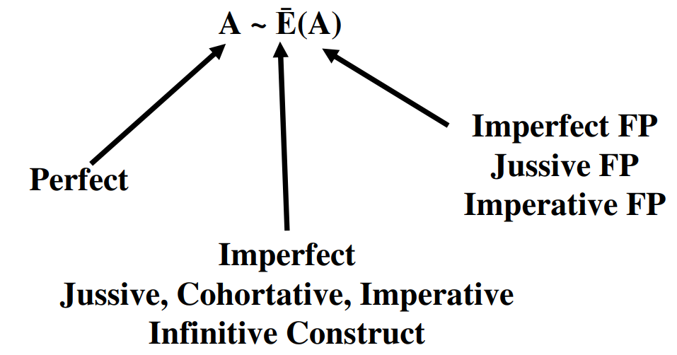

# Cover {.unnumbered}

Placeholder


<!--chapter:end:index.Rmd-->


# Navigating this book {-}

In the upper-left corner of this page you will see a series of icons.  


```r
knitr::include_graphics("images/toolbar.png")
```


These do the following tasks:

* the file drawer expands/collapses the sidebar table of contents; you can also click `s`
* the magnifying glass toggles search input; you can also click `f`
* the big `A` allows you to change the font size and theme
* the little `i` shows you available keyboard shortcuts


There are several ways to navigate from page to page within this guidebook:

* Use the left-navigation sidebar (type `s` to reveal/hide)
* Click the left or right arrow on each page to go forward or back
* Use the left or right arrow keys on your keyboard to move forward or back
* Use hyperlinks on selected pages, like this one: [Continue to Introduction section](#motivation)


<!--chapter:end:001A-introduction-header.Rmd-->


# (PART\*) Introduction {-}
# Why a Hebrew Grammar course? {- #motivation}

Placeholder


## Grammar course wishlist {- #our_course}
### Welcome to Hebrew GRAMMAR Quest - Experience Biblical Hebrew Grammar, the Holy Language Way! {-}

<!--chapter:end:001A-Motivation.Rmd-->


# "Hebrew Quest: Extended Edition" {- #hgq_and_hq}

Placeholder


<!--chapter:end:001D-hq_and_hgq.Rmd-->


# A Typical Lesson {- #typical-lesson}

Placeholder


<!--chapter:end:001E-typical_lesson.Rmd-->


# Quick Start Instructions {.unnumbered #get_started}

Placeholder


<!--chapter:end:001F-quick-start.Rmd-->

# Report an Issue {- #report_issue}

Please do not hesitate to report errors, omissions, or improvement opportunities (in fact, we'd rather hear about mistakes sooner rather than later)! Feedback is anonymous.  If you have a specific question about the content, you can use the [Get Help](#get_help) page.

[Open form in new window](https://forms.gle/qhBToGubVgmjdFbx6){target="_blank"}


<div class="container">
<iframe class="responsive-iframe" src="https://docs.google.com/forms/d/e/1FAIpQLSf3obLnGzJQ6d7Rtyy2YXDln3g-kJWCY-4IlRLE_mnFuWv2AQ/viewform?embedded=true" frameborder="0"></iframe>
</div>


<!--chapter:end:001L-issue.Rmd-->

# Get Help {- #get_help}

While this is a self-paced course with no formal instructor or teaching assistant, we do want to provide a way for you to get help if you get stuck.

We request that before you submit a question, you read through the lesson's Seven Points a couple of times, then attempt to do the Anki cards for that lesson.  If you are still unclear, we are here!

Use the form below to ask a question. Please note, we are staffed by volunteers, so please allow a few days for us to research and get back to you.  If you have general feedback or wish to report an issue, please use the [Report an Issue](#report_issue) form.

[Open form in new window](https://forms.gle/tNsvwrhci3nGkvvV6){target="_blank"}

<div class="container">
<iframe class="responsive-iframe" src="https://docs.google.com/forms/d/e/1FAIpQLSdWJc7ri0andmyu70D1USeDRtbsrHLaYLNrs0rvI2qBJx-yEg/viewform?embedded=true" frameborder="0"></iframe>
</div>


<!--chapter:end:001P-question.Rmd-->


# (PART) Hebrew Grammar Foundations {-}
# The Hebrew Aleph-bet {#alephbet}

Placeholder


## First Thought {-}
### שֵׁם יְהוָה אֶקְרָא {-}
## The Hebrew Aleph-Bet {#consonants}
## Hebrew is written and read from RIGHT-to-LEFT {#right_to_left}
## Five "KiMNePaTZ" letters have different final forms {#sofit_letters}
## Six" BeGaD KePHaT" letters take a Daghesh Lene {#daghesh_lene}
## We classify four consonants as **Gutturals** (and one is a sometimes-guttural) {#gutturals}
## Look out for look-alike Letters {#look-alike-letters}
## Sephardic vs "Seminary" Pronunciation {#pronunciation}
## Lesson Conclusion and Activities {-}
### `Anki` {- #anki-1}
### `Worksheets`: Letter Writing {- #worksheets-1}
## `Ruth Pursuit` {-}
### Your Quest: {-}
## `Quest Quiz` {-}

<!--chapter:end:01-Alephbet.Rmd-->


# Hebrew Vowels {.vowels}

Placeholder


## First Thought {-}
###  הֵמָּה רָאוּ מַעֲשֵׂי יְהוָה {-}
## Vowels that are not vowel letters {#vowels}
### Vowels come in three types: Long, Short, Reduced | Vowels come in five classes: A, E, I, O, U {-}
## Vocal and Silent Sheva {#sheva}
## Vowel letters {#vowel_letters}
### Vowel letters use a consonant plus a nikkud to form a vowel {-}
## "Defective" and "plene" spelling {#defective_spelling}
## The Daghesh Forte Doubles the Consonant {#daghesh_forte}
## Daghesh Forte Rule {#daghesh_forte_in_bgdkpt}
## Gutturals and Resh reject Daghesh Forte {#gutturals_reject_daghesh_forte}
## Lesson Conclusion and Activities {-}
### `Anki` {-}
### `Vowel worksheet` {-}
## `Ruth Pursuit` {-}
### Your Quest: {-}
## `Quest Quiz` {-}
## Claim your `Twelve Tribes Badge`! {- #twelve-tribes-badge-1}

<!--chapter:end:02-Vowels.Rmd-->


# Syllabification and Pronunciation {#Syllabification}

Placeholder


## First Thought {-}
###  אַשְׁרֵי אָדָם לֹא יַחְשֹׁב יְהוָה לוֹ  {-}
## Hebrew Syllables {#syllables}
## Hebrew Word Accents {#accents}
## Tonic, Pretonic, and Propretonic Syllables
## Ultima, Penultima, and Antepenultima syllables
## Rules for Silent Sheva {#s_sheva}
### A Sheva is SILENT when the previous vowel is short: {-}
### A Sheva is SILENT when the first of two consecutive Shevas _within a word_: {-}
### A Sheva is SILENT when at the end of a word: {-}
## Rules for Vocal Sheva {#v_sheva}
### A Sheva is VOCAL when the initial Sheva in a word: {-}
### A Sheva is VOCAL when the second of two consecutive Shevas _within a word_<small>^[<small>A Sheva at the **end** of a word is **always silent**, even when it is the second of two consecutive Shevas.</small>]</small>:  {-}
### A Sheva is VOCAL when under a Daghesh Forte: {-}
### A Sheva is VOCAL after an unaccented long vowel: {-}
## Hebrew Diphthong = Accented Patach-Yod-Hiriq {#diphthong}
## Vowels and Syllable Preference {#vowel_pref}
## Qamets Hatuf, Furtive Patach, Quiescent Alef {#misc_vowels}
## Lesson Conclusion and Activities {-}
### Introduction to Video Warm-ups {-}
## `Word Warm-up` {-}
## `Verses Warm-up` {-}
## `Ruth Pursuit` {-}        
### Your Quest: {-}
## `Quest Quiz` {-}

<!--chapter:end:03-Syllabification.Rmd-->


# (PART) Nouns, Prepositions, Pronouns {-}
# Hebrew Nouns {.Nouns}

Placeholder


## First Thought {-}
### רְאֵה לִמַּדְתִּי אֶתְכֶם חֻקִּים וּמִשְׁפָּטִים {-}
## Gender and Number {#gender_number}
## Singular Noun Endings {#sing_noun_endings}
## Plural Noun Endings {#noun_pluralization}
## Dual Noun Endings
## Special dual forms {#dual_forms}
## Irregular Pluralization  {#irregular_pluralization}
### Segholate Nouns follow a standard vowel pattern when pluralizing {-}
### Geminate words take a Daghesh Forte {-}
## Rule of Sheva {#rules_sheva}
## Lexical Form {#lexical_form}
## `Word Warm-up` {-}
## `Verses Warm-up` {-}
## `Anki` {-}
## `Ruth Pursuit` {-}        
### Your Quest: {-}
## `Quest Quiz` {-}

<!--chapter:end:04-NounsPlural.Rmd-->


# Definite Article and Conjunction Vav {.Article}

Placeholder


## First Thought {-}
### <span class="he">מִי־מָדַד בְּשָׁעֳלוֹ מַיִם וְשָׁמַיִם</span> {-}
## Translate the Vav Conjunction {#vav_translate}
## Identify the Vav Conjunction {#vav_identify}
## Loss of Daghesh Forte {#loss_daghesh_forte}
## Translate the Article {#article_translate}
## Identify the Article {#article_identify}
## Compensatory Lengthening
## Hebrew Indefiniteness {#indefiniteness}
## Hebrew Definiteness {#definiteness}
## Lesson Conclusion and Activities {-}
## `Word Warm-up` {-}
## `Verses Warm-up` {-}
## `Anki` {-}
## `Ruth Pursuit` {-}        
### Your Quest: {-}
## `Quest Quiz` {-}
## Claim your next `Twelve Tribes Badge`! {-}

<!--chapter:end:05-DefArt_Conjunction.Rmd-->


# Hebrew Prepositions

Placeholder


## First Thought {-}
### <span class="he">  בְּיוֹם צָרָתִי אֲדֹנָי דָּרָשְׁתִּי </span> {-}
## Nun with Silent Sheva Becomes Daghesh Forte
## Independent and Maqqef prepositions 
## Inseparable prepositions
## The Article and Inseparable Prepositions
## The flexible <span class="he">מִן</span>: construction
## The flexible <span class="he">מִן</span>: meanings 
## The Definite Direct Object marker 
## Review and Activities {-}
### `Anki` {-}
## `Word Warm-up` {-}
## `Verses Warm-up` {-}
## `Ruth Pursuit` {-}        
### Your Quest: {-}
## `Quest Quiz` {-}

<!--chapter:end:06-Prepositions.Rmd-->


# Hebrew Adjectives

Placeholder


## First Thought {-}
### <span class="he">אֶת־הַכֹּל עָשָׂה יָפֶה בְעִתּוֹ</span> {-}
## Inflecting Adjectives
## Substantival Use
## Attributive Use
## Predicative Use
## Adjective Use Summary
## The Mappiq 
## The Directional Ending 
## `Word Warm-up` {-}
## `Verses Warm-up` {-}
## `Anki` {-}
## `Ruth Pursuit` {-}        
## `Quest Quiz` {-}
## Claim your next `Twelve Tribes Badge`! {-}

<!--chapter:end:07-Adjectives.Rmd-->


# Hebrew Pronouns

Placeholder


## First Thought {-}
### <span class="he">זֶה הַדֶּרֶךְ לְכוּ בוֹ</span> {-}
## Independent Personal Pronoun
## Relative Pronoun <span class="he">אֲשֶׁר</span>
## Interrogative Pronoun
## Interrogative Particle <span class="he">הֲ</span>
### Interrogative Particle vs Definite Article {-}
## Near and Far Demonstratives
## Demonstrative Adjective 
## Demonstrative Pronoun
## Conclusion and Intro to Activities {-}
## `Word Warm-up` {-}
## `Verses Warm-up` {-}
## `Anki` {-}
## `Worksheets: Pronouns` {-}
## `Ruth Pursuit` {-}        
### Your Quest: {-}
## `Quest Quiz` {-}

<!--chapter:end:08-Pronouns.Rmd-->


# Hebrew Pronominal Suffixes

Placeholder


## First Thought {-}
### <span class="he">וַיֹּאמְרוּ שָׁאוֹל שָׁאַל־הָאִישׁ לָנוּ וּלְמוֹלַדְתֵּנוּ </span> {-}
## Meaning
## Type 1 vs Type 2 Suffixes
## Singular Suffixes
## Plural Suffixes
## Distinguish Type 1 from Type 2
## Lexical Form with Type 1
## Lexical Form with Type 2
## Unexpected changes
## Look-alike words: <span class="he">אֵת</span> as "with" or as Definite Direct Object (DDO) marker
## Look-alike words:   <span class="he">עִם</span>, "with", or <span class="he">עַם</span>, "people" 
## Look-alike words: <span class="he">אֵל</span>, "God", or <span class="he">אֶל</span>, "to"
## `Word Warm-up` {-}
## `Word Warm-up: pronominal suffixes` {-}
## `Verses Warm-up` {-}
## `Anki` {-}
## `Worksheets`: Pronominal Suffixes {-}
## `Ruth Pursuit` {-}        
### Your Quest: {-}
## `Quest Quiz` {-}

<!--chapter:end:09-Pronominal_Suffixes.Rmd-->


# Hebrew Construct Chain {.ConstructChain}

Placeholder


## First Thought {-}
### <span class="he">בְּצֶדֶק כָּל־אִמְרֵי־פִי</span> {-}
## What is a Construct Chain?
## What makes a construct chain
## Review: what makes a word definite 
## The Absolute noun establishes the definiteness of a chain
## How to Recognize a Construct Chain
## Identifying Construct state by Noun Endings
## Construct Chain Summary
## `Word Warm-up` {-}
## `Verses Warm-up` {-}
## `Anki` {-}
## `Worksheets`: Construct Identification {-}
## `Ruth Pursuit` {-}        
### Your Quest: {-}
## `Quest Quiz` {-}
## Claim your next `Twelve Tribes Badge`! {-}

<!--chapter:end:10-ConstructChain.Rmd-->


# Hebrew Numerals

Placeholder


## First Thought {-}
## The Biblical text always spells out numbers
## Notes and footnotes use symbols for numbers
## Hebrew Ordinal Numbers
### Hebrew Quest Ordinal Numbers Video {-}
## Cardinal Numbers 1-10
### Digits 1 and 2 match the gender of the noun {-}
### Digits 3-10 take the opposite gender of the noun {-}
## Cardinal Numbers Above 10
## Conclusion
### Anki {-}
## `Word Warm-up` {-}
## `Verses Warm-up` {-}
### WAITING ON IZZY
## `Ruth Pursuit` {-}        
### Your Quest: Locate numerals {-}

<!--chapter:end:11-Numerals.Rmd-->


# (PART) Qal Binyanim {-}
# Introduction to Unit 3 {-}

Placeholder


## Hebrew Quest Study Passages {-}
## Vowel Transliteration/Shorthand
## Word Initial Form
## Cantillation Marks {-}
## Keep going! {-}

<!--chapter:end:11b-Unit3_Intro.Rmd-->


# Introduction to Hebrew Verbs {#Verbs}

Placeholder


## First Thought {-}
### <span class="he">וְהֽוּא־הָלַ֤ךְ בַּמִּדְבָּר֙ דֶּ֣רֶךְ י֔וֹם </span> {-}
## The Verbal Root
## Person, Gender, Number
## Verb nomenclature: 
## Preformatives, Sufformatives, Prefixes, and Suffixes
## Verbal Vowels
## The Seven Hebrew Verb Stems
## The Seven Stems: Summary Table
## The Eight Basic Conjugations
## Finite vs Non-Finite Conjugations
## Parsing
## Parsing Codes
## Strong and Weak Verbs
## Weak Verb Classes
## Word Warm-up {-}
## Verses Warm-up {-}
## Anki {-}
## Hebrew Quest Study Passage: Proverbs Study #1-4 {-}
## X Quest Quiz {-}

<!--chapter:end:12-Verbs_Intro.Rmd-->


# Qal Perfect - Strong Verbs {.QP-s}

Placeholder


## First Thought {-}
### <span class="he">לֹא־שָׁמְר֤וּ אֲבוֹתֵ֙ינוּ֙ אֶת־דְּבַ֣ר יְהוָ֔ה </span> {-}
##  Qal is Simple action, Active voice
## Perfect is completed action or a state as a whole
## Components of the Qal Perfect Strong Paradigm
## The Perfect Sufformatives
## Qal Perfect Vowels: $V_1$ is almost always Qamets
## Qal Perfect Vowels: $V_2$ prefers patach
## $V_S$ is accented in Finite verbs
## A Sheva precedes a Finite Sufformative
## Building the Qal Perfect Strong Paradigm
## Hearing the Qal Perfect Strong Paradigm
## Worksheets: Qal Perfect Strong Paradigm {-}
## Qal Perfect Strong Examples
## Deviations from the Paradigm
## 3נ and 3ת Verbs
## Stative Verbs MAY have a different $V_S$
## Word Warm-up {-}
## Verses Warm-up {-}
## Anki {-}
## Ruth Pursuit {-}        
###  Your Quest: {-}
## Hebrew Quest Study Passage: Proverbs #5-7 {-}
## X Quest Quiz {-}
## X Claim your next `Twelve Tribes Badge`! {-}

<!--chapter:end:13-Qal_Perfect_Strong.Rmd-->


# Qal Perfect - Weak Verbs {.QP-w}

Placeholder


## X First Thought {-}
### X <span class="he"> </span> {-}
## X 3נ and 3ת with Silent Sheva Assimilate to Dagesh
## X Point3 
## X Point4 
## X Point5 
## X Point6 
## X Point7 
## X Word Warm-up {-}
## X Verses Warm-up {-}
## X Anki {-}
## X Worksheets: NameOfWorksheet {-}
## X Ruth Pursuit {-}        
### X Your Quest: {-}
## X Hebrew Quest Study Passage: Book ## {-}
## X Quest Quiz {-}
## X Claim your next `Twelve Tribes Badge`! {-}

<!--chapter:end:14-Qal_Perfect_Weak.Rmd-->


# Qal Imperfect - Strong Verbs {.QI-s}

Placeholder


## First Thought {-}
### <span class="he">יִ֝שְׁמֹ֗ר כָּל־אָרְחֹתָֽי׃ </span> {-}
## Translating the Imperfect
## The Imperfect Always has a Preformative
## Qal Imperfect Vowels
## X Imperfect Sufformatives
## Building the Qal Imperfect Strong Paradigm
## Hearing the Qal Imperfect Strong Paradigm
## Worksheets: Qal Imperfect Strong Paradigm {-}
## Qal Imperfect Strong Examples
## Deviations from the Paradigm
## Translating Negative Commands
## X Word Warm-up {-}
## X Verses Warm-up {-}
## X Anki {-}
## X Worksheets: NameOfWorksheet {-}
## X Ruth Pursuit {-}        
### X Your Quest: {-}
## X Hebrew Quest Study Passage: Book ## {-}
## X Quest Quiz {-}
## X Claim your next `Twelve Tribes Badge`! {-}

<!--chapter:end:15-Qal_Imperfect_strong.Rmd-->

# Qal Imperfect Weak {.QI-w}


<!--chapter:end:16-Qal_Imperfect_Weak.Rmd-->

# Vav Consecutive {.wc}


<!--chapter:end:17-Vav_Consecutive.Rmd-->

# Qal Imperative {.QM}


<!--chapter:end:18-Qal_Imperative_strong.Rmd-->

# Pronominal Suffixes on Verbs {.VerbSuffix}


<!--chapter:end:19-Pronominal_Suffix_Verbs.Rmd-->

# Qal Infinitive Construct {.Q∞}


<!--chapter:end:20-Qal_Infinitive_Construct.Rmd-->

# Qal Infinitive Absolute {.QA}

<!--chapter:end:21-Qal_Infinitive_Absolute.Rmd-->

# Qal Participle {.QPt}


<!--chapter:end:22-Qal_Participle.Rmd-->


# Hebrew Syntax {.Syntax}

Placeholder


## First Thought {-}
### <span class="he">עַתָּה יָדַעְתִּי כִּי־גָדוֹל יְהוָה מִכָּל־הָאֱלֹהִים</span> {-}
## Clause versus Sentence
## Word order
## Perfect Syntax
## Imperfect Syntax
## Volitional Syntax
## Conditional Phrases
## Disjunctive Vav
## Adverbs
## `Word Warm-up` {-}
## `Verses Warm-up` {-}
## `Anki` {-}
## `Hebrew Quest Study Passage: Psalm 19` {-}

<!--chapter:end:23-Hebrew_Syntax.Rmd-->

# (PART) Derived Binyanim {-}

# Introduction to Unit 4 {-}

Congratulations!  You now have the heaviest work of a first-year Hebrew grammar course behind you.  From here on out, we will be studying the six major derived Hebrew Verb stems: Niphal, Piel, Pual, Hiphil, Hophal and Hitpael.

The reason we spent so much time on the Qal stem is not only because it's the most frequently occurring stem, but everything from this point forward is based on what you learned in Unit 3.  This means, for the most part, the Lessons that follow will be shorter and much more methodical.

Summaries of each of the derived stems will consist of the overall diagnostic features.  It is THESE features that should be memorized, not the numerous paradigms.

## Lessons 24-35 {-}

Each stem will have two lessons:

* Lesson A - The "Strong" Verb paradigm
    * The meaning of the Stem
    * The spelling of the stem, including "Beginning Combinations" and $V_S$ formulas to help you "diagnose" the stem when you encounter it in the Bible
    * Complete forms of each conjugation using the קטל paradigm verb
        * The translation of the paradigm verb, while unfortunate and often awkward (for example "He will cause to kill") is truly incidental to our purposes  
        * It's more important that you are able to identify the vowels for any strong verb, regardless of $R_1$, $R_2$, or $R_3$.
        * The Perfect and Imperfect forms will have the Audio from Chapter 15 of _Hebrew Quest_, which will also be included in the Anki deck to help you with paradigm identification
    * Each lesson will have an OPTIONAL worksheet for you to practice the paradigm
        * As always, identification of patters is more important than memorization of paradigms
* Lesson B - Weak verb deviations
    * Spelling changes within caused by the behaviors of gutturals and other weak letters, Geminate verbs, Biconsonantal verbs, and other irregular verbs
* As you can see, we are taking a very mathematical approach with formulas and paradigms
    * Even if math wasn't your best subject in school, you should do fine with the rest of this course
    * The next couple of pages have some refreshers so you can get familiar with our nomenclature

## Review Vowel and Consonant Shorthand

* The following chapters will make extensive use of the "Vowel Shorthand" we discussed in the Unit 3 Introduction - be sure you are comfortable with this nomenclature
* $V_P$ is the vowel that is affixed to the verb's preformative, if there is one
* $R_1$ is root consonant #1 and $V_1$ is that consonant's vowel
* $R_2$ is root consonant #2 and $V_2$ is that consonant's vowel
* $R_3$ is root consonant #3 (we do not use $V_3$).
* $V_S$ is the "Stem Vowel", this is _usually_ $V_2$ 
    * If the first consonant is lost, $V_S$ is still the vowel with the second root consonant
        * In **שֵׁב***, $V_S = V_2 = \bar E$ - (Long E - Tsere)
    * For biconsonantal verbs, $V_S$ is between the consonants
        * In **קָם***, $V_S = \bar A$ (Long A - Qamets)
        * In **יַקוּם***, $V_S = \bar U$ (Long U - Shureq)

## Stem Vowel Pattern Nomenclature

* The derived stems tend to be much more consistent with their application of stem vowels
* We will use a code to memorize the stem vowels for non-Qal Strong verbs
* For example, the stem vowel code is 

$$V_{S_N} = A \sim \bar E (A)$$

* V_{S_N}$ means the <u>S</u>tem <u>V</u>owel for the <u>N</u>iphal. The final letter is the stem's parsing code.
* Everything to the LEFT of the tilde, $\sim$, is the PERFECT
* Everything to the RIGHT of the tilde is the IMPERFECT and related forms, Jussive, Cohortative, Imperative and Infinitive Construct
* Any exceptions are inside ()
    * Imperfect form exceptions apply to the Feminine Plural
        * Therefore $(A)$ in the formula means the Stem Vowel in the Imperfect FP, the Jussive FP and the Imperative FP is Short A - Patach
    * Perfect exceptions will tend to apply to the 2nd and 1st person forms
    * Niphal does not have any Perfect exceptions
    

```r

```


* Infinitive Absolute: $V_S = \bar E$ (Long E - Tsere)
    * Exceptions: Qal (Always) and Niphal (sometimes) use $\hat O$ (Holem Vav)
* Participle $V_S$ is P3MS, but lengthened if possible
    * For example, In the formula above, $V_{S_{NP}} = A$ for the Perfect.  Therefore, the Participle $V_{S_{NPt}} = \bar A$ (Long A - Qamets)


<!--chapter:end:23b-Unit4_Intro.Rmd-->


# The Niphal Stem - Strong Verbs {#N-s}

Placeholder


## X First Thought {-}
### X <span class="he"> </span> {-}
## Review: Sheva before Finite Verb Endings
## X Verb Stem Table: NIPHAL 
## Niphal Strong Word-initial Combinations 
## Niphal Strong Stem Vowel Formula
## Infinitive Absolute $V_S = \bar E$ (usually)
## What to (and what not to) Memorize for the Niphal
## X Niphal Perfect Strong
## X Niphal Imperfect Strong
## X Niphal Imperative Strong
## X Niphal Infinitives Strong
## X Niphal Participle Strong
## Word Warm-up {-}
## X Verses Warm-up {-}
## X Anki {-}
## Worksheets: Niphal Strong Paradigm {-}
## X Ruth Pursuit {-}        
### X Your Quest: {-}
## X Hebrew Quest Study Passage: Book ## {-}
## X Quest Quiz {-}
## X Claim your next `Twelve Tribes Badge`! {-}

<!--chapter:end:24-Niphal_Strong.Rmd-->

# The Niphal Stem - Weak Verbs {.N-w}


<!--chapter:end:25-Niphal_Weak.Rmd-->

# The Piel Stem - Strong Verbs {.D-s}


<!--chapter:end:26-Piel_Strong.Rmd-->

# The Piel Stem - Weak Verbs {.D-w}


<!--chapter:end:27-Piel_Weak.Rmd-->

# The Pual Stem - Strong Verbs {.Dp-s}

<!--chapter:end:28-Pual_Strong.Rmd-->

# The Pual Stem - Weak Verbs {.Dp-w}


<!--chapter:end:29-Pual_Weak.Rmd-->


# The Hiphil Stem - Strong Verbs {.H-s}

Placeholder


## First Thought {-}
### <span class="he">לְכוּ־נָ֛א וְנִוָּֽכְחָ֖ה יֹאמַ֣ר יְהוָ֑ה אִם־יִֽהְי֨וּ חֲטָאֵיכֶ֤ם כַּשָּׁנִים֙ כַּשֶּׁ֣לֶג יַלְבִּ֔ינוּ אִם־יַאְדִּ֥ימוּ כַתּוֹלָ֖ע כַּצֶּ֥מֶר יִהְיֽוּ׃</span> {-}
## Meaning of the Hiphil
## Hiphil Strong Word Initial Combinations - Think "HIphil-HAphil"
## Hiphil $V_S = Î[A] \sim Î(Ē)$
### Exception to $V_S$ pattern {-}
## Don’t confuse **ְ הִ*** with Niphal Preformative **ָּּ הִ***
## Don't confususe Hiphil Imperfect **ְ יַ*** with Qal Imperfect **ְ יִ***
## Hiphil Perfect Strong Paradigm
## Hiphil Imperfect Strong Paradigm
## Hiphil Imperative Strong Paradigm
## Hiphil Infinitives Strong
## Participle Strong
### Participle Prefixes in the Derived Stems {-}
## Strong Summary
## OPTIONAL: Hiphil Parsing Worksheet {-}
## X Word Warm-up {-}
## X Verses Warm-up {-}
## X Anki {-}
## X Ruth Pursuit {-}        
### X Your Quest: {-}
## Hebrew Quest Study Passage: Exodus 19 {-}
## X Quest Quiz {-}
## X Claim your next `Twelve Tribes Badge`! {-}

<!--chapter:end:30-Hiphil-Strong.Rmd-->

# The Hiphil Stem - Weak Verbs {.H-w}


<!--chapter:end:31-Hiphil-Weak.Rmd-->


# The Hophal Stem - Strong Verbs {.Hp-s}

Placeholder


## First Thought {-}
### <span class="he">וְהָ֣אֲנָשִׁ֔ים טֹבִ֥ים לָ֖נוּ מְאֹ֑ד וְלֹ֤א הָכְלַ֙מְנוּ֙ וְלֹֽא־פָקַ֣דְנוּ מְא֔וּמָה כָּל־יְמֵי֙ הִתְהַלַּ֣כְנוּ אִתָּ֔ם בִּֽהְיוֹתֵ֖נוּ בַּשָּׂדֶֽה׃</span> {-}
## Meaning of the Hophal
## Hophal Strong Beginning Combinations - Think "Houûphal"
## Hophal $V_S$ = A
## Hophal Perfect Strong
## Hophal Imperfect Strong
## Participle Strong
## Hophal Strong Summary
## Word Warm-up {-}
## X Verses Warm-up {-}
## Anki {-}
## OPTIONAL: Hophal Parsing Worksheet {-}
## Ruth Pursuit {-}        
## Hebrew Quest Study Passage: 1 Samuel 17 {-}
## X Quest Quiz {-}
## X Claim your next `Twelve Tribes Badge`! {-}

<!--chapter:end:32-Hophal_Strong.Rmd-->


# The Hophal Stem - Weak Verbs {.Hp-w}

Placeholder


## First Thought {-}
### <span class="he">נִשְׁאַ֥ר בָּעִ֖יר שַׁמָּ֑ה וּשְׁאִיָּ֖ה יֻכַּת־שָֽׁעַר׃ </span> {-}
## 1G and 3ה Verbs prefer Qamets Hatuf as $V_P$
## 1נ assimilates as expected
## Geminate/Biconsonant prefer Shureq as $V_P$
## Word Warm-up {-}
## Verses Warm-up {-}
## Anki {-}
## Ruth Pursuit {-}        
## Hebrew Quest Study Passage: Psalms 45 {-}
## X Quest Quiz {-}
## X Claim your next `Twelve Tribes Badge`! {-}

<!--chapter:end:33-Hophal_weak.Rmd-->


# The Hithpael Stem - Strong Verbs {.HT-s}

Placeholder


##  First Thought {-}
###  <span class="he"> וַיַּסֵּ֧ב חִזְקִיָּ֛הוּ פָּנָ֖יו אֶל־הַקִּ֑יר וַיִּתְפַּלֵּ֖ל אֶל־יְהוָֽה׃ </span> {-}
## Meaning of the Hitpael
## Hitpael Strong Beginning Combinations - Think "_IT"
## Hitpael $V_S$ = Ē[A] ~ Ē
## Hitpael Perfect Strong
## Hitpael Imperfect Strong
## Hitpael Imperative Strong
## Hitpael Infinitives Strong
## Hitpael Participle Strong
## Word Warm-up {-}
## Verses Warm-up {-}
## Anki {-}
## OPTIONAL: Hitpael Parsing Worksheet {-}
## Ruth Pursuit {-}        
## Hebrew Quest Study Passage: Leviticus 23 {-}
## X Quest Quiz {-}
## X Claim your next `Twelve Tribes Badge`! {-}

<!--chapter:end:34-Hitpael_Strong.Rmd-->


# The Hithpael Stem - Weak Verbs {.Ht-w}

Placeholder


## First Thought {-}
###  <span class="he">וְנָמַ֤סּוּ הֶֽהָרִים֙ תַּחְתָּ֔יו וְהָעֲמָקִ֖ים יִתְבַּקָּ֑עוּ כַּדּוֹנַג֙ מִפְּנֵ֣י הָאֵ֔שׁ כְּמַ֖יִם מֻגָּרִ֥ים בְּמוֹרָֽד׃ </span> {-}
## $R_2$ can lose Daghesh Forte
## Transposition of ת and $R_1$ when $R_1$ is sibilant
## Preformative תְ assimilates when $R_1$ is ז ד ט ת,
## Hitpolel is tD of some Biconsonantal and Geminate Verbs
## <span class="he">חָוָה </span> - Hishtapel Stem
## Word Warm-up {-}
## Verses Warm-up {-}
## Anki {-}
## Ruth Pursuit {-}        
### Your Quest: {-}
## Hebrew Quest Study Passage: 1 Kings 18 {-}
## X Quest Quiz {-}
## X Claim your next `Twelve Tribes Badge`! {-}

<!--chapter:end:35-Hitpael_Weak.Rmd-->

# X Conclusion {-}

We would like to take a moment and recap all that you have accomplished in His strength.  Each section will also have tips and references on where you can go next.


## Hebrew Quest Study Passages {-}

You have studied 20 distinct passages, most of which were full chapters of the Hebrew Bible or passages from the Delitsch Hebrew New Testament.  You have also completed the 17-lesson "Premium Proverbs" study.

**Next steps**: If you haven't yet finished _Hebrew Quest_ this is where you should head next.  

## Ruth Pursuit - Intermediate Hebrew {-}   

* You have skimmed, if not read entirely through, Ruth Chapter one at least 35 times!

**Next steps**: Continue with Intermediate Hebrew!

* You can review [Dr. Beckman's Notes on Ruth](./images/00_Ruth_notes.pdf){target="_blank"}
* We can recommend two Intermediate Hebrew books:
    * [A Workbook for Intermediate Hebrew](https://www.amazon.com/gp/product/0825423902/&tag=holylanginst-20){target="_blank"}, by Robert B. Chisholm, Jr., which contains a verse by verse expositional grammar study through the books of Ruth and Jonah
    * The same author has [From Exegesis to Exposition: A practical Guide to Using Biblical Hebrew](https://www.amazon.com/gp/product/B009UOG4N4/&tag=holylanginst-20){target="_blank"}


<!--chapter:end:36-Conclusion.Rmd-->

# (APPENDIX) Appendices {-} 

<!--chapter:end:40-Appendices.Rmd-->


# Anki info and FAQ {#anki_faq}

Placeholder


## Installation {- #installation_anki}
## Customize Anki Settings {- #anki_settings}
### Below is the main set you will want to change.  Enter these numbers carefully: {-}
## How do I access Anki on my mobile device? {-}
## How do I navigate within Anki? {-}
## How do I know when to hit the `Good` button on a **Vocabulary** or **Grammar** card? {-}
## How do I know when to hit the `Good` button on a **Verse Translation** card? {-}
## What are Anki Add-ons? {-}
## How often should I expect to work in Anki? {-}
## How do I know when I'm done with a deck? {-}
## Anki Completion Requirements for the`Course Checklist` {-}
## Anki Completion Requirements for the `Certificate` {-}
## What do the different card stages mean? {-}
## Can I add an image or a hint? {-}
## Can I modify the layout of a card? {-}
### Proceed with caution: {-}
## What does `There are more new cards available, but the daily limit has been reached` mean? {-}
## How do I submit screenshots for the `Certificate`? {-}

<!--chapter:end:45-Anki.Rmd-->


# More Hebrew Quest and Hebrew GRAMMAR Quest FAQ {#hq_hgq_faq}

Placeholder


## What is the difference between Hebrew Quest and Hebrew GRAMMAR Quest? {- #difference}
## Do I need to complete Hebrew Quest before I start Hebrew GRAMMAR Quest? {- #complete_hq_first}
## When I complete this course, should I go back and finish Hebrew Quest? {- #need_to_finish_hq}
## I haven't started either course.  Which should I do first? {- #which_first}

<!--chapter:end:50-HQ_HGQ_FAQ.Rmd-->


# Other FAQ {#other_faq}

Placeholder


## There are many books out there to learn Hebrew.  What makes Hebrew GRAMMAR Quest different? {- #hgq_difference}
## Will I be required to buy anything? {- #buy_materials} 
## Who will (and who might not) benefit from Hebrew GRAMMAR Quest? {- #who_benefits}
## What if I am a Bible teacher? Should I take this course? {- #bible_teacher}

<!--chapter:end:55-faq.RMD-->

# Lexicon 


```r
library(knitr)
include_graphics("images/lexicon.jpg")
```


The authors of <u>Basics of Biblical Hebrew</u> have created an abridged Lexicon to accompany this course.  This document is nice as vocabulary words are indexed to the Lesson #, and irregular plural forms and selected construct forms are also included.

[Open/download BBH Lexicon](./images/BBH_Lexicon.pdf){target="_blank"}

You are also encouraged to check out the Lexicon resources in the [Holy Language Heritage Library](https://holylanguage.com/resources-dictionaries.php){target="_blank"}.  They are much more exhaustive.  

<!--chapter:end:57-Lexicon.Rmd-->


# (PART\*) About us and this book {-}
# About Holy Language Institute {-}

Placeholder


## Following Yeshua {-}
## In a Hebrew Way {-}
## Together {-}

<!--chapter:end:60-About_HLI.Rmd-->

# Acknowledgments {-}

All honor and glory to Yeshua, our Lord.  שֵׁם יְהוָה אֶקְרָא

Unless, otherwise noted, English Scripture quotations taken from the NASB. Copyright by The Lockman Foundation. Used by permission.

Pictures of Israel to begin each lesson are courtesy of the [Pictorial Library of Bible Lands](www.bibleplaces.com){target="_blank"}. Used by permission.

Biblical Hebrew text is courtesy of tanach.us (version 26.0).

Our thanks to Dr. Gary Pratico and Dr. Myles Van Pelt for <u>Basics of Biblical Hebrew</u>, the seminary textbook that inspired the format of **Hebrew Grammar Quest**.  We encourage any of our students who wish to go further with Hebrew grammar to purchase the textbook or any related materials.

Additionally, our thanks to Dr. John Beckman for making his extensive library of materials to accompany <u>Basics of Biblical Hebrew</u> freely available for reuse under CC-BY-SA.

As applicable:

* Vocabulary portions of this book are derivatives of [00_vocabulary.pdf](https://hebrewsyntax.org/bbh2new/00_vocabulary.pdf) by John Beckman, used under [CC-BY-SA](https://creativecommons.org/licenses/by-nc-sa/4.0/).
* Grammar portions of this book are derivatives of [00_study_guide.pdf](https://hebrewsyntax.org/bbh2new/00_study_guide.pdf) as well as the "overhead" files for each chapter (for example [Chapter 1-The Hebrew Alephabet](https://hebrewsyntax.org/bbh2new/01_overheads_bw.pdf), and so on for each successive chapter) by John Beckman, used under [CC-BY-SA](https://creativecommons.org/licenses/by-nc-sa/4.0/).
* Study verses portions of this Anki deck are derivatives of [00_workbook_answers.pdf](https://hebrewsyntax.org/bbh2new/00_workbook_answers.pdf) by John Beckman, used under [CC-BY-SA](https://creativecommons.org/licenses/by-nc-sa/4.0/).

Yihui Xie is the genius who developed the [Bookdown](https://bookdown.org/) tool, which is the engine behind publishing this interactive book.  Without Bookdown, we would not have been able to achieve those bullet points listed on the [What we wanted in our course](#our_course) page related to the ease of lifting the project and making it available to our subscribers for free, while maintaining a professional look.

Finally, we thank YOU for your interest in this course! 

<!--chapter:end:60-Acknowledgments.Rmd-->

# About the designer of this book {-}

* Chris Flanagan has been a member of HLI since 2013 and joined as a ministry volunteer in 2015.
* He has completed Hebrew Quest as a student, which planted a desire to dig deeper into the original languages. He has completed both Hebrew and Greek courses at the seminary level.
* He has worked on a number of projects for HLI from an instructional design standpoint, including leading of "Hebrew Quest Memrise" and now "Hebrew Grammar Quest"
    * This work is simply a compilation of many various first-year Hebrew resources, which he has knitted together to present in an original and engaging format
    * For this reason, he likes to refer to himself as the "designer" or "compiler" of this dynamic Hebrew learning tool, and not the "author" of a static book
* Professionally, Chris has worked in the healthcare compliance field for over 30 years
* Personally, Chris is married and has two men in college.  He and his wife, Sarah, love to travel, especially to Israel; (which, as you can tell, has inspired the format of each lesson in this book)


```r
knitr::include_graphics("images/cf.jpg")
```

<div class="figure" style="text-align: center">

<p class="caption">(\#fig:unnamed-chunk-4)Chris Flanagan</p>
</div>


<!--chapter:end:65-abouttheauthor.Rmd-->

# License {-}


© 2020 Holy Language Institute. All rights reserved.


This work is licensed under the Creative Commons Attribution-NonCommercial-ShareAlike 4.0 International License. 

This license is for personal use only.  This publication may not be downloaded, redistributed, re-uploaded, published, or used for any other purposes without explicit permission from the copyright holder.

If you received this book and you are not a member of Holy Language Institute, [become a member](https://holylanguage.com/subscribe.html) today!  Subscribing will give you access to the full Hebrew GRAMMAR Quest course, as well as our complete library of teaching materials.


<!--chapter:end:70-License.Rmd-->


# References {-}


<!--chapter:end:99-References.Rmd-->


# X LessonTitle {#lessontitle}

Placeholder


## X First Thought {-}
### X <span class="he"> </span> {-}
## X Point1 
## X Point2 
## X Point3 
## X Point4 
## X Point5 
## X Point6 
## X Point7 
## X Perfect Strong
## X Imperfect Strong
## X Imperative Strong
## X Infinitives Strong
## X Participle Strong
## X Word Warm-up {-}
## X Verses Warm-up {-}
## X Anki {-}
## X Worksheets: NameOfWorksheet {-}
## X Ruth Pursuit {-}        
### X Your Quest: {-}
## X Hebrew Quest Study Passage: Book ## {-}
## X Quest Quiz {-}
## X Claim your next `Twelve Tribes Badge`! {-}

<!--chapter:end:99-zChapter_Template.Rmd-->

