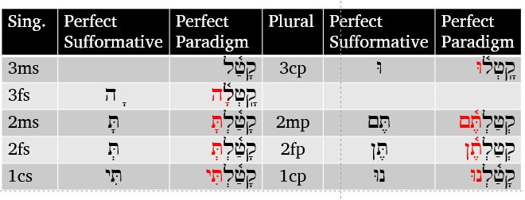
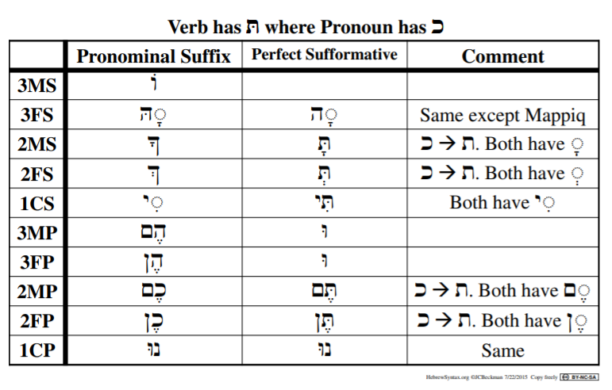

# Cover {.unnumbered}

Placeholder


<!--chapter:end:index.Rmd-->


# Navigating this book {-}

In the upper-left corner of this page you will see a series of icons.  


```r
knitr::include_graphics("images/toolbar.png")
```


These do the following tasks:

* the file drawer expands/collapses the sidebar table of contents; you can also click `s`
* the magnifying glass toggles search input; you can also click `f`
* the big `A` allows you to change the font size and theme
* the little `i` shows you available keyboard shortcuts


There are several ways to navigate from page to page within this guidebook:

* Use the left-navigation sidebar (type `s` to reveal/hide)
* Click the left or right arrow on each page to go forward or back
* Use the left or right arrow keys on your keyboard to move forward or back
* Use hyperlinks on selected pages, like this one: [Continue to Introduction section](#motivation)


<!--chapter:end:001A-introduction-header.Rmd-->


# (PART\*) Introduction {-}
# Why a Hebrew Grammar course? {- #motivation}

Placeholder


## Grammar course wishlist {- #our_course}
### Welcome to Hebrew GRAMMAR Quest - Experience Biblical Hebrew Grammar, the Holy Language Way! {-}

<!--chapter:end:001A-Motivation.Rmd-->


# "Hebrew Quest: Extended Edition" {- #hgq_and_hq}

Placeholder


<!--chapter:end:001D-hq_and_hgq.Rmd-->


# A Typical Lesson {- #typical-lesson}

Placeholder


<!--chapter:end:001E-typical_lesson.Rmd-->


# Quick Start Instructions {.unnumbered #get_started}

Placeholder


<!--chapter:end:001F-quick-start.Rmd-->

# Report an Issue {- #report_issue}

Please do not hesitate to report errors, omissions, or improvement opportunities (in fact, we'd rather hear about mistakes sooner rather than later)! Feedback is anonymous.  If you have a specific question about the content, you can use the [Get Help](#get_help) page.

[Open form in new window](https://forms.gle/qhBToGubVgmjdFbx6){target="_blank"}


<div class="container">
<iframe class="responsive-iframe" src="https://docs.google.com/forms/d/e/1FAIpQLSf3obLnGzJQ6d7Rtyy2YXDln3g-kJWCY-4IlRLE_mnFuWv2AQ/viewform?embedded=true" frameborder="0"></iframe>
</div>


<!--chapter:end:001L-issue.Rmd-->

# Get Help {- #get_help}

While this is a self-paced course with no formal instructor or teaching assistant, we do want to provide a way for you to get help if you get stuck.

We request that before you submit a question, you read through the lesson's Seven Points a couple of times, then attempt to do the Anki cards for that lesson.  If you are still unclear, we are here!

Use the form below to ask a question. Please note, we are staffed by volunteers, so please allow a few days for us to research and get back to you.  If you have general feedback or wish to report an issue, please use the [Report an Issue](#report_issue) form.

[Open form in new window](https://forms.gle/tNsvwrhci3nGkvvV6){target="_blank"}

<div class="container">
<iframe class="responsive-iframe" src="https://docs.google.com/forms/d/e/1FAIpQLSdWJc7ri0andmyu70D1USeDRtbsrHLaYLNrs0rvI2qBJx-yEg/viewform?embedded=true" frameborder="0"></iframe>
</div>


<!--chapter:end:001P-question.Rmd-->


# (PART) Hebrew Grammar Foundations {-}
# The Hebrew Aleph-bet {#alephbet}

Placeholder


## First Thought {-}
### שֵׁם יְהוָה אֶקְרָא {-}
## The Hebrew Aleph-Bet {#consonants}
## Hebrew is written and read from RIGHT-to-LEFT {#right_to_left}
## Five "KiMNePaTZ" letters have different final forms {#sofit_letters}
## Six" BeGaD KePHaT" letters take a Daghesh Lene {#daghesh_lene}
## We classify four consonants as **Gutturals** (and one is a sometimes-guttural) {#gutturals}
## Look out for look-alike Letters {#look-alike-letters}
## Sephardic vs "Seminary" Pronunciation {#pronunciation}
## Lesson Conclusion and Activities {-}
### `Anki` {- #anki-1}
### `Worksheets`: Letter Writing {- #worksheets-1}
## `Ruth Pursuit` {-}
### Your Quest: {-}
## `Quest Quiz` {-}

<!--chapter:end:01-Alephbet.Rmd-->


# Hebrew Vowels {.vowels}

Placeholder


## First Thought {-}
###  הֵמָּה רָאוּ מַעֲשֵׂי יְהוָה {-}
## Vowels that are not vowel letters {#vowels}
### Vowels come in three types: Long, Short, Reduced | Vowels come in five classes: A, E, I, O, U {-}
## Vocal and Silent Sheva {#sheva}
## Vowel letters {#vowel_letters}
### Vowel letters use a consonant plus a nikkud to form a vowel {-}
## "Defective" and "plene" spelling {#defective_spelling}
## The Daghesh Forte Doubles the Consonant {#daghesh_forte}
## Daghesh Forte Rule {#daghesh_forte_in_bgdkpt}
## Gutturals and Resh reject Daghesh Forte {#gutturals_reject_daghesh_forte}
## Lesson Conclusion and Activities {-}
### `Anki` {-}
### `Vowel worksheet` {-}
## `Ruth Pursuit` {-}
### Your Quest: {-}
## `Quest Quiz` {-}
## Claim your `Twelve Tribes Badge`! {- #twelve-tribes-badge-1}

<!--chapter:end:02-Vowels.Rmd-->


# Syllabification and Pronunciation {#Syllabification}

Placeholder


## First Thought {-}
###  אַשְׁרֵי אָדָם לֹא יַחְשֹׁב יְהוָה לוֹ  {-}
## Hebrew Syllables {#syllables}
## Hebrew Word Accents {#accents}
## Tonic, Pretonic, and Propretonic Syllables
## Ultima, Penultima, and Antepenultima syllables
## Rules for Silent Sheva {#s_sheva}
### A Sheva is SILENT when the previous vowel is short: {-}
### A Sheva is SILENT when the first of two consecutive Shevas _within a word_: {-}
### A Sheva is SILENT when at the end of a word: {-}
## Rules for Vocal Sheva {#v_sheva}
### A Sheva is VOCAL when the initial Sheva in a word: {-}
### A Sheva is VOCAL when the second of two consecutive Shevas _within a word_<small>^[<small>A Sheva at the **end** of a word is **always silent**, even when it is the second of two consecutive Shevas.</small>]</small>:  {-}
### A Sheva is VOCAL when under a Daghesh Forte: {-}
### A Sheva is VOCAL after an unaccented long vowel: {-}
## Hebrew Diphthong = Accented Patach-Yod-Hiriq {#diphthong}
## Vowels and Syllable Preference {#vowel_pref}
## Qamets Hatuf, Furtive Patach, Quiescent Alef {#misc_vowels}
## Lesson Conclusion and Activities {-}
### Introduction to Video Warm-ups {-}
## `Word Warm-up` {-}
## `Verses Warm-up` {-}
## `Ruth Pursuit` {-}        
### Your Quest: {-}
## `Quest Quiz` {-}

<!--chapter:end:03-Syllabification.Rmd-->


# (PART) Nouns, Prepositions, Pronouns {-}
# Hebrew Nouns {.Nouns}

Placeholder


## First Thought {-}
### רְאֵה לִמַּדְתִּי אֶתְכֶם חֻקִּים וּמִשְׁפָּטִים {-}
## Gender and Number {#gender_number}
## Singular Noun Endings {#sing_noun_endings}
## Plural Noun Endings {#noun_pluralization}
## Dual Noun Endings
## Special dual forms {#dual_forms}
## Irregular Pluralization  {#irregular_pluralization}
### Segholate Nouns follow a standard vowel pattern when pluralizing {-}
### Geminate words take a Daghesh Forte {-}
## Rule of Sheva {#rules_sheva}
## Lexical Form {#lexical_form}
## `Word Warm-up` {-}
## `Verses Warm-up` {-}
## `Anki` {-}
## `Ruth Pursuit` {-}        
### Your Quest: {-}
## `Quest Quiz` {-}

<!--chapter:end:04-NounsPlural.Rmd-->


# Definite Article and Conjunction Vav {.Article}

Placeholder


## First Thought {-}
### <span class="he">מִי־מָדַד בְּשָׁעֳלוֹ מַיִם וְשָׁמַיִם</span> {-}
## Translate the Vav Conjunction {#vav_translate}
## Identify the Vav Conjunction {#vav_identify}
## Loss of Daghesh Forte {#loss_daghesh_forte}
## Translate the Article {#article_translate}
## Identify the Article {#article_identify}
## Compensatory Lengthening
## Hebrew Indefiniteness {#indefiniteness}
## Hebrew Definiteness {#definiteness}
## Lesson Conclusion and Activities {-}
## `Word Warm-up` {-}
## `Verses Warm-up` {-}
## `Anki` {-}
## `Ruth Pursuit` {-}        
### Your Quest: {-}
## `Quest Quiz` {-}
## Claim your next `Twelve Tribes Badge`! {-}

<!--chapter:end:05-DefArt_Conjunction.Rmd-->


# Hebrew Prepositions

Placeholder


## First Thought {-}
### <span class="he">  בְּיוֹם צָרָתִי אֲדֹנָי דָּרָשְׁתִּי </span> {-}
## Nun with Silent Sheva Becomes Daghesh Forte
## Independent and Maqqef prepositions 
## Inseparable prepositions
## The Article and Inseparable Prepositions
## The flexible <span class="he">מִן</span>: construction
## The flexible <span class="he">מִן</span>: meanings 
## The Definite Direct Object marker 
## Review and Activities {-}
### `Anki` {-}
## `Word Warm-up` {-}
## `Verses Warm-up` {-}
## `Ruth Pursuit` {-}        
### Your Quest: {-}
## `Quest Quiz` {-}

<!--chapter:end:06-Prepositions.Rmd-->


# Hebrew Adjectives

Placeholder


## First Thought {-}
### <span class="he">אֶת־הַכֹּל עָשָׂה יָפֶה בְעִתּוֹ</span> {-}
## Inflecting Adjectives
## Substantival Use
## Attributive Use
## Predicative Use
## Adjective Use Summary
## The Mappiq 
## The Directional Ending 
## `Word Warm-up` {-}
## `Verses Warm-up` {-}
## `Anki` {-}
## `Ruth Pursuit` {-}        
## `Quest Quiz` {-}
## Claim your next `Twelve Tribes Badge`! {-}

<!--chapter:end:07-Adjectives.Rmd-->


# Hebrew Pronouns

Placeholder


## First Thought {-}
### <span class="he">זֶה הַדֶּרֶךְ לְכוּ בוֹ</span> {-}
## Independent Personal Pronoun
## Relative Pronoun <span class="he">אֲשֶׁר</span>
## Interrogative Pronoun
## Interrogative Particle <span class="he">הֲ</span>
### Interrogative Particle vs Definite Article {-}
## Near and Far Demonstratives
## Demonstrative Adjective 
## Demonstrative Pronoun
## Conclusion and Intro to Activities {-}
## `Word Warm-up` {-}
## `Verses Warm-up` {-}
## `Anki` {-}
## `Worksheets: Pronouns` {-}
## `Ruth Pursuit` {-}        
### Your Quest: {-}
## `Quest Quiz` {-}

<!--chapter:end:08-Pronouns.Rmd-->


# Hebrew Pronominal Suffixes

Placeholder


## First Thought {-}
### <span class="he">וַיֹּאמְרוּ שָׁאוֹל שָׁאַל־הָאִישׁ לָנוּ וּלְמוֹלַדְתֵּנוּ </span> {-}
## Meaning
## Type 1 vs Type 2 Suffixes
## Singular Suffixes
## Plural Suffixes
## Distinguish Type 1 from Type 2
## Lexical Form with Type 1
## Lexical Form with Type 2
## Unexpected changes
## Look-alike words: <span class="he">אֵת</span> as "with" or as Definite Direct Object (DDO) marker
## Look-alike words:   <span class="he">עִם</span>, "with", or <span class="he">עַם</span>, "people" 
## Look-alike words: <span class="he">אֵל</span>, "God", or <span class="he">אֶל</span>, "to"
## `Word Warm-up` {-}
## `Word Warm-up: pronominal suffixes` {-}
## `Verses Warm-up` {-}
## `Anki` {-}
## `Worksheets`: Pronominal Suffixes {-}
## `Ruth Pursuit` {-}        
### Your Quest: {-}
## `Quest Quiz` {-}

<!--chapter:end:09-Pronominal_Suffixes.Rmd-->


# Hebrew Construct Chain {.ConstructChain}

Placeholder


## First Thought {-}
### <span class="he">בְּצֶדֶק כָּל־אִמְרֵי־פִי</span> {-}
## What is a Construct Chain?
## What makes a construct chain
## Review: what makes a word definite 
## The Absolute noun establishes the definiteness of a chain
## How to Recognize a Construct Chain
## Identifying Construct state by Noun Endings
## Construct Chain Summary
## `Word Warm-up` {-}
## `Verses Warm-up` {-}
## `Anki` {-}
## `Worksheets`: Construct Identification {-}
## `Ruth Pursuit` {-}        
### Your Quest: {-}
## `Quest Quiz` {-}
## Claim your next `Twelve Tribes Badge`! {-}

<!--chapter:end:10-ConstructChain.Rmd-->


# Hebrew Numerals

Placeholder


## First Thought {-}
## The Biblical text always spells out numbers
## Notes and footnotes use symbols for numbers
## Hebrew Ordinal Numbers
### Hebrew Quest Ordinal Numbers Video {-}
## Cardinal Numbers 1-10
### Digits 1 and 2 match the gender of the noun {-}
### Digits 3-10 take the opposite gender of the noun {-}
## Cardinal Numbers Above 10
## Conclusion
### Anki {-}
## `Word Warm-up` {-}
## `Verses Warm-up` {-}
### WAITING ON IZZY
## `Ruth Pursuit` {-}        
### Your Quest: Locate numerals {-}

<!--chapter:end:11-Numerals.Rmd-->


# (PART) Qal Binyanim {-}
# Introduction to Unit 3 {-}

Placeholder


## Hebrew Quest Study Passages {-}
## Cantillation Marks {-}
## Keep going! {-}

<!--chapter:end:11b-Unit3_Intro.Rmd-->


# Introduction to Hebrew Verbs {#Verbs}

Placeholder


## First Thought {-}
### <span class="he">וְהֽוּא־הָלַ֤ךְ בַּמִּדְבָּר֙ דֶּ֣רֶךְ י֔וֹם </span> {-}
## The Verbal Root
## Person, Gender, Number
## Verb nomenclature: 
## Preformatives, Sufformatives, Prefixes, and Suffixes
## Verbal Vowels
## The Seven Hebrew Verb Stems
## The Seven Stems: Summary Table
## The Eight Basic Conjugations
## Finite vs Non-Finite Conjugations
## Parsing
## Parsing Codes
## Strong and Weak Verbs
## Weak Verb Classes
## Word Warm-up {-}
## Verses Warm-up {-}
## Anki {-}
## Hebrew Quest Study Passage: Proverbs Study #1-4 {-}
## X Quest Quiz {-}

<!--chapter:end:12-Verbs_Intro.Rmd-->

# Qal Perfect - Strong Verbs {.QP-s}


> To comprehend Biblical Hebrew, we must be able to translate Qal verbs, which are over 2/3 of all verbs in the Bible

While our focus is not on writing Biblical Hebrew, you do need to be able to write the details on the Qal strong verb paradigm. This will make it easier to recognize Qal weak and non-Qal verbs.

::: {.box .map}
LESSON ITINERARY

1. Qal is simple action, active voice; Perfect is completed action or state
1. Components of the Qal Perfect Strong Paradigm
    1. $V_S$ is accented in Finite verbs
    1. A Sheva precedes a Finite verb sufformative 
    1. The Perfect Sufformatives
    1. The Qal Perfect Vowels
1. Building the Qal Perfect Paradigm
1. Deviations from the Strong Paradigm
:::

::: {.box .stop}
**EQUIPMENT CHECK**

Before continuing, make sure you understand the $R_n$ and the $V_n$ nomenclature, including $V_S$
:::


## First Thought {-}

### <span class="he">לֹא־שָׁמְר֤וּ אֲבוֹתֵ֙ינוּ֙ אֶת־דְּבַ֣ר יְהוָ֔ה </span> {-}

*Our fathers did not keep the word of Adonai (2 Chronicles 34:21)*

**שָׁמַר*** means guard or keep, in the sense of obey.  It is a verb that occurs frequently in the Hebrew Bible. In **לֹא־שָׁמְרוּ***, the word לֹא serves to negate the verb it preceedes.  Literally this might be "not they kept", but in English we would say "they did not keep".

Everyday, and frequently throughout each day, we have two choices.  We can keep His word or we can ignore His word.  Let us strive to have it be said of all of us, **שָׁמְרוּ אֶת־דְּבַר יְהוָה ***, "they KEPT the word of Adonai."

<figure>
    <figcaption>Listen to the verse in Hebrew:</figcaption>
    <audio
        controls controlsList="nodownload"
        src="./images/13.08.2chr3421.mp3">
            Your browser does not support the
            <code>audio</code> element.
    </audio>
</figure>


```r

```

<div class="figure" style="text-align: center">

<p class="caption">(\#fig:unnamed-chunk-2)Mt Gerezim, Shechem, Mt. Ebal from east.  In Deuteronomy 11, Moses instructs that when Israel enters the land, she is to read the blessings from Mt. Gerezim and the curses from not following His word from Mt. Ebal. Today, Shechem is also known as the Arab city of Nablus. Courtesy of the [Pictorial Library of Bible Lands](https://www.bibleplaces.com)</p>
</div>


##  Qal is Simple action, Active voice

| |Active Voice| Passive Voice | Reflexive Voice
|:- |:- |:- |:-
Simple Action	| __QAL__ | Niphal | (Niphal)
Intensive	| Piel | Pual | Hitpael
Cause an Action	|Hiphil | Hophal

*  Remember this table is very high-level and perhaps over-simplified; but, it is a good starting place for understanding the meaning each stem
*  Qal is the primary Hebrew stem
*  The other six major stems are said to be "derived" from the Qal stem, hence the name "derived stems"

## Perfect is completed action or a state as a whole

* In translating, we will most often use the simple English past tense: she had studied
* Other appropriate translations depending on the context
    * Present perfect: she has studied
    * Past perfect: she had studied
    * Future perfect: she will have studied
        * In other words, saying "Perfect = past" and "Imperfect = future" is an oversimplification
* Stative verbs describe a state of being are also Perfect
    * English present is often a better translation: She is wise, she knows, she loves
    * English past might also be appropriate: she was wise
    * In a few sections, we will learn that in Hebrew, stative verbs are sometimes spelled differently
    
> The Hebrew perfect describes an action or a state of being as a whole, not as a process

* I.e. "she was studying" is an incomplete process, but "she had studied" is completed action

## Components of the Qal Perfect Strong Paradigm


```r

```


The next few sections go into detail of building the paradigm.  

## The Perfect Sufformatives

The table below shows the perfect sufformatives in the middle column.  The 1st and 2nd Person forms are similar to the respective pronominal suffix.


```r

```


Notes:

* 3MS has no Perfect sufformative
    * so the steps such as adding a sheva before a perfect sufformative" do not apply to 3ms
* Since 3mp and 3fp are the same, we simply say "3cp" - Third person, common, plural
* Good news: these sufformatives REMAIN THE SAME throughout all seven Perfect conjugations


## Qal Perfect Vowels

* $V_1$ is almost always Qamets
    * As we learned way back in this course, an unaccented long vowel in an open propretonic syllable, will undergo propretonic reduction
    * When this happens, you will see a Vocal Sheva, but you will be able to deduce that $V_1$ used to be a long vowel - and if it's a Qal verb, you'll know it used to be a Qamets
* $V_2$ prefers patach
    * In 3cp and 3fs, the Sheva of the perfect sufformative goes in $V_2$
    * Some stative verbs can also take a Tsere or Holem in $V_2$
    
## $V_S$ is accented in Finite verbs

* As we introduced in Lesson 12, verbs that have "person" designation are called Finite verbs
    * Perfect, Imperfect, Imperative, Cohortative, Jussive are FINITE
    * Infinitive Construct, Infinitive Absolute, Participle are NON-FINITE, because they do not have "person"
* The $V_S$ is accented in Finite verbs, when possible
    * As we said in the previous lesson, $V_S$ usually = $V_2$ - in <span class="he">קָטַל</span> $V_S$ = patach
        * If $R_2$ is a vowel letter, then $V_S$ = $V_1$ - in <span class="he">קוּם</span> $V_S$ =  shuruq
        * If $R_2$ disappears, then $V_S$ = $V_1$ - in <span class="he">קָם</span> $V_S$ = Qamets
* Exceptions where we accent after $V_S$:
    * $V_S$ is a Sheva or Hateph vowel - Sheva/reduced vowels _never_ take an accent
        * In the Perfect, we will see this in Qal Perfect 3fs and Qal Perfect 3cp
    * The verb has a "heavy sufformative"
        * A heavy sufformative pulls the accent
        * There are two heavy sufformatives in the Perfect
            * 2mp - תֶּ֫ם and 2fp - תֶּ֫ן
    * The verb has a pronominal suffix
    * $V_S$ is not one of the final two syllables


## A Sheva precedes a Finite Sufformative

The Sheva is rejected in the following circumstances:

* A Sheva does not replace an unchangeable long vowel
* A Sheva does not replace $V_1$ of the Qal Perfect (and only the Qal Perfect)
* When $R_3$ is <span class="he">א</span>, the א quiesces (generally resulting in Compensatory Lengthening of $V_2$)


If the sufformative has a בגדכפת letter (usually ת), that letter will take a Daghesh Lene


## Building the Qal Perfect Strong Paradigm

Our general philosophy is to prepare you to read Hebrew.  While it is unlikely you will ever need to "inflect קתל into the Qal Perfect 2fs", understanding how we build the paradigm will not only prepare you to identify verbs in the Bible, it will prepare you do spot when deviations occur.

Study the graphic and the steps below carefully.  It may seem confusing at first but, with practice, you'll get it.  You'll note that the steps work backwards from left to right


```r

```


1. Add the perfect sufformatives (13.4)
2. Put a Sheva before the sufformative (13.7)
    * 3fs/3cp - the Sheva can't go under $R_3$ because $R_3$ already has a vowel
        * A consonant can't have more than one vowel
        * For these forms, the Sheva goes under $R_2$
3. Add Dagesh Lene to תּ that comes after any Sheva
    * all 2nd person forms and 1cs
4. $V_S$ is PATACH in the Qal Perfect Strong paradigm (13.5)
    * UNLESS $V_2$ is already a sheva from step two
5. Accent $V_S$ (unless there is one of the exceptions listed in 13.6)
6. $V_1$ is QAMETS (13.5)
    * 2mp/2fp - the Qamets is then reduced to a Vocal Sheva because of propretonic reduction
7. OPTIONAL - Add a metheg mark to $V_1$ 3fs/3cp 
    * The metheg can denote that the vowel is Qamets followed by a vocal Sheva and not Qamets Hatuf followed by a Silent Sheva
    * The Hebrew Bible does not do this
    
## Hearing the Qal Perfect Strong Paradigm

Below is the complete paradigm.  Be sure to listen to Izzy read the forms with the paradigm verb, קתל and take note of pronunciation and accents.  

<figure>
    <figcaption>Qal Perfect Strong (Singular) read by Izzy</figcaption>
    <audio
        controls controlsList="nodownload"
        src="./images/13.QPIzzy.mp3">
            Your browser does not support the
            <code>audio</code> element.
    </audio>
</figure>


```r

```


## Worksheets: Qal Perfect Strong Paradigm {-}

We are going to go a little out of order.  Normally, we save all of the activities for the end of the lesson, but here, we want you to pause and complete the [Qal Perfect Strong Paradigm](./images/13_qal_perfect_strong_paradigm.pdf){target="_blank"}.

> Complete the paradigm from memory at least once, then return here and continue in the guidebook.

We know you're tempted to keep on clicking to read the pages that follow.  Resist!

Doing the worksheet now will maximize your learning time - in other words, the material that follows in this lesson will make more sense to you if you have the paradigm in your short-term memory.

## Qal Perfect Strong Examples

* <span class="he">יָדַ֥ע</span>
    * No Preformative + No sufformative =  __P3ms__ 
    * $V_2$ = ַ◌  $V_1$ is ָ◌  = __QP__
        * $V_2$ can be ◌ָ  also
    * This is Qal Perfect 3MS (QP3ms) - he knows
    * As we said in the introduction to Unit 3, you will start to see the cantillation marks in words and passages.  If you don't recognize a mark as a vowel, it is a cantillation mark.
* <span class="he">שָׁמְר֤וּ</span>
    * Preformative? None | Sufformative? P3cp
    * $V_2$ is Sheva, but we know that the Perfect sufformative is preceded by a Sheva whenever possible.  In the P3cp and P3fs, the sheva of the sufformative displaces $V_2$.  If we know our vocab, we also know that the Lexical form is <span class="he">שָׁמַר</span>.   $V_1$ is Qamets.
        * As we will learn in Unit 4, when there are no other signs of a different stem we can default to Qal, since Qal is the most common
            * You will see this in your Anki exercises
            * As with <span class="he>זָכָ֑רְתְּ<span>, there are times where $V_2$ is Qamets instead of Patach - these are just spelling variants that occur over the many hundres of years the Tanach was written.  There is nothing otherwise to suggest that these are not Qal verbs
    * שָׁמְר֤וּ is Qal Perfect 3cp (QP3cp) - they guarded/observed


## Deviations from the Paradigm

* As we talked about in Lesson 12, what makes a verb "weak" versus "strong" is when one or more letters cause a deviation from the strong verb paradigm.  
* While the bulk of the discussion on weak verbs will be in Lesson 14, there are three weak forms we will introduce here.  
    * Words where $R_3$ = <span class="he">נ</span>, which we abbreviate as 3נ or sometimes III-נ
    * Words where $R_3$ = <span class="he">ת</span>, called 3ת or III-ת
    * Stative verbs where $V_2$ is not always Pathach
* Studying these now will demonstrate how you can use your knowledge of the Perfect Strong paradigm to determine the stem and conjugation of weak verbs. 

> In most cases, you already know the behaviors of "weak" letters!  

While "stative" verbs may be a new concept, we have already discussed the tendency of ת and נ to assimilate under certain circumstances.  This is exactly what is happening when we encounter 3ת and 3נ verbs.

## 3נ and 3ת Verbs

* We mentioned above how a Sheva will be placed before a Finite sufformative (if possible)
* When ת and נ have a Silent Sheva, each may assimilate depending on the letter that follows
    * In other words, the verb will lose $R_3$ and a Daghesh Forte will be placed into the first letter of the sufformative
    * An $R_3$ of ת with a Silent Sheva will only assimilate when the sufformative begins with ת
        * Not כָּרַ֫תְתָּ*<small>^[<small>Remember, the * means the Hebrew word is an impossibility, but is shown for illustrative purposes</small>]</small> but <span class="he">כָּרַ֫תָּ</span>
        * Not כְּרַתְתֶּם*, but <span class="he">כְּרַתֶּ֫ם</span>
        * IMPORTANT: Note how the Daghesh in the ת shifts from a Lene to a Forte (because the Daghesh is now preceded by a vowel that is not a Sheva)
            * This is your cue that something has changed, usually that a letter is missing
            * In theory, the root could be either כרן or כרת, but you already know כרת from your vocabulary work (and there is no verb root כרן)
    * An $R_3$ of נ with a Silent Sheva will tend to assimilate to either נ or ת
        * נַתַן is an extremely common 3נ verb meaning "to give"
        * Not נָתַ֫נְנוּ*, but <span class="he">נָתַ֫נּוּ</span>
        * Not נָתַ֫נְתָּ*, but <span class="he">נָתַ֫תָּ</span>
    
## Stative Verbs MAY have a different $V_S$

* Stative verbs describe a state of being, such as "wise", "old", or even "dead"
* The $V_S$ may change in some forms
    * There is what is called a "Patach Stative", that prefers $V_S$ of (wait for it...) Patach
        * Since Qal Perfect _already_ prefers a $V_S$ of Patach, there is no visible change
        * Patach Stative has a different $V_S$ in the Imperfect conjugiation
        * <span class="he">גָּדַ֫ל</span>, "he is great" is an example - this word maintains the Perfect Strong paradigm all the way through
    * Tsere Stative has $V_S$ of Tsere in the P3ms ONLY
        * <span class="he">כָּבֵ֫ד</span> = "he is honored"
        * All other PGN follow the Perfect Strong
    * Holem Stative has $V_S$ of Holem in P3ms, P2ms, and P1cp
        * Holem Statives are relatively rare and do not even appear in the Bible as P2fs or any of the plural forms other than P1cp
        * <span class="he">יַכֹ֫ל</span> = "he is able to"
        * <span class="he">קָטֹ֫נְתִּי</span> = "I am small"
            * Note the נְ DOES NOT assimilate - Hebrew likes to keep you guessing!
            * While we could ask, "Why didn't this assimilate?", this is not going to be very productive or satisfying in the long run. 
            * When you see only $R_1$ and $R_2$, and then a Daghesh Forte in the next consonant, it's better to ask "did $R_3$ assimilate?"


## Word Warm-up {-}

[Click to open `Word Warm-up` video in a new tab](https://youtu.be/PuYs3ZTVXVg){target="_blank"}


<div class="container">
<iframe class="responsive-iframe" src="https://youtube.com/embed/PuYs3ZTVXVg" frameborder="0"></iframe>
</div>


## Verses Warm-up {-}

[Click to open `Verses Warm-up` video in a new tab](https://youtu.be/kgMX1hbnbSE){target="_blank"}

<div class="container">
<iframe class="responsive-iframe" src="https://youtube.com/embed/kgMX1hbnbSE" frameborder="0"></iframe>
</div>

## Anki {-}

* `Lesson 13 A. Vocab`
* `Lesson 13 B. Grammar` 
* `Lesson 13 C. Workbook` 
    * The verb parsing exercises are taking directly from the Study Verses
    * As we will learn next week, "weak" verbs are a lot more common than "strong" verbs
    * Even though we will formally study weak verbs in Lesson 14, you should be able to use your knowledge of $V_1$ and the Perfect preformatives, to determine the parsing solution
        * Of course, we've only studied the Qal Perfect!
        * When you encounter a "weak" verb, such as <span class="he">מָלְאָ֥ה</span>, which is 3א, or <span class="he">יָדָ֔עוּ</span>, which is 3עח (A ח or ע as $R_3$), try to see what changes occur (based on what you already know about Gutturals)
* `Lesson 13 D. Study Verses`


## Ruth Pursuit {-}        

###  Your Quest: {-}

1. Identify all Qal Perfect Strong Verbs (Yellow)

For now, you may consider a "strong" verb as one that does not have a guttural in any root consonant position.

In your attempt to identify only strong verbs, you may notice that there are many more Qal Perfect weak verbs than Qal Perfect strong verbs (you can highlight these for next time, we won't tell!).  This gives you an indication of the prevalence of weak verbs.

Hint: there are only four Qal Perfect forms that do not have a guttural.

* [Blank copy of Ruth 1](https://drive.google.com/file/d/1qcfTKAlTJGChC2eYCMhSbY2w-ibzCcDV/view?usp=sharing){target="_blank"}
* [Ruth Pursuit Answer Key #13](./images/13_Ruth_Pursuit_KEY.pdf){target="_blank"}


## Hebrew Quest Study Passage: Proverbs #5-7 {-}

[Blank copy of the Proverbs studied in sessions 5-7.](https://docs.google.com/document/d/15D5W-prZoVTGEFa9QzuBCnfW4kQnwXT4TBNYNPhcRW8/edit?usp=sharing){target="_blank"}

* DO: `File | Make a copy` to store in your local Google Drive so you can highlight and edit
* DON'T: `Request Edit Access`

1. BEFORE WATCHING THE VIDEO, read through the passage on your own straight through one time - pick up as much as you can
2. Now re-read the passage critically
    1. Highlight any words you do not know and look them up in a [lexicon](https://holylanguage.com/resources-dictionaries.php){target="_blank"}
    2. Sketch out a translation - there is a blank line between each verse
3. Now, using your marked-up copy of the passage, watch Izzy's _Hebrew Quest_ videos (video opens in a new tab)
    1. [Proverbs #1](https://holylanguage.com/proverbs-5.php){target="_blank"}
    1. [Proverbs #2](https://holylanguage.com/proverbs-6.php){target="_blank"}
    1. [Proverbs #3](https://holylanguage.com/proverbs-7.php){target="_blank"}
4. After the video, assess your translation.  How close was it?
5. How did the Ruach HaQodesh speak to you through the passage?

We do not include _Hebrew Quest_ study passage memorization work in the Hebrew Grammar Quest Anki deck.  Optionally, you may wish to complete passage memorization in Memrise if you have not already done so [here](https://app.memrise.com/course/5406435/hebrew-quest-lessons-1-to-40/22/garden/learn/?source_element=level_details_session&source_screen=level_details){target="_blank}.

## X Quest Quiz {-}

[Open Quest Quiz #xx in a new window](){target="_blank"}

<div class="containerLtr">
<iframe class="responsive-iframe" src="" frameborder="0"></iframe>
</div>

## X Claim your next `Twelve Tribes Badge`! {-}

Check to be sure you have have completed <span class="he">all activities<span class="he"> through this lesson, then fill out the form below.

[Check to be sure you have completed all ACTIVities here](){target="_blank"}, complete the certification below, and your badge will be on its way!

<div class="containerLtr">
<iframe class="responsive-iframe" src="" frameborder="0"></iframe>
</div>


<!--chapter:end:13-Qal_Perfect_Strong.Rmd-->


# Qal Perfect - Weak Verbs {.QP-w}

Placeholder


## X First Thought {-}
### X <span class="he"> </span> {-}
## X 3נ and 3ת with Silent Sheva Assimilate to Dagesh
## X Point3 
## X Point4 
## X Point5 
## X Point6 
## X Point7 
## X Word Warm-up {-}
## X Verses Warm-up {-}
## X Anki {-}
## X Worksheets: NameOfWorksheet {-}
## X Ruth Pursuit {-}        
### X Your Quest: {-}
## X Hebrew Quest Study Passage: Book ## {-}
## X Quest Quiz {-}
## X Claim your next `Twelve Tribes Badge`! {-}

<!--chapter:end:14-Qal_Perfect_Weak.Rmd-->


# Qal Imperfect - Strong Verbs {.QI-s}

Placeholder


## First Thought {-}
### <span class="he">יִ֝שְׁמֹ֗ר כָּל־אָרְחֹתָֽי׃ </span> {-}
## Translating the Imperfect
## The Imperfect Always has a Preformative
## Qal Imperfect Vowels
## X Imperfect Sufformatives
## Building the Qal Imperfect Strong Paradigm
## Hearing the Qal Imperfect Strong Paradigm
## Worksheets: Qal Imperfect Strong Paradigm {-}
## Qal Imperfect Strong Examples
## Deviations from the Paradigm
## Translating Negative Commands
## X Word Warm-up {-}
## X Verses Warm-up {-}
## X Anki {-}
## X Worksheets: NameOfWorksheet {-}
## X Ruth Pursuit {-}        
### X Your Quest: {-}
## X Hebrew Quest Study Passage: Book ## {-}
## X Quest Quiz {-}
## X Claim your next `Twelve Tribes Badge`! {-}

<!--chapter:end:15-Qal_Imperfect_strong.Rmd-->

# Qal Imperfect Weak {.QI-w}


<!--chapter:end:16-Qal_Imperfect_Weak.Rmd-->

# Vav Consecutive {.wc}


<!--chapter:end:17-Vav_Consecutive.Rmd-->

# Qal Imperative {.QM}


<!--chapter:end:18-Qal_Imperative_strong.Rmd-->

# Pronominal Suffixes on Verbs {.VerbSuffix}


<!--chapter:end:19-Pronominal_Suffix_Verbs.Rmd-->

# Qal Infinitive Construct {.Q∞}


<!--chapter:end:20-Qal_Infinitive_Construct.Rmd-->

# Qal Infinitive Absolute {.QA}

<!--chapter:end:21-Qal_Infinitive_Absolute.Rmd-->

# Qal Participle {.QPt}


<!--chapter:end:22-Qal_Participle.Rmd-->


# Hebrew Syntax {.Syntax}

Placeholder


## First Thought {-}
### <span class="he">עַתָּה יָדַעְתִּי כִּי־גָדוֹל יְהוָה מִכָּל־הָאֱלֹהִים</span> {-}
## Clause versus Sentence
## Word order
## Perfect Syntax
## Imperfect Syntax
## Volitional Syntax
## Conditional Phrases
## Disjunctive Vav
## Adverbs
## `Word Warm-up` {-}
## `Verses Warm-up` {-}
## `Anki` {-}
## `Hebrew Quest Study Passage: Psalm 19` {-}

<!--chapter:end:23-Hebrew_Syntax.Rmd-->

# (PART) Derived Binyanim {-}

# The Niphal Stem - Strong Verbs {#N-s}

<!--chapter:end:24-Niphal_Strong.Rmd-->

# The Niphal Stem - Weak Verbs {.N-w}


<!--chapter:end:25-Niphal_Weak.Rmd-->

# The Piel Stem - Strong Verbs {.D-s}


<!--chapter:end:26-Piel_Strong.Rmd-->

# The Piel Stem - Weak Verbs {.D-w}


<!--chapter:end:27-Piel_Weak.Rmd-->

# The Pual Stem - Strong Verbs {.Dp-s}

<!--chapter:end:28-Pual_Strong.Rmd-->

# The Pual Stem - Weak Verbs {.Dp-w}


<!--chapter:end:29-Pual_Weak.Rmd-->

# The Hiphil Stem - Strong Verbs {.H-s}

<!--chapter:end:30-Hiphil-Strong.Rmd-->

# The Hiphil Stem - Weak Verbs {.H-w}


<!--chapter:end:31-Hiphil-Weak.Rmd-->

# The Hophal Stem - Strong Verbs {.Hp-s}


<!--chapter:end:32-Hophal_Strong.Rmd-->

# The Hophal Stem - Weak Verbs {.Hp-w}


<!--chapter:end:33-Hophal_weak.Rmd-->

# The Hithpael Stem - Strong Verbs {.HT-s}

<!--chapter:end:34-Hitpael_Strong.Rmd-->

# The Hithpael Stem - Weak Verbs {.Ht-w}

<!--chapter:end:35-Hitpael_Weak.Rmd-->

# (APPENDIX) Appendices {-} 

<!--chapter:end:40-Appendices.Rmd-->


# Anki info and FAQ {#anki_faq}

Placeholder


## Installation {- #installation_anki}
## Customize Anki Settings {- #anki_settings}
### Below is the main set you will want to change.  Enter these numbers carefully: {-}
## How do I access Anki on my mobile device? {-}
## How do I navigate within Anki? {-}
## How do I know when to hit the `Good` button on a **Vocabulary** or **Grammar** card? {-}
## How do I know when to hit the `Good` button on a **Verse Translation** card? {-}
## What are Anki Add-ons? {-}
## How often should I expect to work in Anki? {-}
## How do I know when I'm done with a deck? {-}
## Anki Completion Requirements for the`Course Checklist` {-}
## Anki Completion Requirements for the `Certificate` {-}
## What do the different card stages mean? {-}
## Can I add an image or a hint? {-}
## Can I modify the layout of a card? {-}
### Proceed with caution: {-}
## What does `There are more new cards available, but the daily limit has been reached` mean? {-}
## How do I submit screenshots for the `Certificate`? {-}

<!--chapter:end:45-Anki.Rmd-->


# More Hebrew Quest and Hebrew GRAMMAR Quest FAQ {#hq_hgq_faq}

Placeholder


## What is the difference between Hebrew Quest and Hebrew GRAMMAR Quest? {- #difference}
## Do I need to complete Hebrew Quest before I start Hebrew GRAMMAR Quest? {- #complete_hq_first}
## When I complete this course, should I go back and finish Hebrew Quest? {- #need_to_finish_hq}
## I haven't started either course.  Which should I do first? {- #which_first}

<!--chapter:end:50-HQ_HGQ_FAQ.Rmd-->


# Other FAQ {#other_faq}

Placeholder


## There are many books out there to learn Hebrew.  What makes Hebrew GRAMMAR Quest different? {- #hgq_difference}
## Will I be required to buy anything? {- #buy_materials} 
## Who will (and who might not) benefit from Hebrew GRAMMAR Quest? {- #who_benefits}
## What if I am a Bible teacher? Should I take this course? {- #bible_teacher}

<!--chapter:end:55-faq.RMD-->

# Lexicon 


```r
library(knitr)
include_graphics("images/lexicon.jpg")
```


The authors of <u>Basics of Biblical Hebrew</u> have created an abridged Lexicon to accompany this course.  This document is nice as vocabulary words are indexed to the Lesson #, and irregular plural forms and selected construct forms are also included.

[Open/download BBH Lexicon](./images/BBH_Lexicon.pdf){target="_blank"}

You are also encouraged to check out the Lexicon resources in the [Holy Language Heritage Library](https://holylanguage.com/resources-dictionaries.php){target="_blank"}.  They are much more exhaustive.  

<!--chapter:end:57-Lexicon.Rmd-->


# (PART\*) About us and this book {-}
# About Holy Language Institute {-}

Placeholder


## Following Yeshua {-}
## In a Hebrew Way {-}
## Together {-}

<!--chapter:end:60-About_HLI.Rmd-->

# Acknowledgments {-}

All honor and glory to Yeshua, our Lord.  שֵׁם יְהוָה אֶקְרָא

Unless, otherwise noted, English Scripture quotations taken from the NASB. Copyright by The Lockman Foundation. Used by permission.

Pictures of Israel to begin each lesson are courtesy of the [Pictorial Library of Bible Lands](www.bibleplaces.com){target="_blank"}. Used by permission.

Biblical Hebrew text is courtesy of tanach.us (version 26.0).

Our thanks to Dr. Gary Pratico and Dr. Myles Van Pelt for <u>Basics of Biblical Hebrew</u>, the seminary textbook that inspired the format of **Hebrew Grammar Quest**.  We encourage any of our students who wish to go further with Hebrew grammar to purchase the textbook or any related materials.

Additionally, our thanks to Dr. John Beckman for making his extensive library of materials to accompany <u>Basics of Biblical Hebrew</u> freely available for reuse under CC-BY-SA.

As applicable:

* Vocabulary portions of this book are derivatives of [00_vocabulary.pdf](https://hebrewsyntax.org/bbh2new/00_vocabulary.pdf) by John Beckman, used under [CC-BY-SA](https://creativecommons.org/licenses/by-nc-sa/4.0/).
* Grammar portions of this book are derivatives of [00_study_guide.pdf](https://hebrewsyntax.org/bbh2new/00_study_guide.pdf) as well as the "overhead" files for each chapter (for example [Chapter 1-The Hebrew Alephabet](https://hebrewsyntax.org/bbh2new/01_overheads_bw.pdf), and so on for each successive chapter) by John Beckman, used under [CC-BY-SA](https://creativecommons.org/licenses/by-nc-sa/4.0/).
* Study verses portions of this Anki deck are derivatives of [00_workbook_answers.pdf](https://hebrewsyntax.org/bbh2new/00_workbook_answers.pdf) by John Beckman, used under [CC-BY-SA](https://creativecommons.org/licenses/by-nc-sa/4.0/).

Yihui Xie is the genius who developed the [Bookdown](https://bookdown.org/) tool, which is the engine behind publishing this interactive book.  Without Bookdown, we would not have been able to achieve those bullet points listed on the [What we wanted in our course](#our_course) page related to the ease of lifting the project and making it available to our subscribers for free, while maintaining a professional look.

Finally, we thank YOU for your interest in this course! 

<!--chapter:end:60-Acknowledgments.Rmd-->

# About the designer of this book {-}

* Chris Flanagan has been a member of HLI since 2013 and joined as a ministry volunteer in 2015.
* He has completed Hebrew Quest as a student, which planted a desire to dig deeper into the original languages. He has completed both Hebrew and Greek courses at the seminary level.
* He has worked on a number of projects for HLI from an instructional design standpoint, including leading of "Hebrew Quest Memrise" and now "Hebrew Grammar Quest"
    * This work is simply a compilation of many various first-year Hebrew resources, which he has knitted together to present in an original and engaging format
    * For this reason, he likes to refer to himself as the "designer" or "compiler" of this dynamic Hebrew learning tool, and not the "author" of a static book
* Professionally, Chris has worked in the healthcare compliance field for over 30 years
* Personally, Chris is married and has two men in college.  He and his wife, Sarah, love to travel, especially to Israel; (which, as you can tell, has inspired the format of each lesson in this book)


```r
knitr::include_graphics("images/cf.jpg")
```

<div class="figure" style="text-align: center">

<p class="caption">(\#fig:unnamed-chunk-8)Chris Flanagan</p>
</div>


<!--chapter:end:65-abouttheauthor.Rmd-->

# License {-}


© 2020 Holy Language Institute. All rights reserved.


This work is licensed under the Creative Commons Attribution-NonCommercial-ShareAlike 4.0 International License. 

This license is for personal use only.  This publication may not be downloaded, redistributed, re-uploaded, published, or used for any other purposes without explicit permission from the copyright holder.

If you received this book and you are not a member of Holy Language Institute, [become a member](https://holylanguage.com/subscribe.html) today!  Subscribing will give you access to the full Hebrew GRAMMAR Quest course, as well as our complete library of teaching materials.


<!--chapter:end:70-License.Rmd-->


# References {-}


<!--chapter:end:99-References.Rmd-->


# X LessonTitle {#lessontitle}

Placeholder


## X First Thought {-}
### X <span class="he"> </span> {-}
## X Point1 
## X Point2 
## X Point3 
## X Point4 
## X Point5 
## X Point6 
## X Point7 
## X Word Warm-up {-}
## X Verses Warm-up {-}
## X Anki {-}
## X Worksheets: NameOfWorksheet {-}
## X Ruth Pursuit {-}        
### X Your Quest: {-}
## X Hebrew Quest Study Passage: Book ## {-}
## X Quest Quiz {-}
## X Claim your next `Twelve Tribes Badge`! {-}

<!--chapter:end:99-zChapter_Template.Rmd-->

