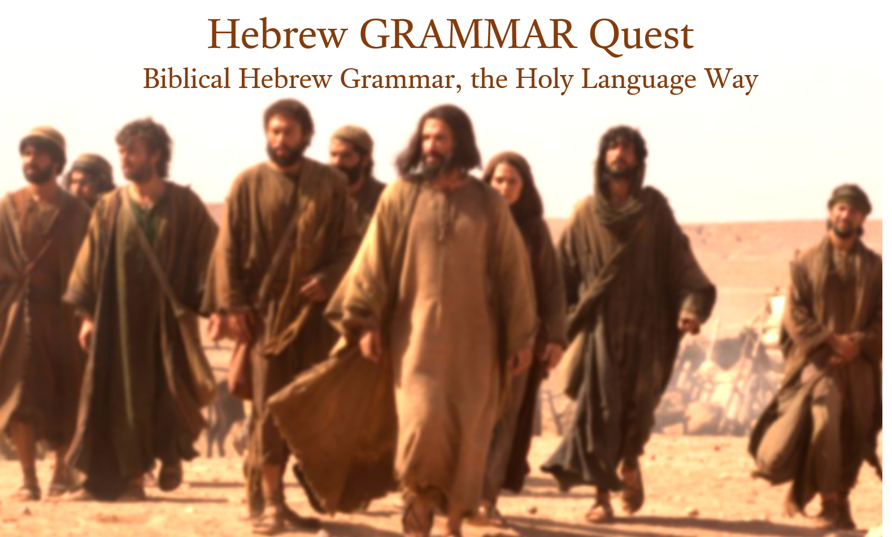

--- 
title: "Hebrew GRAMMAR Quest"
subtitle: "Biblical Hebrew Grammar, the Holy Language Way"
author: "Chris Flanagan"
date: "`r Sys.Date()`"
cover-image: images/HGQ_book_cover.png
site: bookdown::bookdown_site
documentclass: turabian-researchpaper
bibliography: [book.bib, packages.bib]
biblio-style: turabian
link-citations: yes
description: "A Hebrew Grammar resource for students of Holy Language Institute."
header-includes:
  - \usepackage{pdfpages}

colorlinks: yes
graphics: yes
lot: no
lof: no
#mainfont: Ezra SIL

---
```{r setup, include=FALSE}
library(knitr)
library(fontawesome)
knitr::opts_chunk$set(echo = FALSE)

```


#  {-}

```{r, out.width = "500pt", fig.align='center'}

```


# This is a Preview/Demo Version of Hebrew GRAMMAR Quest {-}

This book covers the first three  of the thirty-five total lessons:

1. The Hebrew Aleph-Bet
2. The Hebrew Vowels
3. Hebrew Syllabification and Pronunciation

Besides the first three modules, the Preface, which outlines what you can expect from the course, and some Appendices are complete and available.

We have two goals for this version:

1. Create a "proof of concept" version for our Holy Language ministry volunteers.  We want to gather feedback on content and overall direction before proceeding with compiling all 35 lessons.
2. Eventually, these three lessons will comprise a "demo" version of Hebrew GRAMMAR Quest to be made available to non-subscribers.  The goal is that they will see, like and become supporters of Holy Language Institute. 

The anticipated full course availability date is Q2 2021.

Thank you in advance for reading these three lessons.  Please email errors, omissions, comments, or suggestions to holylanguagecourses@gmail.com
