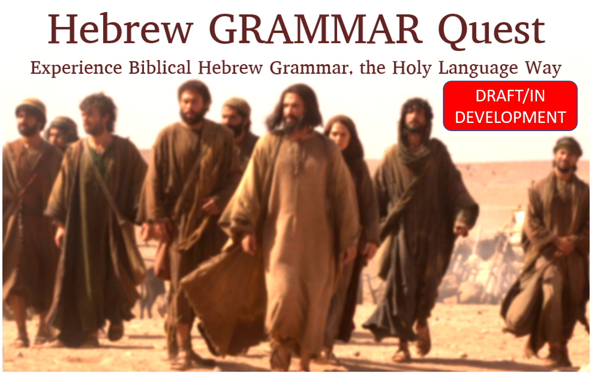

```{r setup, include=FALSE}
library(knitr)
library(fontawesome)
knitr::opts_chunk$set(echo = FALSE)

```

<div style="display:none">
# Copyright {.unnumbered}
</div>

```{r, out.width = "800pt", fig.align='center'}

```

<small>*Updated*: `r Sys.Date()`</small>


© 2021 Holy Language Institute. All rights reserved.


This work is licensed under the Creative Commons Attribution-NonCommercial-ShareAlike 4.0 International License. 

This license is for personal use only.  This publication may not be downloaded, redistributed, re-uploaded, published, or used for any other purposes without explicit permission from the copyright holder.

If you received this book and you are not a member of Holy Language Institute, [become a member](https://holylanguage.com/subscribe.html) today!  Subscribing will give you access to the full Hebrew GRAMMAR Quest course materials, as well as access to our founder, Izzy Avraham's, complete library of teaching materials.

Unless, otherwise noted, English Scripture quotations taken from the NASB. Copyright Copyright © 1960, 1962, 1963, 1968, 1971, 1972, 1973, 1975, 1977, 1995 by The Lockman Foundation. Used by permission.

Scripture quotations marked ESV are taken from The Holy Bible, English Standard Version, copyright © 2001 by Good News Publishers. Used by permission. All rights reserved.

As applicable:

* Vocabulary portions of this book and accompanying Anki deck are derivatives of [00_vocabulary.pdf](https://hebrewsyntax.org/bbh2new/00_vocabulary.pdf) by John Beckman, used under [CC-BY-SA](https://creativecommons.org/licenses/by-nc-sa/4.0/).
* Grammar portions of this book and accompanying Anki deck are derivatives of [00_study_guide.pdf](https://hebrewsyntax.org/bbh2new/00_study_guide.pdf) as well as the "overhead" files for each chapter (for example [Chapter 1-The Hebrew Alephabet](https://hebrewsyntax.org/bbh2new/01_overheads_bw.pdf), and so forth for each successive chapter) by John Beckman, used under [CC-BY-SA](https://creativecommons.org/licenses/by-nc-sa/4.0/).

The photographs of Israel to begin each lesson are courtesy of the [Pictorial Library of Bible Lands](www.bibleplaces.com){target="_blank"}. Used by permission.

Biblical Hebrew text is courtesy of tanach.us (version 26.0). 