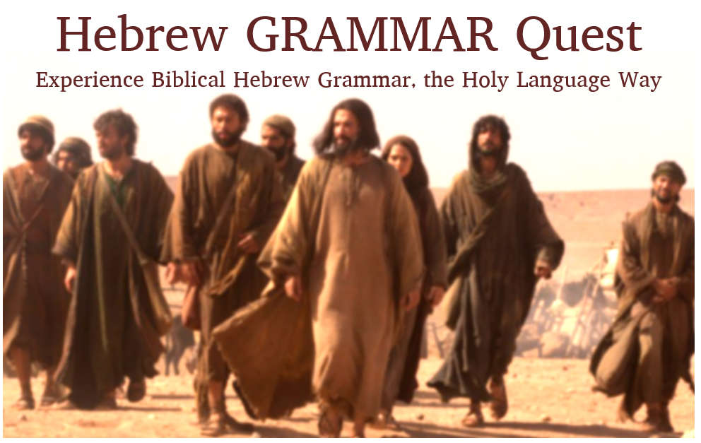

```{r setup, include=FALSE}
library(knitr)
library(fontawesome)
knitr::opts_chunk$set(echo = FALSE)

```


# Welcome! {-}


```{r, out.width = "75%", fig.align='center'} 
 
```


> Introduction from Chris Flanagan

<div class="container">
<iframe class="responsive-iframe" src="https://www.youtube.com/embed/
wxvw1KhsmfE?rel=0&showinfo=0&autohide=1&autoplay=0" frameborder="0"></iframe>
</div>

[Click to open video in a new tab](https://youtu.be/wxvw1KhsmfE){target="_blank"}


<small>*Updated*: `r Sys.Date()`</small>


## Preface {-}

::: {.infobox .sound}
<figure> <audio id="myAudio" controls controlsList="nodownload" 
src="./images/00.01cover.m4a"> 
Your browser does not support the <code>audio</code> element.</audio><button onclick="x25()" type="button">2.5x</button><button onclick="x2()" type="button">2x</button><button onclick="x15()" type="button">1.5x</button><button onclick="x1()" type="button">1x</button><button onclick="x075()" type="button">.75x</button><button onclick="x05()" type="button">.5x</button><script>
var x = document.getElementById("myAudio");
function x05() { 
    x.playbackRate = 0.5;
    x.play();}
function x075() { 
    x.playbackRate = 0.75;
    x.play();} 
function x1() { 
    x.playbackRate = 1;
     x.play();}
function x15() { 
    x.playbackRate = 1.5;
     x.play();} 
function x2() { 
    x.playbackRate = 2;
     x.play();} 
function x25() { 
    x.playbackRate = 2.5;
     x.play(); } 
</script></figure>
:::

Welcome to Hebrew GRAMMAR Quest, from Holy Language Institute. 

>The journey into the world of Biblical Hebrew grammar is a peek inside the mind of HaShem. By increased understanding of the Bible, we can better experience part of the culture of Bible authors such as Moses, David, and the prophets.  With some narratives, reading them in Hebrew almost places us right there in the middle of the action.  That's pretty cool!

Most importantly, learning the original language draws us closer to Yeshua and the world to which He ministered.  

It is for these reasons that we like to say this is not just a course, but a __QUEST__.  Hebrew GRAMMAR Quest is a journey into a deeper love your Bible and its primary Author.

On the next few pages, we will tell you a little about our program and give you some preliminary action steps so you can get your gear in order before you begin your quest with Lesson 1.

Let's get started!


## What to Expect {-}

::: {.infobox .sound}
<figure> <audio id="myAudio" controls controlsList="nodownload" src="./images/00.02howishgqdistinct.m4a"> Your browser does not support the <code>audio</code> element.</audio><button onclick="x25()" type="button">2.5x</button><button onclick="x2()" type="button">2x</button><button onclick="x15()" type="button">1.5x</button><button onclick="x1()" type="button">1x</button><button onclick="x075()" type="button">.75x</button><button onclick="x05()" type="button">.5x</button><script>
var x = document.getElementById("myAudio");
function x05() { 
    x.playbackRate = 0.5;
    x.play();}
function x075() { 
    x.playbackRate = 0.75;
    x.play();} 
function x1() { 
    x.playbackRate = 1;
     x.play();}
function x15() { 
    x.playbackRate = 1.5;
     x.play();} 
function x2() { 
    x.playbackRate = 2;
     x.play();} 
function x25() { 
    x.playbackRate = 2.5;
     x.play(); } 
</script></figure>
:::

As we begin,  we wanted to let you know what to expect from Hebrew GRAMMAR Quest, and what makes our course distinct from the many other fine Hebrew learning options available.

> Our goal with Hebrew GRAMMAR Quest is to take the best attributes of a self-paced course and merge them with the best characteristics of a seminary-level Hebrew course, all in a way that reflects the heart of the Holy Language Institute!


What you can expect from Hebrew GRAMMAR Quest:

* Academically CHALLENGING, but with a LOW-STRESS level
* Yeshua-centered with a primary emphasis on READING and UNDERSTANDING God's Word
    * We approach learning Biblical Hebrew from a _devotional_ level, more than an academic one
    * We use grammar rules, paradigms, and memorization as a means to achieve this goal
* Self-paced for independent learning but with mechanisms to provide FEEDBACK, ENCOURAGEMENT, and ways to CELEBRATE your ACCOMPLISHMENTS in the course
* Aligns with our [Holy Language LEARNING PHILOSOPHY](https://holylanguage.com/learning-philosophy.php): emphasize active forms of learning over copious amounts of textbook reading and long lectures.  You will complete various activities, including worksheets and Anki flashcards.
* COMPLIMENTS and INTEGRATES WITH _Hebrew Quest_ 
    * Hebrew GRAMMAR Quest is not a substitute for completing _Hebrew Quest_
    * If you were to take a microscope to _Hebrew Quest_ lessons 13-15 (the grammar lessons), Hebrew GRAMMAR Quest is the result!
    * See the Appendix FAQs for additional discussion on how _Hebrew Quest_ and Hebrew GRAMMAR Quest relate to one another

::: {.box .light}
The Hebrew GRAMMAR Quest Guidebook is where you will get _introduced_ to the material.  Anki (along with the other activities) is where you will ___LEARN___ the material

* As you work through this course, set aside time to review Anki on a DAILY basis^[Anki is an open source flashcard application. All platforms are free, except for the iOS app, which costs $25. The developers use the proceeds to fund future development.  Most reviews say the cost is worth it if you have Apple devices and use Anki regularly.]
:::

## More information {-}

These articles are contained in the "About This Course" appendix.

FAQs about the Course

* [Why is Holy Language Institute offering a Hebrew grammar course?](#why_grammar)
* [How does this grammar course relate to _Hebrew Quest_?](#hgq_and_hq)
* [What if I haven't finished _Hebrew Quest_?](#finish_hq)
* [What can I do with the knowledge taught in Hebrew GRAMMAR Quest?](#whocanuse)
* [What is a typical Hebrew GRAMMAR Quest lesson?](#typical_lesson)
* [What are the required/optional course resources?](#optional_resources)
* [How do I use and navigate the Hebrew GRAMMAR Quest guidebook?](#navigating)
* [Why is it called "Hebrew GRAMMAR Quest"?](#whygrammarquest)

FAQs about Anki

* [How do I navigate within Anki?](#anki_navigate)
* [How do I know which button to select on an Anki card?](#anki_buttons)
* [How do I get help with Anki?](#anki_help)
* [What is the `HGQ Custom Words` Deck?](#anki_custom_words)


